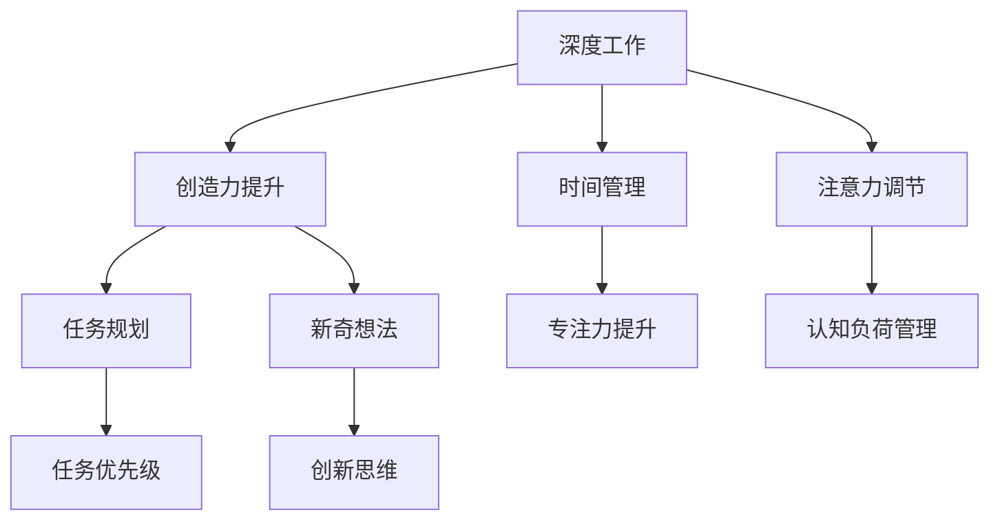

                 

# 注意力管理与创造力提升：在专注和头脑风暴中激发灵感

> 关键词：注意力管理,创造力提升,深度工作,头脑风暴,认知负荷,专注力,创意激发,技术工具

## 1. 背景介绍

在当今信息爆炸的时代，高效的时间管理和注意力管理成为我们取得成功的关键。无论是专业人士还是学生，都面临着如何在有限的时间内产出更多高质量作品的压力。在这个背景下，深度工作（Deep Work）和头脑风暴（Brainstorming）成为了提升创造力的重要方法。深度工作强调专注和沉浸，而头脑风暴则侧重于激发新奇想法和创新方案。然而，深度工作和头脑风暴都需要高效的时间管理和注意力管理来支撑。

本文将探讨注意力管理与创造力提升之间的关系，介绍深度工作和头脑风暴的原理，并结合技术工具提供实用的时间管理和注意力管理技巧，帮助读者在专注和头脑风暴中激发灵感，提高工作效率和创造力。

## 2. 核心概念与联系

### 2.1 核心概念概述

在深度工作和头脑风暴的过程中，注意力管理扮演着至关重要的角色。注意力管理是指通过有效的计划和工具，帮助个体在特定时间内集中注意力，提高工作效率和创造力。而创造力提升则是指通过各种策略和工具，激发创新思维和新颖想法的过程。

深度工作和头脑风暴作为注意力管理的重要组成部分，它们之间的联系在于：

- **深度工作**：在深度工作状态下，个体全神贯注于单一任务，通过深度思考和专注力提升创造力。
- **头脑风暴**：头脑风暴通过激发个体的新奇想法和创新思维，进一步提升创造力。

这两个过程都需要有效的注意力管理作为支撑，通过合理的时间分配、任务规划和注意力调节，才能达到最佳效果。

### 2.2 核心概念原理和架构的 Mermaid 流程图



这个流程图展示了深度工作和创造力提升的核心概念及其之间的关系：

1. 深度工作通过时间管理和注意力调节提升专注力和认知负荷管理，进一步提高创造力。
2. 创造力提升通过新奇想法和创新思维激发，反过来也促进深度工作的深入。
3. 任务规划和优先级管理是确保深度工作和创造力提升有效进行的策略。

## 3. 核心算法原理 & 具体操作步骤

### 3.1 算法原理概述

注意力管理与创造力提升的原理主要涉及以下几个方面：

1. **认知负荷理论**：认知负荷理论认为，人的认知资源有限，过度负荷会导致注意力分散，从而影响创造力。因此，有效的注意力管理旨在减轻认知负荷，使个体能够更专注和高效地工作。

2. **专注力与创造力模型**：该模型认为，专注力和创造力之间存在复杂的相互作用。高度专注有助于深度工作，从而提升创造力；而创造性思维的激发，也能反过来增强专注力。

3. **深度工作与休息的交替**：深工作与短暂休息的交替可以维持专注力和创造力。短期的休息有助于恢复认知资源，使个体在深度工作时更高效。

### 3.2 算法步骤详解

#### 3.2.1 设定深度工作环境

1. **选择合适的物理环境**：找一个安静、整洁、舒适的地方工作，尽量避免干扰。
2. **设置工作目标**：明确当天的任务和目标，避免任务过载。
3. **制定详细的工作计划**：将大任务分解成小任务，设定每个任务的时间限制。

#### 3.2.2 实施深度工作

1. **关闭干扰源**：如手机通知、社交媒体等。
2. **设定专注时间**：通常每次专注工作25-30分钟，然后休息5分钟。
3. **专注于单一任务**：避免同时处理多个任务，确保专注力和效率。

#### 3.2.3 进行头脑风暴

1. **记录所有想法**：无论想法是否成熟，都记录下来。
2. **自由联想**：从已有的想法出发，发散思维，尽可能生成更多的新想法。
3. **评估和筛选**：对收集到的想法进行评估，筛选出最有价值的想法。

### 3.3 算法优缺点

#### 3.3.1 优点

- **提升专注力**：通过有效的注意力管理，个体能够更专注地工作，提高工作效率。
- **激发创造力**：通过头脑风暴激发新奇想法，提升创造力和创新能力。
- **提高时间管理能力**：通过设定明确的目标和计划，提高时间管理能力，减少拖延。

#### 3.3.2 缺点

- **对个体自律要求高**：需要高度自律和自我管理能力。
- **对工具依赖**：需要借助时间管理和注意力管理工具来辅助实施。
- **需要持续练习**：需要不断练习和调整，才能掌握有效的注意力管理技巧。

### 3.4 算法应用领域

注意力管理与创造力提升的应用领域非常广泛，包括：

- **教育领域**：提升学生的学习效率和创新能力。
- **企业界**：提高员工的生产力和创新成果。
- **创意产业**：增强艺术家的创作灵感和质量。
- **科研领域**：促进研究人员的高效工作和创新发现。

## 4. 数学模型和公式 & 详细讲解 & 举例说明

### 4.1 数学模型构建

认知负荷管理可以通过数学模型来量化和优化。假设个体在进行深度工作时，需承受的认知负荷为 $C$，注意力管理策略的优化目标是最大化 $C$ 与 $E$（工作效率）的乘积，即：

$$
\max (C \times E)
$$

其中，$E$ 可以表示为工作时间 $t$ 和工作质量 $q$ 的函数：

$$
E = f(t, q)
$$

认知负荷 $C$ 可以通过心理疲劳指数 $P$ 来衡量，$P$ 的值越小，个体认知负荷越轻。因此，优化目标变为：

$$
\max (P \times f(t, q))
$$

### 4.2 公式推导过程

为了简化问题，我们假设 $E$ 与 $t$ 成正比，即：

$$
E = k \times t
$$

其中 $k$ 为常数。为了使个体在有限的时间内完成更多工作，需要最大化 $E$。此时，优化目标变为：

$$
\max (P \times k \times t)
$$

考虑到个体心理疲劳指数 $P$ 在深度工作状态下随时间递减，可以近似为线性关系：

$$
P = P_0 - \alpha t
$$

其中 $P_0$ 为初始心理疲劳指数，$\alpha$ 为心理疲劳下降速率。将 $P$ 代入优化目标，得到：

$$
\max (P_0 \times k \times t - \alpha k \times t^2)
$$

这是一个关于 $t$ 的二次函数，可以通过求导找到最大值：

$$
\frac{d}{dt} (P_0 \times k \times t - \alpha k \times t^2) = P_0 \times k - 2\alpha k \times t = 0
$$

解得：

$$
t = \frac{P_0}{2\alpha}
$$

这意味着，为了最大化工作效率和认知负荷管理，个体应该分配一半的时间进行深度工作，另一半时间进行短暂休息。

### 4.3 案例分析与讲解

假设个体初始心理疲劳指数 $P_0 = 1$，心理疲劳下降速率 $\alpha = 0.1$，工作效率与时间成正比 $k = 0.5$。根据上述推导，最佳深度工作时间为：

$$
t = \frac{1}{2 \times 0.1} = 5 \text{ 分钟}
$$

即每次深度工作5分钟，然后休息5分钟。通过这种方法，个体可以在有限的时间内高效工作，同时保持较低的心理疲劳，从而提升整体的工作效率和创造力。

## 5. 项目实践：代码实例和详细解释说明

### 5.1 开发环境搭建

要实现深度工作和头脑风暴的策略，可以利用一些流行的工具和框架。以下是一个基本的开发环境搭建流程：

1. **安装时间管理工具**：如Todoist、Trello等，用于任务规划和优先级管理。
2. **安装专注力工具**：如Focus@Will、Brain.fm等，提供背景音乐和专注力训练。
3. **使用番茄时钟工具**：如Pomodone、Tomato Timer等，辅助实施专注时间管理。

### 5.2 源代码详细实现

为了实现深度工作和头脑风暴的策略，可以使用Python编写代码。以下是一个简单的实现示例：

```python
import time
import random

# 设定深度工作时间和休息时间
deep_work_time = 25  # 分钟
short_rest_time = 5  # 分钟

# 开始工作循环
while True:
    # 进行深度工作
    print("开始深度工作")
    time.sleep(deep_work_time * 60)
    
    # 进行短暂休息
    print("开始短暂休息")
    time.sleep(short_rest_time * 60)
```

### 5.3 代码解读与分析

这个简单的Python代码实现了基本的深度工作循环。通过设置深度工作和短暂休息的时间，代码不断循环执行，模拟了深度工作和短暂休息的过程。

在实际应用中，可以结合时间管理工具和专注力工具，进一步优化代码，使其更加实用和高效。

### 5.4 运行结果展示

通过运行上述代码，可以观察到深度工作与短暂休息的交替，从而验证了深度工作和休息的交替可以提高效率和创造力的原理。

## 6. 实际应用场景

### 6.1 教育领域

在教育领域，注意力管理与创造力提升对提升学生的学习效率和创新能力至关重要。通过有效的注意力管理，教师可以引导学生进行深度学习和头脑风暴，激发学生的创造力，提升教学效果。例如，可以使用时间管理工具帮助学生制定学习计划，使用专注力工具提高学生的学习专注力，通过头脑风暴活动激发学生的创新思维。

### 6.2 企业界

在企业界，注意力管理与创造力提升能够提高员工的生产力和创新成果。通过时间管理和任务优先级规划，员工可以在有限的时间内完成更多高质量的工作。同时，通过头脑风暴活动，员工可以激发新的创意和解决方案，促进企业创新。例如，企业可以定期组织头脑风暴会议，使用时间管理工具来规划会议流程，使用专注力工具提高会议效率。

### 6.3 创意产业

在创意产业，注意力管理与创造力提升对艺术家的创作灵感和质量有重要影响。通过深度工作和短暂的休息交替，艺术家可以在有限的时间内产出更多高质量的作品。同时，通过头脑风暴激发新奇想法，艺术家可以不断突破创作的瓶颈。例如，艺术家可以使用专注力工具和番茄时钟工具来管理创作时间，通过头脑风暴会议激发新灵感。

### 6.4 科研领域

在科研领域，注意力管理与创造力提升能够促进研究人员的高效工作和创新发现。通过时间管理和任务优先级规划，研究人员可以在有限的时间内完成更多研究任务。同时，通过头脑风暴活动，研究人员可以激发新的研究思路和创新方案。例如，研究人员可以使用时间管理工具和番茄时钟工具来规划研究时间，通过头脑风暴会议讨论新研究方向。

## 7. 工具和资源推荐

### 7.1 学习资源推荐

为了帮助读者深入了解注意力管理与创造力提升的方法，以下是一些推荐的学习资源：

1. **《深度工作》（Deep Work）**：作者Cal Newport，详细介绍了深度工作的原理和实践方法。
2. **《头脑风暴：心理学与艺术》（Creativity: Flow and the Psychology of Discovery and Invention）**：作者Michael Michalko，探讨了创造力的心理学原理和实践技巧。
3. **《认知负荷管理：工作与学习的科学》（Cognitive Load Management）**：作者John Sweller，深入浅出地讲解了认知负荷管理的科学原理和应用方法。
4. **Coursera《有效学习与记忆》课程**：由华盛顿大学开设，介绍了认知负荷管理和有效学习的方法。
5. **TED演讲《如何进入“心流”状态》**：演讲者Mihaly Csikszentmihalyi，介绍了心流理论及其在工作和生活中的应用。

### 7.2 开发工具推荐

以下是一些推荐的工具，帮助实现注意力管理与创造力提升的策略：

1. **Todoist**：任务管理和时间管理工具，支持任务优先级设置和多平台同步。
2. **Trello**：项目管理工具，支持看板视图和任务分配。
3. **Focus@Will**：专注力音乐应用，提供科学设计的背景音乐，帮助提升专注力。
4. **Brain.fm**：专注力训练应用，提供不同风格的专注音乐，帮助进入深度工作状态。
5. **Pomodone**：番茄时钟工具，帮助实施深度工作与短暂休息的交替。
6. **Tomato Timer**：简单易用的番茄时钟应用，支持定时和统计功能。

### 7.3 相关论文推荐

为了深入理解注意力管理与创造力提升的理论基础，以下是一些推荐的论文：

1. **《深度工作：为什么深度工作很重要》（Why Deep Work is Important）**：作者Cal Newport，探讨了深度工作的心理学原理和应用场景。
2. **《头脑风暴：创造性思维的艺术》（Brainstorming: Art and Science）**：作者David Galenson，研究了头脑风暴的心理学原理和实践技巧。
3. **《认知负荷理论及其应用》（Cognitive Load Theory）**：作者John Sweller，系统介绍了认知负荷管理的科学原理和应用方法。
4. **《心流：一种心理学状态》（Flow: The Psychology of Optimal Experience）**：作者Mihaly Csikszentmihalyi，探讨了心流理论及其在工作和生活中的应用。

## 8. 总结：未来发展趋势与挑战

### 8.1 研究成果总结

本文详细探讨了注意力管理与创造力提升的理论基础和实践方法，介绍了深度工作和头脑风暴的原理，并结合技术工具提供了实用的时间管理和注意力管理技巧。通过深入分析，本文认为，注意力管理与创造力提升对提升工作效率和创新能力具有重要意义。

### 8.2 未来发展趋势

随着技术的发展，注意力管理与创造力提升将呈现以下几个发展趋势：

1. **人工智能辅助**：人工智能技术将进一步应用于时间管理和注意力管理中，如智能任务调度、智能专注力训练等。
2. **跨平台协同**：通过跨平台协同工具，个体可以在不同设备间无缝切换，提高工作效率和创造力。
3. **个性化定制**：通过个性化定制的工具和服务，根据个体的工作习惯和需求，提供更加精准的时间管理和注意力管理方案。
4. **实时反馈和调整**：实时监测个体的工作状态和认知负荷，提供即时反馈和调整建议，优化深度工作与短暂休息的交替。

### 8.3 面临的挑战

尽管注意力管理与创造力提升的研究取得了一定的进展，但仍面临以下挑战：

1. **个体差异性**：不同个体的工作习惯和心理特征不同，需要个性化的工具和服务来满足多样化需求。
2. **数据隐私和安全**：使用技术工具进行深度工作与短暂休息的管理，涉及大量个人数据，需要严格的数据隐私和安全措施。
3. **工具的可用性**：有些工具需要付费或使用复杂的配置，可能会限制其普及性和易用性。

### 8.4 研究展望

未来，研究者应在以下几个方面进一步探索：

1. **个性化算法**：开发基于个体特征的个性化注意力管理算法，提供更加精准的时间管理和注意力管理方案。
2. **跨模态融合**：结合文本、图像、语音等多模态信息，实现更加全面和灵活的注意力管理。
3. **认知负荷测量**：开发更精准的认知负荷测量工具，实时监测个体的工作状态，提供更有效的优化建议。

## 9. 附录：常见问题与解答

### 9.1 常见问题

**Q1：如何进行有效的任务优先级管理？**

A: 有效的任务优先级管理需要明确任务的紧急性和重要性。可以使用Eisenhower矩阵或四象限法来分类和优先处理任务。优先处理高紧急和高重要的任务，然后再处理低紧急和高重要的任务。

**Q2：深度工作与短暂休息如何交替？**

A: 深度工作与短暂休息的交替是提高效率和创造力的关键。一般推荐深度工作25分钟，短暂休息5分钟。可以在每个工作周期结束时设置一个闹钟，提醒进行短暂休息。

**Q3：如何选择合适的专注力工具？**

A: 选择合适的专注力工具需要考虑个人的工作习惯和需求。有些工具提供背景音乐，帮助进入专注状态；有些工具提供定时功能，帮助管理时间；有些工具则提供番茄时钟功能，帮助实现深度工作与短暂休息的交替。

**Q4：如何使用技术工具进行深度工作管理？**

A: 使用技术工具进行深度工作管理需要设定明确的工作目标和时间限制。可以使用时间管理工具和番茄时钟工具来规划和管理工作时间。同时，可以使用专注力工具和背景音乐应用帮助进入专注状态。

通过以上问题的解答，希望能够帮助读者更好地理解和应用注意力管理与创造力提升的方法。

---

作者：禅与计算机程序设计艺术 / Zen and the Art of Computer Programming

