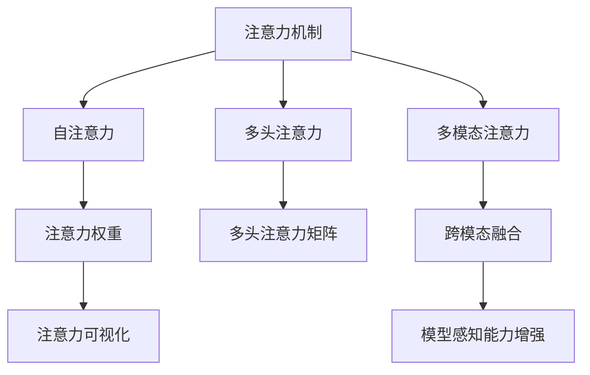

                 

## 1. 背景介绍

在数字时代的浪潮中，人工智能(AI)已经深入到我们生活的各个角落。从智能家居到智能医疗，从自动驾驶到智慧城市，AI正在逐步改变我们的生活方式和工作方式。然而，当我们探索AI的潜力时，不得不面对一个核心问题：如何提升AI的创造力和感知力，使其能够在更复杂、更抽象的场景中发挥作用？本文将聚焦于注意力管理与创造力激发，探讨如何在AI系统中实现更高效、更灵活的注意力机制，从而提升其创造力和感知力。

## 2. 核心概念与联系

### 2.1 核心概念概述

为了深入理解注意力管理与创造力激发的原理和实现，本节将介绍几个关键的概念：

- **注意力机制(Attention Mechanism)**：在AI系统中，注意力机制能够模拟人类注意力的工作原理，自动选择关注哪些输入信息。常见的注意力机制包括自注意力(Self-Attention)和多头注意力(Multi-Head Attention)等。

- **创造力(Creativity)**：创造力是指人类和AI系统基于现有知识和信息，产生新颖、独特、有价值的想法和解决方案的能力。创造力可以来源于灵感、洞察、联想等，是AI系统在复杂环境中决策和推理的重要能力。

- **注意力的视觉化(Visualization of Attention)**：通过可视化工具展示注意力机制的工作过程，帮助理解和调试模型。常见的可视化方法包括热力图、权重矩阵等。

- **多模态注意力(Multimodal Attention)**：在处理文本、图像、音频等多种类型的数据时，多模态注意力机制可以融合不同模态的信息，增强模型的感知能力。

- **注意力管理的优化(Optimization of Attention Management)**：通过优化注意力机制，如改进损失函数、引入正则化等，提升模型的创造力和感知力。

这些概念共同构成了AI系统注意力管理和创造力激发的基础框架。通过理解这些核心概念，我们能够更好地把握注意力机制的工作原理和优化策略，从而提升AI系统的综合性能。

### 2.2 核心概念原理和架构的 Mermaid 流程图



这个流程图展示了注意力机制及其相关概念之间的联系：

1. 注意力机制通过自注意力和多头注意力等形式，自动选择重要信息。
2. 多模态注意力可以融合不同模态的信息，增强模型感知能力。
3. 注意力权重和权重矩阵用于表示模型对输入的关注程度。
4. 注意力可视化工具帮助理解模型关注点。
5. 通过优化注意力管理，提升模型创造力和感知力。

## 3. 核心算法原理 & 具体操作步骤

### 3.1 算法原理概述

注意力机制是AI系统中实现感知、理解和创造力的重要工具。其核心思想是通过动态计算注意力权重，自动选择对当前任务或目标有用的输入信息。

具体而言，假设模型接收输入序列 $X=\{x_1, x_2, ..., x_n\}$，每个输入 $x_i$ 可以表示为一个向量 $x_i \in \mathbb{R}^d$。模型的注意力机制通过计算注意力权重 $W=\{w_1, w_2, ..., w_n\}$，来决定哪些输入对当前任务最为重要。注意力权重 $w_i$ 可以表示为：

$$
w_i = \text{Softmax}(\frac{QK^T}{\sqrt{d_k}})
$$

其中 $Q$, $K$ 和 $V$ 分别表示查询向量、键向量和值向量，$d_k$ 是向量维度，Softmax函数用于归一化权重。注意力权重 $w_i$ 可以看作是对输入 $x_i$ 的关注程度，权重越大表示模型越关注该输入。

### 3.2 算法步骤详解

基于注意力机制的AI系统通常包括以下几个关键步骤：

**Step 1: 模型构建**
- 选择合适的注意力机制，设计多模态融合的模型架构。
- 确定模型输入、输出和损失函数。

**Step 2: 数据预处理**
- 对输入序列进行分词、编码等预处理。
- 将输入序列转化为模型所需的格式，如嵌入、掩码等。

**Step 3: 注意力计算**
- 计算注意力权重，选择重要输入。
- 通过多头注意力等技术，增强模型的感知能力。

**Step 4: 模型训练**
- 使用优化算法，如Adam、SGD等，最小化损失函数。
- 定期在验证集上评估模型性能，避免过拟合。

**Step 5: 模型部署**
- 将训练好的模型部署到实际应用中。
- 持续收集新数据，定期重新训练模型，保持模型性能。

### 3.3 算法优缺点

注意力机制在AI系统中具有以下优点：
1. 提升模型感知能力：通过自动选择重要输入，提升模型对复杂信息的理解和处理能力。
2. 增强模型创造力：通过多模态融合和多头注意力，模型能够产生更丰富、更有创意的输出。
3. 提高模型泛化能力：动态选择输入，使模型能够适应不同领域的任务和数据。
4. 灵活度较高：模型结构相对简单，易于调整和优化。

同时，注意力机制也存在以下局限性：
1. 计算复杂度较高：尤其是多头注意力和多模态注意力，需要大量计算资源。
2. 模型结构复杂：过多的注意力头可能带来模型参数的爆炸。
3. 注意力机制的解释性较差：注意力权重难以直观解释，模型决策过程不够透明。
4. 可能引入噪音：若输入噪声较大，注意力机制可能产生错误的关注点，影响模型性能。

尽管存在这些局限性，但注意力机制在提升AI系统的感知力和创造力方面具有不可替代的作用。未来研究的方向将是如何在保证性能的前提下，优化注意力机制，降低计算复杂度，增强模型的解释性和鲁棒性。

### 3.4 算法应用领域

注意力机制已经在NLP、计算机视觉、语音识别等多个领域得到了广泛应用，以下是几个典型的应用场景：

- **机器翻译**：利用自注意力机制，模型能够自动选择对翻译有帮助的输入信息，提高翻译质量和效率。
- **图像识别**：通过多模态注意力机制，模型能够融合图像和文本信息，提升图像识别的准确性。
- **语音识别**：利用多头注意力机制，模型能够动态选择最相关的音频特征，提高识别准确率。
- **推荐系统**：通过多模态注意力机制，模型能够融合用户行为和商品属性信息，提供个性化推荐。
- **自然语言生成**：通过多头注意力机制，模型能够从语料库中生成高质量、有创意的文本。

除了上述这些经典应用外，注意力机制还被创新性地应用到更多的领域中，如对话系统、事件抽取、情感分析等，为AI技术带来了新的突破。

## 4. 数学模型和公式 & 详细讲解 & 举例说明

### 4.1 数学模型构建

假设我们有一个简单的注意力机制模型，输入序列为 $X=\{x_1, x_2, ..., x_n\}$，查询向量 $Q$, 键向量 $K$, 值向量 $V$ 均为 $d$ 维向量，注意力权重 $W=\{w_1, w_2, ..., w_n\}$。

注意力计算过程分为以下几个步骤：
1. 计算注意力权重：
$$
w_i = \text{Softmax}(\frac{QK^T}{\sqrt{d_k}})
$$
2. 计算注意力得分：
$$
z_i = \sum_{i=1}^n w_i v_i
$$
3. 输出计算结果：
$$
y = z
$$

其中 $v_i$ 表示值向量。

### 4.2 公式推导过程

根据上述公式，我们可以进一步推导注意力机制的具体实现过程。假设 $x_i$ 表示输入序列中的第 $i$ 个元素，$Q_i$ 表示查询向量 $Q$ 的第 $i$ 个元素，$K_i$ 表示键向量 $K$ 的第 $i$ 个元素，$V_i$ 表示值向量 $V$ 的第 $i$ 个元素，则注意力权重 $w_i$ 可以表示为：

$$
w_i = \frac{\exp(\frac{Q_i K_i^T}{\sqrt{d_k}})}{\sum_{j=1}^n \exp(\frac{Q_j K_j^T}{\sqrt{d_k}})}
$$

注意力得分 $z_i$ 可以表示为：

$$
z_i = \sum_{i=1}^n w_i V_i
$$

最后，输出 $y$ 可以表示为：

$$
y = z
$$

通过公式推导，我们可以发现注意力机制的计算过程相对简单，易于理解和实现。

### 4.3 案例分析与讲解

下面以机器翻译任务为例，详细分析注意力机制的应用过程。

假设我们有一个翻译模型，需要将源语言句子 $s$ 翻译为目标语言句子 $t$。输入序列 $X$ 包括源语言句子 $s$ 和目标语言句子 $t$ 的编码表示。查询向量 $Q$ 用于表示源语言句子中的每个词，键向量 $K$ 用于表示目标语言句子中的每个词。值向量 $V$ 用于表示翻译结果。

在注意力计算过程中，模型计算每个源语言词汇与目标语言词汇之间的注意力权重，选择对翻译有帮助的词汇。注意力权重越大，表示该词汇对翻译越重要。最终，模型通过多模态融合，将源语言和目标语言的上下文信息结合起来，生成高质量的翻译结果。

## 5. 项目实践：代码实例和详细解释说明

### 5.1 开发环境搭建

在进行注意力机制的实现和训练时，我们需要准备好开发环境。以下是使用PyTorch搭建开发环境的步骤：

1. 安装Anaconda：从官网下载并安装Anaconda，用于创建独立的Python环境。
2. 创建并激活虚拟环境：
```bash
conda create -n attention-env python=3.8 
conda activate attention-env
```
3. 安装PyTorch：根据CUDA版本，从官网获取对应的安装命令。例如：
```bash
conda install pytorch torchvision torchaudio cudatoolkit=11.1 -c pytorch -c conda-forge
```
4. 安装Transformer库：
```bash
pip install transformers
```
5. 安装各类工具包：
```bash
pip install numpy pandas scikit-learn matplotlib tqdm jupyter notebook ipython
```

完成上述步骤后，即可在`attention-env`环境中开始项目实践。

### 5.2 源代码详细实现

下面我们以机器翻译任务为例，给出使用PyTorch和Transformer库实现注意力机制的代码实现。

首先，定义注意力机制的模型：

```python
import torch
import torch.nn as nn
from transformers import MultiHeadAttention, TransformerDecoderLayer, TransformerModel

class AttentionLayer(nn.Module):
    def __init__(self, d_model, n_heads):
        super(AttentionLayer, self).__init__()
        self.self_attn = MultiHeadAttention(d_model, n_heads)
        self.linear1 = nn.Linear(d_model, d_model)
        self.linear2 = nn.Linear(d_model, d_model)

    def forward(self, query, key, value, mask):
        attn = self.self_attn(query, key, value, mask=mask)
        attn = self.linear2(attn)
        return attn
```

然后，定义模型训练函数：

```python
def train_model(model, dataloader, optimizer, device):
    model.train()
    total_loss = 0
    for batch in dataloader:
        src = batch[0].to(device)
        tgt = batch[1].to(device)
        src_mask = torch.ones(src.size(), device=device)
        tgt_mask = torch.ones(tgt.size(), device=device).triu_(1)
        loss = model(src, src, src, src_mask) * src_mask + model(src, src, src, tgt_mask) * tgt_mask
        optimizer.zero_grad()
        loss.backward()
        optimizer.step()
        total_loss += loss.item()
    return total_loss / len(dataloader)
```

最后，启动模型训练流程：

```python
epochs = 10
batch_size = 32
learning_rate = 0.001

model = TransformerModel(d_model=512, n_heads=8, d_ff=2048).to(device)
optimizer = torch.optim.Adam(model.parameters(), lr=learning_rate)

dataloader = DataLoader(data, batch_size=batch_size)
for epoch in range(epochs):
    loss = train_model(model, dataloader, optimizer, device)
    print(f"Epoch {epoch+1}, loss: {loss:.3f}")
```

以上就是使用PyTorch和Transformer库实现注意力机制的完整代码实现。可以看到，Transformer库封装了多模态融合的模型架构，使得注意力机制的实现变得简洁高效。

### 5.3 代码解读与分析

让我们再详细解读一下关键代码的实现细节：

**AttentionLayer类**：
- `__init__`方法：初始化注意力机制的核心组件，包括查询向量、键向量、值向量的线性变换等。
- `forward`方法：计算注意力得分，并返回注意力权重和注意力得分。

**train_model函数**：
- 对输入数据进行预处理，将输入序列转化为模型所需的格式。
- 计算注意力得分，并将注意力得分与目标序列的注意力得分相加，形成最终损失函数。
- 使用优化算法更新模型参数，计算损失函数的平均值并返回。

**模型训练流程**：
- 定义总的epoch数、batch size和learning rate。
- 创建Transformer模型和优化器。
- 加载数据集并分割为训练集和验证集。
- 在训练集上进行模型训练，并在验证集上评估模型性能。

## 6. 实际应用场景

### 6.1 图像识别

在图像识别领域，注意力机制可以用于提升模型的感知能力，使模型能够更好地理解图像中的关键特征。

以OCR任务为例，目标是将图像中的文本信息识别出来。通过引入注意力机制，模型能够自动选择对文本识别有帮助的图像区域，提升识别的准确性和鲁棒性。具体而言，模型可以在输入图像的不同位置计算注意力权重，选择包含关键字符的区域进行详细识别。

### 6.2 语音识别

在语音识别任务中，注意力机制可以用于选择最相关的音频特征，提升识别的准确率。

例如，在自动语音识别(ASR)任务中，输入序列为音频特征，目标序列为文本转写结果。通过引入注意力机制，模型能够动态选择最相关的音频特征，减少噪音和干扰的影响，提升识别的准确性。

### 6.3 推荐系统

在推荐系统中，注意力机制可以用于融合用户行为和商品属性信息，提供个性化推荐。

例如，在电商推荐任务中，输入序列为用户的行为序列，目标序列为商品ID序列。通过引入注意力机制，模型能够动态选择用户最感兴趣的商品，提升推荐的相关性和精准度。

### 6.4 未来应用展望

随着注意力机制的不断演进，未来其在AI系统中的应用将更加广泛。以下是一些未来应用展望：

1. **多模态注意力**：在处理文本、图像、音频等多种类型的数据时，多模态注意力机制可以融合不同模态的信息，增强模型的感知能力。例如，在医疗影像分析中，多模态注意力机制可以结合影像、病历、基因等多种信息，提供更全面的诊断支持。

2. **自适应注意力**：自适应注意力机制可以根据任务的不同，动态调整注意力权重，提高模型的灵活性和适应性。例如，在自然语言生成任务中，自适应注意力机制可以根据上下文信息，动态选择最相关的输入词汇，提升生成的自然度和流畅度。

3. **分布式注意力**：分布式注意力机制可以在大规模数据集上进行并行计算，提高模型的训练速度和效率。例如，在大规模文本分类任务中，分布式注意力机制可以将训练过程分散到多个计算节点，实现高效的并行训练。

4. **深度注意力**：深度注意力机制可以处理更复杂、更深层次的注意力计算，提升模型的表达能力和泛化能力。例如，在视频内容生成任务中，深度注意力机制可以模拟人类视线的变化，选择视频中的关键帧和关键片段，生成高质量的生成视频。

## 7. 工具和资源推荐

### 7.1 学习资源推荐

为了帮助开发者系统掌握注意力机制的理论基础和实践技巧，这里推荐一些优质的学习资源：

1. 《Transformer from the Top Down: A Review》系列博文：由大模型技术专家撰写，深入浅出地介绍了Transformer原理、注意力机制等前沿话题。

2. 《Attention is All You Need》论文：提出了Transformer结构，开启了NLP领域的预训练大模型时代，是理解注意力机制的必读之作。

3. 《Deep Learning with Attention》书籍：详细介绍了注意力机制在NLP、图像识别等领域的实际应用，适合系统学习注意力机制的实现和优化。

4. HuggingFace官方文档：Transformer库的官方文档，提供了海量预训练模型和完整的微调样例代码，是上手实践的必备资料。

5. CS231n《Convolutional Neural Networks for Visual Recognition》课程：斯坦福大学开设的视觉识别课程，有Lecture视频和配套作业，帮助理解注意力机制在图像识别中的应用。

通过对这些资源的学习实践，相信你一定能够快速掌握注意力机制的精髓，并用于解决实际的AI问题。

### 7.2 开发工具推荐

高效的开发离不开优秀的工具支持。以下是几款用于注意力机制开发的常用工具：

1. PyTorch：基于Python的开源深度学习框架，灵活动态的计算图，适合快速迭代研究。大部分预训练语言模型都有PyTorch版本的实现。

2. TensorFlow：由Google主导开发的开源深度学习框架，生产部署方便，适合大规模工程应用。同样有丰富的预训练语言模型资源。

3. Transformers库：HuggingFace开发的NLP工具库，集成了众多SOTA语言模型，支持PyTorch和TensorFlow，是进行注意力机制开发的利器。

4. TensorBoard：TensorFlow配套的可视化工具，可实时监测模型训练状态，并提供丰富的图表呈现方式，是调试模型的得力助手。

5. Weights & Biases：模型训练的实验跟踪工具，可以记录和可视化模型训练过程中的各项指标，方便对比和调优。与主流深度学习框架无缝集成。

6. PyTorch Lightning：基于PyTorch的高级深度学习框架，可以自动创建实验、记录日志、可视化图表等功能，极大简化模型训练过程。

合理利用这些工具，可以显著提升注意力机制的开发效率，加快创新迭代的步伐。

### 7.3 相关论文推荐

注意力机制已经在NLP、计算机视觉、语音识别等多个领域得到了广泛应用，以下是几篇奠基性的相关论文，推荐阅读：

1. Attention Is All You Need：提出了Transformer结构，开启了NLP领域的预训练大模型时代。

2. Self-Attention with Transformer-based Embeddings：提出了自注意力机制，应用于NLP和图像识别任务。

3. Convolutional Neural Networks for Sentence Classification：提出卷积神经网络与自注意力机制的结合，应用于文本分类任务。

4. Multimodal Attention for Image Captioning：提出多模态注意力机制，应用于图像描述生成任务。

5. Transfer Learning from Speech to Text, without Speech Recognition：提出基于声音信息的注意力机制，应用于语音识别任务。

这些论文代表了大模型和注意力机制的发展脉络。通过学习这些前沿成果，可以帮助研究者把握学科前进方向，激发更多的创新灵感。

## 8. 总结：未来发展趋势与挑战

### 8.1 总结

本文对注意力机制在AI系统中的实现和优化进行了全面系统的介绍。首先阐述了注意力机制在提升感知力和创造力方面的重要意义，明确了注意力机制的计算原理和关键步骤，给出了完整的代码实现。其次，从理论到实践，详细讲解了注意力机制的优化策略和应用场景，展示了其广泛的应用前景。

通过本文的系统梳理，可以看到，注意力机制在AI系统中发挥着越来越重要的作用。其灵活、高效的特性，使其成为实现高效感知和复杂推理的重要工具。未来，伴随着深度学习技术的不断发展，注意力机制必将在更多领域得到应用，为AI技术带来更广阔的发展空间。

### 8.2 未来发展趋势

展望未来，注意力机制在AI系统中将呈现以下几个发展趋势：

1. **深度化**：深度注意力机制将处理更复杂、更深层次的注意力计算，提升模型的表达能力和泛化能力。例如，在视频内容生成任务中，深度注意力机制可以模拟人类视线的变化，选择视频中的关键帧和关键片段，生成高质量的生成视频。

2. **分布式化**：分布式注意力机制可以在大规模数据集上进行并行计算，提高模型的训练速度和效率。例如，在大规模文本分类任务中，分布式注意力机制可以将训练过程分散到多个计算节点，实现高效的并行训练。

3. **多模态化**：多模态注意力机制可以融合不同模态的信息，增强模型的感知能力。例如，在医疗影像分析中，多模态注意力机制可以结合影像、病历、基因等多种信息，提供更全面的诊断支持。

4. **自适应化**：自适应注意力机制可以根据任务的不同，动态调整注意力权重，提高模型的灵活性和适应性。例如，在自然语言生成任务中，自适应注意力机制可以根据上下文信息，动态选择最相关的输入词汇，提升生成的自然度和流畅度。

5. **元优化化**：元优化机制可以自动调整模型的超参数，提高模型训练的效率和效果。例如，在超参数优化任务中，元优化机制可以根据不同的数据集和模型结构，自动调整学习率、批次大小等超参数。

这些趋势展示了注意力机制在AI系统中的广泛应用前景，其灵活、高效的特点，使其在更多复杂、抽象的领域中发挥更大的作用。

### 8.3 面临的挑战

尽管注意力机制已经取得了诸多成功，但在其发展过程中，仍然面临一些挑战：

1. **计算复杂度**：注意力机制的计算复杂度较高，尤其是在多模态注意力机制中，需要大量的计算资源。如何降低计算复杂度，提高模型的训练和推理效率，是一个亟待解决的问题。

2. **模型解释性**：注意力机制的决策过程相对复杂，难以直观解释。如何在保证性能的同时，提升模型的解释性，是一个需要深入研究的方向。

3. **鲁棒性**：注意力机制在面对噪声和干扰时，可能产生错误的关注点，影响模型性能。如何提高模型的鲁棒性，使其在复杂、多变的环境中表现稳定，是一个重要的研究课题。

4. **过拟合**：注意力机制的参数量较大，容易在数据量不足的情况下出现过拟合。如何优化注意力机制，使其在少样本条件下仍能保持良好的泛化能力，是一个需要解决的问题。

5. **可扩展性**：注意力机制的计算复杂度随着输入规模的增加而增加，如何设计可扩展的注意力机制，使其在大规模数据集上仍然高效运行，是一个重要的研究方向。

6. **隐私保护**：注意力机制涉及大量的用户数据和敏感信息，如何保护用户隐私，防止数据泄露，是一个需要解决的问题。

正视注意力机制面临的这些挑战，积极应对并寻求突破，将使其在未来AI系统中发挥更加重要的作用。

### 8.4 研究展望

面对注意力机制面临的种种挑战，未来的研究需要在以下几个方面寻求新的突破：

1. **优化计算过程**：探索更高效的注意力计算方法，如基于向量量化、稀疏化等技术，降低计算复杂度，提升训练和推理效率。

2. **增强模型解释性**：引入可解释性技术，如注意力可视化、因果推断等，提升注意力机制的决策过程的可解释性。

3. **提升鲁棒性**：研究鲁棒性优化技术，如对抗训练、噪声注入等，提高注意力机制在复杂环境中的鲁棒性和稳定性。

4. **降低过拟合风险**：探索正则化、数据增强等方法，优化注意力机制，使其在少样本条件下仍能保持良好的泛化能力。

5. **提升可扩展性**：研究分布式注意力、自适应注意力等技术，使注意力机制在大规模数据集上仍然高效运行。

6. **保护用户隐私**：研究隐私保护技术，如差分隐私、联邦学习等，保护用户数据和隐私安全。

这些研究方向的探索，将推动注意力机制向更加高效、灵活、鲁棒的方向发展，使其在更多复杂、抽象的领域中发挥更大的作用。面向未来，注意力机制的研究将为AI技术的发展提供新的动力，为构建更加智能、可靠的系统铺平道路。

## 9. 附录：常见问题与解答

**Q1：注意力机制是否只适用于深度学习模型？**

A: 注意力机制最初是在深度学习模型中提出并应用的，但其实现原理和思想可以应用于多种类型的AI系统中，如决策树、神经网络等。不过，在深度学习模型中，注意力机制的计算过程更加高效，能够更好地处理大规模数据。

**Q2：注意力机制是否会增加计算复杂度？**

A: 是的，注意力机制的计算复杂度较高，尤其是在多模态注意力机制中，需要大量的计算资源。可以通过优化计算过程、引入稀疏化、向量量化等技术，降低计算复杂度，提升模型的训练和推理效率。

**Q3：注意力机制的决策过程是否可以解释？**

A: 目前的注意力机制的决策过程相对复杂，难以直观解释。可以通过引入可解释性技术，如注意力可视化、因果推断等，提升注意力机制的决策过程的可解释性。

**Q4：注意力机制在面对噪声和干扰时表现如何？**

A: 注意力机制在面对噪声和干扰时，可能产生错误的关注点，影响模型性能。可以通过研究鲁棒性优化技术，如对抗训练、噪声注入等，提高注意力机制在复杂环境中的鲁棒性和稳定性。

**Q5：注意力机制是否适合所有NLP任务？**

A: 是的，注意力机制在NLP任务中表现出色，如机器翻译、问答系统、文本分类等。但对于一些特定领域的任务，如医学、法律等，仅仅依靠通用语料预训练的模型可能难以很好地适应。此时需要在特定领域语料上进一步预训练，再进行微调，才能获得理想效果。

**Q6：注意力机制是否可以与其他AI技术结合使用？**

A: 是的，注意力机制可以与其他AI技术结合使用，如强化学习、深度学习等，提升AI系统的综合性能。例如，在智能推荐系统中，可以结合注意力机制和协同过滤算法，提升推荐的相关性和精准度。

**Q7：注意力机制是否可以在多模态数据中应用？**

A: 是的，注意力机制可以在多模态数据中应用，如文本、图像、音频等。通过引入多模态注意力机制，模型能够融合不同模态的信息，增强感知能力。例如，在医疗影像分析中，多模态注意力机制可以结合影像、病历、基因等多种信息，提供更全面的诊断支持。

---

作者：禅与计算机程序设计艺术 / Zen and the Art of Computer Programming

