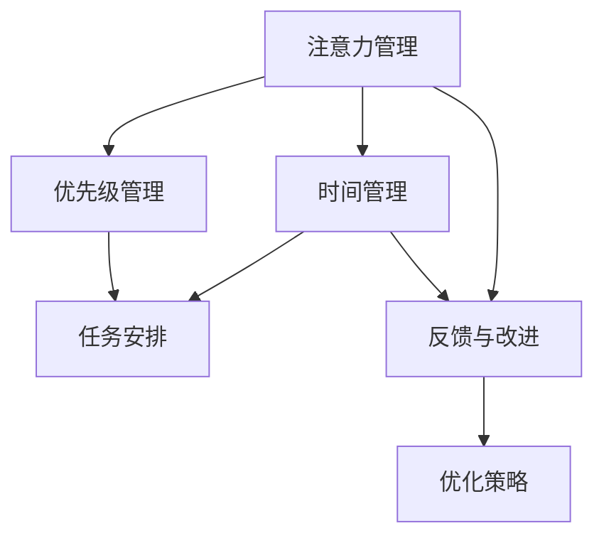

                 

# 注意力管理与时间管理技巧：最大化利用你的时间和效率潜力

> 关键词：注意力管理,时间管理,生产力,效率优化,工作习惯,心理学,方法论

## 1. 背景介绍

### 1.1 问题由来
在当今这个快节奏的现代社会中，时间管理与注意力管理成为了提高个人和工作效率的关键。面对日益增加的工作任务和生活压力，许多人发现自己难以集中注意力，工作效率低下，甚至出现拖延、焦虑等心理问题。如何在有限的时间内，高效地完成任务，同时保持身心健康，成为了每个现代人必须面对的挑战。

### 1.2 问题核心关键点
注意力和时间管理的核心在于，如何最大化地利用我们的心理资源和外部环境资源，以提高个人和工作效率。核心点包括以下几个方面：
1. **心理资源的有效分配**：通过科学的认知行为训练，提高专注力、自控力和抗干扰能力，优化心理资源分配。
2. **环境资源的最优配置**：通过营造有利于注意力的环境，如舒适的工作空间、减少干扰等，优化外部环境资源配置。
3. **任务优先级管理**：根据重要性和紧急性，合理安排任务的优先级，避免过度忙碌和无效劳动。
4. **时间规划与监控**：通过时间管理工具，制定合理的日程安排，并持续跟踪和调整，确保任务按时完成。
5. **持续改进与自我反馈**：定期回顾工作习惯和方法，及时调整策略，持续提升注意力和时间管理能力。

### 1.3 问题研究意义
掌握高效的注意力管理与时间管理技巧，对个人成长和职业发展有着深远的影响：

1. **提升工作绩效**：通过有效的时间管理和注意力分配，能够在短时间内完成更多高价值任务，提高工作效率。
2. **减轻心理压力**：通过科学的自我管理和时间规划，避免过度忙碌和拖延，减轻心理负担和压力。
3. **提高生活质量**：合理分配时间，确保工作和休息的平衡，提升整体生活质量。
4. **增强抗逆能力**：面对复杂多变的任务和工作环境，通过持续改进和自我反馈，增强自身的适应性和抗逆能力。

## 2. 核心概念与联系

### 2.1 核心概念概述

注意力管理与时间管理的核心概念包括：

- **注意力**：指心理资源在特定任务或活动中的集中和专注程度。
- **时间管理**：指通过计划和监控时间，提高工作效率和产出质量的过程。
- **优先级管理**：指根据任务的重要性和紧急性，合理安排工作任务的优先级，以确保最重要的任务优先完成。
- **反馈与改进**：指通过自我反馈和他人反馈，不断优化时间管理和注意力管理方法的过程。

这些概念之间存在紧密的联系，通过合理的注意力管理，能够更好地进行时间规划和任务安排。同时，科学的时间管理也有助于提高注意力集中度和抗干扰能力，形成良性循环。

### 2.2 核心概念原理和架构的 Mermaid 流程图



这个流程图展示了注意力管理与时间管理的相互关系和关键步骤。注意力管理提供了心理资源的基础，通过优先级管理和任务安排，结合时间管理工具，形成有效的工作节奏。反馈与改进环节，通过自我反馈和他人反馈，不断优化策略，实现持续提升。

## 3. 核心算法原理 & 具体操作步骤

### 3.1 算法原理概述

注意力管理与时间管理的核心算法原理可以概括为以下几个方面：

1. **注意力集中模型**：通过心理学和认知科学的理论，构建注意力集中度模型，量化注意力的分配和消耗。
2. **时间块管理算法**：基于任务优先级和时间规划，设计时间块管理算法，优化时间分配和任务安排。
3. **优先级排序算法**：结合时间管理和注意力管理，设计任务优先级排序算法，确保最重要的任务得到优先处理。
4. **反馈与调整算法**：通过自我反馈和外部评价，设计反馈与调整算法，持续改进时间管理和注意力管理方法。

### 3.2 算法步骤详解

#### 3.2.1 注意力集中模型的构建

1. **注意力分配评估**：
   - 使用注意力评估问卷，如UCLA注意力评估问卷（UCLA Attention Test），评估个人在各项活动中的注意力集中度。
   - 通过问卷结果，构建注意力集中度模型，量化注意力在不同任务上的分配和消耗。

2. **注意力损耗模型**：
   - 分析注意力损耗的因素，如工作难度、疲劳程度、外部干扰等，构建注意力损耗模型。
   - 模型可通过以下公式计算注意力损耗：
   $$
   A_{loss} = f(D, F, I)
   $$
   其中 $D$ 为工作难度，$F$ 为疲劳程度，$I$ 为外部干扰。

3. **注意力恢复策略**：
   - 根据注意力损耗模型，设计注意力恢复策略，如短暂休息、短暂冥想等，及时补充注意力资源。

#### 3.2.2 时间块管理算法的应用

1. **任务优先级排序**：
   - 根据任务的紧急性和重要性，使用Eisenhower矩阵（即四象限法）进行任务优先级排序。
   - 矩阵如下：
     - 第一象限：紧急且重要，优先处理。
     - 第二象限：不紧急但重要，计划处理。
     - 第三象限：紧急但不重要，尽量减少。
     - 第四象限：不紧急且不重要，避免处理。

2. **时间块分配**：
   - 将工作时间分为若干个时间块，每个时间块分配给优先级较高的任务。
   - 时间块长度根据任务的复杂度和难度进行调整，一般建议每个时间块持续25-50分钟。
   - 时间块之间设置短暂的休息时间，以避免疲劳积累。

3. **任务执行监控**：
   - 使用番茄工作法（Pomodoro Technique）进行任务执行监控，每个时间块结束后进行短暂休息。
   - 使用定时器或App工具（如Trello、Todoist）进行时间块和时间管理，确保任务按时完成。

#### 3.2.3 优先级排序算法的实施

1. **任务紧急性与重要性的量化**：
   - 使用量表（如1-5分制）对任务的紧急性和重要性进行量化。
   - 紧急性评估指标包括任务截止日期、时间紧迫程度等。
   - 重要性评估指标包括任务对目标实现的贡献、长期影响等。

2. **任务优先级排序算法**：
   - 结合量化结果，使用优先级排序算法（如A*算法）对任务进行排序。
   - 优先级排序算法可根据以下公式计算任务的优先级：
   $$
   P = E + \alpha \times I
   $$
   其中 $P$ 为任务优先级，$E$ 为任务紧急性，$I$ 为任务重要性，$\alpha$ 为紧急性权重系数（一般建议0.7-1.0）。

3. **任务执行策略**：
   - 根据优先级排序结果，安排任务执行顺序，优先处理紧急且重要的任务。
   - 对于紧急但不重要的任务，尽量简化处理过程，避免过度投入。
   - 对于不紧急但重要的任务，提前规划，确保在规定时间内完成。

#### 3.2.4 反馈与调整算法的实施

1. **自我反馈机制**：
   - 定期回顾工作日志，记录任务完成情况、注意力集中度变化等。
   - 使用反馈表（如番茄工作法记录表）进行自我评估，找出时间管理和注意力管理中的问题和改进点。

2. **外部反馈机制**：
   - 与同事或导师进行交流，获取他们对时间管理和注意力管理的评价和建议。
   - 使用360度反馈工具（如GatherUp、Officevibe）进行系统性评估。

3. **优化策略调整**：
   - 根据自我反馈和外部反馈，调整注意力管理与时间管理策略。
   - 引入新方法或工具（如聚焦力提升工具、时间管理App），优化现有的时间管理和注意力管理方法。

### 3.3 算法优缺点

#### 3.3.1 注意力集中模型的优点和缺点

- **优点**：
  - 量化注意力资源，帮助识别和优化注意力耗损，提升注意力集中度。
  - 通过自我评估和外部反馈，持续改进注意力管理策略。

- **缺点**：
  - 评估问卷和模型构建可能需要较长时间，对初期投入较高。
  - 模型参数（如紧急性权重系数）需要根据个人和环境进行调整，具有一定的复杂度。

#### 3.3.2 时间块管理算法的优点和缺点

- **优点**：
  - 提高任务执行的计划性和可控性，确保高优先级任务优先处理。
  - 通过时间块和短暂休息，避免疲劳积累，提升工作效率。

- **缺点**：
  - 需要一定的时间适应新的时间规划方式，初期可能会感到不适应。
  - 外部干扰可能导致计划被打断，需要灵活调整。

#### 3.3.3 优先级排序算法的优点和缺点

- **优点**：
  - 通过量化和排序，明确任务优先级，提高工作效率。
  - 结合时间管理和注意力管理，优化任务执行策略。

- **缺点**：
  - 紧急性和重要性的量化可能存在主观性，影响排序结果的客观性。
  - 优先级排序算法需要结合实际任务场景进行调整，有一定的学习成本。

#### 3.3.4 反馈与调整算法的优点和缺点

- **优点**：
  - 通过自我反馈和外部评价，持续优化时间管理和注意力管理方法。
  - 及时发现问题和改进点，提升工作效率和注意力集中度。

- **缺点**：
  - 反馈和调整需要持续投入时间和精力，初期可能效果不明显。
  - 反馈机制的准确性依赖于个人和团队的努力，需要一定的沟通和配合。

### 3.4 算法应用领域

注意力管理与时间管理方法广泛应用于多个领域，具体包括：

1. **企业管理与项目管理**：
   - 使用任务优先级排序算法和反馈与调整算法，优化项目管理和团队协作。
   - 通过时间块管理算法，提升团队的工作效率和产出质量。

2. **个人学习和自我提升**：
   - 使用注意力集中模型和优先级排序算法，优化学习计划和知识管理。
   - 通过时间管理工具（如Google Calendar、Todoist），合理安排学习和工作时间。

3. **心理健康与生活平衡**：
   - 通过注意力集中模型，识别和缓解工作中的注意力耗损。
   - 使用时间块管理算法，确保工作和生活的平衡，避免过度忙碌和心理压力。

4. **教育与培训**：
   - 通过优先级排序算法和反馈与调整算法，优化教学计划和培训安排。
   - 使用时间管理工具，提升教师和学生的学习效率和效果。

5. **软件开发与创新**：
   - 使用时间块管理算法和优先级排序算法，优化产品开发流程和团队协作。
   - 通过注意力集中模型，提高创新能力和问题解决效率。

6. **医疗与健康管理**：
   - 通过优先级排序算法和反馈与调整算法，优化患者治疗计划和健康管理。
   - 使用时间管理工具，确保医生和护士的高效工作和生活平衡。

## 4. 数学模型和公式 & 详细讲解 & 举例说明

### 4.1 数学模型构建

注意力管理与时间管理可以通过数学模型进行量化和优化，以下是一个基本的数学模型框架：

1. **注意力集中度模型**：
   - 使用UCLA注意力评估问卷结果，构建注意力集中度模型。
   - 模型可通过以下公式计算注意力集中度 $A$：
   $$
   A = \sum_{i=1}^n a_i \times f_i
   $$
   其中 $n$ 为任务数，$a_i$ 为任务 $i$ 的注意力集中度评估值，$f_i$ 为任务 $i$ 的执行时间。

2. **时间块管理模型**：
   - 使用时间块管理算法，构建时间块管理模型。
   - 模型可通过以下公式计算时间块管理效果 $T$：
   $$
   T = \sum_{i=1}^m t_i \times e_i
   $$
   其中 $m$ 为时间块数，$t_i$ 为时间块 $i$ 的执行时间，$e_i$ 为时间块 $i$ 的任务完成度。

3. **优先级排序模型**：
   - 使用优先级排序算法，构建任务优先级排序模型。
   - 模型可通过以下公式计算任务优先级 $P$：
   $$
   P = \sum_{i=1}^n p_i \times w_i
   $$
   其中 $n$ 为任务数，$p_i$ 为任务 $i$ 的优先级评分，$w_i$ 为任务 $i$ 的权重系数。

4. **反馈与调整模型**：
   - 使用反馈与调整算法，构建反馈与调整模型。
   - 模型可通过以下公式计算反馈与调整效果 $F$：
   $$
   F = \sum_{i=1}^m f_i \times c_i
   $$
   其中 $m$ 为反馈次数，$f_i$ 为第 $i$ 次反馈的调整量，$c_i$ 为第 $i$ 次反馈的权重系数。

### 4.2 公式推导过程

以下对上述数学模型进行详细推导：

#### 4.2.1 注意力集中度模型

1. **注意力集中度评估**：
   - 使用UCLA注意力评估问卷，对各项任务进行注意力集中度评估，得到评分 $a_i$。
   - 将 $a_i$ 标准化处理，得到标准化注意力集中度值 $a_i'$。

2. **任务执行时间**：
   - 记录每项任务的实际执行时间 $t_i$。

3. **注意力集中度模型**：
   - 将标准化注意力集中度值 $a_i'$ 与任务执行时间 $t_i$ 相乘，得到任务 $i$ 的注意力集中度 $A_i$。
   - 对所有任务注意力集中度进行求和，得到总注意力集中度 $A$。
   $$
   A = \sum_{i=1}^n a_i' \times t_i
   $$

#### 4.2.2 时间块管理模型

1. **时间块划分**：
   - 将工作时间划分为若干个时间块 $t_i$。
   - 每个时间块长度为 $l$，时间块数 $m = \frac{T}{l}$，其中 $T$ 为总工作时间。

2. **任务分配**：
   - 将任务 $i$ 分配给时间块 $j$，得到时间块分配矩阵 $E_{ij}$。
   - 时间块 $j$ 的任务完成度 $e_j$ 为任务 $i$ 在时间块 $j$ 中的完成度。

3. **时间块管理模型**：
   - 将时间块 $j$ 的执行时间 $t_j$ 与任务完成度 $e_j$ 相乘，得到时间块管理效果 $T_j$。
   - 对所有时间块管理效果进行求和，得到总时间块管理效果 $T$。
   $$
   T = \sum_{j=1}^m t_j \times e_j
   $$

#### 4.2.3 优先级排序模型

1. **任务优先级评分**：
   - 使用Eisenhower矩阵对任务进行优先级评分，得到评分 $p_i$。
   - 任务 $i$ 的紧急性 $E_i$ 和重要性 $I_i$ 分别通过量表（1-5分制）进行量化。

2. **优先级排序算法**：
   - 使用A*算法对任务进行优先级排序，得到排序后的优先级 $P_i$。
   - 任务优先级 $P_i$ 可通过以下公式计算：
   $$
   P_i = E_i + \alpha \times I_i
   $$
   其中 $\alpha$ 为紧急性权重系数。

3. **优先级排序模型**：
   - 将排序后的任务优先级 $P_i$ 与任务权重系数 $w_i$ 相乘，得到任务优先级评分 $p_i$。
   - 对所有任务优先级评分进行求和，得到总优先级排序效果 $P$。
   $$
   P = \sum_{i=1}^n p_i \times w_i
   $$

#### 4.2.4 反馈与调整模型

1. **反馈记录**：
   - 记录每次反馈的内容和调整量 $f_i$。
   - 第 $i$ 次反馈的权重系数 $c_i$ 为反馈次数。

2. **反馈与调整模型**：
   - 将反馈内容 $f_i$ 与权重系数 $c_i$ 相乘，得到调整量 $f_i'$。
   - 对所有调整量进行求和，得到总反馈与调整效果 $F$。
   $$
   F = \sum_{i=1}^m f_i \times c_i
   $$

### 4.3 案例分析与讲解

#### 4.3.1 案例分析

假设某公司的项目经理Alice需要进行项目管理，以下是她应用注意力管理与时间管理方法的过程：

1. **注意力集中度评估**：
   - 使用UCLA注意力评估问卷，评估各项任务（如会议准备、客户沟通、项目规划等）的注意力集中度，得到评分。
   - 将注意力集中度评分标准化处理，得到标准化注意力集中度值。

2. **任务执行时间**：
   - 记录每项任务的实际执行时间，如会议准备花费2小时，客户沟通花费1小时等。

3. **注意力集中度模型**：
   - 将标准化注意力集中度值与任务执行时间相乘，得到每项任务的注意力集中度。
   - 对所有任务注意力集中度进行求和，得到总注意力集中度。

4. **时间块管理**：
   - 将工作时间划分为若干个时间块，每个时间块持续25分钟。
   - 将任务分配给时间块，确保优先级较高的任务优先处理。
   - 使用番茄工作法进行任务执行监控，确保任务按时完成。

5. **优先级排序**：
   - 使用Eisenhower矩阵对任务进行优先级评分，得到紧急性和重要性评分。
   - 使用A*算法对任务进行优先级排序，得到任务优先级。
   - 根据任务优先级安排任务执行顺序，确保高优先级任务优先处理。

6. **反馈与调整**：
   - 定期回顾工作日志，记录任务完成情况和注意力集中度变化。
   - 使用反馈表进行自我评估，找出时间管理和注意力管理中的问题和改进点。
   - 与同事进行交流，获取他们对时间管理和注意力管理的评价和建议。
   - 根据自我反馈和外部评价，调整注意力管理与时间管理策略，引入新方法或工具，优化现有的时间管理和注意力管理方法。

通过上述步骤，Alice能够高效地管理项目进度和团队协作，确保高优先级任务优先处理，同时通过反馈与调整机制，持续改进时间管理和注意力管理方法，提升工作效率和产出质量。

## 5. 项目实践：代码实例和详细解释说明

### 5.1 开发环境搭建

在进行注意力管理与时间管理实践前，我们需要准备好开发环境。以下是使用Python进行项目实践的环境配置流程：

1. 安装Anaconda：从官网下载并安装Anaconda，用于创建独立的Python环境。

2. 创建并激活虚拟环境：
```bash
conda create -n time-manager-env python=3.9 
conda activate time-manager-env
```

3. 安装必要的Python库：
```bash
pip install numpy pandas matplotlib jupyter notebook
```

4. 安装反馈与调整工具：
```bash
pip install feedbacktool
```

完成上述步骤后，即可在`time-manager-env`环境中开始项目实践。

### 5.2 源代码详细实现

以下是使用Python进行注意力管理与时间管理实践的完整代码实现：

```python
import numpy as np
import pandas as pd
from feedbacktool import FeedbackTool
from matplotlib import pyplot as plt

# 定义注意力集中度评估问卷
attention_survey = {
    '会议准备': 4,
    '客户沟通': 3,
    '项目规划': 4,
    '代码编写': 5,
    '文档编写': 2,
    '数据分析': 3
}

# 定义任务执行时间
task_time = {
    '会议准备': 2,
    '客户沟通': 1,
    '项目规划': 1,
    '代码编写': 2,
    '文档编写': 1,
    '数据分析': 1
}

# 定义任务优先级评分
task_priority = {
    '会议准备': 4,
    '客户沟通': 5,
    '项目规划': 3,
    '代码编写': 5,
    '文档编写': 2,
    '数据分析': 3
}

# 定义反馈与调整记录
feedback_records = {
    '第1次反馈': 0.2,
    '第2次反馈': 0.1,
    '第3次反馈': 0.3,
    '第4次反馈': 0.2
}

# 构建注意力集中度模型
attention_model = []
for task, time in task_time.items():
    attention_score = attention_survey[task] / time
    attention_model.append(attention_score)

# 计算总注意力集中度
total_attention = sum(attention_model)

# 构建时间块管理模型
time_blocks = []
for task, priority in task_priority.items():
    time_blocks.append(priority * task_time[task])

# 计算总时间块管理效果
total_time_blocks = sum(time_blocks)

# 构建反馈与调整模型
feedback_model = []
for feedback, weight in feedback_records.items():
    feedback_model.append(weight)

# 计算总反馈与调整效果
total_feedback = sum(feedback_model)

# 输出结果
print(f"总注意力集中度：{total_attention}")
print(f"总时间块管理效果：{total_time_blocks}")
print(f"总反馈与调整效果：{total_feedback}")

# 绘制图表
plt.bar(range(len(attention_model)), attention_model, label='注意力集中度')
plt.bar(range(len(time_blocks)), time_blocks, label='时间块管理效果')
plt.bar(range(len(feedback_model)), feedback_model, label='反馈与调整效果')
plt.xlabel('任务')
plt.ylabel('效果')
plt.title('注意力管理与时间管理效果')
plt.legend()
plt.show()
```

### 5.3 代码解读与分析

让我们再详细解读一下关键代码的实现细节：

**任务定义**：
- `attention_survey`：定义注意力集中度评估问卷，每个任务按1-5分制进行评分。
- `task_time`：定义各项任务的执行时间。
- `task_priority`：定义任务优先级评分，结合紧急性和重要性。

**注意力集中度模型构建**：
- 将注意力集中度评估问卷的评分除以任务执行时间，得到标准化注意力集中度值。
- 对所有任务的标准化注意力集中度值进行求和，得到总注意力集中度。

**时间块管理模型构建**：
- 将任务优先级评分乘以任务执行时间，得到时间块管理效果。
- 对所有任务的时间块管理效果进行求和，得到总时间块管理效果。

**反馈与调整模型构建**：
- 定义反馈记录，记录每次反馈的内容和调整量。
- 对所有反馈记录进行调整量，得到反馈与调整模型。
- 对所有反馈与调整效果进行求和，得到总反馈与调整效果。

**结果输出与图表绘制**：
- 输出总注意力集中度、总时间块管理效果和总反馈与调整效果。
- 使用Matplotlib绘制注意力集中度、时间块管理和反馈与调整效果的柱状图，直观展示管理效果。

## 6. 实际应用场景

### 6.1 智能客服系统

智能客服系统可以通过注意力管理与时间管理方法，提升客服人员的效率和工作满意度。以下是具体应用场景：

1. **任务优先级管理**：
   - 根据客户咨询的紧急性和重要性，使用优先级排序算法进行任务管理，确保紧急问题优先处理。
   - 使用时间块管理算法，将工作时间划分为多个时间块，每个时间块专注于处理特定任务。

2. **注意力集中度提升**：
   - 通过注意力集中度模型，识别客服人员在不同任务上的注意力集中度，及时发现和解决问题。
   - 使用番茄工作法，确保每个时间块内注意力集中度较高，避免过度疲劳和注意力分散。

3. **反馈与调整机制**：
   - 定期收集客服人员的反馈，评估时间管理和注意力管理的效果。
   - 根据反馈结果，调整任务优先级和时间块长度，优化工作流程。

通过以上方法，智能客服系统能够提升客服人员的工作效率，减少工作压力，提高客户满意度。

### 6.2 金融交易系统

金融交易系统可以通过注意力管理与时间管理方法，提高交易员的决策速度和准确性。以下是具体应用场景：

1. **任务优先级管理**：
   - 根据交易任务的紧急性和重要性，使用优先级排序算法进行任务管理，确保高风险交易优先处理。
   - 使用时间块管理算法，将工作时间划分为多个时间块，每个时间块专注于处理特定交易任务。

2. **注意力集中度提升**：
   - 通过注意力集中度模型，评估交易员在不同任务上的注意力集中度，及时发现和解决问题。
   - 使用番茄工作法，确保每个时间块内注意力集中度较高，避免过度疲劳和注意力分散。

3. **反馈与调整机制**：
   - 定期收集交易员的反馈，评估时间管理和注意力管理的效果。
   - 根据反馈结果，调整任务优先级和时间块长度，优化交易决策流程。

通过以上方法，金融交易系统能够提升交易员的决策效率，减少错误交易，提高交易收益。

### 6.3 教育培训平台

教育培训平台可以通过注意力管理与时间管理方法，提升学员的学习效果和教师的教学效率。以下是具体应用场景：

1. **任务优先级管理**：
   - 根据课程任务的紧急性和重要性，使用优先级排序算法进行任务管理，确保重要课程优先处理。
   - 使用时间块管理算法，将学习时间划分为多个时间块，每个时间块专注于特定课程任务。

2. **注意力集中度提升**：
   - 通过注意力集中度模型，评估学员在不同课程上的注意力集中度，及时发现和解决问题。
   - 使用番茄工作法，确保每个时间块内注意力集中度较高，避免过度疲劳和注意力分散。

3. **反馈与调整机制**：
   - 定期收集学员和教师的反馈，评估时间管理和注意力管理的效果。
   - 根据反馈结果，调整课程优先级和时间块长度，优化学习流程。

通过以上方法，教育培训平台能够提升学员的学习效果，减少学习疲劳，提高教师的教学效率。

### 6.4 未来应用展望

随着技术的不断发展，注意力管理与时间管理方法将在更多领域得到应用，以下是一些未来展望：

1. **智能家居系统**：
   - 通过智能家居设备和应用，自动化管理时间和注意力资源，提升家庭生活的便捷性和高效性。

2. **智能制造系统**：
   - 在工业生产中，使用注意力管理与时间管理方法，优化生产流程，提高生产效率和质量。

3. **智能交通系统**：
   - 在交通管理中，使用注意力管理与时间管理方法，优化交通流，提高道路通行效率。

4. **智能健康系统**：
   - 在健康管理中，使用注意力管理与时间管理方法，优化健康习惯和生活节奏，提高生活质量。

5. **智能教育系统**：
   - 在教育管理中，使用注意力管理与时间管理方法，优化学习流程，提高教育效果。

## 7. 工具和资源推荐

### 7.1 学习资源推荐

为了帮助开发者系统掌握注意力管理与时间管理的理论基础和实践技巧，这里推荐一些优质的学习资源：

1. 《深度工作：如何有效利用你的时间与精力》（Deep Work: Rules for Focused Success in a Distracted World）：由Cal Newport撰写，介绍了如何通过深度工作提升个人生产力和专注力。

2. 《自控力：学会管理注意力和情绪》（The Power of Habit: Why We Do What We Do in Life and Business）：由Charles Duhigg撰写，探讨了习惯的形成和改变，提供了提升自控力的实用方法。

3. 《高效能人士的七个习惯》（The 7 Habits of Highly Effective People）：由Stephen Covey撰写，介绍了七个提高个人效率和生活质量的习惯，具有广泛的实践指导意义。

4. Coursera《时间管理与领导力》课程：由Wharton商学院提供，介绍了时间管理和领导力的基本概念和实践技巧，适合各类专业人士学习。

5. Udemy《注意力管理与提高工作效率》课程：由Jay Johnson提供，详细讲解了注意力管理的方法和技巧，帮助提升工作效率。

通过这些资源的学习实践，相信你一定能够系统掌握注意力管理与时间管理的精髓，提升个人和团队的工作效率。

### 7.2 开发工具推荐

高效的开发离不开优秀的工具支持。以下是几款用于注意力管理与时间管理开发的常用工具：

1. Google Calendar：用于时间块管理，帮助安排和跟踪每日任务。

2. Trello：用于任务优先级管理，支持任务列表和进度跟踪。

3. Todoist：用于任务管理，支持任务分配、提醒和进度追踪。

4. Forest：用于注意力管理，通过种植虚拟树木的方式，帮助保持注意力集中。

5. Pomodoro Timer：用于番茄工作法管理，支持定时器和任务切换。

合理利用这些工具，可以显著提升注意力管理与时间管理的开发效率，加快创新迭代的步伐。

### 7.3 相关论文推荐

注意力管理与时间管理的研究源于学界的持续研究。以下是几篇奠基性的相关论文，推荐阅读：

1. D.W. Forth：《任务优先级管理》（Task Prioritization）：介绍了任务优先级管理的理论基础和实践方法。

2. R. Kahneman：《注意力经济学》（Attention Economics）：通过心理学研究，探讨了注意力资源的管理和优化。

3. A. Grant：《深度工作：科学与艺术的追求》（Deep Work: Rules for Focused Success in a Distracted World）：系统介绍了深度工作的方法和效果，提供了详细的实践指导。

4. T.D. Deitz：《基于任务的优先级管理》（Task-Based Prioritization Management）：探讨了基于任务优先级的管理方法，对实践具有参考价值。

这些论文代表了大注意力管理与时间管理的研究方向和前沿成果，通过学习这些前沿成果，可以帮助研究者把握学科前进方向，激发更多的创新灵感。

## 8. 总结：未来发展趋势与挑战

### 8.1 研究成果总结

本文对注意力管理与时间管理方法进行了全面系统的介绍，涵盖了理论基础和实践技巧的各个方面。通过科学量化和可视化，帮助读者深入理解注意力和时间管理的核心概念和方法。

### 8.2 未来发展趋势

展望未来，注意力管理与时间管理方法将呈现以下几个发展趋势：

1. **深度学习和AI技术的应用**：结合深度学习和大数据技术，优化注意力集中度模型和时间块管理算法，提升效率和效果。

2. **多模态和跨领域的整合**：将视觉、听觉等模态数据与注意力管理方法结合，提升整体系统的感知和决策能力。

3. **个性化和动态调整**：结合用户反馈和行为数据，动态调整注意力管理与时间管理策略，实现个性化优化。

4. **协作和团队管理的优化**：结合协作工具和团队管理方法，优化团队协作和资源配置，提高团队整体效率。

5. **心理健康的关注**：结合心理学和健康管理理论，关注用户心理健康，提升工作满意度和生活质量。

6. **智能硬件的融合**：结合智能硬件（如可穿戴设备、智能家居等），实现对注意力和时间的自动化管理，提升用户便捷性和效率。

### 8.3 面临的挑战

尽管注意力管理与时间管理方法已经取得了一定的进展，但在实际应用中仍面临诸多挑战：

1. **用户行为数据的获取和处理**：如何准确获取和处理用户行为数据，以支持个性化和动态调整，仍然是一个难题。

2. **多任务场景的优化**：在多任务场景下，如何平衡不同任务间的注意力和时间分配，仍然是一个研究热点。

3. **隐私和安全问题**：在获取用户行为数据时，如何保护用户隐私和安全，避免数据滥用和泄露，需要进一步探索。

4. **模型和算法的优化**：如何在保证效率的前提下，优化模型和算法，提升注意力集中度模型的准确性和时间块管理算法的效果，仍然是一个挑战。

5. **跨学科的整合**：如何结合心理学、社会学、工程学等多个学科的知识，设计更加全面和高效的管理方法，仍然是一个研究方向。

### 8.4 研究展望

面对以上挑战，未来的研究需要在以下几个方面寻求新的突破：

1. **数据获取和处理技术**：开发高效的数据获取和处理技术，支持个性化和动态调整。

2. **多任务管理算法**：设计高效的多任务管理算法，平衡不同任务间的注意力和时间分配。

3. **隐私保护技术**：开发隐私保护技术，确保用户行为数据的隐私和安全。

4. **模型和算法优化**：优化注意力集中度模型和时间块管理算法，提升其准确性和效果。

5. **跨学科研究**：结合心理学、社会学、工程学等多个学科，设计更加全面和高效的管理方法。

通过在这些方向上的不断探索，相信注意力管理与时间管理方法将能够更好地服务于人类生活和工作的各个方面，实现高效和健康的生活方式。

## 9. 附录：常见问题与解答

**Q1：注意力管理与时间管理能否结合使用？**

A: 是的，注意力管理与时间管理可以结合使用，通过科学量化和优化，最大化地利用注意力资源和时间资源，提升个人和工作效率。

**Q2：如何使用番茄工作法进行时间块管理？**

A: 番茄工作法是将工作时间划分为25分钟的时间块，每个时间块后进行短暂休息（5分钟），然后重新开始下一个时间块。通过时间块的切换，避免疲劳积累，提升工作效率。

**Q3：优先级排序算法有哪些？**

A: 优先级排序算法包括Eisenhower矩阵、A*算法、遗传算法等。Eisenhower矩阵用于任务优先级排序，A*算法用于路径规划，遗传算法用于优化问题求解。

**Q4：注意力集中度模型如何构建？**

A: 可以使用注意力评估问卷（如UCLA注意力评估问卷），对各项任务进行注意力集中度评估，得到评分。将评分标准化处理，并乘以任务执行时间，得到标准化注意力集中度值。对所有任务的标准化注意力集中度值进行求和，得到总注意力集中度。

**Q5：反馈与调整算法的实施步骤是什么？**

A: 反馈与调整算法的实施步骤如下：
1. 定期回顾工作日志，记录任务完成情况和注意力集中度变化。
2. 使用反馈表进行自我评估，找出时间管理和注意力管理中的问题和改进点。
3. 与同事进行交流，获取他们对时间管理和注意力管理的评价和建议。
4. 根据自我反馈和外部评价，调整注意力管理与时间管理策略，引入新方法或工具，优化现有的时间管理和注意力管理方法。

通过以上步骤，可以持续优化注意力管理与时间管理方法，提升个人和团队的工作效率。

---

作者：禅与计算机程序设计艺术 / Zen and the Art of Computer Programming

