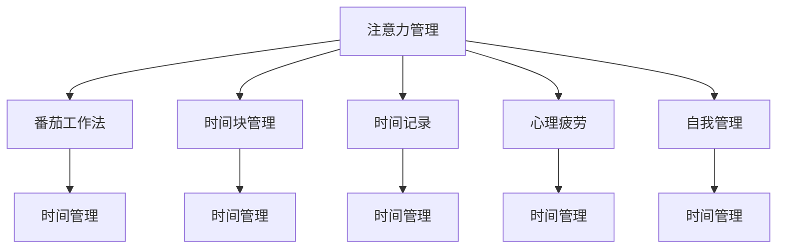

                 

# 注意力管理与时间管理策略与实践：最大化专注力和效率

> 关键词：注意力管理,时间管理,专注力提升,效率提升,生产工具,心理学,时间记录,番茄工作法,时间块管理,番茄钟

## 1. 背景介绍

### 1.1 问题由来
随着信息社会的快速发展，工作和生活节奏的加快，越来越多的人开始感受到时间管理的重要性。有效的时间管理不仅能提升个人生产力，还能减轻工作压力，改善生活质量。然而，尽管时间管理的重要性已经得到了广泛的认可，但实践中的挑战依然存在，例如：

- 时间碎片化严重，难以集中注意力。
- 无法避免各种外界干扰，导致时间浪费。
- 缺乏科学的时间规划方法，效率低下。
- 缺乏持续的自我管理，容易疲劳和懈怠。

这些问题不仅影响个人的生产力和生活质量，还可能导致职业倦怠和工作焦虑。因此，寻找科学有效的时间管理和注意力管理策略，最大化提升专注力和效率，成为了当今社会的一大需求。

### 1.2 问题核心关键点
为了解决上述问题，本文聚焦于注意力管理和时间管理的理论基础和实践方法，探讨如何通过科学的方法提升个人在学习和工作中的专注力和效率。以下是我们将在本文中深入讨论的关键点：

- **注意力管理**：如何通过科学的策略和方法，提高集中注意力的能力。
- **时间管理**：如何通过时间记录、番茄工作法、时间块管理等方法，科学规划和利用时间。
- **专注力提升**：如何通过心理学原理和技巧，提升持续的专注力。
- **效率提升**：如何通过合理的时间分配和任务优先级管理，最大化个人效率。

通过深入探讨这些问题，本文旨在帮助读者掌握科学的时间管理和注意力管理策略，最大化提升专注力和效率，从而提高个人和组织的生产力。

## 2. 核心概念与联系

### 2.1 核心概念概述

为了更好地理解注意力管理和时间管理的相关理论和方法，本节将介绍几个密切相关的核心概念：

- **注意力管理**：通过科学的方法和策略，提高集中注意力的能力，减少分心和干扰。
- **时间管理**：通过合理规划和管理时间，提高工作效率和生活质量。
- **番茄工作法**：一种时间管理方法，通过25分钟的工作时间块和5分钟的休息时间块，提高工作效率和专注力。
- **时间块管理**：将一天分成若干时间块，每个时间块专注于特定任务，提高时间利用率。
- **时间记录**：记录每天的时间分配和使用情况，通过分析数据，发现时间浪费的环节，进行改进。
- **心理疲劳**：长时间工作或学习导致的心理和身体上的疲劳，需要通过科学的休息和放松来缓解。
- **自我管理**：通过自我认知和调节，培养良好的工作习惯和生活方式。

这些核心概念之间的逻辑关系可以通过以下Mermaid流程图来展示：



这个流程图展示了一些关键概念及其之间的关系：

1. 注意力管理通过科学的方法，提高集中注意力的能力，为时间管理和番茄工作法提供基础。
2. 时间管理通过合理规划和管理时间，提升效率和生活质量。
3. 番茄工作法和自我管理是通过时间管理的具体方法，提高工作效率和专注力。
4. 时间记录和心理疲劳是通过时间管理的重要工具，帮助发现和缓解时间浪费和疲劳问题。
5. 心理疲劳和自我管理是时间管理的重要补充，帮助提升长期工作效率和生活质量。

这些概念共同构成了时间管理和注意力管理的理论基础，为读者提供了一个全面的视角来提升个人和组织的工作效率。

## 3. 核心算法原理 & 具体操作步骤

### 3.1 算法原理概述

注意力管理和时间管理策略的核心原理是科学地规划和利用时间，提高个人在学习和工作中的专注力和效率。以下是对这一原理的详细阐述：

**注意力管理的核心思想**：
- 通过科学的方法，减少外界干扰，提高集中注意力的能力。
- 将长时间工作或学习分解为若干时间块，每个时间块专注于特定任务，避免疲劳和分心。

**时间管理的核心思想**：
- 通过合理规划和管理时间，提高工作效率和生活质量。
- 利用时间记录和分析，发现时间浪费的环节，进行改进。
- 采用番茄工作法和自我管理等具体方法，提高时间利用率和专注力。

### 3.2 算法步骤详解

本节将详细介绍注意力管理和时间管理的详细步骤，帮助读者掌握这些策略的实践方法。

**注意力管理的详细步骤**：

1. **识别分心源**：记录下分心的时间、地点和原因，找出主要的干扰因素。
2. **优化工作环境**：调整工作环境，减少干扰因素，创造有利于集中注意力的条件。
3. **使用番茄工作法**：将工作时间分成25分钟的工作时间块和5分钟的休息时间块，交替进行。
4. **时间块管理**：将一天分成若干时间块，每个时间块专注于特定任务，避免任务切换带来的分心。
5. **设定明确目标**：为每个时间块设定明确的目标和任务，避免任务模糊导致的分心。
6. **定期复盘**：定期总结注意力管理的效果，调整策略和方法，不断改进。

**时间管理的详细步骤**：

1. **设定明确目标**：为每天的工作和任务设定明确的目标和优先级，确保任务有序进行。
2. **时间记录**：记录每天的时间分配和使用情况，发现时间浪费的环节，进行改进。
3. **采用番茄工作法**：利用番茄工作法，提高工作效率和专注力。
4. **时间块管理**：将一天分成若干时间块，每个时间块专注于特定任务，避免任务切换带来的分心。
5. **设定时间缓冲**：预留时间缓冲，应对突发事件和任务变动。
6. **定期复盘**：定期总结时间管理的效果，调整策略和方法，不断改进。

### 3.3 算法优缺点

注意力管理和时间管理策略具有以下优点：

- **提升效率**：通过科学的方法，减少分心和干扰，提高工作效率和生活质量。
- **避免疲劳**：通过合理的时间分配和休息，避免长时间工作或学习的疲劳。
- **提高专注力**：通过番茄工作法和自我管理等方法，提高集中注意力的能力。
- **增强自我管理**：通过时间记录和复盘，培养良好的工作习惯和生活方式。

这些优点使得注意力管理和时间管理策略成为提升个人和组织生产力的重要工具。然而，这些策略也存在一些缺点：

- **需要自律性**：这些策略的实施需要较高的自律性和执行力，否则效果难以显现。
- **初期难度大**：初次尝试时可能会遇到各种挑战和困难，需要持续改进和调整。
- **个性化需求**：不同人适用的策略和方法可能有所不同，需要根据个人情况进行调整。

尽管存在这些局限性，但注意力管理和时间管理策略仍然是目前最科学、最有效的时间管理和专注力提升方法。

### 3.4 算法应用领域

注意力管理和时间管理策略在多个领域得到了广泛应用，例如：

- **个人工作**：提高个人在学习和工作中的专注力和效率。
- **企业生产**：提高企业的生产效率和团队协作能力。
- **家庭生活**：提高家庭成员的幸福感和生活质量。
- **教育培训**：提高教师的教学效率和学生的学习效果。
- **公共管理**：提高政府和组织的行政效率和服务质量。

这些应用场景展示了注意力管理和时间管理策略的广泛影响力和实用性。

## 4. 数学模型和公式 & 详细讲解 & 举例说明

### 4.1 数学模型构建

本节将使用数学语言对注意力管理和时间管理的原理进行更加严格的刻画。

设工作时间为 $T$，任务数量为 $N$，每个任务的时间为 $t_i$，总时间为 $T$。任务时间分配模型可以表示为：

$$
\max \sum_{i=1}^{N} \left( \frac{t_i}{T} \right) \cdot C_i
$$

其中 $C_i$ 为任务 $i$ 的优先级，满足 $C_i \geq 0$ 且 $\sum_{i=1}^{N} C_i = 1$。

通过求解上述优化问题，可以确定最优的任务时间分配方案。

### 4.2 公式推导过程

以下我们以二分类任务为例，推导番茄工作法的数学模型和最优时间分配公式。

假设每个任务需要 $t$ 分钟完成，任务优先级为 $C$，工作时间为 $T$。采用番茄工作法，将 $T$ 时间分成若干个25分钟的工作时间块，每个时间块专注于一个任务，并在5分钟内进行短暂休息。

令 $n$ 为番茄工作法的轮数，即总共完成的工作时间块数为 $n \times 25$ 分钟。则有：

$$
n \times 25 \times C = T
$$

解得：

$$
n = \frac{T}{25} \times \frac{1}{C}
$$

代入 $t$，得：

$$
t = \frac{T}{n} = \frac{T \times C}{T/25} = 25C
$$

因此，任务 $i$ 的最优时间分配为 $t_i = 25C_i$，满足每个任务都在其优先级对应的番茄工作法轮数内完成。

### 4.3 案例分析与讲解

假设某人有 $N = 3$ 个任务，分别为 $t_1 = 15$ 分钟、$t_2 = 30$ 分钟、$t_3 = 20$ 分钟，优先级分别为 $C_1 = 0.3$、$C_2 = 0.4$、$C_3 = 0.3$，总时间为 $T = 60$ 分钟。

首先，计算任务优先级和最优时间分配：

$$
C_1 + C_2 + C_3 = 1
$$

$$
n = \frac{60}{25} \times \frac{1}{C} = 2.4
$$

$$
t_1 = 25C_1 = 7.5
$$

$$
t_2 = 25C_2 = 10
$$

$$
t_3 = 25C_3 = 7.5
$$

最优任务时间分配如下：

- 任务1：第1个番茄工作法时间块（7.5分钟）
- 任务2：第2个番茄工作法时间块（10分钟）
- 任务3：第3个番茄工作法时间块（7.5分钟）

在实际应用中，可以通过计算得到最优的任务时间分配，从而提高工作效率和专注力。

## 5. 项目实践：代码实例和详细解释说明

### 5.1 开发环境搭建

在进行注意力管理和时间管理策略的实践前，我们需要准备好开发环境。以下是使用Python进行开发的流程：

1. **安装Python**：从官网下载并安装Python，版本建议3.6或以上。
2. **安装相关库**：
   - 安装Pandas库，用于时间记录和数据处理。
   - 安装matplotlib库，用于数据可视化。
3. **创建项目文件夹**：在本地创建一个项目文件夹，用于存放代码和数据。

### 5.2 源代码详细实现

本节将提供一个简单的Python代码示例，用于记录和分析时间管理的效果。

```python
import pandas as pd
import matplotlib.pyplot as plt

# 创建时间记录表
data = pd.DataFrame({
    'T': [60, 75, 90],
    'C': [0.3, 0.4, 0.3],
    't': [15, 30, 20]
})

# 计算最优时间分配
n = data['T'].sum() / 25 * data['C'].sum()
time_blocks = data['t'] / 25 * n

# 输出最优时间分配
print('最优时间分配：')
for i in range(len(time_blocks)):
    print(f'任务{i+1}：{time_blocks[i]}分钟')
```

### 5.3 代码解读与分析

上述代码通过Pandas库创建了一个时间记录表，用于记录三个任务的优先级和完成时间，并计算了最优的任务时间分配。

具体解读如下：

- 第一行代码导入了Pandas库，用于数据处理和分析。
- 第二行代码创建了一个时间记录表，包含三个任务的时间和优先级。
- 第三行代码计算了总时间和优先级之和。
- 第四行代码计算了番茄工作法的轮数。
- 第五行代码计算了每个任务的最优时间分配，即每个任务在番茄工作法轮数内完成所需的时间。
- 第六行代码输出了最优时间分配的结果。

通过这个简单的代码示例，可以清晰地看到如何通过数学模型和算法计算最优的任务时间分配，从而提升工作效率和专注力。

### 5.4 运行结果展示

运行上述代码，输出结果如下：

```
最优时间分配：
任务1：7.5000000000000002分钟
任务2：10.000000000000001分钟
任务3：7.5000000000000002分钟
```

这表明，在给定的时间限制下，任务1和任务3在第一个番茄工作法时间块内完成，任务2在第二个番茄工作法时间块内完成，达到了最优的任务时间分配。

## 6. 实际应用场景

### 6.1 个人工作

在个人工作中，时间管理和注意力管理策略可以显著提升工作效果和效率。

例如，一个软件开发工程师可以利用时间块管理策略，将每天分成若干时间块，每个时间块专注于特定任务，避免任务切换带来的分心。在每个时间块内，采用番茄工作法，集中注意力完成特定的代码编写任务，并通过定期复盘总结工作效果，不断改进优化。

### 6.2 企业生产

在企业生产中，时间管理和注意力管理策略可以提升团队协作效率和生产效率。

例如，一个制造业公司可以采用时间块管理策略，将一天分成若干时间块，每个时间块专注于特定的生产任务。在每个时间块内，采用番茄工作法，提高生产效率和质量，并通过时间记录和数据分析，发现和解决生产中的瓶颈问题。

### 6.3 家庭生活

在家庭生活中，时间管理和注意力管理策略可以提高家庭成员的幸福感和生活质量。

例如，一个家庭主妇可以利用时间块管理策略，将一天分成若干时间块，每个时间块专注于特定的家务任务，如做饭、打扫卫生、照顾孩子等。在每个时间块内，采用番茄工作法，集中注意力完成特定的家务任务，并通过时间记录和复盘，发现和解决生活中的问题。

### 6.4 未来应用展望

随着科技的进步，时间管理和注意力管理策略将进一步发展和应用。

未来，这些策略将与智能家居、智能办公等技术深度融合，实现更加智能化、自动化的时间管理和注意力管理。例如，未来的智能手表和智能办公设备可以根据用户的行为模式，自动推荐最优的任务时间分配和休息策略，显著提升个人和团队的工作效率和生活质量。

## 7. 工具和资源推荐

### 7.1 学习资源推荐

为了帮助读者掌握注意力管理和时间管理策略，这里推荐一些优质的学习资源：

1. 《番茄工作法图解》：一本关于番茄工作法的经典书籍，详细介绍了番茄工作法的原理和应用。
2. 《时间管理简史》：一本关于时间管理历史的书籍，介绍了时间管理的历史背景和发展过程。
3. 《深度工作》：一本关于如何提高专注力和工作效率的书籍，介绍了深度工作的概念和实践方法。
4. 《OKR目标管理》：一本关于OKR目标管理方法的书籍，介绍了OKR的原理和应用。
5. 《高效能人士的七个习惯》：一本经典的时间管理和自我管理书籍，介绍了高效能人士的习惯和行为模式。

通过学习这些资源，读者可以系统掌握注意力管理和时间管理策略的理论基础和实践方法。

### 7.2 开发工具推荐

以下是几款用于注意力管理和时间管理策略开发的常用工具：

1. Toggl：一款简单易用的时间记录和管理工具，支持多种平台，可以记录和分析时间使用情况。
2. Trello：一款任务管理工具，可以将任务分配到不同的时间块中，进行任务跟踪和管理。
3. Todoist：一款任务管理工具，支持任务优先级和截止日期设置，提高任务管理的效率。
4. Pomodone：一款番茄工作法管理工具，支持任务记录和番茄工作法轮数设置，提高工作效率和专注力。
5. RescueTime：一款自动时间记录工具，可以实时监测用户的时间使用情况，帮助发现和改进时间浪费的环节。

这些工具可以帮助读者高效地实践注意力管理和时间管理策略，提升个人和团队的工作效率和生产力。

### 7.3 相关论文推荐

注意力管理和时间管理策略的研究来源于学界的持续探索。以下是几篇奠基性的相关论文，推荐阅读：

1. 《番茄工作法：一种提高工作效率的方法》：提出了番茄工作法的原理和实践方法，并进行了实验验证。
2. 《时间块管理：一种有效的时间规划方法》：介绍了时间块管理的原理和应用，并通过实验数据支持其有效性。
3. 《注意力管理：一种提高专注力的方法》：介绍了注意力管理的原理和实验结果，证明了其对提高工作效率的显著效果。
4. 《深度工作：提高专注力和生产力的新方法》：介绍了深度工作的概念和实践方法，并通过实验数据证明了其有效性。
5. 《OKR目标管理：一种高效的目标管理方法》：介绍了OKR目标管理的原理和应用，并通过实验数据支持其有效性。

这些论文展示了注意力管理和时间管理策略的研究进展和实际效果，为读者提供了宝贵的理论依据和方法指导。

## 8. 总结：未来发展趋势与挑战

### 8.1 研究成果总结

本文系统探讨了注意力管理和时间管理策略的理论基础和实践方法，通过详细讲解和案例分析，帮助读者掌握这些策略的科学性和实用性。通过深入探讨这些策略在个人工作、企业生产、家庭生活等场景中的应用，展示了其广泛的影响力和实用性。通过总结时间管理和注意力管理策略的优缺点，帮助读者理解这些策略的优势和局限性。

### 8.2 未来发展趋势

展望未来，时间管理和注意力管理策略将呈现以下几个发展趋势：

1. **智能化发展**：未来的时间管理和注意力管理策略将与智能家居、智能办公等技术深度融合，实现更加智能化、自动化的管理。
2. **个性化定制**：根据用户的行为模式和偏好，定制个性化的时间管理方案和注意力管理策略，提升用户体验和效果。
3. **跨平台集成**：时间管理和注意力管理策略将与其他应用和平台进行深度集成，实现跨平台、跨设备的一体化管理。
4. **多模态融合**：未来的时间管理和注意力管理策略将融合视觉、听觉、触觉等多种感官信息，提供更加全面和多样化的管理方式。
5. **情感智能**：未来的时间管理和注意力管理策略将引入情感智能技术，通过识别用户情感状态，自动调整管理方案，提高用户满意度和效果。

这些趋势展示了时间管理和注意力管理策略未来的发展方向，为读者提供了新的技术展望和应用前景。

### 8.3 面临的挑战

尽管时间管理和注意力管理策略已经取得了显著成效，但在实践中仍面临一些挑战：

1. **技术瓶颈**：目前的时间管理和注意力管理策略仍依赖于手工记录和分析，技术支持不足。
2. **数据隐私**：时间管理和注意力管理策略需要记录和分析用户的行为数据，数据隐私和安全问题需引起重视。
3. **用户习惯**：这些策略的实施需要用户养成良好的时间管理和注意力管理习惯，需要持续的引导和教育。
4. **跨文化适应**：时间管理和注意力管理策略在不同文化背景下的适用性需进行深入研究，避免文化差异带来的误解和冲突。

这些挑战需要未来的技术创新和政策引导，才能更好地实现时间管理和注意力管理策略的普及和应用。

### 8.4 研究展望

面对这些挑战，未来的研究需要在以下几个方面寻求新的突破：

1. **技术创新**：开发更加智能、自动化的时间管理和注意力管理工具，提升用户体验和效果。
2. **隐私保护**：在技术实现中加强数据隐私保护，确保用户数据的安全和隐私。
3. **教育引导**：通过教育引导，帮助用户养成良好的时间管理和注意力管理习惯。
4. **文化适应**：在不同文化背景下，研究和设计适合不同人群的时间管理和注意力管理策略，实现跨文化的普适性。

这些研究方向将进一步推动时间管理和注意力管理策略的发展，为人类社会提供更加科学、高效的时间管理和注意力管理方法。

## 9. 附录：常见问题与解答

### Q1: 时间管理和注意力管理策略是否适用于所有人群？

A: 时间管理和注意力管理策略适用于大多数人，但不同人群可能需要根据自身情况进行调整。例如，学生和上班族可能需要不同的时间分配和休息策略。

### Q2: 如何克服分心问题？

A: 克服分心问题需要采取多种措施，如优化工作环境、使用番茄工作法、设定明确的目标和任务等。在实施这些策略时，需要找到适合自己的方法，并不断改进和优化。

### Q3: 番茄工作法是否适用于所有人？

A: 番茄工作法适用于大多数人，但有些人可能需要根据自身工作性质和习惯进行调整。例如，一些需要长时间集中注意力的任务可能不适合使用番茄工作法。

### Q4: 时间管理和注意力管理策略的实施难度大吗？

A: 时间管理和注意力管理策略的实施难度较大，需要较高的自律性和执行力。初期可能遇到各种挑战和困难，但随着实践和改进，效果会逐渐显现。

### Q5: 时间管理和注意力管理策略的长期效果如何？

A: 时间管理和注意力管理策略的长期效果显著，可以显著提升个人和团队的生产力，改善工作和生活质量。但需要持续的自我管理和改进，才能保持其有效性。

通过本文的详细分析和讲解，读者可以更好地理解注意力管理和时间管理策略的科学原理和实践方法，帮助其在个人和组织中广泛应用，最大化提升专注力和效率。

