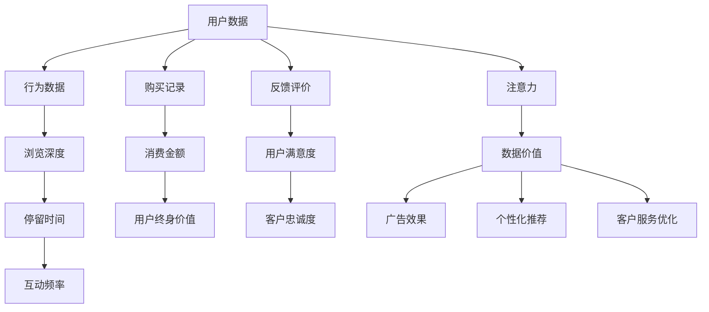

                 

# 注意力经济下的用户数据价值

## 1. 背景介绍

在当今信息爆炸的时代，注意力成为最稀缺的资源。用户数据作为连接供给与需求的桥梁，不仅记录着用户的兴趣偏好，也是品牌与用户互动的重要依据。如何利用数据挖掘技术，合理配置资源，将用户的注意力引向价值更大的方向，成为各行业关注的焦点。本文将深入探讨注意力经济下用户数据价值的关键理论，并展示如何通过技术手段优化用户数据使用策略，最大化用户价值。

## 2. 核心概念与联系

在探讨用户数据价值时，需要理解几个关键概念：

- **用户数据**：用户与品牌互动过程中产生的行为数据，如浏览、点击、购买、评价等，是衡量用户价值的重要指标。
- **注意力**：用户在平台上停留的时间、浏览深度、互动频率等，反映其对内容的兴趣和偏好。
- **数据价值**：用户数据蕴含的商业价值，包括广告投放、个性化推荐、客户服务优化等方面的应用。

这些概念相互关联，构成了注意力经济下用户数据价值的研究基础。以下是一个Mermaid流程图，展示了用户数据、注意力和数据价值之间的关系：



该图展示了用户数据通过多种维度转化为注意力，再进一步提炼出数据价值的流程。通过理解这一关系链条，可以更好地配置资源，优化用户数据价值挖掘策略。

## 3. 核心算法原理 & 具体操作步骤
### 3.1 算法原理概述

基于用户数据的价值挖掘，主要依赖于数据挖掘和机器学习技术。通过算法将数据转化为用户注意力值，进而评估数据价值。常见的算法包括聚类、分类、回归等，这些算法在分析用户行为数据、预测用户价值等方面具有重要应用。

### 3.2 算法步骤详解

1. **数据收集与预处理**：
   - 从各渠道收集用户行为数据，如浏览记录、购买数据、评价反馈等。
   - 清洗数据，处理缺失值、异常值等，确保数据质量。

2. **特征工程**：
   - 设计特征工程流程，提取和构建与用户价值相关的特征，如用户活跃度、购买频率、消费金额等。
   - 使用数据降维技术，如主成分分析(PCA)、特征选择等，减少特征维度，提高算法效率。

3. **模型选择与训练**：
   - 选择合适的算法模型，如K-means聚类、决策树、随机森林、神经网络等，进行模型训练。
   - 使用交叉验证等方法，评估模型性能，选择最优模型。

4. **结果分析与优化**：
   - 分析模型结果，理解用户数据的价值分布和趋势。
   - 针对结果进行调整和优化，如调整算法参数、引入外部数据等。

5. **应用部署**：
   - 将模型部署到实际应用场景中，实现自动化的用户价值评估。
   - 集成其他业务系统，如广告投放、个性化推荐等，实现数据价值的最大化利用。

### 3.3 算法优缺点

基于用户数据的价值挖掘算法，具有以下优点：
- 能够量化用户数据对品牌的影响，科学评估数据价值。
- 通过自动化流程，减少人工干预，提高工作效率。
- 可以实时调整数据使用策略，适应市场变化。

同时，也存在一些缺点：
- 数据收集和预处理过程复杂，对技术要求较高。
- 算法模型需要大量历史数据进行训练，初期投入成本较高。
- 模型结果受数据质量、算法选择等因素影响较大，结果可能不够稳定。

### 3.4 算法应用领域

用户数据价值挖掘算法在多个领域都有广泛应用：

- **广告投放**：通过评估用户数据对广告转化的影响，优化广告投放策略，提升广告效果。
- **个性化推荐**：分析用户行为数据，预测用户偏好，实现个性化推荐，提高用户满意度。
- **客户服务优化**：利用用户数据评估客户服务质量，优化服务流程，提高客户忠诚度。
- **营销策略制定**：分析用户数据，制定更有针对性的营销策略，提高营销投入回报率。

这些应用场景展示了用户数据价值挖掘的广泛前景，各行业均能从中获益。

## 4. 数学模型和公式 & 详细讲解
### 4.1 数学模型构建

本文以广告投放为例，构建一个简单的用户价值评估模型。假设广告投放数据集为 $\{(x_i, y_i)\}_{i=1}^N$，其中 $x_i$ 为广告特征向量，$y_i$ 为广告转化的二元标签（转化或未转化）。模型的目标是最小化预测误差，即：

$$
\min_{\theta} \frac{1}{N} \sum_{i=1}^N \ell(y_i, f_{\theta}(x_i))
$$

其中 $\ell$ 为损失函数，$f_{\theta}(x_i)$ 为模型预测值，$\theta$ 为模型参数。

### 4.2 公式推导过程

以逻辑回归模型为例，预测用户转化的概率为：

$$
f_{\theta}(x_i) = \text{sigmoid}(\theta^T x_i)
$$

其中 $\theta^T x_i$ 为特征向量的线性组合，$\text{sigmoid}$ 为逻辑回归的激活函数。损失函数通常采用交叉熵损失：

$$
\ell(y_i, f_{\theta}(x_i)) = -y_i \log f_{\theta}(x_i) - (1-y_i) \log (1-f_{\theta}(x_i))
$$

将交叉熵损失代入上述目标函数，得：

$$
\min_{\theta} \frac{1}{N} \sum_{i=1}^N [-y_i \log f_{\theta}(x_i) - (1-y_i) \log (1-f_{\theta}(x_i))]
$$

通过梯度下降等优化算法求解上述最优化问题，即可得到模型参数 $\theta$，从而实现广告投放效果评估。

### 4.3 案例分析与讲解

假设某电商平台收集了用户点击广告记录，记录了广告ID、点击时间、广告位、用户ID等信息。通过分析这些数据，可以构建一个广告投放效果评估模型。首先，将点击记录转化为特征向量，计算用户点击广告转化的概率。然后，根据转化率等指标评估不同广告投放策略的效果，优化广告预算分配。

具体实现时，可以采用TensorFlow或PyTorch等深度学习框架进行模型训练和评估。使用逻辑回归或神经网络等算法，训练模型预测用户转化概率，并计算广告的点击率、转化率等指标。最终，通过模型预测结果，评估不同广告投放策略的效果，优化广告预算分配，实现广告投放的精准化和智能化。

## 5. 项目实践：代码实例和详细解释说明
### 5.1 开发环境搭建

进行用户数据价值挖掘项目开发，首先需要搭建开发环境。以下是一个示例开发环境配置步骤：

1. 安装Python 3.7或更高版本。
2. 安装Anaconda，创建虚拟环境。
3. 安装TensorFlow或PyTorch等深度学习框架。
4. 安装Pandas、Numpy、Scikit-learn等数据处理和机器学习库。
5. 安装Jupyter Notebook或PyCharm等IDE，方便进行代码开发和调试。

### 5.2 源代码详细实现

下面以一个简单的用户行为数据分析项目为例，展示如何使用Python进行用户数据价值挖掘。

```python
import pandas as pd
from sklearn.model_selection import train_test_split
from sklearn.linear_model import LogisticRegression
from sklearn.metrics import accuracy_score

# 读取用户行为数据
data = pd.read_csv('user_behavior.csv')

# 数据预处理
# 数据清洗、特征工程等

# 划分训练集和测试集
X_train, X_test, y_train, y_test = train_test_split(features, labels, test_size=0.2, random_state=42)

# 训练模型
model = LogisticRegression()
model.fit(X_train, y_train)

# 评估模型
y_pred = model.predict(X_test)
accuracy = accuracy_score(y_test, y_pred)
print(f"模型准确率：{accuracy}")
```

### 5.3 代码解读与分析

上述代码展示了如何通过逻辑回归模型评估用户行为数据中的广告点击转化率。具体步骤如下：

1. 读取用户行为数据，进行数据预处理。
2. 使用train_test_split函数将数据集划分为训练集和测试集。
3. 训练逻辑回归模型，并使用测试集评估模型性能。
4. 输出模型准确率。

在实际应用中，可以根据具体需求，选择不同的算法和模型进行训练和评估。例如，对于点击率预测等任务，可以采用神经网络模型，如深度神经网络、卷积神经网络等。对于用户行为分析等任务，可以采用聚类、关联规则挖掘等算法。

### 5.4 运行结果展示

运行上述代码后，将输出模型在测试集上的准确率。例如，假设准确率为0.85，说明模型在预测用户行为方面具有一定的效果，但仍有改进空间。

## 6. 实际应用场景
### 6.1 广告投放

用户数据价值挖掘在广告投放中的应用非常广泛。通过分析用户行为数据，可以评估不同广告策略的效果，优化广告预算分配。例如，某电商平台通过分析用户点击广告记录，发现点击率较高的广告在某个时间段内投放效果更佳，从而优化广告投放时间，提高广告ROI。

### 6.2 个性化推荐

个性化推荐系统依赖于用户行为数据，通过分析用户历史行为，预测用户偏好，实现个性化推荐。例如，某视频平台通过分析用户观看历史，推荐用户可能感兴趣的影片，提升用户留存率和观看时间。

### 6.3 客户服务优化

客户服务质量直接影响用户体验和品牌忠诚度。通过分析用户投诉记录，可以优化客户服务流程，提升服务质量。例如，某银行通过分析用户投诉数据，发现客服团队在处理某些类型的投诉时效率较低，从而调整客服人员配置，提升服务效率。

### 6.4 营销策略制定

营销策略的制定需要充分了解用户行为和需求。通过分析用户数据，可以制定更有针对性的营销策略，提高营销投入回报率。例如，某电商平台通过分析用户购买记录，发现部分用户更偏好某类商品，从而推出针对性促销活动，提高销售转化率。

## 7. 工具和资源推荐
### 7.1 学习资源推荐

- **《Python数据科学手册》**：详细介绍了Python在数据科学中的应用，包括数据预处理、模型选择、结果分析等。
- **《机器学习实战》**：通过实际案例讲解了机器学习算法的基本流程和应用场景，适合初学者入门。
- **Kaggle在线学习平台**：提供丰富的数据集和竞赛项目，可以实践机器学习算法并提升实战能力。
- **Coursera《机器学习》课程**：由斯坦福大学提供的经典课程，涵盖机器学习基础和应用，适合系统学习。

### 7.2 开发工具推荐

- **TensorFlow**：由Google开发的深度学习框架，支持分布式计算和模型优化，适合大规模数据处理。
- **PyTorch**：Facebook开源的深度学习框架，灵活易用，适合科研和原型开发。
- **Jupyter Notebook**：提供交互式编程环境，方便数据探索和模型调试。
- **PyCharm**：高效的IDE工具，支持多种语言和框架，适合代码开发和项目管理。

### 7.3 相关论文推荐

- **《广告效果评估：基于用户行为数据的方法》**：介绍了广告效果评估的基本方法，包括点击率、转化率、投资回报率等指标。
- **《个性化推荐系统：数据挖掘和应用》**：详细讲解了个性化推荐系统的构建流程，包括用户画像、协同过滤、深度学习等技术。
- **《客户服务优化：基于用户行为数据的方法》**：介绍了客户服务质量评估和优化的基本方法，包括服务效率、用户满意度等指标。

## 8. 总结：未来发展趋势与挑战
### 8.1 研究成果总结

本文介绍了基于用户数据的价值挖掘算法和实际应用案例，展示了数据在广告投放、个性化推荐、客户服务优化、营销策略制定等场景中的应用。通过科学评估数据价值，可以优化资源配置，提升用户体验和品牌价值。

### 8.2 未来发展趋势

未来的用户数据价值挖掘将呈现以下几个趋势：

1. **多模态数据融合**：将用户的多模态数据（如文本、图像、音频等）进行融合，提升数据价值评估的全面性和准确性。
2. **实时数据分析**：通过实时数据流处理技术，实现用户行为数据的即时分析，快速响应市场变化。
3. **自动化决策支持**：结合AI技术，实现自动化决策流程，提高决策效率和准确性。
4. **隐私保护与合规**：在数据采集和分析过程中，加强隐私保护和合规管理，确保用户数据安全。
5. **智能化推荐引擎**：通过深度学习和强化学习等技术，实现更智能、更个性化的推荐系统。

### 8.3 面临的挑战

尽管用户数据价值挖掘具有广泛的应用前景，但也面临以下挑战：

1. **数据隐私和安全**：用户数据涉及个人隐私，需要严格保护。如何在保证数据安全的前提下，进行有效的数据分析和应用，是一大难题。
2. **算法模型复杂性**：用户数据维度高、复杂性强，选择合适的算法和模型进行建模，需要较高的技术门槛。
3. **数据质量问题**：数据采集和预处理过程中，可能存在噪声、缺失等问题，影响分析结果的准确性。
4. **实时性要求高**：部分应用场景需要实时响应，如何实现高效的数据处理和分析，是一大技术挑战。

### 8.4 研究展望

未来的研究需要在以下几个方向寻求突破：

1. **跨模态数据融合技术**：通过先进的深度学习模型，实现不同模态数据的有效融合，提升数据价值评估的准确性。
2. **实时数据流处理**：开发高效的数据流处理框架，支持实时数据分析和处理，满足实时性要求。
3. **隐私保护技术**：研究隐私保护技术，如差分隐私、联邦学习等，确保数据安全。
4. **智能推荐系统**：结合AI技术，实现更智能、更个性化的推荐系统，提升用户体验。

通过这些研究方向的探索，有望进一步提升用户数据价值挖掘的效率和效果，为各行业带来新的应用可能。

## 9. 附录：常见问题与解答

**Q1：用户数据价值挖掘有哪些常见方法？**

A: 用户数据价值挖掘常见的方法包括聚类、分类、回归等。不同的方法适用于不同的分析目标，例如聚类可以分析用户行为相似性，分类可以预测用户行为标签，回归可以量化用户价值等。

**Q2：数据预处理过程中有哪些注意事项？**

A: 数据预处理过程中需要注意以下几个方面：
1. 数据清洗：处理缺失值、异常值等，确保数据质量。
2. 数据标准化：将数据转化为标准格式，便于后续分析。
3. 特征选择：选择与分析目标相关的特征，减少维度。

**Q3：如何在实际应用中优化用户数据价值挖掘策略？**

A: 在实际应用中，可以通过以下几个方面优化用户数据价值挖掘策略：
1. 选择合适的算法和模型，针对具体分析目标进行优化。
2. 定期更新数据模型，保持模型适应性。
3. 结合外部数据和规则，提高模型准确性。
4. 引入自动化决策流程，提高决策效率。

**Q4：如何评估用户数据价值挖掘的效果？**

A: 用户数据价值挖掘的效果评估可以从以下几个方面进行：
1. 准确率：评估模型预测的准确性。
2. 召回率：评估模型对实际结果的覆盖率。
3. 精确率：评估模型预测的精确度。
4. ROI：评估模型应用对业务的影响。

通过科学评估用户数据价值，可以优化资源配置，提升用户体验和品牌价值，为各行业带来新的应用可能。

