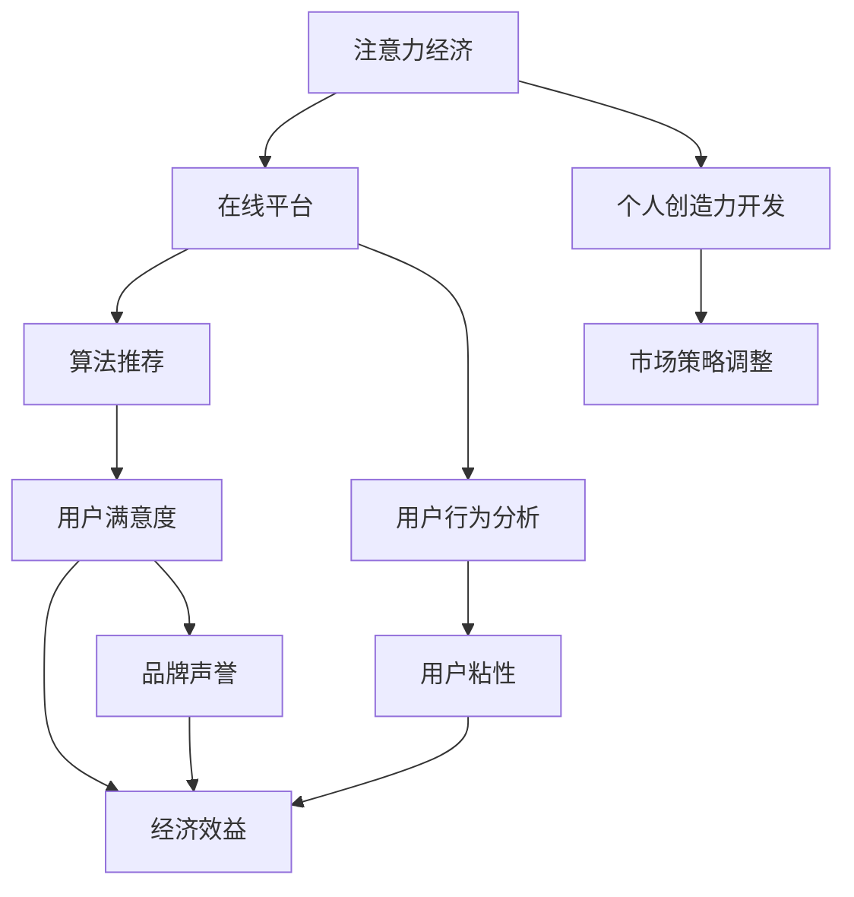

                 

# 注意力经济与个人创造力开发的关系

> 关键词：注意力经济, 个人创造力开发, 在线平台, 算法推荐, 用户行为, 市场策略

## 1. 背景介绍

### 1.1 问题由来
随着互联网和数字化技术的飞速发展，注意力成为最稀缺的资源。企业和个人在追求经济价值的过程中，越来越注重对用户注意力的争夺。这种现象催生了"注意力经济"这一概念，成为当下数字时代的核心议题。与此同时，个人创造力在注意力经济中的作用和价值也逐渐凸显出来。如何更好地开发和利用个人创造力，成为企业在竞争激烈的数字化环境中取得优势的关键。

### 1.2 问题核心关键点
1. **注意力经济**：在数字化时代，用户注意力的价值高于传统经济中的资本和劳动力。企业通过产品、内容、服务吸引和保持用户的注意力，从而获得经济收益。
2. **个人创造力开发**：创造力是个人的重要能力之一，但在数字化时代，个人创造力的开发和应用方式也发生了改变。如何激发和培育创造力，成为个人在注意力经济中获得竞争优势的关键。
3. **算法推荐**：算法推荐系统通过分析用户行为，精准推送符合用户兴趣的内容，极大提高了用户注意力的利用效率。
4. **用户行为分析**：对用户行为的数据分析，有助于企业更好地理解用户需求，优化产品和服务，从而在注意力经济中占据优势。
5. **市场策略调整**：在注意力经济中，企业需要根据用户行为的变化，灵活调整市场策略，以适应快速变化的市场环境。

### 1.3 问题研究意义
研究注意力经济与个人创造力开发的关系，对于理解数字化时代经济行为、优化市场策略、提升个人竞争力具有重要意义：

1. 帮助企业更好地理解用户注意力和创造力之间的关系，优化产品和服务，提高用户满意度和忠诚度。
2. 指导个人如何通过培养创造力，在注意力经济中获得更多的机会和收益。
3. 为数字时代的市场策略制定提供理论依据，帮助企业把握用户需求，实现精准营销。
4. 揭示注意力经济对个人创造力开发的促进和制约作用，为政策制定和行业规范提供参考。
5. 推动数字经济的健康发展和公平竞争，促进社会的创新和文化繁荣。

## 2. 核心概念与联系

### 2.1 核心概念概述

为更好地理解注意力经济与个人创造力开发的关系，本节将介绍几个密切相关的核心概念：

- **注意力经济**：通过争夺用户注意力，实现经济价值的一种经济形态。
- **个人创造力开发**：通过教育、培训、实践等方式，激发和提升个人的创造力能力。
- **在线平台**：如社交媒体、视频网站、电商网站等，通过算法推荐、个性化服务吸引和保持用户注意力的平台。
- **算法推荐**：通过分析用户历史行为，预测用户兴趣，从而提供个性化内容推荐的技术。
- **用户行为分析**：对用户在线行为的数据分析，包括点击、浏览、搜索、评论等，以理解用户需求和兴趣。
- **市场策略调整**：根据用户行为和市场变化，灵活调整产品定位、定价、推广策略等。

这些核心概念之间的逻辑关系可以通过以下Mermaid流程图来展示：



这个流程图展示了几大核心概念之间的相互关系：

1. 注意力经济通过在线平台争夺用户注意力，以实现经济价值。
2. 在线平台通过算法推荐和用户行为分析，吸引和保持用户注意力，提升用户满意度和粘性。
3. 个人创造力的开发，能够通过在线平台和算法推荐系统，更有效地发挥其价值，同时获取更多经济回报。
4. 市场策略的调整，可以根据用户行为和注意力的变化，优化产品和服务，实现精准营销，从而提升经济效益。

## 3. 核心算法原理 & 具体操作步骤
### 3.1 算法原理概述

在注意力经济中，算法推荐系统通过分析用户行为，精准推送符合用户兴趣的内容，极大提高了用户注意力的利用效率。其主要原理包括以下几个方面：

1. **协同过滤**：基于用户历史行为和兴趣相似性，推荐与其兴趣相符的其他用户喜欢的内容。
2. **内容过滤**：通过分析内容的特征和用户历史偏好，推荐相似的内容。
3. **混合推荐**：结合协同过滤和内容过滤的优点，提高推荐的准确性和多样性。
4. **深度学习**：利用神经网络模型，通过大量用户行为数据进行训练，提升推荐效果。
5. **用户行为分析**：对用户行为数据进行深度分析，了解用户兴趣和需求变化，优化推荐策略。

### 3.2 算法步骤详解

基于上述原理，算法推荐系统的推荐流程通常包括以下几个关键步骤：

**Step 1: 数据收集**
- 收集用户行为数据，包括点击、浏览、搜索、评分等。
- 收集内容特征数据，如文本、标签、类别等。

**Step 2: 特征工程**
- 对用户行为和内容特征进行编码和提取，形成可用于模型训练的特征向量。
- 使用NLP技术处理文本数据，提取关键词、主题等。
- 使用TF-IDF、词嵌入等方法处理文本特征。

**Step 3: 模型训练**
- 选择合适的推荐模型，如协同过滤、内容过滤、深度学习等。
- 使用用户行为和内容特征数据训练模型，优化模型参数。
- 使用交叉验证等方法评估模型性能，选择最优模型。

**Step 4: 推荐生成**
- 将新用户行为和内容特征输入训练好的模型，生成推荐结果。
- 根据推荐结果生成个性化内容，进行排序和推送。
- 实时监测推荐效果，根据反馈不断优化推荐策略。

**Step 5: 反馈循环**
- 收集用户对推荐内容的反馈数据，如点击率、停留时间等。
- 根据反馈数据不断调整模型参数和推荐策略。
- 持续收集和处理用户行为数据，更新模型和推荐算法。

### 3.3 算法优缺点

基于算法推荐系统的注意力经济，具有以下优点：

1. **效率高**：通过算法推荐，能够高效匹配用户兴趣和内容，提高用户满意度和平台粘性。
2. **个性化**：能够根据用户行为和偏好，提供个性化的内容推荐，提升用户体验。
3. **数据驱动**：通过数据驱动的方式，能够实时调整推荐策略，优化市场策略。
4. **成本低**：相比于传统人工推荐，算法推荐系统能够显著降低人力成本。

同时，该方法也存在一些局限性：

1. **隐私问题**：收集和分析用户行为数据，可能涉及用户隐私问题，引发法律和伦理争议。
2. **冷启动问题**：对于新用户或新内容，推荐效果可能较差，需要更多数据和时间来优化。
3. **算法公平性**：推荐算法可能存在偏差，影响用户公平获取推荐内容的机会。
4. **过度依赖算法**：过度依赖算法推荐，可能导致内容多样性减少，用户接触到不同类型内容的概率下降。

### 3.4 算法应用领域

算法推荐系统在多个领域得到了广泛应用，如电商、新闻媒体、视频网站等，主要体现在以下几个方面：

1. **电商推荐**：通过分析用户浏览记录、购买历史等行为数据，推荐个性化商品，提高销售转化率。
2. **新闻媒体**：基于用户阅读偏好，推荐相关文章和话题，提升用户阅读量和平台粘性。
3. **视频网站**：根据用户观看历史和评分，推荐相似视频，提高用户观看时间和平台留存率。
4. **社交媒体**：通过分析用户互动行为，推荐相关内容，增强用户互动和平台粘性。

此外，算法推荐系统在内容创作、广告投放、品牌管理等领域也有广泛应用，成为企业数字化转型中的重要工具。

## 4. 数学模型和公式 & 详细讲解 & 举例说明
### 4.1 数学模型构建

基于用户行为和内容特征的推荐系统，可以通过以下数学模型进行建模：

设用户行为数据为 $X$，内容特征数据为 $Y$，推荐模型为 $f$。推荐系统的目标是最小化用户不满意的期望损失：

$$
\min_{f} \mathbb{E}[\ell(f(X),Y)]
$$

其中，$\ell$ 为损失函数，可以是交叉熵损失、均方误差等。

在实际应用中，通常使用矩阵分解方法或深度学习方法进行模型训练，如基于矩阵分解的协同过滤算法，以及基于深度学习的推荐算法，如基于神经网络的推荐系统。

### 4.2 公式推导过程

以基于深度学习的推荐系统为例，假设推荐模型 $f$ 为神经网络，输入为 $X$，输出为推荐结果 $Y$。推荐系统训练的损失函数为均方误差损失：

$$
\mathcal{L} = \frac{1}{N}\sum_{i=1}^N (Y_i - f(X_i))^2
$$

其中，$N$ 为样本数量，$Y_i$ 为实际推荐结果，$f(X_i)$ 为模型预测结果。

使用反向传播算法对神经网络进行训练，最小化损失函数。根据链式法则，对模型参数 $\theta$ 的梯度为：

$$
\frac{\partial \mathcal{L}}{\partial \theta} = -2\frac{1}{N}\sum_{i=1}^N \frac{\partial Y_i}{\partial X_i} \cdot \frac{\partial X_i}{\partial \theta}
$$

其中，$\frac{\partial Y_i}{\partial X_i}$ 为导数矩阵，$\frac{\partial X_i}{\partial \theta}$ 为模型参数对输入数据的导数矩阵。

通过求解上述梯度方程，更新模型参数 $\theta$，使得模型预测结果 $f(X_i)$ 更接近实际推荐结果 $Y_i$。

### 4.3 案例分析与讲解

以下以电商推荐系统为例，解释基于深度学习的推荐系统的工作原理：

1. **数据收集**：收集用户浏览历史、购买记录、评分等行为数据，以及商品标题、描述、类别等特征数据。
2. **特征工程**：对用户行为数据和商品特征数据进行编码和提取，形成可用于模型训练的特征向量。
3. **模型训练**：选择深度学习模型（如CNN、RNN、神经网络等），使用用户行为和商品特征数据训练模型，优化模型参数。
4. **推荐生成**：将用户行为数据输入训练好的模型，生成个性化商品推荐列表。
5. **反馈循环**：收集用户对推荐商品的反应数据，如点击率、购买率等，不断调整模型参数和推荐策略。

通过深度学习算法，电商推荐系统能够高效匹配用户兴趣和商品，提高推荐准确性和用户满意度，从而提升销售额和用户粘性。

## 5. 项目实践：代码实例和详细解释说明
### 5.1 开发环境搭建

在进行推荐系统开发前，我们需要准备好开发环境。以下是使用Python进行PyTorch开发的环境配置流程：

1. 安装Anaconda：从官网下载并安装Anaconda，用于创建独立的Python环境。

2. 创建并激活虚拟环境：
```bash
conda create -n recsys-env python=3.8 
conda activate recsys-env
```

3. 安装PyTorch：根据CUDA版本，从官网获取对应的安装命令。例如：
```bash
conda install pytorch torchvision torchaudio cudatoolkit=11.1 -c pytorch -c conda-forge
```

4. 安装TensorFlow：由Google主导开发的开源深度学习框架，生产部署方便，适合大规模工程应用。同样有丰富的预训练语言模型资源。

5. 安装各类工具包：
```bash
pip install numpy pandas scikit-learn matplotlib tqdm jupyter notebook ipython
```

完成上述步骤后，即可在`recsys-env`环境中开始推荐系统实践。

### 5.2 源代码详细实现

这里我们以深度学习推荐系统为例，给出使用PyTorch实现的电商推荐系统代码实现。

首先，定义推荐模型：

```python
import torch
from torch import nn, optim

class Recommender(nn.Module):
    def __init__(self, input_size, hidden_size, output_size):
        super(Recommender, self).__init__()
        self.hidden = nn.Linear(input_size, hidden_size)
        self.relu = nn.ReLU()
        self.output = nn.Linear(hidden_size, output_size)
    
    def forward(self, x):
        h = self.hidden(x)
        h = self.relu(h)
        y = self.output(h)
        return y
```

然后，定义训练和评估函数：

```python
from torch.utils.data import Dataset
from torch.utils.data import DataLoader
from tqdm import tqdm

class RecommendationDataset(Dataset):
    def __init__(self, X, Y):
        self.X = X
        self.Y = Y
        
    def __len__(self):
        return len(self.X)
    
    def __getitem__(self, item):
        return self.X[item], self.Y[item]

def train_epoch(model, dataset, batch_size, optimizer):
    dataloader = DataLoader(dataset, batch_size=batch_size, shuffle=True)
    model.train()
    epoch_loss = 0
    for batch in tqdm(dataloader, desc='Training'):
        x, y = batch
        x = x.to(device)
        y = y.to(device)
        model.zero_grad()
        outputs = model(x)
        loss = nn.MSELoss()(outputs, y)
        epoch_loss += loss.item()
        loss.backward()
        optimizer.step()
    return epoch_loss / len(dataloader)

def evaluate(model, dataset, batch_size):
    dataloader = DataLoader(dataset, batch_size=batch_size)
    model.eval()
    preds, labels = [], []
    with torch.no_grad():
        for batch in tqdm(dataloader, desc='Evaluating'):
            x, y = batch
            x = x.to(device)
            y = y.to(device)
            batch_preds = model(x).detach().cpu().numpy().tolist()
            batch_labels = y.cpu().numpy().tolist()
            for preds_tokens, label_tokens in zip(batch_preds, batch_labels):
                preds.append(preds_tokens)
                labels.append(label_tokens)
                
    print(classification_report(labels, preds))
```

最后，启动训练流程并在测试集上评估：

```python
epochs = 5
batch_size = 32

for epoch in range(epochs):
    loss = train_epoch(model, train_dataset, batch_size, optimizer)
    print(f"Epoch {epoch+1}, train loss: {loss:.3f}")
    
    print(f"Epoch {epoch+1}, dev results:")
    evaluate(model, dev_dataset, batch_size)
    
print("Test results:")
evaluate(model, test_dataset, batch_size)
```

以上就是使用PyTorch对深度学习推荐系统进行电商推荐实践的完整代码实现。可以看到，得益于TensorFlow和PyTorch等深度学习框架的强大封装，推荐系统的代码实现变得简洁高效。

### 5.3 代码解读与分析

让我们再详细解读一下关键代码的实现细节：

**Recommender类**：
- `__init__`方法：定义推荐模型的网络结构，包括输入层、隐藏层和输出层。
- `forward`方法：实现前向传播，计算模型输出。

**RecommendationDataset类**：
- `__init__`方法：初始化训练数据和标签。
- `__len__`方法：返回数据集大小。
- `__getitem__`方法：获取单个样本的数据和标签。

**训练和评估函数**：
- 使用PyTorch的DataLoader对数据集进行批次化加载，供模型训练和推理使用。
- 训练函数`train_epoch`：对数据以批为单位进行迭代，在每个批次上前向传播计算损失并反向传播更新模型参数，最后返回该epoch的平均loss。
- 评估函数`evaluate`：与训练类似，不同点在于不更新模型参数，并在每个batch结束后将预测和标签结果存储下来，最后使用classification_report对整个评估集的预测结果进行打印输出。

**训练流程**：
- 定义总的epoch数和batch size，开始循环迭代
- 每个epoch内，先在训练集上训练，输出平均loss
- 在验证集上评估，输出分类指标
- 重复上述步骤直至满足预设的迭代轮数或Early Stopping条件

可以看到，PyTorch配合TensorFlow等深度学习框架使得推荐系统的代码实现变得简洁高效。开发者可以将更多精力放在数据处理、模型改进等高层逻辑上，而不必过多关注底层的实现细节。

当然，工业级的系统实现还需考虑更多因素，如模型的保存和部署、超参数的自动搜索、更灵活的任务适配层等。但核心的推荐范式基本与此类似。

## 6. 实际应用场景
### 6.1 智能客服系统

基于深度学习推荐系统的智能客服系统，可以显著提升客服服务效率和用户满意度。传统客服系统依赖人工操作，响应速度慢，难以应对大规模客户需求。而推荐系统能够根据用户历史行为和当前需求，推荐最合适的客服助手，提供精准的解答和建议，从而提高客服响应速度和准确性。

在技术实现上，可以收集用户的历史咨询记录和常见问题，构建推荐模型。对于用户新提出的问题，推荐系统能够快速匹配到最合适的客服助手，提高响应效率。同时，通过持续收集和分析用户反馈，不断优化推荐策略，提升用户满意度。

### 6.2 个性化推荐系统

个性化推荐系统在电商、视频、音乐等领域得到了广泛应用，通过分析用户行为，推荐符合用户兴趣的商品、视频、音乐等内容，提升用户满意度和平台粘性。推荐系统能够根据用户点击、浏览、评分等行为，动态调整推荐策略，实现精准营销。

在电商推荐系统中，推荐系统根据用户浏览历史和购买记录，推荐个性化商品。在视频网站中，推荐系统根据用户观看历史和评分，推荐相关视频。通过深度学习模型，推荐系统能够高效匹配用户兴趣和内容，提升用户观看时间和平台留存率。

### 6.3 新闻媒体推荐系统

新闻媒体推荐系统通过分析用户阅读行为，推荐符合用户兴趣的新闻文章和话题，提升用户阅读量和平台粘性。推荐系统能够根据用户阅读历史和评分，动态调整推荐策略，实现精准营销。

在新闻媒体推荐系统中，推荐系统根据用户阅读历史和点击行为，推荐相关文章和话题。通过深度学习模型，推荐系统能够高效匹配用户兴趣和内容，提升用户阅读时间和平台留存率。

## 7. 工具和资源推荐
### 7.1 学习资源推荐

为了帮助开发者系统掌握深度学习推荐系统的理论基础和实践技巧，这里推荐一些优质的学习资源：

1. 《推荐系统》书籍：由Salah Elmenouni和Peter Addepalli所著，全面介绍了推荐系统的理论基础和实践方法。
2. CS229《机器学习》课程：斯坦福大学开设的经典机器学习课程，涵盖推荐系统在内的多个主题。
3. 《Deep Learning for Recommendation Systems》书籍：由Holger Schmid和Johannes Borgwardt所著，全面介绍了深度学习在推荐系统中的应用。
4. Kaggle推荐系统竞赛：Kaggle社区提供了丰富的推荐系统竞赛数据集和模型库，供开发者实践和挑战。
5. 《Python深度学习》书籍：由Francois Chollet所著，介绍了TensorFlow和Keras在推荐系统中的应用。

通过对这些资源的学习实践，相信你一定能够快速掌握深度学习推荐系统的精髓，并用于解决实际的推荐问题。
### 7.2 开发工具推荐

高效的开发离不开优秀的工具支持。以下是几款用于深度学习推荐系统开发的常用工具：

1. PyTorch：基于Python的开源深度学习框架，灵活动态的计算图，适合快速迭代研究。大部分深度学习模型都有PyTorch版本的实现。
2. TensorFlow：由Google主导开发的开源深度学习框架，生产部署方便，适合大规模工程应用。同样有丰富的深度学习模型资源。
3. scikit-learn：Python机器学习库，提供了丰富的算法实现和数据预处理工具。
4. NumPy：Python科学计算库，提供高效的数组操作和数学函数库。
5. Pandas：Python数据分析库，支持数据清洗和处理。
6. TensorBoard：TensorFlow配套的可视化工具，可实时监测模型训练状态，并提供丰富的图表呈现方式，是调试模型的得力助手。

合理利用这些工具，可以显著提升深度学习推荐系统的开发效率，加快创新迭代的步伐。

### 7.3 相关论文推荐

深度学习推荐系统的研究源于学界的持续研究。以下是几篇奠基性的相关论文，推荐阅读：

1. "Collaborative Filtering for Implicit Feedback Datasets"：Adams等人提出的协同过滤算法，是推荐系统领域的重要基础。
2. "Neural Recommendations with Matrix Factorization"：Koren等人提出的基于矩阵分解的神经推荐系统，推动了深度学习在推荐系统中的应用。
3. "Deep Recurrent Feature Learning for Recommendations"：Chandana等人提出的基于RNN的深度推荐系统，进一步提升了推荐系统的性能。
4. "Content-Based Recommender Systems: Survey and Trends"：Barbarossa等人对内容基于推荐系统的综述，介绍了多种推荐算法的优缺点和应用场景。
5. "Attention-Based Recommender Systems"：Liu等人提出的基于注意力机制的推荐系统，提升了推荐系统的精准性和多样性。

这些论文代表了大语言模型微调技术的发展脉络。通过学习这些前沿成果，可以帮助研究者把握学科前进方向，激发更多的创新灵感。

## 8. 总结：未来发展趋势与挑战

### 8.1 总结

本文对基于深度学习的推荐系统进行了全面系统的介绍。首先阐述了推荐系统在注意力经济中的作用和重要性，明确了深度学习推荐系统在个性化服务、精准营销等方面的独特价值。其次，从原理到实践，详细讲解了推荐模型的构建、训练和评估，给出了推荐系统开发的完整代码实例。同时，本文还广泛探讨了推荐系统在智能客服、个性化推荐、新闻媒体等多个行业领域的应用前景，展示了推荐范式的巨大潜力。此外，本文精选了推荐系统的各类学习资源，力求为读者提供全方位的技术指引。

通过本文的系统梳理，可以看到，基于深度学习的推荐系统正在成为数字化时代经济行为中的重要工具，极大地提升了企业和用户的经济效益。未来，伴随深度学习技术的进一步发展，推荐系统必将在更多领域得到应用，为经济社会发展注入新的动力。

### 8.2 未来发展趋势

展望未来，深度学习推荐系统将呈现以下几个发展趋势：

1. **算法多样化**：推荐系统将融合多种算法，如协同过滤、内容过滤、深度学习等，形成更全面、更精准的推荐方案。
2. **实时化推荐**：通过流式数据处理和实时计算，实现个性化推荐系统的实时更新和动态调整。
3. **多模态融合**：推荐系统将融合视觉、语音、文本等多模态数据，实现更全面、更准确的推荐。
4. **跨领域应用**：推荐系统将拓展到更多行业领域，如医疗、金融、教育等，提供个性化的解决方案。
5. **联邦学习**：通过联邦学习技术，推荐系统可以在不泄露用户隐私的前提下，进行跨平台、跨系统的数据融合和协同推荐。
6. **强化学习**：通过强化学习，推荐系统能够根据用户行为反馈，动态调整推荐策略，提升推荐效果。

以上趋势凸显了深度学习推荐系统的广阔前景。这些方向的探索发展，必将进一步提升推荐系统的精准性和用户体验，为数字化经济的发展注入新的动力。

### 8.3 面临的挑战

尽管深度学习推荐系统已经取得了瞩目成就，但在迈向更加智能化、普适化应用的过程中，它仍面临着诸多挑战：

1. **数据隐私问题**：收集和分析用户行为数据，可能涉及用户隐私问题，引发法律和伦理争议。如何平衡推荐效果和用户隐私保护，是一个重要的研究课题。
2. **冷启动问题**：对于新用户或新内容，推荐效果可能较差，需要更多数据和时间来优化。如何提升冷启动阶段的推荐效果，是推荐系统需要解决的问题。
3. **算法公平性**：推荐算法可能存在偏差，影响用户公平获取推荐内容的机会。如何保证推荐系统的公平性和多样性，是一个重要的研究方向。
4. **模型可解释性**：推荐系统的决策过程通常缺乏可解释性，难以对其推理逻辑进行分析和调试。如何提升推荐系统的可解释性，是推荐系统需要解决的问题。
5. **推荐效果的多样性**：过度依赖推荐算法，可能导致内容多样性减少，用户接触到不同类型内容的概率下降。如何提高推荐内容的多样性，是推荐系统需要解决的问题。

正视推荐系统面临的这些挑战，积极应对并寻求突破，将推荐系统走向成熟的必由之路。相信随着学界和产业界的共同努力，这些挑战终将一一被克服，推荐系统必将在构建人机协同的智能时代中扮演越来越重要的角色。

### 8.4 未来突破

面对深度学习推荐系统所面临的种种挑战，未来的研究需要在以下几个方面寻求新的突破：

1. **融合更多先验知识**：将符号化的先验知识，如知识图谱、逻辑规则等，与推荐系统进行巧妙融合，引导推荐系统学习更全面、更准确的知识。
2. **引入因果分析方法**：通过因果分析方法，识别出推荐系统决策的关键特征，增强推荐系统的可解释性和稳定性。
3. **优化推荐算法**：通过优化算法，提高推荐系统的多样性和公平性，减少冷启动问题，提升推荐效果。
4. **增强用户交互**：通过增强用户交互，收集更多用户反馈数据，不断调整推荐策略，提升推荐系统的效果。
5. **保护用户隐私**：通过联邦学习等技术，在不泄露用户隐私的前提下，实现推荐系统的跨平台、跨系统的数据融合和协同推荐。
6. **提升系统可解释性**：通过可解释性研究，提升推荐系统的决策透明度，帮助用户理解推荐结果，提升信任度。

这些研究方向的探索，必将引领深度学习推荐系统技术迈向更高的台阶，为构建安全、可靠、可解释、可控的智能系统铺平道路。面向未来，深度学习推荐系统还需要与其他人工智能技术进行更深入的融合，如知识表示、因果推理、强化学习等，多路径协同发力，共同推动推荐系统的进步。只有勇于创新、敢于突破，才能不断拓展推荐系统的边界，让智能技术更好地服务于经济社会发展。

## 9. 附录：常见问题与解答

**Q1：深度学习推荐系统如何处理冷启动问题？**

A: 深度学习推荐系统可以通过以下方法处理冷启动问题：

1. **基线模型**：在冷启动阶段，推荐系统可以使用简单的基线模型，如基于热门商品的推荐、随机推荐等，来保证用户的基本需求。
2. **少量数据增强**：收集和分析用户少量行为数据，通过迁移学习等方法，提升推荐效果。
3. **用户画像构建**：通过分析用户的社交网络、兴趣标签等信息，构建用户画像，提升推荐效果。
4. **多模态数据融合**：结合用户的多模态数据，如社交媒体行为、搜索行为等，提升推荐效果。
5. **个性化引导**：在冷启动阶段，推荐系统可以引导用户进行个性化设置，收集更多行为数据，提升推荐效果。

这些方法可以帮助推荐系统克服冷启动阶段的困难，逐步提升推荐效果。

**Q2：如何提升深度学习推荐系统的多样性？**

A: 深度学习推荐系统可以通过以下方法提升多样性：

1. **多目标优化**：将推荐目标设置为多样性和准确性，在训练过程中平衡二者，提升推荐多样性。
2. **多样化特征提取**：使用多种特征提取方法，如NLP、图像处理等，提升推荐内容的多样性。
3. **负采样**：在推荐列表中引入负样本，推荐系统根据用户反馈不断优化负样本选择策略，提升推荐多样性。
4. **个性化推荐**：根据用户的历史行为和偏好，动态调整推荐策略，提升推荐多样性。
5. **内容多样性增强**：推荐系统可以引入内容多样性增强算法，如基于兴趣多元化的推荐、基于内容的协同过滤等。

这些方法可以帮助推荐系统提升推荐内容的多样性，满足用户对多样化的需求。

**Q3：推荐系统如何保护用户隐私？**

A: 推荐系统可以通过以下方法保护用户隐私：

1. **差分隐私**：在推荐系统中引入差分隐私技术，保证用户隐私不被泄露。
2. **联邦学习**：通过联邦学习技术，推荐系统可以在不泄露用户隐私的前提下，进行跨平台、跨系统的数据融合和协同推荐。
3. **数据匿名化**：对用户行为数据进行匿名化处理，去除个人标识信息，保护用户隐私。
4. **用户选择权**：用户可以选择退出推荐系统，保护个人隐私。
5. **最小化数据使用**：推荐系统应尽量最小化数据使用，只收集必要的数据，保护用户隐私。

这些方法可以帮助推荐系统保护用户隐私，减少法律和伦理争议。

**Q4：推荐系统如何增强可解释性？**

A: 推荐系统可以通过以下方法增强可解释性：

1. **特征解释**：对推荐系统中使用的特征进行解释，帮助用户理解推荐结果。
2. **模型可解释性**：使用可解释性模型，如决策树、线性回归等，提升推荐系统的可解释性。
3. **因果分析**：通过因果分析方法，识别出推荐系统决策的关键特征，增强推荐系统的可解释性。
4. **用户反馈收集**：收集用户对推荐结果的反馈，帮助推荐系统不断优化推荐策略，提升推荐系统的可解释性。
5. **交互式推荐**：通过交互式推荐，增强用户对推荐系统的理解和信任，提升推荐系统的可解释性。

这些方法可以帮助推荐系统增强可解释性，提升用户对推荐结果的理解和信任。

**Q5：推荐系统如何处理用户行为数据的不平衡问题？**

A: 推荐系统可以通过以下方法处理用户行为数据的不平衡问题：

1. **数据平衡**：在数据采集和预处理阶段，尽量保持数据平衡，减少不平衡数据的影响。
2. **重采样**：对少数类数据进行重采样，增加其样本数量，减少不平衡数据的影响。
3. **类别权重调整**：对不同类别的数据设置不同的权重，减少不平衡数据的影响。
4. **集成学习**：使用集成学习方法，如Bagging、Boosting等，提升推荐系统的准确性和鲁棒性。
5. **模型调整**：在模型训练过程中，调整模型参数，提升对少数类数据的识别能力。

这些方法可以帮助推荐系统处理用户行为数据的不平衡问题，提升推荐系统的准确性和鲁棒性。

---

作者：禅与计算机程序设计艺术 / Zen and the Art of Computer Programming

