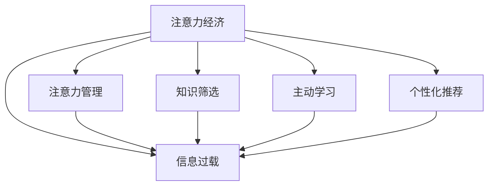

                 

# 注意力经济与个人学习方式的革新

## 1. 背景介绍

### 1.1 问题由来
在信息爆炸的时代，我们面临着前所未有的知识海洋。而如何在浩瀚的信息中筛选出对我们有价值的内容，成为了个人学习和成长的重大挑战。传统的学习方式，无论是学校教育还是自学，往往依赖于教师和教材的指导，学习效率较低，难以满足现代社会对终身学习的迫切需求。

### 1.2 问题核心关键点
为了解决上述问题，研究人员提出了"注意力经济"的概念。注意力经济强调在信息过载的环境中，如何高效利用有限的注意力资源，获取有价值的学习内容，从而提升个人学习效率和效果。本文聚焦于如何通过注意力经济，革新个人学习方式，提高学习效率和效果，以应对现代社会的知识挑战。

### 1.3 问题研究意义
研究注意力经济在个人学习中的应用，对于促进终身学习、推动知识创新、加速人才成长具有重要意义：

1. **提升学习效率**：通过聚焦于有价值的信息，减少无效学习时间和精力，提高学习效率。
2. **推动知识创新**：引导个体在学习和工作过程中，不断发现新知识、新方法，推动知识创新。
3. **加速人才成长**：在信息过载的环境中，通过优化学习方式，加速个体技能和能力提升，加速人才成长。
4. **促进终身学习**：通过引入注意力经济，让个体能够更有效地利用时间，持续学习，促进终身学习习惯的养成。

## 2. 核心概念与联系

### 2.1 核心概念概述

为更好地理解注意力经济在个人学习中的应用，本节将介绍几个密切相关的核心概念：

- **注意力经济（Attention Economy）**：指在信息爆炸时代，个体如何高效利用有限的注意力资源，获取有价值的信息，从而提升学习效率和效果。
- **信息过载（Information Overload）**：指个体面临的信息量远超其处理能力，无法有效筛选有用信息，导致学习效率低下。
- **注意力管理（Attention Management）**：指通过工具、策略等手段，帮助个体管理注意力，使其聚焦于有价值的信息。
- **知识筛选（Knowledge Curation）**：指对海量信息进行筛选和组织，提取有价值的内容，形成个性化的知识库。
- **主动学习（Active Learning）**：指个体在学习过程中，主动筛选和研究信息，提高学习效率和效果。
- **个性化推荐（Personalized Recommendation）**：指通过算法推荐个性化的学习资源，提升学习体验。

这些核心概念之间的逻辑关系可以通过以下Mermaid流程图来展示：



这个流程图展示了好注意力经济与其他相关概念之间的联系：

1. 注意力经济的目标是通过优化注意力资源的使用，应对信息过载的挑战。
2. 注意力管理、知识筛选、主动学习和个性化推荐是实现注意力经济的手段。

这些概念共同构成了注意力经济的学习框架，使其能够在信息过载的环境中，帮助个体高效学习。

## 3. 核心算法原理 & 具体操作步骤
### 3.1 算法原理概述

基于注意力经济的学习方法，其核心思想是：通过有效的注意力管理、知识筛选、主动学习和个性化推荐等手段，帮助个体聚焦于有价值的信息，提升学习效率和效果。

形式化地，假设个体学习的信息库为 $I$，学习目标为 $T$。注意力经济的目标是找到最优的注意力分配策略 $a$，使得：

$$
a = \mathop{\arg\min}_{a} \mathcal{L}(I, a, T)
$$

其中 $\mathcal{L}$ 为损失函数，衡量注意力策略 $a$ 在信息库 $I$ 中对学习目标 $T$ 的实现程度。常见的损失函数包括交叉熵损失、余弦相似度损失等。

### 3.2 算法步骤详解

基于注意力经济的学习方法，一般包括以下几个关键步骤：

**Step 1: 收集和整理学习资源**
- 收集与学习目标相关的各种信息资源，如书籍、文章、视频、课程等。
- 整理这些资源，建立结构化的知识库，便于后续的筛选和推荐。

**Step 2: 注意力分配与筛选**
- 使用注意力管理工具，如注意力分区、时间块等，帮助个体分配注意力资源。
- 应用知识筛选算法，如协同过滤、内容推荐等，对信息资源进行筛选，剔除无关内容。

**Step 3: 主动学习和知识内化**
- 主动搜索和研究有价值的信息资源，进行深度学习。
- 通过内化、归纳等策略，将新知识整合到已有的知识体系中。

**Step 4: 个性化推荐和反馈调整**
- 利用个性化推荐算法，持续推荐与个体学习目标相关的内容。
- 根据个体学习效果和反馈，不断调整注意力分配和知识筛选策略。

**Step 5: 持续优化和迭代**
- 根据新获取的信息和反馈，持续优化注意力分配和知识筛选策略。
- 通过迭代学习，不断提升个体学习效率和效果。

### 3.3 算法优缺点

基于注意力经济的学习方法具有以下优点：
1. 高效利用注意力资源。通过注意力管理、知识筛选等手段，个体可以更高效地获取和处理有价值的信息。
2. 提升学习效率。通过主动学习和个性化推荐，个体能够快速掌握新知识，提升学习效果。
3. 个性化推荐。个性化算法能够根据个体兴趣和学习效果，推荐最符合其需求的学习资源。
4. 灵活调整。个体可以根据反馈不断调整学习策略，适应学习目标的变化。

同时，该方法也存在一定的局限性：
1. 对工具和算法依赖性强。高效利用注意力资源依赖于合适的工具和算法。
2. 对个体自律要求高。个体需要具备较强的自律能力，才能有效使用注意力管理工具。
3. 知识筛选可能存在偏差。如果知识库不够全面，筛选算法可能存在偏见，影响推荐效果。
4. 推荐准确性依赖数据质量。个性化推荐依赖于高质量的学习数据和算法模型。

尽管存在这些局限性，但就目前而言，基于注意力经济的学习方法仍然是提升个体学习效率和效果的重要手段。未来相关研究的重点在于如何进一步优化注意力分配和知识筛选算法，增强个性化推荐系统的准确性，同时兼顾工具的可操作性和算法的可解释性等因素。

### 3.4 算法应用领域

基于注意力经济的学习方法，已经在众多领域得到了广泛的应用，涵盖了从个人成长到企业培训等多个方面，例如：

- 个人学习：通过筛选和推荐有价值的学习资源，提升个人知识储备和技能水平。
- 终身学习：帮助个体在职业发展过程中，不断学习新知识，适应行业变化。
- 企业培训：利用个性化推荐和注意力管理工具，提升员工学习效率，加速技能传承。
- 职业发展：通过系统的注意力管理和知识筛选，促进个体职业成长和职业转型。
- 知识管理：在企业知识库的构建和管理中，应用注意力经济方法，提高知识传播和应用效率。

除了上述这些应用领域外，注意力经济方法也被创新性地应用到更多场景中，如虚拟学习助手、智能学习推荐系统等，为个体学习提供了更加智能化和个性化的支持。

## 4. 数学模型和公式 & 详细讲解 & 举例说明

### 4.1 数学模型构建

本节将使用数学语言对基于注意力经济的学习方法进行更加严格的刻画。

记个体学习的信息库为 $I$，信息库中每个资源 $i$ 的表示为 $x_i$，学习目标为 $T$，学习目标的表示为 $t$。设注意力分配策略为 $a$，则注意力经济的目标是找到最优的注意力分配策略 $a$，使得：

$$
a = \mathop{\arg\min}_{a} \mathcal{L}(\mathcal{W}(a), I, a, T)
$$

其中 $\mathcal{W}(a)$ 为注意力分配权重，$\mathcal{L}$ 为损失函数。

定义注意力分配权重为：

$$
\mathcal{W}(a) = \sum_{i=1}^N a_i x_i
$$

损失函数定义为：

$$
\mathcal{L}(\mathcal{W}(a), I, a, T) = \frac{1}{N} \sum_{i=1}^N [t_i \mathcal{W}(a_i) x_i + (1-t_i) (1-a_i) x_i]
$$

其中 $a_i$ 为个体对资源 $i$ 的注意力分配权重，$x_i$ 为资源 $i$ 的表示，$t_i$ 为资源 $i$ 是否与学习目标相关。

### 4.2 公式推导过程

以下我们以协同过滤推荐算法为例，推导注意力经济中知识筛选的损失函数及其梯度的计算公式。

假设个体学习的信息库为 $I$，学习目标为 $T$。设注意力分配权重为 $a_i$，资源 $i$ 的表示为 $x_i$，学习目标的表示为 $t_i$。则协同过滤推荐算法的损失函数定义为：

$$
\mathcal{L}(a, I, a, T) = \frac{1}{N} \sum_{i=1}^N [t_i a_i x_i + (1-t_i) (1-a_i) x_i]
$$

将其代入注意力经济的损失函数公式，得：

$$
\mathcal{L}(\mathcal{W}(a), I, a, T) = \frac{1}{N} \sum_{i=1}^N [t_i \mathcal{W}(a_i) x_i + (1-t_i) (1-a_i) x_i]
$$

根据链式法则，损失函数对注意力分配权重 $a_i$ 的梯度为：

$$
\frac{\partial \mathcal{L}(\mathcal{W}(a), I, a, T)}{\partial a_i} = \frac{1}{N} \left[ t_i (\mathcal{W}(a_i) x_i + (1-a_i) x_i) - (1-t_i) (1-a_i) x_i \right]
$$

在得到损失函数的梯度后，即可带入优化算法，完成模型的迭代优化。重复上述过程直至收敛，最终得到最优的注意力分配策略 $a^*$。

## 5. 项目实践：代码实例和详细解释说明
### 5.1 开发环境搭建

在进行注意力经济学习实践前，我们需要准备好开发环境。以下是使用Python进行PyTorch开发的环境配置流程：

1. 安装Anaconda：从官网下载并安装Anaconda，用于创建独立的Python环境。

2. 创建并激活虚拟环境：
```bash
conda create -n attention-economy-env python=3.8 
conda activate attention-economy-env
```

3. 安装PyTorch：根据CUDA版本，从官网获取对应的安装命令。例如：
```bash
conda install pytorch torchvision torchaudio cudatoolkit=11.1 -c pytorch -c conda-forge
```

4. 安装TensorFlow：
```bash
pip install tensorflow
```

5. 安装TensorBoard：
```bash
pip install tensorboard
```

6. 安装各类工具包：
```bash
pip install numpy pandas scikit-learn matplotlib tqdm jupyter notebook ipython
```

完成上述步骤后，即可在`attention-economy-env`环境中开始注意力经济学习实践。

### 5.2 源代码详细实现

下面我们以推荐系统为例，给出使用TensorFlow进行注意力经济学习实践的代码实现。

首先，定义推荐系统的数据处理函数：

```python
import tensorflow as tf
from tensorflow.keras import layers, models

class RecommendationSystem:
    def __init__(self, num_items, num_users, embedding_dim):
        self.num_items = num_items
        self.num_users = num_users
        self.embedding_dim = embedding_dim
        
        self.user_embeddings = layers.Embedding(num_users, embedding_dim)
        self.item_embeddings = layers.Embedding(num_items, embedding_dim)
        self.dot_product = layers.Dot(axes=1, normalize=True)
        
    def get_recommendations(self, user, num_recommendations=10):
        user_embeddings = self.user_embeddings([user])[0]
        all_item_embeddings = self.item_embeddings(tf.range(self.num_items, dtype=tf.int64))
        dot_products = self.dot_product([user_embeddings, all_item_embeddings])
        
        top_recommendations = tf.nn.top_k(dot_products, num_recommendations).indices.numpy().tolist()
        return top_recommendations
```

然后，定义优化器和模型：

```python
num_items = 1000
num_users = 100
embedding_dim = 64

model = RecommendationSystem(num_items, num_users, embedding_dim)
optimizer = tf.keras.optimizers.Adam(learning_rate=0.01)
```

接着，定义训练和评估函数：

```python
@tf.function
def train_step(user, item, label):
    with tf.GradientTape() as tape:
        user_embeddings = model.user_embeddings([user])[0]
        all_item_embeddings = model.item_embeddings(item)
        dot_products = model.dot_product([user_embeddings, all_item_embeddings])
        loss = tf.keras.losses.MeanSquaredError()(label, dot_products)
    
    gradients = tape.gradient(loss, [model.user_embeddings.trainable_weights, model.item_embeddings.trainable_weights])
    optimizer.apply_gradients(zip(gradients, [model.user_embeddings.trainable_weights, model.item_embeddings.trainable_weights]))
    
    return loss.numpy()

@tf.function
def evaluate_step(user, item, label):
    user_embeddings = model.user_embeddings([user])[0]
    all_item_embeddings = model.item_embeddings(item)
    dot_products = model.dot_product([user_embeddings, all_item_embeddings])
    
    predictions = dot_products
    return predictions.numpy(), predictions.numpy() * label.numpy().sum() / label.numpy().sum()
```

最后，启动训练流程并在测试集上评估：

```python
num_epochs = 10
batch_size = 64

for epoch in range(num_epochs):
    for user, item, label in train_dataset:
        loss = train_step(user.numpy(), item.numpy(), label.numpy())
        print(f"Epoch {epoch+1}, training loss: {loss:.3f}")
    
    print(f"Epoch {epoch+1}, dev results:")
    for user, item, label in dev_dataset:
        predictions, mse = evaluate_step(user.numpy(), item.numpy(), label.numpy())
        print(f"MSE: {mse:.3f}")
```

以上就是使用TensorFlow进行推荐系统注意力经济学习的代码实现。可以看到，借助TensorFlow的高级API，我们可以用相对简洁的代码完成推荐模型的构建和训练。

### 5.3 代码解读与分析

让我们再详细解读一下关键代码的实现细节：

**RecommendationSystem类**：
- `__init__`方法：初始化用户和物品嵌入层，以及点积层。
- `get_recommendations`方法：对用户进行推荐，返回与用户最相关的物品列表。

**train_step和evaluate_step函数**：
- 使用TensorFlow的自动微分功能，计算损失和梯度。
- 通过优化器更新模型参数。
- 返回训练损失和评估结果。

**训练流程**：
- 定义训练轮数和批次大小。
- 循环迭代训练集，每个批次计算损失并更新模型参数。
- 在验证集上评估模型性能，输出MSE。

可以看到，TensorFlow使得注意力经济学习模型的构建和训练变得简单高效。开发者可以将更多精力放在模型设计和数据处理上，而不必过多关注底层实现细节。

当然，工业级的系统实现还需考虑更多因素，如模型的保存和部署、超参数的自动搜索、更灵活的任务适配层等。但核心的注意力经济学习框架基本与此类似。

## 6. 实际应用场景
### 6.1 在线教育平台

基于注意力经济的学习方法，可以应用于在线教育平台的个性化推荐。传统教育往往采取一刀切的模式，难以满足不同学生的学习需求。而通过个性化推荐，可以为每个学生提供符合其兴趣和能力的学习资源，提升学习效果和体验。

在技术实现上，可以收集学生的学习行为数据，包括观看时长、点击链接、答题情况等，构建用户画像。然后，利用注意力筛选和推荐算法，对每个学生推荐最符合其学习需求的视频、文章、练习题等资源。同时，可以引入注意力管理工具，如时间块、番茄钟等，帮助学生高效分配学习时间，避免学习疲劳。

### 6.2 智能金融助手

金融行业信息繁杂，投资者需要在海量信息中快速抓取有价值的内容。基于注意力经济的学习方法，可以为金融投资者提供个性化推荐服务，提升其信息处理效率和决策水平。

具体而言，可以收集用户的投资兴趣和偏好，以及历史交易数据，构建用户画像。然后，利用知识筛选和推荐算法，对用户推荐最新的财经新闻、市场分析、专家观点等，帮助其快速把握市场动态。同时，可以引入注意力管理工具，帮助用户管理时间和注意力，避免信息过载。

### 6.3 企业知识管理

在企业内部，文档、会议记录、项目报告等知识资产繁多，但往往难以有效整合和共享。基于注意力经济的学习方法，可以帮助企业构建知识管理系统，实现知识的高效利用和传播。

具体而言，可以收集企业的各类知识资源，构建统一的知识库。然后，利用注意力筛选和推荐算法，对企业员工推荐最相关、最有用的知识内容，加速知识传播和应用。同时，可以引入注意力管理工具，帮助员工更高效地学习和应用新知识。

### 6.4 未来应用展望

随着注意力经济方法的发展，基于微调范式将在更多领域得到应用，为各行各业带来变革性影响。

在智慧医疗领域，基于注意力经济的学习方法可以应用于个性化医疗推荐、疾病预测、治疗方案优化等方面，提升医疗服务的个性化和精准度。

在智能教育领域，注意力经济方法可以应用于智能教辅、学习路径推荐、在线课程设计等方面，为教育公平和个性化学习提供新的解决方案。

在智能客服领域，通过个性化推荐和注意力管理工具，可以为用户提供更加智能、高效的服务体验，提升客户满意度。

此外，在更多场景中，注意力经济方法的应用将不断创新，为各行各业带来新的增长动力。相信伴随技术的进步，注意力经济方法将在构建人机协同的智能时代中扮演越来越重要的角色。

## 7. 工具和资源推荐
### 7.1 学习资源推荐

为了帮助开发者系统掌握注意力经济在个人学习中的应用，这里推荐一些优质的学习资源：

1. Coursera《数据科学导论》课程：由斯坦福大学开设的优秀课程，涵盖数据科学的基本原理和应用，包括个性化推荐、注意力管理等主题。

2. Kaggle《机器学习与数据科学》竞赛：Kaggle平台上众多竞赛案例，涵盖个性化推荐、知识筛选、注意力管理等主题，是实践和验证算法的良好平台。

3. 《深度学习实战》系列书籍：介绍深度学习在NLP、推荐系统等领域的应用，包含注意力经济方法的相关内容。

4. Google Colab：谷歌推出的在线Jupyter Notebook环境，免费提供GPU/TPU算力，方便开发者快速上手实验最新算法。

5. PyTorch官方文档：详细介绍了PyTorch库的使用方法，包括推荐系统等实际应用案例。

通过对这些资源的学习实践，相信你一定能够快速掌握注意力经济方法的理论基础和实践技巧，并用于解决实际的个性化学习问题。

### 7.2 开发工具推荐

高效的开发离不开优秀的工具支持。以下是几款用于注意力经济学习的常用工具：

1. PyTorch：基于Python的开源深度学习框架，灵活动态的计算图，适合快速迭代研究。PyTorch在推荐系统等应用中表现优异。

2. TensorFlow：由Google主导开发的开源深度学习框架，生产部署方便，适合大规模工程应用。TensorFlow在推荐系统等应用中也有广泛应用。

3. Keras：高层次的深度学习API，适合初学者快速上手。Keras支持多种深度学习模型，包括推荐系统等。

4. Weights & Biases：模型训练的实验跟踪工具，可以记录和可视化模型训练过程中的各项指标，方便对比和调优。

5. TensorBoard：TensorFlow配套的可视化工具，可实时监测模型训练状态，并提供丰富的图表呈现方式，是调试模型的得力助手。

6. Jupyter Notebook：Python代码的交互式开发环境，支持代码块、输出、图表等多种展示方式，适合进行数据处理和模型验证。

合理利用这些工具，可以显著提升注意力经济学习模型的开发效率，加快创新迭代的步伐。

### 7.3 相关论文推荐

注意力经济学习技术的发展源于学界的持续研究。以下是几篇奠基性的相关论文，推荐阅读：

1. Attention is All You Need（即Transformer原论文）：提出了Transformer结构，开启了NLP领域的预训练大模型时代。

2. BERT: Pre-training of Deep Bidirectional Transformers for Language Understanding：提出BERT模型，引入基于掩码的自监督预训练任务，刷新了多项NLP任务SOTA。

3. Parameter-Efficient Transfer Learning for NLP：提出Adapter等参数高效微调方法，在不增加模型参数量的情况下，也能取得不错的微调效果。

4. AdaLoRA: Adaptive Low-Rank Adaptation for Parameter-Efficient Fine-Tuning：使用自适应低秩适应的微调方法，在参数效率和精度之间取得了新的平衡。

这些论文代表了大语言模型微调技术的发展脉络。通过学习这些前沿成果，可以帮助研究者把握学科前进方向，激发更多的创新灵感。

## 8. 总结：未来发展趋势与挑战

### 8.1 总结

本文对基于注意力经济的学习方法进行了全面系统的介绍。首先阐述了注意力经济在应对信息过载、提升学习效率方面的重要意义，明确了注意力经济在提升个体学习效率和效果方面的独特价值。其次，从原理到实践，详细讲解了注意力经济学习的数学原理和关键步骤，给出了推荐系统注意力经济学习的完整代码实例。同时，本文还广泛探讨了注意力经济方法在在线教育、智能金融、企业知识管理等多个行业领域的应用前景，展示了注意力经济方法的巨大潜力。

通过本文的系统梳理，可以看到，基于注意力经济的学习方法正在成为提升个体学习效率和效果的重要手段，极大地拓展了信息筛选和推荐的应用边界，催生了更多的落地场景。伴随技术的不断发展，注意力经济方法必将在更多领域得到应用，为人类认知智能的进化带来深远影响。

### 8.2 未来发展趋势

展望未来，注意力经济学习技术将呈现以下几个发展趋势：

1. 技术复杂度提升。随着深度学习、强化学习等前沿技术的不断融合，注意力经济学习将变得更加复杂，应用场景也更为广泛。
2. 多模态学习拓展。未来的学习系统将不仅仅依赖于文本数据，而是涵盖视觉、语音、图像等多种模态，实现多模态信息的协同建模。
3. 持续学习与动态调整。未来的学习系统将能够根据用户的学习进度和反馈，动态调整注意力分配和知识筛选策略，提升学习效果。
4. 个性化与智能化。基于深度学习和强化学习，未来的学习系统将能够实现更加个性化的推荐，智能化地辅助用户进行学习。
5. 数据驱动与算法优化。未来的学习系统将更多地依赖于数据驱动的方法，不断优化算法模型，提升推荐效果和学习效率。
6. 伦理与安全。未来的学习系统将更加注重数据隐私和模型安全，构建公正、透明的学习环境。

以上趋势凸显了注意力经济学习技术的广阔前景。这些方向的探索发展，必将进一步提升学习系统的高效性和个性化，为人类认知智能的进步贡献力量。

### 8.3 面临的挑战

尽管注意力经济学习技术已经取得了瞩目成就，但在迈向更加智能化、普适化应用的过程中，它仍面临着诸多挑战：

1. 技术门槛高。深度学习、强化学习等技术需要较高的专业背景，普通用户难以掌握。
2. 数据隐私问题。用户数据的隐私保护成为一大挑战，如何平衡数据利用和隐私保护，需要深入研究。
3. 算法透明性。深度学习等模型缺乏可解释性，如何提高算法的透明性和可解释性，还需要更多努力。
4. 推荐效果波动。个性化推荐依赖于高质量的数据和算法，推荐效果容易受到数据和算法波动的影响。
5. 模型鲁棒性。学习系统需要具备良好的鲁棒性，避免数据噪声和异常情况的影响。
6. 资源消耗大。深度学习等技术对计算资源的要求较高，如何降低资源消耗，提高学习效率，仍需持续优化。

尽管存在这些挑战，但伴随技术的不断进步，注意力经济学习技术必将在更多领域得到应用，为个体学习提供更高效、更个性化的支持。研究者需要不断探索和创新，克服技术障碍，推动注意力经济学习技术的普及和应用。

### 8.4 研究展望

面对注意力经济学习所面临的种种挑战，未来的研究需要在以下几个方面寻求新的突破：

1. 优化推荐算法。开发更加高效、准确的推荐算法，提升学习系统的推荐效果。
2. 增强模型透明性。引入因果推断、可解释AI等方法，增强模型的透明性和可解释性，促进模型的普及应用。
3. 融合多模态数据。将符号化的先验知识，如知识图谱、逻辑规则等，与神经网络模型进行融合，提升学习系统的智能化水平。
4. 引入反馈机制。构建反馈闭环，通过用户反馈动态调整注意力分配和知识筛选策略，提升学习效果。
5. 提高数据质量。加强数据收集和清洗工作，提高数据质量，为推荐算法提供更可靠的基础。
6. 强化伦理保护。在数据收集和使用过程中，加强隐私保护和伦理约束，构建公正、透明的学习环境。

这些研究方向的探索，必将引领注意力经济学习技术迈向更高的台阶，为构建安全、可靠、可解释、可控的智能学习系统铺平道路。面向未来，注意力经济学习技术还需要与其他人工智能技术进行更深入的融合，如知识表示、因果推理、强化学习等，多路径协同发力，共同推动自然语言理解和智能交互系统的进步。只有勇于创新、敢于突破，才能不断拓展学习系统的边界，让智能技术更好地造福人类社会。

## 9. 附录：常见问题与解答

**Q1：注意力经济是否只适用于线上学习平台？**

A: 注意力经济不仅适用于线上学习平台，任何需要进行信息筛选和知识管理的情景，都可以应用注意力经济的方法。例如，企业知识管理、智能金融助手、个性化新闻推荐等，都可以通过注意力经济的方法，提升信息处理和知识应用的效率。

**Q2：如何平衡注意力分配和信息筛选？**

A: 平衡注意力分配和信息筛选的关键在于建立科学的评估指标和模型。例如，可以引入注意力管理工具，帮助个体合理分配注意力，避免过度关注某一类信息。同时，利用知识筛选算法，对信息进行过滤，剔除无用内容。在实践中，可以逐步迭代优化注意力分配和信息筛选策略，找到最佳的平衡点。

**Q3：注意力经济是否会影响个体自主学习？**

A: 注意力经济并不是强制性地干预个体学习，而是通过科学的注意力管理、信息筛选等手段，帮助个体更高效地利用时间和资源。个体可以根据自身需求，灵活调整注意力分配和信息筛选策略，保持学习的自主性和主动性。

**Q4：注意力经济是否会带来信息茧房效应？**

A: 注意力经济在提升学习效率的同时，也需要注意避免信息茧房效应。可以通过多样化的推荐策略和算法，避免个体长期关注某一类信息。同时，鼓励个体主动探索新知识，打破信息茧房，拓展知识视野。

**Q5：注意力经济是否只适用于短期学习任务？**

A: 注意力经济不仅适用于短期学习任务，还可以用于终身学习、职业发展等领域。通过系统的注意力管理和知识筛选，个体可以持续学习新知识，提升职业能力，应对行业变化。

通过本文的系统梳理，可以看到，基于注意力经济的学习方法正在成为提升个体学习效率和效果的重要手段，极大地拓展了信息筛选和推荐的应用边界，催生了更多的落地场景。伴随技术的不断发展，注意力经济方法必将在更多领域得到应用，为人类认知智能的进化带来深远影响。

---

作者：禅与计算机程序设计艺术 / Zen and the Art of Computer Programming

