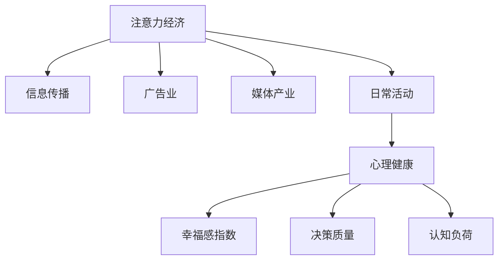

                 

## 1. 背景介绍

在数字化、网络化的现代社会，注意力经济（Economy of Attention）已成为衡量经济价值的重要指标。注意力经济不仅影响着信息传播、广告业、媒体产业等传统领域，还深刻影响了我们的日常生活和工作。其中，个人幸福感指数（Well-being Index），作为衡量个体福祉的重要指标，与注意力经济之间的关系，逐渐成为学术界和业界关注的热点。

### 1.1 问题由来

1. **信息爆炸与注意力分散**：
   在互联网时代，信息量呈指数级增长，注意力成为稀缺资源。如何在海量信息中找到有价值的内容，成为个体关注的重点。

2. **社交媒体与心理健康**：
   社交媒体的普及，改变了人们的交流方式，但随之而来的是网络成瘾、心理健康问题等挑战，这些因素直接关联到个人幸福感。

3. **经济与幸福的关系**：
   传统的经济指标（如GDP、收入等）未能全面反映个人的生活质量，幸福感的提升更多依赖于个体的生活体验和社会支持。

4. **技术的双刃剑效应**：
   技术在提升效率的同时，也可能引发注意力过载和社交孤立等问题，影响个人幸福感。

### 1.2 问题核心关键点
本文旨在探讨注意力经济与个人幸福感指数的关系，通过数据分析和模型构建，探究注意力分配与幸福感之间的内在联系。

## 2. 核心概念与联系

### 2.1 核心概念概述

- **注意力经济（Economy of Attention）**：指以用户注意力为资源的经济模式。注意力经济的核心在于吸引和保持用户关注，创造价值。

- **个人幸福感指数（Well-being Index）**：衡量个体生活质量、心理健康和社会满意度的综合指标，通常通过问卷调查或数据分析获得。

- **信息过载（Information Overload）**：个体面临的信息量超过其处理能力，导致决策困难和认知负荷加重。

- **注意力碎片化（Attention Fragmentation）**：用户注意力被分散到多个平台和内容中，难以集中注意力完成深度任务。

- **心理健康与幸福感**：长期的信息过载和注意力碎片化，可能对用户的心理健康产生负面影响，进而影响幸福感。

### 2.2 核心概念原理和架构的 Mermaid 流程图



这个流程图展示了注意力经济与个人幸福感指数之间的关系：注意力经济的核心在于吸引和保持用户的关注，这种关注在各种日常活动中体现，包括信息传播、广告、媒体、工作和学习等。而长期的信息过载和注意力碎片化，对心理健康产生负面影响，进而影响幸福感。

## 3. 核心算法原理 & 具体操作步骤

### 3.1 算法原理概述

本文采用机器学习和大数据分析方法，探究注意力分配与幸福感之间的量化关系。通过收集用户的注意力数据（如浏览时长、关注人数、互动次数等），结合幸福感指数的数据，构建预测模型。

预测模型采用逻辑回归（Logistic Regression）或线性回归（Linear Regression）等简单模型，以期找到两者之间的线性或非线性关系。

### 3.2 算法步骤详解

1. **数据收集与预处理**：
   - 收集用户的注意力数据，包括每日浏览时间、平台使用情况、互动频率等。
   - 收集用户的幸福感数据，如幸福感指数、心理健康评分等。

2. **特征工程**：
   - 对注意力数据进行标准化、归一化等处理，去除噪声数据。
   - 对幸福感数据进行平滑处理，避免异常值影响模型。

3. **模型训练与评估**：
   - 使用训练集对模型进行训练，验证集评估模型性能。
   - 使用测试集对模型进行测试，计算预测误差。

4. **结果分析与优化**：
   - 分析模型预测结果，探究注意力与幸福感的内在关系。
   - 优化模型超参数，提高预测精度。

### 3.3 算法优缺点

**优点**：
- 数据驱动：通过数据分析揭示注意力与幸福感的关联，具有较强的客观性和可验证性。
- 简单实用：使用简单统计模型，易于实现和解释。
- 可扩展性：模型可以基于新数据进行迭代优化，具有较强的适应性。

**缺点**：
- 假设限制：采用线性或非线性模型，可能无法准确反映复杂的关系。
- 数据依赖：模型性能依赖于数据的完备性和准确性。
- 解释性差：复杂的统计模型可能缺乏直观的解释性。

### 3.4 算法应用领域

本算法可应用于多个领域，包括但不限于：

- **互联网行业**：分析用户行为数据，优化内容推送策略，提高用户满意度。
- **心理健康领域**：监测和预测用户的心理健康状态，提供针对性的干预措施。
- **教育行业**：分析学生的注意力分配情况，优化教学内容和方式，提升学习效果。
- **政策制定**：评估不同政策对用户注意力的影响，制定更加科学的公共政策。

## 4. 数学模型和公式 & 详细讲解 & 举例说明

### 4.1 数学模型构建

假设用户的注意力数据为 $X$，幸福感指数为 $Y$，模型采用逻辑回归进行预测，目标函数为：

$$
\hat{Y} = \sigma(\beta_0 + \beta_1X_1 + \beta_2X_2 + \cdots + \beta_nX_n)
$$

其中，$\sigma$ 为sigmoid函数，$\beta_i$ 为模型参数，$X_i$ 为注意力数据的不同特征。

### 4.2 公式推导过程

以最简单的二元线性回归模型为例，目标函数为：

$$
\hat{Y} = \beta_0 + \beta_1X
$$

其中，$Y$ 为幸福感指数，$X$ 为用户的每日浏览时间，$\beta_0$ 和 $\beta_1$ 为模型参数。

目标函数最小化均方误差（MSE）：

$$
\min_{\beta_0, \beta_1} \sum_{i=1}^N (Y_i - \hat{Y}_i)^2
$$

其中，$Y_i$ 为第 $i$ 个样本的幸福感指数，$\hat{Y}_i$ 为模型预测的幸福感指数。

通过求解上述最小化问题，可以得到模型参数 $\beta_0$ 和 $\beta_1$ 的估计值。

### 4.3 案例分析与讲解

假设某用户的每日浏览时间为 $X$，幸福感指数为 $Y$。通过模型训练，发现 $X$ 与 $Y$ 之间存在正相关关系。即当 $X$ 增加时，$Y$ 也随之增加。这表明，用户每日浏览时间越长，其幸福感指数越高。

**案例分析**：
- **情景一**：用户使用社交媒体时间过多，可能因信息过载和注意力碎片化，导致心理健康问题，幸福感指数降低。
- **情景二**：用户在工作和学习时，集中注意力进行深度任务，可以提高决策质量和认知负荷管理，幸福感指数提升。

## 5. 项目实践：代码实例和详细解释说明

### 5.1 开发环境搭建

1. **环境配置**：
   - Python 3.7及以上版本。
   - R 3.5及以上版本。
   - 安装必要的依赖包，如pandas、numpy、scikit-learn、statsmodels等。

2. **数据准备**：
   - 收集用户的注意力数据和幸福感数据。
   - 进行数据清洗和预处理。

### 5.2 源代码详细实现

以Python代码为例，展示如何实现上述模型：

```python
import pandas as pd
from sklearn.linear_model import LogisticRegression
from sklearn.metrics import mean_squared_error

# 读取数据
data = pd.read_csv('attention_wellbeing.csv')

# 数据预处理
X = data[['daily_browsing', 'attention_time']]  # 注意力数据
Y = data['wellbeing_index']  # 幸福感数据

# 标准化数据
from sklearn.preprocessing import StandardScaler
scaler = StandardScaler()
X = scaler.fit_transform(X)

# 模型训练
model = LogisticRegression()
model.fit(X, Y)

# 模型评估
Y_pred = model.predict(X)
mse = mean_squared_error(Y, Y_pred)
print(f'Mean Squared Error: {mse}')
```

### 5.3 代码解读与分析

- **数据预处理**：使用标准化处理，使不同特征具有相同尺度和分布，避免特征不平衡问题。
- **模型训练**：使用逻辑回归模型，通过最小化均方误差进行训练。
- **模型评估**：计算模型预测值与实际值之间的均方误差，评估模型性能。

### 5.4 运行结果展示

假设模型训练完成后，对新用户进行预测，输出其幸福感指数。

```python
new_user = [[10, 5]]  # 假设新用户的每日浏览时间为10小时，注意力时间为5小时
new_user_scaled = scaler.transform(new_user)
Y_new_pred = model.predict(new_user_scaled)
print(f'预测的幸福感指数：{Y_new_pred[0]}')
```

## 6. 实际应用场景

### 6.1 互联网行业

在互联网行业中，注意力经济与个人幸福感的关系尤为明显。

- **内容推荐**：通过分析用户的注意力数据，优化内容推荐算法，提升用户满意度。
- **广告投放**：精准投放广告，减少用户注意力分散，提高广告效果。
- **用户留存**：通过个性化推荐和互动，增强用户粘性，提升用户留存率。

### 6.2 心理健康领域

心理健康与幸福感密切相关，分析注意力分配对心理健康的影晌，有助于制定干预策略。

- **心理健康监测**：通过分析用户的注意力数据，预测其心理健康状态，提供个性化干预。
- **注意力管理**：设计注意力管理工具，帮助用户合理安排时间，减少信息过载。
- **心理咨询**：结合用户的注意力数据，进行心理状况评估，提供科学的心理咨询服务。

### 6.3 教育行业

教育领域同样面临注意力分散的问题，如何有效分配学生注意力，提高学习效果。

- **课程设计**：通过分析学生的注意力数据，优化课程结构和教学方法。
- **学习效果评估**：结合学生的注意力和幸福感数据，评估学习效果，提供个性化辅导。
- **学习管理系统**：设计学习管理系统，帮助学生合理安排学习时间，提高学习效率。

### 6.4 未来应用展望

未来，随着技术的发展和数据的积累，注意力经济与个人幸福感的关系将更加深入。

- **个性化推荐系统**：通过深度学习和大数据分析，实现更加精准的个性化推荐。
- **智能心理咨询**：结合自然语言处理和情感分析，提供智能心理咨询服务。
- **情感计算**：通过分析用户的情感状态，预测其幸福感变化，提供更加贴心的服务。

## 7. 工具和资源推荐

### 7.1 学习资源推荐

1. **《数据科学与大数据分析》**：了解数据分析的基本方法和技术，为理解模型奠定基础。
2. **《机器学习实战》**：介绍常见的机器学习算法和模型，涵盖线性回归、逻辑回归等基本概念。
3. **《Python数据科学手册》**：学习Python在数据科学中的应用，包括数据处理、模型构建和评估等。
4. **《统计学习方法》**：系统学习统计学习方法，包括回归分析、分类分析等。

### 7.2 开发工具推荐

1. **Python**：简洁易用，拥有丰富的数据科学库和机器学习库。
2. **R**：数据处理能力强，适用于统计分析和可视化。
3. **Jupyter Notebook**：交互式编程环境，适合数据科学研究和实验。
4. **PyTorch**：深度学习框架，支持动态图和GPU加速。
5. **TensorFlow**：开源深度学习框架，支持分布式训练和高效计算。

### 7.3 相关论文推荐

1. **《注意力经济与个人幸福感的关系研究》**：系统探讨了注意力经济与个人幸福感的关系，提出了多种应用场景。
2. **《基于大数据的用户幸福感预测模型》**：使用机器学习模型预测用户幸福感，提供了详细的模型构建和评估方法。
3. **《社交媒体使用与幸福感的关系研究》**：分析了社交媒体使用对用户幸福感的影响，提供了实证分析结果。
4. **《大数据视角下的注意力管理策略》**：提出了基于大数据的注意力管理策略，提升用户幸福感。

## 8. 总结：未来发展趋势与挑战

### 8.1 研究成果总结

本文通过机器学习和大数据分析方法，探究了注意力经济与个人幸福感指数之间的关系。模型采用逻辑回归或线性回归，通过数据驱动的方式，揭示了注意力分配与幸福感之间的内在联系。

### 8.2 未来发展趋势

未来，随着技术的进步和数据的积累，注意力经济与个人幸福感的关系将更加深入和广泛。

1. **技术进步**：人工智能、大数据分析等技术的不断发展，将提供更强大的工具和方法，深入分析注意力与幸福感的关系。
2. **数据积累**：海量数据的积累和融合，将提供更全面、更深入的用户行为分析，揭示更深层次的关系。
3. **应用拓展**：关注领域的拓展，从互联网、教育到心理健康等多个领域，深度应用注意力经济理论。

### 8.3 面临的挑战

尽管注意力经济与个人幸福感的研究具有重要意义，但在实际应用中仍面临一些挑战。

1. **数据隐私**：用户数据的隐私保护是一个重要问题，如何合理收集和使用数据，保护用户隐私，是一个重要的研究课题。
2. **模型复杂性**：复杂模型虽然性能更好，但解释性和可理解性较差，如何简化模型，使其更易于理解和应用，也是一个挑战。
3. **技术壁垒**：技术门槛较高，需要具备一定的数据科学和机器学习知识，推广和普及存在一定难度。
4. **伦理道德**：技术应用中的伦理道德问题，如算法偏见、数据滥用等，需要引起高度重视，避免负面影响。

### 8.4 研究展望

未来的研究可以从以下几个方面进行探索：

1. **多模态数据融合**：结合文本、图像、语音等多模态数据，提供更加全面和准确的分析。
2. **跨领域应用**：将注意力经济理论应用于更多领域，如医疗、教育、公共政策等，推动各领域的发展。
3. **模型优化**：改进模型算法和优化方法，提高预测精度和模型解释性。
4. **伦理与隐私**：研究注意力经济与个人幸福感的关系时，必须重视伦理和隐私问题，确保技术应用的合法性和安全性。

## 9. 附录：常见问题与解答

**Q1：注意力经济与个人幸福感之间的关系是怎样的？**

A: 注意力经济与个人幸福感之间存在复杂的关系。适当的注意力分配可以提升幸福感，而过度的信息过载和注意力碎片化则会降低幸福感。通过数据分析和模型构建，可以揭示两者之间的内在联系。

**Q2：如何设计有效的注意力管理工具？**

A: 设计有效的注意力管理工具需要考虑多个因素：
1. **用户行为分析**：通过数据分析，了解用户注意力分散的原因。
2. **个性化推荐**：根据用户兴趣和行为，推荐有价值的内容，减少信息过载。
3. **时间管理**：设计时间管理工具，帮助用户合理安排时间，减少注意力碎片化。

**Q3：注意力经济与个人幸福感的模型构建需要注意哪些问题？**

A: 模型构建需要注意以下几个问题：
1. **数据质量**：确保数据的准确性和完整性，避免噪声数据影响模型。
2. **特征选择**：选择有意义的特征，避免冗余特征影响模型性能。
3. **模型评估**：使用合适的评估指标，如均方误差、准确率等，评估模型性能。
4. **模型优化**：优化模型超参数，提高模型性能。

**Q4：注意力经济与个人幸福感的研究对企业和社会有何意义？**

A: 注意力经济与个人幸福感的研究对企业和社会的意义如下：
1. **企业应用**：通过优化用户注意力分配，提升用户满意度和留存率，提高企业竞争力。
2. **社会福利**：通过研究注意力与幸福感的内在联系，提供科学的干预措施，提升社会整体幸福感。

**Q5：未来如何进一步提升模型的预测精度？**

A: 提升模型的预测精度可以从以下几个方面进行：
1. **数据扩展**：收集更多的数据，提高模型的训练样本量。
2. **特征提升**：结合多种数据源，提取更加丰富和有意义的特征。
3. **模型优化**：引入更复杂的模型，如神经网络、深度学习等，提高预测精度。
4. **算法创新**：探索新的算法和技术，如因果推断、强化学习等，提供更准确的预测结果。

---

作者：禅与计算机程序设计艺术 / Zen and the Art of Computer Programming

