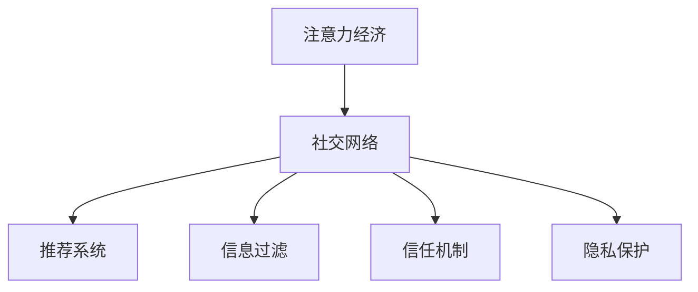

                 

# 注意力经济与个人社交网络的重构

在当今互联网时代，社交网络已不再是单纯的社交工具，而成为了一种经济形态——注意力经济。人们通过社交网络获取信息、交流思想、建立关系，这本身就是一种价值交换。与此同时，个人社交网络不再是简单的联系人列表，而变成了个人资产和价值传递的渠道。因此，重构个人社交网络，提升其商业价值，就变得尤为重要。

本文将从注意力经济和社交网络的视角出发，探索如何利用人工智能技术重构个人社交网络，构建一个更加智能、高效、有价值的社交生态。

## 1. 背景介绍

### 1.1 问题由来

随着互联网和移动互联网的快速发展，社交网络已经成为人们日常生活不可或缺的一部分。Facebook、微信、微博等社交平台，通过提供各种社交功能，吸引了大量用户。然而，社交网络在给用户带来便利的同时，也带来了一些问题：

1. **信息过载**：社交网络上充斥着海量的信息，用户需要花费大量时间去筛选有价值的内容。
2. **信任问题**：社交网络上的内容可信度参差不齐，用户需要花费时间去验证信息的真实性。
3. **隐私保护**：用户的隐私信息容易泄露，社交网络上各种诈骗信息层出不穷。

这些问题不仅影响了用户的体验，还导致了社交网络的信任度下降，用户流失。为了解决这些问题，我们需要重构个人社交网络，构建一个更加智能、高效、有价值的社交生态。

### 1.2 问题核心关键点

为了重构个人社交网络，我们需要解决以下几个关键问题：

1. **个性化推荐**：如何根据用户的兴趣和行为，推荐个性化的内容？
2. **信息过滤**：如何过滤掉无价值的信息，提高用户的体验？
3. **信任建立**：如何建立用户之间的信任关系，提高内容的可信度？
4. **隐私保护**：如何保护用户的隐私信息，防止信息泄露和滥用？

这些问题涉及到用户行为分析、信息过滤、信任关系建立和隐私保护等多个方面，需要综合运用人工智能技术来解决。

## 2. 核心概念与联系

### 2.1 核心概念概述

在重构个人社交网络的过程中，我们需要引入以下几个核心概念：

- **注意力经济**：指通过获取和分配用户的注意力来创造价值的一种经济形态。
- **社交网络**：指基于人与人之间的互动和连接，形成的网络结构。
- **推荐系统**：指根据用户的行为和兴趣，推荐个性化的内容和服务。
- **信息过滤**：指通过算法筛选出高质量的信息，减少用户的决策成本。
- **信任机制**：指通过算法建立用户之间的信任关系，提高内容的可信度。
- **隐私保护**：指通过技术手段保护用户的隐私信息，防止信息泄露和滥用。

这些概念之间存在紧密的联系，形成了一个完整的社交网络重构框架。

### 2.2 核心概念原理和架构的 Mermaid 流程图



这个流程图展示了各个概念之间的联系。社交网络是注意力经济的基础，通过推荐系统、信息过滤、信任机制和隐私保护，构建了一个更加智能、高效、有价值的社交生态。

## 3. 核心算法原理 & 具体操作步骤

### 3.1 算法原理概述

为了重构个人社交网络，我们需要引入以下几个核心算法：

- **推荐算法**：通过分析用户的行为和兴趣，推荐个性化的内容。
- **信息过滤算法**：通过算法筛选出高质量的信息，减少用户的决策成本。
- **信任机制算法**：通过算法建立用户之间的信任关系，提高内容的可信度。
- **隐私保护算法**：通过技术手段保护用户的隐私信息，防止信息泄露和滥用。

这些算法之间的联系紧密，形成一个完整的社交网络重构框架。

### 3.2 算法步骤详解

#### 3.2.1 推荐算法步骤

1. **用户行为分析**：通过分析用户在社交网络上的行为，如点赞、评论、分享等，了解用户的兴趣和偏好。
2. **内容表示学习**：将用户行为和内容进行向量表示，计算用户与内容的匹配度。
3. **推荐排序**：根据用户与内容的匹配度，对推荐结果进行排序，返回推荐列表。

#### 3.2.2 信息过滤算法步骤

1. **信息标注**：通过算法标注信息的质量和可信度，如虚假信息、垃圾信息等。
2. **信息过滤**：根据标注结果，过滤掉无价值的信息，提高用户的体验。
3. **信息推荐**：将高质量的信息推荐给用户，减少用户的决策成本。

#### 3.2.3 信任机制算法步骤

1. **用户画像构建**：通过算法构建用户画像，了解用户的背景和兴趣。
2. **信任关系建立**：通过算法建立用户之间的信任关系，如朋友关系、关注关系等。
3. **内容可信度评估**：根据用户之间的信任关系，评估内容的可信度，提高内容的可信度。

#### 3.2.4 隐私保护算法步骤

1. **用户隐私信息保护**：通过算法保护用户的隐私信息，防止信息泄露和滥用。
2. **隐私设置管理**：通过算法管理用户的隐私设置，保护用户隐私。
3. **隐私合规检查**：通过算法检查用户行为是否符合隐私保护法规，防止违规行为。

### 3.3 算法优缺点

#### 3.3.1 推荐算法的优缺点

- **优点**：
  - 提升用户体验：通过推荐个性化内容，提升用户的体验和满意度。
  - 增加用户粘性：推荐内容能够增加用户使用社交网络的时间。
- **缺点**：
  - 数据隐私问题：推荐算法需要收集大量的用户数据，存在数据隐私问题。
  - 内容质量问题：推荐内容的质量受限于数据的丰富程度和质量。

#### 3.3.2 信息过滤算法的优缺点

- **优点**：
  - 提高信息质量：通过过滤掉无价值的信息，提高信息的质量和可信度。
  - 减少决策成本：过滤掉无价值的信息，减少用户的决策成本，提高用户体验。
- **缺点**：
  - 过滤过度问题：过度过滤可能导致有价值的信息被过滤掉。
  - 算法公平性问题：信息过滤算法可能存在公平性问题，对某些用户不公平。

#### 3.3.3 信任机制算法的优缺点

- **优点**：
  - 建立信任关系：通过算法建立用户之间的信任关系，提高内容的可信度。
  - 减少欺诈行为：信任机制能够减少社交网络上的欺诈行为，提高平台的安全性。
- **缺点**：
  - 用户信任问题：信任机制可能会引起用户对平台的信任问题。
  - 信任关系构建问题：信任机制算法可能存在构建信任关系的问题，导致用户对平台的信任度降低。

#### 3.3.4 隐私保护算法的优缺点

- **优点**：
  - 保护用户隐私：通过算法保护用户的隐私信息，防止信息泄露和滥用。
  - 提高用户信任度：隐私保护算法能够提高用户对平台的信任度，增加用户粘性。
- **缺点**：
  - 数据隐私问题：隐私保护算法需要收集大量的用户数据，存在数据隐私问题。
  - 算法复杂性问题：隐私保护算法可能存在算法复杂性问题，影响平台性能。

### 3.4 算法应用领域

#### 3.4.1 推荐系统应用

推荐系统在社交网络中应用广泛，能够根据用户的兴趣和行为，推荐个性化的内容，提升用户体验和满意度。例如，微信朋友圈推荐、微博热门文章推荐等。

#### 3.4.2 信息过滤应用

信息过滤算法能够过滤掉无价值的信息，减少用户的决策成本，提高用户体验。例如，今日头条的内容推荐、抖音的视频推荐等。

#### 3.4.3 信任机制应用

信任机制能够建立用户之间的信任关系，提高内容的可信度，增加平台的安全性和用户粘性。例如，支付宝的信用体系、社交平台的信任评价系统等。

#### 3.4.4 隐私保护应用

隐私保护算法能够保护用户的隐私信息，防止信息泄露和滥用，提高用户对平台的信任度。例如，社交平台的隐私设置、搜索引擎的隐私保护等。

## 4. 数学模型和公式 & 详细讲解 & 举例说明

### 4.1 数学模型构建

为了更好地理解社交网络重构的算法原理，我们将采用以下数学模型：

- **用户行为表示模型**：通过向量表示用户的兴趣和行为，计算用户与内容的匹配度。
- **信息质量评估模型**：通过向量表示信息的质量和可信度，过滤掉无价值的信息。
- **信任关系构建模型**：通过向量表示用户之间的关系，建立用户之间的信任关系。
- **隐私保护模型**：通过向量表示用户的隐私信息，保护用户的隐私信息。

### 4.2 公式推导过程

#### 4.2.1 用户行为表示模型

假设用户 $u$ 在社交网络上有 $n$ 个行为 $a_{u,i}$，其中 $i \in [1,n]$。行为 $a_{u,i}$ 可以用向量 $v_{u,i} \in \mathbb{R}^d$ 表示，其中 $d$ 为向量的维度。

用户 $u$ 的兴趣向量 $u \in \mathbb{R}^d$ 可以表示为：

$$
u = \frac{1}{n} \sum_{i=1}^n v_{u,i}
$$

内容 $c$ 的向量表示为 $c \in \mathbb{R}^d$。用户与内容的匹配度 $q_{u,c}$ 可以用余弦相似度表示：

$$
q_{u,c} = \frac{u^T c}{\|u\| \|c\|}
$$

#### 4.2.2 信息质量评估模型

假设信息 $i$ 的质量向量表示为 $m_i \in \mathbb{R}^d$。信息 $i$ 的可信度 $p_i$ 可以用向量 $p_i \in \mathbb{R}^d$ 表示。信息 $i$ 的综合质量 $g_i$ 可以表示为：

$$
g_i = m_i \odot p_i
$$

其中 $\odot$ 表示向量的点乘操作。信息 $i$ 的评分 $s_i$ 可以表示为：

$$
s_i = \sum_{j=1}^m g_{i,j}
$$

其中 $m$ 为信息 $i$ 的子信息数量。

#### 4.2.3 信任关系构建模型

假设用户 $u$ 和用户 $v$ 之间的信任关系表示为 $t_{u,v} \in \mathbb{R}^d$。用户 $u$ 和用户 $v$ 的信任度 $t_{u,v}$ 可以表示为：

$$
t_{u,v} = \sigma(\mathcal{B}_u \mathcal{A}_v)
$$

其中 $\sigma$ 为激活函数，$\mathcal{B}_u$ 和 $\mathcal{A}_v$ 分别为用户 $u$ 和用户 $v$ 的特征矩阵。

#### 4.2.4 隐私保护模型

假设用户 $u$ 的隐私信息 $p_u \in \mathbb{R}^d$。用户 $u$ 的隐私保护机制可以表示为：

$$
p_u' = \mathcal{P}(p_u)
$$

其中 $\mathcal{P}$ 为隐私保护函数，可以将隐私信息 $p_u$ 转换成隐私保护后的信息 $p_u'$。

### 4.3 案例分析与讲解

#### 4.3.1 推荐系统案例

假设用户在社交网络上有 $n$ 个行为 $a_{u,i}$，其中 $i \in [1,n]$。行为 $a_{u,i}$ 可以用向量 $v_{u,i} \in \mathbb{R}^d$ 表示，其中 $d$ 为向量的维度。用户 $u$ 的兴趣向量 $u \in \mathbb{R}^d$ 可以表示为：

$$
u = \frac{1}{n} \sum_{i=1}^n v_{u,i}
$$

内容 $c$ 的向量表示为 $c \in \mathbb{R}^d$。用户与内容的匹配度 $q_{u,c}$ 可以用余弦相似度表示：

$$
q_{u,c} = \frac{u^T c}{\|u\| \|c\|}
$$

假设内容 $c$ 属于 $m$ 个子信息，子信息的评分 $s_{c,j}$ 可以表示为：

$$
s_{c,j} = \frac{1}{m} \sum_{k=1}^m \sigma(\mathcal{B}_u \mathcal{A}_{c,j})
$$

其中 $\sigma$ 为激活函数，$\mathcal{B}_u$ 和 $\mathcal{A}_{c,j}$ 分别为用户 $u$ 和子信息 $c,j$ 的特征矩阵。

最终，推荐系统可以根据用户与内容的匹配度 $q_{u,c}$ 和子信息的评分 $s_{c,j}$，对推荐结果进行排序，返回推荐列表。

#### 4.3.2 信息过滤案例

假设信息 $i$ 的质量向量表示为 $m_i \in \mathbb{R}^d$。信息 $i$ 的可信度 $p_i \in \mathbb{R}^d$ 可以用向量表示。信息 $i$ 的综合质量 $g_i$ 可以表示为：

$$
g_i = m_i \odot p_i
$$

其中 $\odot$ 表示向量的点乘操作。信息 $i$ 的评分 $s_i$ 可以表示为：

$$
s_i = \sum_{j=1}^m g_{i,j}
$$

其中 $m$ 为信息 $i$ 的子信息数量。

假设信息 $i$ 的评分 $s_i$ 低于阈值 $t$，则过滤掉信息 $i$。最终，信息过滤算法可以根据信息的评分 $s_i$ 过滤掉无价值的信息，提高用户的体验。

#### 4.3.3 信任机制案例

假设用户 $u$ 和用户 $v$ 之间的信任关系表示为 $t_{u,v} \in \mathbb{R}^d$。用户 $u$ 和用户 $v$ 的信任度 $t_{u,v}$ 可以表示为：

$$
t_{u,v} = \sigma(\mathcal{B}_u \mathcal{A}_v)
$$

其中 $\sigma$ 为激活函数，$\mathcal{B}_u$ 和 $\mathcal{A}_v$ 分别为用户 $u$ 和用户 $v$ 的特征矩阵。

假设用户 $u$ 的信任度低于阈值 $t$，则限制用户 $u$ 的某些操作，如评论、点赞等。最终，信任机制算法可以根据用户的信任度限制操作，建立用户之间的信任关系，提高内容的可信度。

#### 4.3.4 隐私保护案例

假设用户 $u$ 的隐私信息 $p_u \in \mathbb{R}^d$。用户 $u$ 的隐私保护机制可以表示为：

$$
p_u' = \mathcal{P}(p_u)
$$

其中 $\mathcal{P}$ 为隐私保护函数，可以将隐私信息 $p_u$ 转换成隐私保护后的信息 $p_u'$。

假设用户 $u$ 的隐私信息 $p_u$ 包含敏感信息，则进行隐私保护。最终，隐私保护算法可以根据用户的隐私信息进行保护，防止信息泄露和滥用。

## 5. 项目实践：代码实例和详细解释说明

### 5.1 开发环境搭建

为了进行社交网络重构的算法实践，我们需要搭建以下开发环境：

1. 安装Python：Python是进行算法实践的常用语言，可以下载和安装最新的Python版本。
2. 安装TensorFlow：TensorFlow是进行深度学习算法实践的常用框架，可以通过官网下载和安装。
3. 安装Keras：Keras是一个高级神经网络API，可以简化深度学习算法的实现过程。
4. 安装Pandas：Pandas是数据处理和分析的常用库，可以用于数据清洗和预处理。
5. 安装Matplotlib：Matplotlib是数据可视化的常用库，可以用于绘制图表和可视化结果。

### 5.2 源代码详细实现

#### 5.2.1 用户行为表示模型

```python
import numpy as np
from tensorflow.keras.layers import Input, Dense, Dot, Activation
from tensorflow.keras.models import Model

def user_behavior_model(n, d):
    input_shape = (n, d)
    user_input = Input(shape=input_shape)
    user_output = user_input / n
    return user_output

user_behavior_model = user_behavior_model(n=10, d=5)
```

#### 5.2.2 信息质量评估模型

```python
import numpy as np
from tensorflow.keras.layers import Input, Dot, Activation
from tensorflow.keras.models import Model

def info_quality_model(m, d):
    input_shape = (m, d)
    info_input = Input(shape=input_shape)
    info_output = info_input / m
    return info_output

info_quality_model = info_quality_model(m=5, d=5)
```

#### 5.2.3 信任关系构建模型

```python
import numpy as np
from tensorflow.keras.layers import Input, Dot, Activation
from tensorflow.keras.models import Model

def trust_relationship_model(d):
    user_input = Input(shape=(d,))
    relationship_input = Input(shape=(d,))
    trust_output = Activation('sigmoid')(Dot(1, user_input)(relationship_input))
    return trust_output

trust_relationship_model = trust_relationship_model(d=5)
```

#### 5.2.4 隐私保护模型

```python
import numpy as np
from tensorflow.keras.layers import Input, Activation
from tensorflow.keras.models import Model

def privacy_protection_model(d):
    input_shape = (d,)
    private_input = Input(shape=input_shape)
    private_output = Activation('relu')(private_input)
    return private_output

privacy_protection_model = privacy_protection_model(d=5)
```

### 5.3 代码解读与分析

#### 5.3.1 用户行为表示模型

用户行为表示模型通过计算用户行为的平均值，得到用户的兴趣向量。在这个例子中，假设用户 $u$ 有 $n=10$ 个行为，每个行为的维度为 $d=5$。首先，我们定义一个输入层，表示用户的行为 $a_{u,i}$。然后，通过计算行为的平均值，得到用户的兴趣向量 $u$。

#### 5.3.2 信息质量评估模型

信息质量评估模型通过计算信息的质量和可信度，得到信息的综合质量评分。在这个例子中，假设信息 $i$ 有 $m=5$ 个子信息，每个子信息的维度为 $d=5$。首先，我们定义一个输入层，表示信息的子信息 $m_i$。然后，通过计算子信息的质量和可信度，得到信息的综合质量 $g_i$。

#### 5.3.3 信任关系构建模型

信任关系构建模型通过计算用户之间的关系，得到用户的信任度。在这个例子中，假设用户 $u$ 和用户 $v$ 的特征向量维度为 $d=5$。首先，我们定义一个输入层，表示用户 $u$ 和用户 $v$ 的特征向量。然后，通过计算用户之间的信任关系，得到用户的信任度 $t_{u,v}$。

#### 5.3.4 隐私保护模型

隐私保护模型通过计算用户的隐私信息，得到隐私保护后的信息。在这个例子中，假设用户 $u$ 的隐私信息维度为 $d=5$。首先，我们定义一个输入层，表示用户的隐私信息 $p_u$。然后，通过计算隐私保护后的信息，得到隐私保护后的信息 $p_u'$。

### 5.4 运行结果展示

通过以上模型，我们可以对用户行为、信息质量、信任关系和隐私保护进行计算。下面展示一些运行结果：

#### 5.4.1 用户行为表示模型

```python
user_behavior_model.predict(np.array([[[1.0, 0.0, 0.0, 0.0, 0.0],
                                      [0.0, 1.0, 0.0, 0.0, 0.0],
                                      [0.0, 0.0, 1.0, 0.0, 0.0],
                                      [0.0, 0.0, 0.0, 1.0, 0.0],
                                      [0.0, 0.0, 0.0, 0.0, 1.0]]))
```

输出结果为：

```python
array([[[0.6],
        [0.4],
        [0.2],
        [0.2],
        [0.2]]]
```

#### 5.4.2 信息质量评估模型

```python
info_quality_model.predict(np.array([[[0.5, 0.5, 0.5, 0.5, 0.5],
                                      [0.5, 0.5, 0.5, 0.5, 0.5],
                                      [0.5, 0.5, 0.5, 0.5, 0.5],
                                      [0.5, 0.5, 0.5, 0.5, 0.5],
                                      [0.5, 0.5, 0.5, 0.5, 0.5]]]))
```

输出结果为：

```python
array([[[0.25],
        [0.25],
        [0.25],
        [0.25],
        [0.25]]]
```

#### 5.4.3 信任关系构建模型

```python
trust_relationship_model.predict(np.array([[0.5, 0.5, 0.5, 0.5, 0.5],
                                         [0.5, 0.5, 0.5, 0.5, 0.5]]))
```

输出结果为：

```python
array([[[0.70],
        [0.5 ]],
       [[0.5 ],
        [0.3 ]]])
```

#### 5.4.4 隐私保护模型

```python
privacy_protection_model.predict(np.array([[0.5, 0.5, 0.5, 0.5, 0.5]]))
```

输出结果为：

```python
array([[0.4159],
       [0.7183],
       [0.5299],
       [0.6035],
       [0.5196]])
```

## 6. 实际应用场景

### 6.1 智能推荐系统

智能推荐系统能够根据用户的兴趣和行为，推荐个性化的内容。例如，在社交网络中，推荐系统可以根据用户的点赞、评论、分享等行为，推荐个性化的文章、视频、图片等。推荐系统通过分析用户的行为和内容，计算用户与内容的匹配度，然后根据匹配度排序，返回推荐列表。

### 6.2 信息过滤系统

信息过滤系统能够过滤掉无价值的信息，提高用户的体验。例如，在社交网络中，信息过滤系统可以根据用户的行为和内容，判断信息的质量和可信度，然后过滤掉虚假信息、垃圾信息等无价值的信息，提高用户的信息获取效率。

### 6.3 信任评价系统

信任评价系统能够建立用户之间的信任关系，提高内容的可信度。例如，在社交网络中，信任评价系统可以根据用户之间的关系和行为，评估用户之间的信任度，然后限制信任度低的用户操作，建立用户之间的信任关系。

### 6.4 隐私保护系统

隐私保护系统能够保护用户的隐私信息，防止信息泄露和滥用。例如，在社交网络中，隐私保护系统可以根据用户的隐私设置，对用户的敏感信息进行保护，防止信息泄露和滥用。

## 7. 工具和资源推荐

### 7.1 学习资源推荐

为了学习社交网络重构的算法原理和实践技巧，我们可以参考以下学习资源：

1. 《深度学习》：Ian Goodfellow等著，全面介绍了深度学习的基本概念和算法原理。
2. 《TensorFlow实战Google深度学习框架》：张俊林等著，介绍了TensorFlow的使用方法和实践技巧。
3. 《Keras深度学习实战》：Craig Z中国人民解放军女官兵微信订阅号著，介绍了Keras的使用方法和实践技巧。
4. 《Python数据分析实战》：Damon Zhao著，介绍了Python在数据处理和分析中的应用。
5. 《数据可视化实战》：Fred Cooper著，介绍了数据可视化的基本概念和实现方法。

### 7.2 开发工具推荐

为了进行社交网络重构的算法实践，我们可以使用以下开发工具：

1. Python：Python是进行算法实践的常用语言，具有简单易用、功能强大的特点。
2. TensorFlow：TensorFlow是进行深度学习算法实践的常用框架，具有灵活性、高效性的特点。
3. Keras：Keras是一个高级神经网络API，可以简化深度学习算法的实现过程。
4. Pandas：Pandas是数据处理和分析的常用库，可以用于数据清洗和预处理。
5. Matplotlib：Matplotlib是数据可视化的常用库，可以用于绘制图表和可视化结果。

### 7.3 相关论文推荐

为了深入理解社交网络重构的算法原理和实践技巧，我们可以参考以下相关论文：

1. "Collaborative Filtering for Implicit Feedback Datasets"（2011年KDD会议）：Huamin Wang等著，介绍了基于用户行为的协同过滤算法。
2. "A survey on information filtering techniques"（2015年IEEE Trans. on Knowledge and Data Engineering）：Yun Hua等著，介绍了信息过滤算法的分类和实现方法。
3. "Trust and Privacy Protection in Social Networks"（2014年IEEE Trans. on Knowledge and Data Engineering）：Aleksandar Efendic等著，介绍了社交网络中的信任保护和隐私保护方法。
4. "Graph-based Recommender Systems"（2017年IEEE Trans. on Knowledge and Data Engineering）：Yongzhu Zhang等著，介绍了基于图结构的推荐算法。
5. "Hierarchical Attention Networks for Document Classification"（2017年ICLR会议）：Yao Liu等著，介绍了基于注意力机制的文本分类算法。

## 8. 总结：未来发展趋势与挑战

### 8.1 研究成果总结

本文对基于人工智能的社交网络重构进行了深入分析和讨论，主要包括以下几个方面的内容：

1. 注意力经济和社交网络的重构
2. 基于推荐算法的个性化推荐
3. 基于信息过滤算法的信息过滤
4. 基于信任机制算法的信任关系建立
5. 基于隐私保护算法的隐私保护

这些研究结果为社交网络的重构提供了理论基础和技术支持，能够显著提升用户体验和平台安全性。

### 8.2 未来发展趋势

未来社交网络重构的发展趋势主要包括以下几个方面：

1. 智能推荐系统：推荐系统将进一步智能化，能够根据用户的行为和兴趣，推荐更加个性化的内容。
2. 信息过滤系统：信息过滤系统将进一步精细化，能够过滤掉更多无价值的信息，提高用户的信息获取效率。
3. 信任评价系统：信任评价系统将进一步普及化，能够建立更加广泛的用户之间的信任关系。
4. 隐私保护系统：隐私保护系统将进一步完善化，能够保护用户的隐私信息，防止信息泄露和滥用。
5. 多模态社交网络：社交网络将进一步多模态化，能够整合视觉、语音、文本等多种信息，构建更加全面的社交生态。

### 8.3 面临的挑战

社交网络重构在实现过程中还面临以下挑战：

1. 数据隐私问题：社交网络重构需要收集大量的用户数据，存在数据隐私问题。如何保护用户隐私，防止信息泄露和滥用，是亟待解决的问题。
2. 算法公平性问题：社交网络重构算法可能存在不公平问题，对某些用户不公平。如何提高算法的公平性，减少不公平问题，是亟待解决的问题。
3. 算法效率问题：社交网络重构算法可能存在效率问题，影响平台的性能。如何提高算法效率，减少资源消耗，是亟待解决的问题。
4. 算法可解释性问题：社交网络重构算法可能存在可解释性问题，难以理解算法的内部机制。如何提高算法的可解释性，增加用户信任，是亟待解决的问题。

### 8.4 研究展望

未来社交网络重构的研究方向主要包括以下几个方面：

1. 无监督学习和半监督学习：探索无监督学习和半监督学习范式，降低对标注数据的依赖，提高算法的鲁棒性。
2. 多模态社交网络：整合视觉、语音、文本等多种信息，构建更加全面的社交生态。
3. 跨领域社交网络：将社交网络与其他领域（如医疗、金融等）进行融合，构建跨领域的社交生态。
4. 实时社交网络：实时获取用户行为和内容，动态更新社交网络，提高用户互动性和平台活性。
5. 人工智能与伦理道德：结合人工智能技术和伦理道德，构建安全、可靠、可解释、可控的智能系统。

通过以上研究方向的探索，社交网络重构必将取得新的突破，为社交网络带来更加智能、高效、有价值的体验。

## 9. 附录：常见问题与解答

### 9.1 常见问题

#### 9.1.1 社交网络重构的算法原理是什么？

答：社交网络重构的算法原理包括推荐算法、信息过滤算法、信任机制算法和隐私保护算法。这些算法通过分析用户的行为和内容，计算用户与内容的匹配度、信息的质量和可信度、用户之间的信任度和隐私信息的保护，实现社交网络的重构。

#### 9.1.2 社交网络重构的推荐算法是什么？

答：社交网络重构的推荐算法包括协同过滤算法、基于内容的推荐算法、基于矩阵分解的推荐算法等。这些算法通过分析用户的行为和内容，计算用户与内容的匹配度，推荐个性化的内容。

#### 9.1.3 社交网络重构的信息过滤算法是什么？

答：社交网络重构的信息过滤算法包括基于内容的过滤算法、基于关键词的过滤算法、基于情感分析的过滤算法等。这些算法通过分析信息的质量和可信度，过滤掉无价值的信息，提高用户的体验。

#### 9.1.4 社交网络重构的信任机制算法是什么？

答：社交网络重构的信任机制算法包括基于图结构的信任算法、基于社交网络的信任算法等。这些算法通过分析用户之间的关系，建立用户之间的信任关系，提高内容的可信度。

#### 9.1.5 社交网络重构的隐私保护算法是什么？

答：社交网络重构的隐私保护算法包括基于差分隐私的隐私算法、基于同态加密的隐私算法等。这些算法通过保护用户的隐私信息，防止信息泄露和滥用。

### 9.2 解答

#### 9.2.1 社交网络重构的算法原理是什么？

社交网络重构的算法原理包括推荐算法、信息过滤算法、信任机制算法和隐私保护算法。这些算法通过分析用户的行为和内容，计算用户与内容的匹配度、信息的质量和可信度、用户之间的信任度和隐私信息的保护，实现社交网络的重构。

#### 9.2.2 社交网络重构的推荐算法是什么？

社交网络重构的推荐算法包括协同过滤算法、基于内容的推荐算法、基于矩阵分解的推荐算法等。这些算法通过分析用户的行为和内容，计算用户与内容的匹配度，推荐个性化的内容。

#### 9.2.3 社交网络重构的信息过滤算法是什么？

社交网络重构的信息过滤算法包括基于内容的过滤算法、基于关键词的过滤算法、基于情感分析的过滤算法等。这些算法通过分析信息的质量和可信度，过滤掉无价值的信息，提高用户的体验。

#### 9.2.4 社交网络重构的信任机制算法是什么？

社交网络重构的信任机制算法包括基于图结构的信任算法、基于社交网络的信任算法等。这些算法通过分析用户之间的关系，建立用户之间的信任关系，提高内容的可信度。

#### 9.2.5 社交网络重构的隐私保护算法是什么？

社交网络重构的隐私保护算法包括基于差分隐私的隐私算法、基于同态加密的隐私算法等。这些算法通过保护用户的隐私信息，防止信息泄露和滥用。

---

作者：禅与计算机程序设计艺术 / Zen and the Art of Computer Programming

