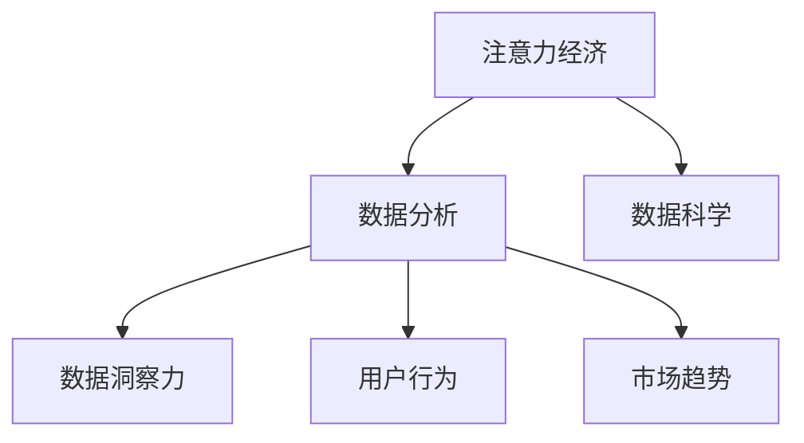

                 

# 注意力经济与数据分析洞察力：利用数据理解受众行为和市场

> 关键词：注意力经济,数据分析,洞察力,受众行为,市场,数据科学

## 1. 背景介绍

### 1.1 问题由来
在数字化时代，信息爆炸和注意力稀缺并存，如何高效利用数据洞察用户行为，精准把握市场需求，成为企业竞争的关键。数据分析作为一种重要手段，通过量化用户行为、分析市场趋势，为决策提供坚实依据，从而实现数据驱动的创新与优化。

### 1.2 问题核心关键点
数据分析的核心在于利用科学方法和工具，从海量数据中提炼有价值的信息，辅助企业制定战略、优化运营。其关键点包括：

- 数据获取：准确、全面、及时地获取各类数据。
- 数据处理：清洗、整理、预处理原始数据。
- 数据分析：运用统计学、机器学习等方法，分析数据特征和趋势。
- 数据可视化：将分析结果直观呈现，帮助决策。
- 模型预测：构建预测模型，预测市场变化和用户行为。

### 1.3 问题研究意义
掌握数据分析技能，对于提升企业决策精准性、优化运营效率、降低决策风险具有重要意义。数据分析不仅能帮助企业更好地理解市场和用户需求，还能提供关键决策依据，驱动企业持续创新和优化，增强市场竞争力。

## 2. 核心概念与联系

### 2.1 核心概念概述

为更好地理解注意力经济与数据分析洞察力的实践，本节将介绍几个关键概念：

- 注意力经济（Attention Economy）：指在信息过载的时代，人们越来越难以专注在所有可用信息上，企业需要精心设计和分配注意力以吸引用户，从而创造价值。
- 数据分析（Data Analysis）：通过收集、整理、分析数据，揭示数据背后的规律和趋势，辅助决策。
- 数据洞察力（Data Insight）：指通过对数据的深入分析，获得的深刻洞见和理解，用于指导决策和行动。
- 用户行为（User Behavior）：用户在特定场景下的行为模式和倾向，包括浏览、点击、购买等。
- 市场趋势（Market Trends）：市场行为和供需关系的变化，影响企业决策和战略规划。
- 数据科学（Data Science）：融合统计学、计算机科学、数据工程等多个领域的交叉学科，旨在从数据中提取知识。

这些概念之间的关系可以通过以下Mermaid流程图来展示：



这个流程图展示了几者之间的逻辑关系：

1. 注意力经济需要通过数据分析理解用户行为和市场趋势。
2. 数据分析的结果有助于提升数据洞察力。
3. 数据洞察力直接指导用户行为分析和市场趋势预测。
4. 数据科学为注意力经济和数据分析提供了技术支撑。

这些概念共同构成了数据分析和决策的框架，有助于企业在竞争激烈的市场中立足并取得优势。

## 3. 核心算法原理 & 具体操作步骤
### 3.1 算法原理概述

数据分析的核心在于从原始数据中提炼有价值的信息，常用的方法包括统计分析、机器学习、数据挖掘等。以下主要介绍统计分析和机器学习在注意力经济中的应用。

统计分析是一种基于数学模型和统计推断的定量分析方法，通过描述数据分布、计算统计量、推断总体特征等手段，帮助企业理解数据。常用的统计方法包括描述性统计、假设检验、回归分析等。

机器学习是一种通过算法让计算机自动学习规律和模式的技术，可以处理非结构化数据，进行预测和分类。常用的机器学习模型包括决策树、随机森林、支持向量机、神经网络等。

### 3.2 算法步骤详解

以机器学习模型为例，基于监督学习的分类模型训练步骤主要包括以下几个环节：

**Step 1: 数据准备**
- 收集和整理数据集，包括数据清洗、去重、归一化等预处理。
- 划分训练集、验证集和测试集，以便评估模型性能。

**Step 2: 特征工程**
- 选择合适的特征，如用户属性、行为数据、文本特征等。
- 进行特征提取和转换，如特征归一化、编码化等。
- 构建特征集合，用于训练模型。

**Step 3: 模型选择与训练**
- 根据问题类型选择适当的模型，如逻辑回归、决策树、随机森林、支持向量机等。
- 设置模型参数，如学习率、迭代次数等。
- 在训练集上训练模型，不断调整参数优化性能。

**Step 4: 模型评估与调优**
- 在验证集上评估模型性能，如准确率、召回率、F1值等。
- 根据评估结果调整模型参数，优化模型性能。
- 在测试集上进一步测试模型性能，确保模型泛化能力。

**Step 5: 结果解读与应用**
- 解读模型输出，分析特征贡献度、模型误差等。
- 将模型应用于实际场景，指导业务决策和运营优化。

### 3.3 算法优缺点

基于监督学习的分类模型在数据分析中应用广泛，具有以下优点：
1. 能够处理复杂非线性关系，适用于多种数据类型。
2. 自动化程度高，易于实现和部署。
3. 结果可解释性强，便于业务理解。
4. 模型预测能力强，能够准确识别用户行为和市场趋势。

同时，该方法也存在一些局限性：
1. 依赖高质量标注数据，标注成本较高。
2. 过拟合风险较高，需要更多的数据和正则化手段。
3. 模型复杂度高，需要较大的计算资源。
4. 对异常值和噪声敏感，需进行异常检测和处理。

尽管存在这些局限性，但就目前而言，基于监督学习的分类模型仍是数据分析和注意力经济实践中的主流范式。未来相关研究将进一步探索更高效、更稳健的模型设计。

### 3.4 算法应用领域

基于监督学习的分类模型在多个领域中均有广泛应用，例如：

- 电商推荐：通过分析用户行为数据，推荐用户感兴趣的商品。
- 金融风险管理：利用客户行为数据，预测和防范信用风险。
- 用户画像构建：整合用户数据，构建用户特征标签。
- 内容推荐系统：分析用户阅读、观看习惯，推荐相关内容。
- 广告投放优化：通过用户行为数据，优化广告定向和投放策略。
- 市场分析：利用销售数据，分析市场趋势和用户偏好。
- 客户流失预测：通过客户行为数据，预测客户流失风险。

除了上述这些经典应用，分类模型还被创新性地应用到更多场景中，如情感分析、舆情监测、异常检测等，为企业决策提供强有力的数据支持。

## 4. 数学模型和公式 & 详细讲解  
### 4.1 数学模型构建

以分类问题为例，假设数据集为 $\{(x_i, y_i)\}_{i=1}^N$，其中 $x_i$ 为样本， $y_i$ 为标签，模型 $M$ 的输出为 $M(x)$。分类模型的目标是找到最优的模型参数 $\theta$，使得模型对数据集的预测误差最小化。

常用的分类模型包括逻辑回归（Logistic Regression）和支持向量机（Support Vector Machine, SVM）。以逻辑回归为例，其目标函数为：

$$
\min_{\theta} \frac{1}{N}\sum_{i=1}^N -y_i\log(M(x_i)) - (1-y_i)\log(1-M(x_i))
$$

其中 $M(x_i) = \frac{1}{1+e^{-z_i}}$， $z_i = \theta^Tx_i$， $\theta$ 为模型参数， $x_i$ 为输入特征， $y_i$ 为输出标签。

### 4.2 公式推导过程

以逻辑回归为例，推导目标函数的梯度公式：

$$
\frac{\partial \mathcal{L}}{\partial \theta} = -\frac{1}{N}\sum_{i=1}^N(y_i - M(x_i))x_i
$$

在实际应用中，目标函数的优化通常使用梯度下降等优化算法，通过迭代调整模型参数 $\theta$，最小化损失函数。

### 4.3 案例分析与讲解

以电商推荐为例，假设数据集为电商平台用户的行为数据，目标是预测用户是否会购买某商品。

**数据准备**
- 收集用户历史浏览、点击、购买数据，构建用户行为特征，如浏览时间、浏览次数、购买次数等。
- 划分训练集、验证集和测试集。

**特征工程**
- 选择用户ID、商品ID、浏览时间等特征，进行归一化和编码化处理。
- 构建特征集合，如计算用户浏览商品的平均价格、点击次数等。

**模型训练**
- 选择逻辑回归模型，设置学习率为0.01，迭代次数为1000。
- 在训练集上训练模型，输出用户是否购买商品的概率。

**模型评估**
- 在验证集上评估模型性能，如准确率、召回率、F1值等。
- 根据评估结果调整模型参数，优化模型性能。

**结果解读与应用**
- 分析模型的输出，了解哪些特征对购买行为影响最大。
- 利用模型结果，优化商品推荐策略，提升用户转化率。

## 5. 项目实践：代码实例和详细解释说明
### 5.1 开发环境搭建

在进行数据分析和注意力经济实践前，我们需要准备好开发环境。以下是使用Python进行Scikit-Learn和Pandas开发的详细环境配置流程：

1. 安装Anaconda：从官网下载并安装Anaconda，用于创建独立的Python环境。

2. 创建并激活虚拟环境：
```bash
conda create -n data-env python=3.8 
conda activate data-env
```

3. 安装依赖包：
```bash
pip install scikit-learn pandas numpy matplotlib jupyter notebook
```

4. 安装数据集：
```bash
# 安装公开数据集，如：
pip install datasets scikit-learn-datasets
```

完成上述步骤后，即可在`data-env`环境中开始数据分析实践。

### 5.2 源代码详细实现

这里以一个电商推荐系统为例，展示如何利用Scikit-Learn库进行分类模型训练和评估。

首先，定义数据集处理函数：

```python
import pandas as pd
from sklearn.model_selection import train_test_split
from sklearn.preprocessing import StandardScaler
from sklearn.linear_model import LogisticRegression
from sklearn.metrics import accuracy_score, precision_score, recall_score, f1_score

def load_data(file_path):
    data = pd.read_csv(file_path)
    return data

def preprocess_data(data):
    features = data.drop('label', axis=1)
    labels = data['label']
    features = StandardScaler().fit_transform(features)
    return features, labels

def train_model(X_train, y_train):
    model = LogisticRegression()
    model.fit(X_train, y_train)
    return model

def evaluate_model(model, X_test, y_test):
    y_pred = model.predict(X_test)
    accuracy = accuracy_score(y_test, y_pred)
    precision = precision_score(y_test, y_pred)
    recall = recall_score(y_test, y_pred)
    f1 = f1_score(y_test, y_pred)
    return accuracy, precision, recall, f1

def main():
    # 加载数据
    data = load_data('data.csv')
    # 数据预处理
    X, y = preprocess_data(data)
    # 划分数据集
    X_train, X_test, y_train, y_test = train_test_split(X, y, test_size=0.2, random_state=42)
    # 模型训练
    model = train_model(X_train, y_train)
    # 模型评估
    accuracy, precision, recall, f1 = evaluate_model(model, X_test, y_test)
    print('Accuracy:', accuracy)
    print('Precision:', precision)
    print('Recall:', recall)
    print('F1 Score:', f1)

if __name__ == '__main__':
    main()
```

然后，运行代码并输出结果：

```bash
# 运行代码
python data_analysis.py
```

上述代码实现了数据加载、预处理、模型训练和评估的完整流程。可以看到，使用Scikit-Learn进行分类模型训练，代码实现相对简洁高效。

### 5.3 代码解读与分析

让我们再详细解读一下关键代码的实现细节：

**load_data函数**：
- 定义数据加载函数，读取CSV格式的数据文件。

**preprocess_data函数**：
- 进行数据预处理，包括特征提取、归一化和标签处理。

**train_model函数**：
- 定义模型训练函数，使用逻辑回归模型，并进行参数优化。

**evaluate_model函数**：
- 定义模型评估函数，计算并输出模型的各项指标。

**main函数**：
- 定义主函数，依次进行数据加载、预处理、模型训练和评估，并输出结果。

代码中的数据加载、预处理、模型训练和评估部分，基本遵循了标准流程，便于理解和复现。在实际应用中，还需要根据具体数据和模型进行优化和调整。

## 6. 实际应用场景
### 6.1 电商推荐系统

电商推荐系统是数据分析和注意力经济的重要应用场景。通过分析用户行为数据，电商公司能够个性化推荐商品，提升用户体验和转化率。

具体而言，可以收集用户浏览、点击、购买等行为数据，通过数据预处理和特征工程，构建用户画像和商品特征。利用分类模型预测用户是否会购买某商品，进而优化推荐策略。例如，根据用户历史购买行为，推荐其感兴趣的商品；根据用户浏览记录，推荐相关商品；根据商品属性和销量，动态调整推荐顺序。

### 6.2 金融风控系统

金融风控系统通过数据分析和机器学习，评估用户信用风险，保护金融机构免受欺诈和违约风险。

在实践中，可以收集用户的贷款记录、还款情况、消费行为等数据，进行特征提取和模型训练。利用分类模型预测用户是否存在违约风险，从而决定是否批准贷款申请。例如，根据用户的还款历史和消费行为，判断其信用评分；根据贷款申请数据，预测贷款违约概率；根据用户行为数据，动态调整贷款审批标准。

### 6.3 用户画像系统

用户画像系统通过整合多渠道数据，构建用户特征标签，为企业精准营销提供依据。

在实际应用中，可以收集用户浏览记录、搜索历史、社交媒体互动等数据，进行特征提取和模型训练。利用分类模型预测用户行为，从而优化营销策略。例如，根据用户的搜索历史和浏览行为，推荐相关广告；根据用户的社交媒体互动，调整广告投放策略；根据用户画像，定制个性化营销活动。

### 6.4 未来应用展望

随着数据分析和机器学习技术的不断进步，未来基于注意力经济的实践将呈现以下几个发展趋势：

1. 大数据技术普及：大数据技术使得海量数据获取和处理变得容易，能够更全面地理解用户行为和市场趋势。
2. 自动化和智能化提升：人工智能技术不断进步，自动化分析工具和智能化推荐算法将大幅提升数据分析效率和精准度。
3. 多模态数据融合：用户行为数据不仅包括结构化数据，还包括非结构化数据，如文本、图像、音频等，多模态数据融合将进一步提升数据分析的深度和广度。
4. 实时分析和预测：实时数据分析和预测技术的发展，使得企业能够快速响应市场变化，优化运营策略。
5. 人机协同决策：基于数据分析和机器学习的辅助决策系统，将帮助企业更好地进行决策，提升运营效率。

未来，随着数据分析和注意力经济实践的深入，企业将能够更好地理解用户需求和市场动态，实现精准营销和高效运营，提高竞争力。

## 7. 工具和资源推荐
### 7.1 学习资源推荐

为了帮助开发者系统掌握数据分析和注意力经济的理论基础和实践技巧，这里推荐一些优质的学习资源：

1. 《数据科学导论》系列博文：由数据科学家撰写，涵盖数据获取、数据处理、特征工程、模型训练等多个环节，适合初学者入门。

2. Coursera《数据科学导论》课程：由约翰霍普金斯大学开设的在线课程，系统介绍数据科学基本概念和技能，包括统计学、机器学习等。

3. 《Python数据科学手册》书籍：详细讲解Python在数据科学中的应用，包括Pandas、NumPy、Scikit-Learn等库的使用。

4. Kaggle：全球最大的数据科学竞赛平台，提供丰富的数据集和竞赛任务，适合实战练习和经验交流。

5. DataCamp：在线编程学习平台，提供大量数据科学和机器学习的实战课程，涵盖从入门到高级的内容。

通过学习这些资源，相信你一定能够快速掌握数据分析和注意力经济的精髓，并用于解决实际的商业问题。

### 7.2 开发工具推荐

高效的开发离不开优秀的工具支持。以下是几款用于数据分析和注意力经济实践的常用工具：

1. Jupyter Notebook：开源的交互式编程环境，支持多种语言和库，适合数据探索和模型训练。

2. Pandas：强大的数据处理和分析库，支持多种数据格式，提供灵活的数据操作和分析功能。

3. Scikit-Learn：流行的机器学习库，涵盖多种分类、回归、聚类等算法，易于使用和集成。

4. TensorFlow：由Google主导的深度学习框架，支持分布式计算和大规模数据处理，适合复杂模型训练。

5. Tableau：流行的数据可视化工具，支持多种数据源和图表类型，提供直观的数据展示。

6. Power BI：微软推出的商业智能工具，支持数据集成、分析和可视化，适合企业级应用。

合理利用这些工具，可以显著提升数据分析和注意力经济实践的开发效率，加快创新迭代的步伐。

### 7.3 相关论文推荐

数据分析和注意力经济领域的研究热点不断涌现，以下是几篇奠基性的相关论文，推荐阅读：

1. LDA：Latent Dirichlet Allocation，隐含狄利克雷分布，用于主题模型和文本分析。

2. LSTM：Long Short-Term Memory，长短期记忆网络，用于处理时间序列数据和序列建模。

3. DNN：Deep Neural Networks，深度神经网络，用于处理大规模非结构化数据。

4. GANs：Generative Adversarial Networks，生成对抗网络，用于生成高质量数据和图像。

5. TensorFlow和PyTorch：深度学习框架，支持大规模分布式计算和模型训练。

6. BigQuery：Google的大数据平台，支持大规模数据查询和分析。

这些论文代表了大数据分析和注意力经济的理论发展脉络。通过学习这些前沿成果，可以帮助研究者把握学科前进方向，激发更多的创新灵感。

## 8. 总结：未来发展趋势与挑战
### 8.1 总结

本文对数据分析和注意力经济进行了全面系统的介绍。首先阐述了数据分析在注意力经济中的重要作用，明确了数据科学在商业决策中的关键地位。其次，从原理到实践，详细讲解了数据分析的数学模型和操作步骤，给出了数据分析任务开发的完整代码实例。同时，本文还广泛探讨了数据分析在电商推荐、金融风控、用户画像等多个行业领域的应用前景，展示了数据分析范式的巨大潜力。此外，本文精选了数据分析和注意力经济的各类学习资源，力求为读者提供全方位的技术指引。

通过本文的系统梳理，可以看到，数据分析和注意力经济是数字化时代的关键能力，能够帮助企业在信息爆炸中找准定位，优化运营，提升竞争力。未来，随着数据科学技术的不断进步，基于数据分析的实践将更加高效、智能、可解释，为商业决策提供更有力的支持。

### 8.2 未来发展趋势

展望未来，数据分析和注意力经济将呈现以下几个发展趋势：

1. 技术成熟度提升：随着数据科学技术的不断进步，数据分析和注意力经济实践将更加自动化、智能化、可解释化，能够更好地支持企业决策。

2. 数据获取渠道拓展：大数据技术的发展，使得企业能够获取更多元、更真实的数据，更好地理解用户行为和市场趋势。

3. 实时分析能力增强：实时数据分析技术的发展，使得企业能够快速响应市场变化，优化运营策略。

4. 人机协同决策：基于数据分析和机器学习的辅助决策系统，将帮助企业更好地进行决策，提升运营效率。

5. 多模态数据分析：用户行为数据不仅包括结构化数据，还包括非结构化数据，如文本、图像、音频等，多模态数据分析将进一步提升数据分析的深度和广度。

以上趋势凸显了数据分析和注意力经济技术的广阔前景。这些方向的探索发展，必将进一步提升企业的数据驱动能力，为数字化转型提供坚实的数据基础。

### 8.3 面临的挑战

尽管数据分析和注意力经济技术已经取得了瞩目成就，但在迈向更加智能化、普适化应用的过程中，它仍面临着诸多挑战：

1. 数据隐私和安全：企业需要处理海量用户数据，如何保护用户隐私和数据安全是一个重要问题。

2. 数据质量和一致性：数据获取和处理过程中，存在数据缺失、噪声等问题，如何提升数据质量和一致性是一个挑战。

3. 模型复杂度：随着数据分析和注意力经济实践的深入，模型复杂度不断提升，如何优化模型性能，降低计算资源消耗是一个重要问题。

4. 人机协同的智能化水平：虽然数据分析和注意力经济技术已经取得了一定进展，但在实现人机协同决策时，智能化水平仍有待提升。

5. 数据治理和规范：如何建立完善的数据治理和规范体系，保障数据质量和安全，是企业面临的重要挑战。

6. 数据孤岛问题：不同业务部门的数据孤岛现象普遍存在，如何打破数据孤岛，实现跨部门的数据共享和协同，是一个重要问题。

这些挑战需要企业从技术、管理、战略等多个层面共同应对，才能更好地发挥数据分析和注意力经济的潜力。

### 8.4 研究展望

面对数据分析和注意力经济所面临的挑战，未来的研究需要在以下几个方面寻求新的突破：

1. 数据隐私保护：研究隐私保护技术，如差分隐私、联邦学习等，保护用户隐私和数据安全。

2. 数据治理和规范：建立完善的数据治理和规范体系，保障数据质量和安全。

3. 模型优化：研究轻量级、高效的模型架构，降低计算资源消耗，提升模型性能。

4. 人机协同决策：结合机器学习和符号推理技术，实现更加智能和可解释的决策系统。

5. 多模态数据分析：融合文本、图像、音频等多种数据源，实现多模态数据分析和融合。

6. 数据共享和协同：研究跨部门数据共享和协同技术，打破数据孤岛，实现数据价值最大化。

这些研究方向的研究突破，将进一步推动数据分析和注意力经济技术的成熟和普及，为数字化经济的发展提供坚实的数据基础。

## 9. 附录：常见问题与解答

**Q1：数据分析和注意力经济是否适用于所有行业？**

A: 数据分析和注意力经济技术可以广泛应用于各类行业，特别是数据驱动型行业，如电商、金融、医疗、制造等。但在某些特定行业，如农业、手工业等，可能存在数据获取和处理的困难，需要结合行业特点进行优化。

**Q2：如何选择合适的数据分析工具和模型？**

A: 选择合适的数据分析工具和模型，需要根据具体行业和业务需求进行评估。一般来说，可以根据以下原则选择：

1. 数据类型：根据数据类型选择合适的工具和模型，如结构化数据适合SQL数据库和统计分析，非结构化数据适合机器学习和深度学习模型。

2. 数据规模：根据数据规模选择适合的工具和模型，如大规模数据适合分布式计算和大数据平台，小规模数据适合单机计算和内存计算。

3. 业务需求：根据业务需求选择适合的工具和模型，如电商推荐系统适合分类模型，金融风控系统适合回归模型。

4. 模型复杂度：根据模型复杂度选择适合的工具和模型，如简单模型适合快速迭代和测试，复杂模型适合深入分析和优化。

**Q3：数据分析和注意力经济有哪些具体应用案例？**

A: 数据分析和注意力经济技术在多个行业领域都有具体应用案例，例如：

1. 电商推荐系统：通过分析用户行为数据，推荐用户感兴趣的商品。

2. 金融风控系统：利用用户数据评估信用风险，保护金融机构免受欺诈和违约风险。

3. 用户画像系统：整合多渠道数据，构建用户特征标签，为精准营销提供依据。

4. 广告投放优化：通过分析用户行为数据，优化广告定向和投放策略。

5. 市场分析：利用销售数据，分析市场趋势和用户偏好。

6. 客户流失预测：通过用户行为数据，预测客户流失风险。

以上案例展示了数据分析和注意力经济技术的广泛应用，为企业提供了数据驱动的决策支持。

**Q4：如何进行数据预处理和特征工程？**

A: 数据预处理和特征工程是数据分析的关键步骤，主要包括以下几个环节：

1. 数据清洗：处理缺失值、异常值、重复值等，保证数据质量和一致性。

2. 数据归一化：将不同量纲的数据归一化到同一范围，保证模型性能。

3. 特征提取：选择合适的特征，提取数据中的有效信息。

4. 特征选择：选择对目标变量有较强关联的特征，提升模型性能。

5. 特征转换：将特征进行编码化、归一化、离散化等处理，便于模型处理。

6. 特征组合：通过组合特征，构造更加复杂和丰富的特征集合。

通过以上步骤，可以提升数据质量和特征表达能力，提高数据分析的效果。

**Q5：数据分析和注意力经济在落地应用时需要注意哪些问题？**

A: 数据分析和注意力经济在落地应用时需要注意以下问题：

1. 数据隐私和安全：确保数据获取和使用过程中，遵守隐私保护法规，保护用户隐私和数据安全。

2. 数据治理和规范：建立完善的数据治理和规范体系，保障数据质量和安全。

3. 模型性能：选择合适的模型和算法，优化模型性能，保证分析结果的准确性和可靠性。

4. 数据实时性：确保数据实时获取和处理，提升数据分析的实时性和响应速度。

5. 人机协同：结合机器学习和符号推理技术，实现更加智能和可解释的决策系统。

6. 技术成熟度：提升数据分析和注意力经济技术的成熟度，降低技术实现成本，提高业务价值。

通过合理应对这些问题，企业能够更好地实现数据分析和注意力经济的应用，提升业务价值和运营效率。

