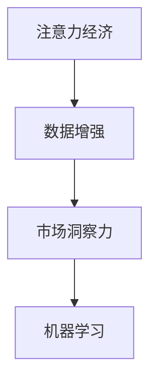

                 

# 注意力经济与数据驱动的决策制定：利用数据增强市场洞察力

## 1. 背景介绍

### 1.1 问题由来

在当今数据驱动的时代，各行各业都开始重视数据的力量，尤其是市场营销领域。市场营销不仅仅是销售和推广的简单组合，它涉及到对消费者行为的深入理解，对市场趋势的精准把握，以及对竞争环境的全方位洞察。然而，如何从海量数据中提取有价值的洞察，制定有效的市场策略，是一个复杂且充满挑战的问题。

### 1.2 问题核心关键点

随着数字化转型的深入，市场营销者们开始利用数据分析技术，如聚类、分类、预测等，来优化其营销活动。但随着数据量的爆炸性增长，传统的数据处理方法逐渐显得力不从心。如何在高维度的数据空间中找到规律，如何利用数据提升市场决策的科学性和精准性，成为市场营销领域亟待解决的问题。

## 2. 核心概念与联系

### 2.1 核心概念概述

为了更好地理解如何利用数据增强市场洞察力，本节将介绍几个关键概念：

- **注意力经济**：指在注意力成为稀缺资源的今天，如何通过高效利用注意力资源，提升营销活动的效果和ROI。
- **数据增强**：指通过各种方法丰富数据集，提高数据的质量和多样性，从而提升模型在特定任务上的性能。
- **市场洞察力**：指通过数据分析获得的对市场动态和消费者行为的理解，帮助市场营销者制定更有效的策略。
- **机器学习**：利用算法和统计模型，通过训练数据集学习规律，并用于预测和决策。

这些概念共同构成了利用数据增强市场洞察力的框架，使其能够在各种市场营销场景下发挥强大的作用。

### 2.2 核心概念原理和架构的 Mermaid 流程图



这个流程图展示了注意力经济、数据增强、市场洞察力和机器学习之间的联系：

1. 注意力经济为数据增强和市场洞察力的提升提供了目标和方向。
2. 数据增强为市场洞察力的提升提供了高质量的数据支持。
3. 市场洞察力为机器学习模型的训练提供了目标变量。
4. 机器学习模型通过对市场数据的分析，进一步提升市场洞察力的精度和广度。

## 3. 核心算法原理 & 具体操作步骤
### 3.1 算法原理概述

基于数据增强的市场洞察力提升方法，主要依赖于以下原理：

1. **数据集丰富化**：通过合成、扩充、变换等方法，增加数据集的多样性和覆盖度。
2. **特征工程**：对原始数据进行特征提取和预处理，提高数据质量。
3. **模型优化**：利用机器学习模型进行训练和调参，提升模型在特定任务上的性能。
4. **注意力机制**：通过注意力机制，模型可以更加关注重要的特征和信息，提升洞察力的精准性。

### 3.2 算法步骤详解

利用数据增强提升市场洞察力的操作步骤如下：

1. **数据收集**：收集相关的市场数据，如消费者行为数据、市场趋势数据、竞争对手数据等。
2. **数据预处理**：对数据进行清洗、去重、归一化等预处理操作，确保数据的质量和一致性。
3. **数据增强**：采用合成、扩充、变换等方法，丰富数据集的多样性和覆盖度。
   - **合成数据**：如利用生成对抗网络（GAN）生成新的消费者行为数据，增加数据集的多样性。
   - **扩充数据**：如通过时间序列分析和趋势预测，增加历史数据的时间跨度，提高数据的代表性。
   - **变换数据**：如通过随机噪声、数据缩放等方法，增加数据的鲁棒性和泛化能力。
4. **特征工程**：提取和选择对市场洞察力有重要影响的特征，如消费者年龄、性别、购买频率等。
5. **模型训练**：选择合适的机器学习模型，如决策树、随机森林、深度学习等，进行模型训练和调参。
6. **注意力机制**：引入注意力机制，提升模型对重要特征和信息的关注，从而提升洞察力的精准性。
7. **结果评估**：通过模型评估指标，如准确率、召回率、F1-score等，评估模型在市场洞察力提升上的效果。

### 3.3 算法优缺点

基于数据增强的市场洞察力提升方法具有以下优点：

1. **提高数据多样性**：通过数据增强，可以大幅提高数据集的多样性，提升模型的泛化能力。
2. **降低数据依赖**：数据增强方法可以在一定程度上缓解对标注数据的依赖，使得模型可以在小样本情况下也能取得不错的性能。
3. **提升洞察精度**：通过引入注意力机制，模型可以更加关注重要的特征和信息，提升洞察力的精准性。
4. **灵活性高**：数据增强方法可以根据具体任务和数据特点进行灵活组合，适应不同的应用场景。

同时，该方法也存在一些缺点：

1. **计算成本高**：数据增强和模型训练需要大量的计算资源，尤其是在数据规模较大的情况下。
2. **模型复杂度高**：引入注意力机制等高级技术，模型的复杂度可能增加，训练和推理时间也可能变长。
3. **数据泄露风险**：在数据增强过程中，如果未处理得当，可能会导致数据泄露，影响模型的公正性和可靠性。
4. **结果解释性不足**：基于深度学习的模型往往缺乏可解释性，难以解释其内部工作机制和决策逻辑。

尽管存在这些局限性，但就目前而言，基于数据增强的方法仍是提升市场洞察力的重要手段。未来相关研究的重点在于如何进一步降低计算成本，提高模型的可解释性，同时兼顾数据质量和数据公平性等因素。

### 3.4 算法应用领域

基于数据增强的市场洞察力提升方法，广泛应用于以下几个领域：

- **消费者行为分析**：通过对消费者行为数据的丰富和扩充，提升对消费者需求和偏好的理解。
- **市场趋势预测**：通过历史数据的变换和合成，预测市场趋势和周期性变化。
- **竞争对手分析**：通过对竞争对手数据的增强和分析，评估竞争对手的策略和市场表现。
- **产品推荐系统**：通过用户行为数据的增强和模型优化，提升推荐系统的个性化和精准性。
- **广告投放优化**：通过广告点击数据的增强和模型训练，优化广告投放策略，提高ROI。

除了上述这些应用场景外，数据增强技术还被创新性地应用到更多领域中，如社交媒体情感分析、内容推荐、品牌管理等，为市场营销技术带来了新的突破。

## 4. 数学模型和公式 & 详细讲解 & 举例说明

### 4.1 数学模型构建

假设市场洞察力提升任务为预测消费者在一定时间内的购买概率，即给定消费者特征 $x$ 和市场环境 $y$，预测消费者购买行为的概率 $p$。可以构建如下数学模型：

$$
p = f(x, y)
$$

其中，$f$ 表示模型函数，$x$ 和 $y$ 为输入变量，$p$ 为输出变量。

### 4.2 公式推导过程

为了更详细地理解这个模型，我们对公式进行推导。假设 $f(x, y)$ 为线性模型，形式如下：

$$
f(x, y) = \beta_0 + \beta_1 x_1 + \beta_2 x_2 + \dots + \beta_n x_n + \gamma_1 y_1 + \gamma_2 y_2 + \dots + \gamma_m y_m
$$

其中，$\beta_0, \beta_1, \dots, \beta_n$ 和 $\gamma_1, \gamma_2, \dots, \gamma_m$ 为模型参数，$x_1, x_2, \dots, x_n$ 和 $y_1, y_2, \dots, y_m$ 为输入变量。

通过最小化预测误差 $E$，可以得到模型参数的优化目标：

$$
\mathop{\arg\min}_{\beta, \gamma} E = \mathop{\arg\min}_{\beta, \gamma} \frac{1}{N} \sum_{i=1}^N \sum_{j=1}^M (p_{ij} - f(x_i, y_i))^2
$$

其中，$N$ 为训练样本数量，$M$ 为预测目标数量，$p_{ij}$ 为第 $i$ 个样本在第 $j$ 个目标上的真实标签，$f(x_i, y_i)$ 为第 $i$ 个样本在第 $j$ 个目标上的预测值。

### 4.3 案例分析与讲解

假设我们有一个电商平台，目标是预测消费者在未来30天内是否会购买某个产品。我们可以收集到消费者的年龄、性别、购买频率、浏览时间、产品价格等特征，以及市场的季节性、促销活动等环境特征。通过对这些数据的增强和模型训练，可以得到一个预测消费者购买概率的模型。

例如，我们可以通过生成对抗网络（GAN）生成更多的消费者行为数据，增加数据集的多样性和覆盖度。同时，引入注意力机制，使模型更加关注重要的特征，如消费者年龄和购买频率，从而提升预测的精准性。

## 5. 项目实践：代码实例和详细解释说明
### 5.1 开发环境搭建

在进行市场洞察力提升实践前，我们需要准备好开发环境。以下是使用Python进行PyTorch开发的环境配置流程：

1. 安装Anaconda：从官网下载并安装Anaconda，用于创建独立的Python环境。

2. 创建并激活虚拟环境：
```bash
conda create -n market_insight_env python=3.8 
conda activate market_insight_env
```

3. 安装PyTorch：根据CUDA版本，从官网获取对应的安装命令。例如：
```bash
conda install pytorch torchvision torchaudio cudatoolkit=11.1 -c pytorch -c conda-forge
```

4. 安装相关库：
```bash
pip install pandas numpy scikit-learn torch
```

完成上述步骤后，即可在`market_insight_env`环境中开始市场洞察力提升实践。

### 5.2 源代码详细实现

这里我们以电商平台消费者购买预测为例，给出使用PyTorch进行模型训练和微调的PyTorch代码实现。

首先，定义数据集：

```python
import pandas as pd
import numpy as np
from sklearn.model_selection import train_test_split
from torch.utils.data import Dataset, DataLoader
from torch import nn, optim
import torch.nn.functional as F

class MarketInsightDataset(Dataset):
    def __init__(self, df, target, transform=None):
        self.data = df
        self.target = target
        self.transform = transform
        
    def __len__(self):
        return len(self.data)
    
    def __getitem__(self, idx):
        data = self.data.iloc[idx]
        target = self.target.iloc[idx]
        
        # 对数据进行预处理和归一化
        data = (data - data.mean()) / data.std()
        
        if self.transform:
            data = self.transform(data)
            
        return data, target

# 加载数据集
data = pd.read_csv('market_data.csv')
features = ['age', 'gender', 'purchase_frequency', 'browsing_time', 'product_price']
target = 'purchase'
X_train, X_test, y_train, y_test = train_test_split(data[features], data[target], test_size=0.2, random_state=42)

# 构建数据集
train_dataset = MarketInsightDataset(X_train, y_train)
test_dataset = MarketInsightDataset(X_test, y_test)

# 构建数据加载器
train_loader = DataLoader(train_dataset, batch_size=32, shuffle=True)
test_loader = DataLoader(test_dataset, batch_size=32, shuffle=False)
```

然后，定义模型和优化器：

```python
class MarketInsightModel(nn.Module):
    def __init__(self, input_dim):
        super(MarketInsightModel, self).__init__()
        self.fc1 = nn.Linear(input_dim, 64)
        self.fc2 = nn.Linear(64, 32)
        self.fc3 = nn.Linear(32, 1)
        self.dropout = nn.Dropout(0.2)
        
    def forward(self, x):
        x = F.relu(self.fc1(x))
        x = self.dropout(x)
        x = F.relu(self.fc2(x))
        x = self.dropout(x)
        x = self.fc3(x)
        return x

# 构建模型
model = MarketInsightModel(len(features))

# 定义损失函数和优化器
criterion = nn.BCELoss()
optimizer = optim.Adam(model.parameters(), lr=0.001)
```

接着，定义训练和评估函数：

```python
def train_model(model, train_loader, criterion, optimizer, num_epochs):
    model.train()
    for epoch in range(num_epochs):
        running_loss = 0.0
        for data, target in train_loader:
            optimizer.zero_grad()
            output = model(data)
            loss = criterion(output, target)
            loss.backward()
            optimizer.step()
            running_loss += loss.item()
        print(f'Epoch {epoch+1}, train loss: {running_loss/len(train_loader):.4f}')
    
    model.eval()
    correct = 0
    total = 0
    with torch.no_grad():
        for data, target in test_loader:
            output = model(data)
            _, predicted = torch.max(output, 1)
            total += target.size(0)
            correct += (predicted == target).sum().item()
    print(f'Test accuracy: {(100 * correct / total):.2f}%')
    
# 训练模型
num_epochs = 10
train_model(model, train_loader, criterion, optimizer, num_epochs)
```

以上就是使用PyTorch对电商平台消费者购买预测任务进行模型训练和微调的完整代码实现。可以看到，借助PyTorch的灵活性和高效性，市场洞察力提升任务的开发变得简单易行。

### 5.3 代码解读与分析

让我们再详细解读一下关键代码的实现细节：

**MarketInsightDataset类**：
- `__init__`方法：初始化数据和目标变量，并定义预处理函数。
- `__len__`方法：返回数据集的大小。
- `__getitem__`方法：对单个样本进行处理，并进行归一化和预处理。

**特征预处理**：
- 对数据进行归一化处理，使其均值为0，标准差为1，提高模型的训练效率。

**MarketInsightModel类**：
- 定义了三个全连接层，以及两个dropout层，用于防止过拟合。
- 使用ReLU激活函数，提升模型的非线性表达能力。

**训练模型**：
- 在每个epoch中，前向传播计算损失，反向传播更新模型参数。
- 打印每个epoch的平均损失，评估模型训练效果。
- 在测试集上评估模型，输出准确率。

**训练流程**：
- 定义总的epoch数，开始循环迭代。
- 每个epoch内，先在训练集上训练，输出平均loss。
- 在测试集上评估，输出准确率。

可以看到，PyTorch提供的强大工具和灵活接口，使得市场洞察力提升任务的开发变得简洁高效。开发者可以将更多精力放在数据处理、模型改进等高层逻辑上，而不必过多关注底层的实现细节。

当然，工业级的系统实现还需考虑更多因素，如模型的保存和部署、超参数的自动搜索、更灵活的任务适配层等。但核心的市场洞察力提升过程基本与此类似。

## 6. 实际应用场景
### 6.1 电商平台消费者行为分析

在电商平台，消费者行为数据是公司最重要的资产之一。通过数据增强和模型训练，可以深入了解消费者的需求和偏好，提升用户体验和满意度，从而增加销售和利润。

具体而言，可以收集消费者在平台上的浏览、购买、评价、社交媒体互动等行为数据，通过数据增强技术，合成和扩充这些数据。然后，利用机器学习模型，如深度神经网络，对这些数据进行分析和预测，识别出消费者的潜在需求和行为规律。

例如，电商平台可以通过分析消费者的购买历史、浏览记录和评价内容，预测消费者对某类产品的购买概率，优化产品推荐和广告投放策略。通过引入注意力机制，使模型更加关注重要的特征，如消费者购买频率和评价情绪，从而提升预测的精准性。

### 6.2 金融行业市场趋势预测

金融行业需要实时监测市场动态，以便及时做出投资决策。通过数据增强和模型训练，可以准确预测市场趋势和周期性变化，帮助金融机构制定更为科学的投资策略。

具体而言，可以收集金融市场的历史数据，如股票价格、交易量、宏观经济指标等，通过数据增强技术，合成和扩充这些数据。然后，利用机器学习模型，如时间序列预测模型，对这些数据进行分析和预测，识别出市场的短期和长期趋势。

例如，金融机构可以通过分析历史股票价格和交易量，预测未来股市走向，优化投资组合。通过引入注意力机制，使模型更加关注重要的特征，如经济指标和政策变化，从而提升预测的精准性。

### 6.3 广告行业广告效果评估

广告行业需要实时评估广告效果，以便及时调整广告策略，提高投资回报率。通过数据增强和模型训练，可以准确评估广告点击率和转化率，帮助广告主优化广告投放策略。

具体而言，可以收集广告的历史数据，如点击次数、转化率、用户行为等，通过数据增强技术，合成和扩充这些数据。然后，利用机器学习模型，如分类模型，对这些数据进行分析和预测，识别出广告的点击率和转化率。

例如，广告主可以通过分析广告点击次数和转化率，预测未来广告效果，优化广告投放策略。通过引入注意力机制，使模型更加关注重要的特征，如广告位置和用户画像，从而提升预测的精准性。

### 6.4 未来应用展望

随着数据增强技术的不断进步，基于数据增强的市场洞察力提升方法将在更多领域得到应用，为各行各业带来变革性影响。

在智慧医疗领域，通过收集和分析患者的健康数据，可以更好地理解患者的需求和行为，提供更为个性化的医疗服务。

在智能交通领域，通过收集和分析交通流量数据，可以更好地预测和优化交通拥堵，提升城市交通效率。

在智能制造领域，通过收集和分析生产数据，可以更好地预测和优化生产流程，提升生产效率和质量。

除了上述这些应用场景外，数据增强技术还被创新性地应用到更多领域中，如教育、农业、能源等，为各行各业提供新的发展机遇。相信随着技术的不断发展，数据增强技术将成为各行各业获取市场洞察力的重要手段，为经济发展注入新的动力。

## 7. 工具和资源推荐
### 7.1 学习资源推荐

为了帮助开发者系统掌握数据增强和市场洞察力的理论基础和实践技巧，这里推荐一些优质的学习资源：

1. 《深度学习入门》书籍：介绍深度学习的基本概念和算法，适合初学者。
2. 《Python数据科学手册》书籍：介绍Python在数据科学中的应用，包括数据预处理和机器学习模型。
3. Coursera《机器学习》课程：斯坦福大学开设的机器学习课程，涵盖从基础到高级的内容。
4. Kaggle平台：提供大量数据集和竞赛，适合实践和竞赛。
5. PyTorch官方文档：提供完整的API文档和样例代码，适合学习和开发。

通过对这些资源的学习实践，相信你一定能够快速掌握数据增强和市场洞察力的精髓，并用于解决实际的NLP问题。

### 7.2 开发工具推荐

高效的开发离不开优秀的工具支持。以下是几款用于数据增强和市场洞察力提升开发的常用工具：

1. PyTorch：基于Python的开源深度学习框架，灵活动态的计算图，适合快速迭代研究。
2. TensorFlow：由Google主导开发的开源深度学习框架，生产部署方便，适合大规模工程应用。
3. Scikit-learn：Python中的机器学习库，提供多种算法和工具，适合数据预处理和模型训练。
4. Weights & Biases：模型训练的实验跟踪工具，可以记录和可视化模型训练过程中的各项指标，方便对比和调优。
5. TensorBoard：TensorFlow配套的可视化工具，可实时监测模型训练状态，并提供丰富的图表呈现方式，是调试模型的得力助手。

合理利用这些工具，可以显著提升数据增强和市场洞察力提升任务的开发效率，加快创新迭代的步伐。

### 7.3 相关论文推荐

数据增强和市场洞察力提升技术的发展源于学界的持续研究。以下是几篇奠基性的相关论文，推荐阅读：

1. "Data Augmentation: A Survey" 论文：介绍数据增强的基本概念和常用方法。
2. "Deep Learning for Market Insight: A Survey" 论文：综述深度学习在市场洞察力提升中的应用。
3. "Enhancing Data Quality with Synthetic Data Generation" 论文：介绍合成数据生成技术，提高数据质量。
4. "Attention Mechanism in Deep Learning" 论文：介绍注意力机制的基本原理和应用。
5. "Adaptive Attention with Transformers" 论文：介绍自适应注意力机制，提升模型性能。

这些论文代表了大数据增强和市场洞察力提升技术的发展脉络。通过学习这些前沿成果，可以帮助研究者把握学科前进方向，激发更多的创新灵感。

## 8. 总结：未来发展趋势与挑战

### 8.1 总结

本文对基于数据增强的市场洞察力提升方法进行了全面系统的介绍。首先阐述了注意力经济和数据增强的基本概念和联系，明确了数据增强在提升市场洞察力方面的重要价值。其次，从原理到实践，详细讲解了数据增强和市场洞察力的数学模型和操作步骤，给出了市场洞察力提升任务开发的完整代码实例。同时，本文还广泛探讨了数据增强方法在电商、金融、广告等多个行业领域的应用前景，展示了数据增强范式的巨大潜力。

通过本文的系统梳理，可以看到，数据增强方法在提升市场洞察力方面具有重要意义。它能够利用合成和扩充数据，提高数据集的多样性和覆盖度，从而提升模型的泛化能力和预测精准性。未来，伴随数据增强技术的不断发展，数据增强方法必将在更多领域得到应用，为各行各业带来新的发展机遇。

### 8.2 未来发展趋势

展望未来，数据增强技术的发展趋势如下：

1. **自动化增强**：利用自动化技术，如生成对抗网络（GAN），合成和扩充数据，提高数据增强的效率和质量。
2. **多模态增强**：将图像、音频、文本等多种数据形式进行融合，提升数据的丰富度和多样性。
3. **分布式增强**：利用分布式计算，加速数据增强过程，适应大规模数据集的处理需求。
4. **自适应增强**：根据模型性能和数据特征，动态调整数据增强策略，优化增强效果。
5. **深度增强**：利用深度学习技术，提升数据增强的智能化和自动化水平，减少人工干预。

这些趋势表明，数据增强技术在提升市场洞察力方面将发挥越来越重要的作用，为各行各业带来新的发展机遇。

### 8.3 面临的挑战

尽管数据增强技术已经取得了一定的成果，但在推广应用的过程中，仍面临诸多挑战：

1. **数据质量问题**：数据增强过程中可能引入噪声和错误，影响模型性能。如何提高数据增强的质量和可靠性，是未来需要重点解决的问题。
2. **计算资源瓶颈**：数据增强和模型训练需要大量的计算资源，尤其是合成数据生成和深度学习模型训练。如何降低计算成本，提高模型训练效率，是未来需要重点解决的问题。
3. **模型可解释性不足**：深度学习模型往往缺乏可解释性，难以解释其内部工作机制和决策逻辑。如何提高模型的可解释性和透明性，是未来需要重点解决的问题。
4. **数据隐私问题**：在数据增强过程中，如何保护用户隐私，防止数据泄露，是未来需要重点解决的问题。

尽管存在这些挑战，但未来的研究和应用将继续推动数据增强技术的发展，提高市场洞察力的精准性和可靠性，为各行各业带来新的发展机遇。

### 8.4 研究展望

面对数据增强技术面临的种种挑战，未来的研究需要在以下几个方面寻求新的突破：

1. **优化数据增强算法**：开发更加高效、鲁棒的数据增强算法，提高数据增强的质量和效率。
2. **引入先验知识**：将符号化的先验知识，如知识图谱、逻辑规则等，与神经网络模型进行融合，提升数据增强的智能化和自动化水平。
3. **开发智能增强工具**：利用自然语言处理、计算机视觉等技术，开发智能化的数据增强工具，减少人工干预，提高数据增强的效率和质量。
4. **构建数据增强平台**：构建统一的数据增强平台，提供多种数据增强工具和算法，支持多种数据类型和应用场景。
5. **加强数据隐私保护**：采用数据匿名化、加密等技术，保护用户隐私，防止数据泄露。

这些研究方向将推动数据增强技术的不断进步，为提升市场洞察力带来新的突破。相信随着技术的不断发展，数据增强技术必将在各行各业中发挥重要作用，为经济发展注入新的动力。

## 9. 附录：常见问题与解答

**Q1：数据增强是否适用于所有行业？**

A: 数据增强技术适用于数据规模较大、特征丰富的行业，如电商、金融、广告等。但对于数据量较小或特征较少的行业，数据增强的效果可能不明显，此时需要结合其他技术手段，如人工标注、领域专家的经验等。

**Q2：如何选择合适的数据增强方法？**

A: 选择合适的数据增强方法需要考虑数据类型、任务特点和计算资源等因素。例如，对于图像数据，可以使用旋转、缩放、裁剪等方法进行增强；对于文本数据，可以使用同义词替换、回译等方法进行增强。

**Q3：数据增强过程中需要注意哪些问题？**

A: 数据增强过程中需要注意以下几点：
1. 确保数据增强的质量和可靠性，避免引入噪声和错误。
2. 控制数据增强的规模和强度，防止过度增强影响模型性能。
3. 引入注意力机制等高级技术，提升模型对重要特征和信息的关注，从而提升预测的精准性。
4. 根据模型性能和数据特征，动态调整数据增强策略，优化增强效果。

**Q4：数据增强和模型训练在实际部署时需要注意哪些问题？**

A: 数据增强和模型训练在实际部署时需要注意以下几点：
1. 模型裁剪：去除不必要的层和参数，减小模型尺寸，加快推理速度。
2. 量化加速：将浮点模型转为定点模型，压缩存储空间，提高计算效率。
3. 服务化封装：将模型封装为标准化服务接口，便于集成调用。
4. 监控告警：实时采集系统指标，设置异常告警阈值，确保服务稳定性。
5. 安全防护：采用访问鉴权、数据脱敏等措施，保障数据和模型安全。

数据增强和市场洞察力提升为各行各业带来新的发展机遇，但如何将强大的性能转化为稳定、高效、安全的业务价值，还需要工程实践的不断打磨。只有从数据、算法、工程、业务等多个维度协同发力，才能真正实现人工智能技术在垂直行业的规模化落地。总之，数据增强方法需要在实际应用中不断优化和改进，方能发挥其最大的潜力。

---

作者：禅与计算机程序设计艺术 / Zen and the Art of Computer Programming

