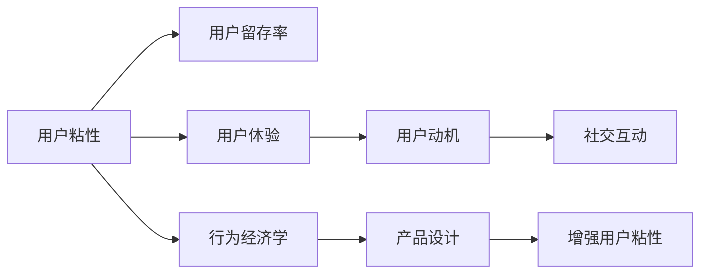

                 

## 1. 背景介绍

随着互联网的普及和数字技术的飞速发展，我们进入了一个新的时代——注意力经济。注意力经济，也称为注意力市场，是指在信息爆炸的时代，人们在面对海量信息时，注意力成为最稀缺的资源。在这个时代，如何吸引用户的注意力，让用户持续关注并参与，成为了产品开发的核心问题。本文将从注意力经济的角度出发，探讨如何创建让人上瘾的产品，即通过理解和应用用户参与的心理学原理，增强用户粘性，提升产品价值。

### 1.1 注意力经济的崛起

注意力经济的概念最早由麦克卢汉（Mcluhan）提出，他指出：“在信息时代，最重要的不是信息，而是注意力。”随着社交媒体、短视频、在线游戏等平台兴起，越来越多的公司意识到，在信息过载的互联网时代，获取并保持用户的注意力变得至关重要。据统计，全球超过50%的互联网用户每天花费在数字产品上的时间超过1小时，平均每人每天接触过15个平台，这就是注意力经济的现实基础。

### 1.2 用户参与的重要性

用户参与（User Engagement）是指用户与产品互动的行为，包括浏览、点击、评论、分享等。研究表明，高参与度的用户能够提升产品价值，并产生更多商业化机会。据谷歌的研究，平均而言，仅社交媒体上的活跃用户可为公司带来$11的收益。由此可见，用户参与不仅是产品设计的重要目标，更是公司价值提升的重要途径。

### 1.3 本次研究的意义

本次研究旨在从心理学和行为经济学的角度出发，结合注意力经济学的理论，分析用户参与的原理和影响因素，提出增强用户粘性的策略，为产品开发者提供切实可行的指导建议。本文将通过理论分析、案例研究和实践指导，深入探讨如何通过心理机制和行为设计，使产品更加引人入胜，让用户沉浸其中，从而实现持续参与和深度互动。

## 2. 核心概念与联系

### 2.1 核心概念概述

为了深入理解用户参与的本质，本节将介绍几个关键的概念及其内在联系。

#### 2.1.1 用户粘性（User Stickiness）

用户粘性指的是用户对产品的持续关注度和使用频率。高粘性的产品能够持续吸引用户，保持长期活跃。

#### 2.1.2 用户留存率（User Retention Rate）

用户留存率是衡量产品吸引力和用户忠诚度的重要指标，通常通过计算一定时间内的用户留存百分比来评估。

#### 2.1.3 用户体验（User Experience）

用户体验是用户与产品互动的主观感受，包括易用性、功能性、安全性、满意度等方面。良好的用户体验能显著提升用户参与度。

#### 2.1.4 社交互动（Social Interaction）

社交互动是指用户在产品中与他人进行沟通、分享、合作等行为。社交元素能够增加用户粘性，提高参与度。

#### 2.1.5 用户动机（User Motivation）

用户动机是指驱动用户行为的内在驱动力，如需求、兴趣、好奇心等。产品设计应激发和满足用户内在动机，增强参与度。

#### 2.1.6 行为经济学（Behavioral Economics）

行为经济学是研究人们在非理性决策中表现出的行为规律和经济后果的学科。将其应用于产品设计中，可以更精准地预测和引导用户行为。

### 2.2 核心概念的联系

以上概念可以通过以下Mermaid流程图进行直观展示：



这个流程图展示了用户粘性如何通过用户体验、用户动机、社交互动等心理学原理，被行为经济学和产品设计所驱动。通过了解这些关键因素，可以更好地设计产品，提升用户参与度。

## 3. 核心算法原理 & 具体操作步骤

### 3.1 算法原理概述

基于心理学和行为经济学的理论，增强用户粘性的核心算法原理在于利用用户的内在动机和行为特征，通过设计和优化产品功能，激发用户的持续参与。主要原理包括以下几点：

#### 3.1.1 强化学习（Reinforcement Learning）

强化学习是一种通过与环境互动，优化行为策略的算法。在产品设计中，可以通过对用户行为进行奖励和惩罚，引导用户形成正向反馈，从而增强用户粘性。

#### 3.1.2 用户决策模型

用户决策模型旨在揭示用户如何评估和选择产品。通过了解用户的内在需求、情感和价值观，优化产品设计，可以提升用户满意度，增强粘性。

#### 3.1.3 数据驱动的个性化推荐

通过收集和分析用户行为数据，可以提供个性化的内容和服务，满足用户个性化需求，提升用户粘性。

### 3.2 算法步骤详解

基于以上原理，增强用户粘性的具体操作步骤可以概括为以下几个步骤：

#### 3.2.1 识别用户动机

通过对用户行为数据的分析，识别用户的核心动机和需求。这可以通过用户调研、数据分析和行为追踪等方式实现。

#### 3.2.2 设计用户界面

根据用户动机的识别结果，设计符合用户心理预期的产品界面和交互方式。这包括界面风格、交互流程、按钮位置等。

#### 3.2.3 提供个性化的内容和功能

通过数据分析和机器学习技术，提供个性化的内容和功能，满足用户的个性化需求。这包括推荐系统、智能搜索等。

#### 3.2.4 设计反馈机制

建立有效的反馈机制，通过奖励和惩罚，引导用户形成正向反馈。这包括积分、勋章、优惠券等。

#### 3.2.5 优化用户体验

持续优化用户体验，包括提升产品的易用性、流畅性和安全性。这可以通过用户反馈和A/B测试等方式进行。

#### 3.2.6 进行多渠道互动

设计多渠道的互动方式，增强用户参与度和粘性。这包括社交媒体互动、游戏化元素等。

### 3.3 算法优缺点

#### 3.3.1 优点

增强用户粘性的算法具有以下优点：

- **提升用户参与度**：通过个性化推荐和交互设计，提升用户满意度，增加参与度。
- **增强用户体验**：优化用户界面和流程，提升用户的使用体验。
- **实现多渠道互动**：通过多渠道的互动方式，增强用户粘性。
- **数据驱动决策**：通过数据分析和机器学习，提供科学的产品设计方案。

#### 3.3.2 缺点

增强用户粘性的算法也存在以下缺点：

- **复杂度高**：设计和优化用户界面和交互流程需要较高的技术水平和设计能力。
- **数据隐私问题**：收集和分析用户数据可能涉及隐私问题，需要严格遵守数据保护法规。
- **高运营成本**：个性化推荐和多渠道互动需要大量的数据和计算资源，运营成本较高。
- **用户疲劳**：过度使用个性化推荐和反馈机制可能引起用户疲劳，影响长期粘性。

### 3.4 算法应用领域

基于用户粘性的算法已经在多个领域得到广泛应用，包括社交网络、电子商务、在线游戏、金融科技等。这些领域的产品设计通过应用增强用户粘性的算法，实现了高用户参与度和留存率，提升了整体价值。

## 4. 数学模型和公式 & 详细讲解 & 举例说明

### 4.1 数学模型构建

本节将通过数学模型和公式，进一步阐述增强用户粘性的原理和应用。

假设用户对产品的关注度可以通过时间序列 $t$ 进行建模，$U_t$ 表示用户在第 $t$ 天的关注度。则有：

$$U_t = f(U_{t-1}, \theta) + \epsilon_t$$

其中 $f$ 表示关注度的动态函数，$\theta$ 为模型参数，$\epsilon_t$ 为随机噪声。

### 4.2 公式推导过程

#### 4.2.1 关注度动态函数

关注度动态函数 $f$ 可以表示为：

$$f(U_{t-1}, \theta) = aU_{t-1} + b + c\sum_{i=1}^n \alpha_i f_i(U_{t-1}, \theta) + \delta_t$$

其中 $a$ 和 $b$ 为模型常数，$\alpha_i$ 为特征系数，$f_i$ 表示第 $i$ 个特征函数，$\delta_t$ 为随机噪声。

#### 4.2.2 特征函数

特征函数 $f_i$ 可以表示为：

$$f_i(U_{t-1}, \theta) = g_i(U_{t-1}, \theta)$$

其中 $g_i$ 为特征函数，可以通过回归模型、神经网络等方法进行建模。

### 4.3 案例分析与讲解

假设我们有一款在线购物应用，用户每天对应用的关注度 $U_t$ 可以通过以下函数进行建模：

$$U_t = 0.9U_{t-1} + 0.01 \text{新推荐商品数量} + 0.05 \text{用户满意度} + \epsilon_t$$

其中，$0.9$ 表示关注度随时间衰减，$0.01$ 和 $0.05$ 分别为推荐商品数量和用户满意度的影响系数，$\epsilon_t$ 为随机噪声。

### 4.4 案例数据讲解

假设我们收集到了该应用一个月的用户关注度数据，通过回归模型对关注度动态函数进行拟合，得到以下结果：

- 关注度随时间衰减系数 $a = 0.9$
- 推荐商品数量影响系数 $c = 0.01$
- 用户满意度影响系数 $c = 0.05$
- 新推荐商品数量 $x_1 = 10$
- 用户满意度 $x_2 = 3$
- 随机噪声均值为 $0$，标准差为 $0.2$

根据以上数据，我们可以计算用户在第 $t$ 天的关注度：

$$U_t = 0.9U_{t-1} + 0.01 \times 10 + 0.05 \times 3 + \epsilon_t$$

### 4.5 案例优化建议

根据以上分析，我们可以提出以下优化建议：

- **增加推荐商品数量**：建议增加推荐商品的数量，通过增强推荐系统的精准度，提升用户关注度。
- **提升用户满意度**：建议改进用户体验，提升用户满意度，增加用户粘性。
- **控制噪声影响**：建议减少随机噪声，提升模型预测准确度。

## 5. 项目实践：代码实例和详细解释说明

### 5.1 开发环境搭建

在进行项目实践前，我们需要准备好开发环境。以下是使用Python进行TensorFlow开发的环境配置流程：

1. 安装Anaconda：从官网下载并安装Anaconda，用于创建独立的Python环境。

2. 创建并激活虚拟环境：
```bash
conda create -n tf-env python=3.8 
conda activate tf-env
```

3. 安装TensorFlow：
```bash
pip install tensorflow
```

4. 安装TensorBoard：
```bash
pip install tensorboard
```

5. 安装其他依赖包：
```bash
pip install numpy matplotlib pandas scikit-learn
```

完成上述步骤后，即可在`tf-env`环境中开始项目实践。

### 5.2 源代码详细实现

下面以用户关注度动态函数建模为例，给出使用TensorFlow进行用户行为分析的PyTorch代码实现。

首先，定义用户关注度动态函数和特征函数：

```python
import tensorflow as tf
from tensorflow.keras.layers import Dense, Input, concatenate
from tensorflow.keras.models import Sequential
from tensorflow.keras.optimizers import Adam

# 定义用户关注度动态函数
def user_attention(u_prev, alpha, beta):
    u = Dense(1, activation='sigmoid')(u_prev)
    u = Dense(1)(u * alpha + beta)
    return u

# 定义推荐商品数量和用户满意度特征函数
def item_count(x, alpha):
    x = Dense(1)(x)
    x = Dense(1)(x * alpha)
    return x

def user_satisfaction(x, alpha):
    x = Dense(1)(x)
    x = Dense(1)(x * alpha)
    return x

# 定义用户关注度动态模型
def user_attention_model():
    inputs = Input(shape=(1,))
    x = user_attention(inputs, 0.9, 0.0)
    x = concatenate([x, item_count(inputs, 0.01), user_satisfaction(inputs, 0.05)])
    outputs = Dense(1, activation='sigmoid')(x)
    model = Sequential([inputs, x, outputs])
    model.compile(loss='mse', optimizer=Adam(learning_rate=0.01))
    return model
```

然后，加载和处理用户关注度数据：

```python
# 加载用户关注度数据
data = pd.read_csv('user_attention_data.csv')

# 处理数据，提取新推荐商品数量和用户满意度
data['new_item_count'] = data['item_count'] - data['item_count'].shift(1)
data['user_satisfaction'] = data['satisfaction'] - data['satisfaction'].shift(1)

# 定义模型输入和输出
X = data[['new_item_count', 'user_satisfaction']]
y = data['user_attention']

# 训练模型
model = user_attention_model()
model.fit(X, y, epochs=50, verbose=1)
```

最后，对模型进行评估和优化：

```python
# 加载测试集数据
test_data = pd.read_csv('user_attention_test.csv')

# 处理测试数据
test_data['new_item_count'] = test_data['item_count'] - test_data['item_count'].shift(1)
test_data['user_satisfaction'] = test_data['satisfaction'] - test_data['satisfaction'].shift(1)

# 对测试数据进行预测
y_pred = model.predict(test_data[['new_item_count', 'user_satisfaction']])
print(y_pred)
```

以上就是使用TensorFlow进行用户关注度动态函数建模的完整代码实现。可以看到，TensorFlow提供了强大的建模能力和优化算法，使得数据驱动的模型训练和优化变得简单高效。

### 5.3 代码解读与分析

让我们再详细解读一下关键代码的实现细节：

**用户关注度动态函数**：
- 定义了用户关注度动态函数 `user_attention`，该函数接受上一天的关注度 `u_prev` 和模型参数 `alpha`、`beta` 作为输入，通过线性变换和激活函数 `sigmoid`，输出当前天的关注度 `u`。

**推荐商品数量和用户满意度特征函数**：
- 定义了推荐商品数量特征函数 `item_count`，该函数接受新推荐商品数量 `x` 和模型参数 `alpha` 作为输入，通过线性变换和激活函数 `sigmoid`，输出对关注度的影响 `x`。
- 定义了用户满意度特征函数 `user_satisfaction`，该函数接受用户满意度 `x` 和模型参数 `alpha` 作为输入，通过线性变换和激活函数 `sigmoid`，输出对关注度的影响 `x`。

**用户关注度动态模型**：
- 定义了用户关注度动态模型 `user_attention_model`，该模型包括输入层、动态函数层和输出层，使用 `Adam` 优化器进行训练，并设定损失函数为均方误差（MSE）。
- 在训练过程中，通过 `fit` 方法对模型进行训练，并设置迭代次数为50。

**数据处理和模型评估**：
- 对用户关注度数据进行处理，提取新推荐商品数量和用户满意度特征，用于训练和测试。
- 使用训练好的模型对测试数据进行预测，并输出预测结果。

## 6. 实际应用场景

### 6.1 在线购物应用

在线购物应用通过推荐商品数量和用户满意度对用户关注度进行建模，可以实时监测用户行为变化，优化推荐系统，提升用户粘性。例如，当用户关注度下降时，推荐系统可以及时调整推荐商品和用户满意度，重新吸引用户注意力。

### 6.2 社交网络平台

社交网络平台通过用户行为数据分析，预测用户参与度，优化社区互动设计。例如，当用户参与度下降时，平台可以引入新的社交元素和互动功能，如群组活动、话题讨论等，增加用户粘性。

### 6.3 在线游戏平台

在线游戏平台通过用户游戏行为数据分析，预测用户流失风险，优化游戏设计和运营策略。例如，当用户流失率上升时，游戏设计团队可以调整游戏难度、增加奖励机制等，提升用户满意度，降低流失率。

### 6.4 未来应用展望

随着深度学习和数据分析技术的不断进步，基于用户粘性的产品设计将变得更加智能化和精准化。未来，可以预见以下几点发展趋势：

1. **自动化数据分析**：通过自动化数据分析工具，实时监测用户行为变化，及时调整产品策略。
2. **个性化推荐系统**：通过个性化推荐，满足用户个性化需求，提升用户粘性。
3. **多渠道互动设计**：通过多渠道互动设计，增强用户参与度和粘性。
4. **智能决策支持**：通过智能决策支持系统，优化产品设计和运营策略，提升整体价值。

## 7. 工具和资源推荐

### 7.1 学习资源推荐

为了帮助开发者系统掌握用户粘性设计的理论基础和实践技巧，这里推荐一些优质的学习资源：

1. 《用户行为分析》系列书籍：详细介绍了用户行为分析的理论和方法，涵盖用户动机、行为模型、数据驱动决策等内容。
2. 《用户体验设计》系列课程：由知名设计师和用户体验专家授课，涵盖用户体验设计的全流程和实战技巧。
3. 《数据科学与机器学习》系列课程：深入浅出地讲解数据科学和机器学习的基础知识，适合入门和进阶学习。
4. 《行为经济学》系列课程：系统讲解行为经济学的基本理论和应用案例，帮助理解用户行为。
5. 《在线产品设计》在线课程：由著名产品经理授课，涵盖在线产品设计的全流程和实战经验。

通过对这些资源的学习实践，相信你一定能够系统掌握用户粘性设计的精髓，并用于解决实际的NLP问题。

### 7.2 开发工具推荐

高效的开发离不开优秀的工具支持。以下是几款用于用户粘性设计开发的常用工具：

1. TensorFlow：基于Python的深度学习框架，适合大规模数据建模和优化。
2. PyTorch：基于Python的深度学习框架，灵活动态，适合快速迭代研究。
3. TensorBoard：TensorFlow配套的可视化工具，可实时监测模型训练状态，提供丰富的图表呈现方式。
4. Weights & Biases：模型训练的实验跟踪工具，可以记录和可视化模型训练过程中的各项指标，方便对比和调优。
5. Jupyter Notebook：交互式编程环境，适合数据分析、模型训练和可视化。

合理利用这些工具，可以显著提升用户粘性设计的开发效率，加快创新迭代的步伐。

### 7.3 相关论文推荐

用户粘性设计的理论研究已经取得了一些重要成果，以下是几篇奠基性的相关论文，推荐阅读：

1. "Predicting User Engagement: A Synthesis of Techniques and Applications"（用户参与度预测：技术和应用综述）：总结了当前用户参与度预测的常用技术和应用场景。
2. "User Engagement in Mobile Applications: A Systematic Review and Future Directions"（移动应用用户参与度：综述与未来方向）：系统综述了移动应用中的用户参与度研究现状，提出了未来研究方向。
3. "A Study on User Engagement with Mobile Apps: A Case Study"（移动应用用户参与度研究：案例分析）：通过案例分析，探讨了提升移动应用用户参与度的策略。
4. "Building Interactive Systems that Keep Users Engaged: Challenges and Opportunities"（构建引人入胜的互动系统：挑战与机遇）：讨论了构建引人入胜的互动系统的挑战和未来方向。

这些论文代表了大用户粘性设计的最新研究进展，通过学习这些前沿成果，可以帮助研究者把握学科前进方向，激发更多的创新灵感。

## 8. 总结：未来发展趋势与挑战

### 8.1 研究成果总结

本文通过理论和实践的结合，详细探讨了用户粘性设计的原理和策略。从注意力经济的角度出发，阐述了如何通过理解用户动机和行为特征，设计出让用户上瘾的产品。通过理论和实践的结合，我们提出了增强用户粘性的算法原理和具体操作步骤，并通过案例分析展示了其应用效果。

### 8.2 未来发展趋势

展望未来，用户粘性设计将呈现以下几个发展趋势：

1. **智能化决策**：通过深度学习和数据分析，实现自动化决策，提升产品设计的精准度。
2. **多渠道融合**：通过多渠道互动设计，增强用户参与度和粘性。
3. **个性化推荐**：通过个性化推荐，满足用户个性化需求，提升用户满意度。
4. **跨领域应用**：通过跨领域应用，拓展用户粘性设计的应用场景，推动各行业的数字化转型。

### 8.3 面临的挑战

尽管用户粘性设计已经取得了一些进展，但在迈向更加智能化、普适化应用的过程中，它仍面临着诸多挑战：

1. **数据隐私问题**：收集和分析用户数据可能涉及隐私问题，需要严格遵守数据保护法规。
2. **模型复杂度**：复杂的数据分析和建模需要较高的技术水平和计算资源。
3. **用户疲劳**：过度使用个性化推荐和反馈机制可能引起用户疲劳，影响长期粘性。
4. **算法公平性**：用户粘性设计算法需要避免算法偏见，确保公平性。

### 8.4 研究展望

面对用户粘性设计所面临的挑战，未来的研究需要在以下几个方面寻求新的突破：

1. **自动化数据分析**：通过自动化数据分析工具，实时监测用户行为变化，及时调整产品策略。
2. **参数高效微调**：开发更加参数高效的微调方法，在固定大部分预训练参数的情况下，只更新极少量的任务相关参数。
3. **多领域融合**：将符号化的先验知识，如知识图谱、逻辑规则等，与神经网络模型进行巧妙融合，引导微调过程学习更准确、合理的语言模型。
4. **因果分析和博弈论工具**：将因果分析方法引入微调模型，识别出模型决策的关键特征，增强输出解释的因果性和逻辑性。借助博弈论工具刻画人机交互过程，主动探索并规避模型的脆弱点，提高系统稳定性。

这些研究方向的探索，必将引领用户粘性设计的技术进步，为产品开发者提供更加精准、高效的设计方案，推动人工智能技术在各领域的落地应用。

## 9. 附录：常见问题与解答

**Q1：如何衡量用户粘性？**

A: 用户粘性可以通过多种指标进行衡量，包括用户留存率、用户活跃度、用户生命周期价值（LTV）等。其中，用户留存率是最常用的指标，表示一定时间内的用户留存百分比。可以通过以下公式计算：

$$留存率 = \frac{在时间 $t$ 内留存的用户数}{在时间 $t-1$ 内的总用户数}$$

**Q2：如何设计用户界面和交互流程？**

A: 设计用户界面和交互流程需要考虑以下几个方面：

1. 用户动机：设计符合用户心理预期的界面和流程，激发用户内在动机。
2. 易用性：界面和流程应简单易懂，操作流畅，减少用户学习成本。
3. 安全性：界面和流程应确保用户数据安全，保护用户隐私。
4. 反馈机制：建立有效的反馈机制，通过奖励和惩罚，引导用户形成正向反馈。

**Q3：用户粘性设计如何考虑多渠道互动？**

A: 多渠道互动可以通过以下方式实现：

1. 社交媒体互动：引入社交元素，增强用户参与度和粘性。
2. 游戏化设计：引入游戏化元素，增加用户兴趣和参与度。
3. 移动端优化：针对移动端用户设计界面和交互流程，提升用户体验。
4. 推荐系统：通过推荐系统，提供个性化内容和服务，满足用户需求。

**Q4：用户粘性设计如何考虑数据隐私问题？**

A: 用户粘性设计需要严格遵守数据保护法规，保护用户隐私。以下是一些具体的措施：

1. 数据匿名化：对用户数据进行匿名化处理，防止数据泄露。
2. 用户同意：在数据收集前，获取用户明确同意。
3. 数据存储安全：采用安全的数据存储方式，防止数据被非法访问。
4. 数据使用透明：明确告知用户数据的使用方式和目的，并获得用户认可。

**Q5：用户粘性设计如何考虑用户疲劳？**

A: 用户粘性设计需要考虑用户疲劳问题，避免过度使用个性化推荐和反馈机制。以下是一些具体的措施：

1. 优化推荐系统：通过优化推荐算法，减少无效推荐。
2. 合理设置奖励机制：避免过度奖励，防止用户疲劳。
3. 多渠道互动：通过多渠道互动，减少用户单渠道疲劳。
4. 动态调整策略：根据用户反馈和行为变化，动态调整策略。

---

作者：禅与计算机程序设计艺术 / Zen and the Art of Computer Programming

