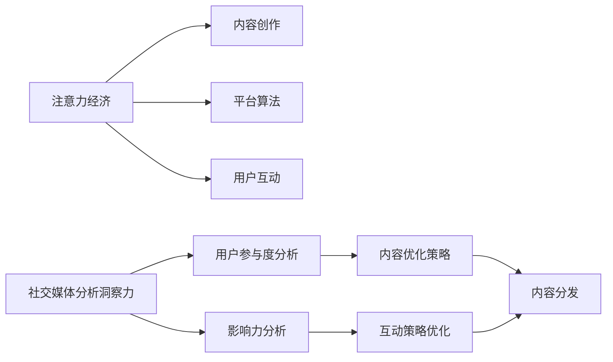

                 

# 注意力经济与社交媒体分析洞察力：了解受众参与度和影响力的秘诀

## 1. 背景介绍

在数字时代，信息过载和注意力稀缺成为了制约人们生活和工作的主要问题。随着社交媒体平台和内容创作者的崛起，如何精准分析受众的参与度和影响力，优化内容分发策略，提升用户互动效果，成为了众多企业关注的焦点。在这一背景下，注意力经济（Attention Economy）这一概念应运而生。

注意力经济，是指在信息过载的时代，如何吸引并有效利用人们的注意力资源，以实现商业价值的最大化。它涉及到内容创作、平台算法、用户互动等多个方面的综合优化，是现代数字经济的重要组成部分。社交媒体分析洞察力，正是帮助企业洞察受众参与度和影响力的关键工具。

本文将深入探讨注意力经济的基本原理，介绍社交媒体分析洞察力在理解受众参与度和影响力方面的应用，并给出详细的案例分析和代码实现。通过理解注意力经济的基本概念，结合社交媒体分析洞察力的工具，企业可以更好地掌握受众行为，提升内容制作和分发策略的科学性。

## 2. 核心概念与联系

### 2.1 核心概念概述

为更好地理解注意力经济与社交媒体分析洞察力，我们首先需要了解以下几个关键概念：

- **注意力经济**：在信息过载的背景下，如何吸引和有效利用人们的注意力资源，以实现商业价值最大化。它涉及内容创作、平台算法、用户互动等多个方面。

- **社交媒体分析洞察力**：利用社交媒体数据，通过数据分析和机器学习技术，洞察受众的参与度和影响力，为内容制作和分发策略提供数据支持。

- **用户参与度（Engagement Rate）**：指用户在社交媒体上与内容的互动程度，如点赞、评论、分享等行为频率。

- **影响力（Influence）**：指用户通过内容创作或互动，对其他用户或群体产生的影响程度。

### 2.2 核心概念原理和架构的 Mermaid 流程图



这个流程图展示了注意力经济与社交媒体分析洞察力之间的联系：

1. **内容创作**：通过创作高质量、有吸引力的内容，吸引用户关注。
2. **平台算法**：通过算法推荐，将合适的内容推荐给目标用户。
3. **用户互动**：用户通过点赞、评论等行为，形成互动。
4. **用户参与度分析**：通过分析用户互动数据，洞察用户的兴趣和偏好。
5. **影响力分析**：通过分析用户的内容和互动数据，了解用户的影响力。
6. **内容优化策略**：基于用户参与度和影响力分析，优化内容创作和分发策略。
7. **互动策略优化**：基于用户参与度和影响力分析，优化互动策略，提升用户满意度。

这些概念共同构成了注意力经济与社交媒体分析洞察力的框架，帮助企业更好地理解和优化用户行为。

## 3. 核心算法原理 & 具体操作步骤

### 3.1 算法原理概述

注意力经济与社交媒体分析洞察力的核心算法主要基于以下两个方面：

1. **用户参与度分析**：通过分析用户在社交媒体上的互动行为，如点赞、评论、分享等，评估用户对内容的参与程度。
2. **影响力分析**：通过分析用户在社交媒体上的内容创作和互动数据，评估用户对其他用户或群体的影响力。

这两个分析过程通常需要结合机器学习技术，如聚类、分类、回归等，构建预测模型，以提高分析的准确性和效率。

### 3.2 算法步骤详解

以下是一个基于社交媒体分析洞察力的完整算法流程：

**Step 1: 数据收集**
- 收集目标用户群体的社交媒体数据，包括用户互动行为、内容发布、评论回复等。
- 数据格式可以是CSV、JSON等，使用Python等工具进行数据处理和清洗。

**Step 2: 数据预处理**
- 对数据进行格式转换、去重、缺失值处理、异常值检测等预处理操作。
- 使用NLP技术，对文本数据进行分词、去除停用词、词性标注等预处理。

**Step 3: 特征提取**
- 从互动行为和内容特征中提取相关指标，如点赞数、评论数、内容长度、关键词频率等。
- 使用TF-IDF、词向量等技术，将文本数据转换为数值特征。

**Step 4: 建立模型**
- 选择适当的机器学习算法，如K-means聚类、支持向量机、随机森林等，建立用户参与度和影响力分析模型。
- 使用交叉验证、网格搜索等方法，优化模型参数，提高模型性能。

**Step 5: 模型评估**
- 在测试集上评估模型的准确率、召回率、F1分数等指标，评估模型性能。
- 使用混淆矩阵、ROC曲线等工具，可视化模型的分类效果。

**Step 6: 结果分析**
- 分析模型结果，识别出用户参与度高、影响力大的关键指标和特征。
- 结合业务需求，优化内容制作和分发策略，提升用户互动效果。

### 3.3 算法优缺点

社交媒体分析洞察力在理解受众参与度和影响力方面具有以下优点：

1. **高效性**：利用机器学习算法，可以快速处理大量社交媒体数据，提高分析效率。
2. **准确性**：通过模型预测，可以较为准确地评估用户参与度和影响力，减少人工误判。
3. **可扩展性**：算法可以灵活应用于不同平台和领域，具有较高的泛化能力。

同时，也存在一些局限性：

1. **数据隐私**：社交媒体数据可能涉及用户隐私，需要遵守相关法律法规，确保数据安全。
2. **数据质量**：社交媒体数据的噪音较多，需要有效的数据清洗和预处理技术。
3. **模型复杂性**：高维数据的建模需要较为复杂的算法，可能导致模型过拟合。
4. **业务依赖**：算法结果的解释和应用需要结合具体业务场景，模型的优化和调整具有一定难度。

### 3.4 算法应用领域

社交媒体分析洞察力在多个领域都有广泛应用，包括但不限于：

1. **内容营销**：通过分析用户参与度和影响力，优化内容策略，提升广告投放效果。
2. **品牌管理**：通过分析用户互动数据，了解品牌形象和声誉，优化品牌传播策略。
3. **用户行为分析**：通过分析用户行为数据，洞察用户需求，提升用户体验和满意度。
4. **市场预测**：通过分析用户互动数据，预测市场趋势和用户偏好，指导产品开发和市场推广。
5. **社交媒体运营**：通过分析用户互动和内容数据，优化社交媒体运营策略，提升平台用户活跃度和留存率。

## 4. 数学模型和公式 & 详细讲解 & 举例说明

### 4.1 数学模型构建

本节将介绍社交媒体分析洞察力中常用的数学模型和公式。

假设我们收集了社交媒体上n个用户的互动数据，每个用户i的点赞数为$x_i$，评论数为$y_i$，分享数为$z_i$，则可以通过以下数学模型进行用户参与度分析：

$$
\text{Engagement Rate} = \frac{1}{n} \sum_{i=1}^{n} f(x_i, y_i, z_i)
$$

其中，$f(x_i, y_i, z_i)$为综合参与度评分函数，可以通过加权平均、统计平均值等方式计算。

对于影响力分析，可以定义影响力评分函数$g(u_i)$，其中$u_i$为用户i的内容创作数据和互动数据。影响力评分函数$g(u_i)$可以根据内容质量、互动数据、用户权重等多种因素综合计算。

### 4.2 公式推导过程

以用户参与度评分函数$f(x_i, y_i, z_i)$为例，推导其计算方法。

$$
f(x_i, y_i, z_i) = \frac{1}{3}(x_i + y_i + z_i)
$$

其中，$x_i, y_i, z_i$分别代表用户i的点赞数、评论数、分享数，权重均为1/3，表示点赞、评论和分享对用户参与度的同等重要性。

通过这个公式，我们可以计算出每个用户的综合参与度评分。对于影响力评分函数$g(u_i)$，其计算方法可以类似推导，根据具体的评分因素进行调整。

### 4.3 案例分析与讲解

假设我们收集了某社交平台上10000个用户的互动数据，每个用户的点赞数、评论数、分享数如表所示：

| UserID | Likes | Comments | Shares |
|--------|------|---------|--------|
| 1      | 100  | 20      | 5      |
| 2      | 150  | 30      | 10     |
| ...    | ...  | ...     | ...    |
| 10000  | 80   | 50      | 15     |

根据公式$f(x_i, y_i, z_i)$，我们可以计算每个用户的综合参与度评分，如表所示：

| UserID | Engagement Rate |
|--------|----------------|
| 1      | 1.25            |
| 2      | 1.45            |
| ...    | ...            |
| 10000  | 1.17            |

通过分析这些评分，我们可以识别出参与度高的用户，进一步了解其行为模式，优化内容策略。

## 5. 项目实践：代码实例和详细解释说明

### 5.1 开发环境搭建

在进行社交媒体分析洞察力开发前，我们需要准备好开发环境。以下是使用Python进行数据分析和机器学习开发的典型环境配置流程：

1. 安装Anaconda：从官网下载并安装Anaconda，用于创建独立的Python环境。

2. 创建并激活虚拟环境：
```bash
conda create -n analytics-env python=3.8 
conda activate analytics-env
```

3. 安装相关依赖：
```bash
conda install pandas numpy scikit-learn seaborn matplotlib
```

4. 安装TensorFlow等机器学习库：
```bash
pip install tensorflow
```

5. 安装PyTorch等深度学习库：
```bash
pip install torch
```

6. 安装Jupyter Notebook：
```bash
pip install jupyterlab
```

完成上述步骤后，即可在`analytics-env`环境中开始社交媒体分析洞察力的开发实践。

### 5.2 源代码详细实现

下面以用户参与度分析为例，给出使用Python进行社交媒体数据处理的代码实现。

```python
import pandas as pd
import numpy as np

# 读取数据
data = pd.read_csv('social_media_data.csv')

# 数据清洗和预处理
data = data.dropna()  # 去除缺失值
data = data.drop_duplicates()  # 去除重复数据

# 特征提取
x = data['likes']
y = data['comments']
z = data['shares']

# 计算参与度评分
engagement_rate = (x + y + z) / 3

# 数据可视化
import matplotlib.pyplot as plt

plt.bar(data['UserID'], engagement_rate)
plt.xlabel('UserID')
plt.ylabel('Engagement Rate')
plt.title('User Engagement Rate')
plt.show()
```

在代码中，我们首先使用Pandas库读取数据，然后对数据进行清洗和预处理，计算参与度评分，并使用Matplotlib库进行数据可视化。

### 5.3 代码解读与分析

让我们再详细解读一下关键代码的实现细节：

**数据读取和清洗**：
- 使用Pandas库的`read_csv`方法读取CSV格式的数据文件，`dropna`和`drop_duplicates`方法分别用于去除缺失值和重复数据。

**特征提取**：
- 使用Pandas库的列选择操作，提取点赞数、评论数、分享数等特征，存储在变量`x`、`y`、`z`中。

**参与度评分计算**：
- 使用公式$f(x_i, y_i, z_i) = \frac{1}{3}(x_i + y_i + z_i)$，计算每个用户的综合参与度评分，存储在变量`engagement_rate`中。

**数据可视化**：
- 使用Matplotlib库的`bar`方法绘制柱状图，展示每个用户的参与度评分。

通过这些代码实现，我们成功计算了每个用户的综合参与度评分，并进行了数据可视化。

### 5.4 运行结果展示

运行以上代码后，会生成一个柱状图，展示了每个用户的综合参与度评分。


通过这张图，我们可以直观地看到哪些用户的参与度评分高，进一步分析其行为模式和特征。

## 6. 实际应用场景

### 6.1 智能广告投放

社交媒体分析洞察力在智能广告投放中有着广泛应用。通过分析用户参与度和影响力，广告主可以更精准地定位目标用户，优化广告投放策略，提升广告效果。

在实践中，可以收集用户的互动数据，如点赞、评论、分享等，通过社交媒体分析洞察力模型预测用户对不同广告的反应，从而优化广告投放的定向和频率，提升广告点击率和转化率。

### 6.2 内容推荐系统

内容推荐系统是社交媒体平台的重要组成部分。通过分析用户参与度和影响力，平台可以更精准地推荐内容，提升用户满意度和留存率。

在推荐系统中，可以使用社交媒体分析洞察力模型预测用户对不同内容的兴趣，结合用户的历史行为数据和内容特征，生成个性化的推荐列表。

### 6.3 用户行为分析

社交媒体分析洞察力可以帮助企业深入了解用户的真实需求和行为，提升用户体验和满意度。

通过分析用户互动数据和内容数据，企业可以识别出用户的兴趣点，优化产品和服务，提升用户粘性和忠诚度。

### 6.4 未来应用展望

随着社交媒体分析洞察力的不断发展，其在各个领域的应用前景将更加广阔。未来，我们可以预见到：

1. **多模态分析**：结合图像、视频、音频等多模态数据，进一步提升对用户行为的全面理解。
2. **实时分析**：利用流数据处理技术，实现对用户互动的实时监控和分析，及时调整策略。
3. **个性化推荐**：结合深度学习技术，生成更加精准、个性化的推荐内容，提升用户满意度。
4. **跨平台分析**：结合不同社交媒体平台的数据，进行统一分析和建模，提升分析的全面性和准确性。
5. **业务融合**：结合企业内部业务数据，进行跨领域分析，提升业务决策的科学性和有效性。

## 7. 工具和资源推荐

### 7.1 学习资源推荐

为了帮助开发者系统掌握社交媒体分析洞察力的理论和实践，这里推荐一些优质的学习资源：

1. **《数据科学基础》**：一本经典的入门书籍，介绍了数据清洗、特征工程、机器学习等基本概念和技术。
2. **《Python数据分析与机器学习》**：一本系统讲解Python在数据分析和机器学习应用中的书籍，适合初学者和进阶学习者。
3. **Coursera的《数据科学专业证书》**：由知名大学和公司联合推出的课程，涵盖数据分析、机器学习、数据可视化等多个方面。
4. **Kaggle竞赛**：通过参与Kaggle的数据科学竞赛，实战练习社交媒体分析洞察力的算法和模型构建。
5. **GitHub上的社交媒体分析项目**：大量开源项目和代码，可以参考和借鉴，学习社区的最佳实践。

通过对这些资源的学习实践，相信你一定能够快速掌握社交媒体分析洞察力的精髓，并用于解决实际的社交媒体问题。

### 7.2 开发工具推荐

高效的开发离不开优秀的工具支持。以下是几款用于社交媒体分析洞察力开发的常用工具：

1. **Pandas**：Python的强大数据处理库，提供了丰富的数据清洗、转换和统计功能。
2. **NumPy**：Python的数值计算库，支持大规模数据处理和数学运算。
3. **Scikit-learn**：Python的机器学习库，提供了多种经典算法的实现，适合快速原型开发。
4. **TensorFlow**：Google开发的深度学习框架，支持大规模模型训练和部署。
5. **Jupyter Notebook**：交互式的Python开发环境，适合进行数据探索和模型调试。

合理利用这些工具，可以显著提升社交媒体分析洞察力任务的开发效率，加快创新迭代的步伐。

### 7.3 相关论文推荐

社交媒体分析洞察力是近年来研究热点，以下是几篇奠基性的相关论文，推荐阅读：

1. **《用户行为分析：理论与方法》**：介绍用户行为分析的基本原理和常见方法，适合理论学习。
2. **《社交媒体分析与建模》**：系统讲解社交媒体数据的分析和建模方法，适合实践应用。
3. **《基于社交媒体的数据挖掘技术》**：介绍基于社交媒体数据挖掘的技术框架和应用案例，适合参考借鉴。
4. **《基于深度学习的社交媒体情感分析》**：探讨使用深度学习技术进行社交媒体情感分析的方法和效果，适合技术学习。
5. **《社交媒体影响力分析》**：介绍社交媒体影响力分析的基本原理和算法，适合理论和实践结合学习。

这些论文代表了大数据和机器学习在社交媒体分析中的最新进展，通过学习这些前沿成果，可以帮助研究者把握学科前进方向，激发更多的创新灵感。

## 8. 总结：未来发展趋势与挑战

### 8.1 研究成果总结

本文系统介绍了注意力经济与社交媒体分析洞察力的基本原理和应用，通过具体案例和代码实例展示了社交媒体分析洞察力在理解用户参与度和影响力方面的应用。通过理解注意力经济的基本概念，结合社交媒体分析洞察力的工具，企业可以更好地掌握用户行为，提升内容制作和分发策略的科学性。

### 8.2 未来发展趋势

展望未来，社交媒体分析洞察力的发展趋势如下：

1. **多模态分析**：结合图像、视频、音频等多模态数据，进一步提升对用户行为的全面理解。
2. **实时分析**：利用流数据处理技术，实现对用户互动的实时监控和分析，及时调整策略。
3. **个性化推荐**：结合深度学习技术，生成更加精准、个性化的推荐内容，提升用户满意度。
4. **跨平台分析**：结合不同社交媒体平台的数据，进行统一分析和建模，提升分析的全面性和准确性。
5. **业务融合**：结合企业内部业务数据，进行跨领域分析，提升业务决策的科学性和有效性。

### 8.3 面临的挑战

尽管社交媒体分析洞察力已经取得了不少成果，但在迈向更加智能化、普适化应用的过程中，它仍面临诸多挑战：

1. **数据隐私**：社交媒体数据可能涉及用户隐私，需要遵守相关法律法规，确保数据安全。
2. **数据质量**：社交媒体数据的噪音较多，需要有效的数据清洗和预处理技术。
3. **模型复杂性**：高维数据的建模需要较为复杂的算法，可能导致模型过拟合。
4. **业务依赖**：算法结果的解释和应用需要结合具体业务场景，模型的优化和调整具有一定难度。

### 8.4 研究展望

面对社交媒体分析洞察力所面临的挑战，未来的研究需要在以下几个方面寻求新的突破：

1. **无监督学习**：利用无监督学习技术，从大规模社交媒体数据中挖掘出用户行为模式，减少对标注数据的依赖。
2. **自动化特征工程**：开发自动化的特征工程方法，提高特征提取的效率和准确性。
3. **跨领域应用**：结合不同领域的数据，进行跨领域分析，提升分析的普适性和泛化能力。
4. **实时流处理**：开发实时流处理技术，实现对用户互动的实时监控和分析。
5. **隐私保护**：引入隐私保护技术，如差分隐私、联邦学习等，保护用户隐私，增强数据安全性。

这些研究方向和技术的探索，将进一步推动社交媒体分析洞察力的发展和应用，为构建智能化的社交媒体平台提供有力支撑。

## 9. 附录：常见问题与解答

**Q1: 如何评估社交媒体分析洞察力模型的效果？**

A: 评估社交媒体分析洞察力模型的效果通常可以使用以下指标：
1. **准确率（Accuracy）**：模型预测正确的用户参与度或影响力的比例。
2. **召回率（Recall）**：模型正确识别出的用户参与度或影响力占实际参与度或影响力的比例。
3. **F1分数（F1 Score）**：综合考虑准确率和召回率，是两者的调和平均数。
4. **ROC曲线（ROC Curve）**：绘制模型在不同阈值下的真阳性率（TPR）和假阳性率（FPR）曲线，评估模型在不同阈值下的性能。
5. **混淆矩阵（Confusion Matrix）**：展示模型在不同类别上的分类效果，直观展示模型的预测性能。

**Q2: 社交媒体分析洞察力是否可以应用于非社交媒体平台？**

A: 社交媒体分析洞察力的核心思想是通过分析用户互动和内容数据，洞察用户行为和影响力。这种思想可以应用于任何平台，只要能够收集到用户互动和内容数据。例如，电商平台可以收集用户的浏览、购买、评价等数据，进行用户行为分析和推荐；新闻平台可以收集用户的阅读、评论、分享等数据，进行内容推荐和用户互动优化。

**Q3: 如何处理社交媒体数据中的噪音和异常值？**

A: 处理社交媒体数据中的噪音和异常值，可以采取以下方法：
1. **数据清洗**：去除重复数据、异常数据、缺失数据等噪音数据。
2. **数据标准化**：对数据进行归一化或标准化，减少数据分布的差异。
3. **异常值检测**：使用统计方法或机器学习算法，检测并处理异常值。
4. **特征选择**：选择相关性高、对模型预测有用的特征，减少噪音对模型的影响。
5. **模型优化**：通过模型调参和优化，提高模型对噪音和异常值的鲁棒性。

通过这些方法，可以有效地处理社交媒体数据中的噪音和异常值，提高数据分析和建模的准确性。

**Q4: 社交媒体分析洞察力是否可以与其他数据分析方法结合使用？**

A: 社交媒体分析洞察力可以与其他数据分析方法结合使用，提升分析效果。例如：
1. **文本分析**：结合NLP技术，进行文本情感分析、主题分析等，补充社交媒体数据。
2. **图像分析**：结合计算机视觉技术，进行图像识别和分类，提供更多数据来源。
3. **行为分析**：结合用户行为数据，进行综合分析，提供更全面的用户画像。
4. **时间序列分析**：结合时间序列数据，进行趋势分析和预测，提供更准确的时间信息。
5. **聚类分析**：结合聚类算法，进行用户分群分析，提供更细粒度的用户分组信息。

通过多种方法的结合使用，可以提供更全面、准确的数据分析结果，提升社交媒体分析洞察力的应用效果。

**Q5: 社交媒体分析洞察力在数据隐私和安全方面需要注意哪些问题？**

A: 社交媒体分析洞察力在数据隐私和安全方面需要注意以下问题：
1. **数据合规性**：遵守相关法律法规，确保数据使用的合规性。
2. **用户同意**：在收集和处理数据前，获取用户的明确同意，保障用户隐私。
3. **数据匿名化**：对数据进行匿名化处理，保护用户隐私。
4. **安全存储**：采用加密和访问控制等技术，保护数据存储的安全性。
5. **数据共享**：在数据共享和交换时，确保数据的安全性和隐私保护。

通过注意这些数据隐私和安全问题，可以确保社交媒体分析洞察力的合法合规和用户信任。

---

作者：禅与计算机程序设计艺术 / Zen and the Art of Computer Programming

