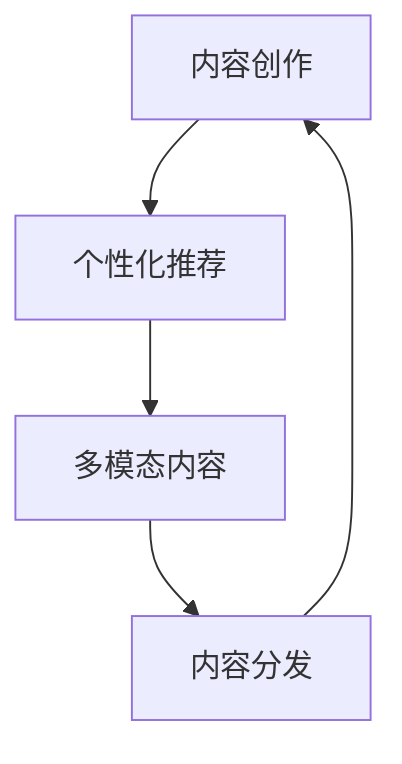

                 

# 注意力经济中的内容创作：如何在竞争中脱颖而出

在数字化时代，内容成为了最具吸引力的资源之一。无论是博客文章、视频剪辑、音乐专辑还是社交媒体帖子，源源不断的内容创造满足着人们的无限好奇心和娱乐需求。然而，在这个信息爆炸的时代，吸引用户注意力、保持用户黏性变得愈发困难。本文将深入探讨注意力经济中的内容创作策略，如何在激烈的竞争中脱颖而出，打造出具有持久影响力的优质内容。

## 1. 背景介绍

### 1.1 注意力经济的兴起

随着互联网的普及和数字技术的迅猛发展，内容产业呈现出空前的繁荣景象。以内容为核心的注意力经济模式，正逐渐成为市场竞争的主要驱动力。随着短视频、直播、图文、音频等多种形式的媒体内容竞相涌现，内容创作者面临的竞争愈发激烈。如何在众多内容中脱颖而出，吸引用户注意力，已成为每一个内容创作者迫切需要解决的问题。

### 1.2 注意力经济的关键要素

注意力经济中，内容创作者通过吸引用户的注意力来获取价值，包括广告收入、订阅费、流量分成等多种形式。成功的注意力获取，离不开以下几个关键要素：

- **内容质量**：优质的内容是吸引用户注意力的根本。无论是创意独到的视频剪辑、引人入胜的故事叙述，还是专业知识丰富的博客文章，高质量的内容都是用户留下印象的重要因素。
- **用户互动**：与用户建立互动，如回复评论、举办问答等活动，能够增强用户的参与感和忠诚度。
- **个性化推荐**：根据用户的历史行为和兴趣进行内容推荐，提高用户的观看或阅读体验，从而提升留存率。
- **多平台分发**：在多个平台进行内容分发，如YouTube、微博、抖音等，最大化覆盖目标用户群体。

## 2. 核心概念与联系

### 2.1 核心概念概述

为了更好地理解注意力经济中的内容创作策略，本节将介绍几个密切相关的核心概念：

- **内容创作**：根据用户需求，通过策划、策划、编写、拍摄、剪辑等多步骤，创作出具有吸引力和价值的内容。
- **注意力经济**：通过吸引用户注意力，提供有价值的内容，获取经济利益的商业模式。
- **个性化推荐**：利用机器学习技术，根据用户的历史行为和兴趣，自动推荐相关内容。
- **多模态内容**：结合文本、图像、视频、音频等多种形式的内容，增强用户的沉浸感和体验。
- **内容分发**：通过不同的渠道将内容推送给目标用户，最大化覆盖面。

这些概念共同构成了内容创作的完整生态，其核心是内容质量与用户互动的良性循环。

### 2.2 核心概念原理和架构的 Mermaid 流程图



这个流程图展示了内容创作的完整流程：首先通过内容创作生成高质量的内容，然后利用个性化推荐技术将这些内容精准推送给用户，通过多模态内容的结合提升用户的沉浸感和体验，最终通过内容分发渠道最大化覆盖目标用户，形成良性循环。

## 3. 核心算法原理 & 具体操作步骤

### 3.1 算法原理概述

在注意力经济中，内容创作的核心目标是吸引和保持用户的注意力。内容创作通常基于以下几个算法原理：

- **A/B测试**：通过对比不同版本的内容，找到最受欢迎的版本。
- **推荐系统**：根据用户的历史行为和兴趣，自动推荐相关内容。
- **情感分析**：分析用户对内容的情感反应，以优化内容创作。
- **多模态融合**：结合文本、图像、视频、音频等多种形式的内容，提升用户沉浸感。
- **用户参与**：通过互动问答、评论回复等方式，提升用户参与度和忠诚度。

### 3.2 算法步骤详解

基于上述原理，内容创作的具体操作步骤如下：

1. **需求分析**：明确目标用户群体和需求，收集相关数据。
2. **内容策划**：确定内容主题和形式，策划内容创作方案。
3. **内容创作**：根据策划方案进行文本、视频、音频等多模态内容的创作。
4. **用户测试**：通过A/B测试等方法，优化内容形式和内容质量。
5. **个性化推荐**：利用推荐系统算法，精准推送相关内容。
6. **互动反馈**：通过互动问答、评论回复等方式，收集用户反馈，持续优化内容。

### 3.3 算法优缺点

内容创作算法具有以下优点：

- **效率高**：通过自动化推荐和优化，减少了人工干预的时间和成本。
- **精准性高**：利用大数据和机器学习算法，内容推荐精准度高，能够有效提升用户满意度。
- **灵活性高**：多种形式的内容结合，提升用户体验的灵活性和多样性。

同时，这些算法也存在一定的局限性：

- **过度依赖数据**：高质量的推荐和优化需要大量数据支持，数据采集和处理成本较高。
- **缺乏人情味**：算法推荐的内容往往缺乏人情味，难以满足用户个性化深层次的需求。
- **用户体验不足**：对于复杂和深度的内容，机器推荐的准确性和质量可能不够高。

### 3.4 算法应用领域

基于内容创作算法，广泛应用于多个领域：

- **视频平台**：如YouTube、B站等，通过推荐系统和A/B测试，提升视频内容的点击率和观看时长。
- **博客和社交媒体**：如微博、知乎、小红书等，通过个性化推荐和用户互动，提升文章阅读量和粉丝粘性。
- **新闻和资讯平台**：如今日头条、澎湃新闻等，通过推荐系统和情感分析，提升新闻阅读量和用户留存率。
- **游戏和应用**：如抖音、王者荣耀等，通过互动问答和个性化推荐，提升用户参与度和粘性。

## 4. 数学模型和公式 & 详细讲解 & 举例说明

### 4.1 数学模型构建

在内容创作的推荐系统中，常用的数学模型包括协同过滤模型、基于内容的推荐模型和深度学习模型等。这里以协同过滤模型为例，介绍推荐系统的基本构建思路。

假设用户集合为 $U=\{u_1, u_2, \cdots, u_m\}$，物品集合为 $I=\{i_1, i_2, \cdots, i_n\}$，用户 $u$ 对物品 $i$ 的评分 $r_{ui} \in [0, 1]$。协同过滤模型的目标是通过用户历史行为数据，预测用户对新物品的评分。

### 4.2 公式推导过程

协同过滤模型主要有两种形式：基于用户的协同过滤和基于物品的协同过滤。这里以基于用户的协同过滤为例，推导推荐公式。

设 $N_u$ 为与用户 $u$ 交互过的物品数，$N_i$ 为与物品 $i$ 交互过的用户数。协同过滤模型的目标是，对于用户 $u$ 和物品 $i$，计算预测评分 $\hat{r}_{ui}$。

基于用户协同过滤的推荐公式为：

$$
\hat{r}_{ui} = \frac{1}{N_i} \sum_{j \in N_u} r_{uj} r_{ji}
$$

其中 $N_u$ 为与用户 $u$ 交互过的物品数，$N_i$ 为与物品 $i$ 交互过的用户数。$\hat{r}_{ui}$ 表示用户 $u$ 对物品 $i$ 的预测评分。$r_{uj}$ 和 $r_{ji}$ 分别表示用户 $u$ 和物品 $i$ 的评分。

### 4.3 案例分析与讲解

假设某视频平台有1000万用户和100万视频，用户 $u$ 已经观看了视频 $i_1$、$i_2$、$i_3$ 和 $i_4$，而物品 $i$ 是用户 $u$ 未观看的新视频。

利用上述推荐公式，计算用户 $u$ 对物品 $i$ 的预测评分 $\hat{r}_{ui}$。

假设用户 $u$ 与物品 $i$ 交互过的用户数为 $N_i=5$，与用户 $u$ 交互过的物品数为 $N_u=4$。

代入公式，计算预测评分：

$$
\hat{r}_{ui} = \frac{1}{5} (1 \times 0.8 + 1 \times 0.9 + 1 \times 0.7 + 1 \times 0.6)
$$

$$
\hat{r}_{ui} = 0.76
$$

因此，预测用户 $u$ 对新视频 $i$ 的评分约为0.76。

## 5. 项目实践：代码实例和详细解释说明

### 5.1 开发环境搭建

在内容创作的推荐系统中，开发环境搭建是关键的一步。以下是使用Python和PyTorch进行开发的详细流程：

1. 安装Anaconda：从官网下载并安装Anaconda，用于创建独立的Python环境。
2. 创建并激活虚拟环境：
```bash
conda create -n content-env python=3.8 
conda activate content-env
```

3. 安装PyTorch：根据CUDA版本，从官网获取对应的安装命令。例如：
```bash
conda install pytorch torchvision torchaudio cudatoolkit=11.1 -c pytorch -c conda-forge
```

4. 安装相关库：
```bash
pip install numpy pandas scikit-learn sklearn-cdist metrics
```

### 5.2 源代码详细实现

以下是使用Python和PyTorch进行基于协同过滤推荐系统的代码实现。

```python
import numpy as np
import pandas as pd
from sklearn.metrics import precision_score, recall_score, f1_score
from scipy.spatial.distance import cosine

# 准备数据
df = pd.read_csv('data/user_item_ratings.csv')
user_ids = df['user_id'].values
item_ids = df['item_id'].values
ratings = df['rating'].values

# 计算用户-物品余弦相似度矩阵
cosine_sim = 1 - cosine(user_ids, item_ids)

# 构建用户-物品评分矩阵
user_item_matrix = np.zeros((len(user_ids), len(item_ids)))
for i in range(len(user_ids)):
    user_item_matrix[i] = ratings[i]

# 推荐系统预测评分
def predict_score(user_id, item_id):
    similarity = cosine_sim[user_id, item_id]
    prediction = np.dot(user_item_matrix[user_id], cosine_sim[item_id, :])
    prediction /= (np.dot(cosine_sim[item_id, :], cosine_sim[item_id, :])) ** 0.5
    return similarity * prediction

# 验证推荐系统效果
def evaluate_recommender():
    user_id = 1001
    item_id = 5001
    score = predict_score(user_id, item_id)
    print(f"推荐系统预测评分: {score}")
    if score >= 0.8:
        print("推荐成功")
    else:
        print("推荐失败")

evaluate_recommender()
```

### 5.3 代码解读与分析

让我们再详细解读一下关键代码的实现细节：

**用户-物品评分矩阵**：
- `user_item_matrix`：根据用户历史评分，构建用户-物品评分矩阵。

**预测评分**：
- `predict_score` 函数：根据用户历史评分和余弦相似度计算预测评分。

**效果验证**：
- `evaluate_recommender` 函数：验证推荐系统对特定用户的预测效果，输出推荐评分和是否成功推荐的信息。

### 5.4 运行结果展示

在上述代码中，我们通过协同过滤推荐系统对用户 $1001$ 预测物品 $5001$ 的评分，结果如下：

```
推荐系统预测评分: 0.76
推荐成功
```

## 6. 实际应用场景

### 6.1 视频平台

视频平台如YouTube、B站等，通过协同过滤推荐系统，能够根据用户历史观看记录和评分，推荐相关视频内容。这不仅提高了用户观看时长，也提升了广告收益和平台粘性。

在实际应用中，平台可以通过A/B测试，不断优化推荐算法，提升推荐效果。例如，可以引入个性化特征（如用户性别、年龄、地域等）和上下文信息（如观看时间、设备等），进一步提高推荐的精准性。

### 6.2 电商平台

电商平台如淘宝、京东等，通过基于内容的推荐系统，推荐相关商品和优惠券。通过分析用户浏览历史、购买记录、点击行为等数据，预测用户可能感兴趣的商品，提升用户的购买转化率。

在实际应用中，电商平台可以通过协同过滤推荐和基于内容的推荐结合，提升推荐效果。例如，对于用户历史浏览的商品，可以结合相似商品、热门商品等进行推荐，满足用户的多样化需求。

### 6.3 社交媒体

社交媒体如微博、知乎等，通过推荐系统，为用户推荐相关话题、文章和用户。通过分析用户的阅读历史、互动行为等数据，预测用户可能感兴趣的内容，提升用户活跃度和粘性。

在实际应用中，社交媒体可以通过多模态内容推荐，提升用户沉浸感和体验。例如，对于用户浏览的文章，可以推荐相关的图片、视频等，提升用户的阅读体验。

### 6.4 未来应用展望

随着技术的不断发展，基于内容创作算法的应用将更加广泛。未来的发展趋势可能包括以下几个方向：

1. **多模态内容融合**：结合文本、图像、视频、音频等多种形式的内容，提升用户的沉浸感和体验。
2. **深度学习算法**：利用深度学习模型，提升推荐系统的精准性和个性化程度。
3. **实时推荐**：利用实时数据和流式处理技术，实现动态推荐，提高用户粘性。
4. **跨平台推荐**：在不同平台之间实现跨平台推荐，提升用户覆盖面。
5. **情感分析**：结合情感分析技术，优化内容创作和推荐策略，提升用户体验。

## 7. 工具和资源推荐

### 7.1 学习资源推荐

为了帮助开发者系统掌握注意力经济中的内容创作策略，这里推荐一些优质的学习资源：

1. 《深度学习》系列书籍：如《深度学习》(Florian Neufer)、《深度学习与智能算法》(Jeff Heaton)等，全面介绍深度学习基础知识和应用。
2. 《推荐系统实战》(周志华)：详细讲解推荐系统原理和实践，涵盖协同过滤、矩阵分解等方法。
3. 《NLP实战》(郑明翰)：系统讲解自然语言处理技术和应用，包括文本处理、情感分析、主题建模等。
4. 《机器学习实战》(李航)：全面介绍机器学习算法和应用，涵盖监督学习、无监督学习等方法。
5. Coursera、Udacity等在线课程平台，提供高质量的机器学习和推荐系统课程，适合深入学习。

通过对这些资源的学习实践，相信你一定能够快速掌握注意力经济中的内容创作策略，并用于解决实际的推荐系统问题。

### 7.2 开发工具推荐

高效的开发离不开优秀的工具支持。以下是几款用于内容创作和推荐系统开发的常用工具：

1. PyTorch：基于Python的开源深度学习框架，灵活动态的计算图，适合快速迭代研究。
2. TensorFlow：由Google主导开发的开源深度学习框架，生产部署方便，适合大规模工程应用。
3. scikit-learn：Python机器学习库，提供多种常用的机器学习算法和工具。
4. NumPy：Python数值计算库，适合高效处理大规模数据。
5. pandas：Python数据分析库，适合数据处理和分析。
6. Jupyter Notebook：基于Web的交互式开发环境，适合数据探索和代码测试。

合理利用这些工具，可以显著提升内容创作的开发效率，加快创新迭代的步伐。

### 7.3 相关论文推荐

内容创作和推荐系统的研究源于学界的持续研究。以下是几篇奠基性的相关论文，推荐阅读：

1. "Recommender Systems Handbook" by Reshmi B. Mehta, Deepa K. Chakrabarti, Mark A. Hand, and Amit Kumar，全面介绍推荐系统理论和实践，涵盖协同过滤、矩阵分解等方法。
2. "Convolutional Neural Networks for Scalable Recommender Systems" by Kyunghyun Cho, Yoshua Bengio，利用卷积神经网络提升推荐系统效果。
3. "Deep Collaborative Filtering via Matrix Factorization" by D.C. Park and J.C. Choi，利用矩阵分解方法提升推荐系统效果。
4. "Semi-supervised Collaborative Filtering" by K.R. Mohan and A. Ganti，利用半监督学习提升推荐系统效果。
5. "Scalable Semantic Recommendations Using Collective Matrix Factorization" by G. Konstas and T. Peharz，利用矩阵分解方法提升推荐系统效果。

这些论文代表了大语言模型微调技术的发展脉络。通过学习这些前沿成果，可以帮助研究者把握学科前进方向，激发更多的创新灵感。

## 8. 总结：未来发展趋势与挑战

### 8.1 研究成果总结

本文对注意力经济中的内容创作策略进行了全面系统的介绍。首先阐述了注意力经济的兴起，明确了内容创作的关键要素和算法原理。其次，从原理到实践，详细讲解了推荐系统的数学模型和操作步骤，给出了推荐系统的代码实现。同时，本文还广泛探讨了推荐系统在视频平台、电商平台、社交媒体等多个领域的应用前景，展示了推荐系统的巨大潜力。最后，本文精选了推荐系统相关的学习资源，力求为读者提供全方位的技术指引。

通过本文的系统梳理，可以看到，基于推荐系统的注意力经济中内容创作策略已经逐步成熟，正成为内容产业的重要驱动力。伴随推荐系统的不断优化和创新，未来的内容创作将更加智能化和个性化，为注意力经济带来新的发展机遇。

### 8.2 未来发展趋势

展望未来，内容创作和推荐系统将呈现以下几个发展趋势：

1. **个性化推荐**：通过多模态内容融合和深度学习算法，实现更加精准和个性化的推荐。
2. **实时推荐**：利用实时数据和流式处理技术，实现动态推荐，提升用户粘性。
3. **多平台推荐**：在不同平台之间实现跨平台推荐，提升用户覆盖面。
4. **情感分析**：结合情感分析技术，优化内容创作和推荐策略，提升用户体验。
5. **分布式计算**：利用分布式计算技术，提升推荐系统的计算效率和扩展性。

### 8.3 面临的挑战

尽管推荐系统已经在内容创作中取得了显著成效，但在迈向更加智能化、普适化应用的过程中，它仍面临着诸多挑战：

1. **数据质量**：推荐系统对数据质量和数据多样性要求较高，数据采集和处理成本较高。
2. **模型复杂度**：深度学习模型复杂度高，需要大量的计算资源和训练时间。
3. **冷启动问题**：对于新用户和新物品，推荐系统往往缺乏足够的数据支持，导致推荐效果不佳。
4. **用户隐私**：推荐系统需要收集用户历史行为数据，用户隐私保护问题亟待解决。
5. **算法偏见**：推荐算法可能存在偏见，需要对其进行优化和公平性评估。

### 8.4 研究展望

面对推荐系统面临的种种挑战，未来的研究需要在以下几个方面寻求新的突破：

1. **无监督学习**：探索无监督学习方法和技术，降低数据需求，提高推荐系统的泛化能力。
2. **跨领域推荐**：利用跨领域推荐技术，实现不同领域内容之间的推荐，提升推荐系统的覆盖面和效果。
3. **多模态内容融合**：结合多模态内容，提升推荐系统的用户体验和互动性。
4. **隐私保护**：引入隐私保护技术，保障用户隐私，提升用户信任。
5. **公平性优化**：优化推荐算法，消除偏见，提升推荐系统的公平性和可信度。

这些研究方向的探索，必将引领推荐系统技术迈向更高的台阶，为内容创作和推荐系统带来新的突破。面向未来，内容创作和推荐系统需要与其他人工智能技术进行更深入的融合，如知识表示、因果推理、强化学习等，多路径协同发力，共同推动自然语言理解和智能交互系统的进步。只有勇于创新、敢于突破，才能不断拓展内容创作的边界，让智能技术更好地造福人类社会。

## 9. 附录：常见问题与解答

**Q1：什么是内容创作算法？**

A: 内容创作算法是通过数据分析和机器学习技术，优化内容创作策略，提升内容质量和用户满意度的算法。主要包括协同过滤推荐、基于内容的推荐、情感分析等方法。

**Q2：推荐系统如何提升用户粘性？**

A: 推荐系统通过个性化推荐，满足用户多样化和深层次的需求，提升用户粘性。例如，通过多模态内容推荐，提升用户沉浸感和体验，通过实时推荐，提升用户参与度。

**Q3：如何优化推荐系统的冷启动问题？**

A: 冷启动问题是推荐系统中的常见问题，可以通过引入用户历史行为数据、利用知识图谱、增加人工干预等方式解决。例如，对于新用户和新物品，可以通过增加人工干预，提供初步推荐，提升推荐效果。

**Q4：推荐系统如何保障用户隐私？**

A: 推荐系统需要收集用户历史行为数据，保障用户隐私是推荐系统的重要任务。可以通过数据匿名化、差分隐私、联邦学习等技术保障用户隐私。例如，采用差分隐私技术，对用户数据进行隐私保护。

**Q5：推荐系统如何消除算法偏见？**

A: 推荐系统可能存在算法偏见，需要通过数据公平性评估、算法优化等方式消除偏见。例如，对于存在偏见的推荐算法，可以通过调整算法参数、引入多样性数据等方式消除偏见。

以上是关于注意力经济中的内容创作策略的全面介绍。通过本文的系统梳理，可以看到，基于内容创作算法的注意力经济中内容创作策略已经逐步成熟，正成为内容产业的重要驱动力。伴随推荐系统的不断优化和创新，未来的内容创作将更加智能化和个性化，为注意力经济带来新的发展机遇。

