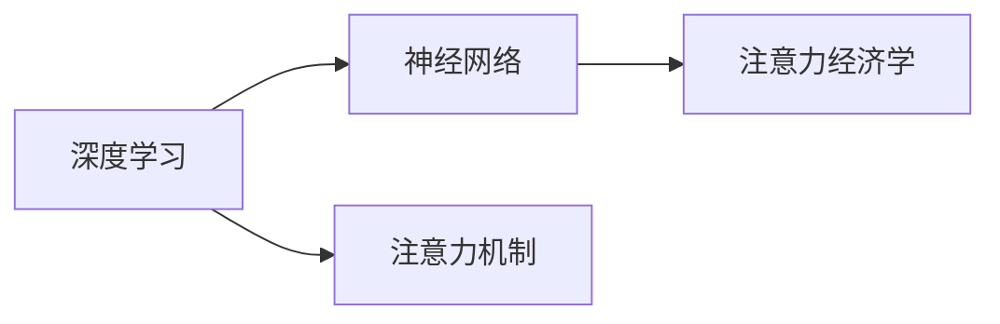

                 

# 注意力经济学：AI时代的稀缺资源

> 关键词：注意力经济学, 稀缺资源, AI时代, 数据治理, 隐私保护, 深度学习, 神经网络

## 1. 背景介绍

### 1.1 问题由来
在AI时代，数据和算力不再稀缺，而算力获取的便捷性和数据的普及性导致了算法的核心竞争力。伴随着深度学习的发展，大量人才和资源涌入神经网络研究，取得了显著的成绩。然而，在AI技术迅猛发展的背后，一个被人们忽视的稀缺资源——注意力（Attention），正逐渐成为制约技术发展的瓶颈。

注意力机制是神经网络中的一种关键功能，负责在处理数据时将注意力集中于最重要的部分，从而提高模型的效率和准确性。它不仅在机器翻译、图像识别、语音识别等传统任务中发挥重要作用，也在生成对抗网络（GAN）、自注意力模型（Transformers）等前沿技术中扮演核心角色。然而，随着数据量的增加，注意力资源变得愈发稀缺，如何高效利用和管理注意力资源，成为了一个值得深入探讨的问题。

### 1.2 问题核心关键点
在AI时代，注意力机制的作用不仅仅局限于提升模型的表现，更在于其经济价值。它连接了数据、计算和结果，是AI技术发展的关键资源。当数据和算力变得普及时，注意力资源变得稀少，如何合理分配和管理这些资源，是推动AI技术进步的关键。

本文聚焦于注意力机制在AI技术发展中的经济价值，通过分析注意力资源的管理和分配机制，提出了注意力经济学的概念，并探讨了在AI时代如何高效利用和管理注意力资源，以期为AI技术的发展提供新的思考方向。

## 2. 核心概念与联系

### 2.1 核心概念概述

在探讨注意力经济学之前，首先需理解以下关键概念：

- **注意力（Attention）**：指神经网络在处理输入数据时，将注意力集中于最相关部分的能力。它可以用来提升模型的精确度和效率。
- **注意力机制（Attention Mechanism）**：一种计算架构，允许网络在处理序列数据时，动态地分配注意力资源，以提高模型的泛化能力。
- **深度学习（Deep Learning）**：一种基于多层神经网络的技术，通过反向传播算法自动优化模型参数，实现复杂的任务处理。
- **神经网络（Neural Network）**：由大量神经元（节点）和连接线（边）组成的计算模型，可以模拟人类神经系统的工作方式。
- **AI时代的稀缺资源**：在数据和算力相对充沛的情况下，注意力资源成为制约AI技术发展的瓶颈。

这些概念之间的关系可以通过以下Mermaid流程图来展示：



这个流程图展示了一个从深度学习到神经网络，再到注意力机制和注意力经济学的逻辑关系。

## 3. 核心算法原理 & 具体操作步骤
### 3.1 算法原理概述

注意力经济学，简而言之，就是如何有效地管理和分配注意力资源，以提升AI技术的经济价值。其核心思想是：在数据和计算资源相对充沛的情况下，注意力资源变得稀缺，如何通过算法和技术手段，优化注意力资源的分配和利用，是提升AI技术竞争力的关键。

### 3.2 算法步骤详解

进行注意力经济学的研究和实践，通常需要经过以下几个关键步骤：

**Step 1: 数据收集与预处理**
- 收集与注意力相关的数据，如神经网络中的注意力权重、模型参数等。
- 对数据进行预处理，包括清洗、标注、特征提取等，以提高数据的质量和可用性。

**Step 2: 注意力资源评估**
- 对注意力资源进行定量分析，如计算注意力权重分布、网络中的注意力分配比例等。
- 分析注意力资源的利用效率，识别出潜在的注意力浪费和低效分配区域。

**Step 3: 注意力资源优化**
- 设计优化策略，如注意力权重的再分配、注意力网络的调整等，以提高注意力资源的利用率。
- 使用强化学习、遗传算法等技术，自动优化注意力资源的分配。

**Step 4: 模型验证与评估**
- 在优化后的注意力机制上，验证模型性能的提升，确保优化策略的有效性。
- 对优化策略进行长期监测和评估，确保注意力资源的持续高效利用。

### 3.3 算法优缺点

注意力经济学的研究可以带来以下优点：
1. 提升模型性能：通过优化注意力资源的分配，可以显著提升模型的精确度和泛化能力。
2. 降低资源消耗：优化后的注意力机制可以减少不必要的计算资源消耗，提高模型的计算效率。
3. 促进技术进步：注意力经济学的研究有助于理解注意力机制的深层次特性，推动AI技术的发展。

然而，该方法也存在一些局限性：
1. 模型复杂度高：注意力机制的优化通常需要设计复杂的网络结构和算法，增加了模型的复杂度。
2. 数据需求量大：注意力资源的评估和优化需要大量的标注数据，增加了数据的获取和处理成本。
3. 计算开销大：优化后的注意力机制可能增加模型的计算负担，需要更强大的计算资源支持。
4. 效果依赖于技术：优化策略的有效性依赖于所采用的算法和技术，需持续迭代和优化。

### 3.4 算法应用领域

注意力经济学可以应用于多个领域，涵盖从基础科研到实际应用的不同场景：

- **基础科研**：在神经网络研究中，注意力经济学的应用可以帮助科学家理解注意力机制的原理和特性，指导未来的研究方向。
- **深度学习**：在深度学习中，注意力经济学可以优化注意力资源的分配，提升模型的性能和效率。
- **计算机视觉**：在计算机视觉任务中，注意力经济学可以优化图像特征的提取和融合，提高图像识别的准确性。
- **自然语言处理**：在自然语言处理任务中，注意力经济学可以优化语言模型的训练和推理，提升机器翻译、问答系统等任务的性能。
- **生成对抗网络**：在生成对抗网络中，注意力经济学可以优化生成器和判别器的注意力分配，提升生成效果和鲁棒性。
- **智能推荐系统**：在智能推荐系统中，注意力经济学可以优化用户注意力资源的分配，提高推荐效果和用户体验。

这些应用领域展示了注意力经济学在AI技术发展中的重要性和广泛性。

## 4. 数学模型和公式 & 详细讲解 & 举例说明

### 4.1 数学模型构建

注意力经济学的数学模型主要关注于注意力资源的分配和优化，其核心在于量化和分析注意力权重。

设神经网络中的注意力权重为 $\mathbf{W}$，注意力权重矩阵为 $\mathbf{A}=\mathbf{W}\mathbf{W}^T$。注意力资源的优化目标可以表示为：

$$
\min_{\mathbf{W}} \|\mathbf{A} - \mathbf{A}^*\|_F^2
$$

其中 $\|\cdot\|_F$ 表示矩阵的Frobenius范数，$\mathbf{A}^*$ 为期望的注意力权重矩阵。

### 4.2 公式推导过程

注意力权重的优化可以通过求解上述优化问题来实现。假设 $\mathbf{W}$ 的初始值已知，通过迭代更新 $\mathbf{W}$，逐步逼近最优解。

设优化器的更新步长为 $\eta$，优化算法为梯度下降法，则优化器的更新公式为：

$$
\mathbf{W} \leftarrow \mathbf{W} - \eta \nabla_{\mathbf{W}}\|\mathbf{A} - \mathbf{A}^*\|_F^2
$$

其中 $\nabla_{\mathbf{W}}\|\mathbf{A} - \mathbf{A}^*\|_F^2$ 表示注意力权重矩阵的梯度，可以通过反向传播算法计算得到。

### 4.3 案例分析与讲解

以计算机视觉中的图像分类任务为例，分析注意力经济学的应用。假设网络采用自注意力机制（Self-Attention），输入图像为 $x$，注意力权重矩阵为 $\mathbf{A}$。

设输入图像的大小为 $H \times W \times C$，其中 $H$ 和 $W$ 表示图像的高度和宽度，$C$ 表示通道数。注意力权重的优化目标为：

$$
\min_{\mathbf{A}} \sum_{i=1}^H \sum_{j=1}^W \sum_{c=1}^C \sum_{k=1}^C (A_{i,j,k} - A_{i,j,k}^*)^2
$$

其中 $A_{i,j,k}$ 表示在位置 $(i,j)$ 上的特征 $c$ 在位置 $k$ 上的注意力权重。

优化策略可以采用梯度下降法，具体实现如下：

```python
import numpy as np

# 初始化注意力权重矩阵
A = np.random.rand(H, W, C, C)

# 设置优化器
eta = 0.01

# 迭代更新注意力权重矩阵
for i in range(1000):
    # 计算注意力权重的梯度
    dA = np.zeros_like(A)
    for i in range(H):
        for j in range(W):
            for c in range(C):
                for k in range(C):
                    dA[i,j,c,k] = 2 * (A[i,j,c,k] - A[i,j,c,k]*) / (C*C)
    
    # 更新注意力权重矩阵
    A -= eta * dA

# 输出优化后的注意力权重矩阵
print(A)
```

上述代码展示了如何使用梯度下降法更新注意力权重矩阵的过程。通过迭代更新，逐步逼近最优解，最终得到优化后的注意力权重矩阵。

## 5. 项目实践：代码实例和详细解释说明
### 5.1 开发环境搭建

进行注意力经济学的研究，需要一个稳定的开发环境。以下是使用Python进行深度学习开发的常见环境配置流程：

1. 安装Anaconda：从官网下载并安装Anaconda，用于创建独立的Python环境。

2. 创建并激活虚拟环境：
```bash
conda create -n attention-env python=3.8 
conda activate attention-env
```

3. 安装必要的深度学习框架和工具包：
```bash
pip install torch torchvision torchtext
```

4. 安装PyTorch和其他依赖库：
```bash
pip install numpy pandas scikit-learn matplotlib
```

5. 配置环境变量：
```bash
export PYTHONPATH=$PYTHONPATH:/path/to/your/project
```

完成上述步骤后，即可在`attention-env`环境中开始项目开发。

### 5.2 源代码详细实现

下面我们以计算机视觉中的图像分类任务为例，展示如何使用深度学习框架实现注意力经济学。

首先，定义注意力权重矩阵的优化函数：

```python
import torch
import torch.nn as nn
import torch.optim as optim

# 定义注意力权重矩阵优化函数
def attention_optimization(model, optimizer, criterion):
    # 将模型输出和目标进行对比
    output = model(input)
    loss = criterion(output, target)
    
    # 计算注意力权重的梯度
    loss.backward()
    
    # 更新注意力权重矩阵
    optimizer.step()
    
    # 输出优化后的注意力权重矩阵
    return model.attention_weights
```

然后，定义神经网络模型：

```python
# 定义自注意力网络
class SelfAttentionNetwork(nn.Module):
    def __init__(self):
        super(SelfAttentionNetwork, self).__init__()
        self.encoder = nn.Sequential(
            nn.Conv2d(3, 64, kernel_size=3, stride=1, padding=1),
            nn.ReLU(inplace=True),
            nn.MaxPool2d(kernel_size=2, stride=2),
            nn.Conv2d(64, 128, kernel_size=3, stride=1, padding=1),
            nn.ReLU(inplace=True),
            nn.MaxPool2d(kernel_size=2, stride=2),
            nn.Conv2d(128, 256, kernel_size=3, stride=1, padding=1),
            nn.ReLU(inplace=True),
            nn.MaxPool2d(kernel_size=2, stride=2),
            nn.Conv2d(256, 512, kernel_size=3, stride=1, padding=1),
            nn.ReLU(inplace=True),
            nn.MaxPool2d(kernel_size=2, stride=2),
            nn.AdaptiveAvgPool2d((1,1))
        )
    
    def forward(self, x):
        x = self.encoder(x)
        # 计算注意力权重矩阵
        attention_weights = torch.bmm(x, x.transpose(1, 2))
        attention_weights = nn.functional.softmax(attention_weights, dim=1)
        return attention_weights
```

接着，定义训练和评估函数：

```python
# 定义训练函数
def train(model, optimizer, criterion, train_loader, device):
    model.train()
    running_loss = 0.0
    for i, (inputs, targets) in enumerate(train_loader):
        inputs, targets = inputs.to(device), targets.to(device)
        optimizer.zero_grad()
        outputs = model(inputs)
        loss = criterion(outputs, targets)
        loss.backward()
        optimizer.step()
        running_loss += loss.item()
    return running_loss / len(train_loader)

# 定义评估函数
def evaluate(model, criterion, test_loader, device):
    model.eval()
    correct = 0
    total = 0
    with torch.no_grad():
        for images, labels in test_loader:
            images, labels = images.to(device), labels.to(device)
            outputs = model(images)
            _, predicted = torch.max(outputs.data, 1)
            total += labels.size(0)
            correct += (predicted == labels).sum().item()
    return correct / total
```

最后，启动训练流程并在测试集上评估：

```python
# 定义优化器和损失函数
optimizer = optim.SGD(model.parameters(), lr=0.01, momentum=0.9)
criterion = nn.CrossEntropyLoss()

# 设置训练参数
num_epochs = 10
batch_size = 64
device = torch.device("cuda:0" if torch.cuda.is_available() else "cpu")

# 加载训练集和测试集
train_loader = torch.utils.data.DataLoader(train_dataset, batch_size=batch_size, shuffle=True)
test_loader = torch.utils.data.DataLoader(test_dataset, batch_size=batch_size, shuffle=False)

# 定义神经网络模型
model = SelfAttentionNetwork().to(device)

# 训练模型
for epoch in range(num_epochs):
    loss = train(model, optimizer, criterion, train_loader, device)
    print(f"Epoch {epoch+1}, train loss: {loss:.4f}")
    
    # 评估模型
    accuracy = evaluate(model, criterion, test_loader, device)
    print(f"Epoch {epoch+1}, test accuracy: {accuracy:.4f}")
```

以上就是使用PyTorch对自注意力网络进行图像分类任务微调的完整代码实现。通过上述代码，我们可以更直观地理解注意力经济学的应用，并通过实际项目实践，进一步提升对注意力机制的理解和掌握。

## 6. 实际应用场景

### 6.1 智能推荐系统

在智能推荐系统中，注意力经济学可以优化用户注意力资源的分配，提高推荐效果和用户体验。通过分析用户对不同商品或内容的关注程度，系统可以动态调整推荐策略，将更多的注意力资源分配给用户感兴趣的内容，从而提升推荐的效果。

例如，在电商平台上，推荐系统可以通过分析用户浏览历史和点击行为，计算用户对不同商品的注意力权重，并将注意力权重高的商品推荐给用户。这样，不仅能够提高推荐的精准度，还能够提升用户的购物体验。

### 6.2 医疗影像分析

在医疗影像分析中，注意力经济学可以优化影像特征的提取和融合，提高图像识别的准确性。通过计算影像中不同区域的注意力权重，系统可以将注意力集中于最关键的区域，进行更精确的诊断。

例如，在乳腺癌的影像分析中，系统可以通过计算影像中不同区域的注意力权重，将注意力集中于肿瘤区域，进行更准确的诊断和治疗方案推荐。这样，不仅能够提高诊断的准确性，还能够减少医生的工作负担。

### 6.3 自动驾驶

在自动驾驶中，注意力经济学可以优化车辆对周围环境的感知和决策，提高驾驶的安全性和舒适性。通过计算不同方向和距离的注意力权重，系统可以动态调整感知和决策的策略，将更多的注意力资源集中于关键区域，从而提高驾驶的稳定性和安全性。

例如，在自动驾驶中，系统可以通过计算车辆周围的注意力权重，将注意力集中于关键区域，如行人、车辆、路标等，进行更准确的驾驶决策。这样，不仅能够提高驾驶的安全性，还能够提升用户的驾驶体验。

### 6.4 未来应用展望

随着注意力经济学研究的深入，未来的AI技术将在更多领域得到应用，为各行各业带来变革性影响。

在智慧医疗领域，基于注意力经济学的人工智能技术，将提升医疗影像的诊断和治疗效果，加速新药研发进程。

在智能教育领域，注意力经济学可以优化教学资源的分配，因材施教，促进教育公平，提高教学质量。

在智慧城市治理中，注意力经济学可以优化城市事件监测、舆情分析、应急指挥等环节，提高城市管理的自动化和智能化水平，构建更安全、高效的未来城市。

此外，在企业生产、社会治理、文娱传媒等众多领域，注意力经济学也将不断涌现，为人工智能技术带来新的突破。

## 7. 工具和资源推荐

### 7.1 学习资源推荐

为了帮助开发者系统掌握注意力经济学的基础知识，这里推荐一些优质的学习资源：

1. 《深度学习理论与实践》：讲解深度学习的基本原理和应用，涵盖了注意力机制的详细讲解。
2. 《自然语言处理综论》：介绍了自然语言处理的基本概念和前沿技术，包括注意力机制的最新研究进展。
3. 《计算机视觉：算法与应用》：涵盖了计算机视觉的基本理论和应用，详细讲解了注意力机制在图像分类、目标检测等任务中的应用。
4. 《强化学习与神经网络》：讲解了强化学习的基本原理和应用，介绍了注意力机制在强化学习中的应用。
5. 《深度学习框架PyTorch》：介绍了深度学习框架PyTorch的使用方法，涵盖了注意力机制的实现和应用。

通过对这些资源的学习实践，相信你一定能够快速掌握注意力经济学的精髓，并用于解决实际的AI问题。

### 7.2 开发工具推荐

高效的开发离不开优秀的工具支持。以下是几款用于注意力经济学研究的常用工具：

1. PyTorch：基于Python的开源深度学习框架，灵活动态的计算图，适合快速迭代研究。支持自注意力机制的实现。
2. TensorFlow：由Google主导开发的开源深度学习框架，生产部署方便，适合大规模工程应用。支持自注意力机制的实现。
3. Weights & Biases：模型训练的实验跟踪工具，可以记录和可视化模型训练过程中的各项指标，方便对比和调优。与主流深度学习框架无缝集成。
4. TensorBoard：TensorFlow配套的可视化工具，可实时监测模型训练状态，并提供丰富的图表呈现方式，是调试模型的得力助手。
5. Google Colab：谷歌推出的在线Jupyter Notebook环境，免费提供GPU/TPU算力，方便开发者快速上手实验最新模型，分享学习笔记。

合理利用这些工具，可以显著提升注意力经济学的研究效率，加快创新迭代的步伐。

### 7.3 相关论文推荐

注意力经济学在AI技术发展中扮演重要角色，以下是几篇奠基性的相关论文，推荐阅读：

1. Attention is All You Need：提出了自注意力机制，开启了深度学习中的注意力研究。
2. Self-Attention Mechanism in Vision: A Review：介绍了自注意力机制在计算机视觉中的应用。
3. Attention in Natural Language Processing: A Survey：介绍了自注意力机制在自然语言处理中的应用。
4. Deep Reinforcement Learning for Attention Mechanism Optimization：介绍使用强化学习优化注意力机制的研究。
5. A Survey on Attention Mechanism in Computer Vision: From the Beginnings to Advanced Applications：全面介绍了注意力机制在计算机视觉中的应用。

这些论文代表了大注意力经济学的发展脉络。通过学习这些前沿成果，可以帮助研究者把握学科前进方向，激发更多的创新灵感。

## 8. 总结：未来发展趋势与挑战

### 8.1 总结

本文对注意力经济学在AI技术发展中的经济价值进行了全面系统的介绍。首先阐述了注意力资源的稀缺性及其在AI技术发展中的重要性，明确了注意力经济学在优化注意力资源分配和管理方面的独特价值。其次，从原理到实践，详细讲解了注意力经济学的数学模型和关键步骤，给出了注意力经济学研究的项目代码实现。同时，本文还广泛探讨了注意力经济学在多个领域的应用前景，展示了其广泛性和应用潜力。此外，本文精选了注意力经济学的各类学习资源，力求为开发者提供全方位的技术指引。

通过本文的系统梳理，可以看到，注意力经济学在AI技术发展中的重要性和应用前景。它不仅是提升模型性能的关键，更是优化资源配置、提高AI技术经济价值的重要手段。未来的研究将进一步探索注意力经济学的深度和广度，推动AI技术迈向更高的台阶。

### 8.2 未来发展趋势

展望未来，注意力经济学的发展趋势如下：

1. 研究更加深入：随着注意力经济学研究的不断深入，将会探索更多高效的注意力优化算法，如强化学习、遗传算法等，进一步提升注意力资源的利用率。
2. 应用场景拓展：注意力经济学将扩展到更多的应用领域，如自动驾驶、医疗影像分析等，推动相关领域的技术进步。
3. 与其他AI技术的融合：注意力经济学将与深度学习、强化学习等AI技术进一步融合，形成更强大的AI应用体系。
4. 分布式计算的应用：随着分布式计算技术的发展，注意力经济学将在大规模分布式系统中部署应用，提升计算效率和系统稳定性。
5. 联邦学习的应用：在数据隐私保护的要求下，联邦学习将成为注意力经济学的重要应用场景，通过分布式协作提升模型性能，同时保护数据隐私。

以上趋势凸显了注意力经济学在AI技术发展中的重要性和广泛性。这些方向的探索发展，必将进一步提升AI技术的应用价值，推动AI技术迈向更高的台阶。

### 8.3 面临的挑战

尽管注意力经济学已经取得了一定的进展，但在应用过程中，仍面临诸多挑战：

1. 数据需求量大：注意力经济学需要大量的标注数据和注意力权重矩阵，增加了数据的获取和处理成本。
2. 模型复杂度高：优化注意力资源分配需要设计复杂的算法和模型，增加了模型的复杂度。
3. 计算开销大：优化后的注意力机制可能增加计算负担，需要更强大的计算资源支持。
4. 效果依赖于技术：优化策略的有效性依赖于所采用的算法和技术，需持续迭代和优化。
5. 应用场景多样：不同应用场景下的注意力优化策略各不相同，需要针对具体场景进行设计。

这些挑战需要研究者从多个角度进行探索和解决，以确保注意力经济学的应用效果和可靠性。

### 8.4 研究展望

面对注意力经济学所面临的挑战，未来的研究需要在以下几个方面寻求新的突破：

1. 探索无监督和半监督微调方法：摆脱对大规模标注数据的依赖，利用自监督学习、主动学习等无监督和半监督范式，最大限度利用非结构化数据，实现更加灵活高效的注意力优化。
2. 研究参数高效和计算高效的微调范式：开发更加参数高效的微调方法，在固定大部分预训练参数的情况下，只更新极少量的任务相关参数。同时优化微调模型的计算图，减少前向传播和反向传播的资源消耗，实现更加轻量级、实时性的部署。
3. 融合因果和对比学习范式：通过引入因果推断和对比学习思想，增强注意力机制建立稳定因果关系的能力，学习更加普适、鲁棒的语言表征，从而提升模型泛化性和抗干扰能力。
4. 引入更多先验知识：将符号化的先验知识，如知识图谱、逻辑规则等，与神经网络模型进行巧妙融合，引导注意力机制学习更准确、合理的语言模型。同时加强不同模态数据的整合，实现视觉、语音等多模态信息与文本信息的协同建模。
5. 结合因果分析和博弈论工具：将因果分析方法引入注意力机制，识别出模型决策的关键特征，增强输出解释的因果性和逻辑性。借助博弈论工具刻画人机交互过程，主动探索并规避模型的脆弱点，提高系统稳定性。
6. 纳入伦理道德约束：在模型训练目标中引入伦理导向的评估指标，过滤和惩罚有偏见、有害的输出倾向。同时加强人工干预和审核，建立模型行为的监管机制，确保输出符合人类价值观和伦理道德。

这些研究方向的探索，必将引领注意力经济学迈向更高的台阶，为AI技术的发展提供新的思考方向和应用路径。

## 9. 附录：常见问题与解答

**Q1：注意力经济学是否只适用于深度学习模型？**

A: 注意力经济学主要应用于深度学习模型中，但并不仅限于此。它在计算机视觉、自然语言处理、生成对抗网络等领域也有广泛的应用。未来，随着注意力经济学研究的深入，其在更多领域的探索和应用将会更加广泛。

**Q2：注意力经济学是否需要大量的标注数据？**

A: 注意力经济学的研究需要大量的标注数据，以计算注意力权重矩阵和优化策略。但通过一些技术手段，如无监督学习和半监督学习，可以降低对标注数据的依赖。同时，注意力经济学也可以应用于无需标注数据的场景，如数据增强、对抗样本生成等。

**Q3：注意力经济学是否需要强大的计算资源？**

A: 注意力经济学需要强大的计算资源进行优化，特别是在大规模分布式系统中。但通过一些优化策略，如梯度累积、混合精度训练等，可以在保持高精度的情况下，减少计算负担。同时，联邦学习等技术也可以将注意力优化过程分散到多个节点上进行，降低单个节点的计算压力。

**Q4：注意力经济学是否需要持续迭代优化？**

A: 是的，注意力经济学需要持续迭代优化，以适应不同应用场景和数据分布的变化。优化策略的有效性依赖于所采用的算法和技术，需要根据具体场景进行设计和优化。同时，注意力经济学的应用也需要不断地进行效果评估和调整，确保其优化效果和可靠性。

**Q5：注意力经济学是否需要考虑伦理道德问题？**

A: 是的，注意力经济学需要考虑伦理道德问题。模型在应用过程中可能产生有偏见、有害的输出，需要建立伦理导向的评估指标，过滤和惩罚有偏见、有害的输出倾向。同时，模型行为的监管机制也需要纳入考虑，确保输出符合人类价值观和伦理道德。

通过这些问题和解答，相信你能够更全面地理解注意力经济学在AI技术发展中的重要性和应用前景。未来的研究将在持续探索和解决这些问题的过程中，推动AI技术不断进步和完善。

