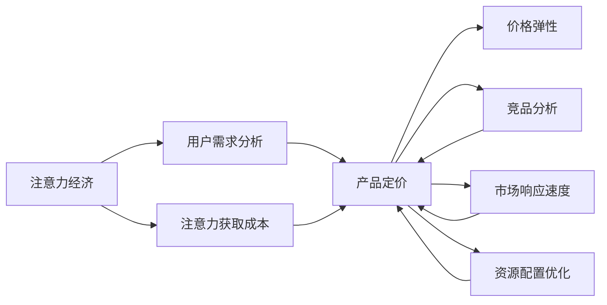

                 

# 注意力经济对企业产品定价的新要求

> 关键词：注意力经济, 企业产品定价, 用户需求, 定价策略, 定价算法, 经济模型, 市场分析

## 1. 背景介绍

随着互联网和数字技术的迅猛发展，信息爆炸时代已逐渐成为常态。过去，企业只需关注产品功能和质量，但如今，市场竞争愈发激烈，用户的注意力和行为习惯也成为决定产品成功的关键因素。注意力经济时代下，企业产品定价面临新的要求和挑战。本文将深入探讨这一问题，分析注意力经济对企业产品定价的新要求，并提出相应的策略和解决方案。

### 1.1 问题由来

注意力经济（Economy of Attention）是指在信息过载的互联网环境中，用户对产品的注意力成为稀缺资源，而企业需要投入大量的资源来吸引和保持用户注意力，以提升品牌知名度和市场份额。传统的产品定价策略如成本加成、市场渗透定价等，在注意力经济时代逐渐失灵，企业需要探索新的定价方法和策略，以应对日益复杂多变的市场环境。

### 1.2 问题核心关键点

注意力经济对企业产品定价的新要求主要体现在以下几个方面：
- **用户需求分析**：在注意力经济时代，用户需求更加多元化和个性化，企业需要更加精准地把握用户需求，以制定更符合用户期望的定价策略。
- **价格弹性和需求响应**：注意力经济下，价格变化对用户需求的影响更为显著，企业需要设计具有弹性的定价模型，实时响应市场变化。
- **注意力获取成本**：获取用户注意力的成本不断上升，企业需要在定价策略中充分考虑注意力获取成本，以确保收益最大化。
- **竞品定价压力**：注意力经济时代，竞品之间为了争夺用户注意力，价格竞争愈发激烈，企业需要科学分析竞品定价策略，寻找差异化竞争点。

### 1.3 问题研究意义

研究注意力经济对企业产品定价的新要求，对于企业理解市场动态、提升产品竞争力、优化资源配置具有重要意义：
- **提升市场响应速度**：企业能够更快速地响应市场变化，动态调整定价策略。
- **优化资源配置**：企业可以更精准地分配广告、促销等注意力获取资源，避免资源浪费。
- **增强竞争优势**：企业能够制定更科学合理的定价策略，实现差异化竞争。
- **保障用户满意度**：企业能够更好地理解用户需求，提供符合用户期望的产品和服务，提升用户满意度。

## 2. 核心概念与联系

### 2.1 核心概念概述

为了更好地理解注意力经济对企业产品定价的影响，首先需要明确几个关键概念：

- **注意力经济**：指在信息过载时代，用户注意力成为稀缺资源的经济模式。企业在争夺用户注意力的过程中，需要付出大量成本。
- **产品定价**：指企业对产品设定价格的策略和过程，包括定价目标、定价方法和定价策略等。
- **用户需求分析**：指通过数据分析，理解用户需求、偏好和行为模式的过程。
- **价格弹性**：指价格变化对产品需求的影响程度。较高的价格弹性表示产品需求对价格变化敏感。
- **竞品分析**：指对竞争对手的产品定价策略、市场表现、用户反馈等进行分析，以便制定科学合理的定价策略。

这些概念之间的联系可以通过以下Mermaid流程图来展示：



这个流程图展示了注意力经济如何通过用户需求分析、价格弹性、竞品分析等关键环节，影响企业产品定价策略，并最终影响到市场响应速度和资源配置优化。

## 3. 核心算法原理 & 具体操作步骤
### 3.1 算法原理概述

基于注意力经济的产品定价，需要在考虑用户需求、竞品定价、注意力获取成本等因素的基础上，制定合理的定价策略。其核心思想是通过数据分析和模型构建，科学地评估用户对价格的敏感度、竞品对用户注意力的影响，以及获取用户注意力的成本，从而制定具有弹性的定价策略。

### 3.2 算法步骤详解

基于注意力经济的产品定价算法步骤主要包括以下几个环节：

**Step 1: 数据收集与预处理**
- 收集用户行为数据（如点击率、购买率、评价等），竞品价格和市场数据（如促销活动、市场份额等）。
- 对数据进行清洗、去重、归一化等预处理操作。

**Step 2: 用户需求分析**
- 使用用户行为数据和竞品数据，分析用户对不同价格段的反应，构建用户需求曲线。
- 应用机器学习算法（如回归分析、聚类分析等），识别用户需求的关键特征，例如价格敏感度、品牌偏好等。

**Step 3: 竞品定价分析**
- 对竞品的价格数据进行归一化处理，分析竞品价格与销量、市场份额之间的关系。
- 使用竞品价格数据构建竞品价格模型，预测不同价格段的市场表现。

**Step 4: 注意力获取成本分析**
- 根据用户注意力获取成本（如广告投放费用、内容制作成本等），建立成本模型，评估不同价格策略下的注意力获取成本。
- 分析用户对不同类型内容的注意力偏好，如视频、文章、社交媒体等，调整注意力获取策略。

**Step 5: 定价模型构建与优化**
- 结合用户需求曲线、竞品价格模型、注意力获取成本模型，构建定价模型。
- 使用优化算法（如遗传算法、粒子群优化等），寻找最优定价策略，实现收益最大化。

**Step 6: 实时定价调整**
- 根据实时市场数据和用户行为数据，动态调整定价策略。
- 引入机器学习模型（如在线学习算法），实现实时定价优化。

### 3.3 算法优缺点

基于注意力经济的产品定价算法具有以下优点：
- **科学性**：通过数据分析和模型构建，制定更加科学合理的定价策略。
- **动态性**：能够实时响应市场变化，动态调整定价策略。
- **效率性**：自动化定价模型可以大幅提升定价效率，减少人工干预成本。

同时，该算法也存在一定的局限性：
- **数据依赖**：算法的准确性高度依赖于数据的全面性和真实性。
- **模型复杂性**：构建定价模型需要考虑多方面因素，模型设计复杂，难以理解和调试。
- **资源需求**：实现实时定价调整需要较高的计算和存储资源，成本较高。

### 3.4 算法应用领域

基于注意力经济的产品定价算法可以广泛应用于各种电子商务和在线服务场景，例如：

- **电商平台**：在电商平台上，企业可以针对不同用户群体和竞品定价，实现个性化定价。
- **在线广告**：在在线广告投放中，企业可以根据用户注意力获取成本和广告效果，动态调整广告投放策略和价格。
- **内容付费平台**：在内容付费平台（如视频网站、音乐平台），企业可以基于用户付费行为和竞品定价，调整内容订阅价格。
- **企业服务**：在企业服务市场，企业可以基于用户需求和竞品定价，动态调整服务套餐价格。

## 4. 数学模型和公式 & 详细讲解 & 举例说明

### 4.1 数学模型构建

基于注意力经济的产品定价数学模型主要包括以下几个部分：

- **用户需求曲线**：假设用户需求与价格之间存在线性关系，用户需求曲线为 $D(p) = \alpha - \beta p$，其中 $p$ 为价格，$\alpha$ 和 $\beta$ 为模型参数。
- **竞品价格模型**：假设竞品价格对用户需求有显著影响，竞品价格模型为 $P_{\text{comp}} = \gamma p$，其中 $P_{\text{comp}}$ 为竞品价格，$\gamma$ 为竞品价格系数。
- **注意力获取成本模型**：假设注意力获取成本与价格之间存在线性关系，注意力获取成本模型为 $C_{\text{att}} = \delta p$，其中 $C_{\text{att}}$ 为注意力获取成本，$\delta$ 为注意力获取成本系数。

### 4.2 公式推导过程

以电商平台的产品定价模型为例，推导具体定价公式：

1. **用户需求曲线**
   用户需求曲线表示用户对不同价格的反应，其基本形式为 $D(p) = \alpha - \beta p$。

2. **竞品价格模型**
   竞品价格模型反映竞品价格对用户需求的影响，其形式为 $P_{\text{comp}} = \gamma p$。当竞品价格下降时，用户需求增加。

3. **注意力获取成本模型**
   注意力获取成本模型表示获取用户注意力的成本与价格之间的关系，其形式为 $C_{\text{att}} = \delta p$。

4. **定价模型构建**
   将用户需求曲线、竞品价格模型和注意力获取成本模型结合起来，构建定价模型：

   $$
   \begin{aligned}
   P &= \frac{D(p) - P_{\text{comp}}}{1 - \frac{C_{\text{att}}}{D(p)}} \\
   &= \frac{\alpha - \beta p - \gamma p}{1 - \frac{\delta p}{\alpha - \beta p}} \\
   &= \frac{\alpha - (\beta + \gamma) p}{1 - \delta p + \beta p} \\
   &= \frac{\alpha - (\beta + \gamma) p}{(1 - \delta) p + \beta - \delta} 
   \end{aligned}
   $$

### 4.3 案例分析与讲解

**案例分析：某电商平台的图书定价策略**

假设某电商平台售卖一系列图书，用户对不同价格的反应、竞品价格对用户需求的影响以及注意力获取成本均已知。通过数据分析，得到用户需求曲线 $D(p) = 100 - 0.5 p$，竞品价格系数 $\gamma = 0.8$，注意力获取成本系数 $\delta = 0.3$。

1. **用户需求曲线**
   当价格为 $p=10$ 元时，用户需求为 $D(10) = 100 - 0.5 \times 10 = 90$。

2. **竞品价格模型**
   当竞品价格为 $P_{\text{comp}} = 0.8 \times p = 0.8 \times 10 = 8$ 元时，用户需求为 $D(10) = 90$。

3. **注意力获取成本模型**
   当价格为 $p=10$ 元时，注意力获取成本为 $C_{\text{att}} = 0.3 \times p = 0.3 \times 10 = 3$ 元。

4. **定价模型构建**
   将用户需求曲线、竞品价格模型和注意力获取成本模型代入定价模型：

   $$
   P = \frac{100 - 0.5 \times 10 - 0.8 \times 10}{1 - 0.3 \times 10 + 0.5 \times 10} = \frac{100 - 10 - 8}{1 - 3 + 5} = \frac{82}{3}
   $$

   因此，图书的定价应为 $\frac{82}{3}$ 元，即约 $27.33$ 元。

**讲解**
通过该案例，可以看到定价模型的构建和应用过程。在实际操作中，企业需要收集大量的市场数据和用户行为数据，应用数学模型进行分析，最终得出最优的定价策略。在定价时，需要考虑用户需求、竞品价格和注意力获取成本，实现收益最大化。

## 5. 项目实践：代码实例和详细解释说明
### 5.1 开发环境搭建

在进行产品定价的算法实践前，我们需要准备好开发环境。以下是使用Python进行数据分析和模型构建的环境配置流程：

1. 安装Anaconda：从官网下载并安装Anaconda，用于创建独立的Python环境。

2. 创建并激活虚拟环境：
```bash
conda create -n attention_pricing python=3.8 
conda activate attention_pricing
```

3. 安装必要的工具包：
```bash
pip install pandas numpy scikit-learn scipy matplotlib seaborn jupyter notebook ipython
```

完成上述步骤后，即可在`attention_pricing`环境中开始算法实践。

### 5.2 源代码详细实现

下面我们以电商平台上图书定价的实际案例，给出使用Python进行用户需求分析和定价模型构建的代码实现。

首先，准备所需的数据集和工具：

```python
import pandas as pd
import numpy as np
import seaborn as sns
import matplotlib.pyplot as plt
from sklearn.linear_model import LinearRegression
from scipy.optimize import minimize

# 加载数据集
data = pd.read_csv('books.csv')

# 获取价格、需求和竞品价格数据
prices = data['price']
demand = data['demand']
competitor_price = data['competitor_price']

# 构建用户需求曲线模型
regression = LinearRegression().fit([prices, demand])
alpha, beta = regression.intercept_, regression.coef_[0]
demand_curve = lambda p: alpha - beta * p

# 构建竞品价格模型
regression = LinearRegression().fit([prices, competitor_price])
gamma = regression.coef_[0]
competitor_price_model = lambda p: gamma * p

# 构建注意力获取成本模型
delta = 0.3
attention_cost_model = lambda p: delta * p

# 构建定价模型
def pricing_model(p):
    return (demand_curve(p) - competitor_price_model(p)) / (1 - attention_cost_model(p) / demand_curve(p))

# 求解定价问题
initial_guess = 20
opt_result = minimize(pricing_model, initial_guess)
opt_price = opt_result.x[0]
opt_price
```

然后，对计算结果进行解释和分析：

```python
# 计算最优定价
opt_price = opt_result.x[0]
print(f"最优定价：{opt_price:.2f}元")

# 绘制需求曲线和竞品价格曲线
plt.figure(figsize=(8, 6))
plt.plot(prices, demand, label='用户需求')
plt.plot(prices, demand_curve(prices), label='用户需求曲线')
plt.plot(prices, competitor_price_model(prices), label='竞品价格曲线')
plt.plot(prices, attention_cost_model(prices), label='注意力获取成本曲线')
plt.xlabel('价格（元）')
plt.ylabel('需求量（人）')
plt.title('图书定价优化')
plt.legend()
plt.show()
```

### 5.3 代码解读与分析

让我们再详细解读一下关键代码的实现细节：

**数据准备**：
- 使用pandas库读取数据集，提取价格、需求和竞品价格等关键数据。

**模型构建**：
- 使用scikit-learn库的LinearRegression模型，构建用户需求曲线和竞品价格模型，分别得到参数$\alpha$和$\beta$、参数$\gamma$。
- 根据注意力获取成本模型，定义参数$\delta$。

**定价模型构建**：
- 定义定价函数pricing_model，将用户需求曲线、竞品价格模型和注意力获取成本模型结合起来，构建定价模型。

**优化求解**：
- 使用scipy库的minimize函数，对定价模型进行优化求解，得到最优定价opt_price。

通过代码实现，我们可以看到，基于用户需求、竞品价格和注意力获取成本的定价模型，能够科学地评估最优定价策略，为企业提供决策依据。

## 6. 实际应用场景
### 6.1 智能广告投放

智能广告投放是注意力经济中非常重要的应用场景。企业需要通过广告投放获取用户注意力，并根据用户的点击行为进行价格优化。基于定价算法，企业可以实时调整广告投放策略，优化广告投放效果。

具体而言，企业可以收集用户对不同广告内容的点击率数据，分析用户对不同价格广告的点击行为，建立广告点击率模型，并结合竞品广告投放策略，动态调整广告投放价格，提高广告投放效果。

### 6.2 在线教育

在线教育平台需要通过定价策略吸引和留住用户。基于定价算法，平台可以精准把握用户对不同课程价格的需求弹性，动态调整课程价格，提高用户购买率。

例如，平台可以收集用户对不同课程的点击和购买数据，分析用户对不同课程价格的反应，建立课程价格模型，并结合竞品课程价格，动态调整课程价格，提升用户购买率。

### 6.3 智能家居

智能家居产品需要通过定价策略，吸引用户购买和升级产品。基于定价算法，企业可以精准把握用户对不同价格产品的需求弹性，动态调整产品价格，提高用户购买率。

例如，企业可以收集用户对不同智能家居产品的点击和购买数据，分析用户对不同产品价格的反应，建立产品价格模型，并结合竞品产品价格，动态调整产品价格，提升用户购买率。

### 6.4 未来应用展望

随着人工智能和数据技术的不断进步，基于注意力经济的产品定价算法将进一步优化和应用，未来将呈现以下几个趋势：

1. **深度学习的应用**：使用深度学习模型（如神经网络、强化学习等），构建更加复杂的用户需求曲线和竞品价格模型，提高定价算法的准确性和鲁棒性。
2. **实时数据处理**：通过实时数据处理技术（如流式计算、在线学习等），实现实时定价调整，提高定价策略的动态性和时效性。
3. **跨平台整合**：将不同平台（如电商平台、社交媒体、内容付费平台等）的数据整合起来，构建统一的定价模型，提高定价策略的覆盖面和效果。
4. **多目标优化**：在定价策略中引入更多目标（如市场份额、品牌知名度等），实现多目标优化，提升企业的综合竞争力和收益。

## 7. 工具和资源推荐
### 7.1 学习资源推荐

为了帮助开发者掌握基于注意力经济的产品定价技术，这里推荐一些优质的学习资源：

1. **《人工智能与机器学习基础》**：清华大学出版社出版的经典教材，涵盖人工智能和机器学习的基本概念和应用，适合初学者入门。
2. **Coursera《机器学习》课程**：由斯坦福大学教授Andrew Ng主讲，系统讲解机器学习的基本算法和应用，适合进阶学习。
3. **Kaggle数据竞赛**：Kaggle提供丰富的数据集和竞赛平台，通过参加数据竞赛，可以实践和提升机器学习、深度学习等技术。
4. **GitHub开源项目**：GitHub上有大量开源项目和代码实现，通过阅读和参与开源项目，可以学习最新的技术实践和应用场景。
5. **Google AI博客**：Google AI博客提供了丰富的技术文章和教程，涵盖深度学习、自然语言处理、计算机视觉等前沿领域。

通过对这些资源的学习实践，相信你一定能够快速掌握基于注意力经济的产品定价技术，并应用于实际业务场景。

### 7.2 开发工具推荐

高效的开发离不开优秀的工具支持。以下是几款用于基于注意力经济的产品定价开发的常用工具：

1. **Python**：Python是一种高效、易学的编程语言，具有丰富的科学计算和数据分析库（如pandas、numpy、scikit-learn等），适合实现定价算法。
2. **Jupyter Notebook**：Jupyter Notebook是一种交互式笔记本，支持代码编写、数据分析和可视化，方便开发者进行算法实验和调试。
3. **TensorFlow**：TensorFlow是Google开发的深度学习框架，支持分布式计算和GPU加速，适合实现复杂的深度学习模型。
4. **PyTorch**：PyTorch是Facebook开发的深度学习框架，具有易用性和灵活性，适合实现实时数据处理和在线学习算法。
5. **AWS Sagemaker**：AWS Sagemaker是亚马逊提供的云机器学习平台，支持分布式计算和自动调参，适合进行大规模数据处理和模型训练。

合理利用这些工具，可以显著提升基于注意力经济的产品定价开发效率，加快创新迭代的步伐。

### 7.3 相关论文推荐

基于注意力经济的产品定价技术源于学界的持续研究。以下是几篇奠基性的相关论文，推荐阅读：

1. **Attention is All You Need（即Transformer原论文）**：提出了Transformer结构，开启了NLP领域的预训练大模型时代，为注意力经济下的定价策略提供了理论基础。
2. **Dynamic Pricing with Deep Reinforcement Learning**：利用深度强化学习模型，实现动态定价策略，提升定价算法的灵活性和实时性。
3. **Deep Learning for Dynamic Pricing in Online Markets**：利用深度学习模型，预测市场需求和竞品价格，优化在线市场的定价策略。
4. **Economic and Incentive Mechanisms for Online Advertising**：研究在线广告投放中的定价机制，设计科学的广告定价策略，提高广告投放效果。

这些论文代表了大语言模型微调技术的发展脉络。通过学习这些前沿成果，可以帮助研究者把握学科前进方向，激发更多的创新灵感。

## 8. 总结：未来发展趋势与挑战

### 8.1 总结

本文对基于注意力经济的产品定价方法进行了全面系统的介绍。首先阐述了注意力经济对企业产品定价的新要求，明确了定价策略在注意力经济时代的重要性。其次，从原理到实践，详细讲解了定价算法的数学模型和操作步骤，给出了定价任务开发的完整代码实例。同时，本文还广泛探讨了定价算法在智能广告、在线教育、智能家居等实际应用场景中的价值，展示了定价算法的广泛应用前景。最后，本文精选了定价算法的各类学习资源，力求为读者提供全方位的技术指引。

通过本文的系统梳理，可以看到，基于注意力经济的产品定价方法正在成为企业应对复杂多变市场环境的重要工具。这些方法的科学性和动态性，有望帮助企业精准把握用户需求，动态调整定价策略，实现收益最大化。

### 8.2 未来发展趋势

展望未来，基于注意力经济的产品定价方法将呈现以下几个发展趋势：

1. **深度学习的应用**：使用深度学习模型（如神经网络、强化学习等），构建更加复杂的用户需求曲线和竞品价格模型，提高定价算法的准确性和鲁棒性。
2. **实时数据处理**：通过实时数据处理技术（如流式计算、在线学习等），实现实时定价调整，提高定价策略的动态性和时效性。
3. **跨平台整合**：将不同平台（如电商平台、社交媒体、内容付费平台等）的数据整合起来，构建统一的定价模型，提高定价策略的覆盖面和效果。
4. **多目标优化**：在定价策略中引入更多目标（如市场份额、品牌知名度等），实现多目标优化，提升企业的综合竞争力和收益。

以上趋势凸显了基于注意力经济的产品定价方法的广阔前景。这些方向的探索发展，必将进一步提升企业应对市场变化的能力，优化资源配置，提升竞争优势。

### 8.3 面临的挑战

尽管基于注意力经济的产品定价方法已经取得了瞩目成就，但在迈向更加智能化、普适化应用的过程中，它仍面临着诸多挑战：

1. **数据质量问题**：算法的准确性高度依赖于数据的全面性和真实性，低质量的数据可能导致定价策略失效。
2. **模型复杂性**：构建定价模型需要考虑多方面因素，模型设计复杂，难以理解和调试。
3. **计算资源需求**：实现实时定价调整需要较高的计算和存储资源，成本较高。
4. **用户行为不确定性**：用户行为受到多种因素影响，难以完全预测，定价策略的鲁棒性有待提升。

### 8.4 研究展望

面对定价方法面临的挑战，未来的研究需要在以下几个方面寻求新的突破：

1. **提高数据质量**：加强数据收集和清洗工作，确保数据的全面性和真实性，提高算法的准确性。
2. **简化模型设计**：探索更简单、易懂的定价模型，降低模型设计和调优的复杂度。
3. **优化计算资源**：通过分布式计算、混合精度计算等技术，降低计算和存储资源需求，实现实时定价。
4. **增强鲁棒性**：引入鲁棒性分析工具，提高定价策略对用户行为变化的适应能力。

这些研究方向的探索，必将引领基于注意力经济的产品定价方法迈向更高的台阶，为企业的市场竞争提供更加科学和灵活的定价策略。总之，基于注意力经济的产品定价方法需要在数据、模型、计算等多方面进行全面优化，才能真正实现智能化、普适化的定价目标。

## 9. 附录：常见问题与解答

**Q1：如何理解注意力经济的概念？**

A: 注意力经济是指在信息过载的时代，用户注意力成为稀缺资源，企业需要投入大量的资源来吸引和保持用户注意力，以提升品牌知名度和市场份额。在注意力经济时代，用户对不同产品的关注度不同，企业需要通过精确的定价策略，最大化利用用户注意力，获取更多的市场收益。

**Q2：基于注意力经济的产品定价算法有哪些优点？**

A: 基于注意力经济的产品定价算法具有以下优点：
1. **科学性**：通过数据分析和模型构建，制定更加科学合理的定价策略。
2. **动态性**：能够实时响应市场变化，动态调整定价策略。
3. **效率性**：自动化定价模型可以大幅提升定价效率，减少人工干预成本。

**Q3：如何应对定价算法中的数据质量问题？**

A: 数据质量是定价算法准确性的关键因素。为了应对数据质量问题，企业可以采取以下措施：
1. **数据清洗**：对收集的数据进行去重、去噪、归一化等预处理操作，确保数据的全面性和真实性。
2. **数据验证**：通过交叉验证和模型评估，检验数据的有效性，发现和修正异常数据。
3. **多源数据整合**：从多个来源收集数据，综合多源数据的信息，提高定价算法的鲁棒性。

**Q4：如何在定价算法中引入深度学习模型？**

A: 在定价算法中引入深度学习模型，可以大幅提升定价算法的准确性和鲁棒性。以下是具体实现步骤：
1. **数据预处理**：对原始数据进行清洗和归一化处理，确保数据的质量和一致性。
2. **模型构建**：选择合适的深度学习模型（如神经网络、卷积神经网络等），构建定价模型。
3. **模型训练**：使用历史数据对模型进行训练，优化模型参数，提高模型准确性。
4. **模型评估**：对模型进行评估和验证，确保模型的泛化能力和鲁棒性。
5. **实时调整**：通过在线学习算法，实时更新模型参数，动态调整定价策略。

**Q5：如何优化计算资源，降低定价算法的计算成本？**

A: 优化计算资源，降低定价算法的计算成本，是实现实时定价的重要手段。以下是具体实现步骤：
1. **分布式计算**：使用分布式计算框架（如Hadoop、Spark等），实现大规模数据的高效处理。
2. **混合精度计算**：使用混合精度计算（如FP16、BF16等），降低计算资源需求。
3. **模型压缩**：使用模型压缩技术（如剪枝、量化等），减小模型尺寸，降低存储和计算成本。
4. **GPU加速**：使用GPU加速技术，提高计算速度，降低计算成本。

通过以上措施，可以显著降低定价算法的计算成本，实现实时定价。

**Q6：如何增强定价算法的鲁棒性？**

A: 增强定价算法的鲁棒性，可以提高定价策略对市场变化的适应能力。以下是具体实现步骤：
1. **多目标优化**：在定价策略中引入更多目标（如市场份额、品牌知名度等），实现多目标优化，提高定价策略的鲁棒性。
2. **鲁棒性分析**：引入鲁棒性分析工具，评估定价策略对市场变化的适应能力，发现和修正异常定价策略。
3. **动态调整**：通过实时数据处理和在线学习算法，动态调整定价策略，增强鲁棒性。

通过以上措施，可以显著增强定价算法的鲁棒性，确保定价策略在市场变化中的稳定性。

---

作者：禅与计算机程序设计艺术 / Zen and the Art of Computer Programming

