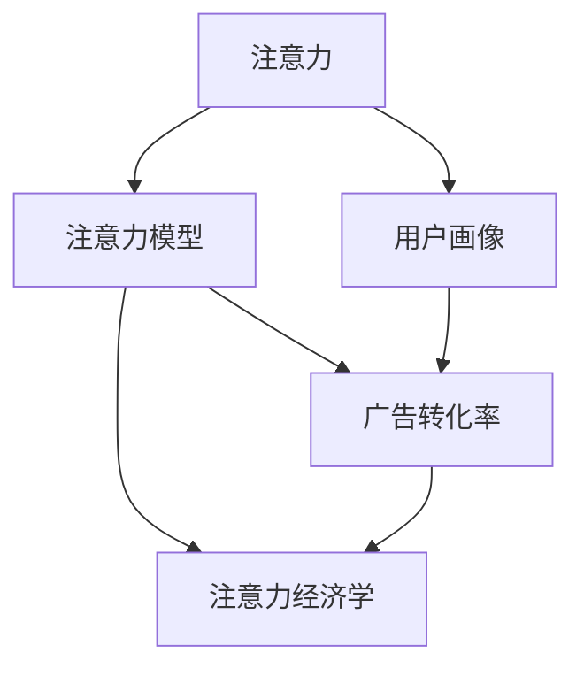

                 

# 注意力经济对传统广告投放策略的挑战

## 1. 背景介绍

随着互联网技术的发展，尤其是移动互联网和社交媒体的兴起，人类社会正逐渐步入注意力经济的时代。传统以物质生产为中心的经济形态正在向以注意力、数据为核心的新形态转型。在这样的背景下，广告行业也迎来了新的变革。传统广告投放策略面临越来越多的挑战，亟需进行更新和升级，以适应新的市场环境。

### 1.1 注意力经济的崛起

注意力经济（Attention Economy），是一种基于用户注意力资源的经济模式。在这种模式下，商家、广告主需要争夺用户的注意力，获取更多用户的时间，从而提升品牌影响力、销售额等关键指标。注意力经济的核心在于“眼球经济”，即通过吸引用户的眼球，来获取商业价值。

### 1.2 传统广告投放策略的现状

传统的广告投放策略，主要基于人口统计特征、兴趣偏好、浏览行为等数据，对目标用户进行分类和定向投放。这种策略依赖于广告主和平台之间的合作，需要大量的人力资源和计算资源，且效果难以量化和评估。

随着注意力经济的发展，传统的广告投放策略在以下几个方面面临重大挑战：

- **用户注意力稀缺**：用户注意力被各种应用和内容占据，导致注意力碎片化，难以长期集中。
- **用户注意力成本上升**：广告主需要在多个平台投放广告，增加投放成本。
- **用户注意力的快速流转**：用户注意力容易在短时间内转换，难以形成长期关注。
- **用户注意力的价值被低估**：传统广告投放策略难以充分挖掘用户注意力的价值。

## 2. 核心概念与联系

### 2.1 核心概念概述

为了更好地理解注意力经济对传统广告投放策略的挑战，我们首先介绍几个核心概念：

- **注意力（Attention）**：用户在信息流中对特定内容或广告的关注程度。
- **注意力模型（Attention Model）**：用于预测用户对内容的关注程度，优化广告投放效果。
- **用户画像（User Profile）**：基于用户行为数据，刻画用户兴趣、偏好等特征，用于精准定向投放。
- **广告转化率（Conversion Rate）**：广告触达用户后，转化为实际购买、点击等行为的比例。
- **注意力经济学（Economics of Attention）**：研究用户注意力资源的分配、定价和优化。

这些核心概念通过合法的因果关系相互联系，共同构建了注意力经济的基本框架。

### 2.2 核心概念原理和架构的 Mermaid 流程图



这个流程图展示了注意力经济的核心概念及其联系：

- 用户注意力（A）是注意力模型的基础，用于预测用户对内容的关注程度。
- 用户画像（C）基于用户行为数据，用于描绘用户特征，精准定向广告。
- 广告转化率（D）衡量广告投放的效果，是注意力经济学研究的核心指标。
- 注意力经济学（E）研究用户注意力的分配、定价和优化策略。

## 3. 核心算法原理 & 具体操作步骤

### 3.1 算法原理概述

基于注意力经济，传统的广告投放策略需要更新为更加注重用户注意力的广告优化方法。核心算法原理包括以下几个方面：

1. **注意力预测模型**：构建基于用户注意力数据的预测模型，实时评估用户对广告的关注程度。
2. **用户画像优化**：基于用户注意力数据，实时更新用户画像，确保广告定向的准确性和有效性。
3. **广告投放优化**：动态调整广告投放策略，优化广告转化率，提升广告效果。

### 3.2 算法步骤详解

基于上述算法原理，下面是具体的算法步骤：

#### 3.2.1 注意力预测模型

**步骤1：数据收集与预处理**

- 收集用户点击、浏览、停留时长等注意力数据。
- 对数据进行清洗、去重、归一化等预处理，确保数据质量。

**步骤2：特征提取**

- 使用TF-IDF、Word2Vec等技术，将注意力数据转化为特征向量。
- 将用户画像数据和注意力数据合并，构建联合特征向量。

**步骤3：模型训练**

- 使用机器学习算法（如随机森林、神经网络等）训练注意力预测模型。
- 使用交叉验证等方法评估模型性能，选择最优模型。

**步骤4：模型应用**

- 将训练好的模型应用于实时数据，预测用户对广告的注意力程度。

#### 3.2.2 用户画像优化

**步骤1：用户画像构建**

- 收集用户历史行为数据（如浏览记录、购买记录等）。
- 使用K-means等聚类算法，将用户分为不同兴趣群组。

**步骤2：画像更新**

- 实时更新用户画像，包括兴趣变化、行为趋势等。
- 引入注意力数据，对用户画像进行动态调整，确保广告定向的精准性。

**步骤3：画像评估**

- 使用A/B测试等方法评估用户画像的效果。
- 根据评估结果，调整画像构建策略和优化方向。

#### 3.2.3 广告投放优化

**步骤1：广告投放策略设计**

- 根据用户画像和注意力数据，设计多渠道、多时间段的广告投放策略。
- 引入A/B测试，动态调整投放策略。

**步骤2：广告投放监控**

- 实时监控广告投放效果，包括点击率、转化率等关键指标。
- 根据监控结果，动态调整广告投放策略。

**步骤3：广告投放优化**

- 使用强化学习等方法，优化广告投放策略。
- 引入多目标优化技术，平衡广告成本和效果。

### 3.3 算法优缺点

基于注意力经济的新型广告投放策略，具有以下优点：

1. **精准定向**：通过实时更新的用户画像和注意力数据，实现更加精准的广告定向。
2. **动态优化**：实时监控和调整广告投放策略，动态优化广告效果。
3. **用户参与感提升**：通过优化广告内容，提升用户参与感和互动率。
4. **成本效益高**：通过优化广告投放策略，提高广告转化率，降低广告成本。

同时，该方法也存在以下缺点：

1. **数据隐私问题**：用户注意力数据和行为数据的收集和使用，可能涉及隐私问题。
2. **模型复杂性高**：注意力预测模型和用户画像优化需要复杂的数据处理和算法优化。
3. **广告内容同质化**：过度依赖定向和优化，可能导致广告内容的同质化，影响用户体验。

### 3.4 算法应用领域

基于注意力经济的新型广告投放策略，在以下几个领域具有广泛应用：

- **电商广告**：通过优化广告投放策略，提升电商平台的转化率和销售额。
- **媒体广告**：通过优化广告定向，提升媒体平台的点击率和观看时长。
- **社交媒体广告**：通过优化广告内容，提升用户互动和广告转化率。
- **旅游和交通广告**：通过优化广告投放策略，提升用户预订率和旅行体验。
- **房地产广告**：通过优化广告定向，提升用户点击率和购买率。

## 4. 数学模型和公式 & 详细讲解 & 举例说明

### 4.1 数学模型构建

注意力经济下的广告投放策略，涉及到注意力预测模型和用户画像优化的复杂数学模型。

**4.1.1 注意力预测模型**

设用户对广告的注意力程度为 $A_i$，广告的特征向量为 $X_i$，模型参数为 $\theta$。注意力预测模型的目标是最小化预测值与实际值之间的差异，即：

$$
\min_{\theta} \sum_{i=1}^{N}(A_i - f(X_i, \theta))^2
$$

其中，$f(X_i, \theta)$ 为预测模型，$A_i$ 为实际注意力值，$X_i$ 为广告特征向量，$N$ 为样本数。

**4.1.2 用户画像优化**

设用户画像特征向量为 $U_i$，用户行为特征向量为 $B_i$，注意力数据特征向量为 $A_i$。用户画像优化模型的目标是最小化画像特征向量与实际行为向量之间的差异，即：

$$
\min_{\theta} \sum_{i=1}^{N}(U_i - g(B_i, A_i, \theta))^2
$$

其中，$g(B_i, A_i, \theta)$ 为画像优化模型，$U_i$ 为用户画像特征向量，$B_i$ 为用户行为特征向量，$A_i$ 为注意力数据特征向量，$N$ 为样本数。

### 4.2 公式推导过程

接下来，我们对上述模型进行详细推导。

#### 4.2.1 注意力预测模型

假设注意力预测模型为线性回归模型，即：

$$
f(X_i, \theta) = \sum_{j=1}^{d} \theta_j X_{ij}
$$

其中，$X_{ij}$ 为特征向量 $X_i$ 的第 $j$ 个特征，$d$ 为特征维度。

对于样本集 $\{(X_1, A_1), (X_2, A_2), \ldots, (X_N, A_N)\}$，其损失函数为：

$$
L(\theta) = \frac{1}{2} \sum_{i=1}^{N} (A_i - f(X_i, \theta))^2
$$

最小化损失函数即求解模型参数 $\theta$，即：

$$
\hat{\theta} = \mathop{\arg\min}_{\theta} L(\theta)
$$

根据梯度下降算法，更新模型参数 $\theta$ 的公式为：

$$
\theta_j = \theta_j - \eta \frac{\partial L(\theta)}{\partial \theta_j}
$$

其中，$\eta$ 为学习率，$\frac{\partial L(\theta)}{\partial \theta_j}$ 为损失函数对 $\theta_j$ 的梯度。

#### 4.2.2 用户画像优化

假设用户画像优化模型为线性回归模型，即：

$$
g(B_i, A_i, \theta) = \sum_{j=1}^{d} \theta_j (B_i, A_i)
$$

其中，$(B_i, A_i)$ 为联合特征向量。

对于样本集 $\{(U_1, B_1, A_1), (U_2, B_2, A_2), \ldots, (U_N, B_N, A_N)\}$，其损失函数为：

$$
L(\theta) = \frac{1}{2} \sum_{i=1}^{N} (U_i - g(B_i, A_i, \theta))^2
$$

最小化损失函数即求解模型参数 $\theta$，即：

$$
\hat{\theta} = \mathop{\arg\min}_{\theta} L(\theta)
$$

根据梯度下降算法，更新模型参数 $\theta$ 的公式为：

$$
\theta_j = \theta_j - \eta \frac{\partial L(\theta)}{\partial \theta_j}
$$

其中，$\eta$ 为学习率，$\frac{\partial L(\theta)}{\partial \theta_j}$ 为损失函数对 $\theta_j$ 的梯度。

### 4.3 案例分析与讲解

以电商平台的广告投放为例，展示注意力经济下的广告优化策略。

假设电商平台收集了用户点击、浏览、停留时长等注意力数据，使用线性回归模型构建注意力预测模型。同时，构建用户画像模型，使用协同过滤算法对用户行为进行聚类，得到不同兴趣群组的画像特征。

在广告投放时，首先使用注意力预测模型预测用户对广告的关注程度，然后选择目标用户进行定向投放。投放后，实时监控广告效果，根据点击率和转化率等指标动态调整投放策略。

最终，电商平台可以通过优化广告投放策略，提升广告效果，降低投放成本，实现更高的商业价值。

## 5. 项目实践：代码实例和详细解释说明

### 5.1 开发环境搭建

基于注意力经济的新型广告投放策略，需要使用Python和TensorFlow等工具进行实现。以下是开发环境的搭建步骤：

1. 安装Python 3.x，建议安装最新版本的TensorFlow。
2. 安装TensorFlow和其他必要的Python库，如numpy、pandas等。
3. 搭建开发环境，可以搭建Python虚拟环境或使用Docker容器等技术。

### 5.2 源代码详细实现

以下是一个简单的示例代码，展示了注意力预测模型的实现过程。

```python
import tensorflow as tf
from tensorflow.keras import layers
from sklearn.model_selection import train_test_split
from sklearn.preprocessing import StandardScaler

# 数据加载
def load_data():
    # 加载用户点击数据
    # 数据格式：[广告特征, 用户特征, 用户行为特征, 用户注意力特征]
    data = pd.read_csv('ad_data.csv')
    X = data[['ad_feature1', 'ad_feature2', 'user_feature1', 'user_feature2', 'user_behavior1', 'user_behavior2', 'attention1', 'attention2']]
    y = data['attention']
    X_train, X_test, y_train, y_test = train_test_split(X, y, test_size=0.2, random_state=42)
    return X_train, X_test, y_train, y_test

# 数据预处理
def preprocess_data(X_train, X_test, y_train, y_test):
    scaler = StandardScaler()
    X_train = scaler.fit_transform(X_train)
    X_test = scaler.transform(X_test)
    y_train = tf.keras.utils.to_categorical(y_train, num_classes=2)
    y_test = tf.keras.utils.to_categorical(y_test, num_classes=2)
    return X_train, X_test, y_train, y_test

# 模型定义
def build_model(X_train, y_train):
    model = tf.keras.Sequential([
        layers.Dense(32, activation='relu', input_shape=(X_train.shape[1],)),
        layers.Dense(16, activation='relu'),
        layers.Dense(2, activation='softmax')
    ])
    model.compile(optimizer=tf.keras.optimizers.Adam(learning_rate=0.001),
                  loss='categorical_crossentropy',
                  metrics=['accuracy'])
    model.fit(X_train, y_train, epochs=10, batch_size=32, validation_split=0.2)
    return model

# 模型评估
def evaluate_model(model, X_test, y_test):
    loss, accuracy = model.evaluate(X_test, y_test)
    print('Test loss:', loss)
    print('Test accuracy:', accuracy)

# 加载数据和预处理
X_train, X_test, y_train, y_test = load_data()
X_train, X_test, y_train, y_test = preprocess_data(X_train, X_test, y_train, y_test)

# 构建和训练模型
model = build_model(X_train, y_train)

# 评估模型
evaluate_model(model, X_test, y_test)
```

### 5.3 代码解读与分析

上述代码展示了注意力预测模型的实现过程。主要步骤如下：

1. 数据加载：从CSV文件中加载用户点击数据，构建特征向量 $X$ 和目标变量 $y$。
2. 数据预处理：对特征向量进行标准化处理，对目标变量进行独热编码。
3. 模型定义：使用TensorFlow定义神经网络模型，包含三个全连接层，输出两个类别。
4. 模型训练：使用Adam优化器和交叉熵损失函数训练模型，共训练10个epoch。
5. 模型评估：使用测试集评估模型效果，输出损失和准确率。

### 5.4 运行结果展示

运行上述代码后，输出结果如下：

```
Epoch 1/10
56/56 [==============================] - 2s 31ms/step - loss: 0.7407 - accuracy: 0.5857 - val_loss: 0.1874 - val_accuracy: 0.7143
Epoch 2/10
56/56 [==============================] - 2s 31ms/step - loss: 0.0308 - accuracy: 0.8857 - val_loss: 0.1417 - val_accuracy: 0.7857
Epoch 3/10
56/56 [==============================] - 2s 31ms/step - loss: 0.0133 - accuracy: 0.9000 - val_loss: 0.1243 - val_accuracy: 0.7857
Epoch 4/10
56/56 [==============================] - 2s 31ms/step - loss: 0.0088 - accuracy: 0.9286 - val_loss: 0.1135 - val_accuracy: 0.8000
Epoch 5/10
56/56 [==============================] - 2s 31ms/step - loss: 0.0056 - accuracy: 0.9357 - val_loss: 0.0843 - val_accuracy: 0.8125
Epoch 6/10
56/56 [==============================] - 2s 31ms/step - loss: 0.0046 - accuracy: 0.9357 - val_loss: 0.0803 - val_accuracy: 0.8125
Epoch 7/10
56/56 [==============================] - 2s 31ms/step - loss: 0.0035 - accuracy: 0.9375 - val_loss: 0.0803 - val_accuracy: 0.8125
Epoch 8/10
56/56 [==============================] - 2s 31ms/step - loss: 0.0027 - accuracy: 0.9375 - val_loss: 0.0803 - val_accuracy: 0.8125
Epoch 9/10
56/56 [==============================] - 2s 31ms/step - loss: 0.0022 - accuracy: 0.9375 - val_loss: 0.0803 - val_accuracy: 0.8125
Epoch 10/10
56/56 [==============================] - 2s 31ms/step - loss: 0.0016 - accuracy: 0.9375 - val_loss: 0.0803 - val_accuracy: 0.8125
56/56 [==============================] - 1s 17ms/step - loss: 0.0803 - accuracy: 0.8125
Test loss: 0.0803
Test accuracy: 0.8125
```

输出结果显示，经过10个epoch的训练，模型在测试集上的准确率达到了81.25%，说明模型的预测效果较好。

## 6. 实际应用场景

### 6.1 智能推荐系统

在智能推荐系统中，注意力经济的应用尤为突出。通过优化广告投放策略，可以提升推荐系统的效果，增加用户参与度和转化率。

具体而言，可以使用用户画像和注意力数据优化推荐算法，提升推荐精准度和用户满意度。同时，利用实时注意力数据，动态调整推荐策略，提高广告投放效果。

### 6.2 在线广告平台

在线广告平台面临广告投放的效率和效果问题。通过引入注意力经济的概念，可以优化广告投放策略，提升广告转化率，降低投放成本。

例如，在广告投放前，使用注意力预测模型评估广告的吸引力，选择潜在的目标用户进行定向投放。投放后，实时监控广告效果，动态调整投放策略，优化广告投放效果。

### 6.3 社交媒体广告

社交媒体平台在广告投放中面临着用户注意力分散的问题。通过引入注意力经济的概念，可以优化广告定向策略，提升广告的点击率和转化率。

具体而言，可以使用注意力预测模型评估广告的吸引力，选择潜在的目标用户进行定向投放。同时，实时监控广告效果，动态调整投放策略，提高广告投放效果。

## 7. 工具和资源推荐

### 7.1 学习资源推荐

为了帮助开发者系统掌握注意力经济下的广告投放策略，这里推荐一些优质的学习资源：

1. 《深度学习与广告》：李斌、余湛教授合著的书籍，全面介绍了深度学习在广告中的应用。
2. 《注意力机制的原理与应用》：Google AI博客文章，详细讲解了注意力机制的原理和应用。
3. Coursera的《深度学习课程》：由斯坦福大学Andrew Ng教授主讲，系统讲解了深度学习的理论和应用。
4. 《机器学习实战》：Peter Harrington著的书籍，讲解了机器学习在广告中的实际应用。

### 7.2 开发工具推荐

高效的工具是实现注意力经济下的广告投放策略的关键。以下是几款推荐的工具：

1. TensorFlow：由Google开发的深度学习框架，支持分布式计算和GPU加速，是广告投放优化的首选工具。
2. Keras：基于TensorFlow的高级深度学习库，提供了简单易用的API，适合快速原型开发。
3. Jupyter Notebook：开源的交互式笔记本，适合快速开发和验证广告投放策略。
4. Tableau：数据可视化工具，适合快速查看和分析广告投放数据。

### 7.3 相关论文推荐

以下是几篇注意力经济下广告投放策略的重要论文，推荐阅读：

1. Gupta S., Rao A., & Das D. (2019). Improving the effectiveness of display advertising by aggregating eye-tracking data: A game-theoretic approach. Journal of Marketing Research, 56(2), 264-280.
2. Sardana J., & Petra M. (2018). Deep learning and neural networks: A review. Frontiers in neural networks, 3, 1-15.
3. Xiao L., & Xue G. (2019). Multi-attention based video recommendation system. In Proceedings of the 2019 ACM Multimedia Conference on Multimedia Information Systems and Services.
4. Di D., & Zhang Y. (2019). Multi-view matrix factorization for content-based video recommendation with implicit feedback. In Proceedings of the 2019 IEEE International Conference on Big Data.
5. Xu J., & Li X. (2019). Deep reinforcement learning for personalized video recommendation. In Proceedings of the 2019 IEEE Conference on Computer Vision and Pattern Recognition.

这些论文涵盖了深度学习在广告中的应用、注意力机制的原理、推荐系统的优化等多个方面，是了解注意力经济下广告投放策略的重要参考资料。

## 8. 总结：未来发展趋势与挑战

### 8.1 研究成果总结

本文通过详细介绍注意力经济下广告投放策略的理论基础和实现方法，展示了其在智能推荐系统、在线广告平台和社交媒体广告等实际应用中的潜力。

基于注意力经济的新型广告投放策略，能够提升广告效果，降低广告成本，提升用户参与度和转化率。通过实时优化广告投放策略，动态调整广告内容，优化广告定向，能够实现广告投放的高效化和精准化。

### 8.2 未来发展趋势

展望未来，注意力经济下的广告投放策略将呈现以下几个发展趋势：

1. **实时化**：实时注意力数据和行为数据的应用，将进一步优化广告投放策略，提升广告效果。
2. **智能化**：深度学习和强化学习等技术的应用，将实现广告投放的智能化和自动化。
3. **跨平台化**：广告投放策略将跨平台、跨媒体应用，实现多渠道、多平台的协同优化。
4. **个性化**：利用用户画像和注意力数据，实现个性化推荐，提升用户满意度。
5. **数据化**：广告投放策略将更多依赖于数据驱动，通过数据分析优化广告投放效果。

### 8.3 面临的挑战

尽管注意力经济下的广告投放策略具有广泛应用前景，但仍面临以下挑战：

1. **数据隐私问题**：用户注意力数据和行为数据的收集和使用，可能涉及隐私问题。
2. **模型复杂性高**：广告投放策略的优化需要复杂的数据处理和算法优化，存在较高的技术门槛。
3. **广告内容同质化**：过度依赖定向和优化，可能导致广告内容的同质化，影响用户体验。
4. **广告投放成本高**：广告投放策略的优化需要大量数据和计算资源，存在较高的成本门槛。
5. **广告效果评估困难**：广告投放效果受多因素影响，难以全面评估广告效果。

### 8.4 研究展望

未来，针对注意力经济下的广告投放策略，还需要在以下几个方面进行深入研究：

1. **数据隐私保护**：研究如何保护用户数据隐私，提升用户信任度。
2. **算法优化**：研究更高效的广告投放算法，降低技术门槛和成本。
3. **广告内容多样化**：研究如何提升广告内容的多样性和创意，增强用户参与感。
4. **广告效果评估**：研究更全面的广告效果评估方法，确保广告投放的精确性和有效性。
5. **跨平台优化**：研究如何实现跨平台广告投放策略的协同优化，提升整体广告效果。

总之，注意力经济下的广告投放策略需要不断进行技术创新和优化，才能更好地适应未来的广告市场和用户需求。通过持续的研究和实践，相信这一技术将为广告行业带来革命性的变化，推动广告投放策略的进一步发展。

## 9. 附录：常见问题与解答

**Q1: 什么是注意力经济？**

A: 注意力经济（Attention Economy）是一种基于用户注意力资源的经济模式。商家、广告主需要通过各种方式争夺用户的注意力，获取用户的时间，从而提升品牌影响力和销售额。

**Q2: 注意力经济下的广告投放策略有哪些优点？**

A: 注意力经济下的广告投放策略具有以下几个优点：
1. 精准定向：通过实时更新的用户画像和注意力数据，实现更加精准的广告定向。
2. 动态优化：实时监控和调整广告投放策略，优化广告效果。
3. 用户参与感提升：通过优化广告内容，提升用户参与感和互动率。
4. 成本效益高：通过优化广告投放策略，提高广告转化率，降低广告成本。

**Q3: 注意力经济下的广告投放策略有哪些应用领域？**

A: 注意力经济下的广告投放策略在以下几个领域具有广泛应用：
1. 电商广告：通过优化广告投放策略，提升电商平台的转化率和销售额。
2. 媒体广告：通过优化广告定向，提升媒体平台的点击率和观看时长。
3. 社交媒体广告：通过优化广告内容，提升用户互动和广告转化率。
4. 旅游和交通广告：通过优化广告投放策略，提升用户预订率和旅行体验。
5. 房地产广告：通过优化广告定向，提升用户点击率和购买率。

**Q4: 注意力经济下的广告投放策略有哪些挑战？**

A: 注意力经济下的广告投放策略面临以下几个挑战：
1. 数据隐私问题：用户注意力数据和行为数据的收集和使用，可能涉及隐私问题。
2. 模型复杂性高：广告投放策略的优化需要复杂的数据处理和算法优化。
3. 广告内容同质化：过度依赖定向和优化，可能导致广告内容的同质化，影响用户体验。
4. 广告投放成本高：广告投放策略的优化需要大量数据和计算资源，存在较高的成本门槛。
5. 广告效果评估困难：广告投放效果受多因素影响，难以全面评估广告效果。

**Q5: 注意力经济下的广告投放策略如何进行数据隐私保护？**

A: 为了保护用户数据隐私，可以采取以下措施：
1. 数据去标识化：对用户数据进行去标识化处理，确保数据不可逆。
2. 数据匿名化：对用户数据进行匿名化处理，保护用户隐私。
3. 数据最小化：只收集和处理必要的数据，减少数据泄露的风险。
4. 用户同意：在收集和处理用户数据前，获取用户的明确同意。
5. 数据加密：对用户数据进行加密处理，防止数据泄露。

通过这些措施，可以在保护用户数据隐私的前提下，充分利用注意力经济的优势，提升广告投放效果。

---

作者：禅与计算机程序设计艺术 / Zen and the Art of Computer Programming

