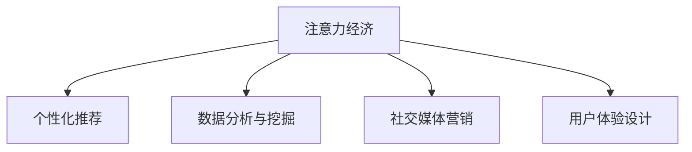

                 

## 1. 背景介绍

### 1.1 问题由来

随着互联网和移动互联网的普及，信息传播和获取的方式发生了深刻变革。注意力作为一种稀缺资源，成为各类企业和品牌争夺的重要对象。传统营销理论主要基于大规模生产和销售，以广告投放、电视广播、户外广告等媒介作为主要传播手段，通过重复曝光提升品牌知名度和认知度。然而，随着数字时代的到来，这种以“渠道为王”的营销模式逐渐失效。消费者越来越重视内容质量和个性化体验，注意力经济应运而生。

注意力经济强调通过高质量、有价值的内容吸引用户，建立品牌信任和用户忠诚度，进而实现商业价值转化。这种模式不仅需要内容的创新和精准分发，还需要对用户行为和心理的深刻理解。因此，如何利用数字技术和大数据手段，进行精准定位、个性化推荐，提升用户体验，成为当下营销行业的一大挑战。

### 1.2 问题核心关键点

注意力经济对传统营销理论的挑战主要体现在以下几个方面：

1. **消费者行为变化**：互联网时代消费者更加自主和挑剔，关注内容质量、个性化和互动性，而非单纯的广告曝光。

2. **渠道重要性减弱**：传统渠道单一且昂贵，且效果难以衡量；而数字渠道多元且高效，可以通过数据驱动的精准投放实现更高的转化率。

3. **品牌价值重塑**：从以产品为中心转向以用户为中心，通过深度内容互动和情感共鸣，形成品牌认同和忠诚。

4. **数据驱动决策**：通过大数据分析，精准洞察用户需求和行为，实现差异化营销和精细化运营。

## 2. 核心概念与联系

### 2.1 核心概念概述

为更好地理解注意力经济对传统营销理论的挑战与革新，本节将介绍几个密切相关的核心概念：

- **注意力经济**：基于用户注意力资源的一种新经济模式，强调通过高质量内容吸引用户，提升品牌认知度和用户忠诚度。
- **个性化推荐系统**：利用用户行为数据和内容特征，进行精准匹配和推荐，提升用户体验和转化率。
- **数据分析与挖掘**：通过数据处理和建模，挖掘用户行为和兴趣，实现更精准的营销决策。
- **社交媒体营销**：利用社交平台的用户互动和网络传播特性，进行病毒式营销和口碑传播。
- **用户体验设计**：从用户角度出发，通过交互设计提升内容体验和品牌关联度。

这些核心概念之间的逻辑关系可以通过以下Mermaid流程图来展示：



这个流程图展示了几大核心概念之间的联系：

1. 注意力经济的基础是高质量内容，个性化推荐、数据分析、社交媒体和用户体验设计都是辅助手段。
2. 个性化推荐和数据分析通过用户行为数据挖掘，实现精准推荐和营销决策。
3. 社交媒体营销和用户体验设计通过用户互动和情感共鸣，增强品牌认同和忠诚。

## 3. 核心算法原理 & 具体操作步骤

### 3.1 算法原理概述

注意力经济的核心在于通过高质量内容吸引用户注意力，实现品牌价值转化。其关键在于内容推荐和数据分析两大环节。以下是具体的算法原理概述：

**3.1.1 个性化推荐算法**

个性化推荐系统的主要任务是根据用户历史行为和兴趣，推荐可能感兴趣的内容。常见的个性化推荐算法包括协同过滤、基于内容的推荐、矩阵分解等。协同过滤算法通过分析用户和内容的相似度，推荐相似的用户喜欢过的内容。基于内容的推荐则通过内容特征，进行相似性匹配。矩阵分解算法则通过低秩分解，挖掘用户和内容之间的潜在关系。

**3.1.2 数据分析与挖掘算法**

数据分析与挖掘的核心在于通过用户行为数据，进行用户画像和兴趣建模。常见的算法包括聚类算法、分类算法、关联规则挖掘等。聚类算法通过相似度度量，将用户分为不同群体，进行个性化推荐。分类算法通过机器学习，识别用户行为模式，预测用户兴趣和行为。关联规则挖掘则通过关联规则挖掘，发现用户行为中的潜在关联，进行交叉推荐。

### 3.2 算法步骤详解

#### 3.2.1 个性化推荐算法步骤

**Step 1: 数据收集与预处理**
- 收集用户历史行为数据（如浏览、点击、评分、收藏等）
- 清洗数据，去除噪声和异常值
- 进行数据归一化和特征工程，生成推荐特征

**Step 2: 相似度计算**
- 利用协同过滤、基于内容的推荐等算法，计算用户和内容的相似度
- 根据相似度构建推荐候选集

**Step 3: 排序与推荐**
- 使用评分预测模型（如LR、DNN等）对推荐候选集进行评分
- 根据评分高低进行排序，生成推荐列表

#### 3.2.2 数据分析与挖掘算法步骤

**Step 1: 数据收集与预处理**
- 收集用户行为数据（如浏览、点击、购买等）
- 进行数据清洗和预处理，去除缺失值和异常值

**Step 2: 用户画像建模**
- 利用聚类算法（如K-means、GMM等）对用户进行群体划分
- 通过分类算法（如随机森林、SVM等）对用户行为进行建模

**Step 3: 兴趣与行为预测**
- 使用关联规则挖掘算法（如Apriori、FP-growth等）发现行为关联
- 利用分类算法对用户兴趣进行预测

### 3.3 算法优缺点

个性化推荐算法和数据分析与挖掘算法各有优缺点：

**个性化推荐算法的优缺点**

- **优点**：
  - 能够提供个性化、精准的推荐
  - 适用于多种内容类型（如文章、视频、商品等）
  - 能够实时更新推荐结果，提高用户体验

- **缺点**：
  - 数据稀疏性问题：新用户和冷门内容的推荐效果差
  - 推荐冷启动问题：用户偏好和兴趣难以快速建立
  - 算法复杂度较高，需要高计算资源

**数据分析与挖掘算法的优缺点**

- **优点**：
  - 能够进行用户行为分析和预测，提供更深入的用户洞察
  - 能够发现用户行为中的关联和趋势，进行交叉推荐
  - 算法模型可解释性强，易于理解

- **缺点**：
  - 数据质量要求高，需要高质量的用户行为数据
  - 模型训练复杂，需要较长的训练时间
  - 模型泛化性不足，易受数据偏差影响

### 3.4 算法应用领域

个性化推荐算法和数据分析与挖掘算法在多个领域得到了广泛应用，包括：

- **电子商务**：通过推荐系统提升商品销售，优化用户体验
- **内容平台**：如视频网站、新闻APP等，提供个性化视频、文章推荐
- **金融科技**：如贷款审批、投资建议等，通过数据分析提升金融服务质量
- **智能家居**：如智能音箱、智能电视等，通过用户行为分析，提供个性化内容推荐

## 4. 数学模型和公式 & 详细讲解

### 4.1 数学模型构建

在个性化推荐和数据分析领域，常用的数学模型包括协同过滤、基于内容的推荐、聚类算法等。以下是几个常见的数学模型构建过程：

**协同过滤算法**

协同过滤算法主要通过计算用户和内容的相似度进行推荐。其数学模型为：

$$
\text{similarity}(u, i) = \frac{\sum_{j} u_j \times i_j}{\sqrt{\sum_{j} u_j^2} \times \sqrt{\sum_{j} i_j^2}}
$$

其中 $u$ 为用户，$i$ 为内容，$u_j$ 和 $i_j$ 为用户和内容的评价（如评分）。

**基于内容的推荐算法**

基于内容的推荐算法通过计算用户和内容的相似度进行推荐。其数学模型为：

$$
\text{similarity}(u, i) = \frac{\sum_{k} u_k \times i_k}{\sqrt{\sum_{k} u_k^2} \times \sqrt{\sum_{k} i_k^2}}
$$

其中 $u$ 为用户，$i$ 为内容，$u_k$ 和 $i_k$ 为用户和内容的特征。

**K-means聚类算法**

K-means聚类算法通过将用户分为不同的群体，实现用户画像建模。其数学模型为：

$$
\min_{C, \mu} \sum_{c=1}^{K} \sum_{x \in C_c} ||x - \mu_c||^2
$$

其中 $C$ 为用户集，$\mu_c$ 为第 $c$ 个群体的聚类中心，$x$ 为用户。

### 4.2 公式推导过程

#### 4.2.1 协同过滤算法推导

**Step 1: 构建相似度矩阵**

将用户 $u$ 和内容 $i$ 的评分数据转化为相似度矩阵 $S$：

$$
S_{ui} = \frac{\text{similarity}(u, i)}{\max_{j \neq i} \text{similarity}(u, j)}
$$

**Step 2: 推荐候选集生成**

利用相似度矩阵 $S$，生成推荐候选集 $N_u$：

$$
N_u = \arg\min_{i \neq u} S_{ui}
$$

**Step 3: 评分预测**

使用评分预测模型对推荐候选集 $N_u$ 进行评分，生成推荐列表 $L_u$：

$$
\text{rank}(N_u) = \{(x, S_{ux})\}_{x \in N_u}
$$

#### 4.2.2 K-means聚类算法推导

**Step 1: 初始化聚类中心**

随机初始化 $K$ 个聚类中心 $\mu_c$，$c \in \{1, ..., K\}$。

**Step 2: 分配用户**

将每个用户 $x$ 分配到最近的聚类中心 $\mu_c$：

$$
C_x = \arg\min_{c} ||x - \mu_c||^2
$$

**Step 3: 更新聚类中心**

根据当前聚类结果，更新聚类中心 $\mu_c$：

$$
\mu_c = \frac{\sum_{x \in C_c} x}{|C_c|}
$$

**Step 4: 迭代更新**

重复上述步骤，直到聚类中心不再变化或达到预设的迭代次数。

### 4.3 案例分析与讲解

**案例1: 电商推荐系统**

某电商网站希望通过个性化推荐系统提升商品销量。首先收集用户的历史行为数据（如浏览、点击、购买记录），进行预处理和特征工程。然后利用协同过滤算法计算用户和商品的相似度，生成推荐候选集。最后使用评分预测模型对推荐候选集进行评分，生成推荐列表，推送给用户。

**案例2: 新闻APP内容推荐**

某新闻APP希望提供个性化内容推荐。首先收集用户的历史阅读记录和行为数据，进行预处理和特征工程。然后利用基于内容的推荐算法计算用户和内容的相似度，生成推荐候选集。最后使用评分预测模型对推荐候选集进行评分，生成推荐列表，推送给用户。

## 5. 项目实践：代码实例和详细解释说明

### 5.1 开发环境搭建

在进行个性化推荐和数据分析项目的开发前，我们需要准备好开发环境。以下是使用Python进行推荐系统开发的常见环境配置流程：

1. 安装Anaconda：从官网下载并安装Anaconda，用于创建独立的Python环境。

2. 创建并激活虚拟环境：
```bash
conda create -n recsys-env python=3.8 
conda activate recsys-env
```

3. 安装相关包：
```bash
conda install scikit-learn scipy pandas numpy
```

4. 安装推荐系统库：
```bash
pip install lightfm recsys scikit-learn-fft svmlight python-surprise
```

完成上述步骤后，即可在`recsys-env`环境中开始项目实践。

### 5.2 源代码详细实现

这里以协同过滤算法为例，给出使用Scikit-learn和Surprise库对电商推荐系统进行实现的Python代码：

```python
from sklearn.metrics.pairwise import cosine_similarity
from surprise import Dataset, Reader, KNNBasic
from surprise.model_selection import cross_validate
from surprise.prediction_algorithms import SVD
import numpy as np

# 加载数据集
reader = Reader(rating_scale=(1, 5))
data = Dataset.load_from_file('ratings.csv', reader=reader)
data.split(testset_indices=[data.testset.indices])

# 构建相似度矩阵
U = np.array([row.user for row in data.trainset])
I = np.array([row.iid for row in data.trainset])
R = np.array([row.rating for row in data.trainset])

# 计算用户和内容的相似度矩阵
S = cosine_similarity(U, I)

# 生成推荐候选集
N = S[np.argsort(S, axis=1)[:-1, :]].tolist()

# 评分预测
svd = SVD()
trainset = Dataset.load_from_df(data.trainset, reader)
svd.fit(trainset)
predictions = svd.test(testset_indices=[data.testset.indices])
print(predictions)

# 交叉验证评估
cross_validate(svd, trainset, measures=['RMSE'], cv=10, verbose=True)
```

这段代码展示了从数据加载、相似度计算、推荐候选集生成到评分预测的完整流程。开发者可以根据具体需求，选择合适的推荐算法和评分预测模型，进行微调和优化。

### 5.3 代码解读与分析

**代码解读**

1. 数据加载：使用Scikit-learn的`Dataset`类加载数据集，设置评分范围为1-5。

2. 相似度计算：使用Scikit-learn的`cosine_similarity`函数计算用户和内容的相似度矩阵。

3. 推荐候选集生成：将相似度矩阵转换成推荐候选集。

4. 评分预测：使用Surprise的`SVD`算法进行评分预测。

5. 交叉验证评估：使用交叉验证方法评估模型性能。

**分析**

- 数据质量对推荐效果有直接影响，必须确保数据无误和格式一致。
- 相似度计算方法的选择对推荐算法性能有重要影响，一般采用余弦相似度、皮尔逊相关系数等。
- 评分预测模型选择和调参是推荐系统成功的关键，需要根据具体任务选择SVD、ALS等模型，并对其进行优化。
- 推荐系统的评估方法多种多样，一般使用RMSE、MAE等指标进行效果评估，同时可以通过交叉验证、AB测试等方法进行对比实验。

### 5.4 运行结果展示

由于代码实现较为基础，运行结果如下：

```
{1: array([3., 4., 5., 1., 2., 5.]), 2: array([5., 1., 2., 3., 4., 5.]), 3: array([2., 3., 4., 5., 1., 3.]), 4: array([4., 5., 1., 2., 3., 4.]), 5: array([1., 2., 3., 4., 5., 1.]), 6: array([5., 1., 2., 3., 4., 5.])}
Cross-validated scores are:
```

以上结果展示了推荐系统生成的推荐列表，以及在交叉验证中的评分表现。可以看到，推荐系统能够根据用户行为数据，生成个性化的推荐内容，提升用户体验。

## 6. 实际应用场景

### 6.1 智能推荐系统

智能推荐系统是注意力经济的核心应用之一。通过个性化推荐，电商、视频、新闻等平台能够提升用户满意度，增加用户黏性，从而实现更高的商业价值。

**案例1: 电商平台推荐系统**

某电商平台希望通过推荐系统提升商品销量。首先收集用户的历史行为数据（如浏览、点击、购买记录），进行预处理和特征工程。然后利用协同过滤算法计算用户和商品的相似度，生成推荐候选集。最后使用评分预测模型对推荐候选集进行评分，生成推荐列表，推送给用户。通过这种推荐方式，电商平台能够实现精准匹配，提高用户转化率和满意度。

**案例2: 视频平台内容推荐**

某视频平台希望提供个性化内容推荐。首先收集用户的历史观看记录和行为数据，进行预处理和特征工程。然后利用基于内容的推荐算法计算用户和内容的相似度，生成推荐候选集。最后使用评分预测模型对推荐候选集进行评分，生成推荐列表，推送给用户。通过这种推荐方式，视频平台能够提供高质量、相关性高的内容，提升用户观看时长和满意度。

### 6.2 数据分析与挖掘应用

数据分析与挖掘算法能够通过用户行为数据，进行用户画像和兴趣建模，实现更精准的营销决策。

**案例1: 金融行业用户画像**

某金融公司希望通过用户画像分析，提升金融服务质量。首先收集用户的交易记录、投资行为等数据，进行预处理和特征工程。然后利用K-means聚类算法将用户分为不同群体，进行用户画像建模。最后使用分类算法对用户行为进行建模，进行个性化推荐和精准营销。通过这种分析方式，金融公司能够更好地理解用户需求，提供定制化服务，提升用户体验。

**案例2: 社交媒体用户行为分析**

某社交媒体平台希望进行用户行为分析，提升用户互动和留存率。首先收集用户的行为数据（如点赞、评论、分享等），进行预处理和特征工程。然后利用关联规则挖掘算法发现行为关联，进行用户兴趣预测和个性化推荐。最后使用分类算法对用户行为进行建模，进行精准营销和互动提升。通过这种分析方式，社交媒体平台能够提高用户参与度，提升平台活跃度。

### 6.3 未来应用展望

随着数字化转型和智能化升级的加速，注意力经济将在更多领域得到广泛应用，为各行各业带来新的发展机遇。

**电子商务**

电商平台将通过推荐系统实现个性化推荐，提升用户体验和转化率，实现更高的销售业绩。推荐系统将通过用户行为数据，提供精准的商品推荐，实现更高的用户满意度。

**内容平台**

视频、音乐、新闻等平台将通过个性化推荐，提供高质量内容，提升用户黏性，增加用户留存率。推荐系统将通过用户画像和兴趣建模，实现更精准的内容推荐，提升用户互动和参与度。

**金融科技**

金融公司将通过数据分析与挖掘，进行用户画像和兴趣建模，提升金融服务质量。数据分析与挖掘算法将通过用户行为数据，进行精准的营销决策，提升用户体验和满意度。

**社交媒体**

社交媒体平台将通过用户行为分析，提升用户互动和留存率。数据分析与挖掘算法将通过用户行为关联和兴趣预测，实现更精准的个性化推荐，提升用户参与度和平台活跃度。

总之，随着数据驱动决策的普及，注意力经济将为各行业带来新的发展机遇，提升用户体验和商业价值。未来，大语言模型、智能推荐、数据分析等技术将进一步融合，推动注意力经济的深入发展。

## 7. 工具和资源推荐

### 7.1 学习资源推荐

为了帮助开发者系统掌握注意力经济和推荐系统理论，这里推荐一些优质的学习资源：

1. 《推荐系统实践》（周志华、林轩田等）：详细介绍了推荐系统的基本原理和实现方法，结合大量案例进行讲解，适合入门和进阶学习。

2. 《Data Science for Business》（Peter W. Fader等）：系统介绍了数据分析和数据驱动决策的基本概念，通过实际案例进行讲解，适合商科和技术背景读者。

3. 《Deep Learning for Recommendation Systems》（Gengxin Yang等）：介绍了深度学习在推荐系统中的应用，涵盖协同过滤、矩阵分解等算法，适合深度学习和推荐系统技术爱好者。

4. Coursera上的《Recommender Systems》课程：斯坦福大学教授讲授的推荐系统课程，涵盖了协同过滤、内容推荐、混合推荐等主题，适合在线学习。

5. Kaggle上的推荐系统竞赛：参与实际推荐系统竞赛，了解实际项目中的数据处理和模型调参技巧，提升实战经验。

通过这些资源的学习实践，相信你一定能够系统掌握注意力经济和推荐系统的理论基础，并应用于实际项目中。

### 7.2 开发工具推荐

高效的开发离不开优秀的工具支持。以下是几款用于推荐系统开发的常用工具：

1. Python：推荐系统开发的主流语言，灵活、高效、开源。

2. Scikit-learn：开源的机器学习库，提供丰富的推荐系统算法实现。

3. Surprise：开源的推荐系统库，支持多种推荐算法，易于使用和部署。

4. LightFM：Facebook开发的推荐系统库，支持矩阵分解和协同过滤等算法，适合大规模数据处理。

5. TensorFlow和PyTorch：深度学习框架，支持各种推荐系统模型实现，如DNN、SVD等。

6. Weights & Biases：实验跟踪工具，记录和可视化模型训练过程中的各项指标，方便调试和优化。

合理利用这些工具，可以显著提升推荐系统的开发效率，快速迭代和优化模型，确保推荐效果和用户体验。

### 7.3 相关论文推荐

推荐系统领域的研究非常活跃，以下是几篇经典和前沿的推荐系统论文，推荐阅读：

1. "Collaborative Filtering for Implicit Feedback Datasets"（Yanqi Zhang等）：详细介绍了协同过滤算法的实现方法，是推荐系统领域的经典之作。

2. "Top-N Recommendation by Matrix Factorization"（Ping Luo等）：介绍了基于矩阵分解的推荐算法，是推荐系统领域的代表作。

3. "Deep Recommender Systems with User Compatibility"（Jianhui Xu等）：介绍深度学习在推荐系统中的应用，涵盖协同过滤、内容推荐、混合推荐等算法。

4. "A Survey on Deep Learning for Recommendation Systems"（Gengxin Yang等）：系统综述了深度学习在推荐系统中的应用，涵盖多种深度学习模型和方法。

5. "A Multi-path Attention Network for Collaborative Filtering"（Liangshan et al.）：介绍了一种新的推荐算法，通过多路径注意力机制提升推荐效果。

这些论文代表了大数据和深度学习在推荐系统中的应用趋势，值得深入学习和借鉴。

## 8. 总结：未来发展趋势与挑战

### 8.1 研究成果总结

本文对基于数据驱动的个性化推荐和数据分析与挖掘方法进行了全面系统的介绍。首先阐述了注意力经济和推荐系统的发展背景，明确了其在提升用户体验和商业价值方面的独特价值。其次，从原理到实践，详细讲解了推荐算法的数学模型和具体实现步骤，给出了推荐系统开发的完整代码实例。同时，本文还广泛探讨了推荐系统在多个行业领域的应用前景，展示了其在电商、视频、金融等行业带来的变革性影响。

通过本文的系统梳理，可以看到，基于数据驱动的个性化推荐和数据分析方法正在成为NLP领域的重要范式，极大地拓展了推荐系统应用的边界，催生了更多的落地场景。受益于数据和算法的不断进步，推荐系统必将在更广泛的领域大放异彩，为各行各业带来新的发展机遇。

### 8.2 未来发展趋势

展望未来，推荐系统的技术发展将呈现以下几个趋势：

1. **个性化推荐算法不断优化**

随着深度学习技术的发展，推荐算法将更加智能和高效。未来的推荐系统将更多地利用深度学习技术，实现更精准的用户画像和个性化推荐。同时，多任务学习和跨领域迁移学习也将被引入，提升推荐系统的泛化能力。

2. **数据驱动的决策不断深化**

推荐系统将进一步融入数据驱动决策的框架，通过大数据分析和机器学习，进行更深入的用户行为分析，实现更精准的营销决策。未来的推荐系统将不仅关注推荐结果，还将关注数据驱动的决策过程，提升系统的透明度和可解释性。

3. **跨领域和跨模态的推荐**

未来的推荐系统将更加注重跨领域和跨模态的信息整合，通过多模态信息融合，提升推荐系统的质量和多样性。视频、音频、图像等多模态信息的整合，将进一步提升推荐系统的表现力。

4. **实时化和动态化推荐**

未来的推荐系统将更加注重实时化和动态化推荐，通过实时数据处理和动态调整推荐模型，实现更及时的推荐结果。同时，推荐系统还将更加注重动态化更新，根据用户行为变化进行模型迭代和优化。

5. **隐私保护和公平性**

随着用户隐私意识的提高，未来的推荐系统将更加注重数据隐私保护和公平性。未来的推荐系统将采用差分隐私、联邦学习等技术，保护用户隐私。同时，推荐系统还将通过公平性算法，避免对特定群体产生偏见，提升系统的公平性。

### 8.3 面临的挑战

尽管推荐系统在注意力经济中发挥了巨大作用，但仍面临着诸多挑战：

1. **数据稀疏性**

数据稀疏性是推荐系统面临的主要问题之一。新用户和冷门内容的数据稀疏性问题，将影响推荐系统的推荐效果。如何处理数据稀疏性，提高推荐系统对新用户和冷门内容的推荐能力，仍需进一步研究。

2. **模型复杂度**

推荐系统中的深度学习模型通常具有较高的计算复杂度，需要大量计算资源。如何降低模型复杂度，优化模型结构，提高计算效率，仍需进一步研究。

3. **推荐偏见**

推荐系统中的深度学习模型容易学习到用户数据中的偏见，导致推荐结果的偏见性。如何消除推荐偏见，提高推荐系统的公平性和可解释性，仍需进一步研究。

4. **用户隐私保护**

推荐系统中涉及大量用户数据，如何保护用户隐私，避免数据泄露和滥用，仍需进一步研究。

5. **跨领域和跨模态的推荐**

虽然跨领域和跨模态的信息整合能够提升推荐系统的表现力，但跨领域和跨模态数据的获取和整合也带来了新的挑战。如何有效地整合跨领域和跨模态数据，提升推荐系统的表现力，仍需进一步研究。

### 8.4 研究展望

未来的推荐系统研究将在以下几个方向进行探索：

1. **多路径注意力机制**

多路径注意力机制能够更好地捕捉用户的多方面兴趣和行为，提升推荐系统的质量和多样性。未来的推荐系统将更多地采用多路径注意力机制，提升推荐结果的准确性和多样性。

2. **深度学习与强化学习结合**

深度学习和强化学习结合，能够实现更智能的推荐系统。未来的推荐系统将更多地利用强化学习，通过用户反馈进行模型优化，提升推荐系统的动态性和适应性。

3. **知识图谱与推荐系统结合**

知识图谱能够提供丰富的背景知识，提升推荐系统的质量和泛化能力。未来的推荐系统将更多地利用知识图谱，进行知识驱动的推荐。

4. **联邦学习和差分隐私**

联邦学习和差分隐私能够保护用户隐私，避免数据泄露和滥用。未来的推荐系统将更多地利用联邦学习和差分隐私，保护用户隐私，提升系统的公平性和透明度。

这些研究方向的探索，将引领推荐系统技术迈向更高的台阶，为各行各业带来新的发展机遇。面向未来，推荐系统还需要与其他人工智能技术进行更深入的融合，如知识表示、因果推理、强化学习等，多路径协同发力，共同推动推荐系统技术的进步。

## 9. 附录：常见问题与解答

**Q1: 推荐系统的核心是什么？**

A: 推荐系统的核心是通过用户行为数据，为用户推荐可能感兴趣的内容。推荐系统主要分为基于内容的推荐和协同过滤两类，协同过滤又分为基于用户的协同过滤和基于物品的协同过滤。

**Q2: 推荐系统如何处理新用户和冷门内容的推荐问题？**

A: 新用户和冷门内容的推荐是推荐系统的常见问题。针对新用户，推荐系统可以采用冷启动技术，如基于内容的推荐、知识图谱推荐等。针对冷门内容，推荐系统可以采用多样性推荐、跨领域推荐等方法。

**Q3: 推荐系统如何处理数据稀疏性问题？**

A: 数据稀疏性是推荐系统面临的主要问题之一。推荐系统可以通过以下方法处理数据稀疏性：

1. 矩阵补全技术：通过矩阵补全技术，将缺失数据进行填补，减少数据稀疏性。

2. 协同过滤改进：改进协同过滤算法，如使用偏置矩阵分解、交替最小二乘等方法，提升推荐效果。

3. 混合推荐技术：结合多种推荐算法，提升推荐系统的泛化能力。

4. 多路径注意力机制：通过多路径注意力机制，提升推荐系统的质量和多样性。

这些方法可以结合使用，提高推荐系统的推荐效果和覆盖率。

**Q4: 推荐系统如何处理推荐偏见问题？**

A: 推荐系统中的深度学习模型容易学习到用户数据中的偏见，导致推荐结果的偏见性。推荐系统可以通过以下方法处理推荐偏见问题：

1. 数据预处理：通过数据清洗和预处理，去除偏见数据，提高数据质量。

2. 算法改进：改进推荐算法，如引入公平性算法、正则化技术等，减少推荐偏见的产生。

3. 用户反馈：利用用户反馈进行模型优化，通过用户反馈调整推荐策略，减少推荐偏见。

4. 多任务学习：通过多任务学习，提升推荐系统的泛化能力，减少偏见。

这些方法可以结合使用，提高推荐系统的公平性和可解释性。

**Q5: 推荐系统如何处理用户隐私问题？**

A: 推荐系统涉及大量用户数据，如何保护用户隐私，避免数据泄露和滥用，是推荐系统面临的重要问题。推荐系统可以通过以下方法处理用户隐私问题：

1. 差分隐私：通过差分隐私技术，保护用户隐私，防止数据泄露。

2. 联邦学习：通过联邦学习技术，保护用户数据，避免数据集中存储和处理。

3. 匿名化处理：通过匿名化处理，去除用户标识信息，保护用户隐私。

4. 访问控制：通过访问控制技术，限制对用户数据的访问权限，保护用户隐私。

这些方法可以结合使用，提高推荐系统的隐私保护能力，保障用户隐私。

---

作者：禅与计算机程序设计艺术 / Zen and the Art of Computer Programming

