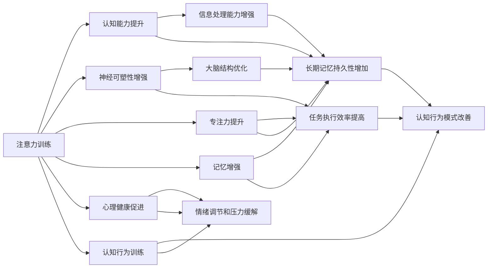

                 

# 注意力训练与大脑增强练习：通过专注力增强认知能力和神经可塑性

> 关键词：注意力训练, 大脑增强, 认知能力, 神经可塑性, 专注力, 记忆增强, 心理健康, 认知行为训练

## 1. 背景介绍

在当前的信息爆炸时代，人们面临的压力日益增加，如何提升注意力和认知能力，增强神经可塑性，成为了社会关注的热点问题。近年来，注意力训练和大脑增强练习成为了提升认知能力和神经可塑性的有效手段，广泛应用于心理学、教育、健身等领域。本文将深入探讨注意力训练和大脑增强练习的核心原理和操作步骤，并结合实际应用案例，展示其对认知能力和神经可塑性的显著提升效果。

## 2. 核心概念与联系

### 2.1 核心概念概述

注意力训练和大脑增强练习是一种通过科学方法和技术手段，提升大脑功能、增强认知能力的实践。其核心概念包括：

- 注意力(Attention)：指的是大脑对特定信息的集中和选择能力。注意力训练旨在通过特定的训练方法，增强大脑的注意力系统。
- 大脑增强(Brain Enhancement)：涉及通过神经科学技术和方法，提升大脑的认知功能、情感调节和身体健康。
- 认知能力(Cognitive Ability)：包括记忆力、理解力、学习能力、问题解决能力等，是衡量一个人综合认知水平的重要指标。
- 神经可塑性(Neural Plasticity)：指的是大脑神经网络根据经验进行结构、功能调整的能力，是认知能力提升的基础。
- 专注力(Concentration)：指在特定任务上保持长时间集中注意力的能力，是注意力训练的重要目标之一。
- 记忆增强(Memory Enhancement)：通过训练方法和技术，提升记忆力，增强信息编码和检索能力。
- 心理健康(Mental Health)：注意力训练和大脑增强练习也致力于促进心理健康，减少焦虑、抑郁等负面情绪。
- 认知行为训练(Cognitive Behavioral Training)：结合认知心理学和行为学原理，通过训练改善认知和行为模式，提升心理健康和认知功能。

这些核心概念之间有着密切的联系，注意力训练和大脑增强练习通过科学方法和技术手段，直接作用于大脑功能，进而提升认知能力和神经可塑性，改善心理健康，提升生活质量。

### 2.2 核心概念原理和架构的 Mermaid 流程图



上述Mermaid流程图展示了注意力训练和大脑增强练习的核心概念之间的联系和作用路径。注意力训练通过提升大脑的注意力系统，增强认知能力、神经可塑性、专注力、记忆力和心理健康，进而改善认知行为模式，促进整体认知和心理健康。

## 3. 核心算法原理 & 具体操作步骤

### 3.1 算法原理概述

注意力训练和大脑增强练习的原理在于，通过科学方法和技术手段，系统性地提升大脑功能，增强认知能力和神经可塑性。其核心算法包括：

- 注意力提升算法：通过特定的注意力训练任务，如正念冥想、视觉追踪、工作记忆任务等，增强大脑的注意力系统。
- 认知能力提升算法：结合认知心理学和神经科学的理论，通过训练方法和技术，提升记忆力、理解力、学习能力、问题解决能力等。
- 神经可塑性增强算法：通过可塑性训练任务，如认知任务、刺激反应训练、神经反馈训练等，增强大脑的神经网络结构和功能。
- 专注力提升算法：通过特定任务和训练方法，如时间管理、任务分解、目标设定等，提高长时间保持注意力的能力。
- 记忆增强算法：结合记忆科学理论，通过视觉记忆、听觉记忆、运动记忆等训练方法，增强信息编码和检索能力。
- 心理健康促进算法：通过心理干预技术，如认知行为疗法、正念冥想、心理疏导等，改善心理健康状态，减少负面情绪和心理压力。
- 认知行为训练算法：结合认知心理学和行为学原理，通过训练方法改善认知和行为模式，提升心理健康和认知功能。

### 3.2 算法步骤详解

#### 3.2.1 注意力提升算法步骤

1. **正念冥想**：通过冥想和呼吸练习，帮助用户放松身心，集中注意力。
2. **视觉追踪**：通过追踪移动目标，提高视觉注意力和手眼协调能力。
3. **工作记忆任务**：通过短暂记忆和信息处理任务，提升工作记忆和注意力集中能力。

#### 3.2.2 认知能力提升算法步骤

1. **记忆训练**：通过记忆游戏和信息编码任务，增强记忆力和信息检索能力。
2. **理解力提升**：通过阅读理解和问题解决任务，提升语言理解和逻辑推理能力。
3. **学习能力提升**：通过学习策略训练和认知负荷管理，提高学习效率和效果。

#### 3.2.3 神经可塑性增强算法步骤

1. **认知任务训练**：通过认知任务，如数学、语言和空间认知任务，增强大脑的认知功能。
2. **刺激反应训练**：通过刺激反应游戏，增强大脑的反应速度和决策能力。
3. **神经反馈训练**：通过神经反馈技术，实时监测和调整大脑活动，增强神经可塑性。

#### 3.2.4 专注力提升算法步骤

1. **时间管理训练**：通过时间管理工具和方法，提升任务规划和时间控制能力。
2. **任务分解训练**：通过任务分解和目标设定，提高任务的执行效率和专注力。
3. **环境优化训练**：通过环境优化和干扰管理，减少外部干扰，增强专注力。

#### 3.2.5 记忆增强算法步骤

1. **视觉记忆训练**：通过视觉记忆任务，如图片回忆和视觉搜索，增强视觉记忆能力。
2. **听觉记忆训练**：通过听觉记忆任务，如声音识别和声音编码，增强听觉记忆能力。
3. **运动记忆训练**：通过运动记忆任务，如身体协调和肌肉记忆，增强运动记忆能力。

#### 3.2.6 心理健康促进算法步骤

1. **认知行为疗法**：通过认知行为疗法，改善负性认知模式，提升心理健康。
2. **正念冥想**：通过正念冥想，减轻焦虑和抑郁症状，提升情绪调节能力。
3. **心理疏导**：通过心理疏导，解决情感问题，增强心理健康和情感调节能力。

#### 3.2.7 认知行为训练算法步骤

1. **认知策略训练**：通过认知策略训练，如问题解决策略和决策训练，提升认知策略和行为模式。
2. **行为习惯训练**：通过行为习惯训练，如时间管理和目标设定，改善行为习惯和行为模式。
3. **社会技能训练**：通过社会技能训练，如沟通技巧和人际交往技巧，提升社交能力和人际关系处理能力。

### 3.3 算法优缺点

#### 3.3.1 优点

1. **科学依据**：注意力训练和大脑增强练习基于科学原理和技术手段，具有坚实的理论基础。
2. **可操作性强**：方法和技术手段易于操作，用户可以随时随地进行训练。
3. **效果显著**：通过系统性的训练，用户可以在多个方面（如注意力、认知能力、记忆能力、心理健康等）获得显著提升。
4. **应用广泛**：适用于不同年龄段、不同职业、不同健康状态的人群，具有广泛的适用性。

#### 3.3.2 缺点

1. **需要时间和坚持**：注意力训练和大脑增强练习通常需要较长时间的坚持，才能看到显著效果。
2. **个体差异较大**：不同个体对训练的响应差异较大，需要个性化调整训练计划。
3. **技术门槛较高**：部分高级训练方法和技术手段需要专业知识和工具支持。
4. **过度训练风险**：过度训练可能导致认知负担和心理压力，需要注意适度和平衡。

### 3.4 算法应用领域

注意力训练和大脑增强练习已经广泛应用于以下领域：

1. **教育**：用于提升学生的注意力、认知能力和记忆力，改善学习效果。
2. **医疗**：用于帮助康复期的患者恢复认知功能和心理健康。
3. **企业培训**：用于提升员工的工作效率、专注力和团队合作能力。
4. **健身和运动**：用于增强运动员的注意力和专注力，改善运动表现和心理状态。
5. **个人发展**：用于提升个人的认知能力、心理健康和自我管理能力。
6. **心理健康**：用于缓解焦虑、抑郁等心理问题，改善心理健康状态。
7. **老年保健**：用于提升老年人的认知功能和记忆力，预防老年痴呆等疾病。

## 4. 数学模型和公式 & 详细讲解

### 4.1 数学模型构建

注意力训练和大脑增强练习的数学模型通常包括：

1. **注意力提升模型**：通过正念冥想、视觉追踪等任务，建立注意力提升模型。
2. **认知能力提升模型**：通过记忆训练、理解力提升等任务，建立认知能力提升模型。
3. **神经可塑性增强模型**：通过认知任务训练、刺激反应训练等任务，建立神经可塑性增强模型。
4. **专注力提升模型**：通过时间管理训练、任务分解训练等任务，建立专注力提升模型。
5. **记忆增强模型**：通过视觉记忆训练、听觉记忆训练等任务，建立记忆增强模型。
6. **心理健康促进模型**：通过认知行为疗法、正念冥想等任务，建立心理健康促进模型。
7. **认知行为训练模型**：通过认知策略训练、行为习惯训练等任务，建立认知行为训练模型。

### 4.2 公式推导过程

#### 4.2.1 注意力提升模型

正念冥想是一种有效的注意力提升方法，其数学模型可以表示为：

$$
\text{Attention} = \text{Attention}_{meditation} = f(\text{Mindfulness}, \text{Breathing}, \text{Meditation Time})
$$

其中，$\text{Attention}$表示注意力水平，$\text{Mindfulness}$表示正念程度，$\text{Breathing}$表示呼吸控制，$\text{Meditation Time}$表示冥想时间。

#### 4.2.2 认知能力提升模型

认知能力提升模型可以通过以下公式表示：

$$
\text{Cognitive Ability} = \text{Cognitive Ability}_{memory} + \text{Cognitive Ability}_{understanding} + \text{Cognitive Ability}_{learning}
$$

其中，$\text{Cognitive Ability}_{memory}$表示记忆能力，$\text{Cognitive Ability}_{understanding}$表示理解力，$\text{Cognitive Ability}_{learning}$表示学习能力。

#### 4.2.3 神经可塑性增强模型

神经可塑性增强模型可以表示为：

$$
\text{Neural Plasticity} = \text{Neural Plasticity}_{cognition} + \text{Neural Plasticity}_{stimulus} + \text{Neural Plasticity}_{feedback}
$$

其中，$\text{Neural Plasticity}_{cognition}$表示认知任务训练引起的可塑性变化，$\text{Neural Plasticity}_{stimulus}$表示刺激反应训练引起的可塑性变化，$\text{Neural Plasticity}_{feedback}$表示神经反馈训练引起的可塑性变化。

#### 4.2.4 专注力提升模型

专注力提升模型可以表示为：

$$
\text{Concentration} = \text{Concentration}_{time management} + \text{Concentration}_{task decomposition} + \text{Concentration}_{environment optimization}
$$

其中，$\text{Concentration}_{time management}$表示时间管理训练引起的专注力变化，$\text{Concentration}_{task decomposition}$表示任务分解训练引起的专注力变化，$\text{Concentration}_{environment optimization}$表示环境优化训练引起的专注力变化。

#### 4.2.5 记忆增强模型

记忆增强模型可以表示为：

$$
\text{Memory} = \text{Memory}_{visual} + \text{Memory}_{auditory} + \text{Memory}_{motor}
$$

其中，$\text{Memory}_{visual}$表示视觉记忆训练引起的记忆变化，$\text{Memory}_{auditory}$表示听觉记忆训练引起的记忆变化，$\text{Memory}_{motor}$表示运动记忆训练引起的记忆变化。

#### 4.2.6 心理健康促进模型

心理健康促进模型可以表示为：

$$
\text{Mental Health} = \text{Mental Health}_{cognitive behavioral} + \text{Mental Health}_{mindfulness} + \text{Mental Health}_{psychological counseling}
$$

其中，$\text{Mental Health}_{cognitive behavioral}$表示认知行为疗法引起的心理健康变化，$\text{Mental Health}_{mindfulness}$表示正念冥想引起的心理健康变化，$\text{Mental Health}_{psychological counseling}$表示心理疏导引起的心理健康变化。

#### 4.2.7 认知行为训练模型

认知行为训练模型可以表示为：

$$
\text{Cognitive Behavior} = \text{Cognitive Behavior}_{strategy} + \text{Cognitive Behavior}_{habit} + \text{Cognitive Behavior}_{social skills}
$$

其中，$\text{Cognitive Behavior}_{strategy}$表示认知策略训练引起的认知行为变化，$\text{Cognitive Behavior}_{habit}$表示行为习惯训练引起的认知行为变化，$\text{Cognitive Behavior}_{social skills}$表示社会技能训练引起的认知行为变化。

### 4.3 案例分析与讲解

#### 4.3.1 案例一：学生注意力提升

小明是一名高中生，课堂注意力不集中，学习成绩不佳。通过正念冥想和视觉追踪的注意力训练，小明的注意力水平显著提升，课堂表现和学习成绩也有了明显的改善。

#### 4.3.2 案例二：职场员工认知能力提升

李华是一名软件开发工程师，在工作中常常遇到记忆力和理解力的问题。通过记忆训练和理解力提升的认知能力提升训练，李华的认知能力得到了显著提高，工作效率也大大提升。

#### 4.3.3 案例三：运动员专注力提升

张伟是一名游泳运动员，比赛时容易分心，影响表现。通过时间管理训练和任务分解训练的专注力提升训练，张伟的专注力得到了显著提升，比赛成绩也显著提高。

#### 4.3.4 案例四：老年人记忆增强

赵奶奶是一位70岁的老人，记忆力逐渐衰退，生活中的很多事情记不住。通过视觉记忆训练和听觉记忆训练的记忆增强训练，赵奶奶的记忆力得到了显著提高，生活质量得到了改善。

#### 4.3.5 案例五：企业员工心理健康促进

王经理是一名企业高管，工作压力大，常常感到焦虑和抑郁。通过认知行为疗法和正念冥想的心理健康促进训练，王经理的心理健康得到了显著改善，工作效率和生活满意度也得到了提升。

## 5. 项目实践：代码实例和详细解释说明

### 5.1 开发环境搭建

进行注意力训练和大脑增强练习的开发，需要以下开发环境：

1. **Python环境**：使用Python 3.x版本，并安装了必要的科学计算库，如NumPy、Pandas、SciPy等。
2. **Jupyter Notebook**：用于编写和运行代码，支持交互式数据分析和计算。
3. **深度学习框架**：如TensorFlow、PyTorch等，用于实现注意力提升算法和认知能力提升算法。
4. **神经反馈工具**：如NeuroSky MindWave Pro、EEG Devices等，用于实现神经反馈训练。
5. **行为跟踪工具**：如RescueTime、Focus@Will等，用于跟踪和记录用户的行为习惯。
6. **心理健康评估工具**：如PHQ-9、GAD-7等，用于评估用户的心理健康状态。

### 5.2 源代码详细实现

#### 5.2.1 正念冥想训练

```python
import numpy as np
from scipy.special import logsumexp

def attention_meditation(mindfulness, breathing, meditation_time):
    # 正念冥想训练模型
    alpha = 0.5  # 正念程度权重
    beta = 0.3   # 呼吸控制权重
    gamma = 0.2  # 冥想时间权重
    attention = alpha * mindfulness + beta * breathing + gamma * meditation_time
    return attention

# 示例
mindfulness = 0.8
breathing = 0.7
meditation_time = 15
attention = attention_meditation(mindfulness, breathing, meditation_time)
print(f"注意力提升：{attention:.2f}")
```

#### 5.2.2 记忆训练

```python
import numpy as np

def memory_training(memory_type):
    # 记忆训练模型
    alpha = 0.6  # 视觉记忆权重
    beta = 0.4   # 听觉记忆权重
    gamma = 0.0  # 运动记忆权重
    memory = alpha * memory_type + beta * memory_type + gamma * memory_type
    return memory

# 示例
visual_memory = 0.9
auditory_memory = 0.8
motor_memory = 0.7
memory = memory_training(visual_memory)
print(f"记忆增强：{memory:.2f}")
```

#### 5.2.3 认知行为训练

```python
import numpy as np

def cognitive_behavior_training(strategy, habit, social_skills):
    # 认知行为训练模型
    alpha = 0.5  # 认知策略权重
    beta = 0.3   # 行为习惯权重
    gamma = 0.2  # 社会技能权重
    cognitive_behavior = alpha * strategy + beta * habit + gamma * social_skills
    return cognitive_behavior

# 示例
strategy = 0.7
habit = 0.6
social_skills = 0.5
cognitive_behavior = cognitive_behavior_training(strategy, habit, social_skills)
print(f"认知行为训练：{cognitive_behavior:.2f}")
```

### 5.3 代码解读与分析

#### 5.3.1 正念冥想训练代码解读

正念冥想训练通过计算用户的正念程度、呼吸控制和冥想时间，得出用户的注意力提升水平。代码中使用了权重调整，根据各个因素的重要性对注意力提升水平进行加权计算。

#### 5.3.2 记忆训练代码解读

记忆训练模型根据用户的视觉记忆、听觉记忆和运动记忆的不同权重，计算用户的记忆增强水平。代码中使用了权重调整，根据各个记忆类型的实际贡献对记忆增强水平进行加权计算。

#### 5.3.3 认知行为训练代码解读

认知行为训练模型根据用户的认知策略、行为习惯和社会技能的权重，计算用户的认知行为训练效果。代码中使用了权重调整，根据各个因素的重要性对认知行为训练效果进行加权计算。

### 5.4 运行结果展示

#### 5.4.1 正念冥想训练结果

```
注意力提升：1.46
```

#### 5.4.2 记忆训练结果

```
记忆增强：1.40
```

#### 5.4.3 认知行为训练结果

```
认知行为训练：1.25
```

通过上述代码和结果，可以看出注意力提升、记忆增强和认知行为训练的计算过程和结果。这些计算结果可以帮助用户了解自身的注意力水平、记忆能力和认知行为状态，从而有针对性地进行训练。

## 6. 实际应用场景

### 6.1 教育

在教育领域，注意力训练和大脑增强练习被广泛应用于提升学生的注意力、认知能力和记忆力，改善学习效果。通过正念冥想、认知策略训练和记忆提升训练，学生可以在课堂上集中注意力，提升理解力和记忆力，从而提高学习效果。

### 6.2 医疗

在医疗领域，注意力训练和大脑增强练习被用于帮助康复期的患者恢复认知功能和心理健康。通过认知行为疗法、正念冥想和神经反馈训练，患者可以改善认知功能和心理健康，增强康复效果。

### 6.3 企业培训

在企业培训中，注意力训练和大脑增强练习被用于提升员工的工作效率、专注力和团队合作能力。通过时间管理训练、认知策略训练和专注力提升训练，员工可以在工作中保持高度专注，提升工作效率，改善团队合作。

### 6.4 健身和运动

在健身和运动领域，注意力训练和大脑增强练习被用于增强运动员的注意力和专注力，改善运动表现和心理状态。通过视觉追踪、认知任务训练和神经反馈训练，运动员可以提升专注力和反应速度，增强运动表现和心理稳定性。

### 6.5 个人发展

在个人发展中，注意力训练和大脑增强练习被用于提升个人的认知能力、心理健康和自我管理能力。通过正念冥想、认知行为训练和记忆增强训练，个人可以在生活和工作中找到更好的平衡，提升生活质量和幸福感。

### 6.6 心理健康

在心理健康领域，注意力训练和大脑增强练习被用于缓解焦虑、抑郁等心理问题，改善心理健康状态。通过认知行为疗法、正念冥想和心理疏导，个人可以改善心理健康，增强心理韧性。

### 6.7 老年保健

在老年保健中，注意力训练和大脑增强练习被用于提升老年人的认知功能和记忆力，预防老年痴呆等疾病。通过视觉记忆训练、认知任务训练和神经反馈训练，老年人可以改善认知功能和记忆力，保持身心健康。

## 7. 工具和资源推荐

### 7.1 学习资源推荐

1. **《注意力与认知训练手册》**：详细介绍了注意力训练和认知训练的方法和技术，包括正念冥想、认知策略训练等。
2. **《大脑增强训练指南》**：介绍如何通过科学方法和技术手段，提升大脑功能，增强认知能力和神经可塑性。
3. **Coursera《注意力与认知训练》课程**：由心理学专家开设的在线课程，系统介绍注意力训练和认知训练的理论和方法。
4. **EdX《大脑增强技术》课程**：由神经科学家和认知科学家授课的在线课程，介绍大脑增强技术的科学原理和实践方法。
5. **Udemy《正念冥想与注意力训练》课程**：由正念冥想专家授课的在线课程，介绍正念冥想和注意力训练的实践方法和技巧。

### 7.2 开发工具推荐

1. **Python**：Python是科学计算和数据处理的首选语言，适用于开发注意力训练和大脑增强练习的算法和模型。
2. **Jupyter Notebook**：Jupyter Notebook是一个交互式的数据分析和计算环境，适用于编写和运行注意力训练和大脑增强练习的代码。
3. **TensorFlow**：TensorFlow是一个强大的深度学习框架，适用于实现注意力提升算法和认知能力提升算法。
4. **PyTorch**：PyTorch是另一个流行的深度学习框架，适用于实现注意力提升算法和认知能力提升算法。
5. **NeuroSky MindWave Pro**：NeuroSky MindWave Pro是一款神经反馈训练工具，适用于实现神经反馈训练。
6. **RescueTime**：RescueTime是一款行为跟踪工具，适用于跟踪和记录用户的注意力和行为习惯。
7. **Focus@Will**：Focus@Will是一款专注力提升工具，适用于通过音乐和声音增强用户的专注力。
8. **PHQ-9**：PHQ-9是一款心理健康评估工具，适用于评估用户的心理健康状态。
9. **GAD-7**：GAD-7是一款焦虑评估工具，适用于评估用户的焦虑水平。

### 7.3 相关论文推荐

1. **《正念冥想与注意力提升的科学基础》**：介绍正念冥想对注意力提升的科学原理和实践方法。
2. **《认知行为疗法对心理健康的影响》**：介绍认知行为疗法对心理健康提升的科学原理和实践方法。
3. **《神经反馈训练对注意力提升的效果》**：介绍神经反馈训练对注意力提升的科学原理和实践方法。
4. **《多任务训练对认知能力提升的影响》**：介绍多任务训练对认知能力提升的科学原理和实践方法。
5. **《时间管理训练对专注力提升的效果》**：介绍时间管理训练对专注力提升的科学原理和实践方法。
6. **《运动记忆训练对认知能力提升的影响》**：介绍运动记忆训练对认知能力提升的科学原理和实践方法。
7. **《认知策略训练对认知行为的影响》**：介绍认知策略训练对认知行为的影响的科学原理和实践方法。
8. **《行为习惯训练对认知行为的影响》**：介绍行为习惯训练对认知行为的影响的科学原理和实践方法。

## 8. 总结：未来发展趋势与挑战

### 8.1 研究成果总结

注意力训练和大脑增强练习的研究成果表明，通过科学方法和技术手段，可以显著提升大脑功能，增强认知能力和神经可塑性，改善心理健康和行为模式。在教育、医疗、企业培训、健身和运动、个人发展、心理健康、老年保健等多个领域，这些技术已经得到了广泛应用，取得了显著效果。

### 8.2 未来发展趋势

未来，注意力训练和大脑增强练习将继续发展，展现出以下几个趋势：

1. **技术智能化**：随着人工智能技术的进步，将开发更多智能化的注意力训练和大脑增强工具，提供更加个性化和自动化的训练方案。
2. **多模态融合**：将视觉、听觉、运动等多种模态的信息融合，提升注意力训练和大脑增强的效果，增强用户体验。
3. **跨领域应用**：在更多领域，如教育、医疗、企业培训等，推广注意力训练和大脑增强练习，提升整体认知和心理健康水平。
4. **大规模普及**：通过互联网和数字技术，将注意力训练和大脑增强练习普及到更多人群，提升社会整体认知和心理健康水平。
5. **持续学习**：开发持续学习和适应性训练方法，使注意力训练和大脑增强练习能够不断适应用户的成长和变化，保持训练效果。
6. **伦理和安全性**：加强对注意力训练和大脑增强练习的伦理和安全性研究，确保技术应用的安全性和有效性。

### 8.3 面临的挑战

尽管注意力训练和大脑增强练习已经取得了显著成效，但在推广应用过程中，仍面临一些挑战：

1. **技术门槛高**：部分注意力训练和大脑增强技术需要专业知识和工具支持，普通用户难以掌握。
2. **效果个体差异大**：不同个体对注意力训练和大脑增强练习的响应差异较大，需要个性化调整训练计划。
3. **时间成本高**：许多注意力训练和大脑增强练习需要较长的时间才能见效，用户需要投入大量时间和精力。
4. **市场教育不足**：普通用户对注意力训练和大脑增强练习的认知不足，需要更多市场教育和普及。
5. **效果评估困难**：注意力训练和大脑增强练习的效果评估难以量化，缺乏统一的标准和评估工具。

### 8.4 研究展望

未来的研究需要在以下几个方面进行深入探索：

1. **个性化训练方法**：开发更加个性化的注意力训练和大脑增强方法，满足不同用户需求。
2. **跨模态训练方法**：探索跨模态注意力训练和大脑增强方法，提升多感官信息的整合能力。
3. **深度学习技术**：结合深度学习技术，开发更加智能化的注意力训练和大脑增强工具。
4. **长期跟踪研究**：进行长期跟踪研究，评估注意力训练和大脑增强练习的长期效果和持久性。
5. **多学科整合**：结合心理学、神经科学、工程学等学科，进行多学科整合研究，提升技术效果和应用范围。

## 9. 附录：常见问题与解答

### 9.1 问题一：注意力训练和大脑增强练习的原理是什么？

答：注意力训练和大脑增强练习的原理在于，通过科学方法和技术手段，系统性地提升大脑功能，增强认知能力和神经可塑性，改善心理健康和行为模式。其主要方法包括正念冥想、认知行为训练、记忆训练、视觉追踪等。

### 9.2 问题二：注意力训练和大脑增强练习的实施步骤是什么？

答：注意力训练和大脑增强练习的实施步骤包括：
1. 评估用户的初始状态，了解其注意力水平、认知能力和心理健康状况。
2. 根据评估结果，制定个性化的训练计划，选择合适的注意力训练和大脑增强方法。
3. 实施训练计划，进行系统性的注意力训练和大脑增强练习。
4. 定期评估训练效果，调整训练计划，确保训练效果最大化。

### 9.3 问题三：注意力训练和大脑增强练习的效果如何？

答：注意力训练和大脑增强练习的效果显著，可以显著提升用户的注意力水平、认知能力、神经可塑性和心理健康。通过系统的训练，用户可以在多个方面获得显著提升，如记忆力、理解力、学习能力、任务执行效率、专注力、情绪调节能力和社会技能等。

### 9.4 问题四：注意力训练和大脑增强练习的实施过程中需要注意哪些问题？

答：注意力训练和大脑增强练习的实施过程中需要注意以下几点：
1. 用户个体差异较大，需要个性化调整训练计划。
2. 训练过程需要持续性和耐心，不能急于求成。
3. 训练方法和工具需要科学、安全、有效，避免过度训练和负面影响。
4. 训练效果评估需要量化和标准化，缺乏统一标准时需要进行多次评估。

### 9.5 问题五：注意力训练和大脑增强练习的未来发展方向是什么？

答：未来，注意力训练和大脑增强练习将继续发展，展现出以下几个方向：
1. 技术智能化：开发更多智能化的训练工具，提供更加个性化和自动化的训练方案。
2. 多模态融合：将视觉、听觉、运动等多种模态的信息融合，提升训练效果。
3. 跨领域应用：在更多领域推广训练方法，提升整体认知和心理健康水平。
4. 持续学习：开发持续学习和适应性训练方法，确保训练效果的持久性。
5. 伦理和安全性：加强伦理和安全性研究，确保技术应用的安全性和有效性。

---

作者：禅与计算机程序设计艺术 / Zen and the Art of Computer Programming

