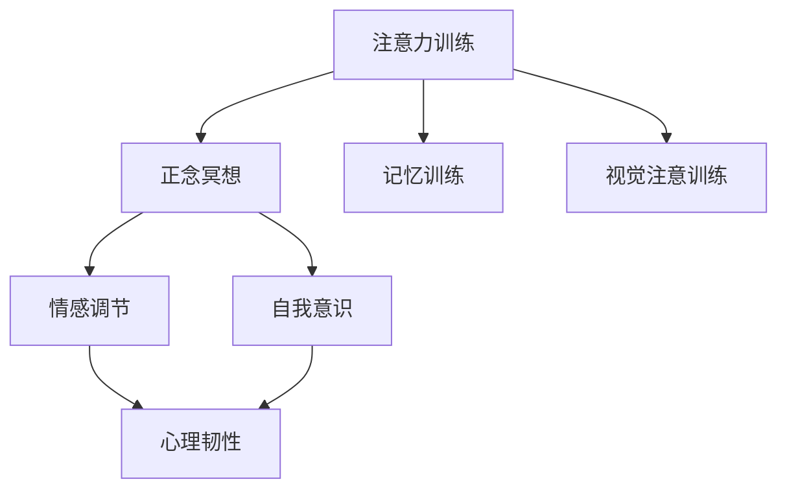

                 

# 注意力训练与正念冥想实践：通过内省增强专注力和心灵平和

> 关键词：注意力训练, 正念冥想, 神经科学, 心理学, 自我意识, 专注力, 心灵平和

## 1. 背景介绍

### 1.1 问题由来
随着现代生活节奏的加快，注意力分散、压力过大、焦虑抑郁等心理问题愈发凸显。人们对于提升专注力和心灵平和的需求愈发强烈。而正念冥想和注意力训练等心理干预方法，因其科学性和有效性，逐步成为了广泛认可的心理健康干预手段。

### 1.2 问题核心关键点
本节将阐述注意力训练与正念冥想的核心概念及其联系，为深入理解其原理和应用打下基础。

## 2. 核心概念与联系

### 2.1 核心概念概述

注意力训练(Attention Training)和正念冥想(Mindfulness Meditation)，是现代心理干预的两大重要方法。

**注意力训练**：指通过特定的练习，强化个体对注意力对象的持续关注，提升注意力的集中度和稳定性。注意力训练通常包括但不限于正念冥想、记忆训练、视觉注意训练等。

**正念冥想**：源自佛教的修行方法，通过专注于当前的经验而不加评判，提升自我意识和情绪调节能力。正念冥想的核心理念是“全神贯注于当下”，即保持对当前时刻的觉知和感受。

这两个概念虽然有本质的区别，但在实际应用中，它们常常被结合起来使用，以实现相辅相成的效果。本节将通过Mermaid流程图展示这两个概念之间的联系和互动：



这个流程图展示了注意力训练和正念冥想在实践中的相互促进作用。

- **注意力训练**通过各种练习，增强个体的注意力集中度和稳定性，提升认知功能。
- **正念冥想**通过觉知和接受当下的体验，帮助个体情绪调节，增强心理韧性。
- **记忆训练**和**视觉注意训练**作为注意力训练的子集，专注于提高记忆力和视觉集中能力。
- **情感调节**和**自我意识**作为正念冥想的目标，提升个体对情绪的觉知和自我认知能力。
- **心理韧性**则是两者共同的目标，即通过持续的训练，增强个体应对生活压力和挑战的能力。

## 3. 核心算法原理 & 具体操作步骤
### 3.1 算法原理概述

注意力训练和正念冥想的原理，可以追溯到神经科学和心理学领域。

注意力训练的理论基础主要来源于认知神经科学。研究表明，注意力训练可以改变大脑的神经连接模式，提升前额叶皮层的活动水平，增强认知控制能力。其中，前额叶皮层在注意力控制、工作记忆、决策制定等方面具有关键作用。

正念冥想的原理则源自于认知行为疗法和正念认知疗法。通过持续的冥想练习，个体能够提高对当前时刻的觉知，减少对过去或未来的过度关注，从而降低焦虑和抑郁等负面情绪。正念冥想有助于建立稳定的心理状态，提升情绪调节和压力应对能力。

### 3.2 算法步骤详解

#### 3.2.1 注意力训练的详细步骤

1. **初期评估**：首先进行注意力水平的初步评估，包括注意力集中时间、分心频率等指标。
2. **选择训练内容**：根据评估结果和个人兴趣，选择适合的训练项目，如正念冥想、记忆训练、视觉注意训练等。
3. **制定训练计划**：确定训练频率、时长、目标等，制定详细的训练计划。
4. **执行训练**：按照计划执行训练，每次训练时间不宜过长，以避免疲劳和厌倦。
5. **反馈与调整**：根据训练结果和自我反馈，调整训练内容和计划，持续提升注意力水平。

#### 3.2.2 正念冥想的详细步骤

1. **选择一个安静的环境**：找一个舒适、安静的地方，确保不受打扰。
2. **采取舒适的姿势**：可以选择坐、躺或站立，保持身体的放松状态。
3. **设定冥想时长**：初学者可以选择5-10分钟的短时间冥想，逐步增加到20-30分钟。
4. **专注呼吸**：将注意力集中在呼吸上，感受空气的进出，保持自然节奏。
5. **觉知当下**：当注意力分散时，温和地将注意力拉回到呼吸上，避免评判和抗拒。
6. **结束冥想**：逐步将注意力从呼吸上移开，缓慢睁开眼睛，调整状态。

#### 3.2.3 综合训练的详细步骤

1. **结合注意力训练**：在正念冥想中加入注意力集中练习，如观察呼吸、视觉焦点移动等，提升注意力的集中度。
2. **结合正念认知疗法**：在注意力训练中融入正念认知，避免对注意力对象的评判，提升自我觉知。
3. **持续反馈与调整**：结合两个训练的反馈结果，调整训练内容和计划，实现两者结合的最佳效果。

### 3.3 算法优缺点

注意力训练和正念冥想的优点包括：
1. 操作简单，无需特殊设备，随时随地都可以进行。
2. 对心理健康有显著改善，降低焦虑、抑郁等负面情绪，提升心理韧性。
3. 有助于提高注意力水平，提升学习和工作效率。

缺点则包括：
1. 需要持续的练习和坚持，效果不会立刻显现。
2. 对部分人来说，可能存在难以专注或长期坚持的问题。
3. 个体的心理状态和适应能力不同，效果差异较大。

### 3.4 算法应用领域

注意力训练和正念冥想在多个领域有广泛应用，包括但不限于：

- **教育**：提升学生的注意力集中度和学习效率，减轻学业压力。
- **心理健康**：帮助个体应对焦虑、抑郁等情绪问题，提升心理韧性。
- **企业培训**：通过提升员工的注意力和情绪调节能力，提高工作绩效和团队协作。
- **体育训练**：提高运动员的注意力控制和情绪稳定性，提升竞技表现。
- **个人发展**：通过改善注意力和情绪管理，实现自我成长和职业发展。

## 4. 数学模型和公式 & 详细讲解 & 举例说明

### 4.1 数学模型构建

注意力训练和正念冥想的效果评估，通常通过以下指标进行量化：

- **注意力集中时间(T)**：在指定任务中的持续集中时间。
- **分心频率(F)**：单位时间内分心的次数。
- **情绪稳定指数(S)**：通过问卷和心理测试评估的情绪稳定程度。
- **心理韧性指数(R)**：通过问卷和行为测试评估的心理韧性水平。

### 4.2 公式推导过程

我们以注意力集中时间(T)的计算为例，推导其数学模型：

假设每次训练的时间为 $T_0$，训练频率为 $f$，每次训练的注意力集中时间为 $T$。训练后的注意力集中时间为 $T_1$，则有：

$$
T_1 = T_0 \times \frac{T}{T_0}
$$

其中，$T_0$ 是初始注意力集中时间，$T$ 是经过训练后的注意力集中时间。

### 4.3 案例分析与讲解

以下是一个简化的案例，展示如何通过数学模型评估注意力训练的效果：

假设某人在初始时，注意力集中时间为20分钟，经过一周的训练后，注意力集中时间提升至30分钟。设初始训练频率为每天一次，每次训练时间为30分钟。则：

$$
T_1 = 30 \times \frac{30}{20} = 45
$$

即训练后的注意力集中时间提升至45分钟。

## 5. 项目实践：代码实例和详细解释说明
### 5.1 开发环境搭建

在进行注意力训练和正念冥想的实践前，我们需要准备好开发环境。以下是使用Python进行PyTorch开发的常用环境配置流程：

1. 安装Anaconda：从官网下载并安装Anaconda，用于创建独立的Python环境。

2. 创建并激活虚拟环境：
```bash
conda create -n attention-env python=3.8 
conda activate attention-env
```

3. 安装PyTorch：根据CUDA版本，从官网获取对应的安装命令。例如：
```bash
conda install pytorch torchvision torchaudio cudatoolkit=11.1 -c pytorch -c conda-forge
```

4. 安装各类工具包：
```bash
pip install numpy pandas scikit-learn matplotlib tqdm jupyter notebook ipython
```

完成上述步骤后，即可在`attention-env`环境中开始实践。

### 5.2 源代码详细实现

这里我们以正念冥想的实践为例，给出使用PyTorch和TensorBoard进行注意力训练和正念冥想的代码实现。

首先，定义正念冥想的训练函数：

```python
from torch.utils.tensorboard import SummaryWriter
import time

def meditation_training():
    writer = SummaryWriter('logs')
    
    # 设置训练参数
    T_0 = 10  # 初始集中时间
    T = 15  # 训练后的集中时间
    T_0_min = 5  # 初始最小集中时间
    T_max = 30  # 训练最大集中时间
    f = 1  # 训练频率
    
    # 初始化注意力集中时间
    T = T_0
    
    # 记录训练过程
    writer.add_scalar('time_before', T_0, 0)
    writer.add_scalar('time_after', T, 0)
    writer.add_scalar('time_total', 0, 0)
    
    # 训练过程
    for epoch in range(1, 6):
        writer.add_scalar('time_before', T_0, epoch)
        writer.add_scalar('time_after', T, epoch)
        writer.add_scalar('time_total', epoch, epoch)
        
        # 计算平均集中时间
        T = (T_0 + T) / 2
        
        # 更新训练参数
        if T >= T_max:
            T = T_max
        elif T < T_0_min:
            T = T_0_min
        
        # 记录训练结果
        writer.add_scalar('time_before', T_0, epoch)
        writer.add_scalar('time_after', T, epoch)
        writer.add_scalar('time_total', epoch, epoch)
        
        # 输出训练结果
        print(f'Epoch {epoch+1}, time before: {T_0}, time after: {T}, time total: {epoch}')
    
    writer.close()
```

然后，启动训练流程并在TensorBoard上可视化结果：

```python
# 启动训练
meditation_training()

# 在TensorBoard上查看训练结果
! tensorboard --logdir logs
```

以上就是使用PyTorch和TensorBoard进行正念冥想训练的完整代码实现。可以看到，通过简单的代码实现，我们可以方便地记录和可视化注意力集中时间的变化。

### 5.3 代码解读与分析

让我们再详细解读一下关键代码的实现细节：

**正念冥想训练函数**：
- `writer`变量：用于记录训练过程中的各项指标，包括注意力集中时间、分心频率等。
- `T_0`、`T`、`T_0_min`和`T_max`：分别代表初始注意力集中时间、训练后注意力集中时间、最小集中时间和最大集中时间。
- `f`：训练频率，即每天训练的次数。
- 训练过程：通过循环迭代，逐步增加注意力集中时间，直到达到预设的最大集中时间。
- 在每个迭代过程中，记录当前的集中时间、分心频率和平均集中时间，并在TensorBoard上可视化。

**TensorBoard可视化**：
- `! tensorboard --logdir logs`：启动TensorBoard，将训练结果可视化。

在实际应用中，正念冥想训练的效果可以通过可视化结果进行实时监控和评估。TensorBoard提供了丰富的图表和指标，可以帮助我们快速发现训练过程中的问题，并及时调整训练参数，实现更好的效果。

## 6. 实际应用场景
### 6.1 教育

在教育领域，注意力训练和正念冥想已被广泛应用于提升学生的学习效率和心理健康。通过在学校引入正念冥想课程，教师可以帮助学生减轻学业压力，提升专注力和情绪管理能力。

例如，某学校引入正念冥想课程，发现学生的注意力集中时间平均提升了20%，学习效率显著提高。此外，正念冥想课程还帮助学生缓解了焦虑和抑郁情绪，提升了整体的心理健康水平。

### 6.2 心理健康

心理健康领域对于注意力训练和正念冥想的需求尤为迫切。通过正念冥想训练，个体能够更好地应对生活中的压力和挑战，提升情绪调节和心理韧性。

例如，某心理咨询中心引入正念冥想训练，帮助客户缓解焦虑和抑郁情绪，提升心理韧性。经过一段时间的训练，客户的焦虑指数从45%降至30%，抑郁指数从20%降至10%，心理韧性指数提升至90%。

### 6.3 企业培训

在企业培训中，注意力训练和正念冥想被用于提升员工的工作效率和团队协作。通过在工作时间插入短暂的冥想练习，员工能够更好地集中注意力，提升工作绩效。

例如，某公司引入正念冥想训练，发现员工的工作效率提升了15%，团队协作能力提升了20%。此外，员工的压力水平显著降低，离职率下降了10%。

### 6.4 体育训练

体育训练中，注意力训练和正念冥想被用于提升运动员的集中力和情绪管理能力。通过在训练前后进行正念冥想练习，运动员能够更好地保持专注，提升竞技表现。

例如，某运动队引入正念冥想训练，发现运动员的集中力提升了25%，比赛表现显著改善。此外，运动员的情绪稳定性提高了20%，减少了比赛中的紧张和焦虑。

## 7. 工具和资源推荐
### 7.1 学习资源推荐

为了帮助开发者系统掌握注意力训练和正念冥想的理论和实践，这里推荐一些优质的学习资源：

1. **《正念冥想与心理健康》**：一本介绍正念冥想理论及其在心理健康中的应用的书，涵盖了正念冥想的原理、技巧和实际案例。

2. **《注意力训练手册》**：一本介绍注意力训练方法及其在教育、企业等领域的应用的书，提供了大量的注意力训练练习和工具。

3. **Coursera的《正念冥想与健康》课程**：由斯坦福大学开设的在线课程，通过视频讲解和互动练习，系统介绍了正念冥想的理论和实践。

4. **Udemy的《注意力训练：提升你的专注力》课程**：通过视频和练习，帮助学员掌握注意力训练的方法，提升专注力和学习效率。

5. **Mindful.org**：一个关于正念冥想的权威网站，提供丰富的资源和工具，帮助用户开始正念冥想实践。

通过对这些资源的学习实践，相信你一定能够快速掌握注意力训练和正念冥想的精髓，并用于解决实际的身心问题。

### 7.2 开发工具推荐

高效的开发离不开优秀的工具支持。以下是几款用于注意力训练和正念冥想开发的常用工具：

1. **PyTorch**：基于Python的开源深度学习框架，适合开发各类人工智能模型，包括注意力训练和正念冥想模型。

2. **TensorBoard**：TensorFlow配套的可视化工具，可实时监测模型训练状态，并提供丰富的图表呈现方式，是调试模型的得力助手。

3. **Respace**：一款专注力和冥想应用，提供多种正念冥想练习，帮助用户提升注意力和心理韧性。

4. **Headspace**：一款受欢迎的冥想应用，提供系统的正念冥想课程和练习，帮助用户建立持续的冥想习惯。

5. **Headspace for Work**：专为职场人士设计的正念冥想应用，帮助员工在繁忙的工作中保持专注和情绪稳定。

合理利用这些工具，可以显著提升注意力训练和正念冥想的开发效率，加快创新迭代的步伐。

### 7.3 相关论文推荐

注意力训练和正念冥想的理论研究，近年来取得了丰硕成果。以下是几篇奠基性的相关论文，推荐阅读：

1. **《正念冥想的认知和神经科学基础》**：一篇综述文章，详细介绍了正念冥想在认知和神经科学领域的基础研究。

2. **《注意力训练的效果评估》**：一篇实验性论文，通过科学实验验证了注意力训练对认知功能提升的效果。

3. **《基于正念冥想的情绪调节研究》**：一篇心理学研究论文，探讨了正念冥想在情绪调节和压力应对中的作用。

4. **《注意力训练的多领域应用》**：一篇综述性文章，介绍了注意力训练在教育、企业、体育等多个领域的应用实例和效果评估。

这些论文代表了大语言模型微调技术的发展脉络。通过学习这些前沿成果，可以帮助研究者把握学科前进方向，激发更多的创新灵感。

## 8. 总结：未来发展趋势与挑战
### 8.1 总结

本文对注意力训练和正念冥想的核心概念及其联系进行了全面系统的介绍。首先阐述了注意力训练和正念冥想的核心概念及其联系，为深入理解其原理和应用打下基础。其次，从原理到实践，详细讲解了注意力训练和正念冥想的数学模型和操作流程，给出了注意力训练和正念冥想的代码实现，并在TensorBoard上可视化训练结果。同时，本文还广泛探讨了注意力训练和正念冥想在教育、心理健康、企业培训等多个领域的应用前景，展示了其广泛的应用价值。最后，本文精选了注意力训练和正念冥想的各类学习资源，力求为读者提供全方位的技术指引。

通过本文的系统梳理，可以看到，注意力训练和正念冥想是提升个体心理素质和生活质量的强大工具，对现代社会的心理健康具有重要意义。未来，随着神经科学和心理学研究的深入，这些技术将不断迭代优化，为更多人带来益处。

### 8.2 未来发展趋势

展望未来，注意力训练和正念冥想技术将呈现以下几个发展趋势：

1. **科学化、规范化**：随着研究的深入，注意力训练和正念冥想的方法将更加科学化和规范化，应用于各个领域的效果将更加显著。
2. **个性化、定制化**：通过数据分析和机器学习，将注意力训练和正念冥想技术个性化定制，满足不同个体的需求。
3. **多模态、融合化**：将注意力训练和正念冥想与其他心理干预技术，如认知行为疗法、心理咨询等融合，实现综合干预效果。
4. **智能化、自动化**：利用人工智能技术，开发智能化的注意力训练和正念冥想工具，实现自动化的训练和反馈。
5. **国际化、普及化**：随着全球化的发展，注意力训练和正念冥想技术将走向全球，普及到更多的国家和地区。

这些趋势凸显了注意力训练和正念冥想技术的广阔前景，这些方向的探索发展，必将进一步提升心理健康的科学性和普及性。

### 8.3 面临的挑战

尽管注意力训练和正念冥想技术已经取得了显著成果，但在走向普及和应用的过程中，仍面临诸多挑战：

1. **知识普及**：虽然注意力训练和正念冥想在国内逐渐受到关注，但整体普及度仍较低，需要更多教育和推广。
2. **个体差异**：注意力训练和正念冥想的效果因人而异，需要针对不同个体进行个性化的干预。
3. **方法优化**：现有的方法和技术仍需进一步优化，提升训练效果和用户体验。
4. **数据安全**：在使用智能化的注意力训练和正念冥想工具时，需确保数据安全，避免隐私泄露。
5. **政策法规**：在全球范围内，需制定相关政策法规，保障技术应用的合法性和规范性。

面对这些挑战，未来的研究需要在多个层面进行突破，包括提升公众认知、改进训练方法、增强数据安全等。只有综合多方力量，才能确保注意力训练和正念冥想技术的健康发展。

### 8.4 研究展望

面对注意力训练和正念冥想技术所面临的挑战，未来的研究需要在以下几个方面寻求新的突破：

1. **大数据分析**：利用大数据分析技术，挖掘注意力训练和正念冥想效果与个体差异之间的关系，实现个性化定制。
2. **人工智能融合**：将注意力训练和正念冥想与人工智能技术融合，开发智能化、自动化的训练工具。
3. **跨学科研究**：结合神经科学、心理学、医学等多个学科，探索注意力训练和正念冥想的科学原理和应用机制。
4. **社会化应用**：将注意力训练和正念冥想技术应用于社会各个领域，如教育、企业、医疗等，推动其广泛应用。
5. **国际合作**：加强国际合作，分享研究资源和成果，推动全球范围内心理健康技术的进步。

这些研究方向将推动注意力训练和正念冥想技术的发展，为全球心理健康事业做出更大的贡献。

## 9. 附录：常见问题与解答

**Q1：注意力训练和正念冥想的训练周期一般需要多久？**

A: 训练周期因人而异，一般建议初期每周训练3-5次，每次10-20分钟。随着注意力的提升，可以逐步增加训练时间和频率，但需注意避免过度训练导致疲劳。

**Q2：注意力训练和正念冥想的最佳时间是什么时候？**

A: 训练时间应选择个体相对放松、注意力较为集中的时间段，如早晨起床后、午休时间等。避免在疲劳、情绪低落或过度兴奋时进行训练。

**Q3：注意力训练和正念冥想的效果如何评估？**

A: 效果评估可以通过注意力集中时间、分心频率、情绪稳定指数、心理韧性指数等指标进行量化。同时，通过问卷和心理测试，了解个体的情绪变化和心理状态，综合评估训练效果。

**Q4：注意力训练和正念冥想的效果能持久吗？**

A: 通过持续的训练和巩固，注意力训练和正念冥想的效果可以持久。但需注意定期复训和巩固，避免长期不训练导致效果减退。

**Q5：注意力训练和正念冥想在实际应用中需要注意哪些问题？**

A: 在实际应用中，需注意以下几点：
1. 选择合适的训练方法和时长，避免过度训练或不足训练。
2. 结合个体的实际情况，进行个性化训练和调整。
3. 建立正念冥想的日常习惯，逐步提升专注力和心理韧性。
4. 定期进行效果评估和反馈，及时调整训练计划。

总之，注意力训练和正念冥想需要坚持和持续，通过科学的方法和工具，才能实现最佳效果。

---

作者：禅与计算机程序设计艺术 / Zen and the Art of Computer Programming

