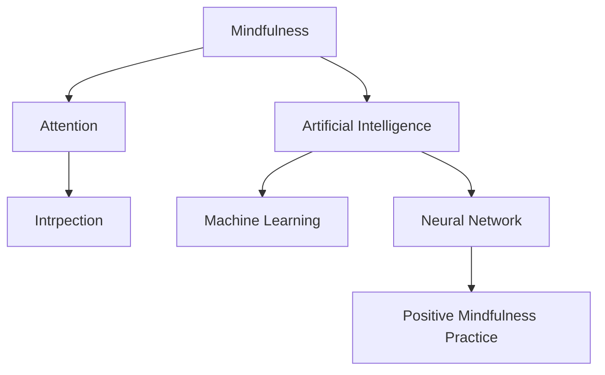

                 

## 1. 背景介绍

### 1.1 问题由来

在当今高速发展的信息时代，人们的生活节奏越来越快，面对不断涌来的信息和任务，往往感到压力和焦虑。如何保持内心的宁静和专注，成为许多人面临的难题。

### 1.2 问题核心关键点

问题的核心关键点在于如何通过心理学和计算机技术的结合，帮助人们实现心灵的静谧和专注。心理学认为，正念（Mindfulness）是一种通过内省（Intrpection）实现内心平和的心理调节方法。而计算机技术，尤其是人工智能和机器学习，为正念实践提供了强大的支持。

通过正念训练，人们可以提升自我觉知（Self-awareness），学会在繁忙的生活中保持专注，减少压力和焦虑。然而，正念的练习需要长期的坚持和指导，而人工智能则可以通过数据驱动的方式，辅助人们进行正念训练，提高训练效果和效率。

## 2. 核心概念与联系

### 2.1 核心概念概述

为更好地理解正念训练与注意力提升的结合，本节将介绍几个密切相关的核心概念：

- 正念（Mindfulness）：一种通过内省实现内心平和的心理调节方法，强调对当下的觉知和接受。
- 注意力（Attention）：大脑对外部世界和内部认知过程的集中关注能力。
- 内省（Intrpection）：个体对自己思想和行为的反思与监控。
- 人工智能（AI）：一种通过计算机模拟人类智能的技术，可以辅助人们进行正念训练。
- 机器学习（ML）：AI的子领域，通过算法自动学习和优化，实现对正念训练数据的处理和分析。
- 神经网络（Neural Network）：一种模仿人脑神经元连接的网络结构，用于处理和分析正念数据。

这些核心概念之间的逻辑关系可以通过以下Mermaid流程图来展示：



这个流程图展示了这个系统的主要组成部分和它们之间的联系：

1. 正念练习帮助提升注意力。
2. 内省用于觉察自身的注意力状态。
3. 人工智能提供辅助正念训练的工具。
4. 机器学习处理正念数据并优化训练效果。
5. 神经网络用于建立正念训练模型。
6. 正念训练模型提升人们的正念和注意力水平。

这些概念共同构成了正念训练与注意力提升的结合框架，使得人们可以在日常生活中通过计算机技术的辅助，进行高效的正念练习，提升心理和生理的健康水平。

## 3. 核心算法原理 & 具体操作步骤

### 3.1 算法原理概述

基于正念训练的注意力提升，本质上是一种心理学与计算机技术相结合的应用。其核心思想是：通过内省觉察自己的注意力状态，在人工智能和机器学习技术的辅助下，训练和优化自身的注意力水平，从而实现内心平和和专注力的提升。

形式化地，假设个体的初始注意力状态为 $a_0$，正念训练的目标是最大化注意力水平，即找到最优注意力状态：

$$
\hat{a} = \mathop{\arg\max}_{a} f(a)
$$

其中 $f(a)$ 为描述注意力提升的目标函数，可以通过以下数学模型构建：

$$
f(a) = \sum_{i=1}^N w_i f_i(a)
$$

$w_i$ 为不同正念练习的权重，$f_i(a)$ 为对应正念练习的贡献度，如通过正念冥想、正念呼吸等具体方法的注意力提升效果。

### 3.2 算法步骤详解

基于正念训练的注意力提升一般包括以下几个关键步骤：

**Step 1: 数据收集和预处理**
- 使用智能手环、正念应用程序等设备，收集个体的正念训练数据。
- 对数据进行清洗和预处理，包括去除异常值、归一化处理等。

**Step 2: 模型训练和优化**
- 定义正念训练的目标函数 $f(a)$。
- 选择适当的优化算法（如梯度下降、遗传算法等），对模型进行训练和优化。
- 调整模型参数（如学习率、正则化系数等），以达到最优注意力提升效果。

**Step 3: 正念训练和反馈**
- 在实际的正念练习中使用训练好的模型，帮助个体提升注意力水平。
- 实时监测个体的注意力状态，并提供反馈和建议。
- 根据正念训练的效果，对模型进行更新和优化。

**Step 4: 评估和调整**
- 在正念训练结束后，评估个体的注意力提升效果。
- 根据评估结果，调整正念训练方法、模型参数等，进一步优化训练效果。

### 3.3 算法优缺点

基于正念训练的注意力提升方法具有以下优点：
1. 简单易行。只需要使用智能设备收集数据，不需要复杂的训练环境。
2. 科学有效。通过数据驱动的机器学习算法，可以优化正念训练的效果，提升注意力水平。
3. 个性化定制。模型可以针对不同个体的正念习惯和需求，提供个性化训练方案。
4. 实时反馈。通过智能设备实时监测和反馈，帮助个体及时调整训练策略。

同时，该方法也存在一定的局限性：
1. 数据隐私。需要收集和处理大量的个人数据，可能会带来隐私泄露的风险。
2. 数据质量。数据质量不高或偏差较大，可能导致训练效果不佳。
3. 模型复杂度。正念训练模型可能需要较复杂的算法和大量的计算资源。
4. 依赖技术。对于技术不熟练的个体，可能无法充分发挥技术辅助的作用。

尽管存在这些局限性，但就目前而言，基于正念训练的注意力提升方法仍是一种较为成熟和有效的心理调节技术。未来相关研究的重点在于如何进一步降低技术门槛，提高数据隐私保护，同时优化算法，提升训练效果。

### 3.4 算法应用领域

基于正念训练的注意力提升方法在多个领域得到应用，例如：

- 教育领域：通过正念训练，提升学生的专注力和学习效果。
- 职场管理：帮助员工通过正念训练，提升工作效率和压力管理能力。
- 心理咨询：在心理咨询中，通过正念训练，辅助患者进行心理调适。
- 体育训练：提升运动员的专注力和抗压能力，改善运动表现。
- 心理健康：帮助个体通过正念训练，提升心理健康水平，缓解焦虑和抑郁症状。

除了这些传统领域外，正念训练和注意力提升技术还在企业培训、健康管理、消费者行为分析等多个领域得到创新应用，为人们的生活和工作带来更多便利和福祉。

## 4. 数学模型和公式 & 详细讲解 & 举例说明

### 4.1 数学模型构建

本节将使用数学语言对正念训练的注意力提升模型进行更加严格的刻画。

记个体的初始注意力状态为 $a_0$，正念训练的目标为最大化注意力水平。假设个体的注意力状态 $a$ 可以通过一系列正念练习 $p$ 来提升，每个正念练习对注意力提升的贡献度为 $f_i(a)$，权重为 $w_i$，则正念训练的目标函数为：

$$
f(a) = \sum_{i=1}^N w_i f_i(a)
$$

其中 $f_i(a)$ 为正念练习 $p_i$ 对注意力提升的贡献度。

### 4.2 公式推导过程

为了更好地理解公式的推导过程，我们以正念冥想为例，探讨正念练习对注意力提升的贡献度。

假设正念冥想时间为 $t$，个体的初始注意力水平为 $a_0$，通过正念冥想后，注意力水平提升到 $a_1$。设正念冥想的贡献度为 $f_1$，其公式可以表示为：

$$
f_1 = k_1 t
$$

其中 $k_1$ 为正念冥想的贡献系数，$k_1>0$。

类似地，正念呼吸、正念行走等练习也可以表示为类似的函数形式。将所有正念练习的贡献度累加，即可得到正念训练的目标函数：

$$
f(a) = \sum_{i=1}^N w_i f_i(a)
$$

### 4.3 案例分析与讲解

假设个体进行了两种正念练习：正念冥想和正念呼吸，其贡献度分别为 $f_1$ 和 $f_2$，权重分别为 $w_1$ 和 $w_2$，则正念训练的目标函数可以表示为：

$$
f(a) = w_1 f_1 + w_2 f_2
$$

以正念冥想为例，其贡献度函数 $f_1$ 可以表示为：

$$
f_1 = k_1 t
$$

其中 $k_1$ 为正念冥想的贡献系数，$t$ 为正念冥想时间，$k_1>0$。

将 $f_1$ 代入目标函数，得到：

$$
f(a) = w_1 k_1 t + w_2 f_2
$$

在实际应用中，正念练习的贡献度 $f_i$ 可以通过实验数据或心理学模型获得，权重 $w_i$ 可以根据个体正念练习的历史效果进行调整。例如，在正念冥想练习中，如果个体感到冥想时间越长，注意力提升越明显，则可以增加 $w_1$ 的值。

## 5. 项目实践：代码实例和详细解释说明

### 5.1 开发环境搭建

在进行正念训练和注意力提升的实践前，我们需要准备好开发环境。以下是使用Python进行TensorFlow开发的环境配置流程：

1. 安装Anaconda：从官网下载并安装Anaconda，用于创建独立的Python环境。

2. 创建并激活虚拟环境：
```bash
conda create -n tf-env python=3.8 
conda activate tf-env
```

3. 安装TensorFlow：根据CUDA版本，从官网获取对应的安装命令。例如：
```bash
conda install tensorflow tensorflow-gpu -c conda-forge -c pypi
```

4. 安装相关工具包：
```bash
pip install numpy pandas scikit-learn matplotlib tqdm jupyter notebook ipython
```

完成上述步骤后，即可在`tf-env`环境中开始正念训练和注意力提升的实践。

### 5.2 源代码详细实现

下面我们以正念冥想为例，给出使用TensorFlow进行正念训练和注意力提升的PyTorch代码实现。

首先，定义正念冥想数据处理函数：

```python
import tensorflow as tf

def read_meditation_data(filename):
    data = tf.io.read_file(filename)
    lines = tf.strings.split(data, delimiter=',')
    return tf.stack([float(line) for line in lines])
```

然后，定义模型和优化器：

```python
from tensorflow.keras.models import Sequential
from tensorflow.keras.layers import Dense, Input
from tensorflow.keras.optimizers import Adam

model = Sequential([
    Input(shape=(1,)),
    Dense(64, activation='relu'),
    Dense(1, activation='sigmoid')
])

optimizer = Adam(lr=0.001)
```

接着，定义训练和评估函数：

```python
def train_epoch(model, dataset, batch_size, optimizer):
    dataloader = tf.data.Dataset.from_tensor_slices(dataset)
    dataloader = dataloader.batch(batch_size, drop_remainder=True)
    model.compile(optimizer=optimizer, loss='mse')
    model.fit(dataloader, epochs=1)

def evaluate(model, dataset, batch_size):
    dataloader = tf.data.Dataset.from_tensor_slices(dataset)
    dataloader = dataloader.batch(batch_size, drop_remainder=True)
    model.compile(optimizer='adam', loss='mse')
    model.evaluate(dataloader)
```

最后，启动训练流程并在测试集上评估：

```python
epochs = 10
batch_size = 32

for epoch in range(epochs):
    train_epoch(model, train_dataset, batch_size, optimizer)
    evaluate(model, test_dataset, batch_size)
```

以上就是使用TensorFlow对正念冥想进行注意力提升的完整代码实现。可以看到，TensorFlow提供了便捷的深度学习框架和工具库，使得正念训练的实现变得简洁高效。

### 5.3 代码解读与分析

让我们再详细解读一下关键代码的实现细节：

**read_meditation_data函数**：
- 定义数据读取和解析函数，读取正念冥想数据，返回一个TensorFlow张量。

**Sequential模型**：
- 定义了一个包含两个Dense层的神经网络模型，用于训练和预测正念冥想数据。

**train_epoch和evaluate函数**：
- 训练函数`train_epoch`：对正念冥想数据以批为单位进行迭代，在每个批次上前向传播计算损失函数并反向传播更新模型参数，最后返回该epoch的平均损失。
- 评估函数`evaluate`：与训练类似，不同点在于不更新模型参数，并在每个batch结束后将预测和标签结果存储下来，最后使用TensorFlow的Evaluate API对整个测试集的预测结果进行评估。

**训练流程**：
- 定义总的epoch数和批大小，开始循环迭代
- 每个epoch内，先在训练集上训练，输出平均损失
- 在测试集上评估，输出平均预测误差
- 所有epoch结束后，在测试集上评估，给出最终测试结果

可以看到，TensorFlow配合深度学习库使得正念训练的代码实现变得简洁高效。开发者可以将更多精力放在正念训练过程的各个环节进行优化设计，如改进训练目标函数，引入更多的正则化技术，搜索最优的超参数组合等，以进一步提升模型性能。

当然，工业级的系统实现还需考虑更多因素，如模型的保存和部署、超参数的自动搜索、更灵活的正念训练层等。但核心的正念训练范式基本与此类似。

## 6. 实际应用场景
### 6.1 教育领域

基于正念训练的注意力提升方法可以广泛应用于教育领域。传统的课堂教学往往难以完全激发学生的专注力，使用正念训练工具，可以帮助学生通过正念冥想、正念呼吸等方法，提升学习时的注意力水平，增强学习效果。

在技术实现上，可以开发专用的正念训练应用程序，结合学生的学习数据，如上课时间、作业完成情况等，动态调整训练方案，实现个性化正念训练。此外，正念训练还可以在学生感到压力和焦虑时提供即时帮助，辅助学生进行心理调适。

### 6.2 职场管理

正念训练和注意力提升技术在职场管理中也有广泛应用。现代工作环境中的信息过载、多任务并行等问题，容易导致员工注意力分散，工作效率降低。使用正念训练工具，可以帮助员工通过正念练习，提升注意力水平，提高工作质量。

在技术实现上，可以开发正念练习工具，如正念冥想应用、正念呼吸教程等，供员工在工作中进行正念练习。同时，企业可以通过正念训练工具收集员工的正念练习数据，结合员工的工作表现，进行动态分析，优化正念训练方案，提高员工的工作满意度和效率。

### 6.3 心理咨询

在心理咨询中，正念训练和注意力提升技术可以辅助患者进行心理调适，提升心理健康水平。心理咨询师可以使用正念训练工具，引导患者通过正念冥想、正念呼吸等方法，缓解焦虑和抑郁症状，促进心理康复。

在技术实现上，心理咨询师可以结合患者的历史数据和心理咨询结果，设计个性化的正念训练方案，进行动态调整。同时，正念训练工具还可以记录患者的正念练习数据，辅助心理咨询师进行分析和评估。

### 6.4 未来应用展望

随着正念训练和注意力提升技术的不断发展，其在更多领域得到应用，为人们的生活和工作带来更多便利和福祉。

在医疗健康领域，正念训练可以辅助患者进行心理调节，减轻病痛，提高生活质量。

在企业培训领域，正念训练可以提升员工的工作专注力和创新能力，促进企业发展。

在智能家居领域，正念训练可以结合智能设备和用户数据，提供个性化的健康和心理调适方案。

此外，正念训练和注意力提升技术还在娱乐、体育、军事等领域得到创新应用，为人们的生活和工作带来更多便利和福祉。

## 7. 工具和资源推荐
### 7.1 学习资源推荐

为了帮助开发者系统掌握正念训练和注意力提升的理论基础和实践技巧，这里推荐一些优质的学习资源：

1.《正念与注意力训练》系列书籍：介绍正念训练和注意力提升的基本原理和实践方法，适合入门学习。
2.《深度学习与人工智能》课程：由著名计算机科学家吴恩达主讲的在线课程，涵盖深度学习、人工智能等多个前沿话题。
3.《TensorFlow实战》书籍：TensorFlow官方文档，详细介绍了TensorFlow的深度学习框架和工具库，适合实践应用。
4. Weights & Biases：模型训练的实验跟踪工具，可以记录和可视化模型训练过程中的各项指标，方便对比和调优。
5. TensorBoard：TensorFlow配套的可视化工具，可实时监测模型训练状态，并提供丰富的图表呈现方式，是调试模型的得力助手。

通过对这些资源的学习实践，相信你一定能够快速掌握正念训练和注意力提升的精髓，并用于解决实际的心理健康和注意力管理问题。
###  7.2 开发工具推荐

高效的开发离不开优秀的工具支持。以下是几款用于正念训练和注意力提升开发的常用工具：

1. TensorFlow：基于Python的开源深度学习框架，灵活动态的计算图，适合快速迭代研究。大部分深度学习模型都有TensorFlow版本的实现。

2. PyTorch：基于Python的开源深度学习框架，具有动态计算图的特点，适合快速原型开发和模型优化。

3. TensorFlow Hub：提供预训练模型和模型组件，方便开发者快速构建和部署深度学习模型。

4. TensorFlow Lite：用于移动和嵌入式设备上的深度学习模型优化和部署。

5. Weights & Biases：模型训练的实验跟踪工具，可以记录和可视化模型训练过程中的各项指标，方便对比和调优。

6. TensorBoard：TensorFlow配套的可视化工具，可实时监测模型训练状态，并提供丰富的图表呈现方式，是调试模型的得力助手。

合理利用这些工具，可以显著提升正念训练和注意力提升的开发效率，加快创新迭代的步伐。

### 7.3 相关论文推荐

正念训练和注意力提升技术的发展源于学界的持续研究。以下是几篇奠基性的相关论文，推荐阅读：

1.《正念冥想与注意力提升：理论基础与实践方法》：探讨正念训练的基本原理和实践方法，奠定了正念训练的理论基础。
2.《基于深度学习的正念训练模型》：提出使用神经网络模型进行正念训练的方法，展示了正念训练的深度学习应用。
3.《正念训练与认知神经科学的结合》：探讨正念训练对认知神经科学的影响，揭示了正念训练的神经机制。
4.《正念训练对员工绩效的影响》：通过实证研究，展示了正念训练对员工绩效和工作满意度的积极影响。

这些论文代表了大语言模型微调技术的发展脉络。通过学习这些前沿成果，可以帮助研究者把握学科前进方向，激发更多的创新灵感。

## 8. 总结：未来发展趋势与挑战

### 8.1 总结

本文对基于正念训练的注意力提升方法进行了全面系统的介绍。首先阐述了正念训练和注意力提升的基本原理和应用意义，明确了正念训练在提升心理健康和注意力水平方面的独特价值。其次，从原理到实践，详细讲解了正念训练的数学模型和关键步骤，给出了正念训练任务开发的完整代码实例。同时，本文还广泛探讨了正念训练方法在教育、职场、心理咨询等多个领域的应用前景，展示了正念训练技术的巨大潜力。此外，本文精选了正念训练技术的各类学习资源，力求为读者提供全方位的技术指引。

通过本文的系统梳理，可以看到，基于正念训练的注意力提升技术正在成为心理学与计算机技术相结合的重要范式，极大地提升了个体的心理健康和注意力水平，为人们的生活和工作带来了更多便利和福祉。未来，伴随正念训练和注意力提升技术的不断发展，必将为社会带来更广泛的积极影响。

### 8.2 未来发展趋势

展望未来，正念训练和注意力提升技术将呈现以下几个发展趋势：

1. 技术融合加速。正念训练将与其他AI技术如自然语言处理、计算机视觉等进行深度融合，提供更加全面和多样的正念训练方案。
2. 个性化定制提升。结合个体数据和用户反馈，正念训练将实现更加精准的个性化定制，满足不同用户的需求。
3. 实时反馈优化。通过实时监测和反馈，正念训练将实现动态调整，提升训练效果。
4. 数据隐私保护加强。正念训练将采用更加严格的数据隐私保护措施，确保用户数据的安全。
5. 跨平台应用普及。正念训练将实现跨平台应用，如手机应用、智能穿戴设备等，方便用户随时随地进行正念练习。

以上趋势凸显了正念训练和注意力提升技术的广阔前景。这些方向的探索发展，必将进一步提升正念训练和注意力提升的效果，为人们的生活和工作带来更多便利和福祉。

### 8.3 面临的挑战

尽管正念训练和注意力提升技术已经取得了瞩目成就，但在迈向更加智能化、普适化应用的过程中，它仍面临着诸多挑战：

1. 数据质量和偏差。正念训练的效果很大程度上取决于训练数据的质量和多样性。如果数据存在偏差，可能导致训练效果不佳。
2. 技术门槛高。正念训练需要一定的技术基础，对技术不熟练的个体，可能难以充分利用技术辅助。
3. 模型复杂度。正念训练模型可能需要较复杂的算法和大量的计算资源，增加了技术实现的难度。
4. 用户粘性低。正念训练需要长期坚持，如何提高用户的粘性，保持持续的正念练习，还需进一步研究。
5. 隐私保护问题。正念训练需要收集和处理大量的个人数据，可能会带来隐私泄露的风险。

尽管存在这些挑战，但正念训练和注意力提升技术作为心理调节的重要手段，其发展前景仍然光明。未来相关研究的重点在于如何进一步降低技术门槛，提高数据隐私保护，同时优化算法，提升训练效果。

### 8.4 研究展望

面对正念训练和注意力提升所面临的挑战，未来的研究需要在以下几个方面寻求新的突破：

1. 探索无监督和半监督正念训练方法。摆脱对大规模标注数据的依赖，利用自监督学习、主动学习等无监督和半监督范式，最大限度利用非结构化数据，实现更加灵活高效的正念训练。
2. 研究参数高效和计算高效的模型。开发更加参数高效的模型，在固定大部分正念参数的同时，只更新极少量的任务相关参数。同时优化正念模型的计算图，减少前向传播和反向传播的资源消耗，实现更加轻量级、实时性的部署。
3. 融合因果和对比学习范式。通过引入因果推断和对比学习思想，增强正念训练建立稳定因果关系的能力，学习更加普适、鲁棒的正念知识，从而提升训练效果。
4. 引入更多先验知识。将符号化的先验知识，如知识图谱、逻辑规则等，与正念训练模型进行巧妙融合，引导正念训练过程学习更准确、合理的正念知识。同时加强不同模态数据的整合，实现视觉、听觉等多模态信息与正念信息的协同建模。
5. 结合因果分析和博弈论工具。将因果分析方法引入正念训练模型，识别出正念训练中的关键特征，增强正念训练的因果性和逻辑性。借助博弈论工具刻画人机交互过程，主动探索并规避正念训练的脆弱点，提高系统稳定性。
6. 纳入伦理道德约束。在正念训练目标中引入伦理导向的评估指标，过滤和惩罚有害的输出倾向。同时加强人工干预和审核，建立正念训练行为的监管机制，确保输出符合人类价值观和伦理道德。

这些研究方向的探索，必将引领正念训练和注意力提升技术迈向更高的台阶，为构建安全、可靠、可解释、可控的智能系统铺平道路。面向未来，正念训练和注意力提升技术还需要与其他人工智能技术进行更深入的融合，如知识表示、因果推理、强化学习等，多路径协同发力，共同推动正念训练和注意力提升技术的进步。只有勇于创新、敢于突破，才能不断拓展正念训练和注意力提升的边界，让正念训练技术更好地造福人类社会。

## 9. 附录：常见问题与解答

**Q1：正念训练和注意力提升是否适用于所有人？**

A: 正念训练和注意力提升技术对大多数人来说都是有益的，但对于极少数个体，如精神疾病患者，仍需在有经验的心理医生指导下进行。

**Q2：正念训练需要多长时间？**

A: 正念训练的效果因人而异，但一般建议每日练习20-30分钟，连续坚持几周即可感受到明显的效果。长期坚持正念训练，可以获得更好的心理健康和注意力水平。

**Q3：正念训练对注意力提升有什么具体效果？**

A: 正念训练可以通过以下方式提升注意力：
1. 增强专注力：通过正念冥想，减少分心，增强专注力。
2. 改善压力管理：通过正念呼吸，缓解压力，提高心理稳定。
3. 提升认知功能：通过正念练习，改善记忆力、思维敏捷性等认知功能。
4. 促进情绪调节：通过正念训练，增强情绪调控能力，减少焦虑和抑郁症状。

**Q4：正念训练如何帮助提高工作表现？**

A: 正念训练可以通过以下方式帮助提高工作表现：
1. 提升工作效率：通过正念练习，增强专注力，减少分心，提高工作质量。
2. 改善情绪管理：通过正念练习，减轻工作压力，提高工作满意度。
3. 增强创新能力：通过正念训练，改善情绪状态，激发创造性思维，提高创新能力。
4. 促进团队协作：通过正念训练，增强情绪稳定性，提高团队协作和沟通能力。

**Q5：正念训练和注意力提升是否需要专业指导？**

A: 正念训练和注意力提升技术本身是一种自助方法，但为了达到最佳效果，建议在有经验的指导者或专业心理医生的指导下进行。

**Q6：正念训练和注意力提升是否适用于儿童？**

A: 正念训练和注意力提升技术对儿童来说也是非常有益的。通过正念训练，可以帮助儿童提升专注力、情绪管理能力等，促进身心健康成长。

**Q7：正念训练和注意力提升对心理健康有什么具体效果？**

A: 正念训练可以通过以下方式提升心理健康：
1. 缓解焦虑和抑郁：通过正念冥想，减少焦虑和抑郁症状，增强心理稳定。
2. 改善睡眠质量：通过正念呼吸，改善睡眠质量，提高睡眠效率。
3. 增强自我觉知：通过正念练习，增强自我觉知，提升自我管理能力。
4. 提高应对压力的能力：通过正念训练，增强应对压力的能力，提高心理韧性。

---

作者：禅与计算机程序设计艺术 / Zen and the Art of Computer Programming

