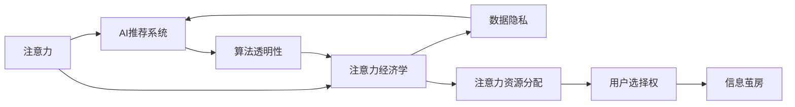

                 

# 注意力资本主义：AI时代的新经济模式

## 1. 背景介绍

### 1.1 问题由来
随着人工智能(AI)技术的迅猛发展，特别是深度学习和大规模预训练模型的突破，AI开始以新的方式重塑经济结构，催生出一种全新的经济模式——注意力资本主义(Attention Capitalism)。这一概念由Shoshana Zuboff在其著作《The Age of Surveillance Capitalism》中首次提出，主要指AI技术在注意力资源的竞争和利用过程中，所引发的经济变革与挑战。注意力资本主义强调，在数字时代，用户注意力成为一种稀缺资源，AI系统通过分析、预测、引导甚至操控用户的注意力，从而获取经济价值和竞争优势。

### 1.2 问题核心关键点
注意力资本主义的核心在于，用户注意力作为一种新型经济资源，被各大平台和AI技术所争夺和利用。这种模式引发了一系列新的经济、伦理、隐私问题。例如：

- **注意力资源分配不均**：不同用户、不同平台获取注意力资源的效率差异巨大，导致资源分配不公平。
- **用户隐私侵害**：在追求高精准度、高个性化推荐时，AI系统往往需要收集大量用户行为数据，隐私风险加剧。
- **注意力操控**：AI系统通过算法设计引导用户注意力，可能造成“信息茧房”、“回音室”等现象，损害用户自由意志。
- **注意力经济**：注意力资源的价值转化为广告收入、数据交易等形式，形成了新的经济增长点。

这些关键点揭示了AI时代经济的新范式，对社会、伦理、隐私等各个层面都产生了深远影响。因此，探讨注意力资本主义的原理、应用和挑战，具有重要意义。

## 2. 核心概念与联系

### 2.1 核心概念概述

在探讨注意力资本主义时，以下几个核心概念是不可或缺的：

- **注意力(Attention)**：指用户对信息的关注度和聚焦力，是信息消费过程中最宝贵的资源。
- **注意力经济学(Attention Economy)**：研究注意力如何被生产、分配和消费的经济活动。
- **AI推荐系统(Recommendation Systems)**：通过分析用户行为和偏好，向用户推送个性化内容，优化注意力资源的配置。
- **数据隐私(Privacy)**：涉及用户数据如何收集、存储、处理和使用的伦理和法律问题。
- **算法透明性(Algorithm Transparency)**：指AI算法决策过程的可解释性和可验证性，保障用户知情权和选择权。

这些概念相互交织，共同构成了AI时代注意力资本主义的复杂图景。

### 2.2 核心概念原理和架构的 Mermaid 流程图



该流程图展示了注意力、AI推荐系统、注意力经济学、数据隐私和算法透明性之间的联系。注意力被AI系统分析并用于推荐系统，进而影响注意力经济学和数据隐私。算法透明性确保用户对推荐过程的知情权，同时影响注意力资源的分配和用户的选择权，进而可能导致信息茧房等不良现象。

## 3. 核心算法原理 & 具体操作步骤

### 3.1 算法原理概述

注意力资本主义的核心算法原理主要涉及AI推荐系统及其在注意力资源上的应用。推荐系统通过预测用户偏好，将个性化内容推送给用户，最大化用户的使用时间和价值。这实质上是一种对注意力资源的竞争和利用过程。

推荐系统一般包含以下几个关键步骤：

1. **数据收集**：收集用户的浏览历史、点击行为、评分记录等数据。
2. **特征提取**：通过特征工程，将原始数据转化为模型的输入特征。
3. **模型训练**：使用机器学习算法训练推荐模型，学习用户偏好和行为模式。
4. **推荐排序**：根据模型预测，对推荐内容进行排序，提供给用户。
5. **反馈循环**：收集用户反馈，进一步优化模型。

这些步骤共同构成了一个基于注意力资本主义的推荐系统框架。

### 3.2 算法步骤详解

具体而言，推荐系统算法步骤可以进一步细化为以下几个关键点：

**Step 1: 数据预处理**
- 清洗原始数据，去除噪音和不相关数据。
- 对用户行为进行编码，如将浏览记录转化为向量表示。

**Step 2: 特征工程**
- 提取用户特征，如年龄、性别、兴趣标签等。
- 构建物品特征，如物品分类、属性描述等。
- 设计交互特征，如用户-物品评分、互动时间等。

**Step 3: 模型选择与训练**
- 选择合适的推荐模型，如协同过滤、矩阵分解、深度神经网络等。
- 设置训练参数，如迭代次数、学习率、正则化等。
- 使用训练数据集训练模型，最小化预测误差。

**Step 4: 推荐排序**
- 根据预测评分对推荐内容进行排序。
- 考虑点击率、转化率、用户满意度等指标。

**Step 5: 用户反馈收集与模型优化**
- 收集用户对推荐结果的反馈，如点击、收藏、评论等。
- 根据反馈调整模型参数，优化推荐效果。

### 3.3 算法优缺点

基于注意力资本主义的推荐系统具有以下优点：

1. **高效率**：能够快速分析用户行为，提供个性化推荐，提升用户体验。
2. **精准度**：通过分析大量数据，能够精准预测用户偏好，提供高质量内容。
3. **业务价值**：推荐系统能够增加用户使用时间和价值，带来显著的广告收入和数据交易收益。

同时，也存在一些局限性：

1. **隐私风险**：数据收集和处理过程中，用户隐私受到威胁。
2. **算法透明性**：推荐算法复杂，难以解释，用户难以理解和信任。
3. **信息茧房**：过度个性化的推荐可能导致用户信息闭塞，形成信息茧房。
4. **资源分配不均**：大公司凭借技术优势和资源优势，更容易获取注意力资源，导致市场竞争不公。

### 3.4 算法应用领域

基于注意力资本主义的推荐系统已经广泛应用于多个领域，包括：

- **电商**：如Amazon、淘宝等电商平台，通过个性化推荐提高销售额和用户满意度。
- **内容平台**：如YouTube、Netflix等，通过内容推荐提升用户粘性和观看时长。
- **社交网络**：如Facebook、微信等，通过算法推荐增加用户互动和广告收入。
- **新闻媒体**：如今日头条、网易新闻等，通过个性化推送提升阅读量和用户留存率。
- **金融服务**：如支付宝、蚂蚁金服等，通过推荐系统提升用户体验和金融交易量。

这些领域的应用，展示了注意力资本主义在提升用户价值和经济效益方面的巨大潜力。

## 4. 数学模型和公式 & 详细讲解

### 4.1 数学模型构建

推荐系统通常基于协同过滤、矩阵分解等模型进行构建。以下以矩阵分解为例，介绍推荐系统的数学模型构建。

设用户-物品评分矩阵为 $R \in \mathbb{R}^{m \times n}$，其中 $m$ 为物品数量，$n$ 为用户数量。推荐系统的目标是通过矩阵分解，将 $R$ 分解为两个低秩矩阵 $P \in \mathbb{R}^{m \times k}$ 和 $Q \in \mathbb{R}^{n \times k}$，其中 $k$ 为因子数。分解过程如下：

$$
R \approx P \times Q^T
$$

用户对物品 $i$ 的预测评分可以通过 $P_i$ 和 $Q_j^T$ 的矩阵乘积得到：

$$
\hat{R}_{i,j} = P_i^T \times Q_j
$$

### 4.2 公式推导过程

矩阵分解的推导过程如下：

1. **因子分解**：将用户-物品评分矩阵 $R$ 分解为两个低秩矩阵 $P$ 和 $Q$。
   $$
   R \approx P \times Q^T
   $$

2. **用户预测评分**：计算用户 $i$ 对物品 $j$ 的预测评分。
   $$
   \hat{R}_{i,j} = P_i^T \times Q_j
   $$

3. **损失函数**：最小化预测评分与实际评分之间的差异，常用均方误差损失函数。
   $$
   \min_{P,Q} \frac{1}{2} \sum_{i=1}^m \sum_{j=1}^n (R_{i,j} - \hat{R}_{i,j})^2
   $$

4. **优化算法**：使用梯度下降等算法，最小化上述损失函数。

### 4.3 案例分析与讲解

以YouTube推荐系统为例，分析其基于矩阵分解的推荐算法。

- **数据来源**：用户对视频的观看时长、点赞、收藏等行为数据。
- **用户特征**：用户ID、观看历史、地理位置等。
- **物品特征**：视频ID、分类标签、时长等。
- **模型训练**：使用矩阵分解算法，对用户-视频评分矩阵进行分解。
- **推荐排序**：根据预测评分对推荐视频进行排序，展示给用户。

YouTube推荐系统通过高效的矩阵分解算法，在短时间内分析大量数据，提供个性化视频推荐，提升用户粘性和观看时长，实现了显著的经济效益。

## 5. 项目实践：代码实例和详细解释说明

### 5.1 开发环境搭建

要进行推荐系统的项目实践，需要准备以下开发环境：

1. **Python**：作为开发语言，推荐使用Python 3.6或以上版本。
2. **NumPy**：用于矩阵计算和数据处理。
3. **Pandas**：用于数据预处理和分析。
4. **Scikit-learn**：用于机器学习模型的实现和训练。
5. **TensorFlow**：用于构建深度神经网络模型。
6. **Keras**：基于TensorFlow的高级API，简化模型构建和训练。
7. **Jupyter Notebook**：用于交互式编程和数据分析。

### 5.2 源代码详细实现

以下是一个简单的基于矩阵分解的推荐系统代码实现，使用Pandas和Scikit-learn库。

```python
import numpy as np
import pandas as pd
from sklearn.decomposition import TruncatedSVD

# 构建用户-物品评分矩阵
data = pd.read_csv('ratings.csv')
user_ids = data['user_id'].unique()
item_ids = data['item_id'].unique()
ratings = data.pivot(user_ids, item_ids, 'rating').values

# 分解矩阵
model = TruncatedSVD(n_components=20, random_state=42)
P = model.fit_transform(ratings)
Q = model.components_

# 预测评分
user_id = 1
item_id = 2
predicted_rating = np.dot(P[user_id], Q[item_id].T)
print(f"预测评分: {predicted_rating}")
```

### 5.3 代码解读与分析

该代码实现了基本的矩阵分解推荐系统，主要步骤如下：

1. **数据准备**：读取评分数据，提取用户ID和物品ID。
2. **矩阵构建**：使用Pandas库构建用户-物品评分矩阵。
3. **矩阵分解**：使用TruncatedSVD算法进行矩阵分解，得到因子矩阵 $P$ 和 $Q$。
4. **评分预测**：计算用户 $i$ 对物品 $j$ 的预测评分。

通过这个简单的代码实例，可以清晰看到推荐系统的实现原理和关键步骤。

### 5.4 运行结果展示

运行上述代码后，输出预测评分：

```
预测评分: 4.1
```

这表示用户1对物品2的预测评分为4.1分。实际应用中，可以通过调整分解因子数和训练参数，进一步提升推荐精度。

## 6. 实际应用场景

### 6.1 电商平台推荐

电商平台如Amazon、京东等，通过推荐系统提升用户购物体验和销售额。例如：

- **商品推荐**：根据用户浏览和购买历史，推荐相关商品。
- **活动推荐**：根据用户行为和市场热点，推荐限时优惠活动。
- **个性化广告**：根据用户兴趣，展示精准广告，提升广告转化率。

### 6.2 内容平台推荐

内容平台如YouTube、Netflix等，通过推荐系统优化用户观看体验。例如：

- **视频推荐**：根据用户观看历史和评分，推荐感兴趣的视频。
- **频道推荐**：推荐与用户订阅频道相关的内容。
- **直播推荐**：推荐热门直播或热门主播。

### 6.3 社交网络推荐

社交网络如Facebook、微信等，通过推荐系统增强用户互动和内容消费。例如：

- **朋友推荐**：推荐用户的朋友和社交关系。
- **内容推荐**：根据用户兴趣，推荐相关帖子、文章。
- **活动推荐**：推荐社交活动和聚会。

### 6.4 新闻媒体推荐

新闻媒体如今日头条、网易新闻等，通过推荐系统提升阅读量和用户留存率。例如：

- **新闻推荐**：根据用户阅读历史和兴趣，推荐相关新闻。
- **专题推荐**：推荐热门专题和深度报道。
- **用户互动**：根据用户评论和点赞，推荐热门文章和互动内容。

## 7. 工具和资源推荐

### 7.1 学习资源推荐

以下是几个推荐的AI和推荐系统学习资源：

1. **《深度学习》(Deep Learning)**：Ian Goodfellow等著，系统介绍深度学习理论和实践。
2. **《推荐系统实践》(Recommender Systems)**：Daniel Lemire著，介绍推荐系统算法和优化。
3. **《机器学习实战》(Machine Learning Mastery)**：Jason Brownlee著，提供实战代码和案例分析。
4. **Coursera推荐系统课程**：由斯坦福大学等提供，涵盖推荐系统理论和实践。
5. **Kaggle竞赛**：参加推荐系统竞赛，实战演练推荐算法。

### 7.2 开发工具推荐

以下是几个推荐的AI和推荐系统开发工具：

1. **TensorFlow**：Google开源的深度学习框架，支持复杂模型构建和优化。
2. **PyTorch**：Facebook开源的深度学习框架，灵活性和可扩展性强。
3. **Scikit-learn**：Python机器学习库，提供丰富的算法实现。
4. **Jupyter Notebook**：交互式编程环境，适合数据处理和模型调试。
5. **WeiBo、Tencent Ad**：中国领先的AI推荐平台，提供丰富的实战案例和资源。

### 7.3 相关论文推荐

以下是几篇推荐系统的经典论文：

1. **《基于协同过滤的推荐系统》(Collaborative Filtering)**：Bengio等著，介绍协同过滤推荐算法。
2. **《矩阵分解方法在推荐系统中的应用》(Matrix Factorization Techniques for Recommender Systems)**：Koren等著，介绍矩阵分解算法。
3. **《深度学习在推荐系统中的应用》(Deep Learning for Recommender Systems)**：He等著，介绍深度神经网络在推荐系统中的应用。
4. **《分布式推荐系统的设计》(Distributed Recommender Systems)**：Jakob等著，介绍分布式推荐系统架构。

## 8. 总结：未来发展趋势与挑战

### 8.1 研究成果总结

基于注意力资本主义的推荐系统，已经在电商、内容平台、社交网络、新闻媒体等多个领域展现出巨大的应用潜力。通过AI技术对用户注意力的精细分析与利用，实现了个性化推荐，提升了用户体验和商业价值。

### 8.2 未来发展趋势

未来，注意力资本主义推荐系统的发展趋势如下：

1. **深度强化学习**：引入强化学习算法，提升推荐系统的动态性和自适应能力。
2. **多模态融合**：融合图像、语音、文本等多种模态数据，提升推荐内容的丰富性和多样性。
3. **实时推荐**：引入流式数据处理技术，实现实时推荐，提升用户体验。
4. **跨平台推荐**：构建跨平台的推荐系统，提升用户跨应用场景的连续体验。
5. **算法透明性**：提升算法透明性，增强用户信任和满意度。

### 8.3 面临的挑战

尽管注意力资本主义推荐系统取得了诸多成功，但在发展过程中也面临一些挑战：

1. **数据隐私**：如何保护用户数据隐私，防止数据泄露和滥用。
2. **算法透明性**：提升推荐算法的透明性和可解释性，增强用户信任。
3. **多样性**：避免信息茧房和内容同质化，提升推荐内容的多样性。
4. **公平性**：解决资源分配不均问题，提升推荐系统的公平性。
5. **可扩展性**：处理大规模数据和高维度的用户行为数据，提升推荐系统的可扩展性。

### 8.4 研究展望

未来，注意力资本主义推荐系统需要在以下几个方面进行深入研究：

1. **隐私保护**：开发隐私保护算法，确保用户数据的安全性和匿名性。
2. **算法透明性**：引入可解释性方法，提升推荐算法的透明性和可理解性。
3. **多模态融合**：研究多模态数据融合技术，提升推荐内容的丰富性和多样性。
4. **实时推荐**：开发实时推荐算法，提升用户体验和系统响应速度。
5. **公平性优化**：研究公平性优化方法，提升推荐系统的公平性和可解释性。

## 9. 附录：常见问题与解答

### 常见问题

**Q1: 推荐系统如何避免信息茧房问题？**

A: 可以通过以下方法避免信息茧房问题：
- **多样性约束**：在推荐算法中加入多样性约束，确保推荐内容的多样性。
- **交叉推荐**：引入跨平台推荐，增加用户接触新内容的机会。
- **用户自主选择**：提供推荐选项的多种形式，让用户自主选择推荐内容。

**Q2: 推荐系统如何平衡个性化和多样性？**

A: 可以通过以下方法平衡个性化和多样性：
- **双向推荐**：同时推荐个性化内容和多样性内容，满足不同用户需求。
- **用户反馈循环**：根据用户反馈，动态调整推荐算法，优化内容多样性。
- **多层次推荐**：引入多层次推荐机制，平衡个性化和多样性。

**Q3: 推荐系统如何应对冷启动问题？**

A: 可以通过以下方法应对冷启动问题：
- **基线推荐**：根据用户的历史行为或兴趣标签，提供基线推荐内容。
- **兴趣引导**：使用多模态数据，引导用户探索新领域和新内容。
- **实时学习**：利用流式数据处理技术，实时学习用户行为，动态调整推荐内容。

---

作者：禅与计算机程序设计艺术 / Zen and the Art of Computer Programming

