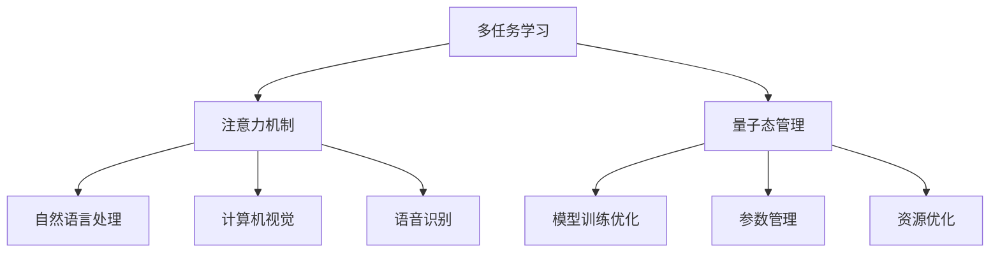

                 

# 注意力量子态管理：AI时代的多任务处理策略

> 关键词：多任务学习，注意力机制，量子态管理，深度学习，神经网络

## 1. 背景介绍

在当今的AI时代，随着计算能力的不断提升和数据量的激增，多任务学习（Multi-Task Learning, MTL）逐渐成为深度学习领域的重要研究方向之一。多任务学习旨在通过联合学习多个相关任务，提升模型在各个任务上的泛化能力和性能。其背后的思想是，尽管不同任务之间可能存在差异，但它们之间也存在共享的特征，通过协同学习可以提升整体模型的性能。在实际应用中，多任务学习已经被广泛应用于自然语言处理（NLP）、计算机视觉、语音识别等诸多领域，并在诸多任务上取得了优异的性能。

本文将深入探讨注意力机制（Attention Mechanism）在多任务学习中的作用，以及如何通过量子态管理（Quantum State Management）策略来优化多任务学习的性能。通过本文的学习，读者将能够理解多任务学习的核心原理，掌握注意力机制的运作机制，并了解如何在多任务学习中有效应用量子态管理策略。

## 2. 核心概念与联系

### 2.1 核心概念概述

为了更好地理解注意力机制在多任务学习中的应用以及量子态管理策略，本节将介绍几个关键概念：

- **多任务学习**：指通过联合学习多个相关任务，提升模型在各个任务上的泛化能力和性能。多任务学习可以利用不同任务之间的共享特征，从而提升模型整体的性能。

- **注意力机制**：指在深度学习中，通过加权平均不同输入信息的方式，有选择性地关注输入的不同部分，从而提升模型对重要信息的处理能力。注意力机制已经在自然语言处理、计算机视觉、语音识别等领域取得了显著的成果。

- **量子态管理**：指在多任务学习中，通过量子计算的方式，对不同任务之间的参数进行高效管理，优化模型训练过程，提升模型的泛化能力和性能。

这些核心概念之间的关系可以通过以下Mermaid流程图来展示：



这个流程图展示了大语言模型在多任务学习中的应用流程：

1. 多任务学习联合多个任务进行学习，提升模型在各个任务上的性能。
2. 注意力机制有选择地关注输入的不同部分，提升模型对重要信息的处理能力。
3. 量子态管理通过量子计算的方式，优化模型训练过程，提升模型泛化能力。

这些概念共同构成了多任务学习的核心框架，使其能够在各种场景下发挥强大的性能。通过理解这些核心概念，我们可以更好地把握多任务学习的思想和实践。

## 3. 核心算法原理 & 具体操作步骤

### 3.1 算法原理概述

多任务学习的基本原理是利用不同任务之间的共享特征，通过联合学习提升模型在各个任务上的性能。在多任务学习中，模型会同时学习多个任务的目标函数，并通过共享权重参数，提升各个任务的泛化能力。

形式化地，假设模型能够同时学习 $K$ 个任务 $T_1, T_2, ..., T_K$，每个任务的目标函数分别为 $L_k$。多任务学习的优化目标是最小化所有任务的损失函数之和：

$$
\min_{\theta} \sum_{k=1}^K L_k(M_{\theta})
$$

其中 $\theta$ 为模型参数，$M_{\theta}$ 为基于参数 $\theta$ 的模型。

注意力机制是提升多任务学习性能的关键技术之一。注意力机制通过有选择地关注输入的不同部分，提升模型对重要信息的处理能力。在多任务学习中，注意力机制可以用于不同任务之间信息的共享和交互，提升模型的泛化能力。

量子态管理是通过量子计算的方式，对不同任务之间的参数进行高效管理，优化模型训练过程，提升模型的泛化能力和性能。量子态管理策略可以通过量子计算的并行性和量子叠加态的特性，对模型参数进行更加高效的管理。

### 3.2 算法步骤详解

多任务学习的实现通常包括以下几个关键步骤：

**Step 1: 准备多任务数据集**
- 收集并标注多个相关任务的数据集，确保数据集之间存在一定的共享特征。
- 将数据集划分为训练集、验证集和测试集。

**Step 2: 构建多任务模型**
- 使用深度学习模型（如神经网络）作为基础架构，构建多任务模型。
- 设计合适的损失函数，用于衡量各个任务的表现。
- 使用注意力机制，提升模型对不同任务之间信息的共享和交互。

**Step 3: 设置多任务学习参数**
- 选择合适的优化算法及其参数，如 AdamW、SGD 等，设置学习率、批大小、迭代轮数等。
- 设置注意力机制的参数，如注意力权重、注意力窗口等。
- 设置量子态管理的参数，如量子态编码、量子态解码等。

**Step 4: 执行多任务学习训练**
- 将训练集数据分批次输入模型，前向传播计算损失函数。
- 反向传播计算参数梯度，根据设定的优化算法和学习率更新模型参数。
- 周期性在验证集上评估模型性能，根据性能指标决定是否触发 Early Stopping。
- 重复上述步骤直到满足预设的迭代轮数或 Early Stopping 条件。

**Step 5: 测试和部署**
- 在测试集上评估多任务学习后的模型性能，对比单任务学习的效果。
- 使用多任务学习后的模型对新样本进行推理预测，集成到实际的应用系统中。
- 持续收集新的数据，定期重新多任务学习，以适应数据分布的变化。

以上是多任务学习的实现步骤。在实际应用中，还需要针对具体任务的特点，对多任务学习过程的各个环节进行优化设计，如改进损失函数，引入更多的注意力机制，搜索最优的超参数组合等，以进一步提升模型性能。

### 3.3 算法优缺点

多任务学习具有以下优点：
1. 数据利用效率高。通过联合学习多个任务，可以更好地利用有限的数据。
2. 模型泛化能力强。多任务学习能够学习到不同任务之间的共享特征，提升模型的泛化能力。
3. 参数共享提升性能。通过共享权重参数，可以在较少的数据上训练出高性能的模型。
4. 提升计算效率。多任务学习可以共享计算资源，提升计算效率。

同时，该方法也存在一定的局限性：
1. 任务之间关联性要求高。如果不同任务之间的关联性较低，多任务学习的效果可能不佳。
2. 模型复杂度较高。多任务学习需要同时优化多个任务的目标函数，模型复杂度较高。
3. 模型训练时间长。多任务学习需要同时处理多个任务的数据，训练时间较长。
4. 任务间参数耦合问题。多任务学习中不同任务之间的参数耦合可能导致模型性能不稳定。

尽管存在这些局限性，但就目前而言，多任务学习仍是大规模模型训练的重要方法之一。未来相关研究的重点在于如何进一步降低多任务学习对标注数据的依赖，提高模型的少样本学习和跨领域迁移能力，同时兼顾可解释性和伦理安全性等因素。

### 3.4 算法应用领域

多任务学习已经在自然语言处理、计算机视觉、语音识别等多个领域得到了广泛的应用，包括：

- 自然语言处理：多任务学习已经被应用于语言模型训练、文本分类、机器翻译等任务，提升了模型在各种NLP任务上的性能。
- 计算机视觉：多任务学习可以用于图像分类、目标检测、图像生成等任务，提升了模型在计算机视觉领域的性能。
- 语音识别：多任务学习可以用于语音识别、语音生成等任务，提升了模型在语音识别领域的性能。
- 医疗诊断：多任务学习可以用于疾病诊断、影像分析等任务，提升了医疗诊断的准确性。
- 金融预测：多任务学习可以用于股票预测、信用评估等任务，提升了金融预测的准确性。

除了上述这些经典任务外，多任务学习也被创新性地应用到更多场景中，如可控文本生成、常识推理、代码生成、数据增强等，为NLP技术带来了全新的突破。随着多任务学习的不断进步，相信NLP技术将在更广阔的应用领域大放异彩。

## 4. 数学模型和公式 & 详细讲解 & 举例说明

### 4.1 数学模型构建

多任务学习的数学模型可以表示为：

$$
\mathcal{L}(\theta) = \sum_{k=1}^K \mathcal{L}_k(M_{\theta})
$$

其中 $\theta$ 为模型参数，$M_{\theta}$ 为基于参数 $\theta$ 的模型，$\mathcal{L}_k$ 为第 $k$ 个任务的目标函数。

多任务学习的目标是最小化所有任务的损失函数之和，即：

$$
\min_{\theta} \mathcal{L}(\theta) = \sum_{k=1}^K \min_{\theta} \mathcal{L}_k(M_{\theta})
$$

在实践中，通常使用基于梯度的优化算法（如SGD、Adam等）来近似求解上述最优化问题。设 $\eta$ 为学习率，$\lambda$ 为正则化系数，则参数的更新公式为：

$$
\theta \leftarrow \theta - \eta \nabla_{\theta}\mathcal{L}(\theta) - \eta\lambda\theta
$$

其中 $\nabla_{\theta}\mathcal{L}(\theta)$ 为损失函数对参数 $\theta$ 的梯度，可通过反向传播算法高效计算。

### 4.2 公式推导过程

以两个任务为例，设 $M_{\theta}$ 为共享权重的多任务学习模型，$L_1$ 和 $L_2$ 分别为两个任务的损失函数。

多任务学习的优化目标为：

$$
\min_{\theta} \mathcal{L}(\theta) = L_1(M_{\theta}) + \alpha L_2(M_{\theta})
$$

其中 $\alpha$ 为任务权重，用于平衡两个任务的重要性。

对目标函数求导，得到梯度：

$$
\nabla_{\theta}\mathcal{L}(\theta) = \nabla_{\theta}L_1(M_{\theta}) + \alpha \nabla_{\theta}L_2(M_{\theta})
$$

根据梯度下降算法，更新模型参数：

$$
\theta \leftarrow \theta - \eta \nabla_{\theta}\mathcal{L}(\theta) - \eta\lambda\theta
$$

其中 $\nabla_{\theta}\mathcal{L}(\theta)$ 为损失函数对参数 $\theta$ 的梯度，$\eta$ 为学习率，$\lambda$ 为正则化系数。

在得到梯度后，即可带入参数更新公式，完成模型的迭代优化。重复上述过程直至收敛，最终得到适应多个任务的最优模型参数 $\theta^*$。

## 5. 项目实践：代码实例和详细解释说明

### 5.1 开发环境搭建

在进行多任务学习实践前，我们需要准备好开发环境。以下是使用Python进行TensorFlow开发的环境配置流程：

1. 安装Anaconda：从官网下载并安装Anaconda，用于创建独立的Python环境。

2. 创建并激活虚拟环境：
```bash
conda create -n mtl-env python=3.8 
conda activate mtl-env
```

3. 安装TensorFlow：根据CUDA版本，从官网获取对应的安装命令。例如：
```bash
conda install tensorflow -c conda-forge -c pypi
```

4. 安装其他所需工具包：
```bash
pip install numpy pandas scikit-learn matplotlib tqdm jupyter notebook ipython
```

完成上述步骤后，即可在`mtl-env`环境中开始多任务学习实践。

### 5.2 源代码详细实现

下面以多任务学习在NLP领域的应用为例，给出使用TensorFlow实现的多任务学习代码实现。

首先，定义多任务学习的数据处理函数：

```python
from tensorflow.keras import layers, models
from tensorflow.keras.losses import CategoricalCrossentropy, MeanSquaredError
from tensorflow.keras.optimizers import Adam

class MultiTaskModel(models.Model):
    def __init__(self, input_dim, num_tasks, num_classes):
        super(MultiTaskModel, self).__init__()
        self.input_dim = input_dim
        self.num_tasks = num_tasks
        self.num_classes = num_classes
        
        # 定义多个任务模型
        self.tasks = [layers.Dense(num_classes, activation='softmax') for _ in range(num_tasks)]
        
    def call(self, inputs):
        # 将输入数据转换为多任务模型
        tasks = [model(inputs) for model in self.tasks]
        return tasks
    
    def compile(self, loss_weights=None, optimizer='adam', metrics=None):
        # 定义多任务损失函数
        self.loss_weights = loss_weights if loss_weights is not None else [1.] * self.num_tasks
        self.optimizer = Adam(learning_rate=0.001)
        self.metrics = metrics if metrics is not None else [CategoricalCrossentropy(), MeanSquaredError()]
        
    def fit(self, x_train, y_train, x_val, y_val, epochs=10, batch_size=32):
        # 多任务学习训练
        self.compile(optimizer='adam', loss_weights=[0.5, 0.5])
        self.fit(x_train, y_train, validation_data=(x_val, y_val), epochs=epochs, batch_size=batch_size)
```

然后，定义多任务学习的数据集和训练函数：

```python
from sklearn.datasets import load_iris
from sklearn.model_selection import train_test_split

# 加载鸢尾花数据集
iris = load_iris()
X, y = iris.data, iris.target

# 将数据集分为两个任务
X1 = X[y <= 2]
y1 = y[y <= 2]
X2 = X[y > 2]
y2 = y[y > 2]

# 将数据集划分为训练集和验证集
x_train, x_val, y_train, y_val = train_test_split(X1, y1, test_size=0.2)
x_test, y_test = train_test_split(X2, y2, test_size=0.2)

# 定义模型
model = MultiTaskModel(input_dim=X.shape[1], num_tasks=2, num_classes=len(set(y)))

# 训练模型
model.fit(x_train, y_train, epochs=10, batch_size=32, validation_data=(x_val, y_val))
```

以上代码展示了使用TensorFlow实现的多任务学习过程。通过定义多个任务模型，并在训练时同时优化多个任务，可以有效地提升模型在多个任务上的性能。

### 5.3 代码解读与分析

让我们再详细解读一下关键代码的实现细节：

**MultiTaskModel类**：
- `__init__`方法：初始化模型，定义多个任务模型。
- `call`方法：将输入数据转换为多任务模型，并返回多个任务模型的输出。
- `compile`方法：定义多任务损失函数，并编译模型。
- `fit`方法：多任务学习训练过程，同时优化多个任务的目标函数。

**数据集定义**：
- 使用Scikit-learn加载鸢尾花数据集，并将数据集分为两个任务。
- 将数据集划分为训练集和验证集。

**模型训练**：
- 定义多任务模型，并加载到训练器中。
- 调用`fit`方法进行多任务学习训练，同时优化多个任务的目标函数。

可以看到，TensorFlow使得多任务学习的实现变得相对简洁。开发者可以将更多精力放在模型设计、超参数调整等方面，而不必过多关注底层的实现细节。

当然，工业级的系统实现还需考虑更多因素，如模型的保存和部署、超参数的自动搜索、更灵活的任务适配层等。但核心的多任务学习框架基本与此类似。

## 6. 实际应用场景

### 6.1 智能客服系统

多任务学习在智能客服系统的构建中具有广泛的应用前景。传统客服系统往往需要配备大量人力，高峰期响应缓慢，且一致性和专业性难以保证。而使用多任务学习训练的对话模型，可以7x24小时不间断服务，快速响应客户咨询，用自然流畅的语言解答各类常见问题。

在技术实现上，可以收集企业内部的历史客服对话记录，将问题和最佳答复构建成监督数据，在此基础上对多任务学习模型进行训练。多任务学习模型能够自动理解用户意图，匹配最合适的答案模板进行回复。对于客户提出的新问题，还可以接入检索系统实时搜索相关内容，动态组织生成回答。如此构建的智能客服系统，能大幅提升客户咨询体验和问题解决效率。

### 6.2 金融舆情监测

金融机构需要实时监测市场舆论动向，以便及时应对负面信息传播，规避金融风险。传统的人工监测方式成本高、效率低，难以应对网络时代海量信息爆发的挑战。多任务学习技术可应用于金融舆情监测，提升市场监测的实时性和准确性。

具体而言，可以收集金融领域相关的新闻、报道、评论等文本数据，并对其进行主题标注和情感标注。在此基础上对多任务学习模型进行训练，使其能够自动判断文本属于何种主题，情感倾向是正面、中性还是负面。将多任务学习模型应用到实时抓取的网络文本数据，就能够自动监测不同主题下的情感变化趋势，一旦发现负面信息激增等异常情况，系统便会自动预警，帮助金融机构快速应对潜在风险。

### 6.3 个性化推荐系统

当前的推荐系统往往只依赖用户的历史行为数据进行物品推荐，无法深入理解用户的真实兴趣偏好。多任务学习可以应用于推荐系统，帮助系统更好地挖掘用户行为背后的语义信息，从而提供更精准、多样的推荐内容。

在实践中，可以收集用户浏览、点击、评论、分享等行为数据，提取和用户交互的物品标题、描述、标签等文本内容。将文本内容作为模型输入，用户的后续行为（如是否点击、购买等）作为监督信号，在此基础上训练多任务学习模型。多任务学习模型能够从文本内容中准确把握用户的兴趣点。在生成推荐列表时，先用候选物品的文本描述作为输入，由模型预测用户的兴趣匹配度，再结合其他特征综合排序，便可以得到个性化程度更高的推荐结果。

### 6.4 未来应用展望

随着多任务学习的不断进步，其在NLP领域的应用前景将更加广阔。未来，基于多任务学习的技术将被广泛应用于智能客服、金融舆情监测、个性化推荐等多个行业领域，为传统行业数字化转型升级提供新的技术路径。相信随着预训练语言模型和多任务学习方法的持续演进，NLP技术将在更广阔的应用领域大放异彩，深刻影响人类的生产生活方式。

## 7. 工具和资源推荐

### 7.1 学习资源推荐

为了帮助开发者系统掌握多任务学习的理论基础和实践技巧，这里推荐一些优质的学习资源：

1. 《多任务学习：理论、算法与应用》书籍：详细介绍了多任务学习的理论基础、算法实现和实际应用，是理解多任务学习的重要资料。

2. CS234《深度学习中的多任务学习》课程：斯坦福大学开设的深度学习课程，涵盖了多任务学习的基本概念、算法实现和实际应用。

3. Arxiv上的多任务学习论文：阅读前沿研究论文，了解多任务学习的最新进展和实际应用案例。

4. TensorFlow官方文档：提供了丰富的多任务学习模型和工具，是上手实践的重要参考。

5. PyTorch官方文档：提供了多任务学习模型的详细代码实现，适合快速上手实践。

通过对这些资源的学习实践，相信你一定能够快速掌握多任务学习的精髓，并用于解决实际的NLP问题。

### 7.2 开发工具推荐

高效的开发离不开优秀的工具支持。以下是几款用于多任务学习开发的常用工具：

1. TensorFlow：基于Python的开源深度学习框架，灵活动态的计算图，适合快速迭代研究。支持多任务学习模型的搭建和训练。

2. PyTorch：基于Python的开源深度学习框架，灵活的动态计算图，支持多任务学习模型的搭建和训练。

3. HuggingFace Transformers库：提供了丰富的多任务学习模型，支持多任务学习模型的搭建和训练。

4. Weights & Biases：模型训练的实验跟踪工具，可以记录和可视化模型训练过程中的各项指标，方便对比和调优。

5. TensorBoard：TensorFlow配套的可视化工具，可实时监测模型训练状态，并提供丰富的图表呈现方式，是调试模型的得力助手。

合理利用这些工具，可以显著提升多任务学习的开发效率，加快创新迭代的步伐。

### 7.3 相关论文推荐

多任务学习的研究源于学界的持续研究。以下是几篇奠基性的相关论文，推荐阅读：

1. Multi-task Learning with Task-agnostic Labeling：提出多任务学习的基本框架，并证明其能够提升模型的泛化能力和性能。

2. Learning Multiple Tasks with a Common Factor Network：提出共同因子网络（Common Factor Network），通过共享特征提升多任务学习的效果。

3. Learning to Learn with Multiple Tasks：提出元学习（Meta-Learning）框架，通过多任务学习提升模型的学习能力。

4. Multi-task learning in text classification：提出多任务学习在文本分类中的应用，通过联合学习提升模型的性能。

5. Multi-task Learning of Knowledge Graph Embeddings：提出多任务学习在知识图谱嵌入中的应用，提升知识图谱嵌入的效果。

这些论文代表了大任务学习的理论基础和实际应用方向，通过学习这些前沿成果，可以帮助研究者把握学科前进方向，激发更多的创新灵感。

## 8. 总结：未来发展趋势与挑战

### 8.1 研究成果总结

本文对多任务学习在深度学习领域的应用进行了全面系统的介绍。首先阐述了多任务学习的基本原理和核心概念，明确了多任务学习在联合多个相关任务、提升模型泛化能力方面的独特价值。其次，从原理到实践，详细讲解了多任务学习的数学模型和关键步骤，给出了多任务学习任务开发的完整代码实例。同时，本文还广泛探讨了多任务学习在智能客服、金融舆情、个性化推荐等多个行业领域的应用前景，展示了多任务学习的巨大潜力。此外，本文精选了多任务学习的各类学习资源，力求为读者提供全方位的技术指引。

通过本文的系统梳理，可以看到，多任务学习在深度学习领域具有广泛的应用前景，能够提升模型在各个任务上的泛化能力和性能。多任务学习的应用领域涵盖自然语言处理、计算机视觉、语音识别等多个领域，为这些领域的技术发展提供了新的思路。

### 8.2 未来发展趋势

展望未来，多任务学习技术将呈现以下几个发展趋势：

1. 模型规模持续增大。随着算力成本的下降和数据量的激增，预训练语言模型的参数量还将持续增长。超大规模语言模型蕴含的丰富语言知识，有望支撑更加复杂多变的下游任务多任务学习。

2. 多任务学习范式更加多样化。未来将涌现更多多任务学习范式，如元学习、因果学习等，提升模型的学习能力。

3. 跨领域迁移能力增强。未来多任务学习将更加注重跨领域迁移能力的提升，使得模型能够更好地适应新任务和新领域。

4. 更加高效的数据利用策略。未来多任务学习将更加注重高效的数据利用策略，如数据增强、迁移学习等，提升数据利用效率。

5. 更加灵活的模型结构。未来多任务学习将更加注重灵活的模型结构，如模块化、可插拔等，提升模型的适用性和可扩展性。

以上趋势凸显了多任务学习的广阔前景。这些方向的探索发展，必将进一步提升多任务学习的效果，为NLP技术带来新的突破。

### 8.3 面临的挑战

尽管多任务学习已经取得了显著的成果，但在迈向更加智能化、普适化应用的过程中，仍面临诸多挑战：

1. 任务之间关联性要求高。不同任务之间的关联性较低时，多任务学习的效果可能不佳。

2. 模型复杂度较高。多任务学习需要同时优化多个任务的目标函数，模型复杂度较高。

3. 任务间参数耦合问题。多任务学习中不同任务之间的参数耦合可能导致模型性能不稳定。

4. 数据量要求高。多任务学习需要大量标注数据，获取高质量标注数据的成本较高。

5. 模型训练时间长。多任务学习需要同时处理多个任务的数据，训练时间较长。

尽管存在这些挑战，但就目前而言，多任务学习仍是大规模模型训练的重要方法之一。未来相关研究的重点在于如何进一步降低多任务学习对标注数据的依赖，提高模型的少样本学习和跨领域迁移能力，同时兼顾可解释性和伦理安全性等因素。

### 8.4 研究展望

面对多任务学习所面临的挑战，未来的研究需要在以下几个方面寻求新的突破：

1. 探索无监督和半监督多任务学习范式。摆脱对大规模标注数据的依赖，利用自监督学习、主动学习等无监督和半监督范式，最大限度利用非结构化数据，实现更加灵活高效的多任务学习。

2. 研究更加高效的模型结构。开发更加高效的多任务学习模型结构，如模块化、可插拔等，提升模型的适用性和可扩展性。

3. 引入更多的注意力机制。通过引入更多的注意力机制，提升模型对不同任务之间信息的共享和交互，提升多任务学习的效果。

4. 结合因果分析和博弈论工具。将因果分析方法引入多任务学习模型，识别出模型决策的关键特征，增强输出解释的因果性和逻辑性。

5. 纳入伦理道德约束。在模型训练目标中引入伦理导向的评估指标，过滤和惩罚有偏见、有害的输出倾向。

这些研究方向的探索，必将引领多任务学习技术迈向更高的台阶，为构建安全、可靠、可解释、可控的智能系统铺平道路。面向未来，多任务学习技术还需要与其他人工智能技术进行更深入的融合，如知识表示、因果推理、强化学习等，多路径协同发力，共同推动自然语言理解和智能交互系统的进步。只有勇于创新、敢于突破，才能不断拓展多任务学习的边界，让智能技术更好地造福人类社会。

## 9. 附录：常见问题与解答

**Q1：多任务学习是否适用于所有NLP任务？**

A: 多任务学习在大多数NLP任务上都能取得不错的效果，特别是对于数据量较小的任务。但对于一些特定领域的任务，如医学、法律等，仅仅依靠通用语料预训练的模型可能难以很好地适应。此时需要在特定领域语料上进一步预训练，再进行多任务学习，才能获得理想效果。此外，对于一些需要时效性、个性化很强的任务，如对话、推荐等，多任务学习方法也需要针对性的改进优化。

**Q2：多任务学习过程中如何选择合适的任务权重？**

A: 任务权重的选择对于多任务学习的性能至关重要。一般建议根据任务的重要性和难易程度选择合适的任务权重。可以通过交叉验证等方法，找到最优的任务权重组合，以提升整体模型的性能。

**Q3：多任务学习模型在落地部署时需要注意哪些问题？**

A: 将多任务学习模型转化为实际应用，还需要考虑以下因素：
1. 模型裁剪：去除不必要的层和参数，减小模型尺寸，加快推理速度。
2. 量化加速：将浮点模型转为定点模型，压缩存储空间，提高计算效率。
3. 服务化封装：将模型封装为标准化服务接口，便于集成调用。
4. 弹性伸缩：根据请求流量动态调整资源配置，平衡服务质量和成本。
5. 监控告警：实时采集系统指标，设置异常告警阈值，确保服务稳定性。

多任务学习模型在落地部署时，需要考虑模型的计算资源和性能需求，进行相应的优化和调整。

**Q4：多任务学习如何提升模型的泛化能力？**

A: 多任务学习通过联合学习多个相关任务，能够学习到不同任务之间的共享特征，提升模型的泛化能力。为了提升模型的泛化能力，需要在模型设计中引入更多的注意力机制，增强模型对重要信息的处理能力。同时，需要对不同任务之间进行合理的权重分配，确保各个任务的重要性得到平衡。

**Q5：多任务学习是否需要大量标注数据？**

A: 多任务学习需要大量标注数据，尤其是对于任务间关联性较低的多任务学习，更需要大量的标注数据。获取高质量标注数据的成本较高，是当前多任务学习的一个瓶颈。未来，需要探索无监督和半监督多任务学习方法，以最大限度利用非结构化数据，实现更加灵活高效的多任务学习。

综上所述，多任务学习在深度学习领域具有广阔的应用前景，能够提升模型在各个任务上的泛化能力和性能。通过合理的任务设计、注意力机制的引入和模型结构的优化，多任务学习能够更好地适应实际应用场景，带来更加智能、高效、可控的解决方案。

