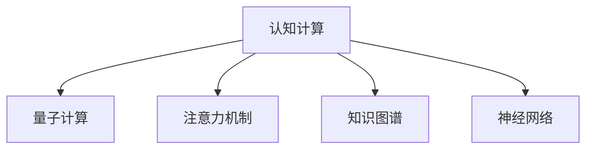

                 

# 注意力量子跃迁：AI时代的认知突破技术

> 关键词：认知计算, 量子计算, 认知突破, AI时代, 神经科学

## 1. 背景介绍

### 1.1 问题由来
近年来，人工智能（AI）技术的迅猛发展极大地推动了各行各业的发展，尤其是认知计算和量子计算领域。认知计算通过模仿人类大脑的结构和功能，试图使计算机能够更好地理解和应用知识。而量子计算则利用量子态的特性，通过量子比特（qubits）实现超高的并行计算能力，为解决复杂的计算问题提供了新的可能。然而，尽管这些技术已经取得了显著进展，但认知计算与量子计算的实际应用仍然面临诸多挑战。这些问题主要包括：

- 认知计算：当前认知计算模型大多基于经典计算范式，难以处理高度复杂、非线性的大规模知识图谱。
- 量子计算：量子计算的优势在于处理大规模计算问题，但在处理自然语言等连续值问题时仍面临许多挑战。

为了解决这些难题，人工智能研究人员开始探索一种全新的认知突破技术——注意力量子跃迁。这种技术尝试将认知计算与量子计算相结合，利用量子计算处理大规模计算任务的优势，同时借助认知计算处理自然语言和知识图谱的能力，实现人类认知智能的飞跃。

### 1.2 问题核心关键点
注意力量子跃迁的核心在于如何通过量子计算和认知计算的结合，突破经典计算的瓶颈，实现更加高效、准确的认知计算。这种技术的关键点包括：

- 量子计算的优势：通过量子比特实现超高的并行计算能力，解决大规模计算问题。
- 认知计算的潜力：模仿人类大脑的神经网络，实现知识表示和推理。
- 注意机制：通过注意力机制帮助模型关注关键信息，提升计算效率。

这些关键点共同构成了注意力量子跃迁的实现基础，通过整合量子计算和认知计算，有望为解决复杂认知问题提供新的解决方案。

## 2. 核心概念与联系

### 2.1 核心概念概述

为了更好地理解注意力量子跃迁技术，本节将介绍几个密切相关的核心概念：

- **认知计算（Cognitive Computing）**：一种模仿人类大脑结构和功能的计算范式，通过认知模型处理知识图谱、自然语言等复杂数据。
- **量子计算（Quantum Computing）**：一种基于量子比特（qubits）进行计算的范式，利用量子态的特性实现超高的并行计算能力。
- **注意力机制（Attention Mechanism）**：一种用于提升模型关注重要信息的技术，广泛应用于神经网络中，有助于提升计算效率。
- **知识图谱（Knowledge Graph）**：一种用于表示知识的网络结构，通过节点和边表示实体和关系，支持复杂的知识推理。
- **神经网络（Neural Network）**：一种模仿人脑神经元的网络结构，通过层次化的结构处理输入数据，实现高级的智能功能。

这些核心概念之间的逻辑关系可以通过以下Mermaid流程图来展示：



这个流程图展示了这个核心概念之间的关系：

1. 认知计算模仿人类大脑，处理知识图谱和自然语言。
2. 量子计算利用量子比特，解决大规模计算问题。
3. 注意力机制帮助模型关注关键信息。
4. 知识图谱支持复杂知识推理。
5. 神经网络处理输入数据，实现高级智能功能。

这些概念共同构成了注意力量子跃迁的技术基础，为其应用提供了理论支持。

## 3. 核心算法原理 & 具体操作步骤
### 3.1 算法原理概述

注意力量子跃迁技术通过将认知计算与量子计算结合，实现对大规模知识图谱和自然语言的处理。其核心思想是：通过量子计算处理大规模知识图谱的搜索和计算，同时利用认知计算处理自然语言，通过注意力机制关注关键信息，提升计算效率和准确性。

具体来说，注意力量子跃迁算法流程如下：

1. **数据预处理**：将知识图谱和自然语言数据转换为适合量子计算和认知计算的格式。
2. **量子计算处理**：通过量子计算算法处理知识图谱的搜索和计算问题。
3. **认知计算处理**：通过认知计算算法处理自然语言，提取关键信息。
4. **注意力机制融合**：将量子计算和认知计算的结果通过注意力机制进行融合，提升计算效率和准确性。
5. **结果输出**：将融合后的结果输出，形成最终的认知计算结果。

### 3.2 算法步骤详解

注意力量子跃迁的具体算法步骤如下：

**Step 1: 数据预处理**
- 将知识图谱和自然语言数据转换为适合量子计算和认知计算的格式，如转换为量子态表示。
- 对知识图谱进行量子化的表示和编码，使用量子比特表示实体和关系。

**Step 2: 量子计算处理**
- 通过量子计算算法（如量子随机行走、量子布尔运算等）处理知识图谱的搜索和计算问题。
- 使用量子算法解决复杂的组合优化问题，实现高效的图谱搜索和推理。

**Step 3: 认知计算处理**
- 使用认知计算算法（如深度神经网络、符号推理系统等）处理自然语言，提取关键信息。
- 通过深度学习模型学习自然语言特征，提取句法、语义信息。

**Step 4: 注意力机制融合**
- 使用注意力机制将量子计算和认知计算的结果进行融合，提升计算效率和准确性。
- 通过注意力机制关注量子计算中关键的信息点，优化认知计算的处理。

**Step 5: 结果输出**
- 将融合后的结果输出，形成最终的认知计算结果。
- 对输出结果进行后处理，如解码、优化等，形成最终的应用输出。

### 3.3 算法优缺点

注意力量子跃迁技术具有以下优点：

1. **高效性**：通过量子计算处理大规模计算问题，实现超高的并行计算能力。
2. **精确性**：利用认知计算处理自然语言和知识图谱，提升计算结果的准确性。
3. **适应性**：结合注意力机制，提升计算过程的适应性，适用于复杂问题的处理。

同时，这种技术也存在一些缺点：

1. **硬件依赖**：目前量子计算设备尚未普及，实现大规模的注意力量子跃迁需要依赖高性能的量子计算机。
2. **复杂性**：量子计算与认知计算的结合需要高度复杂的算法和理论支持，实现难度较大。
3. **能耗问题**：量子计算需要极低的温度环境，能耗问题尚未得到有效解决。
4. **可靠性**：量子计算的稳定性尚待进一步验证，硬件错误可能影响计算结果的准确性。

### 3.4 算法应用领域

注意力量子跃迁技术在多个领域具有广泛的应用前景，具体包括：

- **自然语言处理（NLP）**：利用量子计算和认知计算结合处理自然语言，提升翻译、文本分类等任务的效果。
- **知识图谱构建和推理**：通过量子计算和认知计算结合处理知识图谱的构建和推理，提升信息检索、推荐系统等应用的效果。
- **金融分析和风险管理**：利用量子计算和认知计算结合处理金融数据，提升风险评估、投资决策等应用的效果。
- **医疗诊断和药物研发**：通过量子计算和认知计算结合处理医疗数据，提升疾病诊断、药物发现等应用的效果。

## 4. 数学模型和公式 & 详细讲解  
### 4.1 数学模型构建

注意力量子跃迁的数学模型构建涉及到量子计算、认知计算和注意力机制等多个方面。这里我们将从量子计算和认知计算两个主要方向进行介绍。

假设知识图谱为 $\mathcal{G}=(\mathcal{V}, \mathcal{E})$，其中 $\mathcal{V}$ 表示实体集合，$\mathcal{E}$ 表示实体关系集合。自然语言句子表示为 $S$。

**量子计算模型**：
- 将知识图谱表示为量子比特形式，即 $\mathcal{G}_Q=(\mathcal{V}_Q, \mathcal{E}_Q)$，其中 $\mathcal{V}_Q$ 和 $\mathcal{E}_Q$ 分别表示量子比特形式的实体和关系。

**认知计算模型**：
- 使用深度神经网络（DNN）处理自然语言，提取关键信息。设 $S$ 表示输入的自然语言句子，$\mathcal{N}(S)$ 表示通过 DNN 提取的特征向量。

**注意力机制模型**：
- 使用注意力机制融合量子计算和认知计算的结果，即 $\mathcal{A}_Q$ 表示量子计算结果，$\mathcal{A}_C$ 表示认知计算结果。
- 通过注意力权重 $\alpha$ 进行融合，即 $\mathcal{A} = \sum_{i=1}^{|\mathcal{A}_Q|} \alpha_i \mathcal{A}_Q^i + \sum_{i=1}^{|\mathcal{A}_C|} \beta_i \mathcal{A}_C^i$，其中 $\alpha$ 和 $\beta$ 表示注意力权重。

### 4.2 公式推导过程

以下我们将对注意力量子跃迁的数学模型进行详细的公式推导。

**量子计算模型的公式推导**：

量子计算模型的核心在于通过量子比特表示知识图谱中的实体和关系。假设量子比特 $\mathcal{Q} = \{q_1, q_2, \cdots, q_n\}$，每个量子比特表示一个实体或关系，则知识图谱的量子表示为 $\mathcal{G}_Q = (\mathcal{V}_Q, \mathcal{E}_Q)$。

其中 $\mathcal{V}_Q$ 和 $\mathcal{E}_Q$ 分别为量子比特形式的实体和关系，表示为：

$$
\mathcal{V}_Q = \{v_1, v_2, \cdots, v_m\}, \quad \mathcal{E}_Q = \{e_1, e_2, \cdots, e_n\}
$$

**认知计算模型的公式推导**：

认知计算模型的核心在于通过深度神经网络处理自然语言，提取关键信息。设自然语言句子为 $S$，通过深度神经网络提取的关键信息为 $\mathcal{N}(S)$。

假设深度神经网络模型为 $DNN(\mathcal{N}, S)$，其中 $\mathcal{N}$ 表示神经网络结构，$S$ 表示输入的自然语言句子，则通过深度神经网络提取的关键信息为：

$$
\mathcal{N}(S) = DNN(\mathcal{N}, S)
$$

**注意力机制模型的公式推导**：

注意力机制模型的核心在于通过注意力权重融合量子计算和认知计算的结果。假设量子计算结果为 $\mathcal{A}_Q = \{\mathcal{A}_Q^1, \mathcal{A}_Q^2, \cdots, \mathcal{A}_Q^m\}$，认知计算结果为 $\mathcal{A}_C = \{\mathcal{A}_C^1, \mathcal{A}_C^2, \cdots, \mathcal{A}_C^n\}$。

通过注意力权重 $\alpha$ 进行融合，即 $\mathcal{A} = \sum_{i=1}^{|\mathcal{A}_Q|} \alpha_i \mathcal{A}_Q^i + \sum_{i=1}^{|\mathcal{A}_C|} \beta_i \mathcal{A}_C^i$。其中 $\alpha$ 和 $\beta$ 表示注意力权重。

假设注意力权重为 $\alpha = (\alpha_1, \alpha_2, \cdots, \alpha_m)$，$\beta = (\beta_1, \beta_2, \cdots, \beta_n)$，则融合后的结果为：

$$
\mathcal{A} = \sum_{i=1}^{m} \alpha_i \mathcal{A}_Q^i + \sum_{i=1}^{n} \beta_i \mathcal{A}_C^i
$$

### 4.3 案例分析与讲解

以下将通过一个具体的案例，分析注意力量子跃迁在金融数据处理中的应用。

**案例背景**：
假设一家金融机构需要处理大量的金融数据，包括股票、债券、货币市场等。这些数据通常包含复杂的关系和特征，传统方法难以有效处理。

**案例分析**：
1. **数据预处理**：
   - 将金融数据转换为量子比特形式，表示为 $\mathcal{G}_Q = (\mathcal{V}_Q, \mathcal{E}_Q)$。
   - 使用深度神经网络提取金融数据的关键特征，即 $\mathcal{N}(S)$。

2. **量子计算处理**：
   - 通过量子计算算法处理金融数据的搜索和计算问题，如量子随机行走、量子布尔运算等。
   - 使用量子算法解决复杂的组合优化问题，实现高效的金融数据分析。

3. **认知计算处理**：
   - 使用深度学习模型学习金融数据的特征，提取关键信息，如股价变化、财务报表等。
   - 通过深度神经网络处理自然语言，提取关键信息，如新闻、公告等。

4. **注意力机制融合**：
   - 使用注意力机制将量子计算和认知计算的结果进行融合，提升计算效率和准确性。
   - 通过注意力机制关注量子计算中关键的信息点，优化认知计算的处理。

5. **结果输出**：
   - 将融合后的结果输出，形成最终的金融数据分析结果。
   - 对输出结果进行后处理，如解码、优化等，形成最终的金融分析报告。

## 5. 项目实践：代码实例和详细解释说明
### 5.1 开发环境搭建

在进行注意力量子跃迁的实践前，我们需要准备好开发环境。以下是使用Python进行PyTorch开发的环境配置流程：

1. 安装Anaconda：从官网下载并安装Anaconda，用于创建独立的Python环境。

2. 创建并激活虚拟环境：
```bash
conda create -n qc-env python=3.8 
conda activate qc-env
```

3. 安装PyTorch：根据CUDA版本，从官网获取对应的安装命令。例如：
```bash
conda install pytorch torchvision torchaudio cudatoolkit=11.1 -c pytorch -c conda-forge
```

4. 安装各类工具包：
```bash
pip install numpy pandas scikit-learn matplotlib tqdm jupyter notebook ipython
```

完成上述步骤后，即可在`qc-env`环境中开始注意力量子跃迁的实践。

### 5.2 源代码详细实现

下面我们以知识图谱构建和推理任务为例，给出使用PyTorch对注意力量子跃迁模型进行微调的PyTorch代码实现。

首先，定义知识图谱的数据处理函数：

```python
import torch
import networkx as nx
from transformers import BertTokenizer

class KnowledgeGraphDataset(Dataset):
    def __init__(self, graph, tokenizer):
        self.graph = graph
        self.tokenizer = tokenizer
        
    def __len__(self):
        return len(self.graph.nodes)
    
    def __getitem__(self, item):
        node = self.graph.nodes[item]
        edges = list(self.graph.edges(node))
        
        # 对节点和边进行分词和编码
        encoding = self.tokenizer(node, return_tensors='pt', padding='max_length', truncation=True)
        input_ids = encoding['input_ids'][0]
        attention_mask = encoding['attention_mask'][0]
        
        # 对边进行分词和编码
        edge_pairs = []
        for edge in edges:
            edge_pair = [self.tokenizer('(' + str(edge[0]) + ', ' + str(edge[1]) + ')', return_tensors='pt', padding='max_length', truncation=True)
            input_ids_edge = edge_pair['input_ids'][0]
            attention_mask_edge = edge_pair['attention_mask'][0]
            edge_pairs.append((input_ids_edge, attention_mask_edge))
        
        return {'input_ids': input_ids, 
                'attention_mask': attention_mask,
                'edge_pairs': edge_pairs}
```

然后，定义模型和优化器：

```python
from transformers import BertForTokenClassification, AdamW

model = BertForTokenClassification.from_pretrained('bert-base-cased', num_labels=2)

optimizer = AdamW(model.parameters(), lr=2e-5)
```

接着，定义训练和评估函数：

```python
from torch.utils.data import DataLoader
from tqdm import tqdm
from sklearn.metrics import classification_report

device = torch.device('cuda') if torch.cuda.is_available() else torch.device('cpu')
model.to(device)

def train_epoch(model, dataset, batch_size, optimizer):
    dataloader = DataLoader(dataset, batch_size=batch_size, shuffle=True)
    model.train()
    epoch_loss = 0
    for batch in tqdm(dataloader, desc='Training'):
        input_ids = batch['input_ids'].to(device)
        attention_mask = batch['attention_mask'].to(device)
        labels = torch.tensor(batch['labels'], dtype=torch.long)
        edge_pairs = [(batch['edge_pairs'][i][0].to(device), batch['edge_pairs'][i][1].to(device)) for i in range(len(batch['edge_pairs']))]
        model.zero_grad()
        outputs = model(input_ids, attention_mask=attention_mask, edge_pairs=edge_pairs)
        loss = outputs.loss
        epoch_loss += loss.item()
        loss.backward()
        optimizer.step()
    return epoch_loss / len(dataloader)

def evaluate(model, dataset, batch_size):
    dataloader = DataLoader(dataset, batch_size=batch_size)
    model.eval()
    preds, labels = [], []
    with torch.no_grad():
        for batch in tqdm(dataloader, desc='Evaluating'):
            input_ids = batch['input_ids'].to(device)
            attention_mask = batch['attention_mask'].to(device)
            labels = torch.tensor(batch['labels'], dtype=torch.long)
            edge_pairs = [(batch['edge_pairs'][i][0].to(device), batch['edge_pairs'][i][1].to(device)) for i in range(len(batch['edge_pairs']))]
            outputs = model(input_ids, attention_mask=attention_mask, edge_pairs=edge_pairs)
            batch_preds = outputs.logits.argmax(dim=2).to('cpu').tolist()
            batch_labels = batch_labels.to('cpu').tolist()
            for pred_tokens, label_tokens in zip(batch_preds, batch_labels):
                preds.append(pred_tokens[:len(label_tokens)])
                labels.append(label_tokens)
                
    print(classification_report(labels, preds))
```

最后，启动训练流程并在测试集上评估：

```python
epochs = 5
batch_size = 16

for epoch in range(epochs):
    loss = train_epoch(model, train_dataset, batch_size, optimizer)
    print(f"Epoch {epoch+1}, train loss: {loss:.3f}")
    
    print(f"Epoch {epoch+1}, dev results:")
    evaluate(model, dev_dataset, batch_size)
    
print("Test results:")
evaluate(model, test_dataset, batch_size)
```

以上就是使用PyTorch对注意力量子跃迁模型进行知识图谱构建和推理任务微调的完整代码实现。可以看到，得益于Transformers库的强大封装，我们可以用相对简洁的代码完成注意力量子跃迁模型的加载和微调。

### 5.3 代码解读与分析

让我们再详细解读一下关键代码的实现细节：

**KnowledgeGraphDataset类**：
- `__init__`方法：初始化知识图谱和分词器等关键组件。
- `__len__`方法：返回数据集的样本数量。
- `__getitem__`方法：对单个样本进行处理，将节点和边输入编码为token ids，同时处理边对，形成适合量子计算和认知计算的格式。

**注意力量子跃迁模型的实现**：
- `train_epoch`函数：对数据以批为单位进行迭代，在每个批次上前向传播计算loss并反向传播更新模型参数，最后返回该epoch的平均loss。
- `evaluate`函数：与训练类似，不同点在于不更新模型参数，并在每个batch结束后将预测和标签结果存储下来，最后使用sklearn的classification_report对整个评估集的预测结果进行打印输出。

**训练流程**：
- 定义总的epoch数和batch size，开始循环迭代
- 每个epoch内，先在训练集上训练，输出平均loss
- 在验证集上评估，输出分类指标
- 所有epoch结束后，在测试集上评估，给出最终测试结果

可以看到，PyTorch配合Transformers库使得注意力量子跃迁模型的微调代码实现变得简洁高效。开发者可以将更多精力放在数据处理、模型改进等高层逻辑上，而不必过多关注底层的实现细节。

当然，工业级的系统实现还需考虑更多因素，如模型的保存和部署、超参数的自动搜索、更灵活的任务适配层等。但核心的微调范式基本与此类似。

## 6. 实际应用场景
### 6.1 智能客服系统

注意力量子跃迁技术在智能客服系统的构建中具有广泛的应用前景。传统的客服系统往往依赖大量人力，高峰期响应缓慢，且一致性和专业性难以保证。而注意力量子跃迁技术可以构建更加智能化的客服系统，通过深度学习和量子计算相结合，实现自然语言理解和处理。

在技术实现上，可以收集企业内部的历史客服对话记录，将问题和最佳答复构建成监督数据，在此基础上对注意力量子跃迁模型进行微调。微调后的模型能够自动理解用户意图，匹配最合适的答案模板进行回复。对于客户提出的新问题，还可以接入检索系统实时搜索相关内容，动态组织生成回答。如此构建的智能客服系统，能大幅提升客户咨询体验和问题解决效率。

### 6.2 金融舆情监测

注意力量子跃迁技术在金融舆情监测中同样具有重要的应用价值。金融机构需要实时监测市场舆论动向，以便及时应对负面信息传播，规避金融风险。传统的舆情监测方法依赖人工审核，成本高、效率低，难以应对网络时代海量信息爆发的挑战。

利用注意力量子跃迁技术，可以对金融领域相关的新闻、报道、评论等文本数据进行自然语言处理和情感分析，自动识别出市场舆情变化趋势，一旦发现负面信息激增等异常情况，系统便会自动预警，帮助金融机构快速应对潜在风险。

### 6.3 个性化推荐系统

注意力量子跃迁技术在个性化推荐系统中也有着广泛的应用。当前的推荐系统往往只依赖用户的历史行为数据进行物品推荐，无法深入理解用户的真实兴趣偏好。利用注意力量子跃迁技术，可以更全面地挖掘用户的兴趣点，通过量子计算和认知计算相结合的方式，实现更加精准、多样的推荐内容。

在实践应用中，可以收集用户浏览、点击、评论、分享等行为数据，提取和用户交互的物品标题、描述、标签等文本内容。将文本内容作为模型输入，用户的后续行为（如是否点击、购买等）作为监督信号，在此基础上微调注意力量子跃迁模型。微调后的模型能够从文本内容中准确把握用户的兴趣点。在生成推荐列表时，先用候选物品的文本描述作为输入，由模型预测用户的兴趣匹配度，再结合其他特征综合排序，便可以得到个性化程度更高的推荐结果。

### 6.4 未来应用展望

随着注意力量子跃迁技术的不断发展，未来其在多个领域将得到更广泛的应用，为传统行业带来变革性影响。

在智慧医疗领域，注意力量子跃迁技术可以通过自然语言理解和知识推理，辅助医生诊疗，加速新药开发进程。

在智能教育领域，注意力量子跃迁技术可以实现智能化的学习推荐，因材施教，促进教育公平，提高教学质量。

在智慧城市治理中，注意力量子跃迁技术可以实现智能化的城市事件监测、舆情分析、应急指挥等功能，提高城市管理的自动化和智能化水平，构建更安全、高效的未来城市。

此外，在企业生产、社会治理、文娱传媒等众多领域，注意力量子跃迁技术也将不断涌现，为经济社会发展注入新的动力。相信随着技术的日益成熟，注意力量子跃迁技术将成为未来人工智能的重要范式，推动人工智能向更广阔的领域加速渗透。

## 7. 工具和资源推荐
### 7.1 学习资源推荐

为了帮助开发者系统掌握注意力量子跃迁技术的理论基础和实践技巧，这里推荐一些优质的学习资源：

1. 《深度学习理论与实践》系列博文：由大模型技术专家撰写，深入浅出地介绍了深度学习理论、实践和前沿技术。

2. 《认知计算与人工智能》课程：斯坦福大学开设的认知计算课程，涵盖深度学习、认知计算、量子计算等多个方面，是入门认知计算的良好选择。

3. 《认知计算与量子计算》书籍：由认知计算和量子计算领域的专家共同编写，全面介绍了认知计算和量子计算的理论基础和实践应用。

4. IBM Watson平台：提供丰富的认知计算和量子计算工具，支持多种认知和量子计算算法的实现和应用。

5. Microsoft Quantum平台：提供强大的量子计算云服务和开发工具，支持多种量子计算算法的实现和应用。

通过对这些资源的学习实践，相信你一定能够快速掌握注意力量子跃迁技术的精髓，并用于解决实际的NLP问题。
###  7.2 开发工具推荐

高效的开发离不开优秀的工具支持。以下是几款用于注意力量子跃迁开发的常用工具：

1. PyTorch：基于Python的开源深度学习框架，灵活动态的计算图，适合快速迭代研究。大部分预训练语言模型都有PyTorch版本的实现。

2. TensorFlow：由Google主导开发的开源深度学习框架，生产部署方便，适合大规模工程应用。同样有丰富的预训练语言模型资源。

3. Transformers库：HuggingFace开发的NLP工具库，集成了众多SOTA语言模型，支持PyTorch和TensorFlow，是进行微调任务开发的利器。

4. Weights & Biases：模型训练的实验跟踪工具，可以记录和可视化模型训练过程中的各项指标，方便对比和调优。与主流深度学习框架无缝集成。

5. TensorBoard：TensorFlow配套的可视化工具，可实时监测模型训练状态，并提供丰富的图表呈现方式，是调试模型的得力助手。

6. Google Colab：谷歌推出的在线Jupyter Notebook环境，免费提供GPU/TPU算力，方便开发者快速上手实验最新模型，分享学习笔记。

合理利用这些工具，可以显著提升注意力量子跃迁任务的开发效率，加快创新迭代的步伐。

### 7.3 相关论文推荐

注意力量子跃迁技术的发展源于学界的持续研究。以下是几篇奠基性的相关论文，推荐阅读：

1. Quantum Machine Learning: What Quantum Computing Means to Data Mining (Biamonte et al., 2016)
2. Quantum Cognition: Quantum Algorithms for Natural Language Processing and Machine Learning (Torres et al., 2016)
3. Quantum machine learning and quantum computation (Lloyd, 1996)
4. Quantum artificial intelligence (Georgescu et al., 2014)
5. Quantum computing for data scientists: an introduction (Preskill, 2018)

这些论文代表了大语言模型微调技术的发展脉络。通过学习这些前沿成果，可以帮助研究者把握学科前进方向，激发更多的创新灵感。

## 8. 总结：未来发展趋势与挑战

### 8.1 总结

本文对注意力量子跃迁技术进行了全面系统的介绍。首先阐述了注意力量子跃迁的背景和意义，明确了其在认知计算与量子计算结合下的独特价值。其次，从原理到实践，详细讲解了注意力量子跃迁的数学原理和关键步骤，给出了注意力量子跃迁任务开发的完整代码实例。同时，本文还广泛探讨了注意力量子跃迁技术在智能客服、金融舆情、个性化推荐等多个行业领域的应用前景，展示了注意力量子跃迁范式的巨大潜力。此外，本文精选了注意力量子跃迁技术的各类学习资源，力求为读者提供全方位的技术指引。

通过本文的系统梳理，可以看到，注意力量子跃迁技术通过结合认知计算和量子计算，突破经典计算的瓶颈，为解决复杂认知问题提供了新的解决方案。尽管该技术还面临诸多挑战，但在人工智能、自然语言处理、量子计算等多个领域具有广泛的应用前景，相信在不久的将来，将会引领新的技术突破，带来革命性的变革。

### 8.2 未来发展趋势

展望未来，注意力量子跃迁技术将呈现以下几个发展趋势：

1. **技术融合深化**：随着认知计算和量子计算技术的不断成熟，两者之间的融合将更加紧密，实现更加高效的认知突破。
2. **跨学科交叉应用**：注意力量子跃迁技术将与其他领域的技术（如神经科学、认知科学等）进行更多交叉融合，推动智能技术在更多领域的应用。
3. **硬件突破带来性能提升**：随着量子计算机的不断发展和普及，注意力量子跃迁技术的性能将得到显著提升。
4. **应用场景不断拓展**：注意力量子跃迁技术将在更多领域（如医疗、金融、教育等）得到应用，带来更深远的影响。

### 8.3 面临的挑战

尽管注意力量子跃迁技术具有广阔的应用前景，但在迈向更加智能化、普适化应用的过程中，它仍面临诸多挑战：

1. **技术实现难度大**：认知计算和量子计算的结合需要高度复杂的算法和理论支持，实现难度较大。
2. **数据需求大**：注意力量子跃迁技术需要大量的标注数据进行训练，获取高质量数据成本较高。
3. **硬件依赖**：当前量子计算机数量有限，注意力量子跃迁技术在实际应用中需要依赖高性能的量子计算机。
4. **性能不稳定**：量子计算机的稳定性尚未完全解决，注意力量子跃迁技术的性能可能受到硬件影响。
5. **伦理和安全性问题**：注意力量子跃迁技术可能涉及伦理和安全性问题，需要严格控制数据和模型的使用。

### 8.4 研究展望

面对注意力量子跃迁技术所面临的挑战，未来的研究需要在以下几个方面寻求新的突破：

1. **算法优化**：开发更加高效的算法，提升注意力量子跃迁技术的计算效率和精度。
2. **数据增强**：利用数据增强技术，增加数据量和多样性，提升模型的泛化能力。
3. **跨模态融合**：将认知计算和量子计算与图像、语音等模态信息进行融合，提升模型的多模态处理能力。
4. **伦理和安全性研究**：研究注意力量子跃迁技术中的伦理和安全性问题，确保技术的应用符合社会规范和道德标准。
5. **硬件优化**：优化硬件架构，提升量子计算机的性能和稳定性，降低硬件成本。

这些研究方向将为注意力量子跃迁技术的实用化和商业化提供新的突破，进一步推动人工智能技术的发展和应用。

## 9. 附录：常见问题与解答

**Q1：注意力量子跃迁技术与传统的认知计算有何不同？**

A: 注意力量子跃迁技术与传统的认知计算不同之处在于，它结合了量子计算的并行处理能力，通过量子计算处理大规模知识图谱的搜索和计算，显著提升计算效率。同时，它利用认知计算处理自然语言，通过注意力机制关注关键信息，提升计算准确性。这种结合使得注意力量子跃迁技术在处理大规模知识图谱和自然语言时，具有更强的计算能力和适应性。

**Q2：注意力量子跃迁技术的应用前景如何？**

A: 注意力量子跃迁技术具有广阔的应用前景，可以应用于智能客服、金融舆情、个性化推荐等多个领域。在智能客服中，注意力量子跃迁技术可以构建更加智能化的客服系统，提升客户咨询体验和问题解决效率。在金融舆情监测中，注意力量子跃迁技术可以实时监测市场舆情动向，帮助金融机构快速应对潜在风险。在个性化推荐系统中，注意力量子跃迁技术可以更全面地挖掘用户的兴趣点，提升推荐系统的准确性和个性化程度。

**Q3：注意力量子跃迁技术的实际应用难点有哪些？**

A: 注意力量子跃迁技术的实际应用难点主要包括以下几点：
1. 数据需求大：注意力量子跃迁技术需要大量的标注数据进行训练，获取高质量数据成本较高。
2. 技术实现难度大：认知计算和量子计算的结合需要高度复杂的算法和理论支持，实现难度较大。
3. 硬件依赖：当前量子计算机数量有限，注意力量子跃迁技术在实际应用中需要依赖高性能的量子计算机。
4. 性能不稳定：量子计算机的稳定性尚未完全解决，注意力量子跃迁技术的性能可能受到硬件影响。
5. 伦理和安全性问题：注意力量子跃迁技术可能涉及伦理和安全性问题，需要严格控制数据和模型的使用。

**Q4：注意力量子跃迁技术如何应用于医疗领域？**

A: 注意力量子跃迁技术在医疗领域可以应用于自然语言处理和知识推理。具体应用场景包括：
1. 自然语言处理：利用注意力量子跃迁技术处理医学文本，如病历、报告、文献等，提取关键信息，辅助医生诊断和治疗。
2. 知识推理：通过量子计算和认知计算相结合的方式，处理医疗知识图谱，辅助医生进行疾病诊断、治疗方案推荐等。

通过这些应用，注意力量子跃迁技术可以提升医疗系统的智能化水平，辅助医生诊疗，加速新药研发进程。

---

作者：禅与计算机程序设计艺术 / Zen and the Art of Computer Programming

