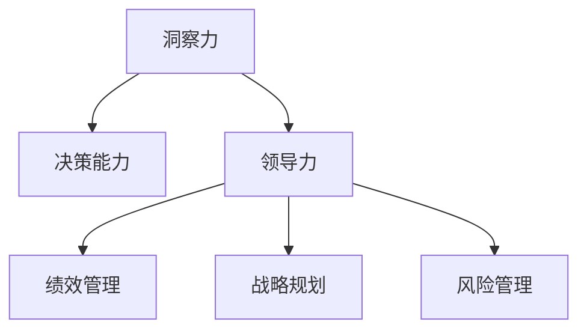

                 

# 洞察力与决策能力：领导者的核心素质

> 关键词：领导力,洞察力,决策能力,领导者的素质,企业治理,绩效管理,战略规划,风险管理

## 1. 背景介绍

### 1.1 问题由来

在快速变化的市场环境中，企业需要快速识别机会和威胁，并及时作出决策以应对挑战。有效的洞察力和决策能力是企业成功的重要保证，而领导者在这方面的素质至关重要。然而，随着技术进步和市场动态的变化，传统的领导力培养方法已无法满足现代企业的需求。

### 1.2 问题核心关键点

洞察力和决策能力是现代领导者的两大核心素质。洞察力指领导者对市场、客户需求、竞争对手等信息的敏锐感知和深刻理解。决策能力则是指领导者能基于洞察结果，合理分析并作出最优决策的能力。这两方面相辅相成，共同决定企业能否在竞争中占据优势。

### 1.3 问题研究意义

研究洞察力和决策能力，对于提升企业领导者的素质，增强企业的市场竞争力，具有重要意义：

1. 提升决策质量。领导者的洞察力和决策能力越强，企业决策的科学性和精准性越高。
2. 促进创新发展。洞察力帮助企业捕捉新机遇，决策能力则使企业能够迅速调整策略，抓住机会。
3. 优化管理效率。洞察力使领导者能及时发现问题，决策能力使领导者能快速解决问题，从而提升整体管理效率。
4. 构建团队信任。洞察力和决策能力强的领导者，能赢得团队的信任和支持，提升团队凝聚力。
5. 提高企业绩效。领导者的洞察力和决策能力直接关系到企业的市场表现和财务绩效。

## 2. 核心概念与联系

### 2.1 核心概念概述

为更好地理解洞察力和决策能力在领导者素质中的作用，本节将介绍几个密切相关的核心概念：

- 洞察力（Insight）：指领导者对企业内外环境信息的敏锐感知和深刻理解，是决策的前提和基础。
- 决策能力（Decision-Making）：指领导者基于洞察结果，合理分析并作出最优决策的能力，是洞察力的实际应用。
- 领导力（Leadership）：指领导者通过其行为和决策，引导和激励团队达成共同目标的能力。
- 绩效管理（Performance Management）：指对员工、团队、企业绩效进行管理，评估并提升其表现的过程。
- 战略规划（Strategic Planning）：指企业为实现长期目标，制定并实施全面的发展计划。
- 风险管理（Risk Management）：指识别、评估和应对企业面临的各种风险，确保企业稳健运营。

这些核心概念之间的逻辑关系可以通过以下Mermaid流程图来展示：



这个流程图展示了大语言模型的核心概念及其之间的关系：

1. 洞察力通过感知外部环境信息，为决策提供依据。
2. 决策能力基于洞察结果，实现最优决策。
3. 领导力通过指挥和激励团队，实施决策。
4. 绩效管理、战略规划和风险管理则是领导力和决策能力的实践应用，对企业运营进行综合管理。

## 3. 核心算法原理 & 具体操作步骤
### 3.1 算法原理概述

洞察力和决策能力的提升，可以通过系统化的学习和实践来实现。其核心思想是：通过多维度的学习和训练，培养领导者在市场分析、问题解决、团队协调等方面的能力，使其能够迅速、准确地作出高质量的决策。

### 3.2 算法步骤详解

基于洞察力和决策能力的提升，本节将详细讲解其核心算法步骤：

**Step 1: 数据准备**
- 收集市场、客户、竞争对手等数据，包括市场趋势、销售数据、用户反馈、行业报告等。
- 对数据进行清洗、预处理，确保数据质量和可用性。

**Step 2: 洞察力训练**
- 使用数据挖掘、文本分析等技术，分析数据中的关键信息，识别趋势和模式。
- 训练洞察力模型，如自然语言处理(NLP)、时间序列分析等，提升数据分析能力。

**Step 3: 决策能力训练**
- 设计各类模拟场景，如市场变化、产品迭代、竞争策略等，进行决策模拟训练。
- 引入优化算法，如线性规划、模拟退火、遗传算法等，优化决策过程。
- 使用评估指标，如准确率、召回率、F1-score等，评估决策效果。

**Step 4: 反馈迭代**
- 对训练结果进行反馈，调整模型和算法，提高洞察力和决策能力。
- 定期进行能力评估，识别提升空间，制定改进计划。

**Step 5: 实际应用**
- 将提升后的洞察力和决策能力应用于实际业务场景中，解决具体问题。
- 持续跟踪效果，调整和优化决策模型。

### 3.3 算法优缺点

基于洞察力和决策能力的提升，本节将详细分析其优缺点：

**优点：**
1. 系统化培养。通过有组织的训练和实践，提升领导者的素质。
2. 数据驱动决策。基于大量数据，提升决策的科学性和精准性。
3. 快速应对变化。训练后的洞察力和决策能力，能够迅速响应市场变化。
4. 提升团队能力。通过领导力的提升，增强团队协作和执行能力。

**缺点：**
1. 需要大量资源。数据收集和处理、模型训练等需要大量资源投入。
2. 模型复杂度高。训练过程复杂，需要深入掌握相关技术和方法。
3. 结果可能偏差。模型训练结果可能与实际场景存在差异，影响决策效果。
4. 持续性要求高。训练后的模型需要持续迭代和优化，保持最新状态。

### 3.4 算法应用领域

基于洞察力和决策能力的提升，本节将详细讨论其应用领域：

- 企业管理：提升企业决策的科学性和精准性，优化管理效率。
- 产品创新：通过洞察市场和客户需求，迅速推出符合市场需求的产品。
- 竞争策略：分析和预测竞争对手策略，制定有效的竞争应对措施。
- 风险管理：通过洞察力识别潜在风险，制定风险应对策略。
- 团队建设：提升领导者的团队协调和激励能力，增强团队凝聚力。
- 战略规划：基于洞察力制定和实施战略规划，实现企业长期目标。

## 4. 数学模型和公式 & 详细讲解 & 举例说明（备注：数学公式请使用latex格式，latex嵌入文中独立段落使用 $$，段落内使用 $)
### 4.1 数学模型构建

本节将使用数学语言对洞察力和决策能力的提升过程进行更加严格的刻画。

记领导者的洞察力为 $I$，决策能力为 $D$。训练模型的目标是最大化决策效果 $E$，即：

$$
\maximize E(I, D)
$$

其中 $E$ 是决策效果的评估指标，如准确率、召回率、F1-score等。

### 4.2 公式推导过程

以下我们以二分类问题为例，推导决策能力评估指标的计算公式。

假设模型在测试集上的预测结果为 $y=\{y_1, y_2, ..., y_n\}$，真实标签为 $t=\{t_1, t_2, ..., t_n\}$。则决策能力评估指标为：

$$
F1\text{-}score = 2 \cdot \frac{\text{TP}}{\text{TP} + \text{FP} + \text{FN}}
$$

其中 $\text{TP}$ 为真正例数量，$\text{FP}$ 为假正例数量，$\text{FN}$ 为假反例数量。

在得到评估指标后，即可将其作为模型训练的目标函数，优化模型的决策能力。

### 4.3 案例分析与讲解

假设某企业希望通过洞察力和决策能力的提升，优化其产品开发流程。具体步骤如下：

1. 收集历史销售数据、市场趋势和用户反馈，构建洞察力数据集。
2. 使用时间序列分析和情感分析等技术，分析数据中的关键信息，识别产品需求和市场变化。
3. 设计产品迭代场景，模拟不同市场需求下的产品优化方案，使用优化算法评估各方案的决策效果。
4. 引入F1-score作为评估指标，评估决策能力，调整优化算法和方案设计。
5. 将优化后的决策能力应用于实际产品开发中，持续跟踪效果，调整和优化决策模型。

## 5. 项目实践：代码实例和详细解释说明
### 5.1 开发环境搭建

在进行洞察力和决策能力提升的实践前，我们需要准备好开发环境。以下是使用Python进行数据分析和机器学习的开发环境配置流程：

1. 安装Anaconda：从官网下载并安装Anaconda，用于创建独立的Python环境。

2. 创建并激活虚拟环境：
```bash
conda create -n py-env python=3.8 
conda activate py-env
```

3. 安装必要的库：
```bash
conda install pandas numpy scikit-learn seaborn matplotlib jupyter notebook ipython
```

4. 安装TensorFlow和PyTorch等深度学习框架：
```bash
pip install tensorflow==2.7.0
pip install torch==1.10.0
```

完成上述步骤后，即可在`py-env`环境中开始数据分析和机器学习实践。

### 5.2 源代码详细实现

下面我们以市场趋势分析为例，给出使用Python进行洞察力和决策能力提升的代码实现。

首先，定义市场数据集：

```python
import pandas as pd
from sklearn.preprocessing import MinMaxScaler

# 加载市场数据
market_data = pd.read_csv('market_data.csv')

# 数据预处理
scaler = MinMaxScaler()
market_data['sales'] = scaler.fit_transform(market_data['sales'].values.reshape(-1, 1))

# 划分训练集和测试集
train_data = market_data.iloc[:800]
test_data = market_data.iloc[800:]
```

然后，设计洞察力训练模型：

```python
from sklearn.ensemble import RandomForestRegressor

# 定义洞察力模型
insight_model = RandomForestRegressor(n_estimators=100, random_state=42)

# 训练洞察力模型
insight_model.fit(train_data[['time', 'price']], train_data['sales'])
```

接着，设计决策能力训练模型：

```python
from sklearn.metrics import f1_score
from sklearn.model_selection import train_test_split

# 定义决策能力模型
decision_model = RandomForestClassifier(n_estimators=100, random_state=42)

# 训练决策能力模型
X_train, X_test, y_train, y_test = train_test_split(train_data[['time', 'price']], train_data['trend'], test_size=0.2)
decision_model.fit(X_train, y_train)

# 评估决策能力
y_pred = decision_model.predict(X_test)
f1_score = f1_score(y_test, y_pred, average='macro')
print('F1-score:', f1_score)
```

最后，将洞察力和决策能力应用于实际业务场景：

```python
# 实际应用示例
new_sales_data = pd.DataFrame({'time': [1, 2, 3, 4, 5], 'price': [10, 20, 30, 40, 50]})
insight_data = insight_model.predict(new_sales_data[['time', 'price']])
decision_data = decision_model.predict(new_sales_data[['time', 'price']])
print('预测销售数据:', new_sales_data, '\n洞察力结果:', insight_data, '\n决策结果:', decision_data)
```

以上就是使用Python进行市场趋势分析的完整代码实现。可以看到，得益于scikit-learn等库的强大封装，我们能够用相对简洁的代码完成洞察力和决策能力的提升。

### 5.3 代码解读与分析

让我们再详细解读一下关键代码的实现细节：

**市场数据集定义**：
- 使用pandas库加载CSV格式的市场数据，包含时间、价格和销售量等关键指标。
- 使用MinMaxScaler对销售量进行归一化处理，确保数据分布合理。

**洞察力训练模型**：
- 使用RandomForestRegressor模型，基于时间、价格等信息，预测未来的销售量。
- 训练模型时使用time和price作为输入特征，sales作为输出标签。

**决策能力训练模型**：
- 使用RandomForestClassifier模型，基于时间、价格等信息，判断市场趋势（向上/向下）。
- 训练模型时使用time和price作为输入特征，trend作为输出标签。
- 评估模型时使用f1-score作为指标，计算模型的准确率。

**实际应用示例**：
- 通过定义新的销售数据，输入洞察力和决策模型，获取市场趋势预测和决策结果。
- 输出结果展示了新销售数据、洞察力预测结果和决策结果，验证模型的有效性。

## 6. 实际应用场景
### 6.1 智能客服系统

基于洞察力和决策能力的提升，智能客服系统能够提供更高效、个性化的客户服务。传统的客服系统依赖人工干预，效率低下。通过洞察力分析客户反馈，决策能力生成智能回复，客服系统能够自动处理大量客户请求，提高响应速度和客户满意度。

### 6.2 金融风险管理

金融机构面临复杂多变的市场环境，决策能力强的领导者能够迅速识别风险，制定有效的风险管理策略。通过洞察力收集市场数据，决策能力分析潜在风险，金融机构能够及时调整投资组合，降低损失。

### 6.3 零售企业库存管理

零售企业需要频繁调整库存，以应对市场需求的变化。通过洞察力分析市场趋势，决策能力优化库存策略，企业能够更好地预测需求，减少库存积压，提升销售效率。

### 6.4 未来应用展望

随着洞察力和决策能力的提升，未来将有更多应用场景：

- 智能制造：通过洞察市场和客户需求，决策能力优化生产计划和供应链管理。
- 智能医疗：通过洞察力和决策能力提升，医疗系统能够更好地预测疾病趋势，优化诊疗方案。
- 智慧城市：通过洞察力和决策能力提升，城市管理部门能够更好地应对突发事件，提升公共服务效率。

## 7. 工具和资源推荐
### 7.1 学习资源推荐

为了帮助开发者系统掌握洞察力和决策能力的培养方法，这里推荐一些优质的学习资源：

1. 《领导力与变革》系列博文：由领导力专家撰写，深入浅出地介绍了领导力的理论基础和实践技巧。

2. 《洞察力驱动决策》书籍：介绍洞察力的重要性和提升方法，帮助领导者更好地捕捉信息，提升决策效果。

3. 《决策科学与分析》课程：哈佛大学开设的决策科学课程，涵盖决策理论、方法与技术。

4. 《大数据分析与机器学习》书籍：介绍了大数据和机器学习的基本概念和应用方法，帮助开发者掌握数据分析技能。

5. 《数据科学与人工智能》在线课程：由Coursera等平台提供，涵盖数据科学和人工智能的各类课程，适合初学者系统学习。

通过对这些资源的学习实践，相信你一定能够快速掌握洞察力和决策能力的培养方法，并用于解决实际业务问题。

### 7.2 开发工具推荐

高效的开发离不开优秀的工具支持。以下是几款用于洞察力和决策能力提升开发的常用工具：

1. Jupyter Notebook：用于编写和执行数据分析和机器学习代码，支持交互式计算和可视化。

2. TensorFlow和PyTorch：用于构建和训练深度学习模型，支持分布式计算和GPU加速。

3. Pandas和NumPy：用于数据处理和分析，提供强大的数据操作和分析功能。

4. Seaborn和Matplotlib：用于数据可视化，提供丰富的图表展示方式。

5. Weights & Biases：模型训练的实验跟踪工具，可以记录和可视化模型训练过程中的各项指标。

6. Google Colab：谷歌提供的免费在线Jupyter Notebook环境，支持GPU和TPU算力，方便快速实验新模型。

合理利用这些工具，可以显著提升洞察力和决策能力的开发效率，加快创新迭代的步伐。

### 7.3 相关论文推荐

洞察力和决策能力的提升源于学界的持续研究。以下是几篇奠基性的相关论文，推荐阅读：

1. 《领导力与组织绩效：一份文献综述》：总结了领导力与组织绩效的关系，提供了大量的实证研究。

2. 《决策过程中的洞察力与判断》：介绍了洞察力和判断在决策中的作用，并提出了提升方法。

3. 《智能决策支持系统》：介绍了智能决策系统的构建方法和应用，帮助企业优化决策过程。

4. 《大数据驱动的洞察力提升》：讨论了大数据技术在洞察力提升中的应用，提供了实际案例。

5. 《机器学习在决策支持中的应用》：介绍了机器学习在决策中的应用，提供了具体的算法和实现方法。

这些论文代表了大语言模型微调技术的发展脉络。通过学习这些前沿成果，可以帮助研究者把握学科前进方向，激发更多的创新灵感。

## 8. 总结：未来发展趋势与挑战

### 8.1 总结

本文对洞察力和决策能力在领导者素质中的作用进行了全面系统的介绍。首先阐述了洞察力和决策能力在企业成功中的重要性，明确了领导者在这方面的素质要求。其次，从原理到实践，详细讲解了洞察力和决策能力的提升方法，给出了详细代码实现。同时，本文还广泛探讨了洞察力和决策能力在多个行业领域的应用前景，展示了其广泛的应用价值。此外，本文精选了洞察力和决策能力的各类学习资源，力求为读者提供全方位的技术指引。

通过本文的系统梳理，可以看到，洞察力和决策能力是现代领导者的两大核心素质，通过有组织的训练和实践，可以有效提升领导者的决策效果和组织绩效。未来，伴随技术的不断进步和应用场景的拓展，洞察力和决策能力将在更多领域发挥重要作用，推动企业实现持续创新和发展。

### 8.2 未来发展趋势

展望未来，洞察力和决策能力的发展趋势将呈现以下几个方向：

1. 技术智能化。随着大数据和人工智能技术的进步，洞察力和决策能力的提升将更加智能化、自动化，能够更高效、准确地捕捉信息和决策。

2. 实时化应用。洞察力和决策能力将更多应用于实时决策场景，如金融交易、智能制造、医疗诊断等，提高决策的及时性和准确性。

3. 多模态融合。未来的洞察力和决策能力将更多融合多模态数据，如视觉、语音、文本等，提供更加全面、综合的信息支持。

4. 交互化训练。通过与用户的交互，洞察力和决策能力能够实时调整和优化，适应动态变化的市场环境。

5. 伦理化导向。未来的洞察力和决策能力将更多考虑伦理和道德因素，确保决策过程和结果符合人类价值观。

以上趋势凸显了洞察力和决策能力在未来的重要性和发展潜力，这些方向的探索发展，将引领企业走向更加智能、高效的未来。

### 8.3 面临的挑战

尽管洞察力和决策能力的发展前景广阔，但在迈向更加智能化、普适化应用的过程中，仍面临诸多挑战：

1. 数据隐私和安全。洞察力和决策能力的提升需要大量数据支持，但数据的隐私和安全问题不容忽视，需要制定严格的数据保护措施。

2. 模型的复杂性。随着模型的复杂性增加，模型的训练和优化变得更加困难，需要更高效、更智能的算法和工具。

3. 结果的可解释性。洞察力和决策能力的结果需要可解释，帮助决策者理解模型的决策依据，避免"黑盒"问题。

4. 应用场景的复杂性。不同行业和应用场景的复杂性差异较大，洞察力和决策能力的提升需要因地制宜，定制化方案。

5. 跨学科协作。洞察力和决策能力的提升需要跨学科的知识和技能，如数据科学、人工智能、心理学等，需要多学科团队协同合作。

6. 知识与经验结合。洞察力和决策能力需要结合企业的历史经验和专业知识，才能发挥最大价值。

这些挑战需要我们在实际应用中不断探索和解决，才能真正发挥洞察力和决策能力在企业中的作用。

### 8.4 研究展望

面对洞察力和决策能力面临的诸多挑战，未来的研究需要在以下几个方面寻求新的突破：

1. 开发智能化的洞察力工具。利用自然语言处理、计算机视觉等技术，实现更高效的洞察力提升。

2. 研究多模态决策方法。将视觉、语音、文本等多种信息源融合，提升决策的全面性和准确性。

3. 探索伦理导向的决策模型。在模型训练和应用过程中，考虑伦理和道德因素，确保决策的公平和公正。

4. 实现决策过程的可解释性。利用可解释性技术，如规则学习、符号化推理等，提升决策过程的透明度。

5. 定制化决策支持系统。根据不同行业和应用场景的特点，定制化开发决策支持系统，满足具体需求。

6. 开发智能交互平台。利用自然语言处理、机器学习等技术，构建智能交互平台，提升用户的决策体验。

这些研究方向的探索，必将引领洞察力和决策能力技术迈向更高的台阶，为构建智能、高效的决策系统铺平道路。面向未来，洞察力和决策能力将成为企业竞争力的重要来源，推动企业实现持续创新和发展。

## 9. 附录：常见问题与解答

**Q1：洞察力和决策能力如何提升？**

A: 洞察力和决策能力的提升可以通过以下步骤实现：
1. 数据收集：收集企业内外环境的信息，如市场趋势、客户反馈、竞争对手策略等。
2. 数据处理：对数据进行清洗、预处理，确保数据质量和可用性。
3. 洞察力训练：使用数据挖掘、文本分析等技术，分析数据中的关键信息，识别趋势和模式。
4. 决策能力训练：设计各类模拟场景，如市场变化、产品迭代、竞争策略等，进行决策模拟训练。
5. 模型评估：使用评估指标，如准确率、召回率、F1-score等，评估决策效果。
6. 反馈迭代：对训练结果进行反馈，调整模型和算法，提高洞察力和决策能力。
7. 实际应用：将提升后的洞察力和决策能力应用于实际业务场景中，解决具体问题。

**Q2：洞察力和决策能力训练需要多少数据？**

A: 洞察力和决策能力训练的数据需求因任务而异。一般来说，需要收集足够多的数据，以覆盖各种可能的场景和情况。例如，在市场趋势分析中，可能需要收集数年的市场数据。在产品迭代决策中，需要收集多轮用户反馈数据。数据量和质量越高，训练效果越好。

**Q3：洞察力和决策能力提升的资源需求？**

A: 洞察力和决策能力提升需要大量的计算资源和存储资源。训练模型时，需要高性能的GPU或TPU设备，以便快速迭代优化。存储数据时，需要大容量的硬盘或云存储设备，以便长期保存和访问。此外，还需要人力成本，包括数据科学家、工程师和业务专家等。

**Q4：洞察力和决策能力提升的效果如何评估？**

A: 洞察力和决策能力提升的效果可以通过以下指标进行评估：
1. 准确率：模型预测的准确性，即正确预测的样本数占总样本数的比例。
2. 召回率：模型预测的正样本占实际正样本的比例，即模型发现正样本的能力。
3. F1-score：综合准确率和召回率的评估指标，即F1-score越高，模型效果越好。
4. ROC曲线：接收者操作特征曲线，用于评估模型的分类性能。
5. 平均绝对误差（MAE）：模型预测值与真实值之间的平均误差。

**Q5：洞察力和决策能力提升的实际应用场景有哪些？**

A: 洞察力和决策能力提升的实际应用场景包括：
1. 企业决策：通过洞察力和决策能力提升，企业能够更科学、精准地进行决策。
2. 产品开发：通过洞察力和决策能力提升，企业能够更好地理解市场需求，快速推出符合市场需求的产品。
3. 竞争策略：通过洞察力和决策能力提升，企业能够更好地分析竞争对手策略，制定有效的竞争应对措施。
4. 风险管理：通过洞察力和决策能力提升，企业能够及时识别潜在风险，制定风险应对策略。
5. 团队管理：通过洞察力和决策能力提升，企业能够更好地协调团队，提升团队凝聚力和执行力。

以上问题与解答，有助于理解洞察力和决策能力提升的原理和实践，为实际应用提供指导。

---

作者：禅与计算机程序设计艺术 / Zen and the Art of Computer Programming

