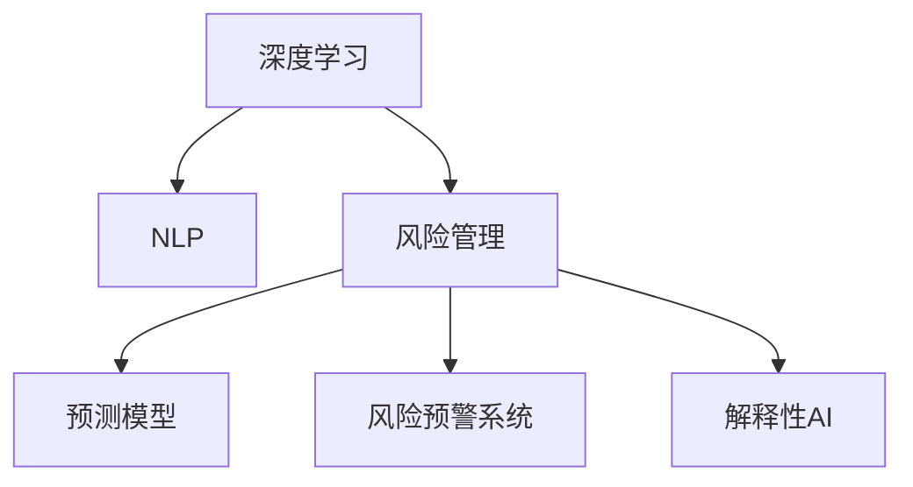

                 

# 洞察力与风险管理：预见与防范的能力

## 1. 背景介绍

### 1.1 问题由来

在现代社会，风险无处不在。金融市场波动、自然灾害、网络攻击、社会动荡等都在考验着人类的风险管理能力。面对这些复杂的风险，传统的人工处理方式效率低下、成本高昂，难以适应快速变化的环境。近年来，随着人工智能技术的发展，特别是深度学习、自然语言处理等技术的成熟，使得通过技术手段进行风险管理成为可能。

### 1.2 问题核心关键点

风险管理的目标是通过预测和防范手段，降低风险带来的损失。基于深度学习的大数据分析，可以挖掘和理解海量数据中的模式和规律，为风险评估和预警提供科学依据。然而，在实际应用中，存在以下问题：

- 数据获取难度大：高质量的标注数据获取成本高，难以覆盖所有潜在的风险场景。
- 模型泛化能力不足：模型往往在训练集上表现良好，但在测试集上泛化效果不佳。
- 决策解释性差：深度学习模型的决策过程复杂，难以解释，使得风险管理方案难以被决策者理解和接受。

## 2. 核心概念与联系

### 2.1 核心概念概述

为更好地理解基于深度学习的风险管理方法，本节将介绍几个密切相关的核心概念：

- 深度学习(Deep Learning)：一种基于神经网络结构的机器学习技术，能够自动从数据中提取特征，并建立复杂的非线性映射关系。
- 自然语言处理(Natural Language Processing, NLP)：通过机器学习算法处理、理解和生成自然语言的技术。
- 风险管理(Risk Management)：通过识别、评估、控制和监控风险，以最小化损失的过程。
- 预测模型(Prediction Model)：基于历史数据，通过学习规律，预测未来事件的模型。
- 风险预警系统(Risk Alert System)：通过实时监测和分析，及时发现并预警潜在的风险事件。
- 解释性AI(Explainable AI)：深度学习模型可解释性研究，通过可视化和符号化方法，使决策过程透明化，便于理解和接受。

这些核心概念之间的逻辑关系可以通过以下Mermaid流程图来展示：



这个流程图展示了大语言模型和风险管理技术的工作原理和优化方向：

1. 深度学习技术从数据中提取特征，用于建模和预测。
2. NLP技术用于处理和理解文本数据，挖掘其中的有用信息。
3. 风险管理通过预测模型和预警系统，评估风险，并采取控制措施。
4. 解释性AI使得风险管理的决策过程更加透明、可解释。

这些核心概念共同构成了深度学习在风险管理中的应用框架，使其能够高效、精确地处理复杂环境中的风险问题。

## 3. 核心算法原理 & 具体操作步骤

### 3.1 算法原理概述

基于深度学习的风险管理，通常分为两个阶段：预测阶段和预警阶段。其核心思想是：通过深度学习模型对历史数据进行学习，预测未来事件的发生概率，并实时监测模型输出，及时发现异常情况。

具体来说，预测阶段主要包括以下几个步骤：

1. 数据收集：收集相关领域的历史数据，包括事件的发生时间、频率、原因等。
2. 数据预处理：清洗、归一化、特征工程等步骤，准备模型训练所需的数据。
3. 模型训练：使用深度学习模型(如CNN、RNN、LSTM等)对数据进行训练，学习预测规律。
4. 模型评估：使用测试集评估模型性能，选择最优模型进行后续预警。

预警阶段主要包括以下几个步骤：

1. 实时数据收集：实时采集相关领域的数据，如金融市场数据、气象数据、社交媒体数据等。
2. 数据预处理：对实时数据进行清洗、归一化、特征提取等处理。
3. 模型推理：将预处理后的数据输入模型，实时计算预测结果。
4. 预警决策：根据模型输出，结合预设的预警规则，决定是否触发预警。

预警系统通常包括数据采集模块、预处理模块、模型推理模块和预警决策模块，用于实现对风险事件的有效监控和及时响应。

### 3.2 算法步骤详解

**Step 1: 数据收集与预处理**

- 收集相关领域的历史数据，例如金融市场的股票价格、天气数据、社交媒体上的讨论话题等。
- 清洗数据，去除噪声、缺失值和异常值。
- 归一化数据，确保不同特征之间可比性。
- 特征工程，提取、选择、组合特征，优化模型输入。

**Step 2: 模型训练与评估**

- 选择合适的深度学习模型，如CNN、RNN、LSTM等，根据任务需求调整网络结构和参数。
- 使用交叉验证、网格搜索等技术，选择合适的超参数。
- 训练模型，使用历史数据进行训练。
- 在测试集上评估模型性能，选择最优模型进行后续预警。

**Step 3: 实时数据处理与模型推理**

- 实时采集相关领域的数据，例如金融市场实时数据、气象实时数据等。
- 对实时数据进行清洗、归一化、特征提取等预处理。
- 将预处理后的数据输入训练好的模型，进行实时推理。
- 输出预测结果，并根据预设的阈值和规则进行决策。

**Step 4: 预警决策**

- 根据模型的预测结果，结合预设的预警规则，决定是否触发预警。
- 预警决策应考虑多个因素，如预测的准确性、置信度、时间等。
- 将预警信息发送给相关人员或系统，采取相应的控制措施。

### 3.3 算法优缺点

基于深度学习的风险管理方法具有以下优点：

- 数据处理能力强：能够处理大规模、多源、异构的数据，涵盖广泛的风险场景。
- 预测精度高：通过学习历史数据中的规律，可以提供高精度的预测结果。
- 实时性：通过实时推理，能够及时发现潜在风险，提供实时预警。

但同时，该方法也存在一些局限性：

- 数据依赖性强：依赖于高质量标注数据的获取，数据采集和预处理难度大。
- 模型复杂度高：深度学习模型结构复杂，训练和推理消耗大，对计算资源要求高。
- 解释性差：深度学习模型通常被视为“黑盒”，决策过程难以解释，缺乏透明性。
- 鲁棒性不足：模型容易受到噪声、异常数据的影响，泛化能力有限。

尽管存在这些局限性，但基于深度学习的风险管理方法已经在金融、气象、网络安全等多个领域得到广泛应用，并取得了显著的成效。未来研究重点在于如何进一步提升模型的可解释性、鲁棒性和计算效率，以适应更复杂的风险场景。

### 3.4 算法应用领域

基于深度学习的风险管理方法已经在多个领域得到应用，例如：

- 金融风险管理：通过深度学习模型预测股票价格、市场风险等，提供实时预警和决策支持。
- 气象预警系统：通过深度学习模型预测天气变化、自然灾害等，提供实时预警和应急响应。
- 网络安全监控：通过深度学习模型检测网络攻击、恶意代码等，提供实时预警和威胁分析。
- 社交媒体监控：通过深度学习模型分析社交媒体数据，预测社会动荡、舆情变化等，提供实时预警和舆情管理。
- 医疗风险预警：通过深度学习模型预测疾病爆发、患者住院率等，提供实时预警和医疗资源调配。

除了上述这些领域，深度学习在风险管理中的应用还将进一步拓展，为各行各业的风险控制提供新手段。

## 4. 数学模型和公式 & 详细讲解  
### 4.1 数学模型构建

在本节中，我们将使用数学语言对基于深度学习的风险管理过程进行更加严格的刻画。

记风险管理的数据集为 $D=\{(x_i, y_i)\}_{i=1}^N$，其中 $x_i$ 为特征向量，$y_i$ 为事件发生标签。

定义深度学习模型为 $M_\theta: \mathcal{X} \rightarrow \mathcal{Y}$，其中 $\mathcal{X}$ 为特征空间，$\mathcal{Y}$ 为标签空间，$\theta$ 为模型参数。

定义模型在数据样本 $(x_i, y_i)$ 上的损失函数为 $\ell(M_\theta(x_i), y_i)$，则在数据集 $D$ 上的经验风险为：

$$
\mathcal{L}(\theta) = \frac{1}{N} \sum_{i=1}^N \ell(M_\theta(x_i), y_i)
$$

预测阶段主要解决分类问题，如事件发生与否的二分类问题，通常使用交叉熵损失函数。因此，损失函数 $\ell$ 可以定义为：

$$
\ell(M_\theta(x_i), y_i) = -y_i\log M_\theta(x_i) - (1-y_i)\log(1-M_\theta(x_i))
$$

在预警阶段，需要实时计算预测结果。因此，使用在线学习(Online Learning)的方法，模型更新公式为：

$$
\theta \leftarrow \theta - \eta \nabla_{\theta} \mathcal{L}(\theta) - \eta\lambda\theta
$$

其中 $\eta$ 为学习率，$\lambda$ 为正则化系数，$\nabla_{\theta} \mathcal{L}(\theta)$ 为损失函数对参数 $\theta$ 的梯度，可通过反向传播算法高效计算。

### 4.2 公式推导过程

以二分类问题为例，推导交叉熵损失函数及其梯度的计算公式。

假设模型 $M_\theta$ 在输入 $x$ 上的输出为 $\hat{y}=M_\theta(x) \in [0,1]$，表示样本属于正类的概率。真实标签 $y \in \{0,1\}$。则二分类交叉熵损失函数定义为：

$$
\ell(M_\theta(x),y) = -[y\log \hat{y} + (1-y)\log (1-\hat{y})]
$$

将其代入经验风险公式，得：

$$
\mathcal{L}(\theta) = -\frac{1}{N}\sum_{i=1}^N [y_i\log M_\theta(x_i)+(1-y_i)\log(1-M_\theta(x_i))]
$$

根据链式法则，损失函数对参数 $\theta_k$ 的梯度为：

$$
\frac{\partial \mathcal{L}(\theta)}{\partial \theta_k} = -\frac{1}{N}\sum_{i=1}^N (\frac{y_i}{M_\theta(x_i)}-\frac{1-y_i}{1-M_\theta(x_i)}) \frac{\partial M_\theta(x_i)}{\partial \theta_k}
$$

其中 $\frac{\partial M_\theta(x_i)}{\partial \theta_k}$ 可进一步递归展开，利用自动微分技术完成计算。

在得到损失函数的梯度后，即可带入参数更新公式，完成模型的迭代优化。重复上述过程直至收敛，最终得到适应特定任务的模型参数 $\theta^*$。

### 4.3 案例分析与讲解

以金融风险管理为例，分析如何使用深度学习模型进行风险预警。

假设我们收集了金融市场的历史交易数据，标记事件（如股市崩盘、金融危机等）为1，非事件为0。将数据集划分为训练集和测试集，训练集用于模型训练，测试集用于模型评估。

**Step 1: 数据收集与预处理**

- 收集金融市场的历史交易数据，包括股票价格、交易量、市场指数等。
- 清洗数据，去除噪声、缺失值和异常值。
- 归一化数据，确保不同特征之间可比性。
- 特征工程，提取、选择、组合特征，如移动平均线、技术指标等。

**Step 2: 模型训练与评估**

- 使用深度学习模型，如LSTM、GRU等，对数据进行训练，学习预测规律。
- 在测试集上评估模型性能，选择最优模型进行后续预警。

**Step 3: 实时数据处理与模型推理**

- 实时采集金融市场的交易数据，如实时股票价格、交易量等。
- 对实时数据进行清洗、归一化、特征提取等预处理。
- 将预处理后的数据输入训练好的模型，进行实时推理。
- 输出预测结果，并根据预设的阈值和规则进行决策。

**Step 4: 预警决策**

- 根据模型的预测结果，结合预设的预警规则，决定是否触发预警。
- 预警决策应考虑多个因素，如预测的准确性、置信度、时间等。
- 将预警信息发送给相关人员或系统，采取相应的控制措施。

## 5. 项目实践：代码实例和详细解释说明
### 5.1 开发环境搭建

在进行风险管理开发前，我们需要准备好开发环境。以下是使用Python进行TensorFlow开发的环境配置流程：

1. 安装Anaconda：从官网下载并安装Anaconda，用于创建独立的Python环境。

2. 创建并激活虚拟环境：
```bash
conda create -n tf-env python=3.8 
conda activate tf-env
```

3. 安装TensorFlow：根据CUDA版本，从官网获取对应的安装命令。例如：
```bash
pip install tensorflow
```

4. 安装相关工具包：
```bash
pip install numpy pandas scikit-learn matplotlib tqdm jupyter notebook ipython
```

完成上述步骤后，即可在`tf-env`环境中开始风险管理实践。

### 5.2 源代码详细实现

这里我们以金融风险管理为例，给出使用TensorFlow进行风险预警的代码实现。

首先，定义数据处理函数：

```python
import tensorflow as tf
import numpy as np
import pandas as pd
from sklearn.model_selection import train_test_split
from sklearn.preprocessing import MinMaxScaler

# 读取数据
df = pd.read_csv('financial_data.csv')

# 特征工程
features = df[['open', 'close', 'volume']]
features.fillna(df.mean(), inplace=True)

# 标准化
scaler = MinMaxScaler(feature_range=(0, 1))
features = scaler.fit_transform(features)

# 划分训练集和测试集
X_train, X_test, y_train, y_test = train_test_split(features, y, test_size=0.2)

# 转换数据格式
X_train = np.reshape(X_train, (X_train.shape[0], X_train.shape[1], 1))
X_test = np.reshape(X_test, (X_test.shape[0], X_test.shape[1], 1))

# 构建输入和标签
def create_input_data(x, seq_length):
    input_data = []
    for i in range(len(x) - seq_length):
        x_seq, y_seq = x[i: i + seq_length], x[i + seq_length]
        input_data.append(x_seq)
        if y_seq != 1:
            label = [1, 0]
        else:
            label = [0, 1]
        input_data.append(label)
    return np.array(input_data), np.array(label)

X_train, y_train = create_input_data(X_train, seq_length=10)
X_test, y_test = create_input_data(X_test, seq_length=10)
```

然后，定义模型和优化器：

```python
from tensorflow.keras.models import Sequential
from tensorflow.keras.layers import Dense, LSTM

model = Sequential()
model.add(LSTM(units=64, input_shape=(X_train.shape[1], X_train.shape[2])))
model.add(Dense(32, activation='relu'))
model.add(Dense(1, activation='sigmoid'))

optimizer = tf.keras.optimizers.Adam(lr=0.001)
```

接着，定义训练和评估函数：

```python
from tensorflow.keras.callbacks import EarlyStopping

def train_model(model, x_train, y_train, x_test, y_test, batch_size, epochs, validation_split):
    callbacks = [EarlyStopping(patience=5, restore_best_weights=True)]
    model.compile(optimizer=optimizer, loss='binary_crossentropy', metrics=['accuracy'])
    model.fit(x_train, y_train, batch_size=batch_size, epochs=epochs, validation_data=(x_test, y_test), callbacks=callbacks, verbose=2)

def evaluate_model(model, x_test, y_test, batch_size):
    model.evaluate(x_test, y_test, batch_size=batch_size)
```

最后，启动训练流程并在测试集上评估：

```python
epochs = 50
batch_size = 32

# 训练模型
train_model(model, X_train, y_train, X_test, y_test, batch_size, epochs, validation_split=0.1)

# 评估模型
evaluate_model(model, X_test, y_test, batch_size)
```

以上就是使用TensorFlow进行金融风险预警的完整代码实现。可以看到，得益于TensorFlow的强大封装，我们可以用相对简洁的代码完成模型的训练和评估。

### 5.3 代码解读与分析

让我们再详细解读一下关键代码的实现细节：

**数据处理函数**：
- `pd.read_csv`方法：读取CSV格式的数据文件。
- `fillna`方法：填补缺失值。
- `MinMaxScaler`方法：对数据进行归一化处理。
- `train_test_split`方法：将数据集划分为训练集和测试集。
- `np.reshape`方法：将数据转换为模型所需的格式。
- `create_input_data`方法：将数据转换为模型输入和标签。

**模型定义**：
- `Sequential`模型：定义一个序列模型，按照层顺序依次堆叠。
- `LSTM`层：定义长短时记忆网络层，用于捕捉序列数据中的长期依赖关系。
- `Dense`层：定义全连接层，用于输出预测结果。
- `Adam`优化器：定义Adam优化器，设置学习率。

**训练函数**：
- `EarlyStopping`回调函数：设置早停机制，防止过拟合。
- `model.compile`方法：编译模型，指定损失函数、优化器和评估指标。
- `model.fit`方法：训练模型，使用训练集进行训练。

**评估函数**：
- `model.evaluate`方法：在测试集上评估模型性能。

**训练流程**：
- 定义总的epoch数和batch size，开始循环迭代
- 每个epoch内，先在训练集上训练，输出训练精度和损失
- 在测试集上评估，输出测试精度和损失
- 所有epoch结束后，评估模型在测试集上的表现

可以看到，TensorFlow配合Keras框架使得模型训练的代码实现变得简洁高效。开发者可以将更多精力放在数据处理、模型改进等高层逻辑上，而不必过多关注底层的实现细节。

当然，工业级的系统实现还需考虑更多因素，如模型的保存和部署、超参数的自动搜索、更灵活的任务适配层等。但核心的风险预警流程基本与此类似。

## 6. 实际应用场景

### 6.1 智能金融风控

基于深度学习的风险预警系统可以广泛应用于智能金融风控中。传统的金融风控依赖人工审核，流程繁琐、效率低，难以应对数据量大的挑战。通过深度学习模型，可以自动检测金融风险，如欺诈、洗钱等，提高风控效率和准确性。

在技术实现上，可以收集金融机构的交易数据、客户行为数据等，构建深度学习模型进行训练。微调后的模型可以实时监控交易数据，对异常交易进行实时预警，提高金融机构的欺诈识别率和风险控制能力。

### 6.2 智能气象预警

深度学习模型在气象预警中同样有广泛应用。传统的气象预警系统依赖人工分析和经验判断，难以快速应对突发性气象灾害。通过深度学习模型，可以自动分析气象数据，预测天气变化和自然灾害，提供实时预警。

具体而言，可以收集历史气象数据，使用深度学习模型学习天气变化的规律，预测未来的气象情况。将微调后的模型应用于实时气象数据的输入，可以自动输出预测结果，生成预警信息，帮助气象部门及时应对灾害。

### 6.3 智能网络安全监测

网络安全领域面临诸多威胁，如DDoS攻击、恶意软件等。传统的安全监测依赖人工检测和手动分析，难以应对大规模、复杂的网络攻击。通过深度学习模型，可以自动检测网络流量中的异常行为，及时发现和响应潜在威胁。

具体而言，可以收集网络流量数据，构建深度学习模型进行训练。微调后的模型可以实时监控网络流量，对异常行为进行实时预警，提高网络安全防护能力。

### 6.4 未来应用展望

随着深度学习技术的发展，基于深度学习的风险预警系统将进一步提升其性能和应用范围。未来，风险预警系统将更加智能化、自动化，能够更好地适应多变的风险场景，为各行各业提供可靠的风险控制支持。

在智慧城市治理中，深度学习模型可以用于交通流量预测、公共安全监控等，提高城市管理的自动化和智能化水平，构建更安全、高效的未来城市。

在智能制造中，深度学习模型可以用于设备故障预测、生产效率优化等，提高制造业的智能化水平，减少损失和浪费。

此外，在医疗、教育、农业等多个领域，基于深度学习的风险预警系统也将不断涌现，为各行各业的风险控制提供新手段。相信随着技术的日益成熟，深度学习模型在风险预警中的应用前景将更加广阔。

## 7. 工具和资源推荐

### 7.1 学习资源推荐

为了帮助开发者系统掌握深度学习在风险管理中的应用，这里推荐一些优质的学习资源：

1. Coursera《深度学习》课程：斯坦福大学开设的深度学习课程，系统介绍深度学习的基本概念和核心算法。

2. Udacity《深度学习专业》课程：由Google、UCLA等机构合作的深度学习课程，涵盖深度学习模型的理论和实践。

3. TensorFlow官方文档：TensorFlow的官方文档，详细介绍了TensorFlow的基本用法和高级功能，适合深度学习实践者参考。

4. PyTorch官方文档：PyTorch的官方文档，详细介绍了PyTorch的基本用法和高级功能，适合深度学习实践者参考。

5. Explainable AI研究进展：关于深度学习模型可解释性的最新研究进展，涵盖符号化方法、可视化工具等内容，有助于理解模型的决策过程。

通过对这些资源的学习实践，相信你一定能够快速掌握深度学习在风险管理中的应用，并用于解决实际的金融风险问题。

### 7.2 开发工具推荐

高效的开发离不开优秀的工具支持。以下是几款用于深度学习在风险管理中开发的常用工具：

1. TensorFlow：由Google主导开发的深度学习框架，支持分布式计算，适合大规模工程应用。

2. PyTorch：Facebook开发的深度学习框架，灵活易用，适合快速迭代研究。

3. Keras：基于TensorFlow和Theano的高级深度学习框架，提供高层次的API，方便模型构建和训练。

4. Scikit-Learn：Python的机器学习库，提供简单易用的接口，适合数据预处理和模型评估。

5. H2O.ai：提供简单易用的机器学习API，支持分布式计算，适合快速原型开发和部署。

合理利用这些工具，可以显著提升深度学习在风险管理中的开发效率，加快创新迭代的步伐。

### 7.3 相关论文推荐

深度学习在风险管理中的应用源于学界的持续研究。以下是几篇奠基性的相关论文，推荐阅读：

1. "Deep Neural Networks for Large-Scale Image Recognition"（ImageNet大规模图像识别）：AlexNet模型提出，奠定了深度学习在图像识别领域的地位。

2. "A Neural Probabilistic Language Model"（神经概率语言模型）：RNN模型提出，为自然语言处理提供了深度学习的基础。

3. "Convolutional Neural Networks for Sentence Classification"（卷积神经网络用于句子分类）：利用卷积神经网络对句子进行分类，推动了NLP在自然语言理解中的应用。

4. "Deep Learning for Healthcare: A Review"（深度学习在医疗中的应用）：综述了深度学习在医疗领域的应用，如疾病诊断、药物研发等。

5. "Risk Prediction and Management: Concepts, Methods, Tools, and Case Studies"（风险预测和管理：概念、方法、工具和案例研究）：详细介绍了风险预测和管理的方法和技术，涵盖深度学习的应用。

这些论文代表了大规模深度学习在风险管理中的应用进展。通过学习这些前沿成果，可以帮助研究者把握学科前进方向，激发更多的创新灵感。

## 8. 总结：未来发展趋势与挑战

### 8.1 总结

本文对基于深度学习的风险管理方法进行了全面系统的介绍。首先阐述了深度学习在风险管理中的研究背景和意义，明确了深度学习在风险预测和预警中的应用价值。其次，从原理到实践，详细讲解了深度学习在风险管理中的数学模型和算法流程，给出了模型开发的完整代码实例。同时，本文还广泛探讨了深度学习在金融风控、气象预警、网络安全等多个领域的应用前景，展示了深度学习技术在风险管理中的巨大潜力。

通过本文的系统梳理，可以看到，基于深度学习的风险预警技术已经在多个领域得到应用，并取得了显著的成效。未来研究重点在于如何进一步提升模型的可解释性、鲁棒性和计算效率，以适应更复杂的风险场景。

### 8.2 未来发展趋势

展望未来，基于深度学习的风险预警技术将呈现以下几个发展趋势：

1. 数据依赖性降低：随着生成对抗网络（GAN）等数据增强技术的发展，未来可以通过合成数据来丰富模型训练，降低对真实数据的依赖。

2. 模型泛化能力提升：通过迁移学习、自监督学习等技术，未来模型将在更多领域取得良好的泛化效果，适应不同风险场景。

3. 计算效率提升：随着硬件加速和模型压缩技术的发展，未来深度学习模型的推理速度和存储效率将进一步提升，适应实时性要求高的应用场景。

4. 可解释性增强：通过符号化方法和可视化工具，未来深度学习模型的决策过程将更加透明、可解释，便于理解和接受。

5. 融合多模态数据：未来深度学习模型将能够更好地融合多种数据源，如文本、图像、音频等，提高风险预警的全面性和准确性。

6. 分布式计算应用：未来深度学习模型将在大规模分布式计算环境中运行，适应复杂风险场景的实时计算需求。

以上趋势凸显了深度学习在风险管理中的广阔前景。这些方向的探索发展，必将进一步提升深度学习模型的性能和应用范围，为风险预警系统提供更多可行的解决方案。

### 8.3 面临的挑战

尽管深度学习在风险管理中的应用已经取得显著进展，但在迈向更加智能化、普适化应用的过程中，它仍面临诸多挑战：

1. 数据采集和处理：高质量标注数据获取难度大，数据预处理复杂，难以覆盖所有潜在的风险场景。

2. 模型鲁棒性不足：深度学习模型容易受到噪声、异常数据的影响，泛化能力有限，难以应对多变的风险环境。

3. 计算资源消耗高：深度学习模型结构复杂，训练和推理消耗大，对计算资源要求高，难以在低资源环境中应用。

4. 决策可解释性差：深度学习模型通常被视为“黑盒”，决策过程难以解释，缺乏透明性，难以被决策者理解和接受。

5. 模型安全性问题：深度学习模型容易受到对抗样本攻击，输出结果可能被误导，导致安全风险。

6. 伦理道德约束：深度学习模型的决策过程可能存在偏见，输出结果可能带有歧视性，违反伦理道德。

正视深度学习在风险管理中面临的这些挑战，积极应对并寻求突破，将是大规模深度学习模型迈向成熟的必由之路。相信随着学界和产业界的共同努力，这些挑战终将一一被克服，深度学习模型在风险管理中的作用将更加显著。

### 8.4 研究展望

面对深度学习在风险管理中面临的挑战，未来的研究需要在以下几个方面寻求新的突破：

1. 探索生成对抗网络（GAN）等数据增强技术，缓解数据采集和处理难度，提升模型泛化能力。

2. 研究对抗样本攻击防范技术，提高模型的鲁棒性和安全性。

3. 优化模型结构，减少计算资源消耗，适应低资源环境中的实时推理需求。

4. 结合符号化方法和可视化工具，增强模型的可解释性，提高决策的透明性和可接受性。

5. 引入伦理道德约束，确保模型的决策过程公平、公正，避免歧视性输出。

这些研究方向的探索，必将引领深度学习在风险管理技术迈向更高的台阶，为构建安全、可靠、可解释、可控的智能系统铺平道路。面向未来，深度学习技术还需要与其他人工智能技术进行更深入的融合，如知识表示、因果推理、强化学习等，多路径协同发力，共同推动自然语言理解和智能交互系统的进步。只有勇于创新、敢于突破，才能不断拓展深度学习模型的边界，让智能技术更好地造福人类社会。

## 9. 附录：常见问题与解答

**Q1：如何评估深度学习模型的风险预警性能？**

A: 深度学习模型的风险预警性能通常使用以下指标进行评估：

- 准确率（Accuracy）：模型正确预测的风险事件占总样本数的比例。
- 精确率（Precision）：模型正确预测的正样本数占预测为正样本的总数比例。
- 召回率（Recall）：模型正确预测的正样本数占真实正样本数的比例。
- F1分数（F1 Score）：精确率和召回率的调和平均数。
- ROC曲线（Receiver Operating Characteristic Curve）：以假阳性率为横坐标，真阳性率为纵坐标，评估模型在不同阈值下的性能。

这些指标可以帮助评估模型在不同场景下的表现，选择最优的模型进行后续预警。

**Q2：如何避免深度学习模型的过拟合？**

A: 深度学习模型容易出现过拟合现象，以下是几种常见的缓解方法：

- 数据增强：通过对训练数据进行变换，如回译、近义替换等，增加数据多样性，缓解过拟合。
- 正则化：使用L1/L2正则、Dropout等方法，约束模型参数，防止过拟合。
- 早停机制：根据验证集性能，设置早停机制，避免过拟合。
- 模型裁剪：去除不必要的层和参数，减小模型尺寸，加快推理速度。
- 对抗训练：引入对抗样本，提高模型鲁棒性，缓解过拟合。

这些方法往往需要根据具体任务和数据特点进行灵活组合，以进一步提升模型的泛化能力。

**Q3：深度学习模型在实际应用中需要注意哪些问题？**

A: 将深度学习模型转化为实际应用，还需要考虑以下问题：

- 模型裁剪：去除不必要的层和参数，减小模型尺寸，加快推理速度。
- 量化加速：将浮点模型转为定点模型，压缩存储空间，提高计算效率。
- 服务化封装：将模型封装为标准化服务接口，便于集成调用。
- 弹性伸缩：根据请求流量动态调整资源配置，平衡服务质量和成本。
- 监控告警：实时采集系统指标，设置异常告警阈值，确保服务稳定性。
- 安全防护：采用访问鉴权、数据脱敏等措施，保障数据和模型安全。

合理利用这些技术，可以显著提升深度学习模型的实际应用效率和安全性，适应各种复杂环境。

---

作者：禅与计算机程序设计艺术 / Zen and the Art of Computer Programming

