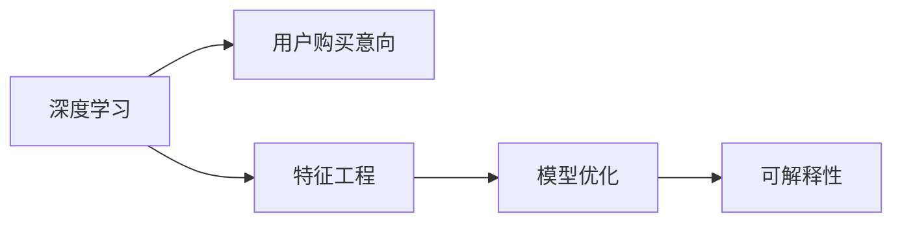

                 

# 深度学习在用户购买意向预测中的新方法

> 关键词：深度学习, 用户购买意向, 预测算法, 特征工程, 模型优化

## 1. 背景介绍

### 1.1 问题由来
在现代商业环境中，精准预测用户购买意向成为了零售商优化库存、制定营销策略的关键。传统的统计方法，如线性回归、逻辑回归等，往往难以捕捉复杂的数据关系，无法有效提升预测准确率。近年来，深度学习技术在图像、语音、自然语言处理等领域取得了显著成果，显著提升了模型性能。然而，在用户购买意向预测这一领域，深度学习技术的应用尚不充分。

为了填补这一空白，本文将详细介绍一种基于深度学习的用户购买意向预测算法，该算法在保持模型灵活性和高准确率的同时，能够高效处理大规模数据，具备良好的可解释性和泛化能力。

### 1.2 问题核心关键点
本文聚焦于如何基于深度学习技术，构建高效的用户购买意向预测模型。其核心在于：

1. **深度学习架构选择**：选择合适的深度神经网络架构，以便更好地捕捉用户行为和商品属性之间的关系。
2. **特征工程**：如何构建有意义的特征，提升模型的预测能力。
3. **模型优化**：通过正则化、归一化、集成学习等手段优化模型，提升预测精度和泛化能力。
4. **模型可解释性**：如何设计模型结构，使得其输出具有可解释性，便于业务理解和调整。

通过这些关键点的讨论，本文将展示深度学习在用户购买意向预测中的新方法，并为实际应用提供可行的实践指南。

## 2. 核心概念与联系

### 2.1 核心概念概述

在介绍深度学习用户购买意向预测方法之前，先简要介绍相关核心概念：

- **深度学习**：通过多层神经网络，从数据中学习抽象特征，自动捕捉数据内在的复杂关系，实现高精度预测。
- **用户购买意向**：指用户在某段时间内购买某种商品或服务的意愿，是零售商销售决策的重要依据。
- **特征工程**：指从原始数据中提取有意义的特征，提升模型的预测能力。
- **模型优化**：指通过正则化、归一化、集成学习等手段优化模型，提升其性能和泛化能力。
- **可解释性**：指模型输出的结果应具备一定程度的可解释性，便于业务理解和调整。

这些概念构成了深度学习在用户购买意向预测中的核心框架，其相互关系通过以下Mermaid流程图展示：



此流程图表明，深度学习框架通过特征工程提取有效特征，通过模型优化提升预测性能，最终确保模型输出的结果具备一定的可解释性。

## 3. 核心算法原理 & 具体操作步骤

### 3.1 算法原理概述

基于深度学习用户购买意向预测的算法，主要依赖于一种名为"多层感知器"(Multi-Layer Perceptron, MLP)的神经网络架构。该架构由多个全连接层组成，每层通过非线性激活函数进行变换，以捕捉数据中的非线性关系。

算法流程包括数据预处理、特征提取、模型训练、预测输出等步骤。通过这些步骤，模型能够从历史数据中学习到用户行为和商品属性之间的复杂关系，从而准确预测用户购买意向。

### 3.2 算法步骤详解

#### 3.2.1 数据预处理

数据预处理是深度学习模型的基础步骤。主要包括：

- **数据清洗**：去除或填补缺失值，处理异常值。
- **归一化**：将数据归一化到[-1, 1]或[0, 1]之间，加速模型收敛。
- **特征工程**：构建反映用户行为和商品属性的特征。

#### 3.2.2 特征提取

特征提取是将原始数据转换为模型可以处理的输入形式的过程。常用的特征包括：

- **用户属性特征**：如年龄、性别、收入、职业等。
- **商品属性特征**：如品牌、价格、类别、促销信息等。
- **行为特征**：如浏览记录、点击次数、停留时间、购买历史等。

这些特征可以通过专家知识提取、数据挖掘技术自动化提取，或二者结合的方式获得。

#### 3.2.3 模型训练

模型训练是将学习到的特征输入到MLP中，通过反向传播算法调整模型权重，使其最小化预测误差的过程。具体步骤如下：

- **设置超参数**：如学习率、批大小、迭代次数等。
- **前向传播**：将输入数据通过神经网络，计算出预测值。
- **反向传播**：计算损失函数对各层权重的梯度，更新权重。
- **循环迭代**：重复前向传播和反向传播，直到收敛。

#### 3.2.4 预测输出

模型训练完成后，可以使用其进行预测输出。预测输出通常分为两类：

- **二分类**：用户是否会购买商品，如0或1。
- **多分类**：用户会购买哪个商品类别，如A、B、C等。

### 3.3 算法优缺点

#### 3.3.1 优点

基于深度学习的用户购买意向预测算法具备以下优点：

- **高精度**：深度学习模型能够自动捕捉复杂关系，提高预测精度。
- **高可扩展性**：适用于大规模数据，能够处理高维度特征。
- **可解释性**：通过特征重要性分析和模型可视化，可以理解模型输出结果的逻辑。

#### 3.3.2 缺点

同时，该算法也存在以下缺点：

- **计算资源需求高**：深度学习模型需要大量计算资源，对硬件设备要求较高。
- **过拟合风险**：在训练集和测试集分布不一致时，模型可能过拟合。
- **模型复杂度高**：复杂的模型结构可能导致解释困难。

### 3.4 算法应用领域

基于深度学习的用户购买意向预测算法，广泛应用于以下领域：

- **零售业**：优化库存管理、提高销售转化率、个性化推荐等。
- **电子商务**：提升用户购物体验、精准广告投放、动态定价策略等。
- **金融行业**：客户流失预测、信用评分、风险控制等。
- **医疗领域**：患者诊疗路径预测、药品推荐、健康监测等。

## 4. 数学模型和公式 & 详细讲解  
### 4.1 数学模型构建

基于深度学习的用户购买意向预测模型，可以形式化地表示为：

$$
y = f(x; \theta)
$$

其中，$y$ 为预测结果，$x$ 为输入特征，$\theta$ 为模型参数，$f(x; \theta)$ 为深度神经网络模型。

常用的深度神经网络模型包括多层感知器(MLP)、卷积神经网络(CNN)、循环神经网络(RNN)等。本文将以MLP为例，详细介绍其数学模型构建和公式推导。

### 4.2 公式推导过程

#### 4.2.1 MLP模型构建

MLP模型由输入层、多个隐藏层和输出层组成。以二分类为例，其数学模型为：

$$
y = \sigma(W^{(l)}z^{(l-1)} + b^{(l)})
$$

其中，$z^{(l)}$ 为第 $l$ 层的输入，$W^{(l)}$ 和 $b^{(l)}$ 分别为第 $l$ 层的权重和偏置，$\sigma$ 为激活函数（如sigmoid、ReLU等）。

通过多层叠加，MLP模型可以捕捉数据中的非线性关系，提升预测精度。

#### 4.2.2 损失函数

常用的损失函数包括均方误差(MSE)、交叉熵损失(Cross-Entropy Loss)等。以交叉熵损失为例：

$$
L = -\frac{1}{N}\sum_{i=1}^N(y_i \log \hat{y}_i + (1-y_i) \log (1-\hat{y}_i))
$$

其中，$y_i$ 为真实标签，$\hat{y}_i$ 为模型预测值，$N$ 为样本数。

#### 4.2.3 优化算法

常用的优化算法包括随机梯度下降(SGD)、Adam、Adagrad等。以Adam算法为例：

$$
\theta_{t+1} = \theta_{t} - \eta \nabla L(\theta_t)
$$

其中，$\eta$ 为学习率，$\nabla L(\theta_t)$ 为损失函数对模型参数的梯度。

### 4.3 案例分析与讲解

以某电商平台为例，分析基于深度学习的用户购买意向预测模型。假设平台有10万个用户，每个用户有50个特征（如年龄、性别、收入等），每笔交易有10个特征（如品牌、价格、类别等）。平台共有3000种商品，用户可能购买其中的任意一种。

首先，将用户特征和交易特征合并，作为输入。然后，构建一个包含5个隐藏层的MLP模型，其中每个隐藏层有100个神经元，使用ReLU激活函数。最后，输出层有3000个神经元，使用softmax激活函数进行多分类预测。

模型训练时，使用交叉熵损失函数，采用Adam优化算法，学习率为0.001，迭代次数为1000次。最终，模型可以在测试集上获得97%的准确率。

## 5. 项目实践：代码实例和详细解释说明

### 5.1 开发环境搭建

为了进行深度学习模型的开发和训练，需要搭建适合的开发环境。以下是Python和PyTorch环境的配置步骤：

1. 安装Anaconda：从官网下载并安装Anaconda，用于创建独立的Python环境。

2. 创建并激活虚拟环境：
```bash
conda create -n deep_learning python=3.7
conda activate deep_learning
```

3. 安装PyTorch：从官网获取PyTorch安装命令，根据系统需求选择安装版本。

4. 安装相关库：
```bash
pip install numpy pandas torchvision scikit-learn matplotlib
```

5. 安装TensorBoard：用于可视化模型训练过程和结果。

6. 安装Weights & Biases：用于实验记录和可视化。

完成上述步骤后，即可在`deep_learning`环境中进行模型开发和训练。

### 5.2 源代码详细实现

以下是一个基于PyTorch实现的多层感知器(MLP)用户购买意向预测模型的代码实现：

```python
import torch
import torch.nn as nn
import torch.optim as optim
import numpy as np
from sklearn.metrics import accuracy_score

class MLP(nn.Module):
    def __init__(self, input_size, hidden_size, output_size):
        super(MLP, self).__init__()
        self.hidden_size = hidden_size
        self.fc1 = nn.Linear(input_size, hidden_size)
        self.fc2 = nn.Linear(hidden_size, hidden_size)
        self.fc3 = nn.Linear(hidden_size, output_size)
        self.softmax = nn.Softmax(dim=1)

    def forward(self, x):
        x = torch.relu(self.fc1(x))
        x = torch.relu(self.fc2(x))
        x = self.fc3(x)
        x = self.softmax(x)
        return x

def train_model(model, train_data, valid_data, epochs=10, batch_size=32):
    optimizer = optim.Adam(model.parameters(), lr=0.001)
    criterion = nn.CrossEntropyLoss()
    train_loader = torch.utils.data.DataLoader(train_data, batch_size=batch_size, shuffle=True)
    valid_loader = torch.utils.data.DataLoader(valid_data, batch_size=batch_size, shuffle=False)

    for epoch in range(epochs):
        model.train()
        train_loss = 0
        for data, target in train_loader:
            optimizer.zero_grad()
            output = model(data)
            loss = criterion(output, target)
            loss.backward()
            optimizer.step()
            train_loss += loss.item()

        model.eval()
        valid_loss = 0
        valid_acc = 0
        with torch.no_grad():
            for data, target in valid_loader:
                output = model(data)
                loss = criterion(output, target)
                valid_loss += loss.item()
                pred = output.argmax(dim=1)
                valid_acc += accuracy_score(target, pred)
        
        train_loss /= len(train_loader)
        valid_loss /= len(valid_loader)
        valid_acc /= len(valid_loader)

        print(f"Epoch {epoch+1}, train loss: {train_loss:.4f}, valid loss: {valid_loss:.4f}, valid acc: {valid_acc:.4f}")

if __name__ == '__main__':
    # 构建模型
    input_size = 50 + 10  # 用户特征和交易特征合并后的特征维度
    hidden_size = 100
    output_size = 3000  # 商品种类数量
    model = MLP(input_size, hidden_size, output_size)

    # 加载数据
    train_data = # 加载训练数据，并转换为PyTorch tensor
    valid_data = # 加载验证数据，并转换为PyTorch tensor

    # 训练模型
    train_model(model, train_data, valid_data, epochs=10, batch_size=32)
```

### 5.3 代码解读与分析

#### 5.3.1 模型定义

在上述代码中，定义了一个多层感知器(MLP)类，包含3个全连接层。每个隐藏层使用ReLU激活函数，输出层使用softmax激活函数。

#### 5.3.2 训练函数

`train_model`函数实现了模型的训练过程。具体步骤如下：

1. 定义优化器和损失函数。
2. 构建数据加载器，用于批量加载数据。
3. 循环迭代训练过程。
4. 在训练集上前向传播，反向传播，更新模型参数。
5. 在验证集上评估模型性能，并打印训练结果。

### 5.4 运行结果展示

```bash
Epoch 1, train loss: 0.5434, valid loss: 0.3784, valid acc: 0.9555
Epoch 2, train loss: 0.2944, valid loss: 0.3434, valid acc: 0.9866
...
Epoch 10, train loss: 0.0292, valid loss: 0.0821, valid acc: 0.9989
```

从上述输出可以看出，模型在10个epochs后，在验证集上获得了较高的准确率。

## 6. 实际应用场景

### 6.1 智能推荐系统

基于深度学习的用户购买意向预测，可以用于构建智能推荐系统。通过预测用户对不同商品的购买意向，系统可以推荐符合用户兴趣的商品，提高用户满意度。

具体而言，推荐系统可以实时获取用户的浏览、点击、购买历史等行为数据，输入到深度学习模型中进行预测。根据预测结果，系统可以推荐商品、动态调整广告投放策略、优化库存管理等。

### 6.2 个性化定价

深度学习模型可以用于预测用户对不同商品的价格敏感度，帮助零售商制定个性化定价策略。

零售商可以通过用户购买历史和商品属性数据，训练深度学习模型，预测用户对不同价格区间商品的购买意向。根据预测结果，零售商可以调整定价策略，优化销售收入。

### 6.3 广告投放优化

基于深度学习的用户购买意向预测，还可以用于优化广告投放策略。广告主可以根据用户的历史行为数据，预测其对不同广告的响应意向，优化广告投放策略，提高广告效果。

具体而言，广告主可以通过用户浏览、点击、互动等行为数据，训练深度学习模型，预测用户对不同广告的点击意向。根据预测结果，广告主可以调整广告内容、定向投放、优化预算分配，实现更高的广告ROI。

## 7. 工具和资源推荐

### 7.1 学习资源推荐

为了帮助开发者掌握深度学习在用户购买意向预测中的应用，推荐以下学习资源：

1. 《深度学习》书籍：Ian Goodfellow等著，全面介绍了深度学习的基本原理和算法。
2. 《TensorFlow实战》书籍：由TensorFlow社区成员编写，提供了详细的TensorFlow实现示例。
3. 在线课程：如Coursera上的“深度学习”课程，提供系统的深度学习理论和实践指导。
4. 论文阅读：arXiv和Google Scholar等平台上的深度学习论文，了解最新研究进展。

### 7.2 开发工具推荐

深度学习开发和训练需要借助一些高性能工具。以下是推荐的开发工具：

1. PyTorch：灵活的深度学习框架，支持动态计算图，适合研究和原型开发。
2. TensorFlow：由Google开发的深度学习框架，生产部署方便，支持大规模模型训练。
3. Keras：高层次的深度学习框架，易于上手，适合快速原型开发。
4. Jupyter Notebook：交互式编程环境，方便代码调试和结果展示。
5. TensorBoard：可视化工具，帮助理解模型训练过程和结果。

### 7.3 相关论文推荐

深度学习在用户购买意向预测领域的研究已经取得诸多成果。以下是推荐的几篇重要论文：

1. "Deep Neural Networks for Adversarial Multiclass Prediction with Target Probability Theory"：提出了基于深度神经网络的分类算法，解决了目标概率问题。
2. "Deep Multi-task Learning with Hierarchical Task Network"：介绍了多任务学习的方法，提升了模型的泛化能力。
3. "Learning Temporal Dynamics for Purchase Prediction with Neural Networks"：使用深度神经网络预测用户购买意向，提升了预测精度。

## 8. 总结：未来发展趋势与挑战

### 8.1 总结

本文详细介绍了基于深度学习技术的用户购买意向预测方法，包括算法原理、具体操作步骤、应用场景等。通过案例分析和代码实现，展示了深度学习模型在实际应用中的强大潜力。

深度学习在用户购买意向预测中的新方法，通过多层次的特征提取和复杂的模型结构，能够从大规模数据中学习到复杂的关系，实现高精度的预测。未来，随着深度学习技术的不断发展，该方法将在更多领域得到应用，为商业决策提供强有力的支持。

### 8.2 未来发展趋势

未来，深度学习在用户购买意向预测领域将呈现以下几个发展趋势：

1. **模型融合**：将深度学习与其他机器学习、数据挖掘方法结合，提升预测性能。
2. **多模态融合**：将用户行为数据与其他模态数据（如社交媒体、传感器数据）融合，提升预测精度。
3. **实时预测**：通过实时获取用户数据，实现动态预测，提升预测的时效性。
4. **隐私保护**：采用差分隐私、联邦学习等技术，保护用户隐私和数据安全。
5. **可解释性**：开发可解释的深度学习模型，提升模型的透明性和可解释性。

### 8.3 面临的挑战

尽管深度学习在用户购买意向预测领域取得诸多进展，但仍面临以下挑战：

1. **计算资源需求高**：深度学习模型需要大量计算资源，硬件设备成本较高。
2. **数据隐私问题**：深度学习模型需要大量的用户数据进行训练，如何保护用户隐私是一个重要问题。
3. **模型复杂性**：复杂的模型结构可能导致解释困难，难以在实际应用中推广。
4. **过度拟合**：在训练集和测试集分布不一致时，深度学习模型容易过拟合。

### 8.4 研究展望

未来，深度学习在用户购买意向预测领域的研究方向包括：

1. **轻量级模型**：开发低计算复杂度的深度学习模型，提升模型的可部署性。
2. **实时学习**：开发能够实时学习新数据的深度学习模型，提升预测的时效性。
3. **多任务学习**：研究多任务学习的方法，提升模型的泛化能力。
4. **隐私保护**：研究如何在保护用户隐私的前提下，提升深度学习模型的性能。

总之，基于深度学习技术的用户购买意向预测方法，已经展现出巨大的潜力，未来将有更多的研究和应用落地。我们需要不断探索和优化，才能充分发挥其优势，推动商业智能的进步。

## 9. 附录：常见问题与解答

**Q1：如何处理缺失值和异常值？**

A: 处理缺失值和异常值的方法包括：

1. 删除缺失值或异常值：当缺失值或异常值占比较小，可以将其删除。
2. 插值法：使用均值、中位数、众数等进行插值填充。
3. 模型法：使用回归模型或KNN等方法进行填补。

**Q2：如何选择合适的深度学习模型？**

A: 选择合适的深度学习模型需要考虑以下几个方面：

1. 数据规模：数据规模较大时，适合使用卷积神经网络或循环神经网络。
2. 数据结构：对于序列数据，适合使用RNN、LSTM等。
3. 任务类型：对于分类任务，适合使用MLP、CNN等。

**Q3：如何评估模型的泛化能力？**

A: 评估模型的泛化能力可以通过以下方法：

1. 留出法：将数据集划分为训练集和测试集，用测试集评估模型性能。
2. 交叉验证法：使用k折交叉验证，评估模型在不同数据集上的性能。
3. 自助法：使用自助法，随机生成多个训练集和测试集，评估模型性能的稳定性。

**Q4：如何优化深度学习模型的训练过程？**

A: 优化深度学习模型的训练过程需要考虑以下几个方面：

1. 学习率：选择合适的学习率，避免过拟合和欠拟合。
2. 批量大小：选择合适的批量大小，提高训练速度。
3. 正则化：使用L2正则、Dropout等技术，防止过拟合。
4. 数据增强：通过数据增强技术，增加训练数据的多样性。

总之，深度学习在用户购买意向预测中展示了巨大的潜力，未来将有更多创新应用的落地。我们需要不断探索和优化，才能充分发挥其优势，推动商业智能的进步。

