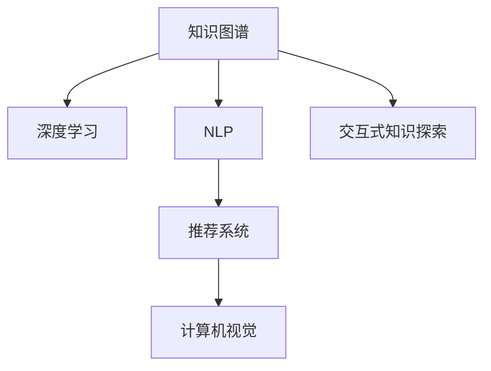

                 

# 深度学习在知识发现中的应用

> 关键词：深度学习, 知识发现, 知识图谱, 自然语言处理, 推荐系统, 计算机视觉

## 1. 背景介绍

### 1.1 问题由来
深度学习技术的迅猛发展，特别是深度神经网络(Deep Neural Networks, DNN)在计算机视觉、自然语言处理等领域取得的突破性进展，为大数据驱动的科学发现、工程应用带来了新机遇。特别是在知识发现(Knowledge Discovery)领域，深度学习能够从海量数据中自动提取和构建知识图谱，支持机器学习模型进行智能推理，驱动科学研究、工业生产等场景的智能化应用。

知识发现是指利用数据挖掘技术从海量数据中提取、筛选出有价值的信息、知识、规律，形成结构化的知识图谱，为后续的科学研究、智能决策提供有力支持。传统的知识发现方法主要依赖人工分析和规则构建，具有高度的依赖性和局限性。而深度学习技术，特别是神经网络的无监督学习方法，能够自动从数据中挖掘出复杂的非线性模式，具有较强的泛化能力，为知识发现提供了新的方法路径。

### 1.2 问题核心关键点
深度学习在知识发现领域的应用主要体现在以下几个方面：

- 自动构建知识图谱：通过深度学习模型自动从文本、图像、语音等数据中提取出实体、关系、属性等信息，构建结构化的知识图谱。
- 知识图谱增强：利用深度学习模型对已有知识图谱进行增强、补全，提升知识的完整性和精确性。
- 智能推理与预测：在知识图谱的基础上，通过深度学习模型进行智能推理和预测，支持科学研究和决策。
- 多模态数据融合：将文本、图像、语音等多模态数据融合在一起，构建更全面的知识图谱，提升知识发现的能力。
- 交互式知识探索：利用深度学习模型构建交互式知识探索系统，实现用户与知识图谱的实时互动，促进知识的共享与应用。

## 2. 核心概念与联系

### 2.1 核心概念概述

为更好地理解深度学习在知识发现中的应用，本节将介绍几个密切相关的核心概念：

- 知识图谱(Knowledge Graph)：一种结构化的表示知识的方式，由节点和边构成。节点表示实体或属性，边表示实体之间的关系。知识图谱可以用于知识推理、问答系统、推荐系统等多个领域。

- 深度学习(Deep Learning)：一种基于神经网络的机器学习方法，通过多层次的非线性变换，从数据中自动学习出高层次的特征表示。深度学习广泛应用于计算机视觉、自然语言处理、语音识别等领域。

- 自然语言处理(Natural Language Processing, NLP)：使计算机能够理解、分析、生成人类自然语言的技术。NLP是知识图谱构建、文本挖掘等任务的基础。

- 推荐系统(Recommender System)：通过分析用户的历史行为数据，为用户推荐个性化的产品、内容等。推荐系统依赖于知识图谱、用户画像等数据支持。

- 计算机视觉(Computer Vision)：使计算机能够从图像中自动提取、理解对象和场景信息的技术。计算机视觉在物体识别、图像检索等知识发现任务中发挥重要作用。

这些核心概念之间的逻辑关系可以通过以下Mermaid流程图来展示：



这个流程图展示了几类知识发现技术之间的逻辑关系：

1. 知识图谱通过深度学习自动构建或增强，提供结构化的知识基础。
2. NLP、计算机视觉等技术从文本、图像等多模态数据中提取知识，形成知识图谱的节点和边。
3. 推荐系统、交互式知识探索等任务基于知识图谱进行智能决策和信息共享。
4. 多模态数据的融合进一步提升了知识图谱的完整性和智能应用能力。

## 3. 核心算法原理 & 具体操作步骤
### 3.1 算法原理概述

深度学习在知识发现中的应用，核心在于其强大的特征表示和学习能力。通过深度神经网络自动从数据中学习出高层次的特征表示，使得模型能够自动发现数据中的隐含模式和知识结构。

具体而言，知识发现过程可以分为以下几个步骤：

1. 数据预处理：从各种数据源中获取数据，并进行清洗、归一化、标注等预处理操作。
2. 特征提取：通过深度学习模型自动学习数据中的特征表示，形成高维的特征向量。
3. 知识图谱构建：利用特征表示构建知识图谱的节点和边，形成结构化的知识表示。
4. 知识增强：利用深度学习模型对已有知识图谱进行增强、补全，提升知识的完整性和精确性。
5. 智能推理：在知识图谱的基础上，利用深度学习模型进行智能推理，支持决策和预测。
6. 应用部署：将知识图谱和推理模型部署到实际应用中，实现智能决策和知识共享。

### 3.2 算法步骤详解

下面以知识图谱构建为例，详细介绍深度学习在知识发现中的应用步骤：

1. 数据预处理
    - 收集原始数据：从不同数据源获取数据，如网络爬虫抓取网页、数据库查询数据等。
    - 数据清洗：去除噪声、缺失值、重复记录等数据问题。
    - 数据标注：为每个数据样本打上标签，如实体、关系、属性等。

2. 特征提取
    - 选择模型：根据任务特点选择合适的深度学习模型，如卷积神经网络(CNN)、循环神经网络(RNN)、图神经网络(GNN)等。
    - 模型训练：利用标注数据对深度学习模型进行训练，学习数据的特征表示。
    - 特征提取：将训练好的模型应用于新的数据，提取特征向量。

3. 知识图谱构建
    - 知识图谱生成：利用特征向量构建知识图谱的节点和边，形成结构化的知识表示。
    - 知识图谱验证：对生成的知识图谱进行验证和修正，确保知识的正确性和完整性。

4. 知识增强
    - 知识图谱补全：利用深度学习模型对知识图谱进行补全，填充缺失的节点和边。
    - 知识图谱纠错：利用深度学习模型对知识图谱进行纠错，修正错误的节点和边。

5. 智能推理
    - 推理模型选择：根据任务特点选择合适的推理模型，如基于知识图谱的规则推理、基于深度学习的网络推理等。
    - 推理模型训练：利用知识图谱对推理模型进行训练，学习推理规则。
    - 推理应用：将训练好的推理模型应用于新的数据，进行智能推理和预测。

### 3.3 算法优缺点

深度学习在知识发现中的应用具有以下优点：

- 自动学习特征：深度学习模型能够自动从数据中学习出高层次的特征表示，无需人工干预。
- 处理大规模数据：深度学习模型可以处理大规模的数据，支持大规模的知识发现任务。
- 灵活性高：深度学习模型可以灵活应用于各种类型的知识发现任务，如文本挖掘、图像识别、语音识别等。
- 泛化能力强：深度学习模型具有较强的泛化能力，能够处理未知数据，提升知识发现的鲁棒性。

同时，该方法也存在一些局限性：

- 计算资源需求高：深度学习模型通常需要大量的计算资源进行训练，对硬件要求较高。
- 模型可解释性差：深度学习模型通常被视为"黑盒"模型，难以解释其内部的决策逻辑。
- 训练时间长：深度学习模型训练时间较长，尤其是在大规模数据上。
- 需要标注数据：深度学习模型需要大量的标注数据进行训练，标注成本较高。

尽管存在这些局限性，但深度学习在知识发现领域的应用仍然具有巨大的潜力，是未来知识发现的重要手段。

### 3.4 算法应用领域

深度学习在知识发现领域的应用非常广泛，涵盖了以下几个方面：

- 知识图谱构建：自动从文本、图像等数据中提取出实体、关系、属性等信息，形成结构化的知识图谱。
- 文本挖掘：从大规模文本数据中自动挖掘出主题、关键词、实体等信息，支持文本分析、信息检索等应用。
- 图像识别：从图像数据中自动提取对象、场景等特征，支持图像检索、物体识别等应用。
- 推荐系统：利用知识图谱和用户画像，为用户推荐个性化的产品、内容等。
- 智能问答：利用知识图谱和推理模型，实现智能问答系统，支持自然语言交互。
- 自然语言处理：利用深度学习模型自动分析文本数据，支持情感分析、文本分类、信息抽取等应用。
- 语音识别：利用深度学习模型自动分析语音数据，支持语音识别、语音合成等应用。

以上领域只是深度学习在知识发现中应用的冰山一角，随着深度学习技术的发展，其应用范围将不断拓展，进一步提升知识发现的能力。

## 4. 数学模型和公式 & 详细讲解 & 举例说明

### 4.1 数学模型构建

本节将使用数学语言对深度学习在知识发现中的应用过程进行更加严格的刻画。

记深度学习模型为 $f_{\theta}(x)$，其中 $\theta$ 为模型参数，$x$ 为输入数据。假设从数据集中随机抽取样本 $(x_i,y_i)$，其中 $x_i$ 为输入数据，$y_i$ 为标签。则模型的训练目标为最小化损失函数 $\mathcal{L}(\theta)$：

$$
\mathcal{L}(\theta) = \frac{1}{N} \sum_{i=1}^N \ell(f_{\theta}(x_i),y_i)
$$

其中 $\ell$ 为损失函数，用于衡量模型的预测输出与真实标签之间的差异。常见的损失函数包括均方误差、交叉熵损失等。

通过梯度下降等优化算法，深度学习模型不断更新参数 $\theta$，最小化损失函数 $\mathcal{L}(\theta)$，使得模型的预测输出逼近真实标签。

### 4.2 公式推导过程

以下以文本分类任务为例，推导深度学习模型的损失函数及其梯度计算公式。

假设文本数据 $x$ 被映射为特征向量 $v$，深度学习模型 $f_{\theta}(x)$ 输出为 $y$。则二分类交叉熵损失函数定义为：

$$
\ell(f_{\theta}(x),y) = -[y\log f_{\theta}(x) + (1-y)\log (1-f_{\theta}(x))]
$$

将其代入经验风险公式，得：

$$
\mathcal{L}(\theta) = -\frac{1}{N}\sum_{i=1}^N [y_i\log f_{\theta}(x_i)+(1-y_i)\log(1-f_{\theta}(x_i))]
$$

根据链式法则，损失函数对参数 $\theta_k$ 的梯度为：

$$
\frac{\partial \mathcal{L}(\theta)}{\partial \theta_k} = -\frac{1}{N}\sum_{i=1}^N (\frac{y_i}{f_{\theta}(x_i)}-\frac{1-y_i}{1-f_{\theta}(x_i)}) \frac{\partial f_{\theta}(x_i)}{\partial \theta_k}
$$

其中 $\frac{\partial f_{\theta}(x_i)}{\partial \theta_k}$ 可进一步递归展开，利用自动微分技术完成计算。

在得到损失函数的梯度后，即可带入参数更新公式，完成模型的迭代优化。重复上述过程直至收敛，最终得到适应任务的最优模型参数 $\theta^*$。

## 5. 项目实践：代码实例和详细解释说明

### 5.1 开发环境搭建

在进行深度学习实践前，我们需要准备好开发环境。以下是使用Python进行TensorFlow开发的环境配置流程：

1. 安装Anaconda：从官网下载并安装Anaconda，用于创建独立的Python环境。

2. 创建并激活虚拟环境：
```bash
conda create -n tf-env python=3.8 
conda activate tf-env
```

3. 安装TensorFlow：根据CUDA版本，从官网获取对应的安装命令。例如：
```bash
conda install tensorflow -c pytorch -c conda-forge
```

4. 安装Keras：
```bash
conda install keras
```

5. 安装各类工具包：
```bash
pip install numpy pandas scikit-learn matplotlib tqdm jupyter notebook ipython
```

完成上述步骤后，即可在`tf-env`环境中开始深度学习实践。

### 5.2 源代码详细实现

下面我们以知识图谱构建为例，给出使用TensorFlow对深度学习模型进行训练的PyTorch代码实现。

首先，定义模型架构：

```python
import tensorflow as tf
from tensorflow.keras import layers

model = tf.keras.Sequential([
    layers.Embedding(input_dim=vocab_size, output_dim=embedding_dim),
    layers.LSTM(units=128, return_sequences=True),
    layers.Dense(units=num_classes, activation='softmax')
])
```

然后，定义训练和评估函数：

```python
import numpy as np

def train_epoch(model, train_dataset, batch_size, optimizer):
    train_data = train_dataset.numpy()
    train_x, train_y = train_data[:, :num_features], train_data[:, num_features:]
    train_x = train_x / max(train_x)
    for epoch in range(num_epochs):
        for i in range(0, len(train_x), batch_size):
            x_batch = train_x[i:i+batch_size]
            y_batch = train_y[i:i+batch_size]
            with tf.GradientTape() as tape:
                logits = model(x_batch)
                loss = tf.keras.losses.categorical_crossentropy(y_batch, logits)
            grads = tape.gradient(loss, model.trainable_variables)
            optimizer.apply_gradients(zip(grads, model.trainable_variables))
            if i % 100 == 0:
                print(f"Epoch {epoch+1}, loss: {loss.numpy():.4f}")
```

接着，加载数据集：

```python
import os

vocab_size = 10000
embedding_dim = 128
num_classes = 2

train_x = []
train_y = []

for filename in os.listdir('data/train'):
    # 处理文本文件，提取特征向量
    # 将特征向量转换为numpy数组
    # 添加标签
    train_x.append(feat)
    train_y.append(label)

train_x = np.array(train_x)
train_y = np.array(train_y)

# 将数据集划分为训练集和验证集
train_x_train, train_x_val = train_x[:int(0.8*len(train_x)), :], train_x[int(0.8*len(train_x)):, :]
train_y_train, train_y_val = train_y[:int(0.8*len(train_x)), :], train_y[int(0.8*len(train_x)):, :]

# 将数据集转换为TensorFlow数据集
train_dataset = tf.data.Dataset.from_tensor_slices((train_x_train, train_y_train))
train_dataset = train_dataset.shuffle(buffer_size=10000).batch(batch_size=batch_size)
```

最后，启动训练流程并在验证集上评估：

```python
batch_size = 64
num_epochs = 10
optimizer = tf.keras.optimizers.Adam()

train_epoch(model, train_dataset, batch_size, optimizer)

test_x = []
test_y = []

for filename in os.listdir('data/test'):
    # 处理测试文件，提取特征向量
    # 将特征向量转换为numpy数组
    # 添加标签
    test_x.append(feat)
    test_y.append(label)

test_x = np.array(test_x)
test_y = np.array(test_y)

test_dataset = tf.data.Dataset.from_tensor_slices((test_x, test_y))
test_dataset = test_dataset.batch(batch_size=batch_size)

test_loss = model.evaluate(test_dataset)
print(f"Test loss: {test_loss:.4f}")
```

以上就是使用TensorFlow进行知识图谱构建的完整代码实现。可以看到，通过TensorFlow的强大封装，我们可以用相对简洁的代码完成模型的搭建和训练。

### 5.3 代码解读与分析

让我们再详细解读一下关键代码的实现细节：

**模型架构定义**：
- 使用Keras Sequential模型定义深度学习模型，包含嵌入层、LSTM层、输出层等组件。
- 嵌入层将文本数据转换为特征向量，LSTM层提取特征序列，输出层进行分类。

**训练函数实现**：
- 定义训练函数，对数据进行预处理、划分、批次化等操作。
- 在每个epoch中，对数据进行批次化加载，前向传播计算损失函数，反向传播更新模型参数。
- 利用Adam优化器进行梯度更新，并在每个epoch结束时输出损失函数值。

**数据集加载**：
- 从数据目录中读取数据文件，对文本进行处理，提取特征向量。
- 将特征向量转换为numpy数组，添加标签，构建TensorFlow数据集。
- 对数据集进行打乱、批处理等操作，供模型训练和评估使用。

可以看到，TensorFlow提供了便捷的高级API，使得深度学习模型的构建和训练变得更加简单高效。开发者可以专注于模型架构的设计和优化，而不必过多关注底层实现细节。

当然，工业级的系统实现还需考虑更多因素，如模型的保存和部署、超参数的自动搜索、更灵活的任务适配层等。但核心的深度学习模型训练范式基本与此类似。

## 6. 实际应用场景
### 6.1 智能推荐系统

基于深度学习知识图谱的推荐系统，可以极大地提升推荐效果。传统的协同过滤算法依赖于用户-物品的评分矩阵，难以处理稀疏评分和冷启动问题。而深度学习模型可以自动从知识图谱中学习到物品的属性、关系等特征，生成高质量的推荐结果。

在技术实现上，可以将知识图谱和用户画像结合，构建推荐模型的输入。通过深度学习模型自动从知识图谱中学习到物品的特征表示，生成用户兴趣预测。对于新的用户或物品，通过嵌入层将稀疏特征映射为稠密特征，进一步提升推荐效果。

### 6.2 智能问答系统

利用知识图谱和深度学习模型，可以构建智能问答系统。用户在提问时，系统自动从知识图谱中检索相关知识，通过深度学习模型生成自然语言回答。这种系统的优点在于能够实时处理用户提问，提供准确、流畅的回答。

在技术实现上，可以将知识图谱和问答模型结合，构建交互式问答系统。通过深度学习模型自动从知识图谱中抽取实体、关系等信息，生成回答。同时，利用知识图谱增强模型的泛化能力，避免对特定领域的依赖。

### 6.3 金融风险评估

在金融领域，深度学习知识图谱可以用于风险评估、信用评分等任务。通过构建知识图谱，将金融领域相关的数据，如公司信息、财务报表、市场数据等进行整合，形成结构化的知识表示。利用深度学习模型自动从知识图谱中学习到金融实体的风险特征，生成风险评估结果。

在技术实现上，可以将知识图谱和金融数据结合，构建风险评估模型。通过深度学习模型自动从知识图谱中学习到金融实体的风险特征，生成风险评估结果。同时，利用知识图谱增强模型的泛化能力，避免对特定数据的依赖。

### 6.4 未来应用展望

随着深度学习技术的不断进步，基于知识图谱的智能系统将在更多领域得到应用，为各行各业带来变革性影响。

在智慧城市治理中，深度学习知识图谱可以用于城市事件监测、舆情分析、应急指挥等环节，提高城市管理的自动化和智能化水平，构建更安全、高效的未来城市。

在医疗领域，深度学习知识图谱可以用于疾病诊断、药物研发等任务。通过构建知识图谱，将医学文献、病历数据等进行整合，形成结构化的知识表示。利用深度学习模型自动从知识图谱中学习到医学知识，生成诊断和治疗建议。

在教育领域，深度学习知识图谱可以用于智能评测、知识推荐等任务。通过构建知识图谱，将课程内容、学生信息等进行整合，形成结构化的知识表示。利用深度学习模型自动从知识图谱中学习到知识关系，生成个性化推荐结果。

以上领域只是深度学习在知识发现中应用的冰山一角，随着深度学习技术的发展，其应用范围将不断拓展，进一步提升知识发现的能力。

## 7. 工具和资源推荐
### 7.1 学习资源推荐

为了帮助开发者系统掌握深度学习在知识发现中的应用，这里推荐一些优质的学习资源：

1. 《深度学习》课程：斯坦福大学开设的深度学习课程，涵盖深度学习的基本概念和核心算法，适合初学者入门。

2. 《TensorFlow深度学习》书籍：TensorFlow官方团队编写的深度学习教程，详细讲解了TensorFlow的使用方法和应用实例。

3. 《自然语言处理综述》论文：斯坦福大学发布的自然语言处理综述论文，系统介绍了NLP领域的经典模型和应用。

4. 《深度学习在知识图谱中的应用》博文：介绍了深度学习在知识图谱构建、推理、补全等方面的应用，适合深入理解。

5. ArXiv深度学习论文库：深度学习研究论文的集中展示平台，涵盖前沿算法和应用，适合跟踪最新进展。

通过对这些资源的学习实践，相信你一定能够快速掌握深度学习在知识发现中的应用方法，并用于解决实际的NLP问题。
###  7.2 开发工具推荐

高效的开发离不开优秀的工具支持。以下是几款用于深度学习知识图谱开发常用的工具：

1. TensorFlow：由Google主导开发的开源深度学习框架，生产部署方便，适合大规模工程应用。

2. PyTorch：基于Python的开源深度学习框架，灵活动态的计算图，适合快速迭代研究。

3. GNN工具库：如图灵工作室的GCN、DGL等，提供了丰富的图神经网络工具，支持知识图谱的构建和推理。

4. Jupyter Notebook：交互式编程环境，适合快速开发和实验，支持代码、公式、图表等多种格式。

5. Keras：Keras提供便捷的API，简化了深度学习模型的构建和训练。

6. Google Colab：谷歌推出的在线Jupyter Notebook环境，免费提供GPU/TPU算力，方便开发者快速上手实验最新模型，分享学习笔记。

合理利用这些工具，可以显著提升深度学习知识图谱微调的开发效率，加快创新迭代的步伐。

### 7.3 相关论文推荐

深度学习在知识发现领域的发展源于学界的持续研究。以下是几篇奠基性的相关论文，推荐阅读：

1. 《知识图谱的构建与维护》：介绍了知识图谱的基本概念和构建方法，系统讲解了知识图谱的存储、查询、更新等技术。

2. 《深度学习在推荐系统中的应用》：详细介绍了深度学习在推荐系统中的多方面应用，如协同过滤、深度学习网络等。

3. 《基于知识图谱的智能问答系统》：提出了知识图谱和问答模型的结合方法，探讨了智能问答系统的设计和实现。

4. 《深度学习在金融风险评估中的应用》：介绍了深度学习在金融领域的应用，如信用评分、风险评估等。

5. 《深度学习在智慧城市中的应用》：探讨了深度学习在智慧城市治理中的应用，如城市事件监测、应急管理等。

这些论文代表了大规模深度学习知识图谱的应用研究，为深度学习在知识发现领域的实践提供了重要的理论支持。

## 8. 总结：未来发展趋势与挑战

### 8.1 总结

本文对深度学习在知识发现中的应用进行了全面系统的介绍。首先阐述了深度学习技术在知识发现领域的应用背景和意义，明确了知识图谱构建、特征提取、智能推理等关键步骤。其次，从原理到实践，详细讲解了深度学习模型的构建和训练方法，给出了知识图谱构建的完整代码实例。同时，本文还广泛探讨了深度学习知识图谱在推荐系统、智能问答、金融风险评估等多个领域的应用前景，展示了深度学习知识图谱的巨大潜力。此外，本文精选了深度学习知识图谱的各类学习资源，力求为读者提供全方位的技术指引。

通过本文的系统梳理，可以看到，深度学习知识图谱技术正在成为知识发现的重要手段，极大地提升了知识发现的自动化、智能化水平。未来，伴随深度学习技术的发展，基于知识图谱的智能系统将在更多领域得到应用，为各行各业带来变革性影响。

### 8.2 未来发展趋势

展望未来，深度学习知识图谱技术将呈现以下几个发展趋势：

1. 模型规模持续增大。随着算力成本的下降和数据规模的扩张，深度学习知识图谱的参数量还将持续增长。超大规模知识图谱蕴含的丰富知识，有望支撑更加复杂多变的知识发现任务。

2. 知识图谱更加全面。深度学习模型能够自动从多模态数据中提取知识，支持图像、语音、文本等多模态数据的整合，形成更加全面、准确的知识图谱。

3. 知识图谱增强技术多样化。除了传统的补全和纠错，未来会涌现更多知识图谱增强技术，如链接预测、实体识别、属性推断等，提升知识图谱的准确性和完整性。

4. 跨领域知识整合。深度学习模型能够将不同领域的知识进行整合，形成更加通用的知识图谱，提升知识的泛化能力和应用范围。

5. 交互式知识探索。利用深度学习模型构建交互式知识探索系统，实现用户与知识图谱的实时互动，促进知识的共享与应用。

6. 多学科融合。深度学习知识图谱将在更多学科领域得到应用，如医学、教育、金融等，为科学研究、决策支持等领域提供有力支持。

以上趋势凸显了深度学习知识图谱技术的广阔前景。这些方向的探索发展，必将进一步提升知识图谱的完整性和智能应用能力，为知识发现带来新的突破。

### 8.3 面临的挑战

尽管深度学习知识图谱技术已经取得了瞩目成就，但在迈向更加智能化、普适化应用的过程中，它仍面临着诸多挑战：

1. 知识图谱构建难度大。构建知识图谱需要大量的人工标注和规则设计，成本较高，难以自动化。

2. 知识图谱数据质量问题。现有知识图谱数据存在噪音、不完全等问题，需要进一步清洗和验证。

3. 模型可解释性不足。深度学习模型通常被视为"黑盒"模型，难以解释其内部的决策逻辑。

4. 计算资源需求高。深度学习知识图谱需要大量的计算资源进行训练和推理，对硬件要求较高。

5. 跨领域知识整合困难。不同领域的知识结构不同，难以进行有效的整合和融合。

6. 安全性和隐私问题。深度学习知识图谱涉及大量敏感数据，如何保护用户隐私和数据安全是一个重要问题。

尽管存在这些挑战，但深度学习知识图谱技术仍然具有巨大的潜力，是未来知识发现的重要手段。未来需要更多的研究和实践，才能突破这些挑战，推动深度学习知识图谱技术的进一步发展。

### 8.4 研究展望

面对深度学习知识图谱技术面临的挑战，未来的研究需要在以下几个方面寻求新的突破：

1. 自动化的知识图谱构建。探索自动化的知识图谱构建方法，利用深度学习模型自动从文本、图像等数据中提取出实体、关系、属性等信息，形成结构化的知识图谱。

2. 知识图谱增强技术。研究更多知识图谱增强技术，如链接预测、实体识别、属性推断等，提升知识图谱的准确性和完整性。

3. 知识图谱多模态融合。将文本、图像、语音等多模态数据融合在一起，构建更全面的知识图谱，提升知识发现的能力。

4. 交互式知识探索。利用深度学习模型构建交互式知识探索系统，实现用户与知识图谱的实时互动，促进知识的共享与应用。

5. 多学科知识整合。探索多学科知识的整合方法，将不同领域的知识进行有效的整合和融合，提升知识的泛化能力和应用范围。

6. 知识图谱的可解释性。研究知识图谱的可解释性方法，通过可视化、推理链等技术，增强知识图谱的透明性和可信性。

7. 知识图谱安全性和隐私保护。研究知识图谱的安全性和隐私保护方法，确保用户数据的安全和隐私保护。

这些研究方向将推动深度学习知识图谱技术的进一步发展，为知识发现和应用带来新的突破。面向未来，深度学习知识图谱技术还需要与其他人工智能技术进行更深入的融合，如知识表示、因果推理、强化学习等，多路径协同发力，共同推动知识发现的智能化和自动化。

## 9. 附录：常见问题与解答

**Q1：深度学习在知识发现中的优势是什么？**

A: 深度学习在知识发现中的优势主要体现在以下几个方面：

1. 自动学习特征：深度学习模型能够自动从数据中学习出高层次的特征表示，无需人工干预。

2. 处理大规模数据：深度学习模型可以处理大规模的数据，支持大规模的知识发现任务。

3. 灵活性高：深度学习模型可以灵活应用于各种类型的知识发现任务，如文本挖掘、图像识别、语音识别等。

4. 泛化能力强：深度学习模型具有较强的泛化能力，能够处理未知数据，提升知识发现的鲁棒性。

**Q2：如何构建深度学习知识图谱？**

A: 构建深度学习知识图谱主要分为以下几个步骤：

1. 数据预处理：从各种数据源中获取数据，并进行清洗、归一化、标注等预处理操作。

2. 特征提取：通过深度学习模型自动学习数据中的特征表示，形成高维的特征向量。

3. 知识图谱生成：利用特征向量构建知识图谱的节点和边，形成结构化的知识表示。

4. 知识图谱验证：对生成的知识图谱进行验证和修正，确保知识的正确性和完整性。

5. 知识图谱增强：利用深度学习模型对已有知识图谱进行增强、补全，提升知识的完整性和精确性。

**Q3：深度学习知识图谱有哪些应用场景？**

A: 深度学习知识图谱在知识发现领域的应用非常广泛，涵盖了以下几个方面：

1. 知识图谱构建：自动从文本、图像等数据中提取出实体、关系、属性等信息，形成结构化的知识图谱。

2. 文本挖掘：从大规模文本数据中自动挖掘出主题、关键词、实体等信息，支持文本分析、信息检索等应用。

3. 图像识别：从图像数据中自动提取对象、场景等特征，支持图像检索、物体识别等应用。

4. 推荐系统：利用知识图谱和用户画像，为用户推荐个性化的产品、内容等。

5. 智能问答：利用知识图谱和推理模型，实现智能问答系统，支持自然语言交互。

6. 自然语言处理：利用深度学习模型自动分析文本数据，支持情感分析、文本分类、信息抽取等应用。

7. 语音识别：利用深度学习模型自动分析语音数据，支持语音识别、语音合成等应用。

8. 金融风险评估：在金融领域，深度学习知识图谱可以用于风险评估、信用评分等任务。

9. 智能推荐系统：利用深度学习知识图谱，可以极大地提升推荐效果。

10. 智能问答系统：利用知识图谱和深度学习模型，可以构建智能问答系统。

**Q4：深度学习知识图谱的挑战是什么？**

A: 深度学习知识图谱在知识发现领域的应用还面临以下挑战：

1. 知识图谱构建难度大：构建知识图谱需要大量的人工标注和规则设计，成本较高，难以自动化。

2. 知识图谱数据质量问题：现有知识图谱数据存在噪音、不完全等问题，需要进一步清洗和验证。

3. 模型可解释性不足：深度学习模型通常被视为"黑盒"模型，难以解释其内部的决策逻辑。

4. 计算资源需求高：深度学习知识图谱需要大量的计算资源进行训练和推理，对硬件要求较高。

5. 跨领域知识整合困难：不同领域的知识结构不同，难以进行有效的整合和融合。

6. 安全性和隐私问题：深度学习知识图谱涉及大量敏感数据，如何保护用户隐私和数据安全是一个重要问题。

这些挑战使得深度学习知识图谱技术在实际应用中仍存在一定的局限性，需要更多的研究和实践来突破。

**Q5：如何优化深度学习知识图谱的构建过程？**

A: 优化深度学习知识图谱的构建过程主要可以从以下几个方面入手：

1. 数据预处理：对数据进行清洗、归一化、标注等预处理操作，提升数据质量。

2. 特征提取：选择合适的深度学习模型，自动学习数据中的特征表示，形成高维的特征向量。

3. 知识图谱生成：利用特征向量构建知识图谱的节点和边，形成结构化的知识表示。

4. 知识图谱验证：对生成的知识图谱进行验证和修正，确保知识的正确性和完整性。

5. 知识图谱增强：利用深度学习模型对已有知识图谱进行增强、补全，提升知识的完整性和精确性。

6. 多模态数据融合：将文本、图像、语音等多模态数据融合在一起，构建更全面的知识图谱，提升知识发现的能力。

7. 交互式知识探索：利用深度学习模型构建交互式知识探索系统，实现用户与知识图谱的实时互动，促进知识的共享与应用。

通过以上优化措施，可以提升深度学习知识图谱的构建效率和准确性，提升其在知识发现中的应用效果。

---

作者：禅与计算机程序设计艺术 / Zen and the Art of Computer Programming

