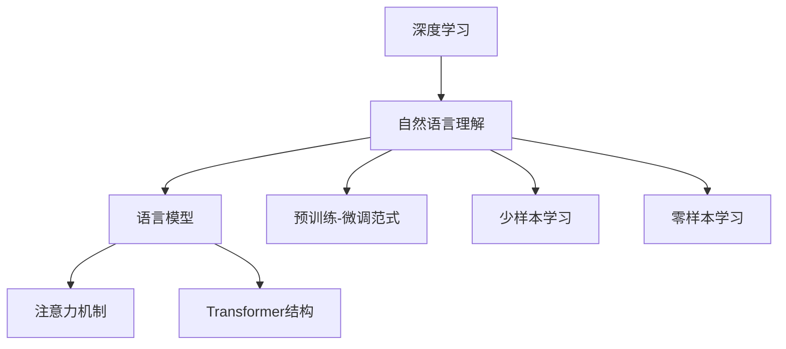

                 

# 深度学习在自然语言理解中的应用

> 关键词：深度学习,自然语言理解,语言模型,注意力机制,Transformer,循环神经网络(RNN),卷积神经网络(CNN),序列标注,文本分类

## 1. 背景介绍

自然语言理解（Natural Language Understanding, NLU），即计算机理解、解释和生成自然语言的能力，是人工智能领域的一大挑战。深度学习技术的快速发展，为这一领域带来了新的突破，特别是语言模型的提出和不断升级。通过深度学习技术，计算机能够对自然语言进行有效的处理、分析和生成，为各种应用场景提供了强大的支持。

### 1.1 问题由来

在自然语言处理（NLP）中，深度学习的应用可以追溯到1990年代初期，当时研究人员开始使用神经网络来处理自然语言。然而，直到2012年，随着深度学习在计算机视觉领域取得的突破，NLP领域才迎来了重大进展。2012年，AlexNet模型在图像识别任务上取得了巨大成功，启发了研究者探索在自然语言处理中应用深度学习的潜力。

近年来，基于深度学习的语言模型，如BERT、GPT和T5等，通过在无标签文本上预训练，在NLP任务上取得了显著的进展。这些模型利用Transformer结构和注意力机制，不仅在大规模文本数据上取得了优异的性能，还在各种下游任务上，如机器翻译、文本分类、情感分析等，展示了强大的能力。

### 1.2 问题核心关键点

深度学习在自然语言理解中的应用，主要包括以下几个关键点：

- **语言模型**：基于神经网络的语言模型，通过学习文本序列的概率分布，能够对自然语言进行有效的预测和生成。
- **注意力机制**：利用注意力机制，模型能够动态关注文本序列中的不同部分，提高信息处理能力。
- **Transformer结构**：Transformer结构通过自注意力机制，能够并行计算文本序列中各部分的关联，极大地提升了模型的训练速度和性能。
- **预训练-微调范式**：通过在大规模无标签文本上预训练，然后在特定任务上微调，深度学习模型能够在有限的标注数据上快速适应新任务。
- **少样本学习和零样本学习**：利用迁移学习和预训练知识，深度学习模型能够在仅有少量或无标注数据的情况下进行学习。

这些关键点共同构成了深度学习在自然语言理解中应用的核心理论基础，推动了NLP技术的不断进步。

## 2. 核心概念与联系

### 2.1 核心概念概述

为了更好地理解深度学习在自然语言理解中的应用，本节将介绍几个密切相关的核心概念：

- **深度学习**：一种基于多层神经网络的机器学习方法，通过多层次的非线性变换，能够捕捉数据中的复杂结构。
- **自然语言理解**：计算机理解和解释自然语言的能力，包括文本分类、命名实体识别、情感分析、机器翻译等任务。
- **语言模型**：通过学习文本序列的概率分布，预测给定文本的下一个单词或字符的概率，从而生成文本或理解文本含义。
- **注意力机制**：通过动态调整权重，使模型能够关注文本序列中的不同部分，提高信息处理的效率。
- **Transformer结构**：一种基于自注意力机制的神经网络结构，能够并行计算文本序列中各部分的关联，提升模型的训练速度和性能。
- **预训练-微调范式**：先在大规模无标签文本上预训练模型，然后在特定任务上微调，以适应新任务。
- **少样本学习和零样本学习**：利用迁移学习和预训练知识，模型能够在少量或无标注数据的情况下进行学习。

这些核心概念之间的逻辑关系可以通过以下Mermaid流程图来展示：



这个流程图展示了一些核心概念及其之间的关系：

1. 深度学习是自然语言理解的基础，提供了一种强大的模型构建和训练手段。
2. 语言模型是自然语言理解的核心，通过学习文本序列的概率分布，实现文本生成和理解。
3. 注意力机制和Transformer结构是深度学习中处理序列数据的关键，提高了模型的效率和效果。
4. 预训练-微调范式和少样本学习、零样本学习，是深度学习在自然语言理解中应用的重要方法，使得模型能够在有限数据下快速适应新任务。

这些概念共同构成了深度学习在自然语言理解中应用的理论基础，为NLP技术的发展提供了方向和方法。

## 3. 核心算法原理 & 具体操作步骤
### 3.1 算法原理概述

深度学习在自然语言理解中的应用，主要是通过构建语言模型，利用注意力机制和Transformer结构，在大规模无标签文本上预训练，并在特定任务上进行微调，以实现对自然语言的理解和生成。

形式化地，假设预训练语言模型为 $M_{\theta}$，其中 $\theta$ 为模型参数。给定下游任务 $T$ 的标注数据集 $D=\{(x_i, y_i)\}_{i=1}^N$，其中 $x_i$ 为输入文本，$y_i$ 为任务标签。微调的目标是找到新的模型参数 $\hat{\theta}$，使得：

$$
\hat{\theta}=\mathop{\arg\min}_{\theta} \mathcal{L}(M_{\theta},D)
$$

其中 $\mathcal{L}$ 为针对任务 $T$ 设计的损失函数，用于衡量模型预测输出与真实标签之间的差异。常见的损失函数包括交叉熵损失、均方误差损失等。

通过梯度下降等优化算法，微调过程不断更新模型参数 $\theta$，最小化损失函数 $\mathcal{L}$，使得模型输出逼近真实标签。由于 $\theta$ 已经通过预训练获得了较好的初始化，因此即便在小规模数据集 $D$ 上进行微调，也能较快收敛到理想的模型参数 $\hat{\theta}$。

### 3.2 算法步骤详解

深度学习在自然语言理解中的应用，一般包括以下几个关键步骤：

**Step 1: 准备预训练模型和数据集**
- 选择合适的预训练语言模型 $M_{\theta}$ 作为初始化参数，如BERT、GPT等。
- 准备下游任务 $T$ 的标注数据集 $D$，划分为训练集、验证集和测试集。一般要求标注数据与预训练数据的分布不要差异过大。

**Step 2: 添加任务适配层**
- 根据任务类型，在预训练模型顶层设计合适的输出层和损失函数。
- 对于分类任务，通常在顶层添加线性分类器和交叉熵损失函数。
- 对于生成任务，通常使用语言模型的解码器输出概率分布，并以负对数似然为损失函数。

**Step 3: 设置微调超参数**
- 选择合适的优化算法及其参数，如 AdamW、SGD 等，设置学习率、批大小、迭代轮数等。
- 设置正则化技术及强度，包括权重衰减、Dropout、Early Stopping等。
- 确定冻结预训练参数的策略，如仅微调顶层，或全部参数都参与微调。

**Step 4: 执行梯度训练**
- 将训练集数据分批次输入模型，前向传播计算损失函数。
- 反向传播计算参数梯度，根据设定的优化算法和学习率更新模型参数。
- 周期性在验证集上评估模型性能，根据性能指标决定是否触发 Early Stopping。
- 重复上述步骤直到满足预设的迭代轮数或 Early Stopping 条件。

**Step 5: 测试和部署**
- 在测试集上评估微调后模型 $M_{\hat{\theta}}$ 的性能，对比微调前后的精度提升。
- 使用微调后的模型对新样本进行推理预测，集成到实际的应用系统中。
- 持续收集新的数据，定期重新微调模型，以适应数据分布的变化。

以上是深度学习在自然语言理解中应用的通用流程。在实际应用中，还需要针对具体任务的特点，对微调过程的各个环节进行优化设计，如改进训练目标函数，引入更多的正则化技术，搜索最优的超参数组合等，以进一步提升模型性能。

### 3.3 算法优缺点

深度学习在自然语言理解中的应用，具有以下优点：
1. 简单高效。只需准备少量标注数据，即可对预训练模型进行快速适配，获得较大的性能提升。
2. 通用适用。适用于各种NLP下游任务，包括分类、匹配、生成等，设计简单的任务适配层即可实现微调。
3. 参数高效。利用参数高效微调技术，在固定大部分预训练权重不变的情况下，仍可取得不错的提升。
4. 效果显著。在学术界和工业界的诸多任务上，基于深度学习的方法已经刷新了最先进的性能指标。

同时，该方法也存在一定的局限性：
1. 依赖标注数据。深度学习模型依赖标注数据进行训练，获取高质量标注数据的成本较高。
2. 迁移能力有限。当目标任务与预训练数据的分布差异较大时，深度学习模型的性能提升有限。
3. 负面效果传递。深度学习模型在训练过程中可能学习到一些有偏见、有害的信息，通过微调传递到下游任务，造成负面影响。
4. 可解释性不足。深度学习模型的决策过程通常缺乏可解释性，难以对其推理逻辑进行分析和调试。

尽管存在这些局限性，但就目前而言，深度学习在自然语言理解中的应用范式仍然是最主流的选择。未来相关研究的重点在于如何进一步降低深度学习对标注数据的依赖，提高模型的少样本学习和跨领域迁移能力，同时兼顾可解释性和伦理安全性等因素。

### 3.4 算法应用领域

深度学习在自然语言理解中的应用，已经在诸多领域得到了广泛的应用，覆盖了几乎所有常见的NLP任务，例如：

- 文本分类：如情感分析、主题分类、意图识别等。通过微调使模型学习文本-标签映射。
- 命名实体识别：识别文本中的人名、地名、机构名等特定实体。通过微调使模型掌握实体边界和类型。
- 关系抽取：从文本中抽取实体之间的语义关系。通过微调使模型学习实体-关系三元组。
- 问答系统：对自然语言问题给出答案。将问题-答案对作为微调数据，训练模型学习匹配答案。
- 机器翻译：将源语言文本翻译成目标语言。通过微调使模型学习语言-语言映射。
- 文本摘要：将长文本压缩成简短摘要。将文章-摘要对作为微调数据，使模型学习抓取要点。
- 对话系统：使机器能够与人自然对话。将多轮对话历史作为上下文，微调模型进行回复生成。

除了上述这些经典任务外，深度学习在自然语言理解中的应用，还在可控文本生成、常识推理、代码生成、数据增强等诸多创新场景中取得了重要突破，为NLP技术带来了新的发展机遇。

## 4. 数学模型和公式 & 详细讲解 & 举例说明
### 4.1 数学模型构建

本节将使用数学语言对深度学习在自然语言理解中的应用进行更加严格的刻画。

记预训练语言模型为 $M_{\theta}$，其中 $\theta$ 为模型参数。假设微调任务的训练集为 $D=\{(x_i,y_i)\}_{i=1}^N, x_i \in \mathcal{X}, y_i \in \mathcal{Y}$。

定义模型 $M_{\theta}$ 在数据样本 $(x,y)$ 上的损失函数为 $\ell(M_{\theta}(x),y)$，则在数据集 $D$ 上的经验风险为：

$$
\mathcal{L}(\theta) = \frac{1}{N} \sum_{i=1}^N \ell(M_{\theta}(x_i),y_i)
$$

微调的优化目标是最小化经验风险，即找到最优参数：

$$
\theta^* = \mathop{\arg\min}_{\theta} \mathcal{L}(\theta)
$$

在实践中，我们通常使用基于梯度的优化算法（如SGD、Adam等）来近似求解上述最优化问题。设 $\eta$ 为学习率，$\lambda$ 为正则化系数，则参数的更新公式为：

$$
\theta \leftarrow \theta - \eta \nabla_{\theta}\mathcal{L}(\theta) - \eta\lambda\theta
$$

其中 $\nabla_{\theta}\mathcal{L}(\theta)$ 为损失函数对参数 $\theta$ 的梯度，可通过反向传播算法高效计算。

### 4.2 公式推导过程

以下我们以二分类任务为例，推导交叉熵损失函数及其梯度的计算公式。

假设模型 $M_{\theta}$ 在输入 $x$ 上的输出为 $\hat{y}=M_{\theta}(x) \in [0,1]$，表示样本属于正类的概率。真实标签 $y \in \{0,1\}$。则二分类交叉熵损失函数定义为：

$$
\ell(M_{\theta}(x),y) = -[y\log \hat{y} + (1-y)\log (1-\hat{y})]
$$

将其代入经验风险公式，得：

$$
\mathcal{L}(\theta) = -\frac{1}{N}\sum_{i=1}^N [y_i\log M_{\theta}(x_i)+(1-y_i)\log(1-M_{\theta}(x_i))]
$$

根据链式法则，损失函数对参数 $\theta_k$ 的梯度为：

$$
\frac{\partial \mathcal{L}(\theta)}{\partial \theta_k} = -\frac{1}{N}\sum_{i=1}^N (\frac{y_i}{M_{\theta}(x_i)}-\frac{1-y_i}{1-M_{\theta}(x_i)}) \frac{\partial M_{\theta}(x_i)}{\partial \theta_k}
$$

其中 $\frac{\partial M_{\theta}(x_i)}{\partial \theta_k}$ 可进一步递归展开，利用自动微分技术完成计算。

在得到损失函数的梯度后，即可带入参数更新公式，完成模型的迭代优化。重复上述过程直至收敛，最终得到适应下游任务的最优模型参数 $\theta^*$。

### 4.3 案例分析与讲解

以下我们将以情感分析任务为例，具体讲解深度学习在自然语言理解中的应用。

情感分析任务旨在识别文本的情感极性，分为正面、负面和中性三种情感。常见的数据集包括IMDB电影评论、Yelp商家评论等。我们可以使用BERT预训练模型，在包含情感标签的数据集上进行微调，以识别文本的情感极性。

假设我们已经获得了一个包含100,000条IMDB电影评论的标注数据集，其中每条评论都被标记为正面、负面或中性。我们可以使用BERT作为预训练模型，将其加载并送入数据集。接下来，我们需要定义一个输出层，用于处理二分类任务，即正面和负面。我们使用softmax函数作为输出层，设置交叉熵损失函数。

接下来，我们定义模型参数并设置优化器，包括学习率、批大小等。

```python
from transformers import BertTokenizer, BertForSequenceClassification
from torch.utils.data import Dataset, DataLoader
from torch import nn
from torch.nn import CrossEntropyLoss
import torch

# 数据集准备
tokenizer = BertTokenizer.from_pretrained('bert-base-uncased')
train_dataset = MyDataset(train_data, tokenizer, labels=train_labels)
val_dataset = MyDataset(val_data, tokenizer, labels=val_labels)
test_dataset = MyDataset(test_data, tokenizer, labels=test_labels)

# 模型定义
model = BertForSequenceClassification.from_pretrained('bert-base-uncased', num_labels=3)
model = model.to(device)

# 损失函数和优化器定义
criterion = nn.CrossEntropyLoss()
optimizer = torch.optim.Adam(model.parameters(), lr=2e-5)

# 训练
for epoch in range(epochs):
    train_loss = 0
    for i, (input_ids, attention_mask, labels) in enumerate(train_loader):
        input_ids = input_ids.to(device)
        attention_mask = attention_mask.to(device)
        labels = labels.to(device)
        
        model.train()
        optimizer.zero_grad()
        outputs = model(input_ids, attention_mask=attention_mask, labels=labels)
        loss = criterion(outputs, labels)
        loss.backward()
        optimizer.step()
        train_loss += loss.item()
    
    print(f"Epoch {epoch+1}, train loss: {train_loss/len(train_loader):.3f}")
    val_loss = 0
    with torch.no_grad():
        model.eval()
        for i, (input_ids, attention_mask, labels) in enumerate(val_loader):
            input_ids = input_ids.to(device)
            attention_mask = attention_mask.to(device)
            labels = labels.to(device)
            
            outputs = model(input_ids, attention_mask=attention_mask)
            loss = criterion(outputs, labels)
            val_loss += loss.item()
        
        print(f"Epoch {epoch+1}, val loss: {val_loss/len(val_loader):.3f}")
```

通过上述代码，我们完成了对BERT模型在情感分析任务上的微调。在这个过程中，我们利用了BERT模型强大的预训练能力和少样本学习能力，通过小规模标注数据，就能快速提升模型在情感分析任务上的性能。

## 5. 项目实践：代码实例和详细解释说明
### 5.1 开发环境搭建

在进行深度学习项目开发前，我们需要准备好开发环境。以下是使用Python进行PyTorch开发的环境配置流程：

1. 安装Anaconda：从官网下载并安装Anaconda，用于创建独立的Python环境。

2. 创建并激活虚拟环境：
```bash
conda create -n pytorch-env python=3.8 
conda activate pytorch-env
```

3. 安装PyTorch：根据CUDA版本，从官网获取对应的安装命令。例如：
```bash
conda install pytorch torchvision torchaudio cudatoolkit=11.1 -c pytorch -c conda-forge
```

4. 安装TensorFlow：
```bash
pip install tensorflow==2.7
```

5. 安装各类工具包：
```bash
pip install numpy pandas scikit-learn matplotlib tqdm jupyter notebook ipython
```

完成上述步骤后，即可在`pytorch-env`环境中开始深度学习项目开发。

### 5.2 源代码详细实现

下面我们以命名实体识别(NER)任务为例，给出使用Transformers库对BERT模型进行微调的PyTorch代码实现。

首先，定义NER任务的数据处理函数：

```python
from transformers import BertTokenizer
from torch.utils.data import Dataset
import torch

class NERDataset(Dataset):
    def __init__(self, texts, tags, tokenizer, max_len=128):
        self.texts = texts
        self.tags = tags
        self.tokenizer = tokenizer
        self.max_len = max_len
        
    def __len__(self):
        return len(self.texts)
    
    def __getitem__(self, item):
        text = self.texts[item]
        tags = self.tags[item]
        
        encoding = self.tokenizer(text, return_tensors='pt', max_length=self.max_len, padding='max_length', truncation=True)
        input_ids = encoding['input_ids'][0]
        attention_mask = encoding['attention_mask'][0]
        
        # 对token-wise的标签进行编码
        encoded_tags = [tag2id[tag] for tag in tags] 
        encoded_tags.extend([tag2id['O']] * (self.max_len - len(encoded_tags)))
        labels = torch.tensor(encoded_tags, dtype=torch.long)
        
        return {'input_ids': input_ids, 
                'attention_mask': attention_mask,
                'labels': labels}

# 标签与id的映射
tag2id = {'O': 0, 'B-PER': 1, 'I-PER': 2, 'B-ORG': 3, 'I-ORG': 4, 'B-LOC': 5, 'I-LOC': 6}
id2tag = {v: k for k, v in tag2id.items()}

# 创建dataset
tokenizer = BertTokenizer.from_pretrained('bert-base-cased')

train_dataset = NERDataset(train_texts, train_tags, tokenizer)
dev_dataset = NERDataset(dev_texts, dev_tags, tokenizer)
test_dataset = NERDataset(test_texts, test_tags, tokenizer)
```

然后，定义模型和优化器：

```python
from transformers import BertForTokenClassification, AdamW

model = BertForTokenClassification.from_pretrained('bert-base-cased', num_labels=len(tag2id))

optimizer = AdamW(model.parameters(), lr=2e-5)
```

接着，定义训练和评估函数：

```python
from torch.utils.data import DataLoader
from tqdm import tqdm
from sklearn.metrics import classification_report

device = torch.device('cuda') if torch.cuda.is_available() else torch.device('cpu')
model.to(device)

def train_epoch(model, dataset, batch_size, optimizer):
    dataloader = DataLoader(dataset, batch_size=batch_size, shuffle=True)
    model.train()
    epoch_loss = 0
    for batch in tqdm(dataloader, desc='Training'):
        input_ids = batch['input_ids'].to(device)
        attention_mask = batch['attention_mask'].to(device)
        labels = batch['labels'].to(device)
        model.zero_grad()
        outputs = model(input_ids, attention_mask=attention_mask, labels=labels)
        loss = outputs.loss
        epoch_loss += loss.item()
        loss.backward()
        optimizer.step()
    return epoch_loss / len(dataloader)

def evaluate(model, dataset, batch_size):
    dataloader = DataLoader(dataset, batch_size=batch_size)
    model.eval()
    preds, labels = [], []
    with torch.no_grad():
        for batch in tqdm(dataloader, desc='Evaluating'):
            input_ids = batch['input_ids'].to(device)
            attention_mask = batch['attention_mask'].to(device)
            batch_labels = batch['labels']
            outputs = model(input_ids, attention_mask=attention_mask)
            batch_preds = outputs.logits.argmax(dim=2).to('cpu').tolist()
            batch_labels = batch_labels.to('cpu').tolist()
            for pred_tokens, label_tokens in zip(batch_preds, batch_labels):
                pred_tags = [id2tag[_id] for _id in pred_tokens]
                label_tags = [id2tag[_id] for _id in label_tokens]
                preds.append(pred_tags[:len(label_tags)])
                labels.append(label_tags)
                
    print(classification_report(labels, preds))
```

最后，启动训练流程并在测试集上评估：

```python
epochs = 5
batch_size = 16

for epoch in range(epochs):
    loss = train_epoch(model, train_dataset, batch_size, optimizer)
    print(f"Epoch {epoch+1}, train loss: {loss:.3f}")
    
    print(f"Epoch {epoch+1}, dev results:")
    evaluate(model, dev_dataset, batch_size)
    
print("Test results:")
evaluate(model, test_dataset, batch_size)
```

以上就是使用PyTorch对BERT进行命名实体识别任务微调的完整代码实现。可以看到，得益于Transformers库的强大封装，我们可以用相对简洁的代码完成BERT模型的加载和微调。

### 5.3 代码解读与分析

让我们再详细解读一下关键代码的实现细节：

**NERDataset类**：
- `__init__`方法：初始化文本、标签、分词器等关键组件。
- `__len__`方法：返回数据集的样本数量。
- `__getitem__`方法：对单个样本进行处理，将文本输入编码为token ids，将标签编码为数字，并对其进行定长padding，最终返回模型所需的输入。

**tag2id和id2tag字典**：
- 定义了标签与数字id之间的映射关系，用于将token-wise的预测结果解码回真实的标签。

**训练和评估函数**：
- 使用PyTorch的DataLoader对数据集进行批次化加载，供模型训练和推理使用。
- 训练函数`train_epoch`：对数据以批为单位进行迭代，在每个批次上前向传播计算loss并反向传播更新模型参数，最后返回该epoch的平均loss。
- 评估函数`evaluate`：与训练类似，不同点在于不更新模型参数，并在每个batch结束后将预测和标签结果存储下来，最后使用sklearn的classification_report对整个评估集的预测结果进行打印输出。

**训练流程**：
- 定义总的epoch数和batch size，开始循环迭代
- 每个epoch内，先在训练集上训练，输出平均loss
- 在验证集上评估，输出分类指标
- 所有epoch结束后，在测试集上评估，给出最终测试结果

可以看到，PyTorch配合Transformers库使得BERT微调的代码实现变得简洁高效。开发者可以将更多精力放在数据处理、模型改进等高层逻辑上，而不必过多关注底层的实现细节。

当然，工业级的系统实现还需考虑更多因素，如模型的保存和部署、超参数的自动搜索、更灵活的任务适配层等。但核心的微调范式基本与此类似。

## 6. 实际应用场景
### 6.1 智能客服系统

深度学习在自然语言理解中的应用，已经广泛应用于智能客服系统的构建。传统客服往往需要配备大量人力，高峰期响应缓慢，且一致性和专业性难以保证。而使用深度学习模型，可以7x24小时不间断服务，快速响应客户咨询，用自然流畅的语言解答各类常见问题。

在技术实现上，可以收集企业内部的历史客服对话记录，将问题和最佳答复构建成监督数据，在此基础上对深度学习模型进行微调。微调后的模型能够自动理解用户意图，匹配最合适的答案模板进行回复。对于客户提出的新问题，还可以接入检索系统实时搜索相关内容，动态组织生成回答。如此构建的智能客服系统，能大幅提升客户咨询体验和问题解决效率。

### 6.2 金融舆情监测

金融机构需要实时监测市场舆论动向，以便及时应对负面信息传播，规避金融风险。传统的人工监测方式成本高、效率低，难以应对网络时代海量信息爆发的挑战。深度学习在自然语言理解中的应用，为金融舆情监测提供了新的解决方案。

具体而言，可以收集金融领域相关的新闻、报道、评论等文本数据，并对其进行主题标注和情感标注。在此基础上对深度学习模型进行微调，使其能够自动判断文本属于何种主题，情感倾向是正面、中性还是负面。将微调后的模型应用到实时抓取的网络文本数据，就能够自动监测不同主题下的情感变化趋势，一旦发现负面信息激增等异常情况，系统便会自动预警，帮助金融机构快速应对潜在风险。

### 6.3 个性化推荐系统

当前的推荐系统往往只依赖用户的历史行为数据进行物品推荐，无法深入理解用户的真实兴趣偏好。深度学习在自然语言理解中的应用，可以更好地挖掘用户行为背后的语义信息，从而提供更精准、多样的推荐内容。

在实践中，可以收集用户浏览、点击、评论、分享等行为数据，提取和用户交互的物品标题、描述、标签等文本内容。将文本内容作为模型输入，用户的后续行为（如是否点击、购买等）作为监督信号，在此基础上对深度学习模型进行微调。微调后的模型能够从文本内容中准确把握用户的兴趣点。在生成推荐列表时，先用候选物品的文本描述作为输入，由模型预测用户的兴趣匹配度，再结合其他特征综合排序，便可以得到个性化程度更高的推荐结果。

### 6.4 未来应用展望

随着深度学习在自然语言理解中的应用不断深入，其应用前景将更加广阔。以下是一些可能的应用方向：

- **多模态自然语言理解**：结合视觉、语音等多模态数据，提升深度学习模型对现实世界的理解和建模能力。
- **深度语言生成**：利用深度学习模型的生成能力，生成自然流畅的语言文本，应用于文本摘要、对话生成等任务。
- **跨语言知识图谱**：构建跨语言的语义知识图谱，帮助深度学习模型在不同语言间进行知识迁移和推理。
- **情感计算**：利用深度学习模型对情感信息进行理解和计算，应用于舆情分析、用户心理研究等领域。
- **人机交互**：结合自然语言理解和生成技术，构建更加自然流畅的人机交互系统，提升用户体验。

深度学习在自然语言理解中的应用，正在不断突破传统技术的边界，带来新的应用场景和创新可能性。相信随着技术的不断进步，深度学习将进一步推动自然语言处理技术的发展，为人工智能带来新的突破。

## 7. 工具和资源推荐
### 7.1 学习资源推荐

为了帮助开发者系统掌握深度学习在自然语言理解中的应用，这里推荐一些优质的学习资源：

1. 《深度学习》（Ian Goodfellow等著）：深度学习领域的经典教材，全面介绍了深度学习的基本概念和原理，适合初学者入门。

2. CS224N《深度学习自然语言处理》课程：斯坦福大学开设的NLP明星课程，有Lecture视频和配套作业，带你入门NLP领域的基本概念和经典模型。

3. 《NLP with PyTorch》书籍：PyTorch官方出品的自然语言处理教程，涵盖PyTorch在自然语言处理中的应用，适合PyTorch用户学习。

4. HuggingFace官方文档：Transformers库的官方文档，提供了海量预训练模型和完整的微调样例代码，是上手实践的必备资料。

5. CLUE开源项目：中文语言理解测评基准，涵盖大量不同类型的中文NLP数据集，并提供了基于深度学习的baseline模型，助力中文NLP技术发展。

通过对这些资源的学习实践，相信你一定能够快速掌握深度学习在自然语言理解中的应用，并用于解决实际的NLP问题。
###  7.2 开发工具推荐

高效的开发离不开优秀的工具支持。以下是几款用于深度学习项目开发的常用工具：

1. PyTorch：基于Python的开源深度学习框架，灵活动态的计算图，适合快速迭代研究。大部分的深度学习模型都有PyTorch版本的实现。

2. TensorFlow：由Google主导开发的开源深度学习框架，生产部署方便，适合大规模工程应用。同样有丰富的深度学习模型资源。

3. Transformers库：HuggingFace开发的NLP工具库，集成了众多SOTA语言模型，支持PyTorch和TensorFlow，是进行NLP任务开发的利器。

4. Weights & Biases：模型训练的实验跟踪工具，可以记录和可视化模型训练过程中的各项指标，方便对比和调优。与主流深度学习框架无缝集成。

5. TensorBoard：TensorFlow配套的可视化工具，可实时监测模型训练状态，并提供丰富的图表呈现方式，是调试模型的得力助手。

6. Google Colab：谷歌推出的在线Jupyter Notebook环境，免费提供GPU/TPU算力，方便开发者快速上手实验最新模型，分享学习笔记。

合理利用这些工具，可以显著提升深度学习项目开发效率，加快创新迭代的步伐。

### 7.3 相关论文推荐

深度学习在自然语言理解中的应用，源于学界的持续研究。以下是几篇奠基性的相关论文，推荐阅读：

1. Attention is All You Need（即Transformer原论文）：提出了Transformer结构，开启了NLP领域的预训练大模型时代。

2. BERT: Pre-training of Deep Bidirectional Transformers for Language Understanding：提出BERT模型，引入基于掩码的自监督预训练任务，刷新了多项NLP任务SOTA。

3. Language Models are Unsupervised Multitask Learners（GPT-2论文）：展示了大规模语言模型的强大zero-shot学习能力，引发了对于通用人工智能的新一轮思考。

4. Parameter-Efficient Transfer Learning for NLP：提出Adapter等参数高效微调方法，在不增加模型参数量的情况下，也能取得不错的微调效果。

5. Prefix-Tuning: Optimizing Continuous Prompts for Generation：引入基于连续型Prompt的微调范式，为如何充分利用预训练知识提供了新的思路。

6. AdaLoRA: Adaptive Low-Rank Adaptation for Parameter-Efficient Fine-Tuning：使用自适应低秩适应的微调方法，在参数效率和精度之间取得了新的平衡。

这些论文代表了大语言模型微调技术的发展脉络。通过学习这些前沿成果，可以帮助研究者把握学科前进方向，激发更多的创新灵感。

## 8. 总结：未来发展趋势与挑战
### 8.1 研究成果总结

深度学习在自然语言理解中的应用，已经在诸多领域取得了显著的进展。通过构建语言模型，利用注意力机制和Transformer结构，在大规模无标签文本上预训练，然后在特定任务上进行微调，深度学习模型已经展现出强大的性能。其在文本分类、命名实体识别、情感分析、机器翻译、文本摘要、对话生成等任务上，都取得了领先的成绩。

### 8.2 未来发展趋势

展望未来，深度学习在自然语言理解中的应用将呈现以下几个发展趋势：

1. **模型规模持续增大**：随着算力成本的下降和数据规模的扩张，深度学习模型的参数量还将持续增长。超大规模语言模型蕴含的丰富语言知识，有望支撑更加复杂多变的下游任务微调。

2. **深度学习范式的多样化**：未来将涌现更多深度学习范式，如基于自监督学习、无监督学习的微调方法，通过引入更多的先验知识，提升模型的泛化能力和鲁棒性。

3. **参数高效和计算高效的微调方法**：开发更加参数高效的微调方法，在固定大部分预训练参数的情况下，只更新极少量的任务相关参数，同时优化模型的计算图，减少前向传播和反向传播的资源消耗，实现更加轻量级、实时性的部署。

4. **多模态微调和跨语言知识图谱**：结合视觉、语音等多模态数据，提升深度学习模型对现实世界的理解和建模能力。构建跨语言的语义知识图谱，帮助深度学习模型在不同语言间进行知识迁移和推理。

5. **情感计算和个性化推荐**：利用深度学习模型对情感信息进行理解和计算，应用于舆情分析、用户心理研究等领域。结合自然语言理解和生成技术，构建更加自然流畅的人机交互系统，提升用户体验。

6. **伦理道德和安全性的考虑**：随着深度学习模型的广泛应用，伦理道德和安全性的问题将越来越受到重视。如何在模型训练目标中引入伦理导向的评估指标，过滤和惩罚有偏见、有害的输出倾向，构建可信、可靠、可解释的深度学习系统，将是未来的重要研究方向。

### 8.3 面临的挑战

尽管深度学习在自然语言理解中的应用取得了显著进展，但在迈向更加智能化、普适化应用的过程中，仍然面临诸多挑战：

1. **标注成本瓶颈**：深度学习模型依赖标注数据进行训练，获取高质量标注数据的成本较高，尤其是在小样本或长尾应用场景中。如何进一步降低深度学习对标注数据的依赖，将是一大难题。

2. **模型鲁棒性不足**：深度学习模型面对域外数据时，泛化性能往往大打折扣。对于测试样本的微小扰动，深度学习模型的预测也容易发生波动。如何提高深度学习模型的鲁棒性，避免灾难性遗忘，还需要更多理论和实践的积累。

3. **推理效率有待提高**：大规模深度学习模型虽然在精度上表现优异，但在实际部署时往往面临推理速度慢、内存占用大等效率问题。如何在保证性能的同时，简化模型结构，提升推理速度，优化资源占用，将是重要的优化方向。

4. **可解释性亟需加强**：深度学习模型的决策过程通常缺乏可解释性，难以对其推理逻辑进行分析和调试。对于医疗、金融等高风险应用，算法的可解释性和可审计性尤为重要。如何赋予深度学习模型更强的可解释性，将是亟待攻克的难题。

5. **安全性有待保障**：预训练深度学习模型难免会学习到一些有偏见、有害的信息，通过微调传递到下游任务，产生误导性、歧视性的输出，给实际应用带来安全隐患。如何从数据和算法层面消除模型偏见，避免恶意用途，确保输出的安全性，也将是重要的研究课题。

6. **知识整合能力不足**：现有的深度学习模型往往局限于任务内数据，难以灵活吸收和运用更广泛的先验知识。如何让深度学习过程更好地与外部知识库、规则库等专家知识结合，形成更加全面、准确的信息整合能力，还有很大的想象空间。

正视深度学习在自然语言理解中面临的这些挑战，积极应对并寻求突破，将是大语言模型微调走向成熟的必由之路。相信随着学界和产业界的共同努力，这些挑战终将一一被克服，深度学习在自然语言理解中的应用必将带来更多的突破和创新。

### 8.4 研究展望

面向未来，深度学习在自然语言理解中的应用研究，可以从以下几个方向进行突破：

1. **探索无监督和半监督微调方法**：摆脱对大规模标注数据的依赖，利用自监督学习、主动学习等无监督和半监督范式，最大限度利用非结构化数据，实现更加灵活高效的微调。

2. **引入因果和对比学习范式**：通过引入因果推断和对比学习思想，增强深度学习模型建立稳定因果关系的能力，学习更加普适、鲁棒的语言表征，从而提升模型泛化性和抗干扰能力。

3. **结合因果分析和博弈论工具**：将因果分析方法引入深度学习模型，识别出模型决策的关键特征，增强输出解释的因果性和逻辑性。借助博弈论工具刻画人机交互过程，主动探索并规避模型的脆弱点，提高系统稳定性。

4. **纳入伦理道德约束**：在模型训练目标中引入伦理导向的评估指标，过滤和惩罚有偏见、有害的输出倾向。同时加强人工干预和审核，建立模型行为的监管机制，确保输出符合人类价值观和伦理道德。

这些研究方向凸显了深度学习在自然语言理解中应用的广阔前景。这些方向的探索发展，必将进一步提升深度学习系统的性能和应用范围，为人工智能技术的发展提供新的动力。总之，深度学习在自然语言理解中的应用，需要在数据、算法、工程、业务等多个维度进行协同优化，才能真正实现人工智能技术在垂直行业的规模化落地。面向未来，深度学习技术还需要与其他人工智能技术进行更深入的融合，如知识表示、因果推理、强化学习等，多路径协同发力，共同推动自然语言处理技术的发展。只有勇于创新、敢于突破，才能不断拓展语言模型的边界，让智能技术更好地造福人类社会。

## 9. 附录：常见问题与解答

**Q1：深度学习模型在处理长文本时效率低下，如何解决？**

A: 深度学习模型在处理长文本时，确实面临效率低下的问题。一种解决方案是使用分词技术将长文本分割成短句或单词，然后分别处理每个片段。另外，可以采用Transformer中的注意力机制，动态关注文本中的关键部分，减少处理长度对效率的影响。

**Q2：深度学习模型在处理多语言文本时效果不佳，如何提升？**

A: 深度学习模型在处理多语言文本时，容易受到语言转换的影响。一种解决方案是使用跨语言预训练模型，如mBART、XLM等，在多语言语料上预训练。此外，还可以使用注意力机制，动态关注不同语言之间的相似性和差异性，提升模型在多语言任务上的表现。

**Q3：深度学习模型在处理复杂任务时泛化性能差，如何改善？**

A: 深度学习模型在处理复杂任务时，泛化性能差是一个普遍存在的问题。一种解决方案是使用迁移学习，通过在大规模无标签数据上进行预训练，然后在特定任务上进行微调，从而提高模型的泛化能力。此外，还可以引入更多的先验知识，如知识图谱、规则库等，帮助模型更好地理解任务背景和约束条件。

**Q4：深度学习模型在处理高维度数据时，容易过拟合，如何避免？**

A: 深度学习模型在处理高维度数据时，确实容易过拟合。一种解决方案是使用正则化技术，如L2正则、Dropout等，控制模型的复杂度。此外，还可以采用早停法（Early Stopping），当模型在验证集上的性能不再提升时，停止训练，避免过拟合。

**Q5：深度学习模型在处理实时数据时，推理速度慢，如何优化？**

A: 深度学习模型在处理实时数据时，确实面临推理速度慢的问题。一种解决方案是使用模型压缩技术，如剪枝、量化、蒸馏等，减少模型的大小和计算量。此外，还可以使用多线程、分布式训练等技术，加速模型的推理过程。

通过回答这些问题，我们可以看到深度学习在自然语言理解中的应用，尽管存在一些挑战，但通过合理的策略和算法优化，仍可以克服这些问题，实现高效、可靠的应用。

