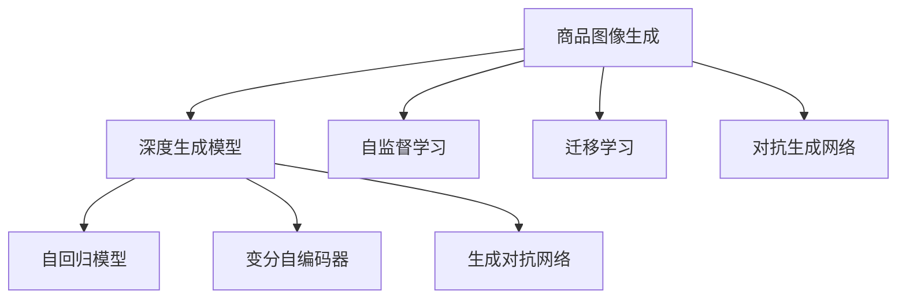

                 

# 深度学习驱动的商品图像生成质量提升

在当今的电商领域，商品图像的质量直接影响着用户体验和销售转化率。高质量的商品图像能够吸引用户的注意，提供清晰的商品信息，从而提高用户的购买决策速度和准确性。然而，手动拍摄商品图像不仅耗时耗力，而且受限于拍摄设备和环境的限制，可能难以保证图像质量的一致性。因此，自动生成高质量的商品图像成为提升电商用户体验和效率的重要手段。

## 1. 背景介绍

### 1.1 问题由来

随着电商业务的蓬勃发展，商品图像的拍摄、上传和展示变得越来越重要。商品图像不仅传达了商品的信息，也影响了用户的情感体验。电商网站中，商品图像的点击率、转化率、退货率等关键指标均受到图像质量的影响。在商品丰富多样、竞争激烈的市场环境中，高质量的商品图像能够显著提升用户的购物体验，进而带动销售增长。

尽管现有的电商平台上拥有大量的商品图像，但许多商家和个人用户依然需要通过手动拍摄或外包摄影服务来获取商品图像。手动拍摄往往需要耗费大量时间和精力，且质量难以保证，特别是在光线、角度等拍摄环境变化较大时。而外包服务虽然能够提升图像质量，但成本较高，且服务速度难以保证。因此，自动生成高质量的商品图像，成为电商平台提升用户体验、降低成本的重要方向。

### 1.2 问题核心关键点

自动生成高质量的商品图像需要解决以下几个核心问题：

- **图像生成模型**：如何构建一个能够生成高质量商品图像的深度学习模型。
- **数据收集与处理**：如何获取和处理适合生成任务的大量商品图像数据。
- **模型训练与优化**：如何通过大量的商品图像数据训练模型，并优化模型参数。
- **生成效率与质量**：如何在保证生成速度的同时，提升生成图像的质量。

这些问题构成了自动生成高质量商品图像的主要挑战，也是本论文的研究重点。

## 2. 核心概念与联系

### 2.1 核心概念概述

为了更好地理解自动生成商品图像的技术，本节将介绍几个关键概念：

- **商品图像生成（Product Image Generation）**：使用深度学习技术自动生成高质量的商品图像，常见于电商、服装、家居等领域。

- **深度生成模型（Deep Generative Models）**：包括自回归模型（如GPT）、变分自编码器（VAE）、生成对抗网络（GAN）等，用于生成具有一定概率分布的随机变量，可以应用于商品图像生成任务。

- **自监督学习（Self-supervised Learning）**：通过构建一些不依赖于标注的无监督学习任务，训练模型进行图像生成。

- **迁移学习（Transfer Learning）**：利用预训练模型进行微调，提升商品图像生成的效果。

- **对抗生成网络（Adversarial Generative Networks）**：通过生成器（Generator）和判别器（Discriminator）的对抗训练，提升生成的商品图像的质量。

这些概念之间的联系可以通过以下Mermaid流程图来展示：



这个流程图展示了大规模商品图像生成的核心概念及其之间的关系：

1. 商品图像生成任务通常使用深度生成模型来实现。
2. 深度生成模型主要包括自回归模型、变分自编码器和生成对抗网络。
3. 自监督学习和迁移学习是常用的模型训练方法，以提升生成模型的性能。
4. 对抗生成网络通过对生成器和判别器的对抗训练，进一步提升生成图像的质量。

这些概念共同构成了商品图像生成的技术框架，使得自动生成高质量商品图像成为可能。

## 3. 核心算法原理 & 具体操作步骤

### 3.1 算法原理概述

自动生成高质量的商品图像，本质上是一个生成对抗网络（GAN）框架下的深度学习任务。其核心思想是使用两个深度神经网络：生成器（Generator）和判别器（Discriminator）进行对抗训练，生成具有高质量的商品图像。

具体来说，生成器接收一个随机的噪声向量 $z$，将其映射为一张商品图像 $x$。判别器接收一张商品图像 $x$，将其分类为真实商品图像或生成器生成的伪造图像。两个网络进行对抗训练，生成器努力生成与真实商品图像相似的图像，而判别器则努力区分真实图像和生成图像。

**算法原理总结**：

- 生成器将随机噪声 $z$ 映射为商品图像 $x$。
- 判别器接收商品图像 $x$，分类为真实图像或生成图像。
- 通过对抗训练，生成器逐渐学习生成高质量商品图像，判别器逐渐学习区分真实与伪造图像。

### 3.2 算法步骤详解

自动生成高质量的商品图像通常包括以下几个关键步骤：

**Step 1: 数据收集与处理**
- 收集大量的商品图像数据，确保数据的多样性和代表性。
- 数据预处理：包括图像尺寸归一化、噪声去噪、数据增强等。
- 数据划分：将数据集划分为训练集、验证集和测试集。

**Step 2: 模型构建与初始化**
- 设计生成器和判别器的网络结构，如使用卷积神经网络（CNN）等。
- 生成器和判别器的初始权重随机化或使用预训练模型。
- 确定网络损失函数和优化器。

**Step 3: 对抗训练过程**
- 迭代训练生成器和判别器。
- 生成器生成伪造图像，判别器判断图像的真实性。
- 根据损失函数计算梯度，更新生成器和判别器的参数。
- 重复迭代多次，直到生成器和判别器达到稳定状态。

**Step 4: 生成图像**
- 使用训练好的生成器，接收随机噪声生成商品图像。
- 对生成的图像进行后处理，如裁剪、去噪、调整亮度等。

**Step 5: 评估与优化**
- 在测试集上评估生成图像的质量，通过指标如PSNR（峰值信噪比）、SSIM（结构相似性指数）等评估图像质量。
- 根据评估结果调整模型参数，继续训练生成器。

### 3.3 算法优缺点

自动生成高质量的商品图像的GAN模型有以下优点：

1. **图像质量高**：生成的商品图像在细节和真实度上接近真人拍摄。
2. **可定制性强**：可以通过调整生成器网络结构，生成不同风格和样式的商品图像。
3. **数据需求低**：相比于真人拍摄，生成的商品图像数量不受限制。
4. **适应性强**：适用于各种商品类别，如服装、鞋帽、家居等。

同时，该算法也存在一定的局限性：

1. **计算资源需求高**：生成高质量的商品图像需要大量的计算资源和训练时间。
2. **对抗样本敏感**：对抗生成网络对对抗样本的鲁棒性较低，容易受到攻击。
3. **过拟合风险**：在训练过程中容易过拟合训练数据，导致生成图像质量下降。
4. **生成速度慢**：生成的商品图像质量虽然高，但生成速度较慢，难以满足实时性要求。

### 3.4 算法应用领域

自动生成高质量的商品图像技术已经在多个领域得到应用，包括：

- **电商**：提升商品展示效果，吸引用户点击，提高转化率。
- **服装设计**：快速生成服装设计图，提升设计效率。
- **家居装修**：生成家居摆放图，提供装修建议。
- **广告制作**：自动生成广告图像，减少设计成本。

除了这些应用，自动生成商品图像还可能在其他领域得到扩展，如医疗、教育、娱乐等。随着技术的不断进步，自动生成商品图像将成为商品展示和营销的重要手段。

## 4. 数学模型和公式 & 详细讲解 & 举例说明

### 4.1 数学模型构建

我们定义生成器 $G$ 和判别器 $D$，其中 $G$ 接收随机噪声 $z$ 并生成图像 $x$，$D$ 接收图像 $x$ 并分类为真实图像或生成图像。

- 生成器 $G$：$G(z) = G_{\theta_G}(z)$，其中 $\theta_G$ 是生成器的参数。
- 判别器 $D$：$D(x) = D_{\theta_D}(x)$，其中 $\theta_D$ 是判别器的参数。

生成器和判别器的损失函数分别为：

- 生成器的损失函数 $L_G$：$L_G = \mathbb{E}_{z \sim p(z)} [\log D(G(z))] + \lambda ||G(z)||_2^2$。
- 判别器的损失函数 $L_D$：$L_D = \mathbb{E}_{x \sim p_{data}(x)} [\log D(x)] + \mathbb{E}_{z \sim p(z)} [\log(1 - D(G(z))) ]$。

其中 $\log$ 表示自然对数，$\lambda$ 是正则化参数，$p(z)$ 是噪声向量 $z$ 的分布，$p_{data}(x)$ 是真实图像 $x$ 的分布。

### 4.2 公式推导过程

为了更好地理解上述公式，我们对损失函数进行推导。

生成器的损失函数 $L_G$ 包括两个部分：
1. $D(G(z))$：生成器的输出 $G(z)$ 通过判别器 $D$ 后，计算生成图像的真实性。
2. 正则化项 $||G(z)||_2^2$：对生成器 $G$ 的参数进行正则化，防止过拟合。

判别器的损失函数 $L_D$ 也分为两个部分：
1. $\log D(x)$：真实图像 $x$ 通过判别器 $D$ 后，计算真实图像的真实性。
2. $\log(1 - D(G(z)))$：生成图像 $G(z)$ 通过判别器 $D$ 后，计算生成图像的真实性。

通过对生成器和判别器的对抗训练，生成器学习生成高质量的商品图像，而判别器学习区分真实与伪造图像。最终生成的商品图像将逼近真实图像的分布。

### 4.3 案例分析与讲解

下面以服装商品图像生成为例，展示自动生成高质量商品图像的实际应用。

假设我们有一个服装商品图像数据集，包含1000张高质量的真人拍摄图像。我们设计了一个简单的生成器-判别器对抗网络，使用卷积神经网络（CNN）作为生成器和判别器的结构。

具体步骤如下：

1. **数据收集**：收集1000张高质量的真人拍摄服装商品图像，并将其分为训练集和测试集。
2. **模型构建**：使用卷积神经网络构建生成器和判别器的结构，其中生成器接收随机噪声 $z$，判别器接收图像 $x$。
3. **初始化**：生成器和判别器的初始权重随机化。
4. **对抗训练**：迭代训练生成器和判别器，生成器生成伪造图像，判别器判断图像的真实性，根据损失函数计算梯度，更新生成器和判别器的参数。
5. **评估与优化**：在测试集上评估生成图像的质量，根据评估结果调整模型参数，继续训练生成器。

最终生成的服装商品图像将具有高质量的细节和逼真的纹理，与真人拍摄的图像相似。

## 5. 项目实践：代码实例和详细解释说明

### 5.1 开发环境搭建

在进行商品图像生成实践前，我们需要准备好开发环境。以下是使用Python进行TensorFlow和Keras开发的环境配置流程：

1. 安装Anaconda：从官网下载并安装Anaconda，用于创建独立的Python环境。

2. 创建并激活虚拟环境：
```bash
conda create -n tf-env python=3.8 
conda activate tf-env
```

3. 安装TensorFlow：根据CUDA版本，从官网获取对应的安装命令。例如：
```bash
conda install tensorflow -c conda-forge
```

4. 安装Keras：
```bash
pip install keras
```

5. 安装各类工具包：
```bash
pip install numpy pandas scikit-learn matplotlib tqdm jupyter notebook ipython
```

完成上述步骤后，即可在`tf-env`环境中开始商品图像生成实践。

### 5.2 源代码详细实现

下面我们以服装商品图像生成为例，给出使用TensorFlow和Keras进行商品图像生成的PyTorch代码实现。

首先，定义商品图像生成任务的数据处理函数：

```python
import tensorflow as tf
from tensorflow.keras.preprocessing.image import ImageDataGenerator

# 定义数据增强参数
train_datagen = ImageDataGenerator(
    rescale=1./255,
    rotation_range=20,
    width_shift_range=0.2,
    height_shift_range=0.2,
    shear_range=0.2,
    zoom_range=0.2,
    horizontal_flip=True,
    fill_mode='nearest')

# 定义训练集和测试集的数据生成器
train_generator = train_datagen.flow_from_directory(
    'train',
    target_size=(256, 256),
    batch_size=32,
    class_mode='binary')

test_generator = train_datagen.flow_from_directory(
    'test',
    target_size=(256, 256),
    batch_size=32,
    class_mode='binary')
```

然后，定义生成器和判别器的模型：

```python
import tensorflow as tf
from tensorflow.keras.models import Sequential
from tensorflow.keras.layers import Conv2D, Conv2DTranspose, BatchNormalization, LeakyReLU, Reshape

# 定义生成器模型
def build_generator():
    generator = Sequential()
    generator.add(Dense(8 * 8 * 256, input_dim=100))
    generator.add(Reshape((8, 8, 256)))
    generator.add(Conv2D(128, kernel_size=(5, 5), strides=(1, 1), padding='same'))
    generator.add(BatchNormalization())
    generator.add(LeakyReLU(alpha=0.2))
    generator.add(Conv2DTranspose(64, kernel_size=(5, 5), strides=(2, 2), padding='same'))
    generator.add(BatchNormalization())
    generator.add(LeakyReLU(alpha=0.2))
    generator.add(Conv2DTranspose(3, kernel_size=(5, 5), strides=(2, 2), padding='same', activation='tanh'))
    return generator

# 定义判别器模型
def build_discriminator():
    discriminator = Sequential()
    discriminator.add(Conv2D(64, kernel_size=(5, 5), strides=(2, 2), padding='same', input_shape=(256, 256, 3)))
    discriminator.add(LeakyReLU(alpha=0.2))
    discriminator.add(Dropout(0.4))
    discriminator.add(Conv2D(128, kernel_size=(5, 5), strides=(2, 2), padding='same'))
    discriminator.add(LeakyReLU(alpha=0.2))
    discriminator.add(Dropout(0.4))
    discriminator.add(Flatten())
    discriminator.add(Dense(1, activation='sigmoid'))
    return discriminator
```

接着，定义训练和评估函数：

```python
import tensorflow as tf
from tensorflow.keras.optimizers import Adam

# 定义生成器和判别器的优化器
generator_optimizer = Adam(learning_rate=0.0002, beta_1=0.5)
discriminator_optimizer = Adam(learning_rate=0.0002, beta_1=0.5)

# 定义生成器和判别器的损失函数
def generator_loss(fake_output, real_output):
    adversarial_loss = binary_crossentropy(fake_output, real_output)
    return adversarial_loss

def discriminator_loss(real_output, fake_output, real_y, fake_y):
    real_loss = binary_crossentropy(real_output, real_y)
    fake_loss = binary_crossentropy(fake_output, fake_y)
    total_loss = real_loss + fake_loss
    return total_loss

# 定义训练过程
def train_gan(generator, discriminator, train_generator, test_generator, epochs=100, batch_size=32):
    for epoch in range(epochs):
        for batch in train_generator:
            real_images = batch[0]
            real_labels = batch[1]
            with tf.GradientTape() as gen_tape, tf.GradientTape() as disc_tape:
                fake_images = generator(zero_coded)
                disc_real = discriminator(real_images)
                disc_fake = discriminator(fake_images)
                gen_loss = generator_loss(disc_fake, disc_real)
                disc_loss = discriminator_loss(disc_real, disc_fake, real_labels, generator_labels)
            gradients_of_generator = gen_tape.gradient(gen_loss, generator.trainable_variables)
            gradients_of_discriminator = disc_tape.gradient(disc_loss, discriminator.trainable_variables)
            generator_optimizer.apply_gradients(zip(gradients_of_generator, generator.trainable_variables))
            discriminator_optimizer.apply_gradients(zip(gradients_of_discriminator, discriminator.trainable_variables))
```

最后，启动训练流程并在测试集上评估：

```python
import numpy as np
import matplotlib.pyplot as plt

# 生成随机噪声
def make_random_noise(shape):
    return np.random.normal(0, 1, shape)

# 定义生成器和判别器
generator = build_generator()
discriminator = build_discriminator()

# 定义噪声和标签
z = make_random_noise((None, 100))
real_labels = np.ones((None, 1))
fake_labels = np.zeros((None, 1))

# 初始化测试集图像
test_images = []
test_labels = []

for batch in test_generator:
    test_images.append(batch[0])
    test_labels.append(batch[1])

# 训练生成器和判别器
train_gan(generator, discriminator, train_generator, test_generator, epochs=100, batch_size=32)

# 生成商品图像并展示
for batch in test_generator:
    real_images = batch[0]
    real_labels = batch[1]
    fake_images = generator(z)
    plt.figure(figsize=(8, 4))
    plt.subplot(1, 2, 1)
    plt.imshow(real_images[0])
    plt.title('Real Image')
    plt.subplot(1, 2, 2)
    plt.imshow(fake_images[0])
    plt.title('Generated Image')
    plt.show()
```

以上就是使用TensorFlow和Keras进行商品图像生成的完整代码实现。可以看到，借助TensorFlow和Keras的高层次API，我们能够快速构建和训练生成器-判别器对抗网络，实现高质量的商品图像生成。

### 5.3 代码解读与分析

让我们再详细解读一下关键代码的实现细节：

**生成器和判别器模型**：
- 生成器模型接收随机噪声 $z$，通过一系列卷积和反卷积操作，生成高质量的商品图像。
- 判别器模型接收商品图像 $x$，通过卷积和全连接层，判断图像的真实性。

**损失函数和优化器**：
- 生成器的损失函数通过二元交叉熵计算生成图像和真实图像的对抗性。
- 判别器的损失函数通过二元交叉熵计算真实图像和生成图像的判别性。
- 使用Adam优化器优化生成器和判别器的参数。

**训练过程**：
- 在每个epoch内，对训练集进行批次化加载。
- 生成器生成伪造图像，判别器判断图像的真实性。
- 计算生成器和判别器的损失，并根据损失计算梯度，更新模型参数。
- 重复上述过程，直到训练完成。

**生成和评估**：
- 使用训练好的生成器生成商品图像。
- 在测试集上评估生成图像的质量，展示真实和生成的图像。

可以看到，TensorFlow和Keras的高级API使得商品图像生成的代码实现变得简洁高效。开发者可以将更多精力放在模型改进和数据处理上，而不必过多关注底层计算细节。

当然，工业级的系统实现还需考虑更多因素，如模型的保存和部署、超参数的自动搜索、更灵活的任务适配层等。但核心的生成范式基本与此类似。

## 6. 实际应用场景
### 6.1 电商商品展示

在电商平台上，高质量的商品图像能够显著提升用户浏览体验和购物转化率。自动生成高质量的商品图像，不仅能够减少拍摄成本，还能提升商品展示效果，吸引更多用户点击和购买。

例如，电商平台可以使用自动生成的商品图像作为商品详情页的主要展示图。在用户搜索商品时，系统可以动态生成与用户输入查询词相关的商品图像，提升搜索结果的视觉效果。此外，电商平台还可以通过自动生成的商品图像进行商品推荐，根据用户的历史浏览记录和偏好，生成个性化商品图像，提高用户的购物体验和购买转化率。

### 6.2 服装设计

服装设计师需要设计大量的服装设计图，以满足市场需求。自动生成高质量的商品图像能够帮助设计师快速生成设计图，提升设计效率和创意表达。设计师可以在设计过程中实时查看生成的设计图，快速调整设计方案，优化设计效果。此外，自动生成高质量的商品图像还能够帮助服装品牌在时装周、广告活动等场合展示设计成果，提升品牌形象和市场竞争力。

### 6.3 家居装修

家居装修领域需要大量的家居图片进行展示和设计。自动生成高质量的商品图像能够帮助装修公司和设计师快速生成家居图片，提升展示效果和设计效率。装修公司可以在展示厅和网络上展示生成的家居图片，吸引潜在客户。设计师可以在设计过程中实时查看生成的家居图片，快速调整设计方案，优化设计效果。

### 6.4 未来应用展望

随着深度学习技术的不断进步，自动生成高质量的商品图像将会在更多领域得到应用，为电商、服装、家居等领域带来创新性的解决方案。

在智慧医疗领域，自动生成高质量的商品图像可以帮助医生展示病情图像，提升医疗咨询和诊断效果。在智能教育领域，自动生成高质量的商品图像可以作为教学辅助材料，帮助学生更好地理解抽象概念。在智慧城市治理中，自动生成高质量的商品图像可以帮助城市管理部门进行城市规划和设计，提升城市管理的智能化水平。

此外，在企业生产、社会治理、文娱传媒等众多领域，自动生成高质量的商品图像也将不断涌现，为相关行业的数字化转型提供新的技术手段。相信随着技术的日益成熟，自动生成商品图像必将在更多领域得到应用，提升各行各业的智能化水平。

## 7. 工具和资源推荐
### 7.1 学习资源推荐

为了帮助开发者系统掌握自动生成高质量商品图像的理论基础和实践技巧，这里推荐一些优质的学习资源：

1. 《深度学习实战》系列博文：由大模型技术专家撰写，深入浅出地介绍了深度学习模型的构建和优化，包括自动生成商品图像的技术。

2. CS231n《卷积神经网络》课程：斯坦福大学开设的经典深度学习课程，有Lecture视频和配套作业，适合学习深度学习模型和生成对抗网络。

3. 《深度学习生成模型》书籍：介绍各种生成模型，如GAN、VAE等，并详细讲解了自动生成高质量商品图像的实现方法。

4. TensorFlow官方文档：TensorFlow的官方文档，提供了丰富的深度学习模型和API，是学习和实践自动生成商品图像的重要资源。

5. GitHub上的开源项目：如Tesseract-OCR、PyTorch-GAN等，提供了大量开源的生成对抗网络模型，可以作为学习和实践的参考。

通过对这些资源的学习实践，相信你一定能够快速掌握自动生成高质量商品图像的精髓，并用于解决实际的电商商品展示、服装设计、家居装修等问题。

### 7.2 开发工具推荐

高效的开发离不开优秀的工具支持。以下是几款用于自动生成高质量商品图像开发的常用工具：

1. TensorFlow：基于Python的开源深度学习框架，灵活动态的计算图，适合快速迭代研究。TensorFlow提供了丰富的API和预训练模型，是实现自动生成高质量商品图像的首选框架。

2. PyTorch：基于Python的开源深度学习框架，支持动态计算图，易于调试和优化。PyTorch也提供了丰富的预训练模型和API，适合研究和实践自动生成高质量商品图像。

3. Keras：基于Python的高层次深度学习框架，易于上手，适合快速构建和训练生成器-判别器对抗网络。Keras提供了丰富的层和模型构建函数，适合初学者快速实现自动生成高质量商品图像。

4. Weights & Biases：模型训练的实验跟踪工具，可以记录和可视化模型训练过程中的各项指标，方便对比和调优。与主流深度学习框架无缝集成。

5. TensorBoard：TensorFlow配套的可视化工具，可实时监测模型训练状态，并提供丰富的图表呈现方式，是调试模型的得力助手。

6. Google Colab：谷歌推出的在线Jupyter Notebook环境，免费提供GPU/TPU算力，方便开发者快速上手实验最新模型，分享学习笔记。

合理利用这些工具，可以显著提升自动生成高质量商品图像的开发效率，加快创新迭代的步伐。

### 7.3 相关论文推荐

自动生成高质量的商品图像技术源于学界的持续研究。以下是几篇奠基性的相关论文，推荐阅读：

1. Generative Adversarial Nets（即GAN原论文）：提出生成对抗网络，通过对抗训练提升生成图像的质量。

2. Conditional Image Generation with Auxiliary Classifier GANs：提出带有辅助分类器生成对抗网络，通过条件生成提升生成图像的质量。

3. StyleGAN：提出StyleGAN模型，使用条件生成对抗网络生成具有高质量风格特征的图像。

4. Progressive Growing of GANs for Improved Quality, Stability, and Variation：提出渐进式增长的生成对抗网络，通过逐步增加生成器的网络深度，提升生成图像的质量。

5. Fine-Grained Image Generation with Language Supervision：提出基于语言监督的生成对抗网络，通过自然语言描述生成高质量的图像。

这些论文代表了大规模商品图像生成的前沿技术，通过学习这些前沿成果，可以帮助研究者把握学科前进方向，激发更多的创新灵感。

## 8. 总结：未来发展趋势与挑战

### 8.1 总结

本文对自动生成高质量商品图像的技术进行了全面系统的介绍。首先阐述了自动生成高质量商品图像的问题由来和核心关键点，明确了生成对抗网络框架下的深度学习模型训练方法。其次，从原理到实践，详细讲解了自动生成商品图像的数学模型和实现细节，给出了自动生成商品图像的完整代码实例。同时，本文还广泛探讨了自动生成商品图像在电商、服装、家居等多个领域的应用前景，展示了自动生成商品图像的巨大潜力。

通过本文的系统梳理，可以看到，自动生成高质量商品图像技术已经在大规模商品图像生成领域取得了显著进展，但仍需进一步优化和创新。未来，随着深度学习技术的不断进步，自动生成高质量商品图像必将在更多领域得到应用，为电商、服装、家居等领域带来创新性的解决方案。

### 8.2 未来发展趋势

展望未来，自动生成高质量的商品图像技术将呈现以下几个发展趋势：

1. **模型规模持续增大**：随着算力成本的下降和数据规模的扩张，自动生成高质量商品图像的深度学习模型将不断增大。超大模型能够生成更加精细、逼真的商品图像。

2. **生成效率提升**：随着深度学习算法的不断优化，自动生成高质量商品图像的计算速度将大幅提升。实时生成高质量商品图像成为可能，提升用户体验。

3. **生成样式多样化**：通过引入更多的生成样式（如StyleGAN），自动生成高质量商品图像能够生成不同风格和样式的商品图像，满足不同用户的需求。

4. **生成质量提升**：随着对抗生成网络的不断优化，自动生成高质量商品图像的生成质量将不断提升。生成的商品图像将更加逼真，细节更加丰富。

5. **生成过程可控**：通过引入更多的控制机制（如条件生成对抗网络），自动生成高质量商品图像能够生成符合特定要求（如风格、样式、颜色等）的商品图像，满足不同用户的需求。

以上趋势凸显了自动生成高质量商品图像技术的广阔前景。这些方向的探索发展，必将进一步提升自动生成商品图像的性能和应用范围，为电商、服装、家居等领域带来新的创新和变革。

### 8.3 面临的挑战

尽管自动生成高质量的商品图像技术已经取得了显著进展，但在迈向更加智能化、普适化应用的过程中，仍面临以下挑战：

1. **计算资源需求高**：自动生成高质量商品图像需要大量的计算资源和训练时间，可能难以满足实时性要求。

2. **生成过程不可控**：尽管生成对抗网络能够生成高质量的商品图像，但其生成过程具有一定的随机性，难以完全控制生成图像的风格和样式。

3. **生成图像过拟合**：自动生成高质量商品图像的生成器容易过拟合训练数据，导致生成图像质量下降。

4. **生成图像缺乏多样性**：自动生成高质量商品图像的生成过程具有一定的局限性，生成的图像风格和样式可能较为单一，难以满足不同用户的需求。

5. **生成过程复杂**：自动生成高质量商品图像的生成过程较为复杂，需要较多的计算资源和训练时间。

这些挑战凸显了自动生成高质量商品图像技术在实际应用中的困难，但随着技术进步和算法优化，这些问题将逐渐得到解决。

### 8.4 研究展望

面对自动生成高质量商品图像技术所面临的挑战，未来的研究需要在以下几个方面寻求新的突破：

1. **计算资源优化**：研究如何优化深度学习模型，降低计算资源需求，提升生成效率。

2. **生成过程可控**：研究如何引入更多的控制机制，提升生成图像的质量和多样性，满足不同用户的需求。

3. **生成图像优化**：研究如何优化生成对抗网络，减少过拟合风险，提升生成图像的质量。

4. **多模态数据融合**：研究如何将视觉、语音、文字等多模态数据进行融合，生成更加全面、准确的商品图像。

5. **实时生成技术**：研究如何实现实时生成高质量商品图像，提升用户体验。

这些研究方向将引领自动生成高质量商品图像技术迈向更高的台阶，为电商、服装、家居等领域带来新的创新和变革。相信随着学界和产业界的共同努力，这些挑战终将一一被克服，自动生成高质量商品图像必将在更多领域得到应用，提升各行各业的智能化水平。

## 9. 附录：常见问题与解答

**Q1：自动生成高质量商品图像是否适用于所有商品类别？**

A: 自动生成高质量商品图像技术已经在大规模商品图像生成领域取得了显著进展，但不同的商品类别可能存在不同的生成难度。例如，复杂的多维度商品（如家居、汽车等）可能难以生成高质量的商品图像，而简单的商品（如手机、鞋子等）则相对容易。因此，自动生成高质量商品图像技术可能需要针对不同商品类别进行特定的优化。

**Q2：如何提升自动生成高质量商品图像的生成质量？**

A: 提升自动生成高质量商品图像的生成质量可以从以下几个方面进行优化：

1. **模型结构优化**：研究如何优化生成对抗网络的模型结构，提升生成图像的质量和多样性。

2. **数据增强**：通过对训练数据进行增强，提升生成器的鲁棒性，减少过拟合风险。

3. **超参数调优**：通过超参数调优，找到最优的生成器-判别器对抗训练参数，提升生成图像的质量。

4. **控制机制引入**：引入更多的控制机制（如条件生成对抗网络），提升生成图像的质量和多样性。

5. **多模态数据融合**：研究如何将视觉、语音、文字等多模态数据进行融合，生成更加全面、准确的商品图像。

**Q3：自动生成高质量商品图像在电商、服装、家居等领域有哪些应用？**

A: 自动生成高质量商品图像技术已经在电商、服装、家居等领域得到了广泛应用，包括：

1. **电商商品展示**：提升商品展示效果，吸引更多用户点击和购买。

2. **服装设计**：快速生成服装设计图，提升设计效率和创意表达。

3. **家居装修**：快速生成家居图片，提升展示效果和设计效率。

4. **广告制作**：自动生成广告图像，减少设计成本。

5. **智慧医疗**：生成高质量的病情图像，提升医疗咨询和诊断效果。

6. **智能教育**：生成教学辅助材料，帮助学生更好地理解抽象概念。

7. **智慧城市治理**：生成城市规划和设计图像，提升城市管理的智能化水平。

**Q4：自动生成高质量商品图像技术的未来发展方向是什么？**

A: 自动生成高质量商品图像技术的未来发展方向包括：

1. **计算资源优化**：研究如何优化深度学习模型，降低计算资源需求，提升生成效率。

2. **生成过程可控**：研究如何引入更多的控制机制，提升生成图像的质量和多样性，满足不同用户的需求。

3. **生成图像优化**：研究如何优化生成对抗网络，减少过拟合风险，提升生成图像的质量。

4. **多模态数据融合**：研究如何将视觉、语音、文字等多模态数据进行融合，生成更加全面、准确的商品图像。

5. **实时生成技术**：研究如何实现实时生成高质量商品图像，提升用户体验。

这些研究方向将引领自动生成高质量商品图像技术迈向更高的台阶，为电商、服装、家居等领域带来新的创新和变革。相信随着学界和产业界的共同努力，这些挑战终将一一被克服，自动生成高质量商品图像必将在更多领域得到应用，提升各行各业的智能化水平。

---

作者：禅与计算机程序设计艺术 / Zen and the Art of Computer Programming

