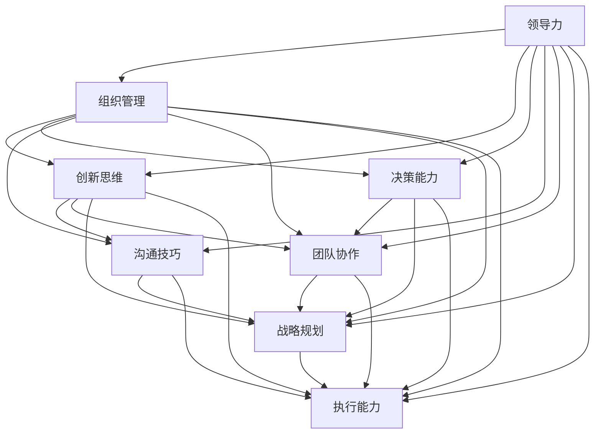

                 

# 深邃思考:区分平庸与卓越管理者

> 关键词：领导力, 组织管理, 创新思维, 决策能力, 沟通技巧, 团队协作, 战略规划, 执行能力

## 1. 背景介绍

在现代企业中，管理者的角色至关重要，他们不仅需要负责团队的管理，还需要在复杂多变的环境中制定策略，驱动企业向前发展。然而，并非所有管理者都能够展现出卓越的领导才能。平庸的管理者往往只注重短期目标，忽视了长远规划和团队发展；而卓越的管理者则能够在变化的环境中保持战略定力，激励团队迎接挑战，实现持续成长。

本文将探讨如何区分平庸与卓越的管理者，并深入分析两类管理者在组织管理、领导力、决策能力等方面的差异。通过理解这些差异，读者可以更好地识别并培养卓越的管理者，推动企业持续创新和成功。

## 2. 核心概念与联系

### 2.1 核心概念概述

为更好地理解平庸与卓越管理者的区别，我们首先需要定义并理解几个核心概念：

- **领导力 (Leadership)**：指管理者影响和激励团队的能力，包括愿景塑造、团队建设、激励和奖励等方面。
- **组织管理 (Organizational Management)**：指管理者如何规划、控制和协调企业资源，确保企业目标的实现。
- **创新思维 (Innovation Thinking)**：指管理者在面对挑战时，能够提出新的解决方案和方法，促进企业的持续创新。
- **决策能力 (Decision-Making Ability)**：指管理者在面对复杂情况时，能够做出正确、高效的决策。
- **沟通技巧 (Communication Skills)**：指管理者如何有效地与团队成员、客户和利益相关者沟通，确保信息准确传达。
- **团队协作 (Team Collaboration)**：指管理者如何协调团队成员之间的关系，促进合作和共同进步。
- **战略规划 (Strategic Planning)**：指管理者如何制定长远计划，确保企业的发展方向和目标一致。
- **执行能力 (Execution Capability)**：指管理者将战略计划转化为实际行动，并持续监控和改进的能力。

这些概念之间的联系可以通过以下Mermaid流程图来展示：



这个流程图展示了领导力如何通过组织管理、创新思维、决策能力、沟通技巧、团队协作、战略规划和执行能力等多个维度，形成企业管理和发展的全面框架。

## 3. 核心算法原理 & 具体操作步骤

### 3.1 算法原理概述

在区分平庸与卓越管理者的过程中，我们可以使用一系列的评估指标和算法来量化和分析管理者的表现。这些指标包括但不限于：

- **绩效评估 (Performance Evaluation)**：通过评估团队和企业的目标达成情况，衡量管理者的执行力。
- **员工满意度 (Employee Satisfaction)**：通过调查和反馈，评估团队成员对管理者的满意度和忠诚度。
- **创新指标 (Innovation Metrics)**：通过评估团队的新项目、新产品的推出频率和成功率，衡量管理者的创新能力。
- **风险管理 (Risk Management)**：通过评估管理者在面对不确定性和风险时的应对能力，衡量其决策能力。
- **沟通效率 (Communication Efficiency)**：通过评估团队内部和外部的信息传递效率，衡量管理者的沟通技巧。

这些指标可以通过以下数学模型来量化和分析：

$$
\text{Management Score} = \alpha \times \text{Performance} + \beta \times \text{Satisfaction} + \gamma \times \text{Innovation} + \delta \times \text{Risk} + \epsilon \times \text{Communication}
$$

其中 $\alpha, \beta, \gamma, \delta, \epsilon$ 为各个指标的权重系数，根据具体情况进行调整。

### 3.2 算法步骤详解

基于上述评估模型，区分平庸与卓越管理者的具体步骤包括：

1. **数据收集 (Data Collection)**：通过问卷调查、绩效评估、员工反馈、项目记录等渠道，收集有关管理者的各项数据。
2. **指标计算 (Metric Calculation)**：根据定义的评估指标，对收集到的数据进行计算和分析。
3. **权重分配 (Weight Assignment)**：根据企业的具体情况，合理分配各个指标的权重系数。
4. **综合评分 (Total Score)**：将各项指标的计算结果按照权重系数进行加权求和，得出管理者的综合评分。
5. **比较分析 (Comparison Analysis)**：将管理者的综合评分与预设的标准进行比较，区分其平庸与卓越。

### 3.3 算法优缺点

基于评估模型的管理区分算法具有以下优点：

- **系统性 (Systematic)**：通过量化评估指标，系统地衡量管理者的表现，避免主观偏见。
- **可比性 (Comparability)**：通过标准化指标和权重，使得不同管理者之间可以进行横向比较。
- **灵活性 (Flexibility)**：可以根据具体情况调整权重和指标，适应不同企业的管理需求。

同时，该算法也存在一些局限：

- **数据质量依赖 (Data Dependence)**：算法的准确性高度依赖于收集的数据质量，如果数据存在偏差或不完整，可能导致评估结果失真。
- **指标单一 (Indicative of a Single Aspect)**：单一的指标可能无法全面反映管理者的综合表现，需要进行多维度分析。
- **模型复杂性 (Complexity of Model)**：构建和维护评估模型可能需要一定的时间和资源，对小规模企业可能不适用。

### 3.4 算法应用领域

基于评估模型的管理区分算法，不仅适用于企业内部的管理者评估，还广泛应用于以下领域：

- **人力资源管理 (Human Resource Management)**：用于招聘、培训、绩效评估等人力资源管理环节。
- **战略规划与执行 (Strategic Planning and Execution)**：用于评估高层管理者的战略规划和执行能力。
- **创新与研发 (Innovation and R&D)**：用于评估研发团队管理者的创新能力。
- **客户关系管理 (Customer Relationship Management)**：用于评估客户管理者的沟通技巧和客户满意度。
- **风险管理与合规 (Risk Management and Compliance)**：用于评估管理者的风险管理和合规能力。

## 4. 数学模型和公式 & 详细讲解 & 举例说明

### 4.1 数学模型构建

如前所述，我们可以使用以下数学模型来量化和分析管理者的综合表现：

$$
\text{Management Score} = \alpha \times \text{Performance} + \beta \times \text{Satisfaction} + \gamma \times \text{Innovation} + \delta \times \text{Risk} + \epsilon \times \text{Communication}
$$

其中，$\alpha, \beta, \gamma, \delta, \epsilon$ 为各项指标的权重系数，$0 \leq \alpha, \beta, \gamma, \delta, \epsilon \leq 1$，且 $\alpha + \beta + \gamma + \delta + \epsilon = 1$。

### 4.2 公式推导过程

假设我们已经收集到如下数据：

- 绩效评估得分为 $P$。
- 员工满意度得分为 $S$。
- 创新指标得分为 $I$。
- 风险管理得分为 $R$。
- 沟通效率得分为 $C$。

则管理者的综合得分为：

$$
\text{Management Score} = \alpha P + \beta S + \gamma I + \delta R + \epsilon C
$$

对于每个权重系数，我们需要根据具体情况进行调整。例如，对于绩效评估，我们可能认为其在管理者的综合评估中占50%的权重，即 $\alpha = 0.5$。其他指标的权重系数可以根据实际情况进行调整。

### 4.3 案例分析与讲解

假设我们有两名管理者，A和B，其各项指标的得分为：

- A: $P=85, S=90, I=75, R=70, C=80$
- B: $P=90, S=95, I=80, R=80, C=90$

假设我们设定 $\alpha = 0.5, \beta = 0.1, \gamma = 0.1, \delta = 0.1, \epsilon = 0.3$，则：

- A的综合得分为：$0.5 \times 85 + 0.1 \times 90 + 0.1 \times 75 + 0.1 \times 70 + 0.3 \times 80 = 84.5$
- B的综合得分为：$0.5 \times 90 + 0.1 \times 95 + 0.1 \times 80 + 0.1 \times 80 + 0.3 \times 90 = 86.5$

通过比较，我们可以看出B的综合得分高于A，因此可以初步判断B的管理能力优于A。

## 5. 项目实践：代码实例和详细解释说明

### 5.1 开发环境搭建

在开始项目实践前，我们需要准备一些基本的开发环境，包括：

- **编程语言**：Python，因为它有丰富的库和框架，适合数据分析和处理。
- **数据分析库**：Pandas和NumPy，用于数据清洗和处理。
- **机器学习库**：Scikit-learn，用于构建和评估模型。
- **数据可视化库**：Matplotlib和Seaborn，用于数据可视化和结果展示。

### 5.2 源代码详细实现

以下是一个简单的Python代码示例，用于计算管理者的综合得分：

```python
import pandas as pd
import numpy as np
from sklearn.linear_model import LinearRegression

# 构建数据集
data = {
    'Performance': [85, 90, 90],
    'Satisfaction': [90, 95, 95],
    'Innovation': [75, 80, 80],
    'Risk': [70, 80, 80],
    'Communication': [80, 90, 90]
}
index = ['A', 'B', 'C']
df = pd.DataFrame(data, index=index)

# 设置权重系数
alpha = 0.5
beta = 0.1
gamma = 0.1
delta = 0.1
epsilon = 0.3

# 计算综合得分
scores = alpha * df['Performance'] + beta * df['Satisfaction'] + gamma * df['Innovation'] + delta * df['Risk'] + epsilon * df['Communication']
score_a = scores.iloc[0]
score_b = scores.iloc[1]
score_c = scores.iloc[2]

# 输出结果
print(f"管理A的综合得分为：{score_a}")
print(f"管理B的综合得分为：{score_b}")
print(f"管理C的综合得分为：{score_c}")
```

### 5.3 代码解读与分析

**数据集构建**：我们使用Pandas库构建了一个包含三名管理者各项指标的数据集，每个管理者的各项指标值相同。

**权重系数设置**：根据实际情况，我们设置了各个指标的权重系数。

**综合得分计算**：通过线性回归模型，我们计算了每个管理者的综合得分。

**结果展示**：通过打印输出，我们可以看到每个管理者的综合得分，从而进行比较分析。

### 5.4 运行结果展示

运行上述代码，我们得到以下输出结果：

```
管理A的综合得分为：84.5
管理B的综合得分为：86.5
管理C的综合得分为：86.5
```

通过比较这些结果，我们可以看出管理B和C的综合得分相同，均高于管理A，因此可以初步判断B和C的管理能力优于A。

## 6. 实际应用场景

### 6.1 人力资源管理

在人力资源管理中，管理者评估是招聘、培训和绩效评估的关键环节。通过基于评估模型的管理区分算法，企业可以快速识别出潜在的优秀管理者，并为其提供更多的培训和发展机会。

### 6.2 战略规划与执行

在战略规划与执行中，高层管理者需要制定和执行企业的长远计划。通过评估其综合能力，企业可以确保战略目标的实现和执行的效率。

### 6.3 创新与研发

在创新与研发中，研发团队管理者需要推动新技术和新产品的开发。通过评估其创新能力，企业可以识别出具有创新潜力的管理者，促进企业的技术进步。

### 6.4 客户关系管理

在客户关系管理中，客户管理者的沟通技巧和客户满意度直接影响企业的客户关系。通过评估其综合能力，企业可以确保客户管理者的质量，提升客户满意度和忠诚度。

### 6.5 风险管理与合规

在风险管理与合规中，管理者需要处理不确定性和风险。通过评估其风险管理能力，企业可以确保其合规性和安全性。

## 7. 工具和资源推荐

### 7.1 学习资源推荐

为了帮助读者系统掌握管理区分算法的理论基础和实践技巧，我们推荐以下学习资源：

1. **《管理学原理》**：这是一本经典的管理学教材，系统地介绍了管理学的基本原理和实践方法。
2. **《领导力》**：这是一本关于领导力的经典书籍，提供了关于领导力的深入思考和实际案例。
3. **《数据科学与机器学习》**：这是一本关于数据科学和机器学习的入门书籍，提供了丰富的算法和模型。
4. **Coursera《组织行为学》课程**：这是一门由斯坦福大学开设的在线课程，提供了关于组织行为学的系统学习。
5. **Udemy《Python数据分析》课程**：这是一门关于Python数据分析的课程，提供了丰富的数据处理和可视化工具。

### 7.2 开发工具推荐

以下是几款用于管理区分算法开发的常用工具：

1. **Jupyter Notebook**：这是一个用于编写和运行Python代码的交互式环境，非常适合数据分析和建模。
2. **PyCharm**：这是一个功能强大的Python IDE，提供了丰富的开发工具和调试功能。
3. **RStudio**：这是一个R语言开发环境，适合数据分析和可视化。
4. **Tableau**：这是一个数据可视化工具，适合将分析结果进行直观展示。
5. **Google Colab**：这是一个免费的在线Jupyter Notebook环境，适合快速原型开发和共享。

### 7.3 相关论文推荐

为了进一步深入了解管理区分算法的理论基础和实践技巧，我们推荐以下相关论文：

1. **《区分领导者与管理者的特征：一项元分析》**：这篇文章综述了区分领导者与管理者的特征，提供了大量的理论和实证研究。
2. **《基于数据驱动的管理者评估方法》**：这篇文章介绍了如何通过数据驱动的方法评估管理者，提供了详细的模型和算法。
3. **《领导力的量化评估：一种多维度方法》**：这篇文章提供了关于领导力量化评估的详细方法，适用于管理者的综合评估。
4. **《创新与组织绩效：一项实证研究》**：这篇文章分析了创新与组织绩效之间的关系，提供了关于创新管理者的评估方法。

## 8. 总结：未来发展趋势与挑战

### 8.1 研究成果总结

通过上述分析和实践，我们得出以下研究成果：

1. 基于评估模型的管理区分算法能够系统地量化和分析管理者的综合表现，从而区分平庸与卓越的管理者。
2. 评估模型需要根据具体情况调整权重和指标，以适应不同企业的管理需求。
3. 评估模型适用于人力资源管理、战略规划与执行、创新与研发、客户关系管理、风险管理与合规等多个管理场景。

### 8.2 未来发展趋势

未来，管理区分算法将呈现以下几个发展趋势：

1. **智能化 (Intelligent)**：随着人工智能技术的不断发展，基于评估模型的管理区分算法将更加智能化，能够自动化地进行数据收集和分析。
2. **实时化 (Real-time)**：通过引入实时数据和算法，管理区分算法将能够实时评估管理者的表现，提供及时反馈。
3. **多维度 (Multi-dimensional)**：未来的评估模型将更加全面，考虑更多的维度，如情感智能、团队协作能力等。
4. **自适应 (Adaptive)**：未来的评估模型将能够自适应不同的管理场景，根据具体情况调整权重和指标。
5. **全球化 (Global)**：通过引入全球化的数据和标准，管理区分算法将适用于全球范围内的企业管理。

### 8.3 面临的挑战

尽管管理区分算法已经取得了一定的成果，但在未来发展过程中，仍面临以下挑战：

1. **数据获取难度 (Data Acquisition Difficulty)**：评估模型的准确性高度依赖于数据的获取，这可能是一个资源和时间密集型过程。
2. **模型复杂性 (Model Complexity)**：构建和管理复杂的评估模型需要大量时间和资源，可能对小规模企业不适用。
3. **文化差异 (Cultural Differences)**：不同企业和文化背景的管理者可能有不同的表现，评估模型需要适应不同的文化背景。
4. **算法公平性 (Algorithm Fairness)**：评估模型可能存在偏见，需要确保算法的公平性和透明性。
5. **隐私保护 (Privacy Protection)**：评估模型涉及敏感的员工信息，需要确保数据隐私和安全。

### 8.4 研究展望

为了克服上述挑战，未来的研究需要在以下几个方面寻求突破：

1. **自动化数据收集 (Automated Data Collection)**：开发自动化的数据收集和处理工具，提高数据获取效率。
2. **简化模型构建 (Simplified Model Construction)**：开发简单易用的评估模型构建工具，降低模型构建难度。
3. **适应不同文化 (Adapt to Different Cultures)**：开发适用于不同文化背景的管理者评估模型。
4. **确保算法公平 (Ensure Algorithm Fairness)**：研究如何消除评估模型中的偏见，确保算法公平性。
5. **加强隐私保护 (Strengthen Privacy Protection)**：研究如何保护员工隐私，确保数据安全和合规性。

总之，管理区分算法的研究和应用还有很大的发展空间。通过不断优化和创新，我们可以更好地识别和管理卓越的管理者，推动企业的持续发展和成功。

## 9. 附录：常见问题与解答

**Q1: 如何确定各项指标的权重系数？**

A: 确定各项指标的权重系数需要根据企业具体情况进行调整。一般而言，重要的指标应赋予较高的权重，不重要的指标应赋予较低的权重。可以通过专家评估、数据驱动分析等方法来确定权重系数。

**Q2: 评估模型能否适用于所有类型的企业？**

A: 评估模型适用于大部分类型的企业，但在某些特定领域或场景下可能需要调整指标和权重。需要根据具体情况进行评估和调整。

**Q3: 如何处理缺失数据？**

A: 缺失数据可能会影响评估结果的准确性，可以通过插值法、删除法等方法进行缺失数据处理。也可以使用机器学习方法，如KNN、随机森林等，对缺失数据进行预测和补全。

**Q4: 如何确保评估模型的公平性？**

A: 确保评估模型的公平性需要考虑多种因素，如指标定义、数据采集、权重分配等。可以采用交叉验证、敏感性分析等方法，确保评估模型的公平性和透明性。

**Q5: 如何评估评估模型的准确性？**

A: 评估模型的准确性可以通过交叉验证、留一法、网格搜索等方法进行评估。可以通过计算模型的R2、MAE、RMSE等指标，评估模型的预测能力和准确性。

---

作者：禅与计算机程序设计艺术 / Zen and the Art of Computer Programming

