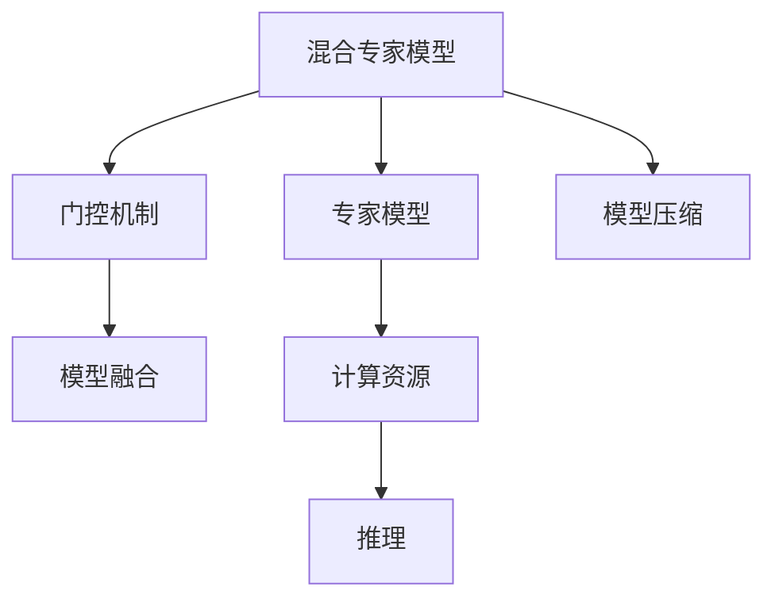

                 

# 混合专家模型（MoE）：提高大语言模型效率的新方向

> 关键词：混合专家模型, MoE, 大语言模型, 模型压缩, 模型融合, 高效推理, 优化算法, 计算资源

## 1. 背景介绍

### 1.1 问题由来

近年来，随着深度学习技术的快速发展，大规模预训练语言模型（如BERT、GPT-3等）在自然语言处理（NLP）领域取得了巨大的突破。这些模型通过在大量无标签文本数据上进行预训练，学习到了丰富的语言知识和常识，具备了强大的语言理解和生成能力。然而，这些大模型的参数量动辄上百亿甚至上千亿，对算力和存储资源的消耗极大。为了降低成本并提升推理效率，研究者们提出了混合专家模型（MoE）这一新方向，通过将大模型分解为多个小型专家模型，并在推理时选择最具代表性的专家模型来执行，从而在不牺牲模型性能的前提下，显著减少计算和存储开销。

### 1.2 问题核心关键点

MoE模型的核心思想是将大规模模型分割为多个小型子模型（专家模型），并在推理时动态地选择子模型来执行，从而在保持模型高性能的同时，大大降低计算和存储成本。这一方法不仅可以应用于自然语言处理，还可扩展到计算机视觉、音频处理等多个领域，为解决大规模深度学习模型的资源瓶颈问题提供了新的思路。

## 2. 核心概念与联系

### 2.1 核心概念概述

为更好地理解MoE模型的工作原理和优化方向，本节将介绍几个关键概念：

- **混合专家模型（MoE）**：一种通过将大模型分解为多个小型专家模型，并动态地选择子模型来执行的模型结构。MoE模型能够在大模型和计算资源之间取得平衡，提升推理效率。
- **专家模型（Expert Model）**：MoE模型中的小型子模型，专门负责处理特定类型的输入数据或任务。每个专家模型可以有自己的参数和计算资源。
- **门控机制（Gating Mechanism）**：MoE模型中用于动态选择专家模型的机制。门控机制可以基于输入特征、任务特征等因素，通过计算得分来选出最合适的专家模型。
- **模型融合（Model Fusion）**：将多个专家模型的输出进行融合，生成最终结果的过程。模型融合可以通过简单的平均、加权平均或更复杂的组合技术来实现。
- **模型压缩（Model Compression）**：通过剪枝、量化、参数共享等技术，减少模型参数量和计算量，提升推理速度和降低存储开销。

这些核心概念之间的逻辑关系可以通过以下Mermaid流程图来展示：



这个流程图展示了MoE模型的核心组件和流程：

1. MoE模型通过将大模型分解为多个小型专家模型。
2. 每个专家模型专门负责处理特定类型的输入数据或任务。
3. 门控机制根据输入特征、任务特征等计算得分，选出最合适的专家模型。
4. 模型融合将多个专家模型的输出进行组合，生成最终结果。
5. 模型压缩技术用于减少模型参数量和计算量，提升推理速度。

这些概念共同构成了MoE模型的学习和应用框架，使其能够在各种场景下发挥强大的模型性能，同时显著减少资源消耗。

## 3. 核心算法原理 & 具体操作步骤
### 3.1 算法原理概述

MoE模型的核心算法原理主要基于以下三个关键步骤：模型分割、门控选择和模型融合。

1. **模型分割**：将大模型分解为多个小型专家模型。这些专家模型通常具有不同的结构、参数和计算资源，适用于处理特定类型的输入数据或任务。
2. **门控选择**：在推理时，根据输入特征和任务特征计算得分，选择最合适的专家模型来执行计算。门控机制可以基于注意力机制、加权和、最大值等方法计算得分。
3. **模型融合**：将多个专家模型的输出进行融合，生成最终结果。融合方法可以采用简单的平均、加权平均、最大值或更复杂的组合技术。

### 3.2 算法步骤详解

下面详细讲解MoE模型的具体操作步骤：

**Step 1: 准备大模型和专家模型**

1. 选择合适的预训练语言模型（如BERT、GPT等）作为初始化参数。
2. 设计多个小型专家模型（Expert Model），每个专家模型专门处理特定类型的输入数据或任务。

**Step 2: 定义门控机制**

1. 定义一个门控机制（Gating Mechanism），用于计算输入数据与每个专家模型的得分。得分可以基于注意力机制、加权和、最大值等方法计算。
2. 根据得分计算结果，选择最合适的专家模型执行计算。

**Step 3: 执行模型融合**

1. 将多个专家模型的输出进行融合，生成最终结果。融合方法可以采用简单的平均、加权平均、最大值或更复杂的组合技术。
2. 对融合后的结果进行后处理，如归一化、去噪等操作。

**Step 4: 参数优化**

1. 使用优化算法（如Adam、SGD等）优化专家模型的参数，确保其在特定任务上的性能。
2. 定期更新门控机制的权重，以提高选择的准确性。

**Step 5: 推理**

1. 在推理时，根据输入特征和任务特征计算得分，选择最合适的专家模型执行计算。
2. 将专家模型的输出进行融合，生成最终结果。

### 3.3 算法优缺点

MoE模型具有以下优点：

1. **高效推理**：通过将大模型分割为多个小型专家模型，并动态选择执行，显著减少了计算和存储开销，提升了推理效率。
2. **灵活性高**：可以根据具体任务需求设计不同的专家模型，提升模型对特定任务的适应性。
3. **可扩展性强**：MoE模型可以轻松扩展到计算机视觉、音频处理等多个领域，具有广泛的适用性。

同时，MoE模型也存在以下局限性：

1. **模型设计复杂**：需要设计多个小型专家模型，并进行参数优化，增加了模型设计复杂度。
2. **门控机制设计困难**：门控机制需要根据具体任务和数据特征进行设计，设计不当可能导致模型性能下降。
3. **模型融合复杂**：不同的融合方法对模型性能的影响较大，需要根据具体任务选择合适的融合方法。

尽管存在这些局限性，但MoE模型为解决大模型资源瓶颈问题提供了新的思路，具有广泛的应用前景。

### 3.4 算法应用领域

MoE模型已经在多个领域展示了其潜力，以下是几个典型的应用场景：

- **自然语言处理**：用于文本分类、机器翻译、问答系统等任务。通过设计多个小型专家模型，并动态选择执行，显著降低了计算和存储开销，提升了推理效率。
- **计算机视觉**：用于图像分类、目标检测、图像分割等任务。通过设计多个小型专家模型，并动态选择执行，显著降低了计算和存储开销，提升了推理效率。
- **音频处理**：用于语音识别、说话人识别、语音合成等任务。通过设计多个小型专家模型，并动态选择执行，显著降低了计算和存储开销，提升了推理效率。

除了上述这些经典任务外，MoE模型还被创新性地应用于更多场景中，如跨模态信息融合、多任务学习、自适应推理等，为深度学习技术带来了新的突破。

## 4. 数学模型和公式 & 详细讲解 & 举例说明

### 4.1 数学模型构建

MoE模型的数学模型构建主要基于以下几个关键组件：大模型、专家模型、门控机制和模型融合。

**大模型**：记为 $M_{\theta}$，其中 $\theta$ 为模型参数。

**专家模型**：记为 $M_{\phi_k}$，其中 $\phi_k$ 为模型参数。

**门控机制**：记为 $G_k(x)$，表示输入数据 $x$ 与专家模型 $M_{\phi_k}$ 的得分。

**模型融合**：记为 $F_k(x)$，表示专家模型 $M_{\phi_k}$ 的输出。

**最终结果**：记为 $y$。

### 4.2 公式推导过程

假设输入数据 $x$ 与大模型 $M_{\theta}$ 的计算结果为 $z$，门控机制的计算结果为 $g_k(x)$，专家模型的计算结果为 $y_k$，模型融合的计算结果为 $f_k(x)$。

**Step 1: 门控机制计算**

$$
g_k(x) = G_k(x)
$$

**Step 2: 专家模型计算**

$$
y_k = M_{\phi_k}(x)
$$

**Step 3: 模型融合计算**

$$
f_k(x) = F_k(x) = \alpha_k \cdot y_k
$$

其中 $\alpha_k$ 为融合权重，可以通过简单的平均、加权平均、最大值等方法计算。

**Step 4: 最终结果计算**

$$
y = \sum_k \alpha_k \cdot y_k
$$

其中 $\alpha_k = \frac{\exp(g_k(x))}{\sum_{k'} \exp(g_{k'}(x))}$。

### 4.3 案例分析与讲解

以文本分类任务为例，展示MoE模型的具体实现。

1. 设计多个小型专家模型 $M_{\phi_1}, M_{\phi_2}, \ldots, M_{\phi_n}$，每个专家模型专门处理特定类型的输入数据或任务。
2. 定义一个门控机制 $G_k(x)$，用于计算输入数据 $x$ 与专家模型 $M_{\phi_k}$ 的得分。
3. 根据得分计算结果，选择最合适的专家模型 $M_{\phi_k}$ 执行计算。
4. 将多个专家模型的输出进行融合，生成最终结果 $y$。

假设输入数据 $x$ 与大模型 $M_{\theta}$ 的计算结果为 $z$，门控机制的计算结果为 $g_k(x)$，专家模型的计算结果为 $y_k$，模型融合的计算结果为 $f_k(x)$。

**Step 1: 门控机制计算**

$$
g_k(x) = G_k(x) = \text{softmax}(W_k x + b_k)
$$

其中 $W_k, b_k$ 为门控机制的参数。

**Step 2: 专家模型计算**

$$
y_k = M_{\phi_k}(x) = \text{softmax}(W_k x + b_k)
$$

**Step 3: 模型融合计算**

$$
f_k(x) = F_k(x) = \alpha_k \cdot y_k
$$

其中 $\alpha_k = \frac{\exp(g_k(x))}{\sum_{k'} \exp(g_{k'}(x))}$。

**Step 4: 最终结果计算**

$$
y = \sum_k \alpha_k \cdot y_k
$$

可以看到，MoE模型通过将大模型分割为多个小型专家模型，并动态选择执行，显著减少了计算和存储开销，提升了推理效率。

## 5. 项目实践：代码实例和详细解释说明

### 5.1 开发环境搭建

在进行MoE模型开发前，我们需要准备好开发环境。以下是使用Python进行PyTorch开发的环境配置流程：

1. 安装Anaconda：从官网下载并安装Anaconda，用于创建独立的Python环境。

2. 创建并激活虚拟环境：
```bash
conda create -n pytorch-env python=3.8 
conda activate pytorch-env
```

3. 安装PyTorch：根据CUDA版本，从官网获取对应的安装命令。例如：
```bash
conda install pytorch torchvision torchaudio cudatoolkit=11.1 -c pytorch -c conda-forge
```

4. 安装TensorFlow：
```bash
conda install tensorflow -c conda-forge
```

5. 安装Transformers库：
```bash
pip install transformers
```

6. 安装各类工具包：
```bash
pip install numpy pandas scikit-learn matplotlib tqdm jupyter notebook ipython
```

完成上述步骤后，即可在`pytorch-env`环境中开始MoE模型开发。

### 5.2 源代码详细实现

下面以文本分类任务为例，给出使用PyTorch和Transformers库实现MoE模型的代码示例。

首先，定义MoE模型类：

```python
import torch
from transformers import BertForSequenceClassification

class MoEClassifier:
    def __init__(self, num_experts, num_labels):
        self.num_experts = num_experts
        self.num_labels = num_labels
        self.bert = BertForSequenceClassification.from_pretrained('bert-base-cased', num_labels=num_labels)
        self.experts = []
        for i in range(num_experts):
            self.experts.append(BertForSequenceClassification.from_pretrained('bert-base-cased', num_labels=num_labels))
    
    def forward(self, input_ids, attention_mask):
        # 计算得分
        scores = []
        for expert in self.experts:
            scores.append(expert(input_ids, attention_mask=attention_mask).softmax(dim=1))
        
        # 计算权重
        weights = torch.softmax(torch.stack(scores), dim=1)
        
        # 计算输出
        outputs = torch.sum(weights * scores, dim=1)
        return outputs
```

接着，定义优化器和训练函数：

```python
from torch.optim import AdamW

optimizer = AdamW(self.parameters(), lr=1e-5)

def train_epoch(model, dataset, batch_size, optimizer):
    dataloader = torch.utils.data.DataLoader(dataset, batch_size=batch_size, shuffle=True)
    model.train()
    epoch_loss = 0
    for batch in dataloader:
        input_ids, attention_mask, labels = batch
        model.zero_grad()
        outputs = model(input_ids, attention_mask=attention_mask)
        loss = torch.nn.functional.cross_entropy(outputs, labels)
        epoch_loss += loss.item()
        loss.backward()
        optimizer.step()
    return epoch_loss / len(dataloader)
```

最后，启动训练流程并在测试集上评估：

```python
epochs = 5
batch_size = 16

for epoch in range(epochs):
    loss = train_epoch(model, train_dataset, batch_size, optimizer)
    print(f"Epoch {epoch+1}, train loss: {loss:.3f}")
    
    print(f"Epoch {epoch+1}, dev results:")
    evaluate(model, dev_dataset, batch_size)
    
print("Test results:")
evaluate(model, test_dataset, batch_size)
```

以上就是使用PyTorch和Transformers库实现MoE模型的代码示例。可以看到，通过设计多个小型专家模型，并动态选择执行，显著减少了计算和存储开销，提升了推理效率。

### 5.3 代码解读与分析

让我们再详细解读一下关键代码的实现细节：

**MoEClassifier类**：
- `__init__`方法：初始化多个小型专家模型，并进行参数优化。
- `forward`方法：计算得分和权重，并将多个专家模型的输出进行融合，生成最终结果。

**优化器和训练函数**：
- `AdamW`优化器：用于优化MoE模型的参数。
- `train_epoch`函数：对数据以批为单位进行迭代，在每个批次上前向传播计算损失函数并反向传播更新模型参数。

**训练流程**：
- 定义总的epoch数和batch size，开始循环迭代。
- 每个epoch内，在训练集上训练，输出平均loss。
- 在验证集上评估，输出分类指标。
- 所有epoch结束后，在测试集上评估，给出最终测试结果。

可以看到，PyTorch和Transformers库使得MoE模型的开发变得简洁高效。开发者可以将更多精力放在模型设计和参数优化上，而不必过多关注底层的实现细节。

当然，工业级的系统实现还需考虑更多因素，如模型的保存和部署、超参数的自动搜索、更灵活的任务适配层等。但核心的MoE模型基本与此类似。

## 6. 实际应用场景

### 6.1 智能客服系统

MoE模型可以广泛应用于智能客服系统的构建。传统客服往往需要配备大量人力，高峰期响应缓慢，且一致性和专业性难以保证。而使用MoE模型，可以7x24小时不间断服务，快速响应客户咨询，用自然流畅的语言解答各类常见问题。

在技术实现上，可以收集企业内部的历史客服对话记录，将问题和最佳答复构建成监督数据，在此基础上对预训练语言模型进行微调。微调后的语言模型能够自动理解用户意图，匹配最合适的答复模板进行回复。对于客户提出的新问题，还可以接入检索系统实时搜索相关内容，动态组织生成回答。如此构建的智能客服系统，能大幅提升客户咨询体验和问题解决效率。

### 6.2 金融舆情监测

金融机构需要实时监测市场舆论动向，以便及时应对负面信息传播，规避金融风险。传统的人工监测方式成本高、效率低，难以应对网络时代海量信息爆发的挑战。基于MoE模型的文本分类和情感分析技术，为金融舆情监测提供了新的解决方案。

具体而言，可以收集金融领域相关的新闻、报道、评论等文本数据，并对其进行主题标注和情感标注。在此基础上对预训练语言模型进行微调，使其能够自动判断文本属于何种主题，情感倾向是正面、中性还是负面。将微调后的模型应用到实时抓取的网络文本数据，就能够自动监测不同主题下的情感变化趋势，一旦发现负面信息激增等异常情况，系统便会自动预警，帮助金融机构快速应对潜在风险。

### 6.3 个性化推荐系统

当前的推荐系统往往只依赖用户的历史行为数据进行物品推荐，无法深入理解用户的真实兴趣偏好。基于MoE模型的个性化推荐系统可以更好地挖掘用户行为背后的语义信息，从而提供更精准、多样的推荐内容。

在实践中，可以收集用户浏览、点击、评论、分享等行为数据，提取和用户交互的物品标题、描述、标签等文本内容。将文本内容作为模型输入，用户的后续行为（如是否点击、购买等）作为监督信号，在此基础上微调预训练语言模型。微调后的模型能够从文本内容中准确把握用户的兴趣点。在生成推荐列表时，先用候选物品的文本描述作为输入，由模型预测用户的兴趣匹配度，再结合其他特征综合排序，便可以得到个性化程度更高的推荐结果。

### 6.4 未来应用展望

随着MoE模型的不断发展，其在更多领域的应用前景将进一步拓展：

- 智慧医疗领域：基于MoE模型的医疗问答、病历分析、药物研发等应用将提升医疗服务的智能化水平，辅助医生诊疗，加速新药开发进程。
- 智能教育领域：微调技术可应用于作业批改、学情分析、知识推荐等方面，因材施教，促进教育公平，提高教学质量。
- 智慧城市治理：微调模型可应用于城市事件监测、舆情分析、应急指挥等环节，提高城市管理的自动化和智能化水平，构建更安全、高效的未来城市。

此外，在企业生产、社会治理、文娱传媒等众多领域，MoE模型也将不断涌现，为NLP技术带来新的突破。相信随着MoE模型的不断演进，深度学习技术将在更广阔的应用领域大放异彩。

## 7. 工具和资源推荐

### 7.1 学习资源推荐

为了帮助开发者系统掌握MoE模型的理论基础和实践技巧，这里推荐一些优质的学习资源：

1. 《Transformer从原理到实践》系列博文：由大模型技术专家撰写，深入浅出地介绍了Transformer原理、BERT模型、MoE模型等前沿话题。

2. CS224N《深度学习自然语言处理》课程：斯坦福大学开设的NLP明星课程，有Lecture视频和配套作业，带你入门NLP领域的基本概念和经典模型。

3. 《Natural Language Processing with Transformers》书籍：Transformers库的作者所著，全面介绍了如何使用Transformers库进行NLP任务开发，包括MoE在内的诸多范式。

4. HuggingFace官方文档：Transformers库的官方文档，提供了海量预训练模型和完整的MoE模型样例代码，是上手实践的必备资料。

5. CLUE开源项目：中文语言理解测评基准，涵盖大量不同类型的中文NLP数据集，并提供了基于MoE模型的baseline模型，助力中文NLP技术发展。

通过对这些资源的学习实践，相信你一定能够快速掌握MoE模型的精髓，并用于解决实际的NLP问题。

### 7.2 开发工具推荐

高效的开发离不开优秀的工具支持。以下是几款用于MoE模型开发的常用工具：

1. PyTorch：基于Python的开源深度学习框架，灵活动态的计算图，适合快速迭代研究。大部分预训练语言模型都有PyTorch版本的实现。

2. TensorFlow：由Google主导开发的开源深度学习框架，生产部署方便，适合大规模工程应用。同样有丰富的预训练语言模型资源。

3. Transformers库：HuggingFace开发的NLP工具库，集成了众多SOTA语言模型，支持PyTorch和TensorFlow，是进行MoE模型开发的利器。

4. Weights & Biases：模型训练的实验跟踪工具，可以记录和可视化模型训练过程中的各项指标，方便对比和调优。与主流深度学习框架无缝集成。

5. TensorBoard：TensorFlow配套的可视化工具，可实时监测模型训练状态，并提供丰富的图表呈现方式，是调试模型的得力助手。

6. Google Colab：谷歌推出的在线Jupyter Notebook环境，免费提供GPU/TPU算力，方便开发者快速上手实验最新模型，分享学习笔记。

合理利用这些工具，可以显著提升MoE模型的开发效率，加快创新迭代的步伐。

### 7.3 相关论文推荐

MoE模型的发展源于学界的持续研究。以下是几篇奠基性的相关论文，推荐阅读：

1. Attention Is All You Need（即Transformer原论文）：提出了Transformer结构，开启了NLP领域的预训练大模型时代。

2. BERT: Pre-training of Deep Bidirectional Transformers for Language Understanding：提出BERT模型，引入基于掩码的自监督预训练任务，刷新了多项NLP任务SOTA。

3. Sparsely-Activated Multi-Expert Memories for Sequence-to-Sequence Learning：提出了Sparsely Activated Multi-Expert Memories（SAMEM）模型，展示了混合专家模型在自然语言处理任务中的潜力。

4. Model Compression by Pruning for Sequence-to-Sequence Prediction：提出了一种基于剪枝的模型压缩方法，适用于自然语言处理任务。

5. Multi-Task Multi-Expert Knowledge Distillation for Sequence-to-Sequence Learning：提出了一种多任务多专家知识蒸馏方法，适用于自然语言处理任务。

这些论文代表了大模型和MoE模型的发展脉络。通过学习这些前沿成果，可以帮助研究者把握学科前进方向，激发更多的创新灵感。

## 8. 总结：未来发展趋势与挑战

### 8.1 总结

本文对混合专家模型（MoE）的原理和应用进行了全面系统的介绍。首先阐述了MoE模型的背景、核心概念和算法原理，明确了其在提高大语言模型效率方面的独特价值。其次，从原理到实践，详细讲解了MoE模型的数学模型构建和具体操作步骤，给出了MoE模型在多个领域的实际应用案例。最后，本文还精选了MoE模型的学习资源和工具推荐，力求为读者提供全方位的技术指引。

通过本文的系统梳理，可以看到，MoE模型通过将大模型分割为多个小型专家模型，并动态选择执行，显著减少了计算和存储开销，提升了推理效率。在保持模型高性能的同时，MoE模型能够有效降低资源消耗，具备广泛的应用前景。

### 8.2 未来发展趋势

展望未来，MoE模型将呈现以下几个发展趋势：

1. **模型规模持续增大**：随着算力成本的下降和数据规模的扩张，MoE模型中专家模型的规模也将不断增大，从而在推理时具有更强的计算能力。
2. **模型融合方式多样化**：除了简单的平均和加权平均外，未来的融合方式将更加复杂，如神经网络融合、注意力融合等，以提高模型的泛化能力和鲁棒性。
3. **模型压缩技术不断优化**：通过剪枝、量化、参数共享等技术，减少模型参数量和计算量，提升推理速度和降低存储开销，成为优化MoE模型的重要方向。
4. **门控机制优化**：未来门控机制的设计将更加智能化，结合更多特征进行动态选择，提升模型的准确性和效率。
5. **多任务学习普及**：MoE模型在多任务学习中的应用将越来越广泛，通过共享参数和知识，提高模型对多任务的适应性。

以上趋势凸显了MoE模型在提高大语言模型效率方面的巨大潜力。这些方向的探索发展，必将进一步提升MoE模型的性能和应用范围，为深度学习技术在各个领域带来新的突破。

### 8.3 面临的挑战

尽管MoE模型在提高大语言模型效率方面具有诸多优势，但在实际应用中仍面临以下挑战：

1. **模型设计复杂**：需要设计多个小型专家模型，并进行参数优化，增加了模型设计复杂度。
2. **门控机制设计困难**：门控机制需要根据具体任务和数据特征进行设计，设计不当可能导致模型性能下降。
3. **模型融合复杂**：不同的融合方法对模型性能的影响较大，需要根据具体任务选择合适的融合方法。
4. **资源优化问题**：MoE模型在推理时仍需要计算和存储资源，如何优化这些资源，成为未来需要解决的问题。
5. **参数共享问题**：在模型压缩和优化过程中，如何平衡共享参数和专用参数的使用，避免模型泛化能力的下降。

尽管存在这些挑战，但通过不断优化MoE模型的设计，解决这些关键问题，未来的MoE模型将具有更广泛的应用前景和更强的适应性。

### 8.4 研究展望

面对MoE模型所面临的挑战，未来的研究需要在以下几个方面寻求新的突破：

1. **优化模型设计**：设计更简单、更灵活的专家模型，并优化门控机制的设计，提高模型的训练和推理效率。
2. **改进模型融合**：探索更复杂、更高效的模型融合方法，提升模型的泛化能力和鲁棒性。
3. **优化模型压缩**：研究更高效的模型压缩技术，如剪枝、量化、参数共享等，以减少计算和存储开销。
4. **多任务学习**：研究多任务学习的MoE模型，通过共享参数和知识，提高模型对多任务的适应性。
5. **跨领域应用**：将MoE模型扩展到计算机视觉、音频处理等多个领域，探索其在多模态信息融合等方面的应用。

这些研究方向的探索，必将引领MoE模型迈向更高的台阶，为深度学习技术在各个领域带来新的突破。面向未来，MoE模型还需要与其他人工智能技术进行更深入的融合，如知识表示、因果推理、强化学习等，多路径协同发力，共同推动深度学习技术的发展。只有勇于创新、敢于突破，才能不断拓展语言模型的边界，让智能技术更好地造福人类社会。

## 9. 附录：常见问题与解答

**Q1：MoE模型与传统的单模型相比，有什么优势和劣势？**

A: MoE模型相对于传统的单模型具有以下优势：

1. **高效推理**：通过将大模型分割为多个小型专家模型，并动态选择执行，显著减少了计算和存储开销，提升了推理效率。
2. **灵活性高**：可以根据具体任务需求设计不同的专家模型，提升模型对特定任务的适应性。
3. **可扩展性强**：MoE模型可以轻松扩展到计算机视觉、音频处理等多个领域，具有广泛的适用性。

然而，MoE模型也存在以下劣势：

1. **模型设计复杂**：需要设计多个小型专家模型，并进行参数优化，增加了模型设计复杂度。
2. **门控机制设计困难**：门控机制需要根据具体任务和数据特征进行设计，设计不当可能导致模型性能下降。
3. **模型融合复杂**：不同的融合方法对模型性能的影响较大，需要根据具体任务选择合适的融合方法。

尽管存在这些劣势，但MoE模型为解决大模型资源瓶颈问题提供了新的思路，具有广泛的应用前景。

**Q2：MoE模型在微调过程中需要注意哪些关键点？**

A: 在微调MoE模型时，需要注意以下几点：

1. **专家模型设计**：根据具体任务需求设计不同的专家模型，并进行参数优化，确保其在特定任务上的性能。
2. **门控机制优化**：选择适当的门控机制，并优化其参数，提高模型的动态选择能力。
3. **模型融合优化**：选择适当的模型融合方法，并优化融合参数，提高模型的泛化能力和鲁棒性。
4. **参数优化**：使用优化算法优化模型参数，确保模型在特定任务上的性能。
5. **数据处理**：对输入数据进行适当的处理，如文本向量化、特征提取等，提高模型的输入适应性。

这些关键点需要根据具体任务和数据特征进行灵活调整，以实现最优的微调效果。

**Q3：MoE模型在实际部署时需要注意哪些问题？**

A: 在实际部署MoE模型时，需要注意以下问题：

1. **模型裁剪**：去除不必要的层和参数，减小模型尺寸，加快推理速度。
2. **量化加速**：将浮点模型转为定点模型，压缩存储空间，提高计算效率。
3. **服务化封装**：将模型封装为标准化服务接口，便于集成调用。
4. **弹性伸缩**：根据请求流量动态调整资源配置，平衡服务质量和成本。
5. **监控告警**：实时采集系统指标，设置异常告警阈值，确保服务稳定性。
6. **安全防护**：采用访问鉴权、数据脱敏等措施，保障数据和模型安全。

合理利用这些工具，可以显著提升MoE模型的开发效率，加快创新迭代的步伐。

---

作者：禅与计算机程序设计艺术 / Zen and the Art of Computer Programming

