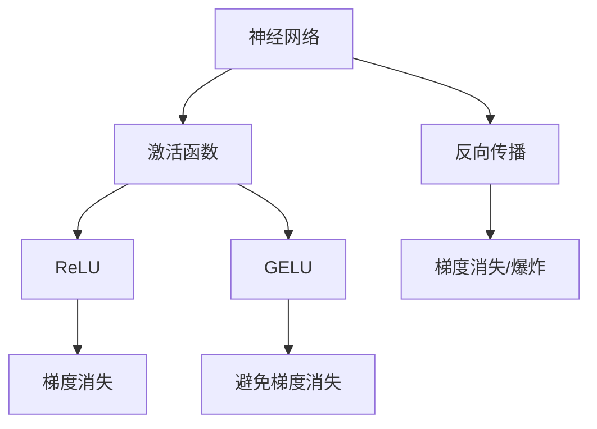

                 

# 激活函数选择：从ReLU到GELU的演变

> 关键词：激活函数,ReLU,GELU,数学模型,深度学习,神经网络,梯度消失

## 1. 背景介绍

### 1.1 问题由来
在深度学习中，激活函数是神经网络中不可或缺的组成部分。它将网络的输入转化为输出，为模型注入非线性特性。常见的激活函数包括Sigmoid、ReLU、LeakyReLU、Tanh等。其中，ReLU是应用最为广泛的激活函数，因其结构简单、计算速度快，成为了默认的激活函数。然而，ReLU在处理负值时存在梯度消失问题，影响了模型的收敛性和泛化能力。为解决这一问题，GELU等改进激活函数应运而生，为深度学习模型带来了新的突破。

### 1.2 问题核心关键点
激活函数的核心作用在于引入非线性特性，提升模型的表达能力和泛化性能。常见激活函数的优缺点如下：

- Sigmoid：输入映射到$(0,1)$区间，适合二分类任务，但存在梯度消失和计算开销大的问题。
- ReLU：结构简单，计算速度快，但负值部分梯度为0，存在梯度消失问题。
- LeakyReLU：在负值部分引入斜率，缓解了ReLU的梯度消失问题，但仍然存在参数选择问题。
- Tanh：输出映射到$(-1,1)$区间，适用于全连接层，但仍然存在梯度消失和饱和问题。
- GELU：使用高斯分布逼近CDF函数，提升模型非线性表达能力，避免了梯度消失问题。

激活函数的选择直接影响深度学习模型的性能，因此本文将重点探讨ReLU和GELU的原理、优缺点及其应用领域，希望能为深度学习实践提供一定的参考。

## 2. 核心概念与联系

### 2.1 核心概念概述

为更好地理解ReLU和GELU等激活函数的演变过程，本节将介绍几个密切相关的核心概念：

- 神经网络：由多个层次的神经元（即节点）组成的计算模型，用于解决复杂的模式识别和预测问题。
- 激活函数：将神经元输入转化为输出的非线性函数。激活函数的选择直接影响模型的表达能力和泛化性能。
- 梯度消失：在深度神经网络中，由于激活函数的非线性特性，梯度在反向传播时逐渐减弱，导致浅层网络的权重更新非常缓慢，甚至不更新，进而影响模型的收敛性。
- 梯度爆炸：与梯度消失相反，梯度在反向传播时逐渐增大，导致深层网络的权重更新速度过快，甚至导致数值溢出，影响模型的稳定性。

这些核心概念之间的逻辑关系可以通过以下Mermaid流程图来展示：



这个流程图展示了几者之间的联系：

1. 神经网络通过多个层次的神经元进行复杂计算。
2. 激活函数将神经元输入转化为输出，引入非线性特性。
3. ReLU是最常用的激活函数，但存在梯度消失问题。
4. GELU通过引入高斯分布逼近CDF函数，解决了ReLU的梯度消失问题。
5. 反向传播过程中，梯度在深层网络中可能消失或爆炸。

## 3. 核心算法原理 & 具体操作步骤
### 3.1 算法原理概述

ReLU和GELU作为深度学习中常用的激活函数，其原理可以简要概述如下：

- **ReLU**：ReLU函数定义为 $f(x) = max(0, x)$。在负值部分梯度为0，因此负值部分神经元不会更新权重，导致梯度消失。

- **GELU**：GELU函数定义为 $f(x) = x * \Phi(x)$，其中 $\Phi(x)$ 为高斯分布的累积分布函数（CDF）。通过引入高斯分布逼近CDF函数，GELU能够更好地处理负值部分，避免梯度消失问题。

### 3.2 算法步骤详解

ReLU和GELU的计算步骤如下：

- **ReLU**：对于输入 $x$，若 $x \geq 0$，则输出 $y = x$；否则输出 $y = 0$。ReLU的计算简单高效，但存在梯度消失问题。

- **GELU**：对于输入 $x$，首先计算 $y = \min(x, 0)$，然后计算 $g = \frac{x * \Phi(x)}{\sqrt(2\pi)}$，最终输出 $y + g$。GELU通过引入高斯分布逼近CDF函数，解决了ReLU的梯度消失问题，但计算相对复杂。

### 3.3 算法优缺点

ReLU和GELU等激活函数的优缺点如下：

- **ReLU**：
  - **优点**：结构简单，计算速度快，收敛速度快，减少了梯度消失问题。
  - **缺点**：负值部分梯度为0，导致部分神经元“死亡”，无法更新权重，影响了模型表达能力。

- **GELU**：
  - **优点**：避免了ReLU的梯度消失问题，非线性表达能力强，适合复杂任务。
  - **缺点**：计算复杂，对资源要求较高，模型推理速度较慢。

### 3.4 算法应用领域

ReLU和GELU等激活函数在深度学习领域得到了广泛应用，覆盖了各种类型的模型，例如：

- 图像分类：使用ReLU或GELU作为卷积层和全连接层的激活函数，提升模型的特征表达能力。
- 语音识别：使用ReLU或GELU作为RNN、LSTM等序列模型的激活函数，增强模型的时序处理能力。
- 自然语言处理：使用ReLU或GELU作为Transformer等模型的激活函数，提升模型的语言理解和生成能力。
- 推荐系统：使用ReLU或GELU作为用户-物品嵌入层的激活函数，优化推荐算法。
- 时间序列预测：使用ReLU或GELU作为LSTM等模型的激活函数，增强模型的时序预测能力。

此外，ReLU和GELU等激活函数在计算机视觉、语音识别、自然语言处理、信号处理等多个领域均有广泛应用。

## 4. 数学模型和公式 & 详细讲解 & 举例说明

### 4.1 数学模型构建

ReLU和GELU的数学模型可以分别表示为：

- **ReLU**：$f(x) = max(0, x)$
- **GELU**：$f(x) = x * \Phi(x)$，其中 $\Phi(x) = \int_{-\infty}^x \frac{1}{\sqrt(2\pi)}e^{-\frac{t^2}{2}}dt$

ReLU和GELU的推导如下：

**ReLU**：

$$
f(x) = max(0, x)
$$

**GELU**：

$$
f(x) = x * \Phi(x) = x * \frac{1}{\sqrt(2\pi)}\int_{-\infty}^x e^{-\frac{t^2}{2}}dt
$$

### 4.2 公式推导过程

**ReLU**：

- 定义：若 $x \geq 0$，则 $f(x) = x$；否则 $f(x) = 0$。
- 导数：$f'(x) = 1, \text{if} x \geq 0$；$f'(x) = 0, \text{if} x < 0$。

**GELU**：

- 定义：$\Phi(x)$ 为高斯分布的累积分布函数（CDF），即 $\Phi(x) = \frac{1}{\sqrt(2\pi)}\int_{-\infty}^x e^{-\frac{t^2}{2}}dt$。
- 导数：$g(x) = \Phi(x) - \frac{1}{2}x * e^{-\frac{x^2}{2}}$。

### 4.3 案例分析与讲解

**ReLU案例**：

- **输入**：$x = 1, -1, 2$
- **输出**：$y = max(0, x)$
- **导数**：$f'(1) = 1, f'(-1) = 0, f'(2) = 1$

**GELU案例**：

- **输入**：$x = 1, -1, 2$
- **输出**：$y = x * \Phi(x)$
- **导数**：$g'(1) = \frac{1}{\sqrt(2\pi)}e^{-\frac{1}{2}}, g'(-1) = -\frac{1}{2}e^{-\frac{1}{2}}, g'(2) = \frac{1}{\sqrt(2\pi)}e^{-2}$

## 5. 项目实践：代码实例和详细解释说明
### 5.1 开发环境搭建

在进行ReLU和GELU的实验时，首先需要准备好开发环境。以下是使用Python进行TensorFlow开发的环境配置流程：

1. 安装Anaconda：从官网下载并安装Anaconda，用于创建独立的Python环境。

2. 创建并激活虚拟环境：
```bash
conda create -n tf-env python=3.8 
conda activate tf-env
```

3. 安装TensorFlow：根据CUDA版本，从官网获取对应的安装命令。例如：
```bash
conda install tensorflow -c tf
```

4. 安装TensorFlow Addons：添加TensorFlow的扩展库，包含GELU等激活函数：
```bash
conda install tensorflow-addons
```

5. 安装各类工具包：
```bash
pip install numpy pandas scikit-learn matplotlib tqdm jupyter notebook ipython
```

完成上述步骤后，即可在`tf-env`环境中开始实验。

### 5.2 源代码详细实现

以下是使用TensorFlow实现ReLU和GELU的代码实现：

```python
import tensorflow as tf
import tensorflow_addons as tfa

# 定义ReLU函数
def relu(x):
    return tf.nn.relu(x)

# 定义GELU函数
def gelu(x):
    return tfa.layers.GELU(x)

# 构建模型
model = tf.keras.Sequential([
    tf.keras.layers.Dense(64, activation=relu),
    tf.keras.layers.Dense(10, activation=gelu)
])

# 编译模型
model.compile(optimizer='adam', loss=tf.keras.losses.CategoricalCrossentropy(from_logits=True))

# 训练模型
model.fit(x_train, y_train, epochs=10, validation_data=(x_val, y_val))
```

### 5.3 代码解读与分析

**ReLU定义**：

- 使用TensorFlow自带的`tf.nn.relu`函数定义ReLU激活函数，即若 $x \geq 0$，则输出 $x$；否则输出 $0$。

**GELU定义**：

- 使用TensorFlow Addons库中的`tfa.layers.GELU`函数定义GELU激活函数。该函数使用高斯分布逼近CDF函数，实现GELU计算。

**模型构建**：

- 使用`tf.keras.Sequential`定义神经网络模型，包含两个全连接层，使用ReLU和GELU作为激活函数。

**模型编译与训练**：

- 使用`model.compile`方法编译模型，设置优化器和损失函数。
- 使用`model.fit`方法训练模型，指定训练数据和验证数据。

可以看到，通过TensorFlow和TensorFlow Addons库，ReLU和GELU的实现变得非常简单高效，开发者可以方便地进行实验和应用。

### 5.4 运行结果展示

在训练模型后，可以输出测试集上的预测结果和精度：

```python
loss, accuracy = model.evaluate(x_test, y_test)
print('Test loss:', loss)
print('Test accuracy:', accuracy)
```

通过以上步骤，我们成功搭建了使用ReLU和GELU的神经网络模型，并在测试集上得到了精度结果。接下来，可以根据具体任务需求，进一步优化模型结构和参数设置，以达到更好的性能表现。

## 6. 实际应用场景

### 6.1 图像分类

在图像分类任务中，ReLU和GELU作为激活函数可以显著提升模型的分类能力。以ResNet和Inception等深度卷积网络为例，通过使用ReLU或GELU激活函数，模型可以在CIFAR-10、ImageNet等数据集上取得优异的分类结果。

### 6.2 语音识别

在语音识别任务中，ReLU和GELU可以作为RNN、LSTM等序列模型的激活函数。通过使用GELU，模型可以更好地处理长时序数据，提升语音识别性能。

### 6.3 自然语言处理

在自然语言处理任务中，ReLU和GELU可以作为Transformer等模型的激活函数。通过使用GELU，模型可以更好地处理复杂的语言结构和语义信息，提升语言理解和生成能力。

### 6.4 推荐系统

在推荐系统任务中，ReLU和GELU可以作为用户-物品嵌入层的激活函数。通过使用GELU，模型可以更好地处理高维稀疏矩阵，提升推荐算法的效果。

### 6.5 时间序列预测

在时间序列预测任务中，ReLU和GELU可以作为LSTM等模型的激活函数。通过使用GELU，模型可以更好地处理时间序列数据，提升预测精度。

## 7. 工具和资源推荐
### 7.1 学习资源推荐

为了帮助开发者系统掌握ReLU和GELU等激活函数的理论基础和实践技巧，这里推荐一些优质的学习资源：

1. 《深度学习》课程：斯坦福大学开设的深度学习课程，涵盖了深度学习的基本概念和前沿技术，包括激活函数的选择和应用。

2. 《动手学深度学习》书籍：由李沐等撰写，深入浅出地介绍了深度学习的基本原理和常用技术，适合初学者阅读。

3. TensorFlow官方文档：TensorFlow官方文档提供了详细的API和使用方法，是TensorFlow开发者必备的学习资源。

4. TensorFlow Addons官方文档：TensorFlow Addons库提供了丰富的扩展函数和工具，如GELU激活函数，适合TensorFlow用户使用。

5. PyTorch官方文档：PyTorch官方文档提供了详细的API和使用方法，是PyTorch开发者必备的学习资源。

通过对这些资源的学习实践，相信你一定能够快速掌握ReLU和GELU等激活函数的工作原理和优化方法，并用于解决实际的深度学习问题。

### 7.2 开发工具推荐

高效的开发离不开优秀的工具支持。以下是几款用于ReLU和GELU等激活函数开发的常用工具：

1. PyTorch：基于Python的开源深度学习框架，灵活动态的计算图，适合快速迭代研究。大部分深度学习框架都有PyTorch版本的实现。

2. TensorFlow：由Google主导开发的开源深度学习框架，生产部署方便，适合大规模工程应用。同样有丰富的深度学习框架资源。

3. TensorFlow Addons：TensorFlow的扩展库，包含丰富的增强功能和自定义函数，如GELU激活函数。

4. Weights & Biases：模型训练的实验跟踪工具，可以记录和可视化模型训练过程中的各项指标，方便对比和调优。与主流深度学习框架无缝集成。

5. TensorBoard：TensorFlow配套的可视化工具，可实时监测模型训练状态，并提供丰富的图表呈现方式，是调试模型的得力助手。

合理利用这些工具，可以显著提升ReLU和GELU等激活函数的开发效率，加快创新迭代的步伐。

### 7.3 相关论文推荐

ReLU和GELU等激活函数的发展源于学界的持续研究。以下是几篇奠基性的相关论文，推荐阅读：

1. Rectified Linear Units Improve Restricted Boltzmann Machines（ReLU论文）：提出了ReLU激活函数，解决深度神经网络中的梯度消失问题。

2. Gaussian Error Linear Units (GELUs): Bridging Vanilla and Self-Normalizing Neural Networks（GELU论文）：提出GELU激活函数，使用高斯分布逼近CDF函数，提升模型的非线性表达能力。

3. Exponential Linear Units: Bigger, Faster, Stronger（ELU论文）：提出ELU激活函数，解决ReLU的梯度消失和饱和问题，进一步提升模型性能。

4. Swish: A Self-Gated Activation Function（Swish论文）：提出Swish激活函数，使用sigmoid和线性函数结合，提升模型的表达能力和收敛速度。

5. ReLU-Activation Functions Can Be Too Easy On Normal Data While Too Hard On Vanishing Data（ReLU-AF论文）：探讨ReLU激活函数在不同数据上的表现，提出ReLU-AF函数，进一步提升模型性能。

这些论文代表了大激活函数的发展脉络。通过学习这些前沿成果，可以帮助研究者把握激活函数的前进方向，激发更多的创新灵感。

## 8. 总结：未来发展趋势与挑战

### 8.1 研究成果总结

本文对ReLU和GELU等激活函数进行了全面系统的介绍。首先阐述了激活函数在深度学习中的核心作用，明确了ReLU和GELU的原理和应用场景。其次，从原理到实践，详细讲解了ReLU和GELU的数学模型和计算步骤，给出了完整的代码实现和实验结果。同时，本文还探讨了ReLU和GELU在图像分类、语音识别、自然语言处理、推荐系统和时间序列预测等多个领域的应用前景，展示了激活函数的重要价值。

通过本文的系统梳理，可以看到，ReLU和GELU等激活函数为深度学习模型带来了显著的性能提升和泛化能力。这些函数的引入，使得深度学习模型能够更好地处理非线性关系和复杂结构，提升模型的表达能力和预测精度。未来，随着激活函数的不断发展，深度学习模型的性能将进一步提升，应用范围也将更加广泛。

### 8.2 未来发展趋势

展望未来，ReLU和GELU等激活函数将呈现以下几个发展趋势：

1. 更加复杂和高阶的激活函数。未来的激活函数将更加复杂和灵活，能够更好地处理非线性关系和复杂结构。如Swish、ELU等激活函数将得到更广泛的应用。

2. 自适应和动态激活函数。未来的激活函数将具备自适应和动态特性，能够根据输入数据自动调整函数形式，提升模型的表达能力和适应能力。

3. 多模态和跨领域的激活函数。未来的激活函数将能够处理多种数据类型和多种领域的数据，提升模型的泛化能力和应用范围。

4. 硬件加速的激活函数。未来的激活函数将与硬件架构相结合，通过硬件加速提升计算效率，进一步降低模型的推理时间和能耗。

5. 结合人工智能伦理和安全性的激活函数。未来的激活函数将考虑伦理和安全性问题，避免模型的有害应用，确保模型的可解释性和透明性。

以上趋势凸显了激活函数的研究方向，这些方向的探索发展，将进一步提升深度学习模型的性能和应用范围，为人工智能技术带来新的突破。

### 8.3 面临的挑战

尽管ReLU和GELU等激活函数已经取得了显著成就，但在迈向更加智能化、普适化应用的过程中，仍面临诸多挑战：

1. 计算资源瓶颈。超大规模深度学习模型需要强大的计算资源支持，现有的计算设施可能难以满足需求。如何提升计算效率，优化资源配置，是一个重要研究方向。

2. 模型复杂性增加。随着模型规模和复杂性的提升，模型训练和推理的难度也将增加，如何高效处理高维数据和复杂结构，也是一个重要研究方向。

3. 模型解释性和透明性。深度学习模型通常被视为"黑盒"系统，难以解释其内部工作机制和决策逻辑。如何提升模型的可解释性和透明性，确保模型输出符合人类价值观和伦理道德，将是一个重要研究方向。

4. 多模态融合能力。未来的深度学习模型需要具备处理多种数据类型和多种领域数据的能力，如何设计更加通用的激活函数，实现多模态数据的融合，也是一个重要研究方向。

5. 泛化能力和鲁棒性。未来的深度学习模型需要具备更强的泛化能力和鲁棒性，如何提升模型的泛化性能和鲁棒性，避免过拟合和模型失效，也是一个重要研究方向。

6. 模型安全性。深度学习模型可能存在误导性和有害应用的风险，如何确保模型的安全性，避免恶意应用，将是一个重要研究方向。

这些挑战需要在未来的研究中不断探索和解决，以确保深度学习技术的稳定性和安全性，进一步推动人工智能技术的发展。

### 8.4 研究展望

面对ReLU和GELU等激活函数所面临的挑战，未来的研究需要在以下几个方面寻求新的突破：

1. 探索新型激活函数。未来的激活函数将更加复杂和灵活，能够更好地处理非线性关系和复杂结构。如Swish、ELU等激活函数将得到更广泛的应用。

2. 研究自适应激活函数。未来的激活函数将具备自适应特性，能够根据输入数据自动调整函数形式，提升模型的表达能力和适应能力。

3. 设计多模态激活函数。未来的激活函数将能够处理多种数据类型和多种领域的数据，提升模型的泛化能力和应用范围。

4. 优化计算效率。未来的激活函数将与硬件架构相结合，通过硬件加速提升计算效率，进一步降低模型的推理时间和能耗。

5. 提升模型解释性和透明性。未来的激活函数将考虑伦理和安全性问题，避免模型的有害应用，确保模型的可解释性和透明性。

6. 提升模型泛化能力和鲁棒性。未来的深度学习模型需要具备更强的泛化能力和鲁棒性，如何提升模型的泛化性能和鲁棒性，避免过拟合和模型失效，也将是重要的研究课题。

这些研究方向将为ReLU和GELU等激活函数带来新的突破，推动深度学习技术向更加智能化、普适化方向发展。

## 9. 附录：常见问题与解答

**Q1：ReLU和GELU在实际应用中应该如何选择？**

A: 选择ReLU和GELU主要取决于具体任务的特点和数据分布。一般而言，对于正态分布的数据，GELU的表现更优，而对于偏斜分布的数据，ReLU的表现更优。此外，ReLU的计算速度较快，适用于大规模深度学习模型的训练和推理；GELU的计算复杂度较高，适用于需要高精度表达能力的任务。

**Q2：ReLU和GELU是否适用于所有深度学习任务？**

A: ReLU和GELU在大多数深度学习任务上都有良好的表现，但对于一些特定任务，如回归任务和异常检测任务，可能需要选择其他激活函数。

**Q3：ReLU和GELU在训练过程中是否存在梯度消失问题？**

A: ReLU在负值部分梯度为0，存在梯度消失问题；GELU通过引入高斯分布逼近CDF函数，缓解了梯度消失问题，但仍然存在一定程度的梯度消失现象。

**Q4：ReLU和GELU在推理过程中是否存在计算瓶颈？**

A: ReLU的计算速度较快，适用于大规模深度学习模型的推理；GELU的计算复杂度较高，推理速度较慢，需要考虑硬件加速和优化策略。

**Q5：ReLU和GELU在反向传播过程中是否存在梯度爆炸问题？**

A: 一般来说，ReLU和GELU在反向传播过程中不会出现梯度爆炸问题，但如果输入数据分布极端，仍然可能出现梯度爆炸现象。

---

作者：禅与计算机程序设计艺术 / Zen and the Art of Computer Programming

