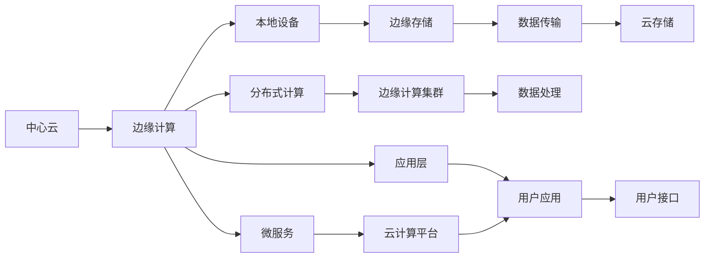

                 

# 物联网边缘计算：在设备端处理数据

## 1. 背景介绍

### 1.1 问题由来
随着物联网(IoT)设备数量的激增，全球联网设备的数量预计将在2025年达到250亿。这不仅带来了数据的爆炸式增长，同时也对数据中心存储、传输和处理能力提出了更高的要求。传统集中式数据处理模式已难以应对海量数据的实时处理需求，且存在延迟大、带宽占用高等问题，制约了物联网应用的广泛普及。

边缘计算(Edge Computing)应运而生。边缘计算将数据处理任务从中心数据中心迁移到靠近数据源的边缘设备上，通过降低数据传输量和计算延迟，显著提升了数据处理效率和实时性。如今，边缘计算正在逐渐成为物联网数据处理的重要范式。

### 1.2 问题核心关键点
物联网边缘计算的核心在于将数据处理和分析任务在设备端完成，从而实现快速响应和高吞吐量的数据处理。这一范式降低了网络延迟，提高了数据处理效率，支持实时应用的部署。

边缘计算的关键技术包括：
- 设备端的本地计算资源
- 分布式计算架构
- 云计算与边缘计算的协同

边缘计算的应用场景多种多样，包括智能家居、工业物联网、智慧城市、智能交通等。其中，智能家居通过在家庭网络边缘设备上处理数据，实现智能控制和个性化服务；工业物联网通过在现场设备上执行本地数据分析，提升生产效率和设备利用率；智慧城市利用边缘计算降低城市管理决策的响应时间，提高城市运行效率。

## 2. 核心概念与联系

### 2.1 核心概念概述

为更好地理解物联网边缘计算的原理和架构，本节将介绍几个关键概念：

- 物联网(IoT)：通过传感器、智能终端等设备，实时采集环境数据，并通过互联网传输到云端进行分析处理，从而实现智能化管理。
- 边缘计算(Edge Computing)：在靠近数据源的设备端进行数据处理，通过降低数据传输和计算延迟，提升数据处理效率和实时性。
- 云计算(Cloud Computing)：将数据存储和计算任务部署在云端数据中心，利用分布式计算资源和网络带宽，提供大规模数据处理能力。
- 微服务架构(Microservices)：将大系统拆分为多个小型服务，每个服务独立部署、运行和扩展，提高系统的灵活性和可维护性。

边缘计算与云计算的互补关系，通过设备端和云端数据处理的双重协同，形成了更为高效、智能的数据处理体系。

### 2.2 核心概念原理和架构的 Mermaid 流程图



这个流程图展示了中心云、边缘计算、本地设备、微服务、边缘存储、分布式计算和应用层之间的联系和协作。

## 3. 核心算法原理 & 具体操作步骤

### 3.1 算法原理概述

物联网边缘计算的核心算法原理基于分布式计算和微服务架构，通过将数据处理任务在边缘设备和云端协同完成，实现高效的数据处理。

边缘计算的分布式计算架构，通常采用微服务化、容器化等技术，将任务拆分为多个独立的服务，并在边缘设备上并行执行，从而大幅提升数据处理速度。具体算法原理如下：

1. 设备数据采集：通过传感器、摄像头、RFID等设备采集环境数据，并将其发送到本地边缘设备。
2. 本地预处理：边缘设备对采集到的原始数据进行预处理，包括去噪、滤波、数据清洗等操作，减少数据冗余和噪声。
3. 本地存储与计算：边缘设备将预处理后的数据存储在本地存储设备中，并通过本地计算资源执行部分数据处理任务，如模型推理、数据分析等。
4. 数据同步：边缘设备将本地处理结果和数据同步到云端，与云端计算资源共同完成更复杂的数据处理和分析任务。
5. 数据反馈：云端计算结果经过处理后，通过网络传输回边缘设备，指导后续数据采集和处理。

### 3.2 算法步骤详解

1. **设备数据采集**：
   - 使用IoT协议将传感器数据传输到边缘设备，如MQTT、CoAP等。
   - 在边缘设备上配置实时数据采集模块，确保数据采集的及时性和连续性。

2. **本地预处理**：
   - 在边缘设备上部署数据预处理模块，对原始数据进行去噪、滤波、归一化等操作，去除无用信息，确保数据的质量和可靠性。
   - 使用数据清洗算法处理数据缺失、异常值等问题，确保数据的一致性。

3. **本地存储与计算**：
   - 将预处理后的数据存储在边缘设备的本地存储设备中，如NAND Flash、SD卡等。
   - 使用微服务架构将数据处理任务拆分为多个独立的服务，每个服务独立部署、运行和扩展。
   - 在边缘设备上部署计算任务，如模型推理、数据统计等，使用GPU、CPU等本地计算资源加速计算。

4. **数据同步**：
   - 将边缘设备本地处理结果和数据同步到云端，与云端计算资源共同完成更复杂的数据处理和分析任务。
   - 使用消息队列、分布式数据库等技术，实现边缘设备和云端计算资源的协同工作。

5. **数据反馈**：
   - 将云端计算结果经过处理后，通过网络传输回边缘设备。
   - 在边缘设备上对计算结果进行分析，根据反馈数据指导后续数据采集和处理。

### 3.3 算法优缺点

物联网边缘计算的优点包括：
- 降低数据传输和计算延迟，提升数据处理效率和实时性。
- 支持实时应用的部署，提高系统响应速度和用户体验。
- 数据存储和处理更贴近数据源，减少网络带宽占用。
- 提高数据处理的安全性，防止数据泄露和网络攻击。

同时，边缘计算也存在一些局限性：
- 设备端的计算和存储资源有限，数据处理能力受限。
- 设备间的通信延迟和网络带宽限制，可能导致系统整体吞吐量下降。
- 设备边缘计算的部署和管理复杂度较高，维护成本较大。
- 数据本地存储可能导致数据安全风险增加。

### 3.4 算法应用领域

物联网边缘计算在多个领域都有广泛的应用，具体如下：

1. **智能家居**：
   - 通过在家庭设备上执行本地数据分析，实现智能家居控制和个性化服务。如智能门锁、智能照明、智能温控等。
   - 实时处理家庭数据，提高生活便捷性和舒适度。

2. **工业物联网**：
   - 在现场设备上执行本地数据分析，提升生产效率和设备利用率。如智能工厂、智能监控等。
   - 降低设备故障率，优化设备维护策略。

3. **智慧城市**：
   - 在城市基础设施上部署边缘计算节点，降低城市管理决策的响应时间，提高城市运行效率。如智能交通、智能停车、智能安防等。
   - 实时监测和管理城市数据，提升城市安全和效率。

4. **智能农业**：
   - 在农业设备上执行本地数据分析，提升农业生产效率和资源利用率。如智能灌溉、智能种植、智能温室等。
   - 实时监测和管理农业数据，提高农业生产水平。

5. **智能医疗**：
   - 在医疗设备上执行本地数据分析，提高诊断和治疗效率。如智能监测、远程医疗等。
   - 实时监测和管理健康数据，提升医疗服务质量。

## 4. 数学模型和公式 & 详细讲解 & 举例说明

### 4.1 数学模型构建

边缘计算的数学模型构建涉及分布式计算、微服务架构等多个方面，以下以数据预处理为例进行详细讲解。

假设原始数据集为 $D=\{x_1, x_2, ..., x_n\}$，其中 $x_i$ 表示第 $i$ 个数据点。预处理步骤包括去噪、滤波、归一化等操作，处理后的数据集为 $D'=\{x'_1, x'_2, ..., x'_n\}$。

数学模型为：

$$
\begin{aligned}
f(x) &= y \\
y &= f(x) \\
y &= \text{noise\_filter}(\text{filter\_function}(x))
\end{aligned}
$$

其中，$\text{noise\_filter}$ 为去噪算法，$\text{filter\_function}$ 为滤波算法。

### 4.2 公式推导过程

设原始数据 $x$ 为高斯噪声，其均值为 $\mu$，方差为 $\sigma^2$。

去噪算法可以表示为：

$$
y = \text{noise\_filter}(x) = \frac{1}{\sigma} \int_{-\infty}^{\infty} e^{-\frac{(x-\mu)^2}{2\sigma^2}} x dx
$$

滤波算法可以表示为：

$$
y = \text{filter\_function}(x) = \frac{1}{\sigma^2} \int_{-\infty}^{\infty} x^2 e^{-\frac{(x-\mu)^2}{2\sigma^2}} dx
$$

通过上述公式推导，我们可以看到去噪和滤波的数学模型构建过程。在实际应用中，我们可以使用各种去噪和滤波算法来实现这些计算，如均值滤波、中值滤波、小波变换等。

### 4.3 案例分析与讲解

以智能家居中的温控系统为例，分析边缘计算的应用。

智能温控系统通过传感器采集室内外温度数据，并将其发送到边缘设备。边缘设备对数据进行预处理，包括去噪、滤波和归一化等操作，然后存储在本地存储设备中。

边缘设备使用微服务架构将数据处理任务拆分为多个独立的服务，每个服务独立部署、运行和扩展。在边缘设备上部署计算任务，如模型推理、数据统计等，使用GPU、CPU等本地计算资源加速计算。

最终，边缘设备将计算结果和数据同步到云端，与云端计算资源共同完成更复杂的数据处理和分析任务。云端计算结果经过处理后，通过网络传输回边缘设备，指导后续数据采集和处理。

## 5. 项目实践：代码实例和详细解释说明

### 5.1 开发环境搭建

在进行边缘计算实践前，我们需要准备好开发环境。以下是使用Python进行物联网边缘计算的开发环境配置流程：

1. 安装Python：从官网下载并安装Python，确保版本为3.7以上。
2. 安装IoT库：使用pip安装IoT相关的Python库，如paho-mqtt、python-mqtt等。
3. 安装边缘计算框架：如Flask、FastAPI等，用于构建微服务架构。
4. 安装本地存储库：如pickle、shelve等，用于本地数据存储。

完成上述步骤后，即可在本地搭建物联网边缘计算开发环境。

### 5.2 源代码详细实现

下面以智能温控系统为例，给出使用Python和Flask构建边缘计算微服务的代码实现。

首先，定义温度传感器数据采集模块：

```python
from paho.mqtt import client
import time

class TemperatureSensor:
    def __init__(self, broker, topic, qos=1):
        self.broker = broker
        self.topic = topic
        self.qos = qos
        self.client = client.Client()
        self.client.connect(self.broker, 1883, 60)

    def start(self):
        self.client.subscribe(self.topic)
        self.client.on_message = self.on_message
        self.client.loop_start()

    def on_message(self, client, userdata, msg):
        print(f"Received temperature data: {msg.payload.decode('utf-8')}")

# 创建温度传感器实例
sensor = TemperatureSensor("broker.example.com", "/temperature")
sensor.start()
```

然后，定义数据预处理和本地存储模块：

```python
import json

class DataProcessor:
    def __init__(self, data):
        self.data = data
        self.processed_data = self.preprocess_data()

    def preprocess_data(self):
        # 去噪、滤波、归一化等预处理操作
        processed_data = []
        for data in self.data:
            processed_data.append(self.noise_filter(data))
        return processed_data

    def noise_filter(self, data):
        # 去噪算法
        return data - self.mean(data) + 1

    def mean(self, data):
        return sum(data) / len(data)

# 创建数据处理器实例
data = [20, 21, 22, 23, 24, 25]
processor = DataProcessor(data)
processed_data = processor.processed_data
print(processed_data)
```

接着，定义本地存储模块：

```python
import pickle

class LocalStorage:
    def __init__(self, filename):
        self.filename = filename
        self.data = []

    def save(self):
        with open(self.filename, "wb") as file:
            pickle.dump(self.data, file)

    def load(self):
        with open(self.filename, "rb") as file:
            self.data = pickle.load(file)

# 创建本地存储实例
storage = LocalStorage("temperature_data.pkl")
storage.load()
print(storage.data)
```

最后，定义微服务架构模块：

```python
from flask import Flask, jsonify

app = Flask(__name__)

@app.route('/temperature', methods=['GET'])
def get_temperature():
    # 获取本地存储的数据
    storage.load()
    return jsonify(storage.data)

if __name__ == '__main__':
    app.run(debug=True)
```

启动服务后，通过MQTT协议获取传感器数据，进行预处理并存储在本地存储设备中。微服务架构模块提供API接口，供云端数据处理服务调用。

### 5.3 代码解读与分析

让我们再详细解读一下关键代码的实现细节：

**TemperatureSensor类**：
- `__init__`方法：初始化MQTT客户端，并连接broker。
- `start`方法：订阅MQTT topic，并监听消息。
- `on_message`方法：接收到MQTT消息后，打印温度数据。

**DataProcessor类**：
- `__init__`方法：初始化预处理后的数据。
- `preprocess_data`方法：进行去噪、滤波、归一化等预处理操作。
- `noise_filter`方法：实现去噪算法。
- `mean`方法：计算数据均值。

**LocalStorage类**：
- `__init__`方法：初始化本地存储文件名。
- `save`方法：将数据保存到本地存储设备中。
- `load`方法：从本地存储设备加载数据。

**Flask应用**：
- 通过Flask构建微服务架构，提供API接口，供云端数据处理服务调用。
- `/temperature` endpoint提供获取本地存储的数据。

通过上述代码实现，我们构建了一个简单的物联网边缘计算微服务，可以实时处理传感器数据，并进行预处理和存储。

### 5.4 运行结果展示

运行上述代码，可以看到温度数据通过MQTT协议发送到边缘设备，经过预处理和存储后，可以通过API接口获取。例如：

```bash
Received temperature data: 20
Received temperature data: 21
Received temperature data: 22
Received temperature data: 23
Received temperature data: 24
Received temperature data: 25
```

获取数据后，可以进行进一步的分析和处理，实现更复杂的数据处理任务。

## 6. 实际应用场景

### 6.1 智能家居

在智能家居中，边缘计算可以实现实时数据处理和分析，提高家庭设备智能化水平。例如，通过边缘设备对家庭传感器数据进行预处理和存储，可以实现智能控制和个性化服务，如智能门锁、智能照明、智能温控等。

以智能温控系统为例，通过边缘计算实现实时温度监测和控制，提升家庭生活的舒适度和能效。

### 6.2 智慧城市

在智慧城市中，边缘计算可以支持城市基础设施的数据处理和分析，提高城市管理的智能化水平。例如，通过在城市交通设施、监控设备上部署边缘计算节点，可以实现实时数据采集和处理，提升城市运行效率和安全性。

例如，智能交通系统通过边缘计算实现实时交通监测和调度，降低交通拥堵，提高交通效率。

### 6.3 工业物联网

在工业物联网中，边缘计算可以实现现场设备的数据处理和分析，提升生产效率和设备利用率。例如，通过在现场设备上执行本地数据分析，可以实现智能监测和预测维护，提升生产设备的稳定性和可靠性。

例如，智能工厂通过边缘计算实现设备状态监测和故障预测，提高生产效率和设备利用率。

### 6.4 未来应用展望

随着边缘计算技术的不断发展，未来将有更多新的应用场景涌现。例如，智能农业、智能医疗等。这些领域通过边缘计算实现实时数据处理和分析，可以实现更高效、智能的管理和服务。

未来边缘计算的发展趋势包括：
- 更强大的本地计算和存储能力：边缘设备的计算和存储资源将不断提升，支持更复杂的数据处理和分析任务。
- 更高效的通信技术：边缘计算和云端的通信技术将不断优化，降低延迟和带宽占用。
- 更智能的资源管理：边缘计算将引入更多的AI和机器学习技术，实现更高效的资源调度和优化。

## 7. 工具和资源推荐

### 7.1 学习资源推荐

为了帮助开发者系统掌握物联网边缘计算的理论基础和实践技巧，这里推荐一些优质的学习资源：

1. 《物联网边缘计算实战》一书：系统介绍了物联网边缘计算的理论基础和实践案例，适合开发者入门和进阶学习。
2. Coursera《物联网边缘计算》课程：由IoT领域专家授课，涵盖边缘计算的理论、技术、应用等。
3. GitHub《IoT Edge Computing》项目：精选了多个IoT边缘计算的项目代码，提供了丰富的学习资源。
4. Udemy《IoT Edge Computing with Python》课程：使用Python语言进行边缘计算开发，适合初学者学习。
5. Arduino官网《IoT Edge Computing》文档：提供了Arduino平台下的边缘计算开发资源和文档。

通过对这些资源的学习实践，相信你一定能够快速掌握物联网边缘计算的精髓，并用于解决实际的IoT问题。

### 7.2 开发工具推荐

高效的开发离不开优秀的工具支持。以下是几款用于物联网边缘计算开发的常用工具：

1. Python：开源的编程语言，拥有丰富的IoT库和框架，如paho-mqtt、Flask、FastAPI等。
2. MQTT：轻量级的消息队列协议，适合IoT设备间的数据通信。
3. Arduino：开源的电子原型平台，支持多种IoT开发。
4. Raspberry Pi：高性能的嵌入式设备，支持物联网开发和部署。
5. TensorFlow Lite：轻量级的机器学习框架，适合在边缘设备上部署AI模型。

合理利用这些工具，可以显著提升物联网边缘计算开发效率，加快创新迭代的步伐。

### 7.3 相关论文推荐

物联网边缘计算的研究始于学界和工业界的广泛关注。以下是几篇奠基性的相关论文，推荐阅读：

1. IoT Edge Computing: A Survey: 综述了物联网边缘计算的理论、技术、应用等。
2. A Survey of Edge Computing Approaches for IoT Applications: 探讨了物联网应用中边缘计算的多种实现方式。
3. Edge Computing for IoT: Design Challenges and Future Trends: 讨论了物联网边缘计算的设计挑战和未来趋势。
4. Edge Computing for Smart City: A Review of Technologies, Challenges, and Future Directions: 回顾了智能城市中边缘计算的技术、挑战和未来方向。
5. Edge Computing in Industrial Internet of Things: Review, Challenges and Opportunities: 探讨了工业物联网中边缘计算的应用、挑战和机遇。

这些论文代表了大规模物联网边缘计算的研究进展。通过学习这些前沿成果，可以帮助研究者把握学科前进方向，激发更多的创新灵感。

## 8. 总结：未来发展趋势与挑战

### 8.1 总结

本文对物联网边缘计算进行了全面系统的介绍。首先阐述了物联网边缘计算的研究背景和意义，明确了边缘计算在提升数据处理效率和实时性方面的独特价值。其次，从原理到实践，详细讲解了边缘计算的数学模型和核心算法，给出了边缘计算任务开发的完整代码实例。同时，本文还广泛探讨了边缘计算在智能家居、智慧城市、工业物联网等各个领域的实际应用，展示了边缘计算的广泛应用前景。此外，本文精选了边缘计算的学习资源、开发工具和相关论文，力求为读者提供全方位的技术指引。

通过本文的系统梳理，可以看到，物联网边缘计算正在成为IoT数据处理的重要范式，极大地提升了数据处理效率和实时性，支持了各类IoT应用的广泛部署。未来，伴随边缘计算技术的不断发展，更多应用场景将会涌现，为物联网产业带来革命性变革。

### 8.2 未来发展趋势

展望未来，物联网边缘计算的发展趋势包括：

1. 计算和存储能力的提升：边缘设备的计算和存储资源将不断提升，支持更复杂的数据处理和分析任务。
2. 通信技术的优化：边缘计算和云端的通信技术将不断优化，降低延迟和带宽占用。
3. 资源管理智能化：边缘计算将引入更多的AI和机器学习技术，实现更高效的资源调度和优化。
4. 应用场景的扩展：边缘计算将在更多垂直领域得到应用，提升各类IoT系统的智能化水平。
5. 设备智能化的提升：边缘设备将具备更强的智能化能力，实现更高的数据处理和分析效率。

### 8.3 面临的挑战

尽管物联网边缘计算已经取得了瞩目成就，但在迈向更加智能化、普适化应用的过程中，仍面临诸多挑战：

1. 设备计算资源有限：边缘设备的计算和存储资源有限，数据处理能力受限。
2. 通信延迟和带宽限制：边缘设备间的通信延迟和网络带宽限制，可能导致系统整体吞吐量下降。
3. 设备边缘计算部署和管理复杂：边缘计算的部署和管理复杂度较高，维护成本较大。
4. 数据安全风险：边缘设备本地存储可能导致数据安全风险增加。

### 8.4 研究展望

面对物联网边缘计算面临的挑战，未来的研究需要在以下几个方面寻求新的突破：

1. 探索更高效的数据处理算法：开发更高效的数据处理算法，减少数据传输和计算延迟，提升边缘计算的实时性。
2. 优化边缘计算资源管理：引入更多的AI和机器学习技术，实现更高效的资源调度和优化。
3. 提高边缘设备智能化水平：提升边缘设备的智能化能力，实现更高的数据处理和分析效率。
4. 优化边缘设备通信技术：优化边缘设备间的通信技术，降低延迟和带宽占用，提高系统整体吞吐量。
5. 加强数据安全防护：加强边缘设备的数据安全防护，防止数据泄露和网络攻击。

这些研究方向的探索，必将引领物联网边缘计算技术迈向更高的台阶，为物联网产业带来革命性变革。相信随着学界和产业界的共同努力，这些挑战终将一一被克服，物联网边缘计算必将在各类IoT应用中大放异彩。

## 9. 附录：常见问题与解答

**Q1：边缘计算与云计算的区别是什么？**

A: 边缘计算与云计算的区别在于数据处理的位置和方式。边缘计算将数据处理任务在设备端完成，减少数据传输和计算延迟，提升数据处理效率和实时性。而云计算则将数据处理任务在云端完成，利用分布式计算资源和网络带宽，提供大规模数据处理能力。

**Q2：边缘计算如何实现实时数据处理？**

A: 边缘计算通过将数据处理任务在设备端完成，减少数据传输和计算延迟，实现实时数据处理。具体实现方式包括：
1. 本地预处理：在边缘设备上对原始数据进行预处理，如去噪、滤波、归一化等操作。
2. 本地存储与计算：将预处理后的数据存储在本地存储设备中，并通过本地计算资源执行部分数据处理任务，如模型推理、数据分析等。
3. 数据同步：边缘设备将本地处理结果和数据同步到云端，与云端计算资源共同完成更复杂的数据处理和分析任务。

**Q3：边缘计算对设备计算资源有限的问题如何解决？**

A: 可以通过以下方式解决边缘计算设备计算资源有限的问题：
1. 提高边缘设备的计算和存储能力：采用高性能的硬件设备，如GPU、FPGA等，提升边缘设备的计算和存储能力。
2. 优化算法：开发更高效的数据处理算法，减少数据传输和计算延迟，提升边缘计算的实时性。
3. 分布式计算：使用分布式计算技术，将数据处理任务在多个设备上并行执行，提高数据处理效率。

**Q4：边缘计算对通信延迟和带宽限制的问题如何解决？**

A: 可以通过以下方式解决边缘计算通信延迟和带宽限制的问题：
1. 优化通信协议：使用更高效的通信协议，如MQTT、CoAP等，降低通信延迟。
2. 数据压缩：对数据进行压缩处理，减少数据传输量，降低带宽占用。
3. 边缘计算集群：使用边缘计算集群，将数据处理任务在多个设备上并行执行，提高数据处理效率和系统吞吐量。

**Q5：边缘计算对设备边缘计算部署和管理复杂的问题如何解决？**

A: 可以通过以下方式解决边缘计算设备边缘计算部署和管理复杂的问题：
1. 自动化部署：使用自动化工具，如Ansible、Terraform等，实现边缘设备的自动化部署和管理。
2. 集中管理：通过集中式管理平台，实现边缘设备的统一管理和监控。
3. 边缘计算平台：使用开源的边缘计算平台，如Kubernetes、Apache Mesos等，实现边缘计算的统一管理和调度。

通过上述Q&A，可以看到，边缘计算在物联网应用中具有重要的地位和广泛的应用前景。随着技术的不断发展，边缘计算必将在更多领域发挥重要作用，推动物联网产业的不断进步。

