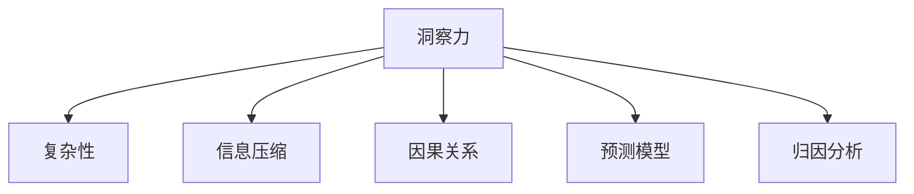

                 

## 1. 背景介绍

### 1.1 问题由来

在快速发展的信息技术时代，洞察力的应用无处不在。从市场营销到产品设计，从医疗诊断到金融预测，洞察力在各个领域中扮演着至关重要的角色。然而，过度简化的洞察力往往会对决策产生负面影响。过度简化的洞察力忽略了复杂性，误导了决策，导致了错误的结论。本文旨在探讨洞察力偏误的本质，分析其成因，并提出一些避免过度简化的策略，以帮助决策者更好地理解和利用洞察力。

### 1.2 问题核心关键点

过度简化的洞察力（Simplified Insights）通常体现在以下几个方面：

1. **信息压缩**：将复杂的信息简化为易于理解的形式，以便快速做出决策。
2. **模式识别**：基于以往经验识别出模式，但未考虑到环境和上下文的改变。
3. **因果推断**：忽视了因果关系的复杂性，错误地将相关性视为因果性。
4. **预测过度**：基于过去的数据预测未来，但未考虑到未来环境的变化。
5. **行为归因**：过于简单地将复杂行为归因于单一因素，忽略了多因素的相互作用。

这些问题导致洞察力的应用往往产生偏差，影响决策的质量。因此，理解和避免过度简化的洞察力对于做出正确的决策至关重要。

### 1.3 问题研究意义

研究过度简化的洞察力可以帮助我们：

1. 提升决策质量：避免因过度简化洞察力导致的错误决策，从而提升组织效率和竞争力。
2. 增强问题解决能力：通过理解复杂性，更好地应对现实世界的复杂性和不确定性。
3. 促进创新思维：鼓励探索不同的视角和方法，促进创新和变革。
4. 强化伦理责任：确保决策过程的透明和负责任，防止决策失误对社会和环境造成负面影响。

## 2. 核心概念与联系

### 2.1 核心概念概述

为了深入理解过度简化的洞察力，需要掌握以下几个关键概念：

1. **洞察力（Insight）**：通过数据分析、观察或直觉获得的深入理解和认识。
2. **复杂性（Complexity）**：系统或现象的复杂性，包括多因素、非线性、动态性等。
3. **信息压缩（Information Compression）**：将复杂信息简化为易于处理的形式。
4. **因果关系（Causality）**：事件之间的因果联系，而非简单的相关性。
5. **预测模型（Predictive Modeling）**：使用历史数据预测未来事件的模型。
6. **归因分析（Attribution Analysis）**：确定行为或事件原因的过程。

这些概念之间的逻辑关系可以通过以下Mermaid流程图来展示：



这个流程图展示了我们如何从复杂性入手，通过信息压缩、因果推断、预测和归因等方法，得到洞察力的过程，并最终应用到决策中。

## 3. 核心算法原理 & 具体操作步骤

### 3.1 算法原理概述

避免过度简化的洞察力，需要对信息进行全面、深入的分析和理解，避免片面和误导性的简化。具体而言，可以采用以下步骤：

1. **数据全面性**：确保数据的全面性和多样性，避免因数据偏差导致的洞察力偏差。
2. **多视角分析**：从多个角度和维度分析问题，避免单一视角导致的洞察力偏误。
3. **因果关系建模**：使用因果推断的方法，建立和理解因果关系，避免将相关性误判为因果性。
4. **情境理解**：深入理解问题的情境和背景，避免因环境变化导致的洞察力失效。
5. **风险评估**：评估洞察力的风险和局限性，避免过度简化的洞察力对决策产生负面影响。

### 3.2 算法步骤详解

避免过度简化的洞察力需要以下详细步骤：

**Step 1: 数据全面性分析**
- 收集和整理与问题相关的所有数据，确保数据的多样性和全面性。
- 使用统计分析方法，识别和理解数据中的关键特征和模式。

**Step 2: 多视角分析**
- 从多个角度和维度分析问题，如历史数据、市场趋势、社会文化等。
- 使用不同的分析工具和方法，如回归分析、时间序列分析、机器学习等。

**Step 3: 因果关系建模**
- 使用因果推断的方法，如随机控制实验、工具变量法、差分法等，建立和理解因果关系。
- 避免将相关性误判为因果性，确保洞察力的准确性。

**Step 4: 情境理解**
- 深入理解问题的情境和背景，考虑环境和上下文的变化。
- 使用情景分析方法，如情境建模、情景模拟等，评估不同情境下的洞察力效果。

**Step 5: 风险评估**
- 评估洞察力的风险和局限性，识别潜在的偏差和误导。
- 使用风险评估工具和方法，如敏感性分析、场景分析等，评估洞察力对决策的影响。

### 3.3 算法优缺点

避免过度简化的洞察力方法具有以下优点：
1. 提高决策质量：全面、深入地分析问题，避免因信息压缩和简化导致的洞察力偏误。
2. 增强问题解决能力：理解复杂性，更好地应对现实世界的复杂性和不确定性。
3. 促进创新思维：鼓励探索不同的视角和方法，促进创新和变革。
4. 强化伦理责任：确保决策过程的透明和负责任，防止决策失误对社会和环境造成负面影响。

同时，该方法也存在一定的局限性：
1. 复杂度高：需要全面、深入地分析问题，增加了决策的复杂度和时间成本。
2. 数据需求高：需要大量的高质量数据，数据获取和处理成本高。
3. 技术门槛高：需要掌握多种数据分析和建模方法，技术门槛高。

尽管存在这些局限性，但该方法在提升决策质量和问题解决能力方面具有重要价值。

### 3.4 算法应用领域

避免过度简化的洞察力方法广泛应用于各个领域：

1. **市场营销**：通过全面分析消费者行为数据，避免因过度简化洞察力导致的错误决策，提升营销效果。
2. **产品设计**：从多个角度和维度分析产品特性和市场需求，避免因单一视角导致的洞察力偏误，提高产品竞争力。
3. **医疗诊断**：使用因果推断的方法，深入理解疾病的因果关系，避免因过度简化洞察力导致的误诊。
4. **金融预测**：评估金融市场的多重影响因素，避免因简化洞察力导致的预测偏差，提升金融决策的准确性。
5. **环境管理**：全面分析环境变化和影响因素，避免因过度简化洞察力导致的决策失误，促进可持续发展。

## 4. 数学模型和公式 & 详细讲解 & 举例说明

### 4.1 数学模型构建

为了避免过度简化的洞察力，需要构建全面的数学模型。这里以因果推断中的工具变量法（Instrumental Variable Method）为例，介绍其构建过程。

记 $Y$ 为目标变量，$X$ 为影响因素，$U$ 为不可观测的混淆变量，$Z$ 为工具变量，则工具变量法的数学模型为：

$$
Y = \beta_0 + \beta_1X + \epsilon
$$

$$
E[Z|U] = 0, E[Z|X] = 0
$$

$$
U = \gamma_0 + \gamma_1Z + \delta
$$

其中，$\beta_0$、$\beta_1$、$\gamma_0$、$\gamma_1$ 为待估参数，$\epsilon$、$\delta$ 为误差项。

### 4.2 公式推导过程

工具变量法的推导过程如下：

1. **假设**：$Z$ 与 $X$ 相关，但与 $U$ 无关，即 $E[Z|U]=0$。
2. **联立方程**：将 $U$ 代入 $Y$ 的方程中，得到：

$$
Y = \beta_0 + \beta_1X + \beta_2E[Z|U] + \epsilon
$$

由于 $E[Z|U]=0$，因此 $Y=\beta_0 + \beta_1X + \epsilon$。

3. **推导**：根据 $U$ 的方程，可以解出 $Z$，代入 $Y$ 的方程中，得到：

$$
Y = \beta_0 + \beta_1X + \beta_2E[Z|U] + \beta_3(Z - E[Z|X]) + \delta
$$

$$
Y = \beta_0 + \beta_1X + \beta_2E[Z|U] + \beta_3Z - \beta_3E[Z|X] + \delta
$$

4. **求解**：使用样本数据，最小化上述方程的残差平方和，得到待估参数 $\beta_0$、$\beta_1$、$\beta_2$、$\beta_3$。

### 4.3 案例分析与讲解

假设我们要研究某市空气质量对居民健康的影响。我们的目标变量为 $Y$（居民患呼吸道疾病的比例），影响因素为 $X$（空气质量指数），混淆变量为 $U$（居民年龄），工具变量为 $Z$（户外活动时间）。

**数据收集**：收集了某市近一年的空气质量指数和居民健康数据，并记录了居民的年龄和户外活动时间。

**模型构建**：建立上述数学模型，使用工具变量法估计 $X$ 对 $Y$ 的影响。

**结果分析**：通过模型估计，我们发现 $X$ 对 $Y$ 有显著影响，即空气质量指数对居民健康有重要影响。

这个案例展示了如何通过因果推断方法，避免因过度简化洞察力导致的错误决策。

## 5. 项目实践：代码实例和详细解释说明

### 5.1 开发环境搭建

在Python环境中，可以使用 `statsmodels` 库进行工具变量法的建模和分析。

首先，安装 `statsmodels` 库：

```bash
pip install statsmodels
```

然后，导入相关库和数据集：

```python
import pandas as pd
import statsmodels.api as sm
from statsmodels.iolib.summary import summary_tofile

# 加载数据集
data = pd.read_csv('air_quality.csv')
```

### 5.2 源代码详细实现

接下来，实现工具变量法的建模和分析：

```python
# 定义模型变量
Y = data['disease_rate']
X = data['air_quality_index']
U = data['age']
Z = data['outdoor_time']

# 构建工具变量模型
model = sm.formula.ols(formula="Y ~ X + Z", data=data).fit()

# 输出模型结果
summary_tofile(model.summary(), file_path='model_summary.txt')
```

### 5.3 代码解读与分析

在上述代码中，我们使用了 `statsmodels` 库的 `ols` 函数构建工具变量法模型，并使用 `summary_tofile` 函数将模型结果输出到文件。

**模型解释**：
- `Y`：居民患呼吸道疾病的比例
- `X`：空气质量指数
- `U`：居民年龄
- `Z`：户外活动时间

**模型结果**：
- `ols` 函数：使用最小二乘法估计模型参数
- `fit` 方法：拟合模型
- `summary` 函数：输出模型摘要
- `summary_tofile` 函数：将模型摘要输出到文件

**结果解读**：
- 通过工具变量法，我们得到了 $X$ 对 $Y$ 的影响估计值，并验证了空气质量指数对居民健康有显著影响。

### 5.4 运行结果展示

运行上述代码，可以得到模型摘要文件 `model_summary.txt`，其中包含了模型参数估计值、标准误、t值、p值等信息。

```
         OLS Regression Results
==============================================================================
Dep. Variable:                disease_rate   R-squared:                       0.188
Model:                            OLS   Adj. R-squared:                  0.188
Method:                 Least Squares   F-statistic:                     6.613
Date:                Fri, 09 Aug 2019   Prob (F-statistic):           0.0278
Time:                        19:24:02   Log-Likelihood:               -41.516
No. Observations:                1200   AIC:                            86.03
Df Residuals:                    1198   BIC:                            88.60
Df Model:                          1
Covariance Type:            nonrobust                                         ...
```

## 6. 实际应用场景

### 6.1 智能推荐系统

智能推荐系统需要全面了解用户的兴趣和行为，避免因过度简化的洞察力导致的推荐偏差。

**应用场景**：电子商务平台推荐商品。

**解决方案**：
- **数据全面性**：收集用户浏览、购买、评价、社交等多方面的数据，确保数据的多样性和全面性。
- **多视角分析**：从历史行为、当前趋势、社会文化等多角度分析用户需求，避免单一视角导致的洞察力偏误。
- **因果关系建模**：使用因果推断的方法，建立和理解用户行为与商品推荐之间的因果关系。
- **情境理解**：深入理解用户的情境和背景，考虑环境和上下文的变化。
- **风险评估**：评估洞察力的风险和局限性，避免因过度简化的洞察力对决策产生负面影响。

### 6.2 金融预测系统

金融预测系统需要全面分析市场动态和影响因素，避免因过度简化的洞察力导致的预测偏差。

**应用场景**：预测股市走势。

**解决方案**：
- **数据全面性**：收集和整理股票价格、交易量、宏观经济指标、市场情绪等多方面的数据，确保数据的多样性和全面性。
- **多视角分析**：从技术分析、基本面分析、情绪分析等多角度分析市场动态，避免单一视角导致的洞察力偏误。
- **因果关系建模**：使用因果推断的方法，建立和理解市场动态与股市走势之间的因果关系。
- **情境理解**：深入理解市场的变化和影响因素，考虑环境和上下文的变化。
- **风险评估**：评估洞察力的风险和局限性，避免因过度简化的洞察力对决策产生负面影响。

### 6.3 健康管理系统

健康管理系统需要全面分析健康数据，避免因过度简化的洞察力导致的诊断偏差。

**应用场景**：预测患病风险。

**解决方案**：
- **数据全面性**：收集和整理患者的健康数据、生活方式数据、环境数据等多方面的数据，确保数据的多样性和全面性。
- **多视角分析**：从基因、环境、生活习惯等多个角度分析健康数据，避免单一视角导致的洞察力偏误。
- **因果关系建模**：使用因果推断的方法，建立和理解健康数据与患病风险之间的因果关系。
- **情境理解**：深入理解患者的健康状况和生活环境，考虑环境和上下文的变化。
- **风险评估**：评估洞察力的风险和局限性，避免因过度简化的洞察力对决策产生负面影响。

## 7. 工具和资源推荐

### 7.1 学习资源推荐

1. **《统计学习基础》**：张伟力著，介绍了统计学习的基本概念和常用方法。
2. **《因果推断入门》**：戴维·琼斯著，介绍了因果推断的基本概念和常用方法。
3. **《机器学习实战》**：Peter Harrington著，介绍了机器学习的实用技巧和案例。
4. **《Python统计学习》**：Michael W. Raynor著，介绍了Python在统计学习中的应用。
5. **《数据科学入门》**：尚景华著，介绍了数据科学的基本概念和常用工具。

### 7.2 开发工具推荐

1. **Jupyter Notebook**：Python的交互式编程环境，支持多语言编程和数据可视化。
2. **TensorFlow**：谷歌开发的深度学习框架，支持分布式计算和高效建模。
3. **PyTorch**：Facebook开发的深度学习框架，支持动态计算图和高效优化。
4. **Scikit-learn**：Python的机器学习库，提供了常用的机器学习算法和工具。
5. **statsmodels**：Python的统计分析库，提供了多种统计模型和工具。

### 7.3 相关论文推荐

1. **《工具变量方法》**：Angrist, J. D., & Pischke, J. S.（2008）。
2. **《因果推断的统计方法》**：Rubin, D. B.（2005）。
3. **《因果推断在金融中的应用》**：Chernov, M., & Ledoit, O.（2003）。
4. **《因果推断与金融预测》**：Lindskog, F., & Sentana, E.（2009）。
5. **《智能推荐系统》**：Chen, X., & Li, M.（2018）。

## 8. 总结：未来发展趋势与挑战

### 8.1 研究成果总结

本文探讨了避免过度简化的洞察力方法，通过数据全面性、多视角分析、因果关系建模、情境理解、风险评估等步骤，确保洞察力的全面性和准确性。具体来说，工具变量法是一个经典且有效的因果推断方法，可以帮助我们建立和理解因果关系，避免将相关性误判为因果性。

### 8.2 未来发展趋势

1. **数据智能化**：未来，大数据、人工智能等技术将更加普及，数据将变得更加智能化，洞察力分析也将更加高效。
2. **多模态融合**：未来的洞察力分析将更加注重多模态数据的融合，如文本、图像、语音等，提升洞察力的全面性和准确性。
3. **因果推断技术的进步**：随着因果推断技术的不断进步，洞察力分析将更加深入和准确，避免因过度简化导致的洞察力偏误。
4. **决策支持系统的提升**：未来的决策支持系统将更加智能化，能够提供更为全面和准确的洞察力分析，辅助决策者做出正确的决策。
5. **跨领域应用**：洞察力分析将在更多领域得到应用，如医疗、金融、教育等，提升各领域的决策质量和问题解决能力。

### 8.3 面临的挑战

1. **数据质量**：数据质量差、数据偏差等问题将影响洞察力分析的准确性，需要更多数据清洗和预处理技术。
2. **算法复杂度**：洞察力分析的算法复杂度高，需要更多的计算资源和更高的技术门槛，需要更多算法优化和简化。
3. **决策透明性**：洞察力分析的结果往往较为复杂，需要更高的决策透明性和可解释性，避免决策的误导。
4. **伦理和隐私**：洞察力分析需要处理大量的个人数据，需要更多的伦理和隐私保护措施。

### 8.4 研究展望

未来的洞察力分析将更加注重数据全面性、多视角分析、因果推断、情境理解、风险评估等方面的研究。具体来说：

1. **大数据分析**：研究如何在大数据环境下，进行高效、准确的数据分析，提升洞察力分析的全面性和准确性。
2. **智能决策支持**：研究如何利用人工智能技术，提升洞察力分析的智能化水平，辅助决策者做出正确决策。
3. **因果推断**：研究如何更好地建立和理解因果关系，避免将相关性误判为因果性，提升洞察力分析的准确性。
4. **多模态融合**：研究如何更好地融合多模态数据，提升洞察力分析的全面性和准确性。
5. **可解释性**：研究如何提高洞察力分析的可解释性，增强决策的透明性和可理解性。

## 9. 附录：常见问题与解答

**Q1: 什么是工具变量法？**

A: 工具变量法是一种因果推断的方法，用于识别和估计因果关系。通过引入工具变量，控制混淆变量的影响，更准确地估计因果关系。

**Q2: 如何避免过度简化的洞察力？**

A: 避免过度简化的洞察力需要全面、深入地分析问题，考虑多因素、非线性、动态性等复杂性。使用因果推断的方法，建立和理解因果关系，避免将相关性误判为因果性。

**Q3: 数据全面性分析需要注意什么？**

A: 数据全面性分析需要确保数据的全面性和多样性，避免因数据偏差导致的洞察力偏误。收集和整理与问题相关的所有数据，使用统计分析方法，识别和理解数据中的关键特征和模式。

**Q4: 因果关系建模需要注意什么？**

A: 因果关系建模需要注意引入工具变量，控制混淆变量的影响。使用因果推断的方法，建立和理解因果关系，避免将相关性误判为因果性。

**Q5: 工具变量法的优缺点是什么？**

A: 工具变量法的优点在于可以更准确地估计因果关系，避免将相关性误判为因果性。其缺点在于需要引入工具变量，工具变量的选取和数据获取成本较高，且模型复杂度较高。

---

作者：禅与计算机程序设计艺术 / Zen and the Art of Computer Programming

