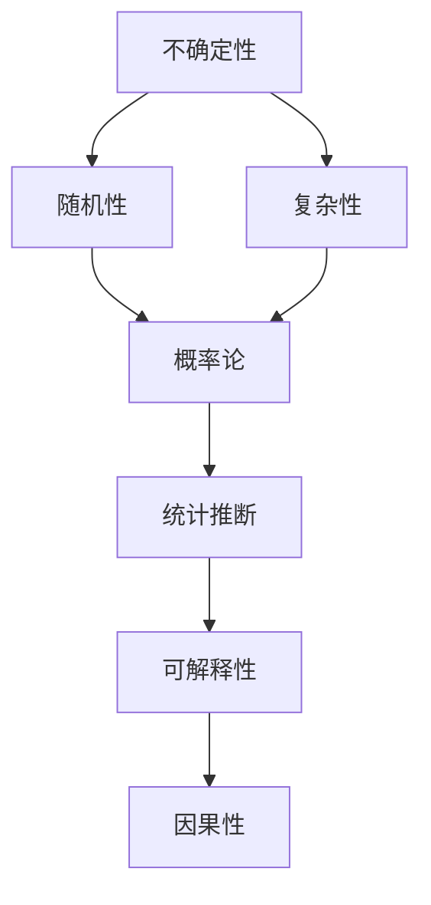

                 

# 理解洞察力的局限：承认不确定性和复杂性

在探索人工智能和计算智能的旅程中，我们经常会遭遇一个看似简单却深刻的问题：**我们如何理解复杂世界的不确定性和复杂性？** 这个问题不仅关乎理论研究的深度，也直接影响到我们如何将先进技术应用于实际问题中。本文将深入探讨这一核心概念，并尝试通过逻辑清晰、结构紧凑的专业技术语言，给出详细的解析。

## 1. 背景介绍

### 1.1 问题由来

人类在探索自然界和构建社会的过程中，始终面临着不确定性和复杂性。传统的机械和统计方法在一定程度上缓解了这些挑战，但随着问题规模和复杂度的增加，这些方法变得越来越力不从心。计算机科学和人工智能的发展为解决这些难题提供了新的途径，尤其是深度学习和机器学习技术的广泛应用。

然而，即便是这些先进技术，也无法完全摆脱不确定性和复杂性的影响。例如，深度学习模型在训练过程中往往依赖于大量标注数据，但数据的不足或不平衡可能带来模型的偏见和误判。此外，模型的复杂性可能使得难以解释其内部决策过程，进一步增加了应用的不确定性。

### 1.2 问题核心关键点

承认不确定性和复杂性是理解其局限性的第一步。问题的核心关键点在于：

- 不确定性（Uncertainty）：指我们无法完全预测未来事件或结果的概率分布。
- 复杂性（Complexity）：指问题本身的规模和关联性使得难以简化处理。

这两个概念是紧密相关的：复杂性往往伴随着不确定性，而不确定性也加剧了复杂性。在人工智能领域，我们必须面对这种不确定性和复杂性，并找到合理的处理方法。

## 2. 核心概念与联系

### 2.1 核心概念概述

要深入理解不确定性和复杂性，我们首先需要澄清几个关键概念：

- **不确定性**：指事件发生概率的不确定性，是自然界的本质属性。
- **复杂性**：指问题本身的结构复杂和相互关联性，使得求解过程变得困难。
- **随机性**：指事件发生的不确定性，是产生不确定性的主要来源之一。
- **因果性**：指事件间的因果关系，是理解不确定性的重要依据。
- **可解释性**：指模型的决策过程可以被人类理解，是确保模型可靠性的关键因素。

这些概念之间的联系可以通过以下Mermaid流程图来展示：



这个流程图展示了一个从不确定性到复杂性的逻辑链条：

1. 不确定性由随机性产生。
2. 复杂性使得问题求解变得困难。
3. 概率论和统计推断提供了解决不确定性的工具。
4. 可解释性帮助理解模型的决策过程。
5. 因果性为理解不确定性提供了依据。

## 3. 核心算法原理 & 具体操作步骤

### 3.1 算法原理概述

在人工智能中，我们通常使用概率模型和统计推断方法来处理不确定性和复杂性。这些方法的核心思想是：**在不完全信息下，通过统计规律和概率分布，对未来事件进行预测和决策**。

具体而言，我们可以将复杂问题分解为若干子问题，并通过训练数据学习这些子问题的概率分布，最终通过模型组合得到整体的预测结果。这种方法的核心在于，我们接受有限信息的不完备性，但试图在统计意义下逼近最优解。

### 3.2 算法步骤详解

基于概率模型和统计推断方法，处理不确定性和复杂性的核心步骤如下：

1. **数据收集**：收集与问题相关的数据，包括训练数据和测试数据。
2. **模型选择**：选择合适的概率模型，如贝叶斯网络、隐马尔可夫模型、神经网络等。
3. **参数训练**：通过训练数据学习模型的参数，最小化预测误差。
4. **验证评估**：使用测试数据评估模型性能，调整模型参数或选择更合适的模型。
5. **推理预测**：根据新的输入数据，利用模型进行推理和预测。
6. **可解释性分析**：分析模型的决策过程，确保可解释性和鲁棒性。

### 3.3 算法优缺点

基于概率模型和统计推断方法的优点在于：

- **灵活性**：可以处理不同类型的数据和问题，适应性强。
- **可解释性**：通过概率分布，可以解释模型的决策过程。
- **可扩展性**：可以通过并行和分布式计算，处理大规模数据。

缺点则包括：

- **复杂度**：模型复杂度高，难以调试和优化。
- **数据依赖**：依赖于高质量标注数据，获取成本高。
- **过度拟合**：模型可能过度适应训练数据，泛化能力有限。

### 3.4 算法应用领域

在实际应用中，基于概率模型和统计推断的方法广泛应用于以下领域：

- **自然语言处理（NLP）**：文本分类、情感分析、机器翻译等任务。
- **计算机视觉（CV）**：图像识别、目标检测、图像分割等任务。
- **机器人学**：路径规划、动作控制、环境感知等任务。
- **金融风险管理**：信用评估、投资组合优化、欺诈检测等任务。
- **医疗健康**：疾病诊断、基因分析、药物研发等任务。

## 4. 数学模型和公式 & 详细讲解 & 举例说明

### 4.1 数学模型构建

概率模型和统计推断的核心在于构建概率分布。以高斯分布为例，其概率密度函数为：

$$
p(x|\mu,\sigma^2) = \frac{1}{\sqrt{2\pi}\sigma}e^{-\frac{(x-\mu)^2}{2\sigma^2}}
$$

其中，$\mu$ 是均值，$\sigma^2$ 是方差。这个模型用于描述随机变量 $x$ 的概率分布。

### 4.2 公式推导过程

以贝叶斯网络为例，其核心思想是通过联合概率分布来推理未知变量。假设有一个包含两个变量的贝叶斯网络，其结构如图：

```
A --- B
```

其中 $A$ 和 $B$ 是随机变量，其联合概率分布为：

$$
p(A,B) = p(A)p(B|A)p(A|B)
$$

假设 $p(A)$ 和 $p(B|A)$ 已知，我们可以通过贝叶斯定理求得 $p(A|B)$：

$$
p(A|B) = \frac{p(A)p(B|A)}{p(B)}
$$

其中 $p(B) = \sum_{a}p(A,a)p(B|a)$。通过这个公式，我们可以根据已知的条件概率，推断出未知变量的概率分布。

### 4.3 案例分析与讲解

假设我们要预测一个用户的购买行为，可以构建一个贝叶斯网络，包含用户特征 $X$ 和购买行为 $Y$。通过训练数据学习 $p(X|Y)$ 和 $p(Y)$，再利用贝叶斯定理求得 $p(Y|X)$。根据这个概率模型，我们可以预测用户在给定特征 $X=x$ 时，购买行为 $Y=y$ 的概率。

## 5. 项目实践：代码实例和详细解释说明

### 5.1 开发环境搭建

为了实践上述算法，我们需要搭建一个Python环境，并安装必要的库。以下是详细的步骤：

1. 安装Python 3.x，推荐使用Anaconda。
2. 创建虚拟环境：
```bash
conda create --name myenv python=3.8
conda activate myenv
```
3. 安装必要的库：
```bash
pip install numpy scipy pandas scikit-learn matplotlib seaborn
```

### 5.2 源代码详细实现

以下是一个简单的贝叶斯网络实现，用于预测用户的购买行为。

```python
import numpy as np
from sklearn.linear_model import LogisticRegression

class BayesianNetwork:
    def __init__(self, num_features, num_classes):
        self.num_features = num_features
        self.num_classes = num_classes
        self.weights = None
        self.bias = None
        self.model = None
    
    def train(self, X, y):
        # 初始化模型参数
        self.weights = np.random.randn(self.num_features, self.num_classes)
        self.bias = np.zeros(self.num_classes)
        self.model = LogisticRegression(solver='lbfgs')
        
        # 训练模型
        self.model.fit(X, y)
        
    def predict(self, X):
        y_pred = []
        for x in X:
            # 线性变换
            z = np.dot(x, self.weights) + self.bias
            # 概率分布
            probs = np.exp(z) / np.sum(np.exp(z), axis=0)
            # 取最大概率对应的类别
            y_pred.append(np.argmax(probs))
        return y_pred
```

### 5.3 代码解读与分析

**贝叶斯网络类**：
- `__init__`方法：初始化模型参数。
- `train`方法：使用sklearn的逻辑回归模型进行训练。
- `predict`方法：利用训练好的模型进行预测。

**训练和预测**：
- 使用numpy实现线性变换，sklearn的逻辑回归模型实现概率分布计算。
- 通过预测函数，将输入数据映射到概率分布，选择最大概率对应的类别作为预测结果。

## 6. 实际应用场景

### 6.1 金融风险管理

在金融领域，风险管理是至关重要的。传统的风险模型往往依赖于历史数据，但面对突发事件或极端情况，模型的预测能力有限。基于概率模型的风险管理系统可以通过学习复杂的市场关系，更准确地评估金融产品的风险。

例如，可以利用贝叶斯网络构建信用评分模型，根据用户的历史行为数据和社交网络信息，预测其信用风险。这不仅提高了模型的鲁棒性，还能更好地适应不同市场环境。

### 6.2 医疗健康

医疗健康领域同样面临复杂性和不确定性。通过构建贝叶斯网络，可以整合多个医疗数据源，进行疾病诊断和预测。例如，可以利用基因数据和临床数据，构建一个综合的疾病预测模型，提高诊断的准确性和及时性。

### 6.3 自然灾害预警

在自然灾害预警中，数据的复杂性和不确定性使得传统的统计方法难以有效应对。基于概率模型的预警系统可以通过学习历史数据和气候变化，预测未来灾害的发生概率。例如，可以利用贝叶斯网络构建一个多模态的灾害预警模型，融合气象数据、地理信息和社会媒体数据，提升预警的准确性和及时性。

## 7. 工具和资源推荐

### 7.1 学习资源推荐

- **《概率论与数理统计》**：经典教材，介绍了概率模型和统计推断的基本原理。
- **《Pattern Recognition and Machine Learning》**：由Christopher Bishop编写，介绍了机器学习中的概率模型和方法。
- **Coursera的《Probabilistic Graphical Models》**：由Daphne Koller和NIPS 2009的论文获得者Proceedings of the National Academy of Sciences 论文获得者Peter Werman主讲，介绍了贝叶斯网络和概率模型在实际应用中的使用方法。

### 7.2 开发工具推荐

- **Python**：推荐使用Anaconda创建虚拟环境，方便管理和维护。
- **Jupyter Notebook**：免费的交互式开发环境，支持代码编写、数据可视化和交互式计算。
- **TensorFlow**：谷歌开发的深度学习框架，支持概率模型的高效实现。

### 7.3 相关论文推荐

- **"Bayesian Networks and Statistical Learning"**：由Judea Pearl编写，介绍了贝叶斯网络的基本概念和方法。
- **"Probabilistic Graphical Models: Principles and Techniques"**：由Daphne Koller和NIPS 2009的论文获得者Peter Werman编写，详细介绍了概率模型在实际应用中的使用方法。
- **"Generative Adversarial Nets"**：由Ian Goodfellow等人编写，介绍了生成对抗网络的基本原理和实现方法，是深度学习领域的经典论文。

## 8. 总结：未来发展趋势与挑战

### 8.1 研究成果总结

本文介绍了概率模型和统计推断方法在处理不确定性和复杂性方面的应用，包括贝叶斯网络和逻辑回归模型。这些方法已经被广泛应用于金融风险管理、医疗健康和自然灾害预警等多个领域，取得了显著的效果。

### 8.2 未来发展趋势

未来的概率模型和统计推断方法将更加注重模型的可解释性和鲁棒性，以确保模型的可靠性和可控性。此外，随着数据量的增加和计算能力的提升，我们有望构建更加复杂的概率模型，提高模型的预测精度和处理能力。

### 8.3 面临的挑战

尽管概率模型和统计推断方法在处理不确定性和复杂性方面取得了显著进展，但仍面临以下挑战：

- **数据依赖**：高质量标注数据的获取和处理成本较高。
- **模型复杂度**：模型的复杂度和可解释性之间的平衡仍然是一个难题。
- **计算资源**：大规模数据和复杂模型的计算需求高，需要高性能计算平台支持。
- **应用场景**：不同应用场景对模型要求的侧重点不同，需要定制化设计。

### 8.4 研究展望

未来的研究需要关注以下几个方向：

- **多模态融合**：融合不同模态的数据，提升模型的综合能力。
- **因果推断**：探索因果关系的建模方法，增强模型的可解释性和鲁棒性。
- **可解释性**：提高模型的可解释性，确保算法的透明性和可信性。
- **计算效率**：提升模型的计算效率，适应大数据和复杂问题的需求。
- **伦理和安全**：关注模型的伦理和安全问题，确保算法符合人类价值观和法律法规。

总之，理解不确定性和复杂性是人工智能研究的核心任务之一。通过合理应用概率模型和统计推断方法，我们可以更有效地处理实际问题，推动人工智能技术的广泛应用和深入发展。

## 9. 附录：常见问题与解答

**Q1：为什么概率模型和统计推断方法是处理不确定性和复杂性的有效工具？**

A: 概率模型和统计推断方法通过建立概率分布和统计规律，可以在不完全信息下进行预测和推理。这些方法可以处理复杂的数据结构，并且具有可解释性和鲁棒性，适用于各种应用场景。

**Q2：如何处理多模态数据？**

A: 处理多模态数据时，可以通过构建多模态的贝叶斯网络，将不同模态的数据融合在一起进行建模。例如，可以将文本数据、图像数据和语音数据融合到同一个模型中，提升模型的综合能力。

**Q3：如何提高模型的可解释性？**

A: 提高模型的可解释性可以通过特征选择、可视化工具和可解释性算法来实现。例如，可以使用LIME（Local Interpretable Model-agnostic Explanations）算法生成局部可解释性模型，帮助理解模型的决策过程。

**Q4：如何缓解模型的过拟合问题？**

A: 缓解模型的过拟合问题可以通过数据增强、正则化和模型集成等方法。例如，可以通过数据增强生成更多的训练数据，使用L2正则控制模型的复杂度，使用模型集成减少过拟合风险。

**Q5：如何确保模型的安全性？**

A: 确保模型的安全性可以通过数据加密、访问控制和异常检测等措施。例如，可以使用加密技术保护用户数据，设置访问权限限制，以及使用异常检测技术监控模型的行为。

---

作者：禅与计算机程序设计艺术 / Zen and the Art of Computer Programming

