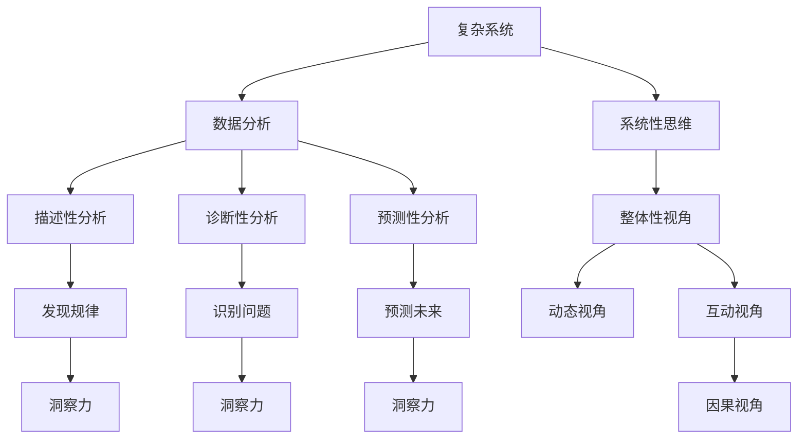

                 

# 理解洞察力的本质：在复杂中寻找秩序

> 关键词：洞察力, 复杂系统, 数据分析, 数据科学, 人工智能, 系统性思维

## 1. 背景介绍

### 1.1 问题由来

在现代社会，信息爆炸和数据多样性带来了前所未有的复杂性挑战。从金融市场的瞬息万变，到社交网络的人际互动，再到互联网上的海量数据，每一个领域都充满了复杂性和不确定性。如何在如此复杂的系统中洞察核心规律，找到秩序与结构，是现代数据科学和人工智能研究的核心课题。

### 1.2 问题核心关键点

在面对复杂系统时，洞察力成为了我们寻找秩序和理解系统的关键工具。洞察力不仅限于对表面现象的直接观察，更包括对系统内部机制和深层次逻辑的理解。在数据科学和人工智能中，洞察力是数据挖掘、特征工程、模型训练等各个环节的必备技能。

### 1.3 问题研究意义

洞察力的提升，不仅能帮助我们在复杂数据中发现隐含的模式和规律，还能指导我们更高效地进行数据分析和模型构建，提升人工智能应用的决策支持能力。此外，洞察力也是培养系统性思维和跨学科创新能力的重要基础，对于解决现实世界中的复杂问题具有重要意义。

## 2. 核心概念与联系

### 2.1 核心概念概述

要理解洞察力的本质，首先需要明确一些关键概念：

- **复杂系统(Complex System)**：由大量互相作用的部分组成的系统，其行为和结果难以通过简单的数学模型精确预测。
- **数据分析(Analytics)**：从数据中提取有用信息和知识的过程，包括描述性、诊断性和预测性分析。
- **数据科学(Data Science)**：一门跨学科领域，结合统计学、计算科学、人工智能等领域，使用数据驱动的方法解决实际问题。
- **人工智能(AI)**：通过算法和模型实现智能行为的计算机科学分支，目的是构建能够执行人类智能任务的机器。
- **系统性思维(Systemic Thinking)**：一种思考和解决问题的方法，强调系统内各部分之间的相互作用和整体性。

### 2.2 核心概念原理和架构的 Mermaid 流程图



这个流程图展示了复杂系统、数据分析、数据科学、人工智能和系统性思维之间的逻辑关系：

1. **复杂系统**作为分析对象，通过**数据分析**获取数据集。
2. **数据分析**通过**描述性分析**发现系统的基本特征和规律。
3. **数据分析**通过**诊断性分析**识别系统的问题和异常。
4. **数据分析**通过**预测性分析**预测系统的未来走向。
5. **系统性思维**从**整体性视角**、**动态视角**、**互动视角**和**因果视角**全面理解系统。
6. **系统性思维**引导**洞察力**的形成，使得在复杂系统中能够准确**发现规律**、**识别问题**和**预测未来**。

这些概念共同构成了洞察力的理论框架，使得在复杂系统中寻找秩序和结构成为可能。

## 3. 核心算法原理 & 具体操作步骤

### 3.1 算法原理概述

在复杂系统中，洞察力的获取和提升主要依赖于数据驱动的分析和计算模型。核心算法原理包括以下几个方面：

- **数据预处理**：对原始数据进行清洗、转换和归一化，提高数据质量。
- **特征工程**：通过数据工程方法提取和构造新的特征变量，帮助模型更好地学习数据。
- **统计分析**：使用统计方法，如描述性统计、假设检验等，提取数据的关键特征和规律。
- **机器学习**：使用机器学习模型，如决策树、随机森林、神经网络等，从数据中学习规律和模式。
- **深度学习**：使用深度神经网络模型，如卷积神经网络、循环神经网络、生成对抗网络等，从复杂数据中提取高级特征和表示。
- **可视化分析**：使用数据可视化工具，如图、表、热图等，直观展示数据和模型的结果。

### 3.2 算法步骤详解

以下将详细介绍基于机器学习和深度学习的洞察力获取具体操作步骤：

1. **数据获取与预处理**：
   - 收集复杂系统的数据集，包括结构化和非结构化数据。
   - 对数据进行清洗和去噪，去除异常值和噪声点。
   - 对数据进行归一化和标准化，保证数据的一致性。

2. **特征工程与选择**：
   - 根据问题定义，选择合适的特征变量。
   - 通过工程方法，如特征编码、特征组合等，构造新的特征。
   - 使用特征选择技术，如PCA、Lasso回归等，去除冗余和无关特征。

3. **模型训练与调参**：
   - 选择合适的机器学习或深度学习模型，如随机森林、支持向量机、卷积神经网络等。
   - 对模型进行超参数调优，如学习率、批大小、迭代次数等。
   - 使用交叉验证等方法，评估模型性能。

4. **结果解释与验证**：
   - 对模型结果进行可视化，如图、表、热图等。
   - 对模型结果进行验证，如回测和前向预测等。
   - 对模型结果进行解释，如特征贡献度、模型重要性等。

### 3.3 算法优缺点

**算法优点**：
- 数据驱动，能够从大量复杂数据中发现隐含的模式和规律。
- 能够处理高维、大规模数据集，适用于复杂系统分析。
- 能够进行自动化和半自动化操作，提升分析效率。

**算法缺点**：
- 对数据质量和特征工程要求高，模型效果依赖于数据处理和特征选择。
- 计算复杂度高，对硬件资源和计算能力有较高要求。
- 模型可解释性较差，难以理解模型的内部工作机制。

### 3.4 算法应用领域

洞察力获取算法广泛应用于多个领域，以下是一些典型应用：

- **金融风险管理**：通过分析历史交易数据，识别潜在的金融风险和市场趋势。
- **医疗健康分析**：通过分析患者数据，发现疾病模式和风险因素。
- **社会行为研究**：通过分析社交媒体数据，了解社会行为和公众情绪。
- **交通流量分析**：通过分析交通数据，优化交通流量管理。
- **环境监测与预测**：通过分析环境数据，预测和控制环境变化。

## 4. 数学模型和公式 & 详细讲解 & 举例说明

### 4.1 数学模型构建

在本节中，我们将通过一个具体的案例来介绍如何构建数学模型，以获取复杂系统中的洞察力。

假设我们有一组时间序列数据 $y_t$，其中 $t$ 表示时间，我们需要找到其中的规律和趋势。数学模型可以定义为：

$$
y_t = f(\mathbf{X}_t, \mathbf{\theta})
$$

其中，$y_t$ 为时间序列数据，$\mathbf{X}_t$ 为时间序列的特征变量，$\mathbf{\theta}$ 为模型参数。

### 4.2 公式推导过程

以线性回归模型为例，其数学公式如下：

$$
y_t = \theta_0 + \theta_1 x_{t1} + \theta_2 x_{t2} + \cdots + \theta_p x_{tp} + \epsilon_t
$$

其中，$\theta_0$ 为截距，$\theta_1, \theta_2, \cdots, \theta_p$ 为各特征的系数，$\epsilon_t$ 为误差项。

模型的目标是最小化均方误差：

$$
\min_{\theta} \sum_{t=1}^N (y_t - \theta_0 - \theta_1 x_{t1} - \theta_2 x_{t2} - \cdots - \theta_p x_{tp})^2
$$

通过最小二乘法求解上述优化问题，可得到各特征系数 $\theta_1, \theta_2, \cdots, \theta_p$。

### 4.3 案例分析与讲解

假设我们有一组股票价格数据，其时间序列 $y_t$ 和特征变量 $x_{t1}, x_{t2}, \cdots, x_{tp}$ 如表所示：

| 时间 $t$ | 股票价格 $y_t$ | 特征 $x_{t1}$ | 特征 $x_{t2}$ | ... | 特征 $x_{tp}$ |
|----|----|----|----|----|----|

我们可以使用线性回归模型，通过特征工程构造一些新的特征变量，如移动平均、技术指标等，来帮助我们预测股票价格。通过最小二乘法求解线性回归模型，可以得到各个特征的系数，进而进行股票价格的预测。

## 5. 项目实践：代码实例和详细解释说明

### 5.1 开发环境搭建

在进行项目实践前，我们需要准备好开发环境。以下是使用Python进行数据分析的Python环境配置流程：

1. 安装Anaconda：从官网下载并安装Anaconda，用于创建独立的Python环境。

2. 创建并激活虚拟环境：
```bash
conda create -n pydata-env python=3.8 
conda activate pydata-env
```

3. 安装必要的Python包：
```bash
pip install pandas numpy matplotlib scikit-learn statsmodels seaborn
```

4. 安装Jupyter Notebook：
```bash
pip install jupyter notebook
```

5. 安装TensorFlow和Keras（可选）：
```bash
pip install tensorflow keras
```

完成上述步骤后，即可在`pydata-env`环境中开始数据分析实践。

### 5.2 源代码详细实现

以下是使用Python进行线性回归模型分析的示例代码：

```python
import pandas as pd
import numpy as np
import matplotlib.pyplot as plt
from sklearn.linear_model import LinearRegression
from sklearn.model_selection import train_test_split

# 加载数据
data = pd.read_csv('stock_prices.csv')

# 数据预处理
features = data.drop(['price'], axis=1)
targets = data['price']
targets = targets.values.reshape(-1, 1)

# 数据分割
X_train, X_test, y_train, y_test = train_test_split(features, targets, test_size=0.2, random_state=42)

# 模型训练
model = LinearRegression()
model.fit(X_train, y_train)

# 模型评估
y_pred = model.predict(X_test)
mse = np.mean((y_pred - y_test)**2)
print(f'Mean Squared Error: {mse}')

# 可视化结果
plt.scatter(y_test, y_pred)
plt.xlabel('Actual Prices')
plt.ylabel('Predicted Prices')
plt.title('Linear Regression Prediction')
plt.show()
```

### 5.3 代码解读与分析

让我们详细解读一下关键代码的实现细节：

- **数据加载**：使用Pandas库读取CSV格式的数据文件，将其存储在DataFrame中。
- **数据预处理**：使用Pandas库的drop方法和axis参数，去除不需要的特征列。
- **数据分割**：使用Scikit-learn库的train_test_split方法，将数据集分为训练集和测试集。
- **模型训练**：使用Scikit-learn库的LinearRegression类，拟合线性回归模型。
- **模型评估**：计算测试集的均方误差，评估模型的预测性能。
- **可视化结果**：使用Matplotlib库绘制实际价格与预测价格的点图，直观展示模型效果。

## 6. 实际应用场景

### 6.1 金融风险管理

在金融领域，洞察力获取算法可以用于分析历史交易数据，识别潜在的金融风险和市场趋势。通过建立多维度的风险评估模型，金融机构可以更准确地预测和控制风险，避免潜在的财务损失。

### 6.2 医疗健康分析

医疗健康分析是洞察力获取算法的另一个重要应用领域。通过分析患者数据，可以发现疾病的模式和风险因素，帮助医生进行更精准的诊断和治疗。例如，可以通过分析电子病历数据，建立预测患者住院时间和治疗效果的模型。

### 6.3 社会行为研究

社交媒体数据的分析是洞察力获取算法的另一个典型应用。通过分析社交媒体上的言论和行为数据，可以了解公众情绪和社会行为，帮助政府和企业更好地制定政策和策略。例如，可以通过分析推文情绪，预测社会事件的爆发和影响。

### 6.4 交通流量分析

交通流量分析是洞察力获取算法的又一个重要应用。通过分析交通数据，可以优化交通流量管理，提高交通系统的效率。例如，可以通过分析交通摄像头数据，建立交通拥堵预测模型。

### 6.5 环境监测与预测

环境监测与预测也是洞察力获取算法的应用领域之一。通过分析环境数据，可以预测和控制环境变化，保护生态系统。例如，可以通过分析气象数据，建立空气质量预测模型。

## 7. 工具和资源推荐

### 7.1 学习资源推荐

为了帮助开发者系统掌握洞察力的获取和提升，以下是一些优质的学习资源：

1. **《Python数据分析基础》**：一本介绍数据分析基础知识和常用工具的书籍，适合初学者学习。
2. **《机器学习实战》**：介绍机器学习算法和实战案例的书籍，适合数据分析师和工程师学习。
3. **Coursera《数据科学专项课程》**：由斯坦福大学开设的在线课程，涵盖数据分析、机器学习和深度学习的各个方面。
4. **Kaggle**：一个数据科学竞赛平台，提供丰富的数据集和比赛机会，适合数据科学家和工程师实践。
5. **GitHub**：一个代码托管平台，提供各种开源项目和代码示例，适合开发者学习和参考。

通过对这些资源的学习实践，相信你一定能够快速掌握洞察力的获取和提升，并用于解决实际的复杂系统问题。

### 7.2 开发工具推荐

高效的开发离不开优秀的工具支持。以下是几款用于数据分析和洞察力获取的常用工具：

1. **Jupyter Notebook**：一个交互式编程环境，支持多种编程语言和库，适合快速迭代和共享代码。
2. **Matplotlib**：一个数据可视化库，支持多种图形绘制，适合展示数据和模型结果。
3. **Pandas**：一个数据分析库，支持数据读取、清洗、转换和分析，适合处理结构化数据。
4. **Scikit-learn**：一个机器学习库，支持各种机器学习算法和模型，适合数据分析和建模。
5. **TensorFlow**和**Keras**：一个深度学习库，支持各种神经网络模型和训练，适合复杂数据分析和预测。

合理利用这些工具，可以显著提升数据分析和洞察力获取的效率，加快创新迭代的步伐。

### 7.3 相关论文推荐

洞察力获取算法的发展源于学界的持续研究。以下是几篇奠基性的相关论文，推荐阅读：

1. **《深度学习与大数定律》**：提出深度学习算法在大规模数据中发现隐含模式的能力。
2. **《机器学习：理论与算法》**：全面介绍机器学习理论和算法，涵盖分类、回归、聚类等各个方面。
3. **《数据分析中的统计学方法》**：介绍统计学方法在数据分析中的应用，涵盖描述性统计、假设检验、回归分析等。
4. **《复杂系统中的自组织行为》**：探讨复杂系统中自组织现象的规律和机制，提供系统性思维的视角。

这些论文代表了大数据分析和洞察力获取技术的发展脉络，通过学习这些前沿成果，可以帮助研究者把握学科前进方向，激发更多的创新灵感。

## 8. 总结：未来发展趋势与挑战

### 8.1 研究成果总结

本文对基于数据分析的洞察力获取方法进行了全面系统的介绍。首先阐述了洞察力在复杂系统分析中的重要性，明确了其研究背景和意义。其次，从原理到实践，详细讲解了数据分析的各个环节，包括数据预处理、特征工程、模型训练和结果解释等。最后，本文还探讨了洞察力获取方法在金融、医疗、社会、交通和环境等多个领域的应用前景，展示了其广阔的发展潜力。

通过本文的系统梳理，可以看到，洞察力获取方法在大数据分析中的应用日益广泛，对于提升复杂系统分析的精度和效率具有重要意义。未来，随着数据量的增加和计算能力的提升，基于数据分析的洞察力获取技术将迎来更多创新和突破。

### 8.2 未来发展趋势

展望未来，洞察力获取方法的发展趋势主要包括以下几个方面：

1. **模型复杂化**：随着大数据和深度学习技术的发展，复杂模型和算法将进一步提升数据分析的精度和效果。
2. **数据源多样化**：多种数据源（如文本、图像、视频等）的融合，将为洞察力获取提供更多的数据支撑。
3. **计算效率提升**：更高效的计算技术和硬件设备（如GPU、TPU等）将提升洞察力获取的效率和能力。
4. **自动化与智能化**：自动化的数据分析流程和智能化的决策支持，将进一步提升洞察力的获取和应用。
5. **跨学科融合**：与其他学科（如心理学、社会学等）的结合，将丰富洞察力获取的视角和方法。

这些趋势预示着洞察力获取方法将不断进步，为复杂系统分析提供更强大的支持。

### 8.3 面临的挑战

尽管洞察力获取方法已经取得了显著进展，但在迈向更广泛应用的过程中，仍面临诸多挑战：

1. **数据质量问题**：高质量数据的获取和处理是洞察力获取的前提，但数据质量往往参差不齐。
2. **模型复杂性**：复杂模型的训练和调参需要高水平的算法和计算资源，存在一定的门槛。
3. **结果可解释性**：复杂模型的结果难以解释，缺乏透明性和可解释性。
4. **隐私与安全**：洞察力获取过程中涉及大量敏感数据，隐私和数据安全问题需要重点关注。
5. **跨领域应用**：不同领域的数据和问题具有特殊性，需要结合领域知识进行洞察力获取。

这些挑战需要我们不断探索和解决，才能使洞察力获取方法在更广泛的场景中发挥作用。

### 8.4 研究展望

为了应对上述挑战，未来的研究需要在以下几个方面寻求新的突破：

1. **数据质量提升**：通过数据清洗和预处理技术，提高数据质量，减少噪声和异常值的影响。
2. **模型简化与优化**：开发更高效的模型和算法，减少计算复杂度，降低对计算资源的需求。
3. **结果解释与可视化**：引入可解释性方法，提高模型结果的可解释性，帮助用户理解和信任结果。
4. **隐私保护技术**：开发隐私保护算法和机制，保障数据隐私和安全。
5. **跨领域知识融合**：结合领域知识，开发针对特定领域的洞察力获取方法和模型。

这些研究方向将推动洞察力获取方法的发展，使其在更广泛的场景中发挥作用，为复杂系统分析提供更强大的工具。

## 9. 附录：常见问题与解答

**Q1：如何提升数据质量？**

A: 提升数据质量的关键在于数据预处理和清洗。以下是一些常用的方法：

- **缺失值处理**：使用插值、均值、中位数等方法填补缺失值。
- **异常值检测与处理**：使用箱线图、Z-score等方法检测异常值，并进行清洗。
- **数据归一化与标准化**：使用归一化、标准化等方法，保证数据的一致性和可比性。
- **数据增强与扩充**：通过数据增强和扩充技术，丰富数据集的多样性。

**Q2：如何选择适当的模型？**

A: 选择合适的模型需要考虑以下几个方面：

- **问题类型**：根据问题的类型（如分类、回归、聚类等）选择相应的模型。
- **数据特征**：根据数据的特征（如时间序列、文本、图像等）选择适合的模型。
- **模型复杂度**：根据数据量和计算资源的限制，选择合适的模型复杂度。
- **性能评估**：通过交叉验证等方法评估模型的性能，选择表现最佳的模型。

**Q3：如何提高模型的可解释性？**

A: 提高模型的可解释性可以从以下几个方面入手：

- **模型简化**：使用简单的模型和算法，减少模型复杂度。
- **特征可视化**：使用特征可视化技术，帮助理解模型的特征贡献度。
- **模型解释工具**：使用模型解释工具，如LIME、SHAP等，帮助理解模型的决策过程。

**Q4：如何在跨领域应用中提升洞察力获取效果？**

A: 在跨领域应用中提升洞察力获取效果的关键在于结合领域知识：

- **领域知识融合**：将领域专家的知识和经验融合到模型中，提升模型的领域适应性。
- **数据特征工程**：根据领域特点，提取和构造合适的特征变量。
- **模型调整与优化**：根据领域需求，调整和优化模型的参数和结构。
- **结果解释与验证**：结合领域专家的解释和验证，确保模型的结果可信和可解释。

通过以上方法，可以提升跨领域洞察力获取的效果，帮助领域专家更好地理解复杂系统。

---

作者：禅与计算机程序设计艺术 / Zen and the Art of Computer Programming

