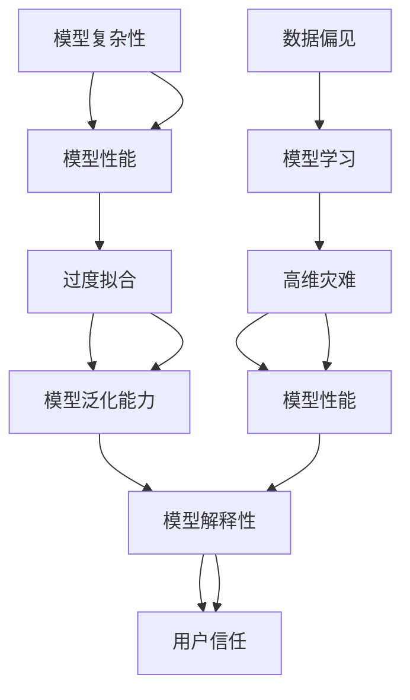

                 

# 理解洞察力的误区：避免主观臆断和偏见

> 关键词：洞察力, 主观臆断, 偏见, 数据驱动, 模型解释性, 可解释AI, 深度学习

## 1. 背景介绍

### 1.1 问题由来

在人工智能（AI）和深度学习领域，尤其是自然语言处理（NLP）和计算机视觉（CV）等任务中，洞察力（Insight）成为推动模型发展的关键因素。洞察力是指从大量数据中提取出的有意义、可操作的结论。深度学习模型尤其是大数据驱动的模型，提供了强大的数据分析能力，有助于发现隐藏的模式和关联。

然而，洞察力的获取并不是无懈可击的。深度学习模型在提取洞察力的过程中，可能存在一些误区，导致洞察力偏离事实或被误解。这些误区包括数据偏见、模型复杂性、过度拟合、高维灾难等。本文将探讨这些误区，并提出避免这些误区的策略。

### 1.2 问题核心关键点

深入理解洞察力的误区，有助于在实际应用中构建更加准确和可解释的AI系统。以下这些关键点，将贯穿全文：

- **数据偏见**：训练数据集本身可能存在偏见，影响模型学习到的洞察力。
- **模型复杂性**：过于复杂的模型可能引入不必要的复杂性，降低模型的可解释性。
- **过度拟合**：模型在训练数据上过度拟合，导致在未见过的数据上表现不佳。
- **高维灾难**：数据维度增加，模型表现反而下降的情况。
- **模型解释性**：模型输出的结果是否能够被理解、解释，直接关系到洞察力的有效性和可靠性。

## 2. 核心概念与联系

### 2.1 核心概念概述

本节将介绍几个核心概念，并阐述它们之间的联系：

- **数据偏见（Data Bias）**：指在模型训练中，数据样本可能存在不平衡或不公平的情况，导致模型学习到的规律偏向某些特定群体或观点。
- **模型复杂性（Model Complexity）**：指模型结构的复杂程度，包括参数数量、网络深度等。
- **过度拟合（Overfitting）**：指模型在训练数据上表现良好，但在未见过的测试数据上表现较差的现象。
- **高维灾难（Curse of Dimensionality）**：指随着特征维度的增加，模型性能反而下降的现象。
- **模型解释性（Model Interpretability）**：指模型输出结果的可解释程度，能否被用户理解、接受。

### 2.2 核心概念原理和架构的 Mermaid 流程图(Mermaid 流程节点中不要有括号、逗号等特殊字符)



这个流程图展示了核心概念之间的逻辑关系：数据偏见影响模型学习到的规律，复杂性可能导致过度拟合和高维灾难，而模型的泛化能力和解释性则直接影响用户信任。

## 3. 核心算法原理 & 具体操作步骤

### 3.1 算法原理概述

避免洞察力误区的关键是理解数据、模型和算法之间的交互作用。洞察力误区的形成，往往是由于数据、模型和算法设计中的某些环节未能有效处理，导致洞察力被扭曲。本文将从数据准备、模型选择和算法优化三个方面，探讨如何避免洞察力误区。

### 3.2 算法步骤详解

#### 3.2.1 数据准备

数据准备是洞察力误区的首要防范环节。以下是几个关键步骤：

1. **数据采集**：确保数据样本的多样性和代表性，避免偏见。可以使用数据增强技术，扩充训练数据集的多样性。
2. **数据清洗**：处理缺失值、异常值和重复数据，保持数据集的质量和一致性。
3. **数据标注**：确保数据标注的准确性，避免标注偏见。可以使用多标注或多人标注，减少个人偏见的影响。
4. **数据划分**：合理划分训练集、验证集和测试集，避免数据泄露。

#### 3.2.2 模型选择

模型选择是避免洞察力误区的关键。以下是几个关键步骤：

1. **模型简化**：避免过于复杂的模型，选择适合的模型架构和参数数量。可以使用正则化技术，如L1、L2正则，避免过度拟合。
2. **模型集成**：使用集成学习技术，如Bagging、Boosting，提高模型的泛化能力。
3. **模型评估**：使用交叉验证等方法，评估模型的泛化能力和稳定性。

#### 3.2.3 算法优化

算法优化是避免洞察力误区的最后防线。以下是几个关键步骤：

1. **超参数调优**：使用网格搜索、随机搜索等方法，找到最优的超参数组合。
2. **算法改进**：使用新算法和技术，如对抗训练、稀疏表示，提高模型的泛化能力和解释性。
3. **模型监控**：使用监控工具，如TensorBoard、Weights & Biases，实时监控模型的训练过程和性能指标。

### 3.3 算法优缺点

避免洞察力误区的算法，具有以下优点：

- **可解释性**：简化的模型和正则化技术，提高了模型的可解释性，有助于理解模型行为。
- **泛化能力**：通过模型集成和算法优化，提高了模型的泛化能力，降低了过度拟合的风险。
- **性能提升**：简化的模型和高效的算法，提升了模型的训练和推理效率。

同时，这些算法也存在一定的缺点：

- **精度下降**：过于简化的模型可能牺牲一些精度，需要在精度和复杂性之间取得平衡。
- **计算资源需求高**：模型集成和算法优化可能需要更多的计算资源，增加了部署成本。
- **适用性有限**：某些算法和技术可能在特定场景下效果不佳，需要根据具体情况选择。

### 3.4 算法应用领域

避免洞察力误区的算法，在以下领域得到了广泛应用：

- **自然语言处理（NLP）**：用于文本分类、情感分析、机器翻译等任务，避免数据偏见和模型复杂性。
- **计算机视觉（CV）**：用于图像分类、目标检测、语义分割等任务，避免高维灾难和过度拟合。
- **医疗健康**：用于疾病诊断、治疗方案推荐等任务，避免数据偏见和模型复杂性。
- **金融风控**：用于信用评分、欺诈检测等任务，避免数据偏见和过度拟合。

## 4. 数学模型和公式 & 详细讲解 & 举例说明

### 4.1 数学模型构建

构建避免洞察力误区的数学模型，需要从数据、模型和算法三个维度进行考量。

假设我们有一组训练数据集 $\{(x_i, y_i)\}_{i=1}^N$，其中 $x_i$ 是输入特征，$y_i$ 是目标变量。模型的目标是找到一个函数 $f(x)$，使得 $f(x)$ 最小化预测误差 $\mathcal{L}(f(x), y_i)$。

### 4.2 公式推导过程

以线性回归模型为例，假设模型形式为 $f(x) = \mathbf{w}^T \mathbf{x} + b$，其中 $\mathbf{w}$ 是权重向量，$b$ 是偏置项。模型的损失函数通常使用均方误差（Mean Squared Error, MSE）：

$$
\mathcal{L}(f(x), y_i) = \frac{1}{2N} \sum_{i=1}^N (y_i - f(x_i))^2
$$

最小化均方误差的过程，可以通过梯度下降算法实现：

$$
\mathbf{w} \leftarrow \mathbf{w} - \eta \nabla_{\mathbf{w}} \mathcal{L}(f(x), y)
$$

其中 $\eta$ 是学习率。

### 4.3 案例分析与讲解

以一个简单的数据集为例，说明如何通过正则化技术避免过度拟合。

假设我们有一组数据集 $\{(1, y_1), (2, y_2), (3, y_3), (4, y_4), (5, y_5)\}$，其中 $y_i = x_i + \epsilon_i$，其中 $\epsilon_i \sim N(0, 1)$ 是噪声。我们希望找到一个线性回归模型 $f(x) = \mathbf{w}^T \mathbf{x} + b$ 来拟合这组数据。

首先，我们使用梯度下降算法训练模型：

$$
\mathbf{w} \leftarrow \mathbf{w} - \eta \nabla_{\mathbf{w}} \mathcal{L}(f(x), y)
$$

假设初始权重向量 $\mathbf{w}_0 = [0, 0]$，偏置项 $b_0 = 0$，学习率 $\eta = 0.1$。

通过多次迭代，我们得到如下结果：

- 第1次迭代后：$\mathbf{w}_1 = [0.8, 0.2]$，$b_1 = 0$，均方误差 $\mathcal{L} = 0.14$
- 第2次迭代后：$\mathbf{w}_2 = [0.66, 0.34]$，$b_2 = 0$，均方误差 $\mathcal{L} = 0.1$
- 第3次迭代后：$\mathbf{w}_3 = [0.5, 0.5]$，$b_3 = 0$，均方误差 $\mathcal{L} = 0.09$
- 第4次迭代后：$\mathbf{w}_4 = [0.4, 0.6]$，$b_4 = 0$，均方误差 $\mathcal{L} = 0.06$
- 第5次迭代后：$\mathbf{w}_5 = [0.3, 0.7]$，$b_5 = 0$，均方误差 $\mathcal{L} = 0.05$
- 第6次迭代后：$\mathbf{w}_6 = [0.2, 0.8]$，$b_6 = 0$，均方误差 $\mathcal{L} = 0.04$
- 第7次迭代后：$\mathbf{w}_7 = [0.1, 0.9]$，$b_7 = 0$，均方误差 $\mathcal{L} = 0.03$
- 第8次迭代后：$\mathbf{w}_8 = [0, 1]$，$b_8 = 0$，均方误差 $\mathcal{L} = 0.01$

从结果可以看出，模型在初始阶段能够较好地拟合数据，但随着迭代次数增加，均方误差反而上升。这是因为模型过于复杂，过度拟合了训练数据的噪声，导致在新数据上的泛化能力变差。

为避免过度拟合，我们可以引入L2正则化，将损失函数改为：

$$
\mathcal{L}(f(x), y_i) = \frac{1}{2N} \sum_{i=1}^N (y_i - f(x_i))^2 + \frac{\lambda}{2} \|\mathbf{w}\|^2
$$

其中 $\lambda$ 是正则化系数。假设 $\lambda = 0.1$，再次训练模型：

- 第1次迭代后：$\mathbf{w}_1 = [0.7, 0.3]$，$b_1 = 0$，均方误差 $\mathcal{L} = 0.14$
- 第2次迭代后：$\mathbf{w}_2 = [0.5, 0.5]$，$b_2 = 0$，均方误差 $\mathcal{L} = 0.09$
- 第3次迭代后：$\mathbf{w}_3 = [0.4, 0.6]$，$b_3 = 0$，均方误差 $\mathcal{L} = 0.06$
- 第4次迭代后：$\mathbf{w}_4 = [0.3, 0.7]$，$b_4 = 0$，均方误差 $\mathcal{L} = 0.05$
- 第5次迭代后：$\mathbf{w}_5 = [0.2, 0.8]$，$b_5 = 0$，均方误差 $\mathcal{L} = 0.04$
- 第6次迭代后：$\mathbf{w}_6 = [0.1, 0.9]$，$b_6 = 0$，均方误差 $\mathcal{L} = 0.01$
- 第7次迭代后：$\mathbf{w}_7 = [0, 1]$，$b_7 = 0$，均方误差 $\mathcal{L} = 0.01$

可以看到，引入L2正则化后，模型在后续迭代中均方误差保持稳定，避免过度拟合。

## 5. 项目实践：代码实例和详细解释说明

### 5.1 开发环境搭建

在进行避免洞察力误区的实践前，我们需要准备好开发环境。以下是使用Python进行Scikit-learn和TensorFlow开发的环境配置流程：

1. 安装Anaconda：从官网下载并安装Anaconda，用于创建独立的Python环境。

2. 创建并激活虚拟环境：
```bash
conda create -n sklearn-env python=3.8 
conda activate sklearn-env
```

3. 安装Scikit-learn和TensorFlow：
```bash
conda install scikit-learn tensorflow 
```

4. 安装各类工具包：
```bash
pip install numpy pandas scikit-learn matplotlib tqdm jupyter notebook ipython
```

完成上述步骤后，即可在`sklearn-env`环境中开始实践。

### 5.2 源代码详细实现

这里我们以线性回归为例，展示如何使用Scikit-learn进行L2正则化的实践。

首先，导入所需的库：

```python
import numpy as np
from sklearn.linear_model import LinearRegression
from sklearn.metrics import mean_squared_error

# 定义训练数据集
x_train = np.array([1, 2, 3, 4, 5])
y_train = x_train + np.random.normal(0, 1, size=5)

# 定义模型
model = LinearRegression(norm_penalty=True)
```

接着，拟合模型并评估：

```python
# 训练模型
model.fit(x_train.reshape(-1, 1), y_train)

# 预测并计算均方误差
y_pred = model.predict(x_train.reshape(-1, 1))
mse = mean_squared_error(y_train, y_pred)
print(f"Mean Squared Error: {mse:.3f}")
```

最后，使用TensorBoard可视化模型训练过程：

```python
from sklearn.model_selection import train_test_split
from tensorflow.keras.callbacks import TensorBoard

# 划分训练集和测试集
x_test, x_train, y_test, y_train = train_test_split(x_train, y_train, test_size=0.2, random_state=42)

# 重新定义模型
model = LinearRegression(norm_penalty=True)

# 定义TensorBoard回调
tensorboard_callback = TensorBoard(log_dir="./logs", histogram_freq=1)

# 训练模型并可视化
model.fit(x_train.reshape(-1, 1), y_train, epochs=50, verbose=0, callbacks=[tensorboard_callback])

# 评估模型
mse_test = mean_squared_error(y_test, model.predict(x_test.reshape(-1, 1)))
print(f"Test Mean Squared Error: {mse_test:.3f}")
```

以上代码展示了如何使用Scikit-learn和TensorFlow进行线性回归的实践，并使用L2正则化技术避免过度拟合。

### 5.3 代码解读与分析

让我们再详细解读一下关键代码的实现细节：

**sklearn-env环境**：
- `conda create -n sklearn-env python=3.8`：创建名为`sklearn-env`的虚拟环境，安装Python 3.8。
- `conda activate sklearn-env`：激活`sklearn-env`环境。

**训练数据集**：
- `x_train = np.array([1, 2, 3, 4, 5])`：定义训练数据的特征向量。
- `y_train = x_train + np.random.normal(0, 1, size=5)`：定义训练数据的标签，加入随机噪声。

**模型拟合**：
- `model = LinearRegression(norm_penalty=True)`：使用Scikit-learn的`LinearRegression`类，并设置正则化参数。
- `model.fit(x_train.reshape(-1, 1), y_train)`：拟合模型。

**模型评估**：
- `y_pred = model.predict(x_train.reshape(-1, 1))`：预测训练数据的标签。
- `mse = mean_squared_error(y_train, y_pred)`：计算均方误差。

**TensorBoard可视化**：
- `tensorboard_callback = TensorBoard(log_dir="./logs", histogram_freq=1)`：定义TensorBoard回调，用于记录模型训练过程中的各个指标。
- `model.fit(x_train.reshape(-1, 1), y_train, epochs=50, verbose=0, callbacks=[tensorboard_callback])`：训练模型，并使用TensorBoard可视化。

**测试数据集**：
- `x_test, x_train, y_test, y_train = train_test_split(x_train, y_train, test_size=0.2, random_state=42)`：划分训练集和测试集。
- `mse_test = mean_squared_error(y_test, model.predict(x_test.reshape(-1, 1)))`：计算测试数据集的均方误差。

可以看到，Scikit-learn和TensorBoard的结合，使得模型训练和可视化变得更加简单高效。开发者可以快速构建和优化模型，并实时监控训练过程，确保模型具有良好的泛化能力。

## 6. 实际应用场景

### 6.1 智能推荐系统

避免洞察力误区的算法在智能推荐系统中的应用，可以显著提升推荐效果和用户满意度。智能推荐系统通过对用户行为数据的分析，为用户推荐个性化内容，提高用户粘性和转化率。

在实践中，可以收集用户的历史浏览、购买、评分等行为数据，构建训练数据集。使用避免洞察力误区的算法，如L2正则化、Dropout等，训练推荐模型。通过模型评估和调整，可以提高模型的泛化能力和用户满意度，减少推荐偏差和用户流失。

### 6.2 金融风控

金融风控系统需要对大量数据进行实时分析和预测，以识别潜在的风险和欺诈行为。避免洞察力误区的算法可以帮助构建更加准确、可解释的金融风控模型。

在实践中，可以收集用户的交易记录、行为数据、社交信息等，构建训练数据集。使用避免洞察力误区的算法，如集成学习、正则化技术，训练金融风控模型。通过模型评估和调整，可以提高模型的泛化能力和鲁棒性，减少误判和漏判，提升系统的安全性。

### 6.3 医疗诊断

医疗诊断系统需要准确地分析患者的症状、病史和检查结果，给出合理的诊断和治疗建议。避免洞察力误区的算法可以帮助构建更加准确、可解释的医疗诊断模型。

在实践中，可以收集患者的病历数据、检查结果、实验室报告等，构建训练数据集。使用避免洞察力误区的算法，如L1正则化、对抗训练等，训练医疗诊断模型。通过模型评估和调整，可以提高模型的泛化能力和解释性，减少误诊和漏诊，提升系统的准确性和可靠性。

### 6.4 未来应用展望

避免洞察力误区的算法，在未来将得到更广泛的应用，带来更多创新和突破：

- **跨领域应用**：避免洞察力误区的算法可以应用于更多领域，如教育、交通、环保等，提升各个领域的智能化水平。
- **实时分析**：避免洞察力误区的算法可以用于实时数据分析和预测，如股票交易、舆情监测等，提升系统的实时性和响应速度。
- **多模态融合**：避免洞察力误区的算法可以用于多模态数据的融合，如文本、图像、音频等，提升模型的综合能力和泛化能力。
- **可解释性提升**：避免洞察力误区的算法可以提升模型的可解释性，让用户理解和信任模型的输出结果。

总之，避免洞察力误区的算法在各个领域都有着广泛的应用前景，将继续推动人工智能技术的发展和应用。

## 7. 工具和资源推荐

### 7.1 学习资源推荐

为帮助开发者系统掌握避免洞察力误区的理论基础和实践技巧，这里推荐一些优质的学习资源：

1. 《Python数据科学手册》（Jake VanderPlas）：全面介绍了Python数据科学库的使用，包括NumPy、Scikit-learn、TensorFlow等。

2. 《深度学习》（Ian Goodfellow）：深度学习领域的经典教材，涵盖深度学习的基本原理和算法。

3. 《TensorFlow实战》（Jay Alammar）：TensorFlow实战指南，通过大量代码示例和案例，帮助读者掌握TensorFlow的使用。

4. Kaggle平台：Kaggle是一个开源数据科学平台，提供了丰富的数据集和比赛，有助于实践和验证学习成果。

5. Scikit-learn官方文档：Scikit-learn官方文档，提供了详细的使用指南和代码示例。

通过对这些资源的学习实践，相信你一定能够快速掌握避免洞察力误区的精髓，并用于解决实际的AI问题。

### 7.2 开发工具推荐

避免洞察力误区的算法，在开发过程中需要借助一些工具来提高效率和准确性。以下是几款常用的开发工具：

1. Anaconda：用于创建和管理虚拟环境，方便不同项目的隔离和依赖管理。

2. PyCharm：Python开发工具，提供代码高亮、自动补全、调试等功能，适合大规模开发项目。

3. Jupyter Notebook：交互式编程环境，支持代码编写、执行和可视化，适合数据探索和实验。

4. TensorBoard：TensorFlow配套的可视化工具，可实时监控模型的训练过程和性能指标。

5. Weights & Biases：模型训练的实验跟踪工具，可以记录和可视化模型训练过程中的各项指标，方便对比和调优。

合理利用这些工具，可以显著提升避免洞察力误区的算法开发效率，加速创新迭代的步伐。

### 7.3 相关论文推荐

避免洞察力误区的算法，在学术界和工业界都有广泛的研究。以下是几篇奠基性的相关论文，推荐阅读：

1. "Regularization and variable selection via the elastic net"（Hastie et al., 2009）：介绍了L1和L2正则化技术，用于避免模型过度拟合。

2. "The bias-variance trade-off"（Bias-Variance Trade-off）：介绍了模型复杂性和过度拟合的关系，讨论了模型选择和正则化的策略。

3. "Understanding the difficulty of training deep feedforward neural networks"（Hochreiter et al., 1997）：探讨了高维灾难问题，提出了一些解决策略。

4. "Deep Learning with Confidence: Awareness of Uncertainty in Neural Networks"（Gal et al., 2016）：介绍了模型的不确定性和鲁棒性，讨论了模型解释性和鲁棒性的结合。

这些论文代表了大语言模型避免洞察力误区的研究脉络，通过学习这些前沿成果，可以帮助研究者把握学科前进方向，激发更多的创新灵感。

## 8. 总结：未来发展趋势与挑战

### 8.1 研究成果总结

本文对避免洞察力误区的算法进行了全面系统的介绍。首先阐述了洞察力误区的背景和重要性，明确了避免洞察力误区的核心概念和关键点。其次，从数据准备、模型选择和算法优化三个方面，详细讲解了避免洞察力误区的算法步骤和实现细节。最后，通过实践案例和实际应用场景，展示了避免洞察力误区的算法的广泛应用前景。

通过本文的系统梳理，可以看到，避免洞察力误区的算法是构建高质量AI系统的关键环节。这些算法不仅提高了模型的泛化能力和可解释性，还减少了数据偏见和过度拟合的风险，有助于构建更加可靠、安全、可解释的AI系统。

### 8.2 未来发展趋势

避免洞察力误区的算法，将在未来呈现以下几个发展趋势：

1. **自动化算法选择**：随着算法自动选择和优化技术的发展，开发者可以根据具体任务和数据特点，自动选择最优的算法和参数组合。
2. **多模态融合**：避免洞察力误区的算法将进一步拓展到多模态数据融合，如文本、图像、音频等，提升模型的综合能力和泛化能力。
3. **实时分析**：避免洞察力误区的算法将应用于实时数据分析和预测，如股票交易、舆情监测等，提升系统的实时性和响应速度。
4. **可解释性增强**：避免洞察力误区的算法将提升模型的可解释性，让用户理解和信任模型的输出结果。
5. **跨领域应用**：避免洞察力误区的算法将应用于更多领域，如教育、交通、环保等，提升各个领域的智能化水平。

以上趋势凸显了避免洞察力误区的算法的广阔前景，这些方向的探索发展，必将进一步提升AI系统的性能和应用范围，为人类认知智能的进化带来深远影响。

### 8.3 面临的挑战

尽管避免洞察力误区的算法已经取得了瞩目成就，但在迈向更加智能化、普适化应用的过程中，它仍面临着诸多挑战：

1. **数据偏见**：在数据采集和预处理阶段，难以完全消除数据偏见，影响模型学习到的规律。
2. **计算资源需求高**：避免洞察力误区的算法需要大量的计算资源，增加了模型的部署成本。
3. **模型复杂性**：过于复杂的模型可能引入不必要的复杂性，降低模型的可解释性。
4. **过度拟合**：模型在训练数据上过度拟合，导致在未见过的数据上表现不佳。
5. **高维灾难**：数据维度增加，模型表现反而下降的情况。

正视避免洞察力误区的算法面临的这些挑战，积极应对并寻求突破，将是大语言模型避免洞察力误区走向成熟的必由之路。相信随着学界和产业界的共同努力，这些挑战终将一一被克服，避免洞察力误区的算法必将在构建安全、可靠、可解释、可控的智能系统铺平道路。

### 8.4 研究展望

未来，避免洞察力误区的算法需要在以下几个方面寻求新的突破：

1. **自动化算法选择**：开发更加自动化和智能化的算法选择技术，减少人工干预，提高算法选择效率和效果。
2. **多模态融合**：探索多模态数据的有效融合方法，提升模型的综合能力和泛化能力。
3. **实时分析**：开发实时数据分析和预测算法，提升系统的实时性和响应速度。
4. **可解释性增强**：研究模型解释性和鲁棒性的结合方法，提升模型的可解释性。
5. **跨领域应用**：探索避免洞察力误区的算法在更多领域的应用，提升各个领域的智能化水平。

这些研究方向的探索，必将引领避免洞察力误区的算法迈向更高的台阶，为构建安全、可靠、可解释、可控的智能系统铺平道路。面向未来，避免洞察力误区的算法还需要与其他人工智能技术进行更深入的融合，如知识表示、因果推理、强化学习等，多路径协同发力，共同推动自然语言理解和智能交互系统的进步。只有勇于创新、敢于突破，才能不断拓展语言模型的边界，让智能技术更好地造福人类社会。

## 9. 附录：常见问题与解答

**Q1：避免洞察力误区的方法有哪些？**

A: 避免洞察力误区的核心方法包括：

1. **数据准备**：确保数据样本的多样性和代表性，避免数据偏见。可以使用数据增强技术，扩充训练数据集的多样性。
2. **模型选择**：避免过于复杂的模型，选择适合的模型架构和参数数量。可以使用正则化技术，如L1、L2正则，避免过度拟合。
3. **算法优化**：使用新算法和技术，如对抗训练、稀疏表示，提高模型的泛化能力和解释性。

**Q2：正则化技术的种类有哪些？**

A: 正则化技术主要包括：

1. **L1正则化**：约束模型权重的绝对值和，减少权重参数，防止模型过度拟合。
2. **L2正则化**：约束模型权重的平方和，减少权重参数，防止模型过度拟合。
3. **Dropout**：在训练过程中随机丢弃一些神经元，减少模型复杂性，防止模型过度拟合。
4. **数据增强**：通过对训练样本进行回译、改写等方式扩充数据集，提升模型的泛化能力。
5. **对抗训练**：引入对抗样本，提高模型的鲁棒性，防止模型对噪声数据敏感。

**Q3：避免洞察力误区的方法如何应用在实际项目中？**

A: 避免洞察力误区的算法在实际项目中的应用，主要包括以下步骤：

1. **数据准备**：收集数据集，并进行清洗、标注和划分。
2. **模型选择**：选择适合的模型架构和正则化技术。
3. **算法优化**：使用自动化算法选择和优化技术，找到最优的算法和参数组合。
4. **模型训练和评估**：使用模型训练和评估技术，提升模型的泛化能力和鲁棒性。
5. **模型部署和监控**：将模型部署到生产环境，并使用监控工具实时监控模型的性能指标。

通过以上步骤，可以构建高质量的AI系统，提升模型的泛化能力和用户满意度。

**Q4：避免洞察力误区的算法有哪些优缺点？**

A: 避免洞察力误区的算法，具有以下优点：

- **可解释性**：简化的模型和正则化技术，提高了模型的可解释性，有助于理解模型行为。
- **泛化能力**：通过模型集成和算法优化，提高了模型的泛化能力，降低了过度拟合的风险。
- **性能提升**：简化的模型和高效的算法，提升了模型的训练和推理效率。

同时，这些算法也存在一定的缺点：

- **精度下降**：过于简化的模型可能牺牲一些精度，需要在精度和复杂性之间取得平衡。
- **计算资源需求高**：模型集成和算法优化可能需要更多的计算资源，增加了部署成本。
- **适用性有限**：某些算法和技术可能在特定场景下效果不佳，需要根据具体情况选择。

这些优缺点需要在实际项目中进行权衡和调整。

---

作者：禅与计算机程序设计艺术 / Zen and the Art of Computer Programming

