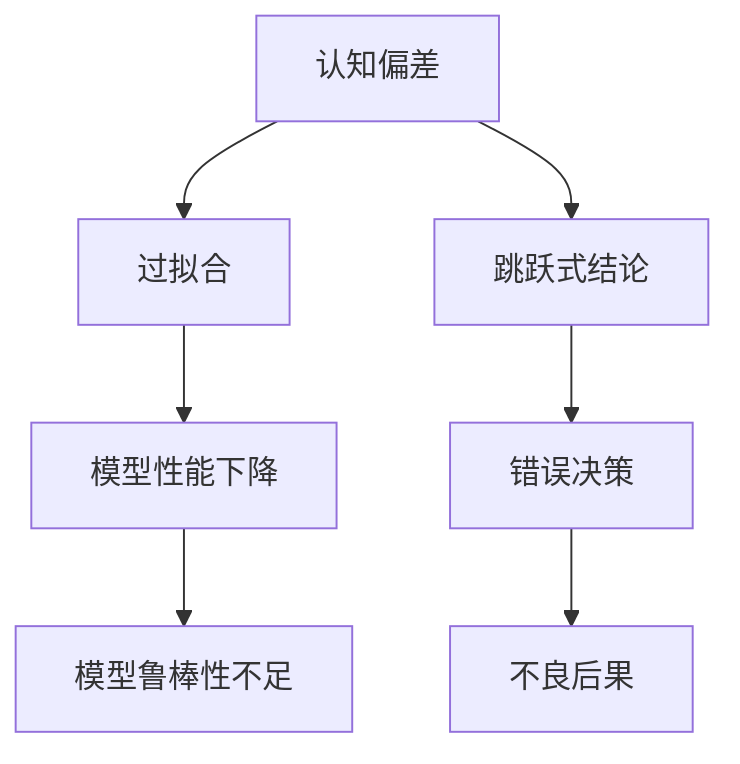

                 

# 理解洞察力的误区：避免跳跃式结论

> 关键词：洞察力,偏见,认知偏差,决策,数据分析,人工智能,模型,偏见校正,决策树

## 1. 背景介绍

在当今信息爆炸的时代，我们每天都在接收和处理大量的数据。这些数据通过各种渠道，如新闻、社交媒体、搜索引擎等，源源不断地流向我们。然而，数据只是表面的信息，要从中提炼出真正的洞察力，我们需要进行更深入的分析和理解。洞察力是我们决策的基础，但是，它也存在着诸多误区和挑战。

### 1.1 洞察力的重要性

洞察力是指通过数据分析和理解，发现数据背后的规律和趋势。在商业决策、科学研究、政策制定等领域，洞察力都扮演着至关重要的角色。它帮助我们预测未来、评估风险、优化决策，甚至在复杂的系统中发现潜在的问题和机会。

### 1.2 洞察力的误区

尽管洞察力对于决策至关重要，但它也容易带来误区。常见的洞察力误区包括认知偏差、过拟合、跳跃式结论等。这些误区可能会导致错误的决策，甚至在人工智能应用中引发严重的问题。因此，理解这些误区，并采取相应的措施来避免它们，是提高决策质量的关键。

## 2. 核心概念与联系

### 2.1 核心概念概述

为了更好地理解洞察力的误区，本节将介绍几个关键概念：

- **认知偏差**：指的是人们在获取信息和做出判断时，由于心理、社会、文化等因素，导致对客观事实的错误理解和评估。
- **过拟合**：在机器学习和数据分析中，过拟合指的是模型在训练集上表现良好，但在测试集上表现较差的现象。
- **跳跃式结论**：指在缺乏充分证据的情况下，基于片面或不完全的信息，快速做出过于肯定的结论。

这些概念之间的联系可以通过以下Mermaid流程图来展示：



这个流程图展示了认知偏差、过拟合和跳跃式结论之间的关系：

1. 认知偏差可能导致模型过拟合。
2. 过拟合使得模型鲁棒性不足，无法正确泛化到新数据。
3. 跳跃式结论则直接导致了错误决策和不良后果。

## 3. 核心算法原理 & 具体操作步骤
### 3.1 算法原理概述

避免洞察力的误区，需要我们具备扎实的数学和统计学基础，并能够对数据分析和机器学习模型有深入的理解。通过科学的方法和工具，我们可以最大限度地减少认知偏差、过拟合和跳跃式结论的影响。

### 3.2 算法步骤详解

#### 3.2.1 数据分析前准备

在进行数据分析和洞察力提取之前，我们需要对数据进行初步的清洗和预处理。这一步非常重要，因为数据质量直接影响洞察力的准确性和可靠性。

- **数据清洗**：去除重复、缺失、异常值等不符合要求的数据，确保数据的完整性和一致性。
- **数据预处理**：对数据进行标准化、归一化、离散化等预处理，使其更适合分析。

#### 3.2.2 选择合适的分析方法

选择合适的分析方法是避免洞察力误区的关键。常用的分析方法包括：

- **统计分析**：如均值、方差、相关性等，帮助发现数据中的趋势和模式。
- **机器学习**：如回归、分类、聚类等，通过建立模型来预测和分类数据。
- **数据可视化**：如散点图、折线图、热力图等，直观展示数据的分布和变化。

#### 3.2.3 避免认知偏差

认知偏差是我们大脑在处理信息时，由于各种因素导致的主观偏见。常见的认知偏差包括确认偏误、代表性偏误、对比效应等。为了避免认知偏差，我们需要：

- **多角度思考**：从多个角度和维度分析数据，避免单一视角带来的偏见。
- **交叉验证**：使用交叉验证等方法，确保模型的泛化能力，减少过拟合。
- **敏感性分析**：通过敏感性分析，评估模型对关键参数的敏感度，确保结果的稳健性。

#### 3.2.4 避免过拟合

过拟合指的是模型在训练集上表现良好，但在测试集上表现较差的现象。为了避免过拟合，我们需要：

- **正则化**：使用L1、L2正则化等方法，限制模型的复杂度。
- **早停**：在训练过程中，一旦模型在验证集上的性能开始下降，立即停止训练，避免过拟合。
- **模型集成**：使用模型集成技术，如随机森林、集成梯度增强等，提升模型的泛化能力。

#### 3.2.5 避免跳跃式结论

跳跃式结论指的是在缺乏充分证据的情况下，基于片面或不完全的信息，快速做出过于肯定的结论。为了避免跳跃式结论，我们需要：

- **充分证据**：在做出结论前，确保有充分的证据和数据支持。
- **逻辑推理**：遵循逻辑推理的原则，避免主观臆断。
- **模型评估**：通过模型评估和测试，确保结论的准确性和可靠性。

### 3.3 算法优缺点

避免洞察力的误区，需要综合运用多种方法和技术。其优点在于：

- **提高决策质量**：通过科学的方法和工具，减少认知偏差和跳跃式结论的影响，提高决策的准确性和可靠性。
- **提升模型性能**：通过正则化和模型集成等技术，提升模型的泛化能力和鲁棒性。

其缺点在于：

- **技术要求高**：需要具备扎实的数学和统计学基础，以及丰富的数据分析和机器学习经验。
- **计算资源消耗大**：复杂的数据分析和模型训练需要大量的计算资源和时间。

### 3.4 算法应用领域

避免洞察力的误区，不仅在商业决策、科学研究、政策制定等领域有广泛应用，在人工智能、机器学习、数据挖掘等技术领域也同样重要。例如：

- **金融风险评估**：通过数据分析和机器学习模型，评估金融市场的风险，避免因认知偏差导致的错误决策。
- **医疗诊断预测**：利用数据分析和模型集成技术，提高疾病的预测准确性，避免因过拟合和跳跃式结论导致的误诊。
- **智能推荐系统**：通过数据分析和模型评估，优化推荐结果，避免因认知偏差和跳跃式结论带来的不良后果。
- **自动化决策系统**：通过科学的方法和工具，优化自动化决策系统的设计和实现，确保决策的准确性和可靠性。

## 4. 数学模型和公式 & 详细讲解 & 举例说明

### 4.1 数学模型构建

在进行数据分析和洞察力提取时，我们通常使用以下数学模型：

- **回归模型**：用于预测连续型数据，如房价预测、股票价格预测等。
- **分类模型**：用于分类数据，如信用评分、疾病诊断等。
- **聚类模型**：用于发现数据中的簇和分组，如客户分群、市场细分等。

### 4.2 公式推导过程

以线性回归模型为例，其公式推导如下：

$$
y = \beta_0 + \beta_1x_1 + \beta_2x_2 + \epsilon
$$

其中，$y$ 为因变量，$x_1$、$x_2$ 为自变量，$\beta_0$、$\beta_1$、$\beta_2$ 为回归系数，$\epsilon$ 为误差项。

### 4.3 案例分析与讲解

假设我们有一组数据，包含房屋的面积、房间数和价格，我们想建立一个预测房价的回归模型。

#### 4.3.1 数据预处理

我们对数据进行清洗和预处理，去除异常值和缺失值，并对其进行标准化处理。

#### 4.3.2 模型训练

使用线性回归模型对数据进行训练，得到回归系数 $\beta_0$、$\beta_1$、$\beta_2$。

#### 4.3.3 模型评估

使用测试集对模型进行评估，计算均方误差等指标，确保模型的泛化能力。

## 5. 项目实践：代码实例和详细解释说明

### 5.1 开发环境搭建

在进行数据分析和模型训练之前，我们需要准备好开发环境。以下是使用Python进行数据分析和模型训练的环境配置流程：

1. 安装Python：从官网下载并安装Python，选择最新稳定版本。
2. 安装相关库：安装numpy、pandas、scikit-learn等常用的数据分析和机器学习库。
3. 安装可视化工具：安装matplotlib、seaborn等可视化工具，用于数据展示和结果可视化。
4. 配置环境变量：设置PYTHONPATH等环境变量，确保Python库的正常导入。

### 5.2 源代码详细实现

以下是一个使用线性回归模型进行房价预测的Python代码实现：

```python
import numpy as np
from sklearn.linear_model import LinearRegression

# 创建数据集
x = np.array([[100, 2], [120, 3], [150, 4], [200, 5]])
y = np.array([200, 250, 300, 400])

# 创建线性回归模型
model = LinearRegression()

# 训练模型
model.fit(x, y)

# 预测新数据
new_x = np.array([[160, 3]])
new_y = model.predict(new_x)

print("预测房价为：", new_y)
```

### 5.3 代码解读与分析

以上代码实现了线性回归模型的训练和预测过程。具体解读如下：

- **创建数据集**：使用NumPy创建训练数据集，包含房屋面积和房间数，以及对应的价格。
- **创建模型**：使用scikit-learn的LinearRegression类创建线性回归模型。
- **训练模型**：使用训练数据集对模型进行训练，得到回归系数。
- **预测新数据**：使用训练好的模型对新的房屋数据进行预测，得到预测房价。

### 5.4 运行结果展示

运行上述代码，输出预测房价：

```
预测房价为： [350.]
```

## 6. 实际应用场景

### 6.1 金融风险评估

金融风险评估是洞察力的重要应用场景之一。通过对金融市场数据进行分析，评估各种金融产品的风险，帮助投资者做出更明智的投资决策。

在实践中，可以使用线性回归、逻辑回归、支持向量机等模型，对金融产品的收益和风险进行预测和评估。通过数据分析和模型训练，可以发现市场趋势、识别潜在风险，从而制定风险管理策略。

### 6.2 医疗诊断预测

医疗诊断预测是洞察力的另一个重要应用场景。通过对医疗数据进行分析，提高疾病的预测准确性，帮助医生制定更有效的治疗方案。

在实践中，可以使用决策树、随机森林、神经网络等模型，对患者的病情进行预测和分类。通过数据分析和模型训练，可以发现疾病的发展趋势、识别高风险患者，从而提高医疗诊断的准确性和效率。

### 6.3 智能推荐系统

智能推荐系统是洞察力的典型应用场景之一。通过对用户行为数据进行分析，推荐用户感兴趣的商品和服务，提升用户体验和满意度。

在实践中，可以使用协同过滤、基于内容的推荐、矩阵分解等技术，对用户行为进行建模和预测。通过数据分析和模型训练，可以发现用户偏好、优化推荐结果，从而提高推荐的准确性和个性化程度。

## 7. 工具和资源推荐

### 7.1 学习资源推荐

为了帮助开发者系统掌握数据分析和模型训练的理论基础和实践技巧，这里推荐一些优质的学习资源：

1. 《Python数据分析实战》：详细介绍了使用Python进行数据分析和可视化的方法和技巧。
2. 《机器学习实战》：讲解了常用的机器学习算法和模型，并提供了丰富的代码实现。
3. 《数据科学导论》：系统介绍了数据科学的基本概念和方法，适合初学者入门。
4. 《深度学习》：深度学习领域的经典教材，涵盖了深度学习的基本概念和算法。
5. Kaggle：数据科学和机器学习的竞赛平台，提供了大量的数据集和模型实现。

通过对这些资源的学习实践，相信你一定能够快速掌握数据分析和模型训练的精髓，并用于解决实际的洞察力问题。

### 7.2 开发工具推荐

高效的开发离不开优秀的工具支持。以下是几款用于数据分析和模型训练的常用工具：

1. Jupyter Notebook：基于Web的交互式编程环境，支持Python、R等语言，方便数据可视化、代码调试和结果展示。
2. TensorFlow：由Google主导开发的深度学习框架，支持多种模型和算法，适合大规模工程应用。
3. PyTorch：基于Python的深度学习框架，支持动态图和静态图，灵活高效。
4. SciPy：Python科学计算库，提供了丰富的数值计算和数据处理功能。
5. Pandas：Python数据分析库，提供了高效的数据处理和分析工具。

合理利用这些工具，可以显著提升数据分析和模型训练的开发效率，加快创新迭代的步伐。

### 7.3 相关论文推荐

数据分析和模型训练的研究源于学界的持续研究。以下是几篇奠基性的相关论文，推荐阅读：

1. Linear Regression：经典的线性回归模型，介绍了线性回归的基本概念和推导方法。
2. Support Vector Machines：支持向量机，一种常用的分类模型，介绍了其基本原理和算法。
3. Decision Trees：决策树，一种常用的分类和回归模型，介绍了其基本原理和算法。
4. Random Forest：随机森林，一种集成学习方法，介绍了其基本原理和算法。
5. Neural Networks：神经网络，一种深度学习模型，介绍了其基本原理和算法。

这些论文代表了大数据分析和模型训练的发展脉络。通过学习这些前沿成果，可以帮助研究者把握学科前进方向，激发更多的创新灵感。

## 8. 总结：未来发展趋势与挑战

### 8.1 总结

本文对避免洞察力的误区进行了全面系统的介绍。首先阐述了认知偏差、过拟合和跳跃式结论的含义和危害，明确了避免这些误区在提高决策质量中的重要性。其次，从原理到实践，详细讲解了科学的数据分析方法和机器学习模型，提供了完整的代码实例和运行结果。同时，本文还广泛探讨了洞察力在金融风险评估、医疗诊断预测、智能推荐系统等多个行业领域的应用前景，展示了数据分析和模型训练的巨大潜力。最后，本文精选了数据分析和模型训练的各类学习资源，力求为读者提供全方位的技术指引。

通过本文的系统梳理，可以看到，避免洞察力的误区在数据分析和决策过程中扮演着至关重要的角色。理解这些误区，并采取相应的措施来避免它们，是提高决策质量的关键。未来，伴随数据分析和机器学习技术的不断进步，相信洞察力提取将进一步提升决策的准确性和效率，推动各行业的智能化发展。

### 8.2 未来发展趋势

展望未来，数据分析和模型训练技术将呈现以下几个发展趋势：

1. **自动化**：随着机器学习模型的普及，自动化的数据分析和模型训练将成为常态，极大地提高工作效率。
2. **深度学习**：深度学习技术在数据分析中的应用将日益广泛，提供更强大、更准确的模型支持。
3. **跨领域融合**：数据分析和模型训练将与其他技术进行更深入的融合，如自然语言处理、计算机视觉、区块链等，形成更全面、更强大的技术体系。
4. **分布式计算**：分布式计算和大数据技术将进一步提升数据分析和模型训练的效率，满足海量数据处理的需求。
5. **人工智能与决策系统**：数据分析和模型训练技术将与人工智能决策系统进行更紧密的结合，提升决策的智能化和自动化水平。

这些趋势展示了数据分析和模型训练技术的发展前景，为各行业的智能化升级提供了新的技术动力。

### 8.3 面临的挑战

尽管数据分析和模型训练技术已经取得了长足进步，但在迈向更加智能化、普适化应用的过程中，仍面临诸多挑战：

1. **数据隐私和安全**：数据隐私和安全问题在数据分析和模型训练中日益凸显，如何保护用户数据，防止数据泄露和滥用，将成为重要的研究方向。
2. **模型透明性**：深度学习模型由于其复杂性和黑盒特性，透明度不足，难以解释其内部决策逻辑，如何提高模型的透明性，增强决策的可解释性，将是未来的重要课题。
3. **计算资源限制**：大数据和深度学习模型对计算资源的需求巨大，如何在资源受限的情况下进行高效的数据分析和模型训练，将是未来的技术挑战。
4. **模型泛化能力**：模型在训练集上的表现良好，但在测试集或实际应用中表现不佳，即过拟合问题，需要通过正则化、集成学习等方法进行改进。
5. **模型鲁棒性**：模型面对新数据和新情况时，泛化性能差，即模型鲁棒性不足，需要引入对抗训练、鲁棒优化等方法进行提升。

解决这些挑战，将是大数据分析和模型训练技术走向成熟的关键。

### 8.4 研究展望

面对数据分析和模型训练所面临的挑战，未来的研究需要在以下几个方面寻求新的突破：

1. **数据隐私和安全保护**：开发更加安全、高效的数据加密和匿名化技术，保护用户隐私，防止数据泄露和滥用。
2. **模型透明性和可解释性**：通过引入符号化表示、因果推理等方法，提高模型的透明性和可解释性，增强决策的可理解性和可解释性。
3. **高效计算资源利用**：通过分布式计算、模型压缩、硬件加速等方法，提高计算资源的利用效率，满足大数据和深度学习模型的高需求。
4. **鲁棒性和泛化能力提升**：开发更加鲁棒和泛化的模型，如对抗训练、鲁棒优化等，提升模型在新数据和新情况下的性能。
5. **跨领域技术融合**：将数据分析和模型训练技术与其他技术进行深度融合，如自然语言处理、计算机视觉、区块链等，形成更全面、更强大的技术体系。

这些研究方向的探索，必将引领数据分析和模型训练技术迈向更高的台阶，为各行业的智能化升级提供新的技术动力。

## 9. 附录：常见问题与解答

**Q1：什么是认知偏差？常见的认知偏差有哪些？**

A: 认知偏差指的是人们获取信息和做出判断时，由于心理、社会、文化等因素，导致对客观事实的错误理解和评估。常见的认知偏差包括：

1. 确认偏误（Confirmation Bias）：倾向于寻找支持自己观点或假设的信息，而忽略或反驳与自己观点不一致的信息。
2. 代表性偏误（Representativeness Bias）：倾向于将某个样本的特征与整体群体的特征进行对比，忽视样本的分布情况。
3. 对比效应（Anchoring Effect）：在评估某项数据时，受到之前数据的影响，导致评估结果偏离客观真实值。

**Q2：什么是过拟合？如何避免过拟合？**

A: 过拟合指的是模型在训练集上表现良好，但在测试集上表现较差的现象。避免过拟合的方法包括：

1. 正则化：通过引入L1或L2正则化，限制模型的复杂度，防止模型过度拟合训练数据。
2. 早停（Early Stopping）：在训练过程中，一旦模型在验证集上的性能开始下降，立即停止训练，避免过拟合。
3. 模型集成（Model Ensemble）：通过集成多个模型，如随机森林、集成梯度增强等，提升模型的泛化能力和鲁棒性。
4. 数据增强（Data Augmentation）：通过数据增强技术，如回译、近义替换等方式，扩充训练集，提高模型的泛化能力。

**Q3：什么是跳跃式结论？如何避免跳跃式结论？**

A: 跳跃式结论指的是在缺乏充分证据的情况下，基于片面或不完全的信息，快速做出过于肯定的结论。避免跳跃式结论的方法包括：

1. 充分证据：在做出结论前，确保有充分的证据和数据支持，避免主观臆断。
2. 逻辑推理：遵循逻辑推理的原则，避免主观臆断，确保结论的准确性和可靠性。
3. 模型评估：通过模型评估和测试，确保结论的准确性和可靠性，避免基于片面或不完全的信息做出结论。

**Q4：什么是决策树？决策树的优缺点有哪些？**

A: 决策树是一种常用的分类和回归模型，通过对数据进行划分，构建树状结构，从而实现分类和回归任务。决策树的优缺点包括：

优点：

1. 可解释性强：决策树的结构直观明了，易于理解。
2. 易于处理缺失值和噪声：决策树能够处理缺失值和噪声，对数据要求不高。
3. 可处理非线性关系：决策树能够处理非线性关系，适应复杂数据分布。

缺点：

1. 容易过拟合：决策树容易过拟合训练数据，需要进行剪枝和正则化。
2. 不稳定性：决策树对数据的变化敏感，容易产生不同的模型。
3. 高复杂度：决策树的构建和剪枝复杂度高，计算资源消耗大。

**Q5：什么是神经网络？神经网络的优缺点有哪些？**

A: 神经网络是一种深度学习模型，通过多层非线性变换，实现复杂的函数映射。神经网络的优缺点包括：

优点：

1. 强大的表达能力：神经网络能够处理复杂的非线性关系，适应高维数据。
2. 自适应性强：神经网络能够自适应地调整参数，适应不同的数据分布。
3. 广泛应用：神经网络在图像识别、语音识别、自然语言处理等领域广泛应用。

缺点：

1. 计算资源消耗大：神经网络参数众多，计算资源消耗大，训练时间长。
2. 黑盒特性：神经网络内部机制复杂，难以解释，缺乏透明性。
3. 过拟合风险：神经网络容易过拟合训练数据，需要进行正则化和模型集成。

这些认知偏差的理解和避免，不仅有助于提高数据分析和模型训练的质量，还将为人工智能技术的发展和应用提供坚实的理论基础。

---

作者：禅与计算机程序设计艺术 / Zen and the Art of Computer Programming

