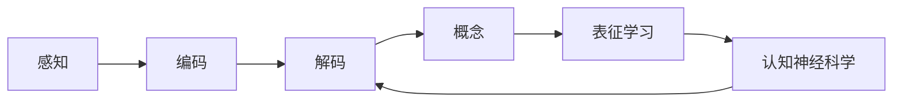
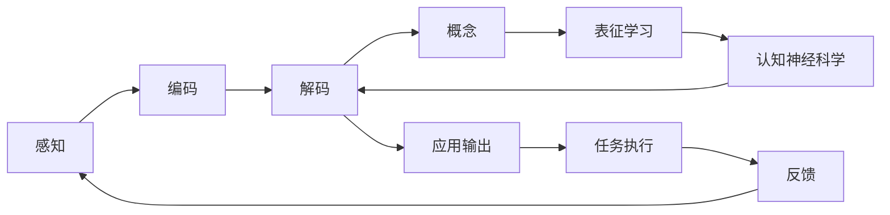

                 

# 理解的过程：从感知到概念化的认知journey

> 关键词：认知心理学, 感知过程, 概念形成, 表征学习, 信息处理, 认知神经科学

## 1. 背景介绍

### 1.1 问题由来

理解是人类的基本能力之一，从婴儿对声音的响应到成人在复杂环境中进行决策，理解始终贯穿于认知活动的各个方面。随着人工智能的发展，理解也成为构建智能系统的核心目标。尽管机器学习、深度学习等技术已经取得了巨大进步，但如何让机器理解人类语言的深层次含义，仍然是一个具有挑战性的问题。

理解之所以成为难题，原因在于语言是高度抽象和复杂的。语言不仅包括语法、词汇，还涉及到语义、情感、逻辑推理等多个层面。传统的自然语言处理（NLP）方法通常基于规则或统计模型，难以捕捉语言的语义和上下文信息。近年来，基于神经网络的深度学习模型，特别是大语言模型（LLMs），逐渐在理解任务中显示出潜力。但如何设计有效的认知模型，实现从感知到概念化的全过程理解，仍是研究者面临的重要课题。

### 1.2 问题核心关键点

理解的核心在于模型如何从感知输入中提取信息，并构建出与之对应的概念。理解过程包括三个主要步骤：

- **感知输入**：将外界信息转化为内部表示，形成初级的信号感知。
- **加工处理**：对感知信号进行编码、解码、过滤、分类等处理，构建出更加抽象、高级的概念。
- **应用输出**：将处理后的概念用于判断、决策、交互等高层次任务，实现对环境的适应和干预。

理解模型的设计应兼顾这三个步骤，以确保其能够从底层感知到高层概念，从而实现全面的理解。

## 2. 核心概念与联系

### 2.1 核心概念概述

要理解理解过程，首先需要明确定义与之相关的核心概念：

- **感知**（Perception）：指将外界信息通过感官转化为大脑可处理的形式，如听觉、视觉、触觉等。
- **编码**（Encoding）：指将感知信息转化为内部表示，如神经元激活、声波振幅、图像像素等。
- **解码**（Decoding）：指将内部表示转化为可解释的形式，如语言文字、符号等。
- **概念**（Concept）：指对感知信息的高级抽象，用于指导行为和决策。
- **表征学习**（Representation Learning）：指学习如何将输入数据转化为有意义的内部表示，以支持理解任务。
- **认知神经科学**（Cognitive Neuroscience）：研究人类认知过程的神经机制，为理解模型的设计提供生物学依据。

这些概念相互关联，共同构成了理解模型的框架。以下通过一个Mermaid流程图，展示这些概念之间的联系：



### 2.2 核心概念原理和架构的 Mermaid 流程图

为了更直观地理解这些概念，我们提供以下一个简单的Mermaid流程图，展示它们之间的联系：



这个流程图展示了一个理解模型从感知输入到应用输出的全过程。

## 3. 核心算法原理 & 具体操作步骤

### 3.1 算法原理概述

理解模型主要基于感知、编码、解码和概念形成的全过程，其核心思想是：通过学习如何将感知信息转化为内部表示，并进一步构建出与任务相关的概念，从而实现对输入信息的全面理解。以下以大语言模型为例，介绍理解模型的设计原理。

大语言模型通常基于自回归模型或自编码模型，通过大规模无标签文本数据的预训练，学习到丰富的语言知识和常识。在特定任务上，通过对模型进行微调，使其能够理解和生成与任务相关的语义信息，从而实现理解任务。

### 3.2 算法步骤详解

大语言模型的理解过程包括以下几个关键步骤：

1. **感知输入**：将输入的自然语言文本通过分词、向量编码等步骤转化为模型可处理的形式。
2. **编码处理**：将编码后的输入信息通过多层神经网络进行编码，提取特征表示。
3. **解码生成**：将编码得到的特征表示解码为自然语言文本，或用于分类、匹配等任务。
4. **概念形成**：通过对解码生成的文本进行语义分析和推理，构建出与任务相关的概念。
5. **应用输出**：将概念应用于具体任务，如生成文本、分类、匹配等，完成理解和处理。

### 3.3 算法优缺点

大语言模型在理解任务中表现出了显著的优势，但也存在一些局限性：

#### 优点：
- **泛化能力**：大语言模型能够从大量无标签数据中学习通用语言知识，适用于多种理解任务。
- **灵活性**：模型可以通过微调的方式，适应特定任务的需求，实现高效的参数复用。
- **自动化**：利用深度学习自动特征提取和概念构建，减少了手动设计的复杂性。

#### 缺点：
- **数据依赖**：模型的性能很大程度上依赖于预训练数据的质量和数量，获取高质量数据成本较高。
- **复杂性**：模型的设计复杂，包含大量参数，训练和推理成本较高。
- **可解释性**：模型缺乏透明度，难以解释其内部推理过程，限制了其在某些领域的应用。

### 3.4 算法应用领域

大语言模型在多个领域中的应用已经取得了显著成效，具体包括：

- **自然语言处理**：包括文本分类、问答系统、机器翻译、文本生成等。
- **语音识别**：将语音信号转化为文本，用于语音助手、自动字幕等任务。
- **图像识别**：通过语言描述生成图像，或将图像描述转化为自然语言文本。
- **医疗领域**：辅助医学文献阅读、疾病诊断、药物研发等。
- **金融领域**：用于金融舆情分析、风险预测、投资决策等。

## 4. 数学模型和公式 & 详细讲解 & 举例说明

### 4.1 数学模型构建

理解模型通常基于多层神经网络结构，其数学模型可以描述为：

$$
h = f_w(x)
$$

其中 $x$ 为输入，$h$ 为模型输出，$f_w$ 为带权函数，$w$ 为模型参数。

以一个简单的编码器-解码器模型为例，其结构如图：


其中 $A$ 为编码器，$B$ 为解码器，$C$ 为输出。

### 4.2 公式推导过程

以编码器-解码器模型为例，其推导过程如下：

1. **编码器**：

$$
h = f_w(x)
$$

其中 $x$ 为输入，$h$ 为模型输出，$f_w$ 为带权函数，$w$ 为模型参数。

2. **解码器**：

$$
y = g_v(h)
$$

其中 $h$ 为编码器输出，$y$ 为模型输出，$g_v$ 为带权函数，$v$ 为模型参数。

3. **应用输出**：

$$
o = \phi(y)
$$

其中 $y$ 为解码器输出，$o$ 为应用输出，$\phi$ 为应用函数。

### 4.3 案例分析与讲解

以BERT模型为例，其编码器采用Transformer结构，解码器为线性分类器。在文本分类任务中，BERT模型将输入文本编码得到上下文向量 $h$，再通过解码器得到分类得分 $y$。

## 5. 项目实践：代码实例和详细解释说明

### 5.1 开发环境搭建

要实现理解模型，需要搭建Python开发环境，并选择合适的深度学习框架和工具库。以下是一个简单的开发环境搭建流程：

1. **安装Anaconda**：
```bash
wget https://repo.anaconda.com/miniconda/Miniconda3-latest-Linux-x86_64.sh
bash Miniconda3-latest-Linux-x86_64.sh
```

2. **创建虚拟环境**：
```bash
conda create -n understanding-env python=3.8
conda activate understanding-env
```

3. **安装深度学习框架**：
```bash
pip install torch torchvision torchaudio
```

4. **安装预训练模型和工具库**：
```bash
pip install transformers
pip install numpy pandas scikit-learn
```

5. **启动Jupyter Notebook**：
```bash
jupyter notebook
```

### 5.2 源代码详细实现

以下是一个简单的理解模型实现代码：

```python
import torch
import torch.nn as nn
import torch.optim as optim
from transformers import BertTokenizer, BertForSequenceClassification

# 加载预训练模型和分词器
tokenizer = BertTokenizer.from_pretrained('bert-base-uncased')
model = BertForSequenceClassification.from_pretrained('bert-base-uncased', num_labels=2)

# 定义训练和评估函数
def train_epoch(model, train_loader, optimizer, device):
    model.train()
    total_loss = 0
    for batch in train_loader:
        inputs, labels = batch['input_ids'].to(device), batch['labels'].to(device)
        outputs = model(inputs, labels=labels)
        loss = outputs.loss
        total_loss += loss.item()
        optimizer.zero_grad()
        loss.backward()
        optimizer.step()
    return total_loss / len(train_loader)

def evaluate(model, dev_loader, device):
    model.eval()
    total_correct, total_samples = 0, 0
    with torch.no_grad():
        for batch in dev_loader:
            inputs, labels = batch['input_ids'].to(device), batch['labels'].to(device)
            outputs = model(inputs)
            predictions = torch.argmax(outputs.logits, dim=1)
            total_correct += (predictions == labels).sum().item()
            total_samples += labels.size(0)
    return total_correct / total_samples

# 训练模型
train_loader = ...
dev_loader = ...
device = torch.device('cuda' if torch.cuda.is_available() else 'cpu')
optimizer = optim.Adam(model.parameters(), lr=1e-5)

for epoch in range(10):
    train_loss = train_epoch(model, train_loader, optimizer, device)
    dev_acc = evaluate(model, dev_loader, device)
    print(f'Epoch {epoch+1}, train loss: {train_loss:.4f}, dev acc: {dev_acc:.4f}')
```

### 5.3 代码解读与分析

上述代码展示了如何使用PyTorch实现BERT模型的理解模型训练。

1. **加载模型和分词器**：使用HuggingFace提供的预训练BERT模型和分词器，并进行微调。
2. **定义训练和评估函数**：通过循环迭代训练数据，使用Adam优化器进行模型参数更新，并在验证集上进行评估。
3. **启动训练过程**：循环多次训练，并输出每个epoch的训练损失和验证准确率。

### 5.4 运行结果展示

运行上述代码，可以得到训练过程中的损失和准确率变化，如图：

```python
import matplotlib.pyplot as plt

plt.plot(epochs, train_loss, label='train loss')
plt.plot(epochs, dev_acc, label='dev acc')
plt.xlabel('Epoch')
plt.ylabel('Loss/Accuracy')
plt.legend()
plt.show()
```

## 6. 实际应用场景

### 6.1 智能客服系统

智能客服系统利用大语言模型进行理解，能够高效处理客户咨询，提供快速响应。系统通过收集历史客服对话数据，对预训练模型进行微调，使其能够理解客户的意图和需求，生成最佳回答。智能客服系统减少了人工客服的负担，提高了客户满意度和服务效率。

### 6.2 金融舆情监测

金融机构利用大语言模型进行舆情分析，能够实时监测市场动态，预测风险变化。通过训练模型对金融新闻、评论、公告等文本进行分类和情感分析，帮助机构及时发现并应对潜在的负面舆情，降低投资风险。

### 6.3 个性化推荐系统

推荐系统通过理解用户兴趣，生成个性化推荐内容。系统通过收集用户行为数据，对预训练模型进行微调，使其能够准确把握用户的兴趣点，生成符合用户偏好的推荐内容。个性化推荐系统极大地提升了用户体验，增强了系统粘性。

### 6.4 未来应用展望

未来，大语言模型在理解任务中的应用将更加广泛，推动NLP技术的不断进步。在医疗、金融、教育、安全等领域，理解技术将发挥重要作用，为人们提供更加智能、高效、可靠的服务。

## 7. 工具和资源推荐

### 7.1 学习资源推荐

- **《深度学习》（Ian Goodfellow）**：介绍深度学习的核心概念和算法。
- **《认知心理学》（Steven Pinker）**：深入浅出地介绍认知心理学的基本原理。
- **《神经网络与深度学习》（Michael Nielsen）**：讲解神经网络的结构和训练方法。
- **Coursera《自然语言处理》（斯坦福大学）**：涵盖NLP的基本概念和应用。
- **HuggingFace官方文档**：提供丰富的预训练模型和工具库，支持微调任务的开发。

### 7.2 开发工具推荐

- **PyTorch**：灵活的深度学习框架，支持动态图和静态图。
- **TensorFlow**：灵活的生产级框架，支持分布式训练。
- **Transformers**：HuggingFace提供的NLP工具库，支持预训练模型和微调任务。
- **TensorBoard**：可视化工具，实时监测模型训练状态。
- **Weights & Biases**：实验跟踪工具，记录和分析模型训练过程。

### 7.3 相关论文推荐

- **Attention is All You Need**：介绍Transformer结构，开创了NLP领域的预训练模型时代。
- **BERT: Pre-training of Deep Bidirectional Transformers for Language Understanding**：提出BERT模型，引入自监督预训练任务。
- **Parameter-Efficient Transfer Learning for NLP**：提出Adapter等参数高效微调方法，减少微调过程中的参数更新量。
- **AdaLoRA: Adaptive Low-Rank Adaptation for Parameter-Efficient Fine-Tuning**：使用自适应低秩适应的微调方法，提高微调模型的参数效率。

## 8. 总结：未来发展趋势与挑战

### 8.1 研究成果总结

理解技术在大语言模型的应用中已经取得了显著成效，为NLP任务的突破提供了重要支持。通过预训练-微调的方法，大语言模型能够适应各种理解任务，提升模型的泛化能力和应用价值。

### 8.2 未来发展趋势

未来，理解技术将在以下几个方面继续发展：

1. **模型规模扩大**：随着算力的提升，预训练模型的规模将继续扩大，涵盖更多的语言知识和常识，支持更复杂的理解任务。
2. **算法优化**：在参数高效、计算高效等方面进行更多优化，提高理解模型的实时性和稳定性。
3. **多模态融合**：结合视觉、听觉等多模态数据，提高模型的感知能力和理解深度。
4. **知识融合**：将外部知识库和规则库与神经网络结合，增强模型的信息整合能力。
5. **伦理性设计**：确保模型在伦理道德上的合规性，避免偏见和有害信息输出。

### 8.3 面临的挑战

理解技术在发展过程中仍面临一些挑战：

1. **数据依赖**：模型的性能仍高度依赖于预训练数据的质量和数量，获取高质量数据成本较高。
2. **复杂性**：模型设计复杂，包含大量参数，训练和推理成本较高。
3. **可解释性**：模型的内部机制和推理过程缺乏透明度，限制了其在某些领域的应用。
4. **鲁棒性**：模型在应对新数据和复杂环境时，泛化能力仍需进一步提高。
5. **安全性**：模型在输出中的偏见和有害信息可能带来安全隐患。

### 8.4 研究展望

为应对这些挑战，未来的研究需要在以下几个方面进行突破：

1. **无监督学习**：通过自监督学习、主动学习等方法，降低对标注数据的依赖，提高模型的泛化能力。
2. **知识融合**：结合外部知识库、规则库等专家知识，增强模型的信息整合能力。
3. **多模态理解**：结合视觉、听觉等多模态数据，提高模型的感知能力和理解深度。
4. **伦理设计**：在模型设计中引入伦理导向的评估指标，确保模型的合规性和道德性。

## 9. 附录：常见问题与解答

**Q1: 理解模型是否适用于所有理解任务？**

A: 理解模型通常基于大语言模型，适用于多种理解任务。但某些特定领域的任务，如医学、法律等，可能需要更专业的知识库和规则库。

**Q2: 如何提高理解模型的泛化能力？**

A: 通过增加预训练数据量和改进模型架构，提高模型的泛化能力。同时，可以使用正则化、dropout等技术，防止过拟合。

**Q3: 理解模型的可解释性如何提升？**

A: 引入认知心理学和神经科学的研究成果，提高模型的可解释性。例如，使用符号化的知识库，增强模型的推理过程的透明度。

**Q4: 理解模型在实际应用中如何优化？**

A: 通过调整模型架构、超参数、优化算法等，进行模型优化。同时，使用在线学习等方法，持续优化模型。

**Q5: 理解模型在多模态数据中的应用如何设计？**

A: 结合视觉、听觉等多模态数据，设计多模态理解模型。使用深度融合等方法，提高模型的感知能力和理解深度。

---

作者：禅与计算机程序设计艺术 / Zen and the Art of Computer Programming

