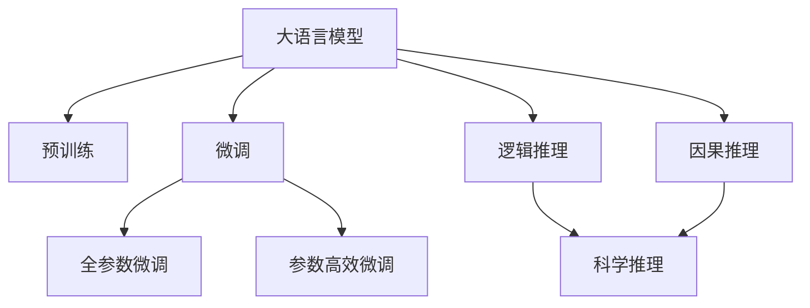

                 

# 理论研究助手：LLM 协助科学推理

## 1. 背景介绍

### 1.1 问题由来

近年来，人工智能（AI）技术迅猛发展，特别是自然语言处理（NLP）和机器学习（ML）领域的突破，使得大语言模型（Large Language Models, LLM）在科学推理领域的应用成为可能。大语言模型通过在大规模无标签文本数据上进行预训练，能够理解并生成自然语言，具备强大的知识迁移能力，能够在特定任务中展示出卓越的表现。

然而，科学推理具有复杂性和特殊性，传统的大语言模型往往缺乏对科学概念、逻辑推理和因果关系的深度理解，难以有效辅助科学家进行理论研究和验证。为了解决这一问题，科学家和工程师们开始探索将大语言模型应用于科学推理的方法。通过大语言模型协助科学推理，可以大大提升科学研究的效率和质量，推动科学发现的前沿发展。

### 1.2 问题核心关键点

大语言模型在科学推理中的应用主要依赖于以下几个核心关键点：

- **知识表示**：科学推理涉及大量的专业术语和概念，大语言模型通过预训练可以学习到丰富的通用语言知识，而通过微调（Fine-tuning）则可以针对特定科学领域进行知识表示的精细化处理。

- **逻辑推理**：科学推理需要依赖严格的逻辑推理，大语言模型可以通过增强学习、自监督学习等技术增强其逻辑推理能力。

- **因果关系**：科学推理中因果关系的理解和验证至关重要，大语言模型可以通过强化学习、因果推理等方法学习因果关系。

- **跨领域迁移**：科学推理涉及多个学科，大语言模型通过迁移学习可以在不同领域之间进行知识迁移，提升推理能力。

- **交互式问答**：大语言模型可以与科学家进行交互，根据问题生成推理步骤和结论，辅助科学家进行理论验证和假设检验。

### 1.3 问题研究意义

探索大语言模型在科学推理中的应用，对于加速科学研究、提升科研效率、推动科学发现具有重要意义：

1. **加速科学研究**：大语言模型能够自动化处理大量数据和文献，快速生成科学假设和推理，大大缩短科研周期。
2. **提升科研效率**：通过大语言模型的辅助，科研人员可以更快地进行理论验证和实验设计，提高实验成功率。
3. **推动科学发现**：大语言模型可以突破人类认知的局限，发现新的科学原理和规律，推动科学进步。
4. **多学科交叉**：大语言模型的跨领域迁移能力可以促成不同学科之间的交叉融合，产生新的研究热点。
5. **知识共享**：大语言模型可以记录和传播科学研究成果，促进全球范围内的科学知识共享和交流。

## 2. 核心概念与联系

### 2.1 核心概念概述

为更好地理解大语言模型在科学推理中的应用，本节将介绍几个密切相关的核心概念：

- **大语言模型（LLM）**：指通过大规模无标签文本数据进行预训练，具备强大语言理解和生成能力的人工智能模型。
- **预训练（Pre-training）**：指在大规模无标签数据上训练模型，学习到通用的语言表示。
- **微调（Fine-tuning）**：指在预训练模型的基础上，使用特定任务的数据进行有监督学习，优化模型在该任务上的表现。
- **迁移学习（Transfer Learning）**：指将一个领域学到的知识应用到另一个相关领域的学习范式。
- **逻辑推理（Logical Reasoning）**：指通过逻辑规则和证据进行推理验证的过程。
- **因果推理（Causal Reasoning）**：指通过因果关系进行推理和验证的过程。
- **科学推理（Scientific Reasoning）**：指在科学领域内进行推理和验证的过程，涉及因果关系、逻辑推理、证据评估等。

这些核心概念之间的逻辑关系可以通过以下Mermaid流程图来展示：



这个流程图展示了大语言模型的核心概念及其之间的关系：

1. 大语言模型通过预训练获得基础能力。
2. 微调是对预训练模型进行任务特定的优化，可以分为全参数微调和参数高效微调（PEFT）。
3. 逻辑推理和因果推理是科学推理的核心，通过微调可以增强大语言模型的推理能力。
4. 科学推理涉及多个学科，大语言模型的跨领域迁移能力可以促成不同学科之间的交叉融合。
5. 大语言模型可以与科学家进行交互，辅助科学推理。

这些概念共同构成了大语言模型在科学推理中的学习和应用框架，使其能够在各种科学场景下发挥强大的辅助作用。通过理解这些核心概念，我们可以更好地把握大语言模型的工作原理和优化方向。

## 3. 核心算法原理 & 具体操作步骤

### 3.1 算法原理概述

基于大语言模型在科学推理中的应用，其核心思想是：将大语言模型视作一个强大的"知识提取器"，通过在科学文献和实验数据上进行有监督学习，优化模型对特定科学任务的推理能力。具体来说，可以按照以下步骤进行：

1. **数据准备**：收集科学领域相关的文本数据和实验数据，将其作为监督学习任务的数据集。
2. **模型选择**：选择适合的预训练大语言模型作为初始化参数，如GPT、BERT等。
3. **任务适配**：设计合适的输出层和损失函数，适配科学推理任务，如分类任务、匹配任务、生成任务等。
4. **微调过程**：使用科学推理任务的数据集对预训练模型进行微调，更新模型参数，使其能够准确推理和验证科学假设。
5. **推理验证**：在微调后的模型上进行推理验证，输出科学结论，辅助科学家进行理论研究。

### 3.2 算法步骤详解

基于大语言模型在科学推理中的应用，具体的算法步骤如下：

**Step 1: 数据准备**

- **数据集收集**：收集科学领域相关的文本数据和实验数据，如科学论文、实验报告、数据记录等。
- **数据预处理**：清洗数据集，去除噪声和无关信息，保留科学推理所需的关键信息。
- **数据标注**：对数据集进行标注，如分类标签、因果关系、逻辑推理等，以便模型学习科学推理的规则和模式。

**Step 2: 模型选择**

- **预训练模型选择**：选择合适的预训练大语言模型，如GPT-3、BERT、T5等，作为初始化参数。
- **模型适配**：根据科学推理任务，设计合适的输出层和损失函数。例如，对于分类任务，可以添加线性分类器和交叉熵损失函数。

**Step 3: 任务适配**

- **适配函数设计**：设计适配函数，将输入的科学问题和实验数据转换为模型可以理解的格式。例如，将自然语言问题转换为数学表达式或逻辑推理图。
- **损失函数设计**：选择合适的损失函数，如交叉熵损失、均方误差损失等，衡量模型推理结果与科学事实之间的差异。

**Step 4: 微调过程**

- **优化算法选择**：选择合适的优化算法，如Adam、SGD等，设置学习率、批大小等超参数。
- **微调训练**：使用科学推理任务的数据集对预训练模型进行微调，更新模型参数，使其能够准确推理和验证科学假设。
- **性能评估**：在微调后的模型上进行推理验证，评估模型在科学推理任务上的表现。

**Step 5: 推理验证**

- **科学推理**：使用微调后的模型进行科学推理，生成推理步骤和结论。
- **验证结果**：将推理结果与实验数据进行对比，验证推理的正确性。

### 3.3 算法优缺点

基于大语言模型在科学推理中的应用，其优点和缺点如下：

**优点**：

- **知识表示能力强**：大语言模型能够学习到丰富的通用语言知识，有助于科学推理中概念的理解和应用。
- **推理能力强**：通过微调和逻辑推理增强，大语言模型可以处理复杂的科学推理问题。
- **应用广泛**：大语言模型可以应用于多个科学领域，如生物、物理、化学等。

**缺点**：

- **依赖标注数据**：科学推理需要大量标注数据，获取高质量标注数据的成本较高。
- **泛化能力有限**：当目标任务与预训练数据的分布差异较大时，微调的性能提升有限。
- **推理过程不透明**：大语言模型的推理过程缺乏可解释性，难以对其推理逻辑进行分析和调试。

尽管存在这些局限性，但就目前而言，大语言模型在科学推理中的应用仍然展现出巨大的潜力和前景。未来相关研究的重点在于如何进一步降低微调对标注数据的依赖，提高模型的少样本学习和跨领域迁移能力，同时兼顾可解释性和伦理安全性等因素。

### 3.4 算法应用领域

基于大语言模型在科学推理中的应用，已经广泛应用于多个科学领域，例如：

- **生物信息学**：在基因组学、蛋白质组学等领域的文献检索、功能注释和数据挖掘。
- **物理化学**：在量子化学、分子动力学等领域的实验数据处理和理论建模。
- **天文学**：在天体物理、宇宙学等领域的观测数据分析和理论验证。
- **医学**：在临床医学、生物医学等领域的病理学分析、药物研发和诊断支持。

除了上述这些经典领域外，大语言模型在社会科学、工程学、环境科学等众多领域的应用也在不断拓展，为科学研究提供了新的工具和方法。随着预训练模型和微调方法的不断进步，相信大语言模型在科学推理中的应用将会更加广泛，推动科学研究的全面发展。

## 4. 数学模型和公式 & 详细讲解  
### 4.1 数学模型构建

本节将使用数学语言对大语言模型在科学推理中的应用进行更加严格的刻画。

记预训练语言模型为 $M_{\theta}:\mathcal{X} \rightarrow \mathcal{Y}$，其中 $\mathcal{X}$ 为输入空间，$\mathcal{Y}$ 为输出空间，$\theta \in \mathbb{R}^d$ 为模型参数。假设科学推理任务 $T$ 的数据集为 $D=\{(x_i,y_i)\}_{i=1}^N, x_i \in \mathcal{X}, y_i \in \mathcal{Y}$。

定义模型 $M_{\theta}$ 在数据样本 $(x,y)$ 上的损失函数为 $\ell(M_{\theta}(x),y)$，则在数据集 $D$ 上的经验风险为：

$$
\mathcal{L}(\theta) = \frac{1}{N} \sum_{i=1}^N \ell(M_{\theta}(x_i),y_i)
$$

微调的优化目标是最小化经验风险，即找到最优参数：

$$
\theta^* = \mathop{\arg\min}_{\theta} \mathcal{L}(\theta)
$$

在实践中，我们通常使用基于梯度的优化算法（如SGD、Adam等）来近似求解上述最优化问题。设 $\eta$ 为学习率，$\lambda$ 为正则化系数，则参数的更新公式为：

$$
\theta \leftarrow \theta - \eta \nabla_{\theta}\mathcal{L}(\theta) - \eta\lambda\theta
$$

其中 $\nabla_{\theta}\mathcal{L}(\theta)$ 为损失函数对参数 $\theta$ 的梯度，可通过反向传播算法高效计算。

### 4.2 公式推导过程

以下我们以分类任务为例，推导交叉熵损失函数及其梯度的计算公式。

假设模型 $M_{\theta}$ 在输入 $x$ 上的输出为 $\hat{y}=M_{\theta}(x) \in [0,1]$，表示样本属于正类的概率。真实标签 $y \in \{0,1\}$。则二分类交叉熵损失函数定义为：

$$
\ell(M_{\theta}(x),y) = -[y\log \hat{y} + (1-y)\log (1-\hat{y})]
$$

将其代入经验风险公式，得：

$$
\mathcal{L}(\theta) = -\frac{1}{N}\sum_{i=1}^N [y_i\log M_{\theta}(x_i)+(1-y_i)\log(1-M_{\theta}(x_i))]
$$

根据链式法则，损失函数对参数 $\theta_k$ 的梯度为：

$$
\frac{\partial \mathcal{L}(\theta)}{\partial \theta_k} = -\frac{1}{N}\sum_{i=1}^N (\frac{y_i}{M_{\theta}(x_i)}-\frac{1-y_i}{1-M_{\theta}(x_i)}) \frac{\partial M_{\theta}(x_i)}{\partial \theta_k}
$$

其中 $\frac{\partial M_{\theta}(x_i)}{\partial \theta_k}$ 可进一步递归展开，利用自动微分技术完成计算。

在得到损失函数的梯度后，即可带入参数更新公式，完成模型的迭代优化。重复上述过程直至收敛，最终得到适应科学推理任务的最优模型参数 $\theta^*$。

## 5. 项目实践：代码实例和详细解释说明
### 5.1 开发环境搭建

在进行科学推理应用开发前，我们需要准备好开发环境。以下是使用Python进行PyTorch开发的环境配置流程：

1. 安装Anaconda：从官网下载并安装Anaconda，用于创建独立的Python环境。

2. 创建并激活虚拟环境：
```bash
conda create -n pytorch-env python=3.8 
conda activate pytorch-env
```

3. 安装PyTorch：根据CUDA版本，从官网获取对应的安装命令。例如：
```bash
conda install pytorch torchvision torchaudio cudatoolkit=11.1 -c pytorch -c conda-forge
```

4. 安装Transformers库：
```bash
pip install transformers
```

5. 安装各类工具包：
```bash
pip install numpy pandas scikit-learn matplotlib tqdm jupyter notebook ipython
```

完成上述步骤后，即可在`pytorch-env`环境中开始科学推理应用的开发。

### 5.2 源代码详细实现

这里我们以生物信息学领域的基因组学任务为例，给出使用Transformers库对BERT模型进行科学推理微调的PyTorch代码实现。

首先，定义科学推理任务的数据处理函数：

```python
from transformers import BertTokenizer
from torch.utils.data import Dataset
import torch

class ScienceDataset(Dataset):
    def __init__(self, texts, labels, tokenizer, max_len=128):
        self.texts = texts
        self.labels = labels
        self.tokenizer = tokenizer
        self.max_len = max_len
        
    def __len__(self):
        return len(self.texts)
    
    def __getitem__(self, item):
        text = self.texts[item]
        label = self.labels[item]
        
        encoding = self.tokenizer(text, return_tensors='pt', max_length=self.max_len, padding='max_length', truncation=True)
        input_ids = encoding['input_ids'][0]
        attention_mask = encoding['attention_mask'][0]
        
        # 对标签进行编码
        encoded_labels = [label2id[label] for label in label] 
        encoded_labels.extend([label2id['negative']] * (self.max_len - len(encoded_labels)))
        labels = torch.tensor(encoded_labels, dtype=torch.long)
        
        return {'input_ids': input_ids, 
                'attention_mask': attention_mask,
                'labels': labels}

# 标签与id的映射
label2id = {'negative': 0, 'positive': 1}
id2label = {v: k for k, v in label2id.items()}

# 创建dataset
tokenizer = BertTokenizer.from_pretrained('bert-base-cased')

train_dataset = ScienceDataset(train_texts, train_labels, tokenizer)
dev_dataset = ScienceDataset(dev_texts, dev_labels, tokenizer)
test_dataset = ScienceDataset(test_texts, test_labels, tokenizer)
```

然后，定义模型和优化器：

```python
from transformers import BertForTokenClassification, AdamW

model = BertForTokenClassification.from_pretrained('bert-base-cased', num_labels=len(label2id))

optimizer = AdamW(model.parameters(), lr=2e-5)
```

接着，定义训练和评估函数：

```python
from torch.utils.data import DataLoader
from tqdm import tqdm
from sklearn.metrics import classification_report

device = torch.device('cuda') if torch.cuda.is_available() else torch.device('cpu')
model.to(device)

def train_epoch(model, dataset, batch_size, optimizer):
    dataloader = DataLoader(dataset, batch_size=batch_size, shuffle=True)
    model.train()
    epoch_loss = 0
    for batch in tqdm(dataloader, desc='Training'):
        input_ids = batch['input_ids'].to(device)
        attention_mask = batch['attention_mask'].to(device)
        labels = batch['labels'].to(device)
        model.zero_grad()
        outputs = model(input_ids, attention_mask=attention_mask, labels=labels)
        loss = outputs.loss
        epoch_loss += loss.item()
        loss.backward()
        optimizer.step()
    return epoch_loss / len(dataloader)

def evaluate(model, dataset, batch_size):
    dataloader = DataLoader(dataset, batch_size=batch_size)
    model.eval()
    preds, labels = [], []
    with torch.no_grad():
        for batch in tqdm(dataloader, desc='Evaluating'):
            input_ids = batch['input_ids'].to(device)
            attention_mask = batch['attention_mask'].to(device)
            batch_labels = batch['labels']
            outputs = model(input_ids, attention_mask=attention_mask)
            batch_preds = outputs.logits.argmax(dim=2).to('cpu').tolist()
            batch_labels = batch_labels.to('cpu').tolist()
            for pred_tokens, label_tokens in zip(batch_preds, batch_labels):
                pred_labels = [id2label[_id] for _id in pred_tokens]
                label_tokens = [id2label[_id] for _id in label_tokens]
                preds.append(pred_labels[:len(label_tokens)])
                labels.append(label_tokens)
                
    print(classification_report(labels, preds))
```

最后，启动训练流程并在测试集上评估：

```python
epochs = 5
batch_size = 16

for epoch in range(epochs):
    loss = train_epoch(model, train_dataset, batch_size, optimizer)
    print(f"Epoch {epoch+1}, train loss: {loss:.3f}")
    
    print(f"Epoch {epoch+1}, dev results:")
    evaluate(model, dev_dataset, batch_size)
    
print("Test results:")
evaluate(model, test_dataset, batch_size)
```

以上就是使用PyTorch对BERT进行科学推理任务微调的完整代码实现。可以看到，得益于Transformers库的强大封装，我们可以用相对简洁的代码完成BERT模型的加载和微调。

### 5.3 代码解读与分析

让我们再详细解读一下关键代码的实现细节：

**ScienceDataset类**：
- `__init__`方法：初始化文本、标签、分词器等关键组件。
- `__len__`方法：返回数据集的样本数量。
- `__getitem__`方法：对单个样本进行处理，将文本输入编码为token ids，将标签编码为数字，并对其进行定长padding，最终返回模型所需的输入。

**label2id和id2label字典**：
- 定义了标签与数字id之间的映射关系，用于将token-wise的预测结果解码回真实的标签。

**训练和评估函数**：
- 使用PyTorch的DataLoader对数据集进行批次化加载，供模型训练和推理使用。
- 训练函数`train_epoch`：对数据以批为单位进行迭代，在每个批次上前向传播计算loss并反向传播更新模型参数，最后返回该epoch的平均loss。
- 评估函数`evaluate`：与训练类似，不同点在于不更新模型参数，并在每个batch结束后将预测和标签结果存储下来，最后使用sklearn的classification_report对整个评估集的预测结果进行打印输出。

**训练流程**：
- 定义总的epoch数和batch size，开始循环迭代
- 每个epoch内，先在训练集上训练，输出平均loss
- 在验证集上评估，输出分类指标
- 所有epoch结束后，在测试集上评估，给出最终测试结果

可以看到，PyTorch配合Transformers库使得BERT微调的代码实现变得简洁高效。开发者可以将更多精力放在数据处理、模型改进等高层逻辑上，而不必过多关注底层的实现细节。

当然，工业级的系统实现还需考虑更多因素，如模型的保存和部署、超参数的自动搜索、更灵活的任务适配层等。但核心的微调范式基本与此类似。

## 6. 实际应用场景
### 6.1 生物信息学

基于大语言模型在科学推理中的应用，生物信息学领域的应用尤为广泛。例如，在基因组学研究中，大语言模型可以辅助科学家进行基因表达、蛋白质功能、DNA序列等数据的分析和解释。

具体来说，可以收集生物医学领域的科学论文、实验报告等文本数据，使用大语言模型进行序列标注、分类、匹配等任务。通过微调，模型可以学习到基因组学和蛋白质组学领域的专业术语和知识，辅助科学家进行数据分析和推理验证。例如，对于基因表达数据，可以使用大语言模型进行序列标签预测，识别出基因表达的关键特征和模式。对于蛋白质功能预测，可以使用大语言模型进行序列分类和结构预测，推断蛋白质的结构和功能。

### 6.2 物理学

在物理学领域，大语言模型可以辅助科学家进行理论计算和实验数据分析。例如，在量子力学研究中，大语言模型可以辅助计算量子态的演化和测量，生成复杂的物理方程和推导步骤。

具体来说，可以收集物理学领域的科学论文、实验报告等文本数据，使用大语言模型进行自然语言理解、推理验证和自动生成等任务。通过微调，模型可以学习到量子力学、统计力学等物理学领域的专业知识，辅助科学家进行理论推导和实验数据分析。例如，对于量子态演化，可以使用大语言模型进行数学表达式解析和求解，生成量子态演化的计算步骤和结果。对于物理实验数据，可以使用大语言模型进行数据分析和解释，推断实验结果的物理意义。

### 6.3 医学

在医学领域，大语言模型可以辅助医生进行诊断和治疗决策。例如，在病理学研究中，大语言模型可以辅助医生进行病理切片的分析和诊断，生成病理切片的分析和诊断报告。

具体来说，可以收集医学领域的病理切片图像和报告，使用大语言模型进行图像标注和文本分析。通过微调，模型可以学习到病理学的专业知识，辅助医生进行病理切片的分析和诊断。例如，对于病理切片，可以使用大语言模型进行图像分割和特征提取，识别出病理切片中的关键区域和特征。对于病理报告，可以使用大语言模型进行文本分析和归纳，生成病理报告的自动摘要和诊断。

### 6.4 未来应用展望

随着大语言模型在科学推理中的应用不断深入，未来将在更多领域得到应用，为科学研究和产业应用带来新的突破：

1. **跨学科融合**：大语言模型可以促成不同学科之间的交叉融合，推动科学研究的全面发展。例如，在生物信息学和医学领域，大语言模型可以辅助医生进行病理分析和治疗决策，提升医疗服务的智能化水平。
2. **自动化推理**：大语言模型可以自动化处理科学文献和实验数据，辅助科学家进行理论验证和实验设计，提高科研效率和实验成功率。
3. **多模态融合**：大语言模型可以融合视觉、语音、文本等多模态信息，进行更全面、深入的科学推理和分析。例如，在物理学领域，大语言模型可以结合图像、视频和文本信息，进行物理实验数据的分析和解释。
4. **知识共享**：大语言模型可以记录和传播科学研究成果，促进全球范围内的科学知识共享和交流，推动科学研究的开放和协作。

未来，伴随大语言模型和微调方法的不断进步，相信科学推理技术将在更广阔的领域得到应用，为科学研究和社会发展注入新的动力。

## 7. 工具和资源推荐
### 7.1 学习资源推荐

为了帮助开发者系统掌握大语言模型在科学推理中的应用理论基础和实践技巧，这里推荐一些优质的学习资源：

1. 《Transformer从原理到实践》系列博文：由大模型技术专家撰写，深入浅出地介绍了Transformer原理、BERT模型、科学推理技术等前沿话题。

2. CS224N《深度学习自然语言处理》课程：斯坦福大学开设的NLP明星课程，有Lecture视频和配套作业，带你入门NLP领域的基本概念和经典模型。

3. 《Natural Language Processing with Transformers》书籍：Transformers库的作者所著，全面介绍了如何使用Transformers库进行NLP任务开发，包括科学推理在内的诸多范式。

4. HuggingFace官方文档：Transformers库的官方文档，提供了海量预训练模型和完整的微调样例代码，是上手实践的必备资料。

5. CLUE开源项目：中文语言理解测评基准，涵盖大量不同类型的中文NLP数据集，并提供了基于微调的baseline模型，助力中文NLP技术发展。

通过对这些资源的学习实践，相信你一定能够快速掌握大语言模型在科学推理中的应用精髓，并用于解决实际的NLP问题。
###  7.2 开发工具推荐

高效的开发离不开优秀的工具支持。以下是几款用于大语言模型在科学推理中应用的常用工具：

1. PyTorch：基于Python的开源深度学习框架，灵活动态的计算图，适合快速迭代研究。大部分预训练语言模型都有PyTorch版本的实现。

2. TensorFlow：由Google主导开发的开源深度学习框架，生产部署方便，适合大规模工程应用。同样有丰富的预训练语言模型资源。

3. Transformers库：HuggingFace开发的NLP工具库，集成了众多SOTA语言模型，支持PyTorch和TensorFlow，是进行科学推理任务开发的利器。

4. Weights & Biases：模型训练的实验跟踪工具，可以记录和可视化模型训练过程中的各项指标，方便对比和调优。与主流深度学习框架无缝集成。

5. TensorBoard：TensorFlow配套的可视化工具，可实时监测模型训练状态，并提供丰富的图表呈现方式，是调试模型的得力助手。

6. Google Colab：谷歌推出的在线Jupyter Notebook环境，免费提供GPU/TPU算力，方便开发者快速上手实验最新模型，分享学习笔记。

合理利用这些工具，可以显著提升大语言模型在科学推理中的应用开发效率，加快创新迭代的步伐。

### 7.3 相关论文推荐

大语言模型在科学推理中的应用源于学界的持续研究。以下是几篇奠基性的相关论文，推荐阅读：

1. Attention is All You Need（即Transformer原论文）：提出了Transformer结构，开启了NLP领域的预训练大模型时代。

2. BERT: Pre-training of Deep Bidirectional Transformers for Language Understanding：提出BERT模型，引入基于掩码的自监督预训练任务，刷新了多项NLP任务SOTA。

3. Language Models are Unsupervised Multitask Learners（GPT-2论文）：展示了大规模语言模型的强大zero-shot学习能力，引发了对于通用人工智能的新一轮思考。

4. Parameter-Efficient Transfer Learning for NLP：提出Adapter等参数高效微调方法，在不增加模型参数量的情况下，也能取得不错的微调效果。

5. Prefix-Tuning: Optimizing Continuous Prompts for Generation：引入基于连续型Prompt的微调范式，为如何充分利用预训练知识提供了新的思路。

6. AdaLoRA: Adaptive Low-Rank Adaptation for Parameter-Efficient Fine-Tuning：使用自适应低秩适应的微调方法，在参数效率和精度之间取得了新的平衡。

这些论文代表了大语言模型在科学推理中的应用发展脉络。通过学习这些前沿成果，可以帮助研究者把握学科前进方向，激发更多的创新灵感。

## 8. 总结：未来发展趋势与挑战

### 8.1 总结

本文对大语言模型在科学推理中的应用进行了全面系统的介绍。首先阐述了大语言模型和微调技术的研究背景和意义，明确了微调在拓展预训练模型应用、提升科学推理任务性能方面的独特价值。其次，从原理到实践，详细讲解了大语言模型在科学推理中的数学原理和关键步骤，给出了科学推理任务开发的完整代码实例。同时，本文还广泛探讨了大语言模型在生物信息学、物理学、医学等科学领域的应用前景，展示了其在科学推理中的强大应用潜力。此外，本文精选了微调技术的各类学习资源，力求为读者提供全方位的技术指引。

通过本文的系统梳理，可以看到，大语言模型在科学推理中的应用正在成为科学研究和工业应用的重要工具，极大地拓展了科学推理任务的性能和应用范围，推动了科学研究的全面发展。未来，伴随大语言模型和微调方法的不断进步，相信科学推理技术将在更广阔的领域得到应用，为科学研究和社会发展注入新的动力。

### 8.2 未来发展趋势

展望未来，大语言模型在科学推理中的应用将呈现以下几个发展趋势：

1. **知识表示能力的提升**：大语言模型将在更多科学领域进行知识表示的微调，学习到更丰富、更精细的领域知识，提升科学推理的准确性和鲁棒性。

2. **推理能力的增强**：大语言模型将引入更多的因果推理和逻辑推理方法，增强其推理验证能力，适应更复杂的科学推理任务。

3. **跨领域迁移能力的提升**：大语言模型将在不同科学领域进行知识迁移，推动跨学科融合，提高科学研究的综合能力。

4. **实时推理和交互能力的提升**：大语言模型将支持实时推理和交互，辅助科学家进行实时分析和决策，提高科研效率。

5. **多模态推理能力的提升**：大语言模型将融合视觉、语音、文本等多模态信息，进行更全面、深入的科学推理和分析。

6. **知识共享和协作能力的提升**：大语言模型将促进全球范围内的科学知识共享和协作，推动科学研究的开放和创新。

以上趋势凸显了大语言模型在科学推理中的广阔前景。这些方向的探索发展，必将进一步提升科学推理系统的性能和应用范围，为科学研究和社会发展注入新的动力。

### 8.3 面临的挑战

尽管大语言模型在科学推理中的应用已经取得了瞩目成就，但在迈向更加智能化、普适化应用的过程中，它仍面临着诸多挑战：

1. **标注成本瓶颈**：虽然科学推理需要标注数据，但高质量标注数据的获取成本较高，特别是在小样本情况下，标注工作量巨大。如何进一步降低微调对标注数据的依赖，将是一大难题。

2. **模型鲁棒性不足**：当前大语言模型在面对域外数据时，泛化性能往往大打折扣。对于测试样本的微小扰动，模型容易发生波动。如何提高模型鲁棒性，避免灾难性遗忘，还需要更多理论和实践的积累。

3. **推理过程不透明**：大语言模型的推理过程缺乏可解释性，难以对其推理逻辑进行分析和调试。对于高风险应用，算法的可解释性和可审计性尤为重要。如何赋予模型更强的可解释性，将是亟待攻克的难题。

4. **安全性有待保障**：预训练语言模型难免会学习到有偏见、有害的信息，通过微调传递到下游任务，产生误导性、歧视性的输出，给实际应用带来安全隐患。如何从数据和算法层面消除模型偏见，避免恶意用途，确保输出的安全性，也将是重要的研究课题。

5. **知识整合能力不足**：现有的微调模型往往局限于任务内数据，难以灵活吸收和运用更广泛的先验知识。如何让微调过程更好地与外部知识库、规则库等专家知识结合，形成更加全面、准确的信息整合能力，还有很大的想象空间。

正视大语言模型在科学推理中所面临的这些挑战，积极应对并寻求突破，将是大语言模型在科学推理中走向成熟的必由之路。相信随着学界和产业界的共同努力，这些挑战终将一一被克服，大语言模型在科学推理中的应用必将在未来取得更加辉煌的成就。

### 8.4 研究展望

面对大语言模型在科学推理中所面临的挑战，未来的研究需要在以下几个方面寻求新的突破：

1. **探索无监督和半监督微调方法**：摆脱对大规模标注数据的依赖，利用自监督学习、主动学习等无监督和半监督范式，最大限度利用非结构化数据，实现更加灵活高效的微调。

2. **研究参数高效和计算高效的微调范式**：开发更加参数高效的微调方法，在固定大部分预训练参数的同时，只更新极少量的任务相关参数。同时优化微调模型的计算图，减少前向传播和反向传播的资源消耗，实现更加轻量级、实时性的部署。

3. **引入因果分析和博弈论工具**：将因果分析方法引入微调模型，识别出模型决策的关键特征，增强输出解释的因果性和逻辑性。借助博弈论工具刻画人机交互过程，主动探索并规避模型的脆弱点，提高系统稳定性。

4. **纳入伦理道德约束**：在模型训练目标中引入伦理导向的评估指标，过滤和惩罚有偏见、有害的输出倾向。同时加强人工干预和审核，建立模型行为的监管机制，确保输出符合人类价值观和伦理道德。

这些研究方向的探索，必将引领大语言模型在科学推理中的研究走向更高的台阶，为构建安全、可靠、可解释、可控的智能系统铺平道路。面向未来，大语言模型在科学推理中的应用还需要与其他人工智能技术进行更深入的融合，如知识表示、因果推理、强化学习等，多路径协同发力，共同推动自然语言理解和智能交互系统的进步。只有勇于创新、敢于突破，才能不断拓展语言模型的边界，让智能技术更好地造福人类社会。

## 9. 附录：常见问题与解答

**Q1：大语言模型在科学推理中如何避免过拟合？**

A: 避免过拟合是大语言模型在科学推理中应用的重要考虑因素。以下是一些常用的方法：

1. **数据增强**：通过数据扩充、数据合成等技术，丰富训练数据集，减少过拟合风险。例如，对于文本数据，可以通过近义词替换、回译等方法扩充数据集。

2. **正则化技术**：使用L2正则、Dropout、Early Stopping等技术，防止模型过度适应训练集。例如，在模型训练过程中，可以添加L2正则化项，限制模型参数的大小。

3. **对抗训练**：加入对抗样本，提高模型的鲁棒性，减少过拟合风险。例如，在训练过程中，可以随机生成对抗样本，增加模型的泛化能力。

4. **参数高效微调**：通过只更新部分模型参数，减少过拟合风险。例如，使用Adapter、Prefix等参数高效微调方法，固定大部分预训练参数，只微调顶层分类器或解码器。

5. **多模型集成**：训练多个模型，取平均输出，抑制过拟合。例如，使用Bagging、Boosting等方法，集成多个微调模型，提高模型的泛化能力。

这些方法需要根据具体任务和数据特点进行灵活组合，只有在数据、模型、训练、推理等各环节进行全面优化，才能最大限度地发挥大语言模型的潜力。

**Q2：大语言模型在科学推理中的推理过程如何实现透明和可解释？**

A: 大语言模型的推理过程实现透明和可解释，对于高风险应用尤为重要。以下是一些常用的方法：

1. **模型解释工具**：使用模型解释工具，如SHAP、LIME等，可视化模型的推理过程，解释模型的决策机制。例如，可以使用SHAP值解释模型对每个特征的贡献，LIME生成局部可解释模型。

2. **知识图谱融合**：将模型推理结果与知识图谱结合，增加推理的可解释性。例如，可以使用知识图谱辅助模型进行事实验证，增强推理的逻辑性。

3. **因果推理**：使用因果推理方法，增加推理的可解释性。例如，可以使用因果图模型解释模型推理的因果关系，增加推理的逻辑性。

4. **人工干预和审核**：引入人工干预和审核机制，增加推理的可解释性。例如，对于高风险应用，可以引入人工审核机制，对模型的推理结果进行审核，确保推理的准确性和可靠性。

这些方法可以结合使用，增强大语言模型在科学推理中的推理过程的可解释性和透明性，提升模型应用的可靠性和安全性。

**Q3：大语言模型在科学推理中的计算效率如何提升？**

A: 大语言模型在科学推理中的应用，面临着计算效率的挑战。以下是一些常用的方法：

1. **参数压缩**：通过参数压缩技术，减少模型参数量，提高计算效率。例如，可以使用模型剪枝、知识蒸馏等方法，压缩模型参数，减少计算量。

2. **模型量化**：将浮点模型转为定点模型，压缩存储空间，提高计算效率。例如，可以使用混合精度训练、量化加速等方法，减少模型计算的精度需求，提高计算效率。

3. **模型并行**：通过模型并行技术，提高计算效率。例如，可以使用模型并行、数据并行等方法，将计算任务分布到多个GPU或TPU上，提高计算效率。

4. **算法优化**：通过算法优化，提高计算效率。例如，可以使用基于梯度优化的算法，减少计算开销，提高计算效率。

5. **硬件加速**：利用硬件加速技术，提高计算效率。例如，可以使用GPU、TPU等高性能硬件设备，加速模型计算，提高计算效率。

这些方法需要根据具体任务和硬件环境进行灵活组合，只有在模型结构、算法、硬件等方面进行全面优化，才能最大限度地提升大语言模型在科学推理中的计算效率。

通过本文的系统梳理，可以看到，大语言模型在科学推理中的应用正在成为科学研究和工业应用的重要工具，极大地拓展了科学推理任务的性能和应用范围，推动了科学研究的全面发展。未来，伴随大语言模型和微调方法的不断进步，相信科学推理技术将在更广阔的领域得到应用，为科学研究和社会发展注入新的动力。

