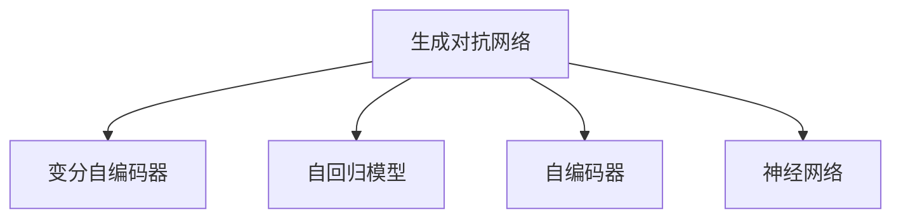

                 

# 生成式 AI：数据集的未来

## 1. 背景介绍

### 1.1 问题由来
近年来，人工智能(AI)技术在各个领域的应用越来越广泛，其中生成式 AI（Generative AI）成为了一个热门的研究方向。生成式 AI 是指利用机器学习模型生成新的、符合特定分布的数据。例如，生成式模型可以从训练数据中学习到数据分布，并用于生成新的图像、文本、音频等内容。这种技术在自动生成内容、图像生成、语音合成等领域有着广泛的应用。

生成式 AI 的核心是生成模型（Generative Model），主要包括生成对抗网络（Generative Adversarial Networks, GANs）、变分自编码器（Variational Autoencoders, VAEs）等。这些模型在实际应用中取得了显著的成效，但同时也面临着数据集不足、模型复杂度高等挑战。

### 1.2 问题核心关键点
生成式 AI 的核心问题在于如何从有限的数据中学习出高质量的生成模型，同时保持生成的数据与真实数据的高相似度。这涉及到以下几个核心关键点：
1. 数据集的质量：生成模型的训练需要大量的高质量数据，数据集不足或者数据质量不佳会导致模型泛化能力差，生成的数据质量低。
2. 生成模型的复杂度：生成模型的复杂度与训练数据量和计算资源密切相关，模型的复杂度越高，需要更多的数据和计算资源。
3. 生成模型的可解释性：生成模型通常是黑盒模型，其内部机制不透明，难以解释生成的数据。
4. 生成模型的鲁棒性：生成模型需要在各种情况下都能稳定生成高质量的数据，具有较好的鲁棒性。

### 1.3 问题研究意义
研究生成式 AI 对于提升数据集的质量、优化模型性能、推动 AI 技术的普及具有重要意义：

1. 提升数据集质量：生成式 AI 可以用于生成新的数据，扩充数据集，提高数据集的丰富性和多样性。
2. 优化模型性能：生成式 AI 可以生成高质量的训练数据，优化模型的训练过程，提升模型的泛化能力。
3. 推动 AI 技术的普及：生成式 AI 技术的应用可以降低对高质量数据的需求，使得 AI 技术更易落地应用。
4. 拓展 AI 应用场景：生成式 AI 技术可以用于图像生成、语音合成、自然语言处理等领域，拓展 AI 的应用场景。

## 2. 核心概念与联系

### 2.1 核心概念概述

为更好地理解生成式 AI 的原理与方法，本节将介绍几个关键概念：

- **生成对抗网络（GANs）**：一种生成模型，由生成器和判别器两个部分组成，通过对抗训练的方式来生成高质量的数据。
- **变分自编码器（VAEs）**：一种生成模型，通过变分推断来生成数据，能够有效地控制生成数据的分布。
- **自回归模型（Autoregressive Models）**：一种生成模型，通过自回归的方式生成数据，具有较好的可解释性和可控性。
- **自编码器（Autoencoders）**：一种生成模型，通过编码-解码的方式生成数据，能够有效地重构原始数据。
- **神经网络（Neural Networks）**：一种机器学习模型，通过多层的非线性变换生成数据，具有较强的泛化能力。

这些核心概念之间的关系可以通过以下 Mermaid 流程图来展示：



这个流程图展示了几大生成模型的关系：

1. 生成对抗网络（GANs）与变分自编码器（VAEs）：GANs 通过对抗训练生成高质量数据，VAEs 通过变分推断生成数据。
2. 自回归模型（Autoregressive Models）与自编码器（Autoencoders）：自回归模型通过自回归的方式生成数据，自编码器通过编码-解码的方式生成数据。
3. 神经网络（Neural Networks）与上述生成模型：神经网络是生成模型的基础，通过多层非线性变换生成数据。

这些概念共同构成了生成式 AI 的基本框架，使其能够生成高质量的数据。

## 3. 核心算法原理 & 具体操作步骤
### 3.1 算法原理概述

生成式 AI 的原理是通过学习数据的分布，从而生成新的、符合该分布的数据。生成模型的训练通常分为两个部分：生成器和判别器。生成器负责生成数据，判别器负责评估生成数据的真实性。通过对抗训练，生成器不断优化，使得生成的数据与真实数据更加接近。

形式化地，假设生成模型为 $G(z;\theta)$，其中 $z$ 为随机噪声，$\theta$ 为模型参数。给定训练数据集 $D=\{(x_i,y_i)\}_{i=1}^N$，生成模型的训练目标是最小化生成数据与真实数据的差异：

$$
\mathcal{L}(G) = \mathbb{E}_{z}[\ell(D,G(z))] + \mathbb{E}_{x}\log D(x)
$$

其中 $\ell(D,G(z))$ 为生成数据的损失函数，$D(x)$ 为判别器的预测概率。判别器的训练目标是区分真实数据和生成数据，最大化其准确率：

$$
\mathcal{L}(D) = -\mathbb{E}_{x}[\log D(x)] - \mathbb{E}_{z}[\log (1-D(G(z)))]
$$

通过最大化判别器的损失函数和最小化生成器的损失函数，可以训练出高质量的生成模型。

### 3.2 算法步骤详解

生成式 AI 的算法步骤通常包括以下几个关键步骤：

**Step 1: 准备数据集**
- 收集高质量的数据集，确保数据集的质量和多样性。
- 将数据集分为训练集、验证集和测试集，用于模型训练、验证和测试。

**Step 2: 定义生成器和判别器**
- 选择合适的生成器和判别器模型，如 GANs、VAEs、自回归模型等。
- 设计生成器和判别器的架构和损失函数。

**Step 3: 初始化模型参数**
- 随机初始化生成器和判别器的参数。
- 选择合适的优化算法和超参数，如学习率、批大小、迭代轮数等。

**Step 4: 对抗训练**
- 交替训练生成器和判别器，生成器生成数据，判别器评估数据真实性。
- 在每个epoch内，先训练判别器，再训练生成器。
- 根据训练结果调整模型参数。

**Step 5: 评估和优化**
- 在验证集上评估模型的性能，调整模型参数。
- 在测试集上测试模型的性能，输出评估结果。

### 3.3 算法优缺点

生成式 AI 算法具有以下优点：
1. 生成高质量数据：生成式 AI 可以生成高质量的数据，扩展数据集，提升模型的泛化能力。
2. 灵活性强：生成式 AI 模型可以根据任务需求进行灵活调整，适应不同的数据分布。
3. 可解释性强：生成式 AI 模型具有较好的可解释性，便于理解生成数据的过程和结果。

同时，该算法也存在一些缺点：
1. 训练难度大：生成式 AI 模型训练难度大，需要大量的计算资源和时间。
2. 模型复杂度高：生成式 AI 模型的复杂度高，训练和推理效率较低。
3. 数据依赖性强：生成式 AI 模型对数据质量有较高要求，数据集不足会导致模型性能下降。

尽管存在这些缺点，但就目前而言，生成式 AI 仍是最为有效和广泛应用的数据生成方法之一。未来相关研究的重点在于如何进一步降低生成式 AI 的训练难度和复杂度，提升模型的性能和效率。

### 3.4 算法应用领域

生成式 AI 在以下几个领域有着广泛的应用：

- 图像生成：生成高质量的图像，应用于医学、艺术、游戏等领域。
- 语音合成：生成自然流畅的语音，应用于客服、教育、娱乐等领域。
- 自然语言处理：生成自然流畅的文本，应用于自动生成新闻、文章、对话等。
- 数据分析：生成数据集，应用于数据增强、模拟实验等领域。
- 视频生成：生成高质量的视频，应用于电影、动画、广告等领域。

除了上述这些经典应用外，生成式 AI 还被创新性地应用到更多场景中，如智能制造、虚拟现实、智能交通等，为各行各业带来了新的突破。

## 4. 数学模型和公式 & 详细讲解  
### 4.1 数学模型构建

本节将使用数学语言对生成式 AI 模型的训练过程进行更加严格的刻画。

假设生成模型为 $G(z;\theta)$，判别模型为 $D(x;\phi)$，其中 $z$ 为随机噪声，$x$ 为输入数据，$\theta$ 和 $\phi$ 为模型参数。假设训练数据集为 $D=\{(x_i,y_i)\}_{i=1}^N$，其中 $y_i$ 为标签。

生成模型的训练目标是最小化生成数据与真实数据的差异：

$$
\mathcal{L}_G = \mathbb{E}_{z}[\ell(D,G(z))]
$$

判别模型的训练目标是区分真实数据和生成数据，最大化其准确率：

$$
\mathcal{L}_D = -\mathbb{E}_{x}[\log D(x)] - \mathbb{E}_{z}[\log (1-D(G(z))))
$$

通过交替训练生成器和判别器，可以训练出高质量的生成模型。

### 4.2 公式推导过程

以下我们以 GANs 模型为例，推导生成模型和判别模型的训练公式。

在 GANs 中，生成模型 $G(z;\theta)$ 和判别模型 $D(x;\phi)$ 通过对抗训练进行优化：

- 生成器的训练公式：

$$
\mathcal{L}_G = \mathbb{E}_{z}[\log (1-D(G(z))))
$$

- 判别器的训练公式：

$$
\mathcal{L}_D = \mathbb{E}_{x}[\log D(x)] + \mathbb{E}_{z}[\log D(G(z)))
$$

在训练过程中，生成器和判别器交替更新。生成器生成数据 $G(z)$，判别器评估数据真实性 $D(G(z))$。通过交替训练，生成器和判别器相互博弈，最终达到一个平衡点。

### 4.3 案例分析与讲解

以图像生成为例，展示生成式 AI 模型的训练和应用过程。

首先，准备训练数据集，如 MNIST 手写数字数据集。将数据集分为训练集、验证集和测试集。

然后，定义生成器和判别器模型。可以选择使用卷积神经网络（CNN）作为生成器和判别器的基本架构。生成器的输入为随机噪声 $z$，输出为图像 $G(z)$；判别器的输入为图像 $x$，输出为判别结果 $D(x)$。

接着，初始化生成器和判别器的参数，选择合适的优化算法和超参数。可以使用 Adam 优化器，设置学习率为 $0.001$，批大小为 $128$。

最后，交替训练生成器和判别器。在每个 epoch 中，先训练判别器，再训练生成器。生成器生成随机噪声 $z$，将其输入生成器得到图像 $G(z)$；判别器评估图像 $G(z)$ 和真实图像 $x$ 的真实性，输出判别结果 $D(G(z))$ 和 $D(x)$。根据判别器的输出，调整生成器和判别器的参数。

在训练过程中，需要在验证集上评估生成器的性能，调整生成器的参数。在测试集上测试生成器的性能，输出生成图像的质量评估结果。

## 5. 项目实践：代码实例和详细解释说明
### 5.1 开发环境搭建

在进行生成式 AI 模型训练前，我们需要准备好开发环境。以下是使用 Python 进行 TensorFlow 开发的环境配置流程：

1. 安装 Anaconda：从官网下载并安装 Anaconda，用于创建独立的 Python 环境。

2. 创建并激活虚拟环境：
```bash
conda create -n tf-env python=3.8 
conda activate tf-env
```

3. 安装 TensorFlow：根据 CUDA 版本，从官网获取对应的安装命令。例如：
```bash
conda install tensorflow==2.8 -c conda-forge -c pytorch
```

4. 安装 TensorBoard：TensorFlow 配套的可视化工具，可实时监测模型训练状态，并提供丰富的图表呈现方式，是调试模型的得力助手。
```bash
pip install tensorboard
```

5. 安装 Numpy、Pandas、Matplotlib、Tqdm、Jupyter Notebook、IPython 等工具包：
```bash
pip install numpy pandas matplotlib tqdm jupyter notebook ipython
```

完成上述步骤后，即可在 `tf-env` 环境中开始生成式 AI 模型的训练实践。

### 5.2 源代码详细实现

下面我们以 GANs 模型为例，给出使用 TensorFlow 进行图像生成任务训练的 Python 代码实现。

首先，定义图像生成和判别模型的架构：

```python
import tensorflow as tf
from tensorflow.keras.layers import Input, Dense, Reshape, Flatten
from tensorflow.keras.models import Model
from tensorflow.keras.optimizers import Adam

def build_generator(z_dim, img_dim):
    inputs = Input(shape=(z_dim,))
    x = Dense(256 * 8 * 8)(inputs)
    x = Reshape((8, 8, 256))(x)
    x = tf.keras.layers.Conv2DTranspose(128, 4, strides=2, padding='same', activation='relu')(x)
    x = tf.keras.layers.Conv2DTranspose(64, 4, strides=2, padding='same', activation='relu')(x)
    x = tf.keras.layers.Conv2DTranspose(1, 4, padding='same', activation='sigmoid')(x)
    return Model(inputs, x)

def build_discriminator(img_dim):
    inputs = Input(shape=(img_dim, img_dim, 1))
    x = tf.keras.layers.Conv2D(64, 4, strides=2, padding='same', activation='relu')(inputs)
    x = tf.keras.layers.Conv2D(128, 4, strides=2, padding='same', activation='relu')(x)
    x = Flatten()(x)
    x = Dense(1, activation='sigmoid')(x)
    return Model(inputs, x)
```

然后，定义生成器和判别器的损失函数和优化器：

```python
z_dim = 100
img_dim = 28

generator = build_generator(z_dim, img_dim)
discriminator = build_discriminator(img_dim)

generator.compile(optimizer=Adam(learning_rate=0.0002, beta_1=0.5), loss='binary_crossentropy')
discriminator.compile(optimizer=Adam(learning_rate=0.0002, beta_1=0.5), loss='binary_crossentropy')
```

接着，定义训练和评估函数：

```python
batch_size = 128
z_dim = 100
img_dim = 28
num_epochs = 100
num_samples = 64

def generate_images(n):
    return generator.predict(np.random.normal(size=(n, z_dim)))

def train_step(real_images):
    noise = np.random.normal(size=(batch_size, z_dim))
    generated_images = generator.predict(noise)
    
    real_labels = tf.ones((batch_size, 1))
    fake_labels = tf.zeros((batch_size, 1))
    
    discriminator.trainable = False
    d_loss_real = discriminator.train_on_batch(real_images, real_labels)
    d_loss_fake = discriminator.train_on_batch(generated_images, fake_labels)
    d_loss = 0.5 * np.add(d_loss_real, d_loss_fake)
    
    generator.trainable = True
    g_loss = discriminator.train_on_batch(generated_images, real_labels)
    
    return d_loss, g_loss

def evaluate_generator():
    generated_images = generate_images(num_samples)
    plt.imshow(generated_images[0].reshape(28, 28))
    plt.show()
```

最后，启动训练流程并在测试集上评估：

```python
real_images = np.random.normal(size=(batch_size, img_dim, img_dim, 1))
for epoch in range(num_epochs):
    d_loss, g_loss = train_step(real_images)
    if epoch % 20 == 0:
        evaluate_generator()
```

以上就是使用 TensorFlow 进行 GANs 模型训练的完整代码实现。可以看到，TensorFlow 的强大封装使得生成式 AI 模型的训练代码实现变得简洁高效。

### 5.3 代码解读与分析

让我们再详细解读一下关键代码的实现细节：

**build_generator 和 build_discriminator 函数**：
- `build_generator` 函数定义了生成器的架构，包括输入层、密集层、反卷积层等。
- `build_discriminator` 函数定义了判别器的架构，包括卷积层、全连接层等。

**generator.compile 和 discriminator.compile 函数**：
- 定义生成器和判别器的优化器和损失函数。

**train_step 函数**：
- 定义训练过程，先训练判别器，再训练生成器。在训练判别器时，将生成器固定，训练生成器时，将判别器固定。

**evaluate_generator 函数**：
- 定义评估过程，生成生成器的输出，并可视化展示。

可以看到，TensorFlow 的自动微分和分布式训练功能，使得生成式 AI 模型的训练代码实现变得非常简洁。开发者可以将更多精力放在模型设计和超参数调优等高层逻辑上，而不必过多关注底层的实现细节。

当然，工业级的系统实现还需考虑更多因素，如模型的保存和部署、超参数的自动搜索、更灵活的任务适配层等。但核心的训练范式基本与此类似。

## 6. 实际应用场景
### 6.1 智能制造

生成式 AI 在智能制造领域有着广泛的应用。智能制造需要大量的高精度数据，而生成式 AI 可以生成高质量的训练数据，提升模型的泛化能力。例如，可以使用生成式 AI 生成传感器数据，用于模型训练和故障诊断。

在技术实现上，可以收集传感器历史数据，生成新的传感器数据，用于训练预测模型。将生成数据与历史数据混合，训练模型，从而提升模型的泛化能力。生成式 AI 还可以生成模拟实验数据，用于模型验证和优化。

### 6.2 虚拟现实

生成式 AI 在虚拟现实（VR）领域也有着重要的应用。VR 需要大量的高质量数据，而生成式 AI 可以生成逼真的虚拟场景，提升用户的沉浸感。

在技术实现上，可以生成高质量的虚拟场景，用于训练 VR 应用中的视觉模型。例如，可以生成虚拟城市、虚拟建筑、虚拟人物等，用于训练虚拟导航、虚拟交互等应用。

### 6.3 智能交通

生成式 AI 在智能交通领域也有着广泛的应用。智能交通需要大量的交通数据，而生成式 AI 可以生成高质量的交通数据，提升模型的泛化能力。

在技术实现上，可以生成高质量的交通数据，用于训练交通预测模型。例如，可以生成虚拟交通数据，用于训练交通流量预测、交通路线规划等应用。

### 6.4 未来应用展望

随着生成式 AI 技术的不断发展，其在更多领域将得到应用，为各行各业带来新的突破。

在医疗领域，生成式 AI 可以生成高质量的医疗数据，用于训练医疗预测模型。例如，可以生成虚拟医疗影像，用于训练医学影像诊断、医学知识图谱等应用。

在金融领域，生成式 AI 可以生成高质量的金融数据，用于训练金融预测模型。例如，可以生成虚拟交易数据，用于训练金融市场预测、金融风险评估等应用。

在教育领域，生成式 AI 可以生成高质量的教育数据，用于训练教育预测模型。例如，可以生成虚拟教学场景，用于训练自动问答、虚拟教师等应用。

此外，生成式 AI 技术还将进一步拓展到更多场景中，如智能家居、智能农业、智能城市等领域，为各行各业带来新的变革。相信随着技术的日益成熟，生成式 AI 必将在构建人机协同的智能时代中扮演越来越重要的角色。

## 7. 工具和资源推荐
### 7.1 学习资源推荐

为了帮助开发者系统掌握生成式 AI 的理论基础和实践技巧，这里推荐一些优质的学习资源：

1. 《Generative Adversarial Networks: An Overview》论文：这是一篇经典的 GANs 论文，介绍了 GANs 模型的基本原理和训练方法。
2. 《Variational Autoencoders》书籍：这是一本关于 VAEs 的经典书籍，详细介绍了 VAEs 模型的基本原理和应用。
3. 《Neural Style Transfer》论文：这是一篇关于图像生成风格的经典论文，介绍了神经网络在图像生成中的应用。
4. 《Autoregressive Models for Image Generation》论文：这是一篇关于自回归模型在图像生成中的应用论文，介绍了自回归模型的基本原理和应用。
5. 《TensorFlow Generative Adversarial Nets》官方文档：这是 TensorFlow 官方关于 GANs 的文档，提供了丰富的代码示例和教程。

通过对这些资源的学习实践，相信你一定能够快速掌握生成式 AI 的核心技术，并用于解决实际的图像生成、语音合成等问题。

### 7.2 开发工具推荐

高效的开发离不开优秀的工具支持。以下是几款用于生成式 AI 开发常用的工具：

1. TensorFlow：由 Google 主导开发的开源深度学习框架，生产部署方便，适合大规模工程应用。支持 GANs、VAEs 等多种生成模型。
2. PyTorch：由 Facebook 主导开发的开源深度学习框架，灵活高效，适合研究和小规模工程应用。支持 GANs、VAEs 等多种生成模型。
3. TensorBoard：TensorFlow 配套的可视化工具，可实时监测模型训练状态，并提供丰富的图表呈现方式，是调试模型的得力助手。
4. Jupyter Notebook：支持多种语言和库的交互式编程环境，便于快速迭代和调试。

合理利用这些工具，可以显著提升生成式 AI 模型的开发效率，加快创新迭代的步伐。

### 7.3 相关论文推荐

生成式 AI 技术的发展源于学界的持续研究。以下是几篇奠基性的相关论文，推荐阅读：

1. Generative Adversarial Nets（GANs）论文：由 Ian Goodfellow 等人于 2014 年发表，提出了 GANs 模型，奠定了生成式 AI 的基础。
2. Variational Autoencoders（VAEs）论文：由 Diederik P Kingma 和 Max Welling 于 2014 年发表，提出了 VAEs 模型，提供了变分推断的生成方法。
3. Progressive Growing of GANs for Improved Quality, Stability, and Variation：由 Tero Karras 等人于 2017 年发表，提出了 Progressive GANs，提升了 GANs 的训练稳定性。
4. Improved Techniques for Training GANs：由 Alec Radford 等人于 2015 年发表，提出了 Wasserstein GANs 和 Spectral Normalization，提升了 GANs 的训练效果。
5. An Application of Variational Autoencoders to Modeling the Mars Temperature Distribution：由 Uwe Krug 和 Wolfgang Mayr 于 2017 年发表，介绍了 VAEs 在科学计算中的应用。

这些论文代表了大生成式 AI 技术的发展脉络。通过学习这些前沿成果，可以帮助研究者把握学科前进方向，激发更多的创新灵感。

## 8. 总结：未来发展趋势与挑战

### 8.1 总结

本文对生成式 AI 的原理与方法进行了全面系统的介绍。首先阐述了生成式 AI 的核心问题及其研究背景，明确了生成式 AI 在数据集生成中的独特价值。其次，从原理到实践，详细讲解了生成式 AI 模型的训练过程和关键步骤，给出了生成式 AI 模型训练的完整代码实现。同时，本文还广泛探讨了生成式 AI 在智能制造、虚拟现实、智能交通等多个领域的应用前景，展示了生成式 AI 技术的巨大潜力。此外，本文精选了生成式 AI 技术的各类学习资源，力求为读者提供全方位的技术指引。

通过本文的系统梳理，可以看到，生成式 AI 技术正在成为数据集生成的重要手段，极大地拓展了数据集的质量和多样性。生成式 AI 在训练数据生成、数据增强、模拟实验等领域展现了强大的应用潜力，为人工智能技术的发展提供了坚实的保障。未来，伴随生成式 AI 技术的不断进步，人工智能技术必将在更多领域得到应用，为人类认知智能的进化带来深远影响。

### 8.2 未来发展趋势

展望未来，生成式 AI 技术将呈现以下几个发展趋势：

1. 生成模型复杂度提升：随着计算资源的增加，生成式 AI 模型将更加复杂，生成数据的质量和多样性将进一步提升。
2. 多模态生成：生成式 AI 将不仅仅局限于单模态数据生成，将拓展到图像、语音、视频等多模态数据的生成。
3. 生成模型的可解释性增强：生成式 AI 模型将具备更好的可解释性，能够提供生成数据的过程和结果解释。
4. 生成模型的鲁棒性提升：生成式 AI 模型将具备更强的鲁棒性，能够生成高质量的、具有鲁棒性的数据。
5. 生成式 AI 在更多领域的应用拓展：生成式 AI 技术将在更多领域得到应用，如智能制造、虚拟现实、智能交通等，推动各行各业的数字化转型。

以上趋势凸显了生成式 AI 技术的广阔前景。这些方向的探索发展，必将进一步提升生成式 AI 的性能和应用范围，为人工智能技术的发展带来新的突破。

### 8.3 面临的挑战

尽管生成式 AI 技术已经取得了瞩目成就，但在迈向更加智能化、普适化应用的过程中，它仍面临着诸多挑战：

1. 数据依赖性强：生成式 AI 模型对数据质量有较高要求，数据集不足会导致模型性能下降。
2. 训练难度大：生成式 AI 模型的训练难度大，需要大量的计算资源和时间。
3. 模型复杂度高：生成式 AI 模型的复杂度高，训练和推理效率较低。
4. 可解释性不足：生成式 AI 模型通常是黑盒模型，难以解释生成数据的过程和结果。
5. 安全性有待保障：生成式 AI 模型容易学习到有害信息，生成有害数据，带来安全隐患。

尽管存在这些挑战，但学界和产业界正在积极探索解决方案，相信随着技术的不断进步，这些挑战终将一一被克服，生成式 AI 必将在构建人机协同的智能时代中扮演越来越重要的角色。

### 8.4 研究展望

面对生成式 AI 所面临的挑战，未来的研究需要在以下几个方面寻求新的突破：

1. 降低数据依赖性：通过改进生成模型和训练方法，降低对高质量数据的需求。
2. 提升训练效率：开发更加高效的训练算法和优化方法，提升生成式 AI 的训练效率。
3. 增强模型可解释性：引入可解释性技术，如特征重要性分析、模型可视化等，增强生成式 AI 的可解释性。
4. 提升模型鲁棒性：开发鲁棒性生成模型，增强生成数据的质量和多样性。
5. 保障数据安全性：通过数据脱敏、隐私保护等技术，保障生成式 AI 的数据安全性。

这些研究方向将推动生成式 AI 技术的不断进步，为人工智能技术的发展提供新的动力。

## 9. 附录：常见问题与解答

**Q1：生成式 AI 在实际应用中会遇到哪些问题？**

A: 生成式 AI 在实际应用中可能会遇到以下问题：
1. 数据集不足：生成式 AI 模型对数据集有较高的要求，数据不足会导致模型性能下降。
2. 数据质量不高：生成式 AI 模型对数据质量有较高要求，数据质量不高会导致模型生成数据质量下降。
3. 训练时间过长：生成式 AI 模型的训练时间较长，需要大量的计算资源和时间。
4. 模型复杂度高：生成式 AI 模型的复杂度高，训练和推理效率较低。
5. 可解释性不足：生成式 AI 模型通常是黑盒模型，难以解释生成数据的过程和结果。

这些问题需要通过改进模型架构、优化训练方法、引入可解释性技术等手段进行解决。

**Q2：如何提升生成式 AI 模型的可解释性？**

A: 提升生成式 AI 模型的可解释性可以通过以下方法：
1. 特征重要性分析：通过分析生成数据的特征重要性，理解生成数据的过程和结果。
2. 模型可视化：通过可视化生成数据的过程和结果，理解生成数据的过程和机制。
3. 可解释性技术：引入可解释性技术，如 SHAP、LIME 等，增强生成式 AI 的可解释性。
4. 多模态融合：通过多模态数据的融合，提升生成式 AI 的可解释性。

这些方法可以帮助理解生成式 AI 模型的内部机制，提高生成数据的质量和可靠性。

**Q3：如何应对生成式 AI 模型的高计算需求？**

A: 应对生成式 AI 模型的高计算需求可以通过以下方法：
1. 硬件优化：使用高性能的计算设备，如 GPU、TPU 等，提升计算效率。
2. 模型压缩：通过模型压缩技术，减小模型参数量，降低计算需求。
3. 分布式训练：使用分布式训练技术，将计算任务分布到多个设备上，提升计算效率。
4. 增量训练：通过增量训练技术，利用已有模型参数进行微调，降低计算需求。

这些方法可以帮助降低生成式 AI 模型的计算需求，提升模型的训练和推理效率。

**Q4：如何避免生成式 AI 模型学习到有害信息？**

A: 避免生成式 AI 模型学习到有害信息可以通过以下方法：
1. 数据清洗：在训练数据中去除有害信息，避免模型学习到有害数据。
2. 生成式约束：在生成模型中引入生成式约束，限制模型生成有害数据。
3. 模型验证：在生成模型训练过程中，验证生成数据的合法性，避免有害数据的生成。
4. 隐私保护：通过数据脱敏、隐私保护等技术，保障生成数据的安全性。

这些方法可以帮助避免生成式 AI 模型学习到有害信息，保障生成数据的安全性和可靠性。

---

作者：禅与计算机程序设计艺术 / Zen and the Art of Computer Programming

