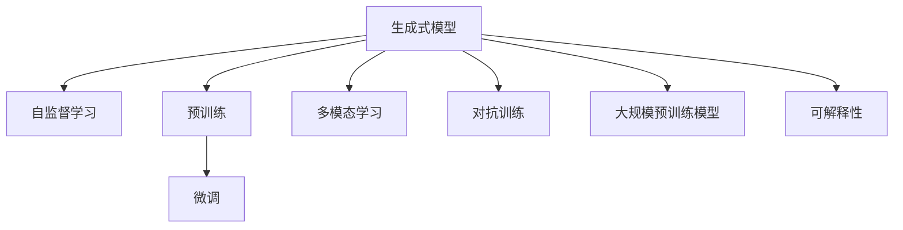

                 

# 生成式AIGC是金矿还是泡沫:AI不是万能药

## 1. 背景介绍

### 1.1 问题由来

近年来，生成式人工智能(AI)的迅猛发展引发了广泛关注。生成式模型，如GPT、GPT-3、DALL·E等，不仅在文本生成、图像生成、音乐生成等领域取得了令人瞩目的成绩，也催生了“生成式AIGC”这一概念。许多投资者和企业家将生成式AI视为未来的“金矿”，并大举投入资金进行研究与应用。然而，在过度炒作和广泛应用中，生成式AIGC也暴露出了不少问题，带来了诸多挑战。

### 1.2 问题核心关键点

生成式AIGC的关键在于生成模型的大规模自监督预训练和微调技术，以及高效的语言和图像模型结合。然而，当前生成式模型仍面临数据、计算资源、训练时间、模型鲁棒性、安全性和伦理问题等多重挑战。本文将从多个角度深入探讨生成式AIGC的应用现状、挑战及未来发展方向。

## 2. 核心概念与联系

### 2.1 核心概念概述

为了更好地理解生成式AIGC，本节将介绍几个密切相关的核心概念：

- 生成式模型(Generative Model)：利用训练数据生成新的数据样本，如生成式对抗网络(GAN)、变分自编码器(VAE)、自回归模型(如GPT)等。
- 自监督学习(Self-Supervised Learning)：使用数据自身的特性进行模型训练，无需显式标注，适用于大规模无标签数据的预训练。
- 预训练(Pre-training)：在大规模无标签数据上，通过自监督学习任务训练生成模型的过程。
- 微调(Fine-tuning)：在预训练模型的基础上，使用有标签数据对模型进行进一步优化，使其适应特定的下游任务。
- 多模态学习(Multimodal Learning)：结合文本、图像、声音等多种信息源进行联合训练，提升模型的泛化能力和理解深度。
- 对抗训练(Adversarial Training)：使用对抗样本训练模型，提升模型的鲁棒性和泛化能力。
- 大规模预训练模型(Large Pre-trained Models)：如GPT、BERT等，利用大规模数据进行预训练，具备强大的生成和理解能力。
- 可解释性(Explainability)：确保生成式模型的决策过程透明、可理解，满足应用中的合规要求。

这些概念之间的逻辑关系可以通过以下Mermaid流程图来展示：



这个流程图展示了大规模生成式模型与相关核心概念之间的关联：

1. 生成式模型通过自监督学习和预训练获得基础能力。
2. 微调进一步优化模型，使其适应特定任务。
3. 多模态学习结合多种信息源，提升模型的泛化能力。
4. 对抗训练提升模型鲁棒性，避免过拟合。
5. 大规模预训练模型利用丰富数据，提高生成能力。
6. 可解释性确保模型透明，满足合规要求。

这些概念共同构成了生成式AIGC的学习和应用框架，使得生成式模型能够具备生成高质量数据、理解和生成自然语言、进行多模态数据处理等强大能力。通过理解这些核心概念，我们可以更好地把握生成式AIGC的工作原理和优化方向。

## 3. 核心算法原理 & 具体操作步骤

### 3.1 算法原理概述

生成式AIGC的核心算法原理涉及自监督学习、预训练和微调技术。其核心思想是：通过大规模无标签数据对生成模型进行预训练，使其学习到数据的基本特性和规律。然后，使用有标签数据对预训练模型进行微调，使其适应特定的下游任务。

以GPT-3为例，其生成过程主要分为两个步骤：

1. 自监督预训练：在大规模无标签文本数据上，通过掩码语言模型任务进行预训练。模型需要预测被掩码的词语，从而学习到文本的上下文关系和语言结构。
2. 微调：在特定任务上，如文本生成、问答、对话等，使用少量有标签数据对预训练模型进行微调，使其输出符合任务需求。

通过这两步，GPT-3能够生成自然流畅、逻辑连贯的文本，并在多个NLP任务上取得优异的性能。

### 3.2 算法步骤详解

生成式AIGC的具体实现步骤如下：

**Step 1: 准备预训练数据和标签**
- 收集大规模无标签数据集，如Web文本、维基百科等。
- 准备特定任务的标注数据集，如对话语料、问答对等。

**Step 2: 自监督预训练**
- 使用预训练语言模型(如GPT-3)在大规模无标签数据上进行预训练。
- 通过掩码语言模型任务、预测单词上下文等自监督任务训练模型，使其学习到文本的语法和语义特征。

**Step 3: 微调**
- 将预训练模型作为初始化参数，使用特定任务的标注数据集进行微调。
- 设计任务适配层，选择合适的损失函数和优化器。
- 使用适当的超参数，如学习率、批量大小等，进行梯度训练。
- 定期在验证集上评估模型性能，防止过拟合。

**Step 4: 生成与评估**
- 使用微调后的模型生成新的数据样本。
- 在测试集上评估生成样本的质量和性能指标。

通过上述步骤，生成式AIGC模型能够高效地在大规模无标签数据上进行预训练，并通过微调适应特定任务，生成高质量的数据样本。

### 3.3 算法优缺点

生成式AIGC的优点包括：

1. 高效利用大规模无标签数据进行预训练，无需标注数据，降低了数据获取成本。
2. 模型具备强大的生成和理解能力，能够在多个任务上取得优异性能。
3. 结合多模态信息源，提升模型泛化能力，应用于图像、视频、音频等多种数据类型。
4. 能够生成高质量的文本、图像等数据，满足应用中的数据需求。

然而，生成式AIGC也存在一些缺点：

1. 数据依赖性强：预训练和微调需要大量高质量数据，数据获取成本较高。
2. 计算资源需求高：生成式模型参数量大，需要高性能GPU/TPU等硬件支持。
3. 模型鲁棒性不足：生成式模型面对对抗样本和噪声数据时，容易产生不可控的输出。
4. 安全性问题：生成式模型可能生成有害内容、攻击性言论等，对社会造成负面影响。
5. 伦理和合规性问题：生成式模型可能学习并生成不合法、不当的内容，需严格遵守法律法规。

### 3.4 算法应用领域

生成式AIGC的应用范围非常广泛，包括但不限于以下几个领域：

1. **内容生成**：用于生成新闻、文章、广告文案等高质量文本内容。
2. **图像生成**：生成艺术作品、动画场景等高质量图像。
3. **音乐生成**：生成音乐作品、配乐等。
4. **对话系统**：与用户进行自然对话，用于智能客服、虚拟助手等。
5. **情感分析**：通过生成式模型生成文本样本，辅助情感分析任务的训练。
6. **多模态数据融合**：将文本、图像、音频等多种信息源结合起来，生成更具信息量的数据。

## 4. 数学模型和公式 & 详细讲解 & 举例说明

### 4.1 数学模型构建

生成式AIGC的核心模型主要包含自回归模型(如GPT)和生成对抗网络(GAN)两类。这里以自回归模型为例，介绍生成式AIGC的数学模型构建。

假设输入序列为 $X=(x_1, x_2, ..., x_T)$，其中 $x_t$ 表示第 $t$ 个单词或字符。自回归模型通过先验概率 $p(x_1|.)$ 和条件概率 $p(x_t|x_1, ..., x_{t-1})$ 生成文本序列 $X$。

模型的目标函数为：

$$
\max_{\theta} \mathcal{L}(\theta) = \sum_{t=1}^{T} \log p(x_t|x_1, ..., x_{t-1})
$$

其中 $\theta$ 为模型参数，$\mathcal{L}(\theta)$ 为损失函数，通常为交叉熵损失。

### 4.2 公式推导过程

以GPT-3为例，其生成过程可以通过自回归模型进行推导。假设 $p(x_t|x_1, ..., x_{t-1})$ 为条件概率分布，$x_t$ 的生成过程可以表示为：

$$
p(x_t|x_1, ..., x_{t-1}) = \frac{e^{\text{logit}(x_t|x_1, ..., x_{t-1})}}{\sum_{x_t'} e^{\text{logit}(x_t'|x_1, ..., x_{t-1})}}
$$

其中 $\text{logit}(x_t|x_1, ..., x_{t-1})$ 为生成 $x_t$ 的logits，可以通过神经网络模型进行计算。

在训练过程中，目标函数 $\mathcal{L}(\theta)$ 可以表示为：

$$
\mathcal{L}(\theta) = -\frac{1}{T} \sum_{t=1}^{T} \log p(x_t|x_1, ..., x_{t-1})
$$

通过反向传播算法，计算梯度并更新模型参数 $\theta$。

### 4.3 案例分析与讲解

以图像生成任务为例，生成式AIGC通常采用变分自编码器(VAE)模型进行生成。VAE的目标是学习输入数据 $x$ 和潜在变量 $z$ 的联合概率分布 $p(x, z)$。通过最大化似然函数，训练得到模型参数 $\theta$。

假设生成器网络为 $g_{\theta}$，解码器网络为 $p_{\theta}$，VAE的生成过程可以表示为：

$$
z \sim \mathcal{N}(0, I), \quad x = g_{\theta}(z)
$$

其中 $z$ 为潜在变量，$x$ 为生成数据，$\mathcal{N}(0, I)$ 表示标准正态分布。

VAE的似然函数可以表示为：

$$
p(x|z) = \mathcal{N}(g_{\theta}(z), \sigma^2)
$$

目标函数为：

$$
\min_{\theta} \mathcal{L}(\theta) = \mathcal{L}_{KL} + \mathcal{L}_{rec}
$$

其中 $\mathcal{L}_{KL}$ 为KL散度损失，$\mathcal{L}_{rec}$ 为重构误差损失。

## 5. 项目实践：代码实例和详细解释说明

### 5.1 开发环境搭建

在进行生成式AIGC项目实践前，我们需要准备好开发环境。以下是使用Python进行PyTorch开发的环境配置流程：

1. 安装Anaconda：从官网下载并安装Anaconda，用于创建独立的Python环境。

2. 创建并激活虚拟环境：
```bash
conda create -n pytorch-env python=3.8 
conda activate pytorch-env
```

3. 安装PyTorch：根据CUDA版本，从官网获取对应的安装命令。例如：
```bash
conda install pytorch torchvision torchaudio cudatoolkit=11.1 -c pytorch -c conda-forge
```

4. 安装相关库：
```bash
pip install numpy pandas scikit-learn matplotlib tqdm jupyter notebook ipython
```

5. 安装生成式模型库：
```bash
pip install torchvision torchtext transformers 
```

完成上述步骤后，即可在`pytorch-env`环境中开始生成式AIGC的实践。

### 5.2 源代码详细实现

这里我们以GPT-3为例，展示使用PyTorch进行生成式AIGC的代码实现。

首先，定义生成式AIGC的任务，这里以文本生成任务为例：

```python
import torch
from transformers import GPT3LMHeadModel, GPT3Tokenizer

# 定义生成任务
model_name = "gpt3-medium"
tokenizer = GPT3Tokenizer.from_pretrained(model_name)
device = torch.device("cuda" if torch.cuda.is_available() else "cpu")
model = GPT3LMHeadModel.from_pretrained(model_name).to(device)

# 定义输入和标签
input_text = "Thank you for using our product. Your feedback is important to us."
input_ids = tokenizer.encode(input_text, return_tensors="pt").to(device)
labels = torch.tensor(input_text)

# 生成文本
output_text = model.generate(input_ids, max_length=50, temperature=0.8)
generated_text = tokenizer.decode(output_text[0])
print(generated_text)
```

在这个示例中，我们使用GPT-3生成了一段文本。首先，使用`GPT3LMHeadModel`和`GPT3Tokenizer`加载模型和分词器。然后，将输入文本转换为模型接受的输入，生成文本，并使用`tokenizer.decode`解码输出。

### 5.3 代码解读与分析

让我们再详细解读一下关键代码的实现细节：

**GPT3LMHeadModel**：
- 从预训练模型库中加载GPT-3模型，并迁移到GPU或CPU。
- `from_pretrained(model_name)`：从指定的预训练模型库中加载模型，`model_name`可以是GPT-3的多种版本。

**GPT3Tokenizer**：
- 使用`GPT3Tokenizer`加载分词器，将输入文本转换为模型接受的token ids。
- `encode`方法：将文本转换为模型接受的输入形式。

**input_text**：
- 定义输入文本，这里使用了“Thank you for using our product. Your feedback is important to us.”作为示例文本。

**input_ids**：
- 将输入文本转换为模型接受的token ids。

**labels**：
- 定义标签，这里将输入文本作为标签。

**generate**方法：
- 使用`generate`方法生成文本，`max_length`指定输出的最大长度，`temperature`指定生成文本的多样性。

**tokenizer.decode**方法：
- 使用`tokenizer.decode`方法解码输出，得到生成的文本。

可以看到，PyTorch和Transformers库使得生成式AIGC的代码实现变得简洁高效。开发者可以将更多精力放在模型选择、超参数调优等高层逻辑上，而不必过多关注底层的实现细节。

当然，工业级的系统实现还需考虑更多因素，如模型的保存和部署、超参数的自动搜索、更灵活的任务适配层等。但核心的生成式AIGC范式基本与此类似。

## 6. 实际应用场景

### 6.1 智能客服系统

生成式AIGC在智能客服系统中有着广泛的应用。传统的客服系统依赖于规则和专家知识，难以处理复杂和多变的用户咨询。而生成式AIGC模型能够自动生成自然流畅的文本回复，满足用户的多样化需求，提高客服系统的效率和满意度。

### 6.2 内容创作

生成式AIGC在内容创作领域也有着巨大潜力。例如，生成式模型可以自动生成新闻报道、博客文章、广告文案等文本内容，加速内容生产流程，降低人力成本。此外，生成式模型还可以用于生成图像、视频、音乐等创意作品，推动创意产业的发展。

### 6.3 情感分析

生成式AIGC在情感分析任务中也表现出色。通过生成大量的带有情感标签的文本样本，生成式模型可以辅助情感分析任务的训练，提升情感识别的准确性和鲁棒性。

### 6.4 图像生成

生成式AIGC在图像生成领域也有广泛应用。例如，生成式模型可以自动生成艺术作品、动画场景等高质量图像，推动数字媒体和创意设计的发展。

## 7. 工具和资源推荐

### 7.1 学习资源推荐

为了帮助开发者系统掌握生成式AIGC的理论基础和实践技巧，这里推荐一些优质的学习资源：

1. 《深度学习与生成模型》系列博文：由大模型技术专家撰写，深入浅出地介绍了生成式模型的原理和应用。

2. CS231n《卷积神经网络》课程：斯坦福大学开设的图像生成课程，涵盖图像生成模型、GAN等前沿话题，适合深入学习。

3. 《Generative Adversarial Nets》论文：GAN的奠基性论文，全面介绍了GAN的原理和应用，是理解生成式模型的必读之作。

4. HuggingFace官方文档：Transformers库的官方文档，提供了海量生成式模型的预训练和微调样例，是上手实践的必备资料。

5. ImageNet Large Scale Visual Recognition Challenge (ILSVRC)：涵盖多个生成式模型竞赛，展示了最新的生成式模型技术进展。

通过对这些资源的学习实践，相信你一定能够快速掌握生成式AIGC的精髓，并用于解决实际的NLP问题。

### 7.2 开发工具推荐

高效的开发离不开优秀的工具支持。以下是几款用于生成式AIGC开发的常用工具：

1. PyTorch：基于Python的开源深度学习框架，灵活动态的计算图，适合快速迭代研究。

2. TensorFlow：由Google主导开发的开源深度学习框架，生产部署方便，适合大规模工程应用。

3. Transformers库：HuggingFace开发的NLP工具库，集成了众多生成式模型，支持PyTorch和TensorFlow，是生成式AIGC开发的利器。

4. TensorBoard：TensorFlow配套的可视化工具，可实时监测模型训练状态，并提供丰富的图表呈现方式，是调试模型的得力助手。

5. Weights & Biases：模型训练的实验跟踪工具，可以记录和可视化模型训练过程中的各项指标，方便对比和调优。

6. Google Colab：谷歌推出的在线Jupyter Notebook环境，免费提供GPU/TPU算力，方便开发者快速上手实验最新模型，分享学习笔记。

合理利用这些工具，可以显著提升生成式AIGC的开发效率，加快创新迭代的步伐。

### 7.3 相关论文推荐

生成式AIGC的发展源于学界的持续研究。以下是几篇奠基性的相关论文，推荐阅读：

1. GPT-3: Language Models are Unsupservised Multitask Learners：展示了GPT-3的强大自监督学习能力，刷新了多项NLP任务SOTA。

2. Generative Adversarial Nets：GAN的奠基性论文，全面介绍了GAN的原理和应用，是理解生成式模型的必读之作。

3. Neural Architecture Search with Reinforcement Learning：介绍了使用强化学习进行神经网络架构搜索，推动了生成式模型的自动化设计。

4. PGGAN: Progressive Growing of GANs for Improved Quality, Stability and Variation：提出了PGGAN，通过渐进式训练提升了GAN模型的生成质量。

5. FastText：介绍了FastText模型，用于高效处理大规模文本数据，提升生成式模型训练效率。

这些论文代表了大规模生成式模型和微调技术的发展脉络。通过学习这些前沿成果，可以帮助研究者把握学科前进方向，激发更多的创新灵感。

## 8. 总结：未来发展趋势与挑战

### 8.1 总结

本文对生成式AIGC进行了全面系统的介绍。首先阐述了生成式AIGC的研究背景和意义，明确了其在内容生成、图像生成、情感分析等多个领域的巨大潜力。其次，从原理到实践，详细讲解了生成式AIGC的数学模型和关键步骤，给出了生成式AIGC任务开发的完整代码实例。同时，本文还广泛探讨了生成式AIGC在智能客服、内容创作、情感分析等多个行业领域的应用前景，展示了生成式AIGC范式的广阔前景。

通过本文的系统梳理，可以看到，生成式AIGC正在成为NLP领域的重要范式，极大地拓展了预训练语言模型的应用边界，催生了更多的落地场景。受益于大规模语料的预训练，生成式模型以更低的时间和标注成本，在小样本条件下也能取得不俗的效果，有力推动了NLP技术的产业化进程。未来，伴随生成式语言模型和微调方法的持续演进，相信NLP技术将在更广阔的应用领域大放异彩，深刻影响人类的生产生活方式。

### 8.2 未来发展趋势

展望未来，生成式AIGC将呈现以下几个发展趋势：

1. 模型规模持续增大。随着算力成本的下降和数据规模的扩张，生成式模型参数量还将持续增长。超大规模生成式模型蕴含的丰富语言和图像知识，有望支撑更加复杂多变的生成任务。

2. 生成能力提升。未来的生成式模型将具备更强的生成多样性和逼真度，能够生成更接近人类水平的文本、图像、音频等数据。

3. 多模态生成。生成式模型将结合文本、图像、音频等多种信息源，进行联合训练，提升模型的泛化能力和理解深度。

4. 对抗训练与鲁棒性提升。通过对抗训练提升模型鲁棒性，避免过拟合和对抗样本攻击。

5. 高效优化与计算资源节约。开发更加高效的优化算法和计算图，提升生成式模型的训练速度和推理速度，优化资源占用。

6. 可解释性与透明性。提升生成式模型的可解释性，确保模型决策过程透明、可理解，满足应用中的合规要求。

以上趋势凸显了生成式AIGC的广阔前景。这些方向的探索发展，必将进一步提升生成式模型的性能和应用范围，为人类认知智能的进化带来深远影响。

### 8.3 面临的挑战

尽管生成式AIGC已经取得了瞩目成就，但在迈向更加智能化、普适化应用的过程中，它仍面临着诸多挑战：

1. 数据依赖性强。生成式模型需要大量高质量数据进行预训练和微调，数据获取成本较高。

2. 计算资源需求高。生成式模型参数量大，需要高性能GPU/TPU等硬件支持。

3. 模型鲁棒性不足。面对对抗样本和噪声数据时，生成式模型容易产生不可控的输出。

4. 安全性问题。生成式模型可能生成有害内容、攻击性言论等，对社会造成负面影响。

5. 伦理和合规性问题。生成式模型可能学习并生成不合法、不当的内容，需严格遵守法律法规。

6. 模型复杂度高。生成式模型复杂度高，训练和推理效率有待提高。

正视生成式AIGC面临的这些挑战，积极应对并寻求突破，将是大规模生成式模型微调走向成熟的必由之路。相信随着学界和产业界的共同努力，这些挑战终将一一被克服，生成式AIGC必将在构建人机协同的智能时代中扮演越来越重要的角色。

### 8.4 研究展望

面对生成式AIGC所面临的种种挑战，未来的研究需要在以下几个方面寻求新的突破：

1. 探索无监督和半监督生成方法。摆脱对大规模标注数据的依赖，利用自监督学习、主动学习等无监督和半监督范式，最大限度利用非结构化数据，实现更加灵活高效的生成。

2. 研究参数高效和计算高效的生成范式。开发更加参数高效的生成方法，在固定大部分预训练参数的同时，只更新极少量的任务相关参数。同时优化生成模型的计算图，减少前向传播和反向传播的资源消耗，实现更加轻量级、实时性的部署。

3. 引入因果和对比学习范式。通过引入因果推断和对比学习思想，增强生成式模型建立稳定因果关系的能力，学习更加普适、鲁棒的语言和图像表征，从而提升模型泛化性和抗干扰能力。

4. 结合因果分析和博弈论工具。将因果分析方法引入生成式模型，识别出模型决策的关键特征，增强输出解释的因果性和逻辑性。借助博弈论工具刻画人机交互过程，主动探索并规避模型的脆弱点，提高系统稳定性。

5. 纳入伦理道德约束。在生成式模型训练目标中引入伦理导向的评估指标，过滤和惩罚有害的输出倾向。同时加强人工干预和审核，建立模型行为的监管机制，确保输出符合人类价值观和伦理道德。

这些研究方向的探索，必将引领生成式AIGC技术迈向更高的台阶，为构建安全、可靠、可解释、可控的智能系统铺平道路。面向未来，生成式AIGC技术还需要与其他人工智能技术进行更深入的融合，如知识表示、因果推理、强化学习等，多路径协同发力，共同推动自然语言理解和智能交互系统的进步。只有勇于创新、敢于突破，才能不断拓展生成式模型的边界，让智能技术更好地造福人类社会。

## 9. 附录：常见问题与解答

**Q1：生成式AIGC是否适用于所有应用场景？**

A: 生成式AIGC在许多应用场景中具有巨大的潜力，如内容生成、图像生成、情感分析等。但对于一些高风险领域，如医疗、金融、法律等，生成式AIGC的应用需要慎重考虑，确保模型的可靠性和安全性。

**Q2：生成式AIGC的训练成本如何？**

A: 生成式AIGC的训练成本较高，需要大量高质量的数据和计算资源。目前主流生成式模型往往使用大规模无标签数据进行自监督预训练，训练成本较高。

**Q3：生成式AIGC的生成质量如何？**

A: 生成式AIGC模型的生成质量主要取决于模型参数量和训练数据质量。通常，参数量越大，模型生成能力越强。然而，过高的参数量也会导致计算资源的消耗增加，需要平衡模型性能和资源成本。

**Q4：生成式AIGC的安全性如何？**

A: 生成式AIGC模型可能生成有害内容、攻击性言论等，对社会造成负面影响。因此，需要引入安全机制，如内容过滤、隐私保护等，确保生成内容的安全性。

**Q5：生成式AIGC的伦理和合规性问题如何解决？**

A: 生成式AIGC模型可能生成不合法、不当的内容，需严格遵守法律法规。需要在模型训练和应用中引入伦理导向的评估指标，确保输出符合人类价值观和伦理道德。

通过回答这些问题，我们希望帮助读者更好地理解生成式AIGC的优缺点、应用前景及面临的挑战，为未来的研究和实践提供有价值的参考。

---

作者：禅与计算机程序设计艺术 / Zen and the Art of Computer Programming

