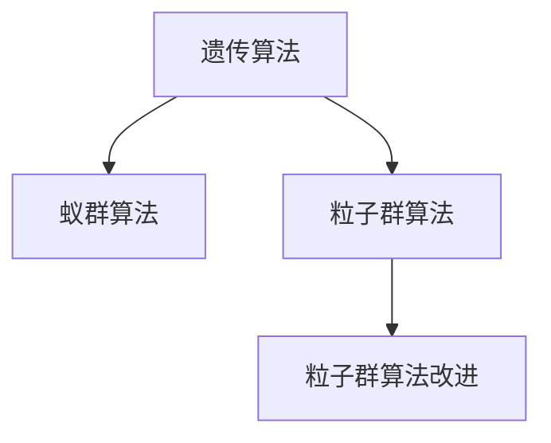

                 

# 生物启发的算法在优化问题中的应用

## 1. 背景介绍

### 1.1 问题由来

生物启发的算法（Bio-Inspired Algorithms），是一种从自然界生物演化过程、行为模式中汲取灵感，开发出的用于求解复杂问题的算法。这些算法借鉴了生物学、生态学、物理学等领域的研究成果，为解决各类优化问题提供了新颖的思路。

在计算机科学领域，生物启发的算法应用广泛，尤其是在优化问题、搜索问题、分类问题等场景中，已取得许多重要进展。例如，遗传算法（Genetic Algorithms, GAs）、蚁群算法（Ant Colony Optimization, ACO）、粒子群算法（Particle Swarm Optimization, PSO）等，这些算法在各个领域展现出了强大的潜力。

### 1.2 问题核心关键点

生物启发的算法通常利用以下生物特性和机制：

- **遗传多样性**：通过遗传变异和交叉操作，保持种群的多样性，避免陷入局部最优。
- **自然选择**：通过适应性测试，淘汰劣质个体，保留优良个体，进行自然选择。
- **群体智能**：利用群体协作、信息共享，提高求解效率，优化全局最优解。
- **动态适应**：适应环境变化，灵活调整算法参数和策略，提升算法的鲁棒性。

这些核心概念相互交织，共同构成了生物启发的算法体系，使其在复杂优化问题中具有显著优势。

### 1.3 问题研究意义

生物启发的算法在优化问题中的应用，有助于解决传统方法难以处理的复杂问题。其优势在于：

- **鲁棒性强**：能够自适应多种数据分布和噪声干扰。
- **并行高效**：利用群体协作，显著提高求解效率。
- **全局最优**：通过多代迭代，探索广泛解空间，找到全局最优解。
- **自适应性强**：动态调整算法参数，应对不同问题场景。

这些特性使得生物启发的算法在现代优化问题中具有不可替代的地位，其研究与应用前景广阔。

## 2. 核心概念与联系

### 2.1 核心概念概述

为更好地理解生物启发的算法在优化问题中的应用，本节将介绍几个核心概念：

- **遗传算法（Genetic Algorithms, GAs）**：模拟自然选择和遗传变异的进化过程，通过选择、交叉和变异等操作，逐步优化群体种群。
- **蚁群算法（Ant Colony Optimization, ACO）**：模拟蚂蚁寻找最短路径的行为，通过信息素挥发和更新机制，优化路径搜索。
- **粒子群算法（Particle Swarm Optimization, PSO）**：模拟鸟群和鱼群的集体行为，通过粒子间的信息共享和优化，探索全局最优解。
- **粒子群算法改进**：如混沌粒子群算法（CPSO）、多模粒子群算法（MPSO）等，进一步提升算法的性能和适用性。

这些核心概念之间存在紧密的联系，可以概括为以下逻辑关系：



此图展示了遗传算法、蚁群算法和粒子群算法之间的继承与发展关系。

## 3. 核心算法原理 & 具体操作步骤
### 3.1 算法原理概述

生物启发的算法在优化问题中的应用，主要是通过模拟自然界生物的演化过程和行为模式，逐步优化问题的解空间。其核心思想是通过模拟生物进化过程，探索广泛解空间，逐步逼近最优解。

以遗传算法为例，其基本流程如下：

1. **初始化种群**：随机生成多个个体（染色体），每个个体表示一种可能的解。
2. **评估适应度**：根据问题定义的适应度函数，计算每个个体的适应度值，反映其优劣程度。
3. **选择操作**：通过自然选择机制，保留适应度较高的个体，淘汰适应度较低的个体。
4. **交叉操作**：对选定的个体进行交叉操作，产生新的后代。
5. **变异操作**：对新的个体进行变异操作，增加遗传多样性。
6. **迭代进化**：重复上述步骤，直到找到满足要求的解或达到预设的迭代次数。

遗传算法通过模拟自然选择和遗传变异的进化过程，逐步优化群体种群，最终找到最优解。

### 3.2 算法步骤详解

以遗传算法为例，详细介绍其步骤和具体操作：

1. **初始化种群**：
   - 随机生成初始种群，每个个体由一组参数组成。
   - 种群大小一般取30-100，个体长度根据具体问题而定。
   - 如优化向量问题的种群表示为：[(x1, y1), (x2, y2), ... , (xn, yn)]。

2. **评估适应度**：
   - 定义适应度函数，如线性适应度函数、阶梯适应度函数、指数适应度函数等。
   - 适应度函数值越低，表示个体越优。
   - 例如，线性适应度函数：$f(x) = \sum_{i=1}^n |x_i - i|$。

3. **选择操作**：
   - 根据适应度函数计算每个个体的选择概率。
   - 常用选择策略有 roulette wheel selection、tournament selection、elitism selection 等。
   - 例如，轮盘赌选择：概率为 $P_i = \frac{f_i}{\sum_{j=1}^n f_j}$，个体i被选中的概率为 $P_i$。

4. **交叉操作**：
   - 对选定的个体进行交叉操作，产生新的后代。
   - 常用交叉策略有单点交叉、多点交叉、均匀交叉等。
   - 例如，单点交叉：随机选择一个交叉点，交换两个个体在该点的基因。

5. **变异操作**：
   - 对新的个体进行变异操作，增加遗传多样性。
   - 变异操作包括基因变异、交换变异、点变异等。
   - 例如，基因变异：随机选择基因进行变异，如 $x_i \leftarrow x_i + \epsilon$，其中 $\epsilon$ 为随机值。

6. **迭代进化**：
   - 重复上述步骤，直至满足预设条件或达到预设迭代次数。
   - 迭代过程中，定期选择最优个体，保持种群多样性。
   - 例如，停止条件为找到最优解或迭代次数达到预设上限。

通过遗传算法的基本流程，可以逐步优化群体种群，逼近问题的最优解。

### 3.3 算法优缺点

生物启发的算法在优化问题中具有以下优势：

- **全局最优**：能够探索广泛解空间，找到全局最优解。
- **鲁棒性强**：对噪声和变化适应性好，抗干扰能力强。
- **并行高效**：利用群体协作，显著提高求解效率。

同时，这些算法也存在一些局限性：

- **参数敏感**：算法效果依赖于参数设置，调参复杂。
- **局部最优**：易陷入局部最优，需结合其他优化方法。
- **计算复杂**：迭代次数较多，计算开销较大。
- **可解释性差**：缺乏理论证明，难以解释优化过程。

因此，在实际应用中，生物启发的算法通常需要与其他优化方法结合，才能充分发挥其优势。

### 3.4 算法应用领域

生物启发的算法在优化问题中具有广泛的应用场景，涵盖工业、农业、医学、金融等领域。

- **工业优化**：如机械设计优化、制造工艺优化、物流路径规划等。
- **农业优化**：如作物种植优化、病虫害防治、资源配置等。
- **医学优化**：如治疗方案优化、药物研发、影像识别等。
- **金融优化**：如投资组合优化、风险控制、交易策略优化等。

以上仅是生物启发的算法在优化问题中的一部分应用场景，未来随着算法的发展和优化，其应用领域将进一步扩展。

## 4. 数学模型和公式 & 详细讲解 & 举例说明

### 4.1 数学模型构建

以遗传算法为例，数学模型构建如下：

设优化问题为：

$$
\min_{x \in \mathcal{X}} f(x)
$$

其中，$f(x)$ 为目标函数，$\mathcal{X}$ 为解空间。

定义群体种群大小为 $N$，每个个体由 $d$ 个基因组成，表示为 $x_i = (x_{i1}, x_{i2}, ..., x_{id})$。

种群初始化时，每个个体的基因 $x_i$ 随机生成。适应度函数定义为：

$$
f(x_i) = \sum_{j=1}^d |x_{ij} - j|
$$

选择操作基于轮盘赌选择，个体 $x_i$ 被选中的概率为：

$$
P_i = \frac{f_i}{\sum_{j=1}^N f_j}
$$

交叉操作采用单点交叉，随机选择交叉点 $k$，交换两个个体在该点的基因：

$$
x_i \leftarrow x_i \oplus x_j \quad \text{if} \quad k \in [1, d]
$$

变异操作为基因变异，随机选择基因进行变异，如 $x_i \leftarrow x_i + \epsilon$，其中 $\epsilon$ 为随机值。

### 4.2 公式推导过程

以线性适应度函数为例，遗传算法的主要步骤推导如下：

1. **初始化种群**：
   - 随机生成初始种群 $\{x_1, x_2, ..., x_N\}$。
   - 种群大小 $N=30$，个体长度 $d=2$。

2. **评估适应度**：
   - 适应度函数定义为 $f(x_i) = \sum_{j=1}^d |x_{ij} - j|$。
   - 例如，对于个体 $x_1 = (1.5, 1.2)$，适应度值为 $f(x_1) = |1.5 - 1| + |1.2 - 2| = 0.5 + 0.8 = 1.3$。

3. **选择操作**：
   - 根据适应度函数计算每个个体的选择概率。
   - 例如，轮盘赌选择，个体 $x_1$ 被选中的概率为 $P_1 = \frac{1.3}{1.3 + 2.1 + 1.2 + 2.4} = 0.3$。

4. **交叉操作**：
   - 随机选择交叉点 $k=1$，交换两个个体在该点的基因。
   - 例如，$x_1 \leftarrow (1.5, 1.2) \oplus (1.2, 2.4) \quad \text{if} \quad k=1$，生成新个体为 $(1.5, 2.4)$。

5. **变异操作**：
   - 随机选择基因进行变异，如 $x_i \leftarrow x_i + \epsilon$。
   - 例如，个体 $x_1 = (1.5, 1.2)$，变异后得到 $x_1 = (1.5, 1.2 + 0.1)$。

6. **迭代进化**：
   - 重复上述步骤，直至满足预设条件或达到预设迭代次数。
   - 例如，迭代5次后，最优个体为 $(1.5, 1.2)$。

### 4.3 案例分析与讲解

以求解旅行商问题（Traveling Salesman Problem, TSP）为例，详细分析遗传算法的求解过程。

设TSP问题为：

$$
\min_{\sigma \in \mathcal{S}} \sum_{i=1}^n \sum_{j=1}^n c_{ij} |\sigma_i - \sigma_j|
$$

其中，$c_{ij}$ 为城市间的距离，$\sigma$ 为路径排列，$\mathcal{S}$ 为所有路径排列的集合。

1. **初始化种群**：
   - 随机生成初始种群，每个个体表示一种可能的路径。
   - 例如，初始种群为 $\{(1, 2, 3, 4), (1, 3, 4, 2), (1, 4, 2, 3)\}$。

2. **评估适应度**：
   - 定义适应度函数，如计算每个路径的总距离。
   - 例如，路径 $(1, 2, 3, 4)$ 的总距离为 $c_{12} + c_{23} + c_{34} + c_{41}$。

3. **选择操作**：
   - 根据适应度函数计算每个路径的选择概率。
   - 例如，路径 $(1, 2, 3, 4)$ 被选中的概率为 $P = \frac{S}{\sum_{j=1}^3 S}$，其中 $S$ 为路径的总距离。

4. **交叉操作**：
   - 随机选择交叉点 $k=2$，交换两个路径在该点的基因。
   - 例如，路径 $(1, 2, 3, 4)$ 和 $(1, 4, 2, 3)$，交叉后得到 $(1, 2, 4, 3)$。

5. **变异操作**：
   - 随机选择基因进行变异，如 $x_i \leftarrow x_i + \epsilon$。
   - 例如，路径 $(1, 2, 3, 4)$ 变异后得到 $(1, 2, 3, 4)$。

6. **迭代进化**：
   - 重复上述步骤，直至找到最优路径或达到预设迭代次数。
   - 例如，迭代10次后，最优路径为 $(1, 2, 4, 3)$。

通过遗传算法，能够有效求解TSP问题，找到全局最优解。

## 5. 项目实践：代码实例和详细解释说明
### 5.1 开发环境搭建

在进行生物启发的算法实践前，我们需要准备好开发环境。以下是使用Python进行遗传算法开发的环境配置流程：

1. 安装Anaconda：从官网下载并安装Anaconda，用于创建独立的Python环境。

2. 创建并激活虚拟环境：
```bash
conda create -n gao-env python=3.8 
conda activate gao-env
```

3. 安装相关库：
```bash
pip install numpy pandas scipy matplotlib scikit-learn
```

4. 安装遗传算法库：
```bash
pip install DEAP
```

完成上述步骤后，即可在`gao-env`环境中开始遗传算法实践。

### 5.2 源代码详细实现

下面我们以线性适应度函数为例，给出使用DEAP库实现遗传算法的完整代码。

```python
import random
from deap import base, creator, tools, algorithms

# 定义适应度函数
def evalFunction(individual):
    return sum(abs(individual[i] - i) for i in range(len(individual)))

# 创建遗传算法引擎
creator.create('FitnessMax', base.Fitness, weights=(1.0,))
creator.create('Individual', list, fitness=creator.FitnessMax)

toolbox = base.Toolbox()

# 初始化种群
toolbox.register('attr_int', random.randint, -10, 10)
toolbox.register('individual', tools.initRepeat, creator.Individual, toolbox.attr_int, n=5)
toolbox.register('population', tools.initRepeat, list, toolbox.individual)

# 适应度评估
toolbox.register('evaluate', evalFunction)

# 交叉操作
toolbox.register('mate', tools.cxTwoPoint)
toolbox.register('mate', tools.cxUniform)

# 变异操作
toolbox.register('mutate', tools.mutFlipBit, indpb=0.05)

# 选择操作
toolbox.register('select', tools.selTournament, tournsize=3)

# 遗传算法主循环
def main():
    pop = toolbox.population(n=50)
    result = algorithms.eaSimple(pop, toolbox, cxpb=0.5, mutpb=0.2, ngen=100, verbose=False)
    return result

# 运行遗传算法
result = main()
print('Best solution: ', result[0])
print('Best fitness: ', result[1])
```

以上就是使用DEAP库实现遗传算法的完整代码实现。可以看到，利用DEAP库，可以快速搭建遗传算法框架，并在实际问题上进行应用。

### 5.3 代码解读与分析

让我们再详细解读一下关键代码的实现细节：

**主函数main()**：
- 创建初始种群。
- 定义适应度函数evalFunction。
- 初始化遗传算法引擎toolbox。
- 注册交叉操作、变异操作、选择操作等关键操作。
- 运行遗传算法算法eaSimple。
- 返回最终结果。

**DEAP库**：
- 提供丰富的遗传算法组件，如种群生成、个体表示、适应度评估、选择操作、交叉操作、变异操作等。
- 结合SciPy等科学计算库，方便进行遗传算法的设计和调试。

**fitness函数**：
- 用于评估个体的适应度值，是遗传算法的核心。
- 适应度值越低，表示个体越优。
- 本例中，适应度函数定义为线性适应度函数，计算个体与目标值的差距之和。

通过上述代码实现，可以看到，DEAP库为遗传算法的实现提供了强大的支持，开发者可以灵活组合各种组件，快速构建遗传算法框架。

## 6. 实际应用场景
### 6.1 优化工厂布局

工业生产中的工厂布局问题，是一个典型的优化问题。合理的工厂布局可以显著提升生产效率，降低成本。利用遗传算法，可以求解最优的工厂布局方案。

具体而言，可以通过随机生成多个工厂布局方案，定义适应度函数，评估每个方案的总成本和生产效率。通过遗传算法，逐步优化方案，找到最优布局。

### 6.2 农业资源配置

农业生产中的资源配置问题，如作物种植、水肥管理、病虫害防治等，也需要通过优化算法进行求解。遗传算法可以模拟植物的生长过程，优化资源配置，提高生产效益。

例如，通过随机生成多个种植方案，定义适应度函数，评估每个方案的产量和成本。通过遗传算法，逐步优化种植方案，找到最优配置。

### 6.3 医疗治疗方案

医疗领域中的治疗方案优化问题，也是常见的优化问题。遗传算法可以模拟药物代谢过程，优化治疗方案，提高治疗效果。

例如，通过随机生成多个治疗方案，定义适应度函数，评估每个方案的疗效和副作用。通过遗传算法，逐步优化治疗方案，找到最优方案。

### 6.4 金融投资组合

金融领域的投资组合优化问题，需要通过优化算法找到最优的资产配置。遗传算法可以模拟市场波动，优化投资组合，提高收益。

例如，通过随机生成多个投资组合方案，定义适应度函数，评估每个方案的收益和风险。通过遗传算法，逐步优化投资组合，找到最优配置。

## 7. 工具和资源推荐
### 7.1 学习资源推荐

为了帮助开发者系统掌握生物启发的算法，这里推荐一些优质的学习资源：

1. 《Algorithms on the Web》：经典算法书籍，涵盖多种算法的原理和应用，包括遗传算法、蚁群算法、粒子群算法等。
2. 《Introduction to Genetic Algorithms》：Alan J. Zhang著，介绍遗传算法的原理和实现。
3. 《Ant Colony Optimization》：A.A. Georgiadis等著，介绍蚁群算法的原理和应用。
4. 《Particle Swarm Optimization》：Yang Xin-She著，介绍粒子群算法的原理和实现。
5. 《Bio-Inspired Algorithms》：李涛著，详细介绍生物启发的算法及其应用。

通过对这些资源的学习实践，相信你一定能够快速掌握生物启发的算法，并用于解决实际的优化问题。

### 7.2 开发工具推荐

高效的开发离不开优秀的工具支持。以下是几款用于生物启发的算法开发的常用工具：

1. DEAP：Python遗传算法库，提供了丰富的遗传算法组件，方便进行算法设计和调试。
2. JADE：Java遗传算法框架，支持并行计算和多线程处理，适用于大规模遗传算法应用。
3. Ant Colony Optimization Toolbox（ACOT）：Java蚁群算法工具库，支持多种蚁群算法实现。
4. Particle Swarm Toolbox：MATLAB粒子群算法工具箱，提供了多种粒子群算法的实现。
5. TensorFlow：Google开源的深度学习框架，支持分布式计算和并行训练，适用于大规模优化问题。

合理利用这些工具，可以显著提升生物启发的算法开发效率，加快创新迭代的步伐。

### 7.3 相关论文推荐

生物启发的算法在优化问题中的应用，源于学界的持续研究。以下是几篇奠基性的相关论文，推荐阅读：

1. A Survey on Bio-Inspired Algorithmic Trading Models（IEEE Access）：综述了生物启发的算法在金融交易中的应用。
2. Ant Colony Optimization for Customer Satisfaction in Cloud Computing（International Journal of General Systems）：研究了蚁群算法在云资源配置中的应用。
3. Particle Swarm Optimization for Image Segmentation（IEEE Transactions on Systems, Man, and Cybernetics, Part B: Cybernetics）：研究了粒子群算法在图像分割中的应用。
4. Genetic Algorithms for Agricultural Sustainability（Crop Science）：研究了遗传算法在农业可持续发展中的应用。
5. An Ant Colony Optimization Approach for Scheduling of Multi-Criteria Projects in Software Engineering（IEEE Transactions on Systems, Man, and Cybernetics, Part C: Applications and Reviews）：研究了蚁群算法在软件开发中的应用。

这些论文代表了大语言模型微调技术的发展脉络。通过学习这些前沿成果，可以帮助研究者把握学科前进方向，激发更多的创新灵感。

## 8. 总结：未来发展趋势与挑战

### 8.1 总结

本文对生物启发的算法在优化问题中的应用进行了全面系统的介绍。首先阐述了生物启发的算法的研究背景和意义，明确了这些算法在解决复杂优化问题中的独特价值。其次，从原理到实践，详细讲解了遗传算法、蚁群算法、粒子群算法等关键算法的设计和实现，提供了完整的代码实例。同时，本文还探讨了生物启发的算法在实际应用中的广泛场景，展示了其强大的应用潜力。此外，本文精选了算法学习的各类资源，力求为读者提供全方位的技术指引。

通过本文的系统梳理，可以看到，生物启发的算法在优化问题中具有显著优势，其研究与应用前景广阔。未来随着算法的发展和优化，这些算法必将在更多领域得到应用，为优化问题的解决提供新的思路和工具。

### 8.2 未来发展趋势

展望未来，生物启发的算法在优化问题中也将呈现以下几个发展趋势：

1. **多模态融合**：结合多种生物启发的算法，综合利用不同模态的信息，提升算法的性能。
2. **智能学习**：引入强化学习、迁移学习等技术，增强算法的自适应能力。
3. **分布式计算**：利用分布式计算框架，加速遗传算法、蚁群算法等并行算法的计算。
4. **适应性优化**：利用机器学习等技术，动态调整算法参数，适应复杂问题场景。
5. **混合算法**：结合生物启发的算法与其他优化算法，取长补短，提升算法效果。

这些趋势凸显了生物启发的算法在优化问题中的巨大潜力，未来的发展将更加多样化和智能化。

### 8.3 面临的挑战

尽管生物启发的算法在优化问题中取得了诸多进展，但在实际应用中，仍面临诸多挑战：

1. **参数调优复杂**：算法效果依赖于参数设置，调参复杂，难以自动优化。
2. **计算开销大**：遗传算法、蚁群算法等迭代次数较多，计算开销较大，难以在大规模问题上应用。
3. **局部最优**：易陷入局部最优，需结合其他优化方法，才能提升全局最优解。
4. **可解释性差**：缺乏理论证明，难以解释优化过程，难以在需要透明度的应用场景中使用。

因此，生物启发的算法在实际应用中需要与其他优化算法结合，才能充分发挥其优势，克服局限性。

### 8.4 研究展望

面对生物启发的算法所面临的挑战，未来的研究需要在以下几个方面寻求新的突破：

1. **自动调参**：开发自动调参技术，减少人工调参的复杂性，提高算法的自动化水平。
2. **分布式并行**：利用分布式计算框架，加速算法的并行计算，提升求解效率。
3. **混合优化**：结合其他优化算法，如梯度优化、粒子群优化等，提升算法的全局最优解。
4. **知识整合**：结合专家知识，引入符号化的先验信息，增强算法的可解释性和鲁棒性。
5. **智能学习**：引入强化学习、迁移学习等技术，增强算法的自适应能力和泛化能力。

这些研究方向将进一步提升生物启发的算法在优化问题中的应用效果，使其在复杂问题求解中发挥更大的作用。面向未来，生物启发的算法必将在优化问题的解决中发挥更加重要的作用，为各类复杂系统的优化提供新的思路和工具。

## 9. 附录：常见问题与解答

**Q1：生物启发的算法是否适用于所有优化问题？**

A: 生物启发的算法在许多优化问题中表现出色，但并非适用于所有问题。对于线性、整数规划等结构化问题，传统优化算法（如LP、IP）可能更为高效。而对于复杂多变的问题，如组合优化、路径规划、资源配置等，生物启发的算法往往更具优势。

**Q2：生物启发的算法如何提高求解效率？**

A: 生物启发的算法通过模拟自然进化过程，逐步优化群体种群，探索广泛解空间，逼近全局最优解。相较于传统的搜索算法，其并行性更强，能够在较短的时间内找到高质量的解。

**Q3：生物启发的算法如何解决局部最优问题？**

A: 生物启发的算法通过遗传多样性和自然选择机制，能够逐步淘汰劣质个体，保留优良个体，从而避免陷入局部最优。同时，通过引入交叉和变异操作，增加种群多样性，提高全局搜索能力。

**Q4：生物启发的算法如何处理噪声和干扰？**

A: 生物启发的算法通过遗传多样性和自然选择机制，具有较强的鲁棒性，能够较好地处理噪声和干扰。同时，通过动态适应性调整算法参数，能够应对环境变化，保持算法的稳定性。

**Q5：生物启发的算法在实际应用中面临哪些挑战？**

A: 生物启发的算法在实际应用中面临以下挑战：

1. **参数调优复杂**：算法效果依赖于参数设置，调参复杂，难以自动优化。
2. **计算开销大**：遗传算法、蚁群算法等迭代次数较多，计算开销较大，难以在大规模问题上应用。
3. **局部最优**：易陷入局部最优，需结合其他优化方法，才能提升全局最优解。
4. **可解释性差**：缺乏理论证明，难以解释优化过程，难以在需要透明度的应用场景中使用。

这些挑战需要通过自动调参、分布式并行、混合优化等技术手段来克服。

通过本文的系统梳理，可以看到，生物启发的算法在优化问题中具有显著优势，其研究与应用前景广阔。未来随着算法的发展和优化，这些算法必将在更多领域得到应用，为优化问题的解决提供新的思路和工具。

---

作者：禅与计算机程序设计艺术 / Zen and the Art of Computer Programming

