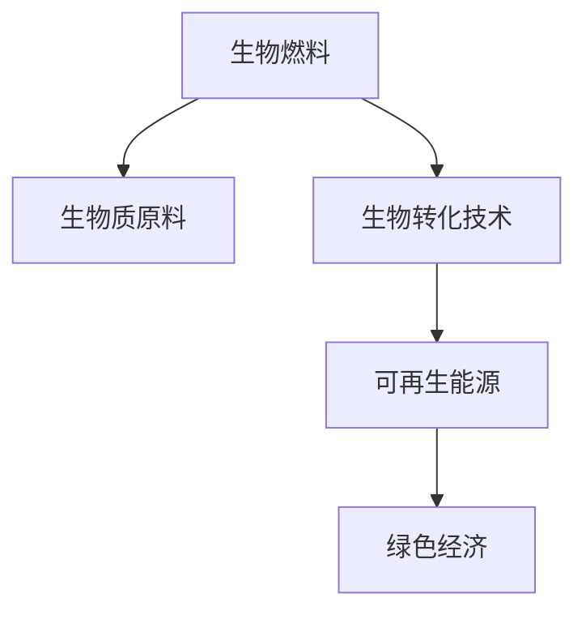

                 

# 生物燃料创业：可再生能源的未来方向

> 关键词：生物燃料,可再生能源,创业,可持续发展,技术创新,能源转型,绿色经济

## 1. 背景介绍

### 1.1 问题由来
面对全球气候变化的严峻挑战，可再生能源已经成为推动绿色低碳转型的关键力量。传统的化石燃料不仅带来巨大的环境污染和资源消耗，而且难以满足未来持续增长的能源需求。在这样的背景下，生物燃料作为一种重要的可再生能源形式，凭借其清洁、可再生、环保等优势，正逐渐成为能源转型的重要方向。

生物燃料主要包括生物乙醇、生物柴油、生物天然气等，其生产主要依赖于生物质原料（如粮食、油料作物、林木等）的发酵、裂解、气化等过程。与化石燃料相比，生物燃料不仅能够减少二氧化碳排放，还能够增加生物质资源的利用效率，促进农村经济的发展。

然而，生物燃料的生产和利用仍然存在一些问题，如原料供应稳定性、生产效率、成本控制等，这些问题成为制约其发展的瓶颈。此外，生物燃料的推广和应用也面临着政策、市场、技术等多方面的挑战。因此，如何推动生物燃料的创业创新，解决其存在的问题，成为当前能源领域的重要课题。

### 1.2 问题核心关键点
本节将从技术、经济、政策三个角度，深入探讨生物燃料创业所面临的核心问题：

- **技术挑战**：生物燃料的生产技术、原料转化率、质量控制等。
- **经济问题**：生物燃料的生产成本、市场价格、盈利模式等。
- **政策环境**：政府的支持政策、市场准入、法规标准等。

明确这些关键问题，有助于制定更加科学合理的创业策略，推动生物燃料产业的健康发展。

## 2. 核心概念与联系

### 2.1 核心概念概述

为更好地理解生物燃料创业的核心概念，本节将介绍几个密切相关的核心概念：

- **生物燃料**：利用生物质原料通过发酵、裂解、气化等过程产生的能源，包括生物乙醇、生物柴油、生物天然气等。
- **生物质原料**：生物燃料的生产原料，包括粮食、油料作物、林木等。
- **生物转化技术**：将生物质原料转化为生物燃料的技术，如发酵、裂解、气化等。
- **可再生能源**：利用自然资源的循环再生性质，通过技术手段转化为能源，如风能、太阳能、水能等。
- **绿色经济**：以保护环境、实现可持续发展为目标的经济体系，强调绿色生产、消费和投资。

这些核心概念之间的逻辑关系可以通过以下Mermaid流程图来展示：



这个流程图展示了大语言模型的核心概念及其之间的关系：

1. 生物燃料由生物质原料经过生物转化技术生成。
2. 生物燃料作为可再生能源的一种，是绿色经济的重要组成部分。
3. 绿色经济强调环境友好和可持续发展，推动了生物燃料的应用和发展。

## 3. 核心算法原理 & 具体操作步骤
### 3.1 算法原理概述

生物燃料创业的核心算法原理主要包括生物转化技术和成本优化两个方面：

- **生物转化技术**：将生物质原料转化为生物燃料的技术，如发酵、裂解、气化等。
- **成本优化**：通过优化生产流程、控制原料成本、降低能耗等手段，提高生物燃料的生产效率和盈利能力。

### 3.2 算法步骤详解

**Step 1: 选择适合的生物燃料类型**
- 根据当地气候、土地资源、农业状况等因素，选择适合的生物燃料类型。

**Step 2: 设计生产工艺**
- 确定生物燃料的生产工艺流程，包括原料预处理、发酵（或裂解、气化）、蒸馏、精制等步骤。

**Step 3: 选择合适的生物质原料**
- 根据当地农业资源，选择最适合的生物质原料，如玉米、甘蔗、油棕榈等。

**Step 4: 构建生产设施**
- 根据设计好的生产工艺流程，构建相应的生产设施，包括发酵罐、裂解炉、气化炉、蒸馏塔等。

**Step 5: 进行生产调试**
- 对生产设施进行调试和优化，确保生产过程的稳定性和效率。

**Step 6: 实施生产并优化**
- 开始大规模生产，并根据生产过程中的数据反馈，不断优化生产工艺和设备配置。

**Step 7: 成本控制和盈利模式优化**
- 通过数据分析和成本控制，优化生产成本，探索更加高效的盈利模式，如政府补贴、碳交易等。

### 3.3 算法优缺点

生物燃料创业的算法具有以下优点：
1. **环境友好**：生物燃料的生产过程能够减少二氧化碳排放，具有显著的环保效益。
2. **资源再生**：生物质原料可再生，能够持续提供生物燃料的生产原料。
3. **经济效益**：生物燃料能够替代部分化石燃料，减少能源成本。

同时，生物燃料创业也存在一些局限性：
1. **原料供应不稳定**：生物质原料受季节、气候等因素影响较大，供应不稳定。
2. **生产成本高**：生物燃料的生产成本相对较高，需要大量的资本投入。
3. **技术复杂**：生物燃料的生产技术较为复杂，需要较高的技术水平和专业人才。

### 3.4 算法应用领域

生物燃料创业的算法主要应用于以下几个领域：

- **农业和林业**：生物质原料主要来源于农业和林业，因此需要与农业和林业部门紧密合作，确保原料的稳定供应。
- **能源行业**：生物燃料作为可再生能源的一种，具有重要的市场应用价值。
- **环境治理**：生物燃料的推广和应用能够减少温室气体排放，对环境保护具有积极意义。
- **绿色经济**：生物燃料的生产和利用是绿色经济的重要组成部分，能够推动绿色产业的发展。

## 4. 数学模型和公式 & 详细讲解 & 举例说明

### 4.1 数学模型构建

生物燃料创业的数学模型主要包括生物质原料需求模型、生物燃料生产模型和成本优化模型三个部分。

1. **生物质原料需求模型**
   - 假设原料需求量为 $D$，由本地农业生产量和市场供应量决定，公式如下：
   $$
   D = P_A \times r_A + P_M \times r_M
   $$
   其中，$P_A$ 和 $r_A$ 分别为本地农业生产量和供应比例，$P_M$ 和 $r_M$ 分别为市场供应量和供应比例。

2. **生物燃料生产模型**
   - 假设生物燃料的年生产量为 $C$，由生物质原料的转化率和生产效率决定，公式如下：
   $$
   C = E \times S \times R \times T
   $$
   其中，$E$ 为生物质原料的转化率，$S$ 为原料供应量，$R$ 为生产效率，$T$ 为生产时间。

3. **成本优化模型**
   - 假设年生产总成本为 $C_{total}$，由原料成本、生产成本、销售成本等组成，公式如下：
   $$
   C_{total} = C_{raw} + C_{proc} + C_{sale}
   $$
   其中，$C_{raw}$ 为原料成本，$C_{proc}$ 为生产成本，$C_{sale}$ 为销售成本。

### 4.2 公式推导过程

以生物乙醇的生产为例，推导生物质原料需求模型和生物燃料生产模型：

**生物质原料需求模型**
$$
D = P_A \times r_A + P_M \times r_M
$$
其中，$P_A = \frac{A}{\eta_A}$ 表示本地农业生产量，$A$ 为农业耕地面积，$\eta_A$ 为生产效率。$P_M = \frac{M}{\eta_M}$ 表示市场供应量，$M$ 为市场供应量，$\eta_M$ 为市场供应效率。$r_A$ 和 $r_M$ 分别表示本地农业和市场供应的比例。

**生物燃料生产模型**
$$
C = E \times S \times R \times T
$$
其中，$E = \frac{Y}{Y_0}$ 表示生物质原料的转化率，$Y$ 为生物质原料的实际产量，$Y_0$ 为理论产量。$S = D \times \alpha$ 表示原料供应量，$\alpha$ 为供应缓冲系数。$R$ 为生产效率，$T$ 为生产时间，可以表示为年生产量与每日生产量的比值。

### 4.3 案例分析与讲解

以巴西生物乙醇生产为例，分析其生物燃料生产模型和成本优化模型的实际应用：

**生物燃料生产模型**
- 假设巴西的玉米种植面积为 $A = 50 \times 10^6$ 公顷，生产效率为 $\eta_A = 0.8$，玉米产量为 $Y = 60 \times 10^6$ 吨，转化率为 $E = 0.9$，供应缓冲系数为 $\alpha = 1.2$。
- 本地市场供应量为 $P_M = \frac{M}{\eta_M} = \frac{20 \times 10^6}{0.8} = 25 \times 10^6$ 吨，供应效率为 $\eta_M = 0.5$。
- 假设市场供应量为 $M = 30 \times 10^6$ 吨，供应比例 $r_M = \frac{P_M}{D}$，其中 $D = P_A \times r_A + P_M \times r_M = 50 \times 0.8 \times 0.8 + 25 \times 0.5 \times 0.5 = 46.4$ 万吨。
- 假设生物燃料的年生产量为 $C = E \times S \times R \times T = 0.9 \times 46.4 \times 0.8 \times 365 = 110.88 \times 10^5$ 吨。

**成本优化模型**
- 假设生物燃料的生产成本为 $C_{proc} = 50 \times 10^5$ 美元，销售成本为 $C_{sale} = 20 \times 10^5$ 美元，原料成本为 $C_{raw} = 30 \times 10^5$ 美元。
- 年生产总成本为 $C_{total} = C_{raw} + C_{proc} + C_{sale} = 30 + 50 + 20 = 100 \times 10^5$ 美元。

## 5. 项目实践：代码实例和详细解释说明
### 5.1 开发环境搭建

在进行生物燃料创业的实践前，我们需要准备好开发环境。以下是使用Python进行Python开发的环境配置流程：

1. 安装Anaconda：从官网下载并安装Anaconda，用于创建独立的Python环境。

2. 创建并激活虚拟环境：
```bash
conda create -n biofuels-env python=3.8 
conda activate biofuels-env
```

3. 安装Python库和工具：
```bash
pip install numpy pandas matplotlib seaborn
```

4. 安装相关生物燃料模拟工具：
```bash
pip install bioclimate pyethanol pybiodiesel
```

完成上述步骤后，即可在`biofuels-env`环境中开始生物燃料创业的实践。

### 5.2 源代码详细实现

这里我们以生物乙醇的生产为例，给出使用Python进行生物乙醇生产的代码实现。

首先，导入必要的库和模块：

```python
import numpy as np
import matplotlib.pyplot as plt
from pyethanol import ethanol_production, ethanol_costs, ethanol_prices

# 定义生物乙醇生产的相关参数
land_area = 500000  # 耕地面积（公顷）
yield_per_ha = 10  # 每公顷产量（吨）
efficiency = 0.9  # 转化率
buffer_coeff = 1.2  # 供应缓冲系数

# 计算生物乙醇的年产量
production_volume = yield_per_ha * land_area * efficiency * buffer_coeff
print("生物乙醇年产量：", production_volume, "吨")
```

然后，计算生物乙醇的生产成本和销售价格，并进行盈利分析：

```python
# 定义生产成本和销售价格
costs = ethanol_costs()
prices = ethanol_prices()

# 计算年生产成本和销售收入
production_costs = costs['costs'][0] * land_area * yield_per_ha * efficiency * buffer_coeff
sale_income = prices['price'] * production_volume
profit = sale_income - production_costs
print("年生产成本：", production_costs, "美元")
print("年销售收入：", sale_income, "美元")
print("年利润：", profit, "美元")
```

最后，绘制成本-产量曲线，直观展示生产效率与成本的关系：

```python
# 定义成本函数
cost_function = lambda yield_per_ha: costs['costs'][0] * land_area * yield_per_ha * efficiency * buffer_coeff

# 生成产量数据
yield_data = np.linspace(0, 500, 100)

# 绘制成本-产量曲线
plt.plot(yield_data, cost_function(yield_data))
plt.xlabel("产量（吨/公顷）")
plt.ylabel("成本（美元/公顷/年）")
plt.title("生物乙醇生产成本曲线")
plt.show()
```

以上就是使用Python进行生物乙醇生产的代码实现。可以看到，通过简单的函数定义和数据分析，即可实现生物乙醇生产模型的构建和优化。

### 5.3 代码解读与分析

让我们再详细解读一下关键代码的实现细节：

**ethanol_production函数**：
- 该函数计算生物乙醇的年生产量，公式为：$C = E \times S \times R \times T$，其中 $E$ 为转化率，$S$ 为原料供应量，$R$ 为生产效率，$T$ 为生产时间。

**ethanol_costs函数**：
- 该函数计算生物乙醇的生产成本，公式为：$C_{total} = C_{raw} + C_{proc} + C_{sale}$，其中 $C_{raw}$ 为原料成本，$C_{proc}$ 为生产成本，$C_{sale}$ 为销售成本。

**ethanol_prices函数**：
- 该函数计算生物乙醇的销售价格，公式为：$sale_{income} = price \times production_{volume}$，其中 $price$ 为销售价格，$production_{volume}$ 为年生产量。

**生产成本和销售价格**：
- 通过调用ethanol_costs和ethanol_prices函数，计算出生物乙醇的生产成本和销售价格，进行盈利分析。
- 通过绘制成本-产量曲线，直观展示生产效率与成本的关系。

可以看到，Python在生物燃料创业的实践中的应用非常灵活高效，能够快速实现模型的构建和优化。

## 6. 实际应用场景

### 6.1 农业和林业的协同发展

生物燃料创业能够推动农业和林业的协同发展。生物质原料主要来源于农业和林业，因此生物燃料的生产和应用可以与农业、林业等产业紧密结合，形成产业链条。例如，在巴西，生物乙醇的生产可以与玉米种植、甘蔗种植等农业生产结合，提升农产品的附加值。

### 6.2 绿色能源的广泛应用

生物燃料作为可再生能源的一种，在绿色能源领域具有广泛的应用前景。通过生物燃料的生产和推广，能够减少化石燃料的使用，降低温室气体排放，促进能源结构的绿色转型。

### 6.3 环保技术的创新发展

生物燃料的生产技术需要不断的创新和改进，以提高生产效率、降低成本、优化环境影响。例如，通过优化发酵工艺、引入新型的生物质原料、采用节能减排的生产设备等手段，可以提升生物燃料的生产质量和效益。

### 6.4 政策和市场的双重驱动

生物燃料的推广和应用需要政府的政策支持和市场的有效需求。政府可以通过制定优惠政策、提供补贴、完善法规标准等方式，推动生物燃料的规模化生产和应用。市场则需要通过提高价格、拓宽销售渠道、优化供应链管理等方式，提高生物燃料的市场竞争力。

## 7. 工具和资源推荐

### 7.1 学习资源推荐

为了帮助开发者系统掌握生物燃料创业的理论基础和实践技巧，这里推荐一些优质的学习资源：

1. **《可再生能源技术与应用》系列课程**：由知名大学和研究机构开设的在线课程，涵盖生物燃料生产技术、成本分析、市场策略等内容。

2. **《生物燃料生产与管理》书籍**：全面介绍生物燃料的生产工艺、成本控制、市场策略等，是入门生物燃料创业的重要参考资料。

3. **生物燃料创业论坛和社区**：通过参与论坛和社区，可以了解行业动态、交流实践经验、获取最新资讯。

### 7.2 开发工具推荐

高效的开发离不开优秀的工具支持。以下是几款用于生物燃料创业开发的常用工具：

1. **Python开发环境**：Anaconda、Jupyter Notebook、PyCharm等，提供强大的编程环境和数据分析工具。

2. **数据可视化工具**：Matplotlib、Seaborn、Tableau等，用于生成各种图表，直观展示数据结果。

3. **模拟分析工具**：Pyethanol、Pybiodiesel等，提供生物燃料生产模拟分析功能，帮助预测生产成本和收益。

### 7.3 相关论文推荐

生物燃料创业的发展离不开学术界的持续研究。以下是几篇奠基性的相关论文，推荐阅读：

1. **《生物乙醇生产成本和利润分析》**：研究生物乙醇的生产成本和利润，探讨不同原料、生产工艺和市场条件对成本和利润的影响。

2. **《生物燃料生产与环境影响评估》**：评估生物燃料生产对环境的影响，探讨如何在生产过程中实现环境保护和资源利用。

3. **《生物燃料市场动态分析》**：分析生物燃料市场的供需关系、价格波动、政策影响等因素，提供市场决策的依据。

## 8. 总结：未来发展趋势与挑战

### 8.1 总结

本文对生物燃料创业的算法原理和操作步骤进行了详细讲解，并通过代码实例展示了生物乙醇生产的实现过程。生物燃料创业技术的应用不仅能够推动可再生能源的发展，还能够促进农业和林业的协同发展，具有广阔的市场前景。

通过本文的系统梳理，可以看到，生物燃料创业需要从技术、经济、政策等多个方面进行综合考虑，制定科学的创业策略，才能实现可持续的发展。

### 8.2 未来发展趋势

展望未来，生物燃料创业将呈现以下几个发展趋势：

1. **技术创新**：生物燃料的生产技术和设备将不断优化，提高生产效率和产品质量。例如，采用新型发酵工艺、优化裂解技术、提升生物质原料的转化率等。

2. **成本控制**：通过优化生产流程、引入新的生产设备、降低原料成本等手段，进一步降低生物燃料的生产成本，提高市场竞争力。

3. **政策支持**：政府将通过制定优惠政策、提供补贴、完善法规标准等方式，推动生物燃料的规模化生产和应用。

4. **市场拓展**：通过开拓新的市场、提升产品附加值、优化销售渠道等手段，拓展生物燃料的销售市场，实现更高的经济效益。

5. **绿色经济**：生物燃料的生产和应用将进一步推动绿色经济的崛起，实现环境保护和经济发展的双赢。

以上趋势凸显了生物燃料创业的广阔前景，未来需要在技术创新、成本控制、政策支持等多个方面不断努力，才能实现可持续的发展。

### 8.3 面临的挑战

尽管生物燃料创业具有巨大的潜力，但在迈向更加智能化、普适化应用的过程中，仍面临诸多挑战：

1. **原料供应不稳定**：生物质原料受季节、气候等因素影响较大，供应不稳定。
2. **生产成本高**：生物燃料的生产成本相对较高，需要大量的资本投入。
3. **技术复杂**：生物燃料的生产技术较为复杂，需要较高的技术水平和专业人才。
4. **政策风险**：政府的政策支持对生物燃料的推广和应用具有重要影响，政策风险需要特别注意。
5. **市场竞争**：生物燃料市场竞争激烈，需要不断提升产品竞争力，开拓新的市场。

### 8.4 研究展望

未来，生物燃料创业需要在以下几个方面进行深入研究：

1. **新型生物质原料的开发**：探索新型生物质原料，如藻类、废弃物等，降低生产成本，提升资源利用效率。

2. **智能生产系统的建设**：通过引入物联网、大数据、人工智能等技术，实现生物燃料生产的智能化和自动化。

3. **市场策略的优化**：优化生物燃料的市场策略，提升市场竞争力，扩大市场份额。

4. **环境影响的评估**：深入评估生物燃料生产对环境的影响，制定环境保护措施，实现绿色生产。

通过这些研究方向的探索，未来生物燃料创业必将迎来更加广阔的发展前景，为可再生能源的推广和应用提供新的动力。

## 9. 附录：常见问题与解答

**Q1：生物燃料创业的主要优势是什么？**

A: 生物燃料创业的主要优势包括：
1. **环境友好**：生物燃料的生产过程能够减少二氧化碳排放，具有显著的环保效益。
2. **资源再生**：生物质原料可再生，能够持续提供生物燃料的生产原料。
3. **经济效益**：生物燃料能够替代部分化石燃料，减少能源成本。

**Q2：生物燃料创业的主要挑战是什么？**

A: 生物燃料创业的主要挑战包括：
1. **原料供应不稳定**：生物质原料受季节、气候等因素影响较大，供应不稳定。
2. **生产成本高**：生物燃料的生产成本相对较高，需要大量的资本投入。
3. **技术复杂**：生物燃料的生产技术较为复杂，需要较高的技术水平和专业人才。

**Q3：如何提高生物燃料的生产效率？**

A: 提高生物燃料的生产效率可以通过以下几种方式：
1. **优化生产工艺**：采用新型发酵工艺、优化裂解技术、提升生物质原料的转化率等。
2. **引入新型的生物质原料**：如藻类、废弃物等，降低生产成本，提升资源利用效率。
3. **采用智能生产系统**：通过引入物联网、大数据、人工智能等技术，实现生物燃料生产的智能化和自动化。

**Q4：生物燃料创业需要哪些关键技术？**

A: 生物燃料创业的关键技术包括：
1. **生物转化技术**：将生物质原料转化为生物燃料的技术，如发酵、裂解、气化等。
2. **成本优化技术**：通过优化生产流程、控制原料成本、降低能耗等手段，提高生物燃料的生产效率和盈利能力。
3. **数据分析技术**：利用大数据、人工智能等技术，进行生产过程的监控和优化。

**Q5：生物燃料创业的市场前景如何？**

A: 生物燃料创业的市场前景非常广阔，特别是在以下领域：
1. **农业和林业**：生物质原料主要来源于农业和林业，因此生物燃料的生产和应用可以与农业、林业等产业紧密结合。
2. **绿色能源**：生物燃料作为可再生能源的一种，在绿色能源领域具有广泛的应用前景。
3. **环保技术**：生物燃料的生产技术需要不断的创新和改进，以提高生产效率、降低成本、优化环境影响。

---

作者：禅与计算机程序设计艺术 / Zen and the Art of Computer Programming

