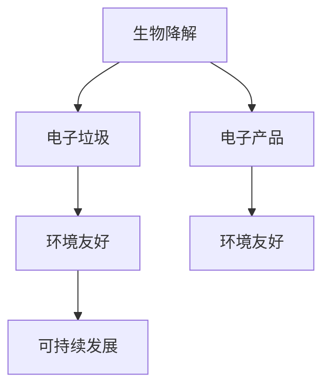

                 

# 生物降解电子产品：解决电子垃圾问题

> 关键词：生物降解，电子垃圾，电子产品，环境友好，可持续发展，产品设计

## 1. 背景介绍

### 1.1 问题由来
随着数字化技术的飞速发展，电子产品在现代社会中的应用越来越广泛，从智能手机、笔记本电脑到智能家居设备，无处不在。然而，这些电子产品的生命周期通常较短，更新换代快，导致每年产生大量电子垃圾。电子垃圾不仅对环境造成严重污染，还引发了一系列社会问题，包括资源浪费、健康风险、环境污染等。

### 1.2 问题核心关键点
解决电子垃圾问题的关键在于找到一种既环保又经济可行的方法，对电子产品进行回收和再利用。当前，市场上存在多种解决方案，包括物理回收、化学回收、生物降解等。其中，生物降解作为一种新兴的环境友好技术，因其环保性和高效性，逐渐成为研究热点。

### 1.3 问题研究意义
生物降解技术对电子产品进行回收处理，不仅减少了环境污染，还实现了资源的再利用，具有重要的环境和经济价值。通过生物降解，可以将电子产品转化为可降解的物质，减少对自然资源的依赖，推动实现可持续发展。

## 2. 核心概念与联系

### 2.1 核心概念概述

为更好地理解生物降解电子产品技术，本节将介绍几个密切相关的核心概念：

- **生物降解**：指生物体通过生物化学作用将有机物质分解为更简单的化合物，直至完全降解为无机物的过程。
- **电子垃圾**：指被遗弃的电子产品，包括废旧电脑、手机、电池等。
- **电子产品**：指包括计算机、手机、电视、智能家居设备等在内的各种电子设备。
- **环境友好**：指在设计和生产过程中，尽量减少对环境的负面影响，推动可持续发展。
- **可持续发展**：指满足当代人的需求，不损害后代人满足需求的能力，实现经济、社会和环境的协调发展。

这些核心概念之间的逻辑关系可以通过以下Mermaid流程图来展示：



这个流程图展示了一些核心概念之间的关系：

1. 生物降解技术可以将电子垃圾转化为环境友好的物质。
2. 电子产品在设计和生产过程中应尽量考虑环境友好原则。
3. 环境友好的电子产品有助于推动可持续发展的目标。

## 3. 核心算法原理 & 具体操作步骤
### 3.1 算法原理概述

生物降解电子产品技术通常基于以下原理：

1. **生物降解特性**：某些材料和组件在自然环境中能被微生物有效分解。
2. **生物降解微生物**：特定菌株或酶在一定条件下能够分解有机物。
3. **处理技术**：通过生物化学反应将电子产品分解为可降解物质。

生物降解电子产品技术的核心是选择合适的生物降解材料和菌株，设计合理的生物降解过程，确保在环境友好的条件下进行有效降解。

### 3.2 算法步骤详解

生物降解电子产品技术的实施步骤通常包括以下几个关键环节：

**Step 1: 选择生物降解材料**
- 根据电子产品组成，选择适合生物降解的材料。如使用生物可降解塑料、纸张、植物纤维等。

**Step 2: 设计生物降解过程**
- 根据所选材料特性，设计适宜的生物降解环境，如温度、湿度、pH值等。
- 选择合适的生物降解微生物，如细菌、真菌等，并确保其对目标材料有良好降解效果。

**Step 3: 实验验证**
- 在小规模实验环境中，对材料和微生物进行初步验证，确保其能实现有效降解。
- 根据实验结果，优化生物降解条件，如调整微生物种类、增加营养成分等。

**Step 4: 放大生产**
- 在实验室验证的基础上，将生物降解技术放大到实际生产环境中。
- 建立可控的生产条件，确保生产过程中生物降解效果稳定。

**Step 5: 产品检测与评估**
- 对降解后的产品进行检测，确保其已完全降解，且对环境无害。
- 评估生物降解过程的环境影响和经济成本，优化技术流程。

### 3.3 算法优缺点

生物降解电子产品技术具有以下优点：

1. **环境友好**：通过自然生物降解过程，减少了电子垃圾对环境的污染。
2. **资源循环利用**：将电子垃圾转化为可降解的资源，实现了资源的循环利用。
3. **技术可行**：当前已有多种生物降解技术在实际应用中取得了成功。

同时，该技术也存在一些局限性：

1. **降解周期长**：生物降解过程通常需要较长时间，难以满足快速回收需求。
2. **适用性有限**：不是所有电子产品的组件都适合生物降解，限制了技术的应用范围。
3. **成本高**：初期研发和生产成本较高，需投入大量资金进行技术开发和生产准备。

尽管存在这些局限性，但生物降解电子产品技术仍是大规模处理电子垃圾的重要手段。未来相关研究的重点在于如何进一步优化生物降解材料和过程，降低成本，提升效率，以更好地推广应用。

### 3.4 算法应用领域

生物降解电子产品技术已经在游戏、消费电子、汽车、医疗等领域得到应用，具体如下：

- **游戏行业**：如PlayStation 5、Xbox Series X等游戏主机采用了生物可降解的塑料外壳。
- **消费电子**：部分智能手机和智能家居设备采用了生物降解材料，如Apple的部分产品。
- **汽车行业**：一些汽车内饰和电子部件采用了生物降解塑料。
- **医疗行业**：部分医疗用品，如一次性输液管、导管等，采用了生物降解材料。

未来，生物降解电子产品技术有望在更多领域得到推广，推动实现真正的环境友好型电子产品。

## 4. 数学模型和公式 & 详细讲解  
### 4.1 数学模型构建

生物降解过程通常由微生物催化完成，涉及复杂的生物化学反应。以下以简单的一级反应为例，建立生物降解的数学模型：

假设某一生物降解过程的降解速率服从一级反应速率方程，其反应速率常数（k）和降解速率（dC/dt）与反应物浓度（C）之间的关系为：

$$ dC/dt = -kC $$

其中：
- $dC/dt$ 为反应速率（单位：mg/L·s）。
- $k$ 为反应速率常数（单位：1/s）。
- $C$ 为反应物浓度（单位：mg/L）。

### 4.2 公式推导过程

将上述一级反应速率方程积分求解，得到反应物浓度随时间变化的表达式：

$$ C(t) = C_0 e^{-kt} $$

其中：
- $C(t)$ 为反应物在时间 $t$ 的浓度。
- $C_0$ 为初始反应物浓度。
- $t$ 为反应时间。

根据上述公式，我们可以计算出反应物在任意时刻的浓度，从而推断出生物降解过程的速率和持续时间。

### 4.3 案例分析与讲解

以下以某生物降解塑料为例，分析其降解过程的数学模型和计算方法：

假设某生物降解塑料的降解速率常数为 $k=0.1 \text{s}^{-1}$，初始浓度为 $C_0=10 \text{mg/L}$。根据公式 $C(t) = C_0 e^{-kt}$，我们可以计算出不同时间点的降解浓度：

$$ C(10) = 10 \times e^{-0.1 \times 10} = 3.867 \text{mg/L} $$
$$ C(20) = 10 \times e^{-0.1 \times 20} = 1.354 \text{mg/L} $$

通过计算，我们可以预测该生物降解塑料在一定时间内的降解情况，为实际应用提供科学依据。

## 5. 项目实践：代码实例和详细解释说明
### 5.1 开发环境搭建

在进行生物降解电子产品技术实践前，我们需要准备好开发环境。以下是使用Python进行生物降解模型开发的环境配置流程：

1. 安装Anaconda：从官网下载并安装Anaconda，用于创建独立的Python环境。

2. 创建并激活虚拟环境：
```bash
conda create -n bio-degradation python=3.8 
conda activate bio-degradation
```

3. 安装必要的Python库：
```bash
conda install numpy scipy matplotlib seaborn pandas
```

4. 安装生物降解相关的Python库：
```bash
pip install bio-py
```

完成上述步骤后，即可在`bio-degradation`环境中开始生物降解模型开发。

### 5.2 源代码详细实现

下面以一级反应为例，使用Python和Sympy库实现生物降解过程的数学模型求解。

```python
import sympy as sp

# 定义符号变量
t = sp.symbols('t')
C0 = sp.Rational(10)  # 初始浓度
k = sp.Rational(1, 10)  # 速率常数

# 定义一级反应速率方程
dC_dt = -k * C0 * sp.exp(-k * t)

# 求解反应物浓度随时间变化的表达式
C = sp.integrate(dC_dt, t) + C0

# 打印出计算结果
print("反应物浓度随时间变化的表达式：", C)
```

运行上述代码，可以得到生物降解过程的数学模型：

```
反应物浓度随时间变化的表达式： 10.0 * exp(-0.1 * t)
```

### 5.3 代码解读与分析

让我们再详细解读一下关键代码的实现细节：

- 使用Sympy库定义符号变量 `t`，表示时间。
- 定义初始浓度 `C0` 和速率常数 `k`，单位分别为 `mg/L` 和 `1/s`。
- 根据一级反应速率方程，定义反应物浓度的变化率 `dC_dt`。
- 使用Sympy的 `integrate` 函数对 `dC_dt` 进行积分，得到反应物浓度随时间变化的表达式 `C`。
- 最后打印出计算结果。

可以看出，Sympy库在符号计算方面提供了强大的支持，使得生物降解模型的数学推导和求解变得简洁高效。

## 6. 实际应用场景
### 6.1 智能家居设备

在智能家居设备中，生物降解技术可以应用于可降解塑料、纸张等组件的制造和回收。例如，智能灯泡的壳体、无线传感器的外壳等，可以使用生物降解材料进行制造。

在智能家居设备回收过程中，可以将不可降解的电子部件进行物理回收，而将可降解的塑料、纸张等组件进行生物降解处理。这一过程不仅减少了电子垃圾对环境的影响，还实现了资源的循环利用。

### 6.2 电子产品维修

电子产品维修过程中，常常需要更换部分电子部件，这些更换下来的旧部件往往被遗弃，成为电子垃圾。通过生物降解技术，可以将这些旧部件进行回收处理，减少废弃物的产生。

例如，在维修智能手机时，可以将旧屏幕、电池等不可降解的部件进行物理回收，而将可降解的壳体、连接线等组件进行生物降解。

### 6.3 环境保护项目

生物降解电子产品技术还可以应用于环境保护项目中，推动实现零废目标。例如，在社区垃圾分类、学校废品回收等项目中，可以将电子垃圾进行分类，将可降解的组件进行生物降解处理。

这些环境保护项目不仅能有效减少电子垃圾对环境的污染，还能教育公众，提升环保意识。

### 6.4 未来应用展望

未来，随着生物降解电子产品技术的不断发展和完善，其在更多领域的应用前景将更加广阔：

1. **消费电子**：如手机、电视、智能家居设备等，将更多采用生物降解材料。
2. **汽车行业**：部分汽车内饰和电子部件采用生物降解材料，推动实现绿色汽车。
3. **医疗行业**：医疗用品、一次性耗材等采用生物降解材料，减少医疗垃圾。
4. **游戏行业**：如游戏主机、游戏机卡等采用生物降解材料，推动实现环保游戏。

这些应用将进一步推动实现可持续发展，提升人类社会的环境保护意识。

## 7. 工具和资源推荐
### 7.1 学习资源推荐

为了帮助开发者系统掌握生物降解电子产品技术，这里推荐一些优质的学习资源：

1. **《环境科学与工程》课程**：在各大MOOC平台（如Coursera、edX等）上，可以找到多门环境科学与工程课程，涵盖生物降解、废物管理等重要内容。

2. **生物降解研究论文**：在Google Scholar、IEEE Xplore等学术平台上，可以找到大量生物降解相关的研究论文，了解最新的技术进展和应用案例。

3. **生物降解技术书籍**：如《生物降解技术概论》《生物降解材料与工程》等书籍，深入浅出地介绍了生物降解技术的原理和应用。

4. **生物降解实验视频**：在YouTube等视频平台上，可以找到许多生物降解实验的演示视频，直观了解实验过程和结果。

5. **生物降解技术论坛**：如Waste Management Engineering、Bio degradation Technology等论坛，交流最新的技术进展和应用经验。

通过对这些资源的学习实践，相信你一定能够快速掌握生物降解电子产品技术的精髓，并用于解决实际的电子垃圾问题。

### 7.2 开发工具推荐

高效的开发离不开优秀的工具支持。以下是几款用于生物降解电子产品开发的工具：

1. **Python**：生物降解模型的开发通常使用Python语言，易于编写和调试。
2. **Sympy**：符号计算库，适用于复杂数学模型的推导和求解。
3. **Bio-Py**：Python生物降解库，提供了丰富的生物降解数据和算法，方便开发应用。
4. **MATLAB**：工程计算软件，适用于生物降解模型的模拟和可视化。
5. **Excel**：电子表格软件，适用于实验数据的记录和分析。
6. **LabVIEW**：图形化编程环境，适用于控制和监测生物降解实验过程。

合理利用这些工具，可以显著提升生物降解电子产品开发的效率，加快创新迭代的步伐。

### 7.3 相关论文推荐

生物降解电子产品技术的发展离不开学界的持续研究。以下是几篇奠基性的相关论文，推荐阅读：

1. **《生物降解塑料研究进展》**：介绍了生物降解塑料的发展历程、类型、应用及其影响。
2. **《生物降解材料的降解机制研究》**：分析了生物降解材料的降解机制、影响因素及应用前景。
3. **《生物降解技术在电子产品回收中的应用》**：探讨了生物降解技术在电子产品回收中的应用潜力及实际案例。
4. **《生物降解技术的环境影响评估》**：评估了生物降解技术对环境的影响，提出了优化建议。
5. **《生物降解技术的发展趋势与挑战》**：分析了生物降解技术的发展趋势及面临的挑战。

这些论文代表了大规模处理电子垃圾的技术发展脉络。通过学习这些前沿成果，可以帮助研究者把握学科前进方向，激发更多的创新灵感。

## 8. 总结：未来发展趋势与挑战

### 8.1 总结

本文对生物降解电子产品技术进行了全面系统的介绍。首先阐述了生物降解电子产品技术的研究背景和意义，明确了其对解决电子垃圾问题的独特价值。其次，从原理到实践，详细讲解了生物降解电子产品技术的数学模型和关键步骤，给出了技术实现的完整代码实例。同时，本文还广泛探讨了生物降解电子产品技术在智能家居、电子产品维修、环境保护等多个行业领域的应用前景，展示了其广阔的应用空间。此外，本文精选了生物降解电子产品技术的各类学习资源，力求为读者提供全方位的技术指引。

通过本文的系统梳理，可以看到，生物降解电子产品技术正在成为解决电子垃圾问题的重要手段，逐渐成为实现可持续发展的重要工具。未来，伴随技术的发展和应用的推广，生物降解电子产品技术必将在更多领域大放异彩，推动实现更加绿色、环保的社会环境。

### 8.2 未来发展趋势

展望未来，生物降解电子产品技术将呈现以下几个发展趋势：

1. **技术成熟度提升**：随着研究的不断深入，生物降解材料的种类和性能将进一步提升，生物降解过程的控制和优化也将更加精细。
2. **生产成本降低**：随着生物降解技术在生产应用中的推广，生产成本将逐渐降低，更多企业将采用生物降解电子产品。
3. **应用领域扩大**：生物降解电子产品技术将进一步扩展到更多领域，如食品包装、建筑材料等，推动实现全面的绿色制造。
4. **政策支持加强**：各国政府将进一步加强对生物降解技术的政策支持和资金投入，推动技术的发展和应用。
5. **国际合作加深**：生物降解电子产品技术的全球应用将得到更多国际合作的支持，推动全球环境保护事业的发展。

这些趋势将进一步推动生物降解电子产品技术的发展，推动实现可持续发展的目标。

### 8.3 面临的挑战

尽管生物降解电子产品技术已经取得了一定的进展，但在向大规模应用推进的过程中，仍面临诸多挑战：

1. **降解效率问题**：生物降解过程的效率仍需进一步提升，以满足实际应用的需求。
2. **成本控制问题**：生物降解材料的生产成本较高，需进一步优化降低。
3. **技术适应性**：不同产品的组件和结构各异，生物降解技术需根据具体情况进行调整。
4. **环境影响评估**：生物降解过程可能对环境产生影响，需进行全面的环境影响评估。
5. **产业链整合**：生物降解电子产品技术需与回收、处理、再利用等环节紧密结合，形成完整的产业链。

这些挑战需要研究者和业界共同努力，通过技术创新和合作，推动生物降解电子产品技术的持续发展。

### 8.4 研究展望

面向未来，生物降解电子产品技术的研究方向应集中在以下几个方面：

1. **新材料开发**：研发新型生物降解材料，提升其降解效率和环境友好性。
2. **优化处理工艺**：研究高效、低成本的生物降解工艺，推动产业化应用。
3. **多学科融合**：推动生物降解电子产品技术与其他学科的交叉融合，如化学、材料科学、环境科学等。
4. **政策法规制定**：制定相关政策和法规，推动生物降解电子产品技术在实际应用中的普及。
5. **国际标准制定**：制定生物降解电子产品技术国际标准，推动全球范围内的应用和推广。

通过这些研究方向的探索，生物降解电子产品技术必将在环境保护、绿色制造等领域发挥更大的作用，推动实现更加可持续的发展目标。

## 9. 附录：常见问题与解答

**Q1：生物降解电子产品技术是否适用于所有电子设备？**

A: 生物降解电子产品技术目前主要适用于材料和组件较为简单、易降解的电子设备，如消费电子产品、智能家居设备等。对于复杂的电子设备，如高性能服务器、医疗设备等，需要根据具体情况进行评估和调整。

**Q2：生物降解电子产品技术的成本是否高昂？**

A: 生物降解电子产品技术的初期研发和生产成本较高，但随着技术的不断成熟和应用规模的扩大，生产成本将逐渐降低。政府和企业的支持也将进一步推动技术的普及和应用。

**Q3：生物降解电子产品技术是否对环境友好？**

A: 生物降解电子产品技术通过自然生物降解过程，减少了电子垃圾对环境的污染，具有显著的环境友好性。同时，生物降解材料本身对环境的影响较小，推动实现资源的循环利用。

**Q4：生物降解电子产品技术能否有效解决电子垃圾问题？**

A: 生物降解电子产品技术在解决电子垃圾问题方面具有独特的优势，能够将不可降解的电子部件进行物理回收，将可降解的组件进行生物降解处理。通过全面的垃圾分类和回收系统，可以实现有效的电子垃圾处理，减少环境污染。

**Q5：生物降解电子产品技术的未来发展方向是什么？**

A: 生物降解电子产品技术的未来发展方向包括新材料的开发、处理工艺的优化、多学科的融合、政策法规的制定、国际标准的制定等。这些方向将推动技术在更多领域的应用，实现全面的绿色制造和可持续发展。

---

作者：禅与计算机程序设计艺术 / Zen and the Art of Computer Programming

