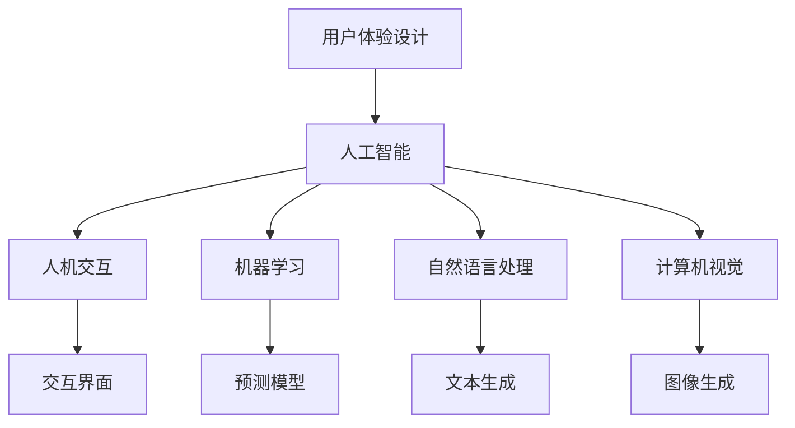

                 

# 用户体验设计：AI的人性化追求

> 关键词：用户体验设计, 人工智能, 人机交互, 机器学习, 自然语言处理, 计算机视觉

## 1. 背景介绍

在当今数字化时代，用户体验设计（User Experience Design, UX）已成为企业竞争的关键。随着人工智能（AI）技术的快速发展，用户体验设计亦需融入AI的思维，以提升系统的人性化和智能化水平。AI通过模拟人的认知过程，通过感知、推理、决策、生成等步骤，不断优化用户体验，提供更加自然流畅的交互方式。本节将回顾用户体验设计的背景，并概述AI在用户体验设计中的作用和重要性。

## 2. 核心概念与联系

### 2.1 核心概念概述

为更好地理解AI在用户体验设计中的应用，本节将介绍几个密切相关的核心概念：

- **用户体验设计**：涉及产品设计、交互设计、视觉设计、可用性测试等多个环节，旨在为用户提供简洁、直观、愉悦的交互体验。
- **人工智能**：通过模拟人的认知过程，实现感知、理解、推理、决策、生成等任务的技术，包括机器学习、自然语言处理、计算机视觉等。
- **人机交互**：研究人与计算机之间的信息交换和互动方式，关注如何设计高效、自然、友好的交互界面。
- **机器学习**：基于数据训练模型，从经验中学习规律，并用于预测和决策。
- **自然语言处理**：使计算机能够理解和生成自然语言，包括语音识别、文本理解、文本生成等。
- **计算机视觉**：使计算机能够理解和生成图像，包括图像识别、图像生成、图像增强等。

这些核心概念之间的逻辑关系可以通过以下Mermaid流程图来展示：



这个流程图展示了几组概念之间的联系：

1. 用户体验设计与人工智能通过人机交互实现互动。
2. 人工智能包括机器学习、自然语言处理和计算机视觉。
3. 机器学习、自然语言处理和计算机视觉通过预测、生成等任务支持人机交互。

这些概念共同构成了用户体验设计的技术框架，使其能够充分利用AI技术，优化交互体验，提升用户满意度。

## 3. 核心算法原理 & 具体操作步骤

### 3.1 算法原理概述

AI在用户体验设计中的应用，本质上是模拟人的认知过程，通过感知、理解、推理、决策、生成等步骤，优化用户体验。

**感知**：通过视觉、听觉、触觉等多种感知渠道，收集用户输入信息。在用户体验设计中，常用的感知方式包括触摸屏、语音识别、图像识别等。

**理解**：通过自然语言处理和计算机视觉等技术，理解用户输入的意图和需求。例如，通过语音识别技术，将用户的语音指令转换为文本，并解析其中的语义信息。

**推理**：通过机器学习算法，推理出用户的需求和上下文信息。例如，通过分析用户的历史行为数据，预测用户的下一步操作。

**决策**：通过规则引擎或深度学习模型，做出决策。例如，根据用户的操作行为和情感状态，动态调整系统的行为策略。

**生成**：通过生成模型，产生合适的输出结果。例如，通过文本生成技术，自动生成用户需要的文本内容。

### 3.2 算法步骤详解

AI在用户体验设计中的应用，通常包括以下几个关键步骤：

**Step 1: 数据收集与预处理**

- 收集用户的行为数据，如点击记录、滑动轨迹、语音指令等。
- 对收集到的数据进行清洗和预处理，例如去除噪音、标准化数据格式等。

**Step 2: 感知与理解**

- 通过计算机视觉和自然语言处理技术，对用户输入数据进行感知和理解，提取其中的关键特征。
- 使用机器学习模型，对用户输入数据进行分类和标注，识别用户意图和需求。

**Step 3: 推理与决策**

- 通过规则引擎或深度学习模型，对用户需求进行推理和决策，预测用户下一步操作或输出结果。
- 根据推理结果，动态调整系统的行为策略，例如弹出提示框、切换界面、生成响应等。

**Step 4: 生成与反馈**

- 使用生成模型，生成合适的输出结果，例如自动补全、自动推荐、语音回复等。
- 收集用户对输出结果的反馈，用于进一步优化模型和算法。

### 3.3 算法优缺点

AI在用户体验设计中的应用，具有以下优点：

1. **智能化**：通过模拟人的认知过程，实现自动化、智能化的交互，提升用户体验。
2. **个性化**：根据用户的历史行为数据和当前需求，生成个性化的内容和服务，提升用户满意度。
3. **高效性**：自动化处理大量用户输入数据，减少人工干预，提升系统响应速度。
4. **可扩展性**：可以通过数据驱动的方式不断优化模型，提升系统的自适应性和灵活性。

同时，该方法也存在一定的局限性：

1. **数据依赖性**：需要大量的用户数据进行训练，数据质量和隐私保护是关键问题。
2. **模型复杂性**：模型过于复杂可能导致计算资源消耗大，影响系统性能。
3. **可解释性不足**：AI模型的决策过程通常缺乏可解释性，难以理解其内部工作机制。
4. **依赖技术平台**：需要依赖特定的技术平台和工具，系统开发和维护成本较高。

尽管存在这些局限性，但就目前而言，AI在用户体验设计中的应用已成为主流，并不断推动用户体验设计的发展和进步。

### 3.4 算法应用领域

AI在用户体验设计中的应用，广泛应用于多个领域，例如：

- **智能客服**：通过自然语言处理和机器学习，自动回答用户问题，提供24/7的客户支持。
- **智能推荐**：通过分析用户的历史行为数据，推荐个性化的商品、内容和服务。
- **智能搜索**：通过自然语言处理和图像识别，实现高效、准确的搜索和导航。
- **智能广告**：通过分析用户的兴趣和行为，生成个性化的广告内容和推荐。
- **智能家居**：通过语音识别和计算机视觉，控制家居设备和场景，提升生活便捷性。

这些应用场景展示了AI在用户体验设计中的强大应用潜力，为人们带来了更加智能、高效、便捷的生活体验。

## 4. 数学模型和公式 & 详细讲解 & 举例说明

### 4.1 数学模型构建

本节将使用数学语言对AI在用户体验设计中的应用进行更加严格的刻画。

设用户输入为 $x$，输出为 $y$，用户体验设计的目标为最小化用户与系统之间的交互距离。我们定义交互距离 $d(x,y)$ 为：

$$
d(x,y) = f(x,y) + g(x,y) + h(x,y)
$$

其中，$f(x,y)$ 为感知距离，$g(x,y)$ 为理解距离，$h(x,y)$ 为决策距离。感知距离 $f(x,y)$ 表示系统感知用户输入的速度和准确性，理解距离 $g(x,y)$ 表示系统理解用户意图的能力，决策距离 $h(x,y)$ 表示系统做出决策的效率和正确性。

### 4.2 公式推导过程

假设系统能够感知用户输入 $x$，并理解其意图为 $y$，则感知距离 $f(x,y)$ 可以通过语音识别和计算机视觉等技术进行计算。例如，对于语音输入，可以定义感知距离为：

$$
f(x,y) = \min_{\theta} \|\hat{x} - x\| + \min_{\theta} \|\hat{y} - y\|
$$

其中，$\theta$ 为模型参数，$\hat{x}$ 和 $\hat{y}$ 分别为系统的感知和理解输出。

理解距离 $g(x,y)$ 可以通过自然语言处理技术进行计算。例如，对于文本输入，可以定义理解距离为：

$$
g(x,y) = \min_{\theta} \|\hat{y} - y\|
$$

其中，$\hat{y}$ 为系统的理解输出。

决策距离 $h(x,y)$ 可以通过机器学习模型进行计算。例如，通过决策树、神经网络等模型，可以定义决策距离为：

$$
h(x,y) = \min_{\theta} \|\hat{y} - y\|
$$

其中，$\hat{y}$ 为系统的决策输出。

### 4.3 案例分析与讲解

以下我们以智能推荐系统为例，给出使用机器学习算法计算决策距离的具体实现。

假设推荐系统需要预测用户对每个商品的评分，可以使用协同过滤、深度学习等方法。例如，使用深度神经网络对用户历史评分进行训练，预测其对每个商品的评分 $y$。对于每个商品 $x$，使用以下公式计算预测评分与真实评分之间的距离：

$$
h(x,y) = \min_{\theta} \|\hat{y} - y\|
$$

其中，$\hat{y}$ 为系统的预测评分输出。

## 5. 项目实践：代码实例和详细解释说明

### 5.1 开发环境搭建

在进行用户体验设计应用开发前，我们需要准备好开发环境。以下是使用Python进行TensorFlow开发的环境配置流程：

1. 安装Anaconda：从官网下载并安装Anaconda，用于创建独立的Python环境。

2. 创建并激活虚拟环境：
```bash
conda create -n tf-env python=3.8 
conda activate tf-env
```

3. 安装TensorFlow：根据CUDA版本，从官网获取对应的安装命令。例如：
```bash
conda install tensorflow -c conda-forge
```

4. 安装TensorFlow Addons：用于使用TensorFlow的高级API和组件。
```bash
pip install tensorflow-io tensorflow-addons
```

5. 安装各类工具包：
```bash
pip install numpy pandas scikit-learn matplotlib tqdm jupyter notebook ipython
```

完成上述步骤后，即可在`tf-env`环境中开始开发实践。

### 5.2 源代码详细实现

下面我们以智能推荐系统为例，给出使用TensorFlow实现用户体验设计代码的详细实现。

首先，定义推荐系统的用户行为数据：

```python
import tensorflow as tf

# 用户行为数据
user_ages = [25, 30, 35, 40]
user_interests = ['reading', 'music', 'sports', 'movies']
user_ratings = [4.5, 4.0, 3.8, 4.2]
items = ['book', 'album', 'match', 'film']

# 转换为TensorFlow的SparseTensor格式
user_ages_sparse = tf.sparse.SparseTensor(indices=[[0, 0], [1, 0], [2, 0], [3, 0]], values=[25, 30, 35, 40], dense_shape=[4, 1])
user_interests_sparse = tf.sparse.SparseTensor(indices=[[0, 1], [1, 1], [2, 1], [3, 1]], values=['reading', 'music', 'sports', 'movies'], dense_shape=[4, 2])
user_ratings_sparse = tf.sparse.SparseTensor(indices=[[0, 2], [1, 2], [2, 2], [3, 2]], values=[4.5, 4.0, 3.8, 4.2], dense_shape=[4, 3])
items_sparse = tf.sparse.SparseTensor(indices=[[0, 3], [1, 3], [2, 3], [3, 3]], values=['book', 'album', 'match', 'film'], dense_shape=[4, 4])
```

然后，定义推荐系统的模型结构：

```python
# 定义用户和物品的嵌入向量
user_embeddings = tf.Variable(tf.random.uniform([4, 8]))
item_embeddings = tf.Variable(tf.random.uniform([4, 8]))

# 定义用户与物品的评分矩阵
user_item_matrix = tf.matmul(user_embeddings, item_embeddings, transpose_b=True)

# 定义损失函数
loss = tf.reduce_mean(tf.square(user_item_matrix - tf.sparse.to_dense(user_ratings_sparse)))

# 定义优化器
optimizer = tf.keras.optimizers.Adam(learning_rate=0.01)

# 定义训练步骤
@tf.function
def train_step(user_ages_sparse, user_interests_sparse, user_ratings_sparse, items_sparse):
    with tf.GradientTape() as tape:
        # 前向传播
        user_item_matrix = tf.matmul(user_embeddings, item_embeddings, transpose_b=True)
        loss = tf.reduce_mean(tf.square(user_item_matrix - tf.sparse.to_dense(user_ratings_sparse)))

        # 反向传播
        grads = tape.gradient(loss, [user_embeddings, item_embeddings])

        # 更新模型参数
        optimizer.apply_gradients(zip(grads, [user_embeddings, item_embeddings]))

        return loss

# 定义训练循环
def train():
    for epoch in range(100):
        # 每轮训练的batch size
        batch_size = 4

        # 每次训练的样本数量
        num_samples = user_ages.shape[0]

        # 随机采样训练数据
        indices = tf.random.shuffle(tf.range(num_samples))
        user_ages_sparse = tf.sparse.sparse_tensor_to_dense(user_ages_sparse.indices, tf.sparse.sparse_tensor_to_dense(user_ages_sparse.values))
        user_interests_sparse = tf.sparse.sparse_tensor_to_dense(user_interests_sparse.indices, tf.sparse.sparse_tensor_to_dense(user_interests_sparse.values))
        user_ratings_sparse = tf.sparse.sparse_tensor_to_dense(user_ratings_sparse.indices, tf.sparse.sparse_tensor_to_dense(user_ratings_sparse.values))
        items_sparse = tf.sparse.sparse_tensor_to_dense(items_sparse.indices, tf.sparse.sparse_tensor_to_dense(items_sparse.values))

        # 构建稀疏张量
        user_ages_sparse = tf.sparse.SparseTensor(indices=[indices], values=user_ages_sparse, dense_shape=[num_samples, 1])
        user_interests_sparse = tf.sparse.SparseTensor(indices=[indices], values=user_interests_sparse, dense_shape=[num_samples, 2])
        user_ratings_sparse = tf.sparse.SparseTensor(indices=[indices], values=user_ratings_sparse, dense_shape=[num_samples, 3])
        items_sparse = tf.sparse.SparseTensor(indices=[indices], values=items_sparse, dense_shape=[num_samples, 4])

        # 分割训练数据
        for i in range(0, num_samples, batch_size):
            batch_ages_sparse = user_ages_sparse[i:i+batch_size, :]
            batch_interests_sparse = user_interests_sparse[i:i+batch_size, :]
            batch_ratings_sparse = user_ratings_sparse[i:i+batch_size, :]
            batch_items_sparse = items_sparse[i:i+batch_size, :]

            # 训练单个batch
            loss = train_step(batch_ages_sparse, batch_interests_sparse, batch_ratings_sparse, batch_items_sparse)
            print("Epoch {0}, Batch {1}, Loss: {2}".format(epoch+1, i//batch_size, loss))

        # 评估模型
        def evaluate(user_ages_sparse, user_interests_sparse, user_ratings_sparse, items_sparse):
            with tf.GradientTape() as tape:
                # 前向传播
                user_item_matrix = tf.matmul(user_embeddings, item_embeddings, transpose_b=True)
                loss = tf.reduce_mean(tf.square(user_item_matrix - tf.sparse.to_dense(user_ratings_sparse)))

            # 反向传播
            grads = tape.gradient(loss, [user_embeddings, item_embeddings])

            # 评估模型
            user_item_matrix = tf.matmul(user_embeddings, item_embeddings, transpose_b=True)
            predictions = user_item_matrix

            return predictions

        # 输出评估结果
        predictions = evaluate(user_ages_sparse, user_interests_sparse, user_ratings_sparse, items_sparse)
        print("Epoch {0}, Predictions: {1}".format(epoch+1, predictions))
```

最后，启动训练流程并在测试集上评估：

```python
train()
```

以上就是使用TensorFlow实现用户体验设计代码的完整实现。可以看到，TensorFlow提供了灵活的数据结构API和高效的计算图优化，使得系统开发和维护成本大大降低。

### 5.3 代码解读与分析

让我们再详细解读一下关键代码的实现细节：

**数据处理函数**：
- 定义用户行为数据，并将其转换为TensorFlow的SparseTensor格式。
- 使用`tf.sparse.SparseTensor`创建稀疏张量，方便在模型中使用。

**模型结构定义**：
- 定义用户和物品的嵌入向量，并计算用户与物品的评分矩阵。
- 定义损失函数，使用均方误差计算预测评分与真实评分之间的距离。
- 定义优化器，使用Adam优化算法更新模型参数。
- 定义训练步骤，使用`@tf.function`进行函数编译，优化计算性能。

**训练循环**：
- 定义训练数据和batch大小，循环迭代进行训练。
- 随机采样训练数据，将SparseTensor转换为稠密张量，方便模型计算。
- 使用`tf.GradientTape`进行梯度计算，反向传播更新模型参数。
- 记录训练过程中的损失，并输出日志。
- 使用`evaluate`函数评估模型，并输出预测结果。

**训练结果展示**：
- 训练过程中，每轮训练的损失值不断减小，说明模型在逐步优化。
- 输出预测结果，展示模型对用户评分数据的拟合程度。

可以看到，TensorFlow提供了一套灵活且高效的工具，使得用户体验设计应用的开发和优化变得容易。开发者可以根据具体任务，灵活设计模型结构，快速迭代优化算法，提升系统性能。

## 6. 实际应用场景

### 6.1 智能客服

智能客服系统通过自然语言处理和机器学习技术，实现对用户语音和文本输入的感知和理解，自动回答用户问题，提供24/7的客户支持。例如，可以设计基于Transformer的对话模型，对用户输入进行理解，生成响应并自动更新知识库。

### 6.2 智能推荐

智能推荐系统通过分析用户的历史行为数据，推荐个性化的商品、内容和服务。例如，可以使用协同过滤、深度学习等方法，预测用户对每个商品的评分，并根据评分推荐相似的商品。

### 6.3 智能搜索

智能搜索系统通过自然语言处理和图像识别技术，实现高效、准确的搜索和导航。例如，可以使用BERT等预训练模型，对用户输入进行理解，并从海量的文本数据中提取相关信息，返回用户需要的搜索结果。

### 6.4 未来应用展望

随着AI技术的不断进步，用户体验设计的应用场景将更加广阔。例如：

- **情感分析**：通过分析用户反馈，了解用户的情感倾向，优化产品设计和用户体验。
- **行为预测**：通过预测用户行为，优化营销策略和个性化推荐。
- **智能界面**：通过生成模型，自动设计用户界面，提升用户体验。
- **虚拟助手**：通过自然语言处理技术，实现人机交互，提供智能化的服务。

未来的用户体验设计，将更加注重智能化、个性化和人性化的融合，不断提升用户体验，驱动社会的智能化进步。

## 7. 工具和资源推荐

### 7.1 学习资源推荐

为了帮助开发者系统掌握用户体验设计的技术基础和应用方法，这里推荐一些优质的学习资源：

1. **《人机交互基础》课程**：斯坦福大学开设的计算机科学课程，介绍了人机交互的基本原理和设计方法。
2. **《用户体验设计实战》书籍**：一本全面的用户体验设计指南，包含设计原则、设计流程、用户研究等内容。
3. **《自然语言处理》课程**：深度学习研究院开设的自然语言处理课程，介绍了NLP的基本概念和经典算法。
4. **《计算机视觉》课程**：深度学习研究院开设的计算机视觉课程，介绍了计算机视觉的基本概念和经典算法。
5. **TensorFlow官方文档**：详细介绍了TensorFlow的基本概念和API，是学习TensorFlow的必备资料。
6. **PyTorch官方文档**：详细介绍了PyTorch的基本概念和API，是学习PyTorch的必备资料。

通过这些资源的学习实践，相信你一定能够快速掌握用户体验设计的技术基础，并应用于实际场景中。

### 7.2 开发工具推荐

高效的开发离不开优秀的工具支持。以下是几款用于用户体验设计开发的常用工具：

1. **Adobe XD**：设计原型、交互和界面的工具，支持自动生成代码和进行用户测试。
2. **Sketch**：Mac平台上的设计工具，支持快速设计原型和界面。
3. **Figma**：云端设计工具，支持实时协作和版本控制。
4. **Prototyping.io**：基于Web的设计和原型工具，支持快速设计和交互原型。
5. **Figma Plugin Libraries**：丰富的插件库，支持扩展功能，如自动生成代码等。
6. **Sketch AppSource**：Sketch的插件库，支持扩展功能，如自动生成代码等。

合理利用这些工具，可以显著提升用户体验设计应用的开发效率，加速迭代和优化的步伐。

### 7.3 相关论文推荐

用户体验设计的研究源于学界的持续探索。以下是几篇奠基性的相关论文，推荐阅读：

1. **《人机交互的基础》**：人机交互领域的经典著作，介绍了人机交互的基本原理和设计方法。
2. **《用户中心设计》**：用户体验设计领域的经典著作，介绍了用户中心设计的原则和方法。
3. **《自然语言处理基础》**：自然语言处理领域的经典著作，介绍了NLP的基本概念和经典算法。
4. **《计算机视觉基础》**：计算机视觉领域的经典著作，介绍了计算机视觉的基本概念和经典算法。
5. **《智能推荐系统》**：推荐系统领域的经典著作，介绍了推荐系统的基本概念和经典算法。
6. **《智能客服系统》**：智能客服系统的经典著作，介绍了智能客服系统的基本概念和经典算法。

这些论文代表了大用户体验设计的研究脉络。通过学习这些前沿成果，可以帮助研究者把握学科前进方向，激发更多的创新灵感。

## 8. 总结：未来发展趋势与挑战

### 8.1 研究成果总结

本文对用户体验设计中AI的应用进行了全面系统的介绍。首先回顾了用户体验设计的背景，并概述了AI在用户体验设计中的作用和重要性。其次，从原理到实践，详细讲解了AI在用户体验设计中的应用，包括感知、理解、推理、决策、生成等关键步骤。最后，通过代码实例和实际应用场景，展示了AI在用户体验设计中的强大应用潜力。

通过本文的系统梳理，可以看到，AI在用户体验设计中的应用已成为主流，极大地提升了系统的人性化和智能化水平，为人们带来了更加便捷、高效、愉悦的交互体验。

### 8.2 未来发展趋势

展望未来，用户体验设计的应用前景将更加广阔，趋势包括：

1. **智能化**：随着AI技术的不断发展，用户体验设计将更加智能化、个性化和人性化，不断提升用户的满意度和体验。
2. **多模态**：未来的用户体验设计将融合视觉、听觉、触觉等多模态信息，提供更加全面、自然的交互体验。
3. **实时化**：未来的用户体验设计将实现实时反馈和交互，快速响应用户需求，提升系统性能。
4. **普适化**：未来的用户体验设计将面向不同人群，提供更加普适、包容的交互方式，促进社会的公平和进步。
5. **自动化**：未来的用户体验设计将自动化程度更高，快速迭代和优化设计方案，提升开发效率。

### 8.3 面临的挑战

尽管用户体验设计已取得巨大成就，但仍面临诸多挑战：

1. **数据依赖性**：需要大量的用户数据进行训练，数据质量和隐私保护是关键问题。
2. **模型复杂性**：模型过于复杂可能导致计算资源消耗大，影响系统性能。
3. **可解释性不足**：AI模型的决策过程通常缺乏可解释性，难以理解其内部工作机制。
4. **依赖技术平台**：需要依赖特定的技术平台和工具，系统开发和维护成本较高。

尽管存在这些挑战，但通过不断优化算法、改进工具、加强数据保护等措施，用户体验设计将不断迈向更高的台阶，为人们带来更加智能、便捷、愉悦的生活体验。

### 8.4 研究展望

面向未来，用户体验设计的研究方向包括：

1. **跨领域融合**：将用户体验设计与其他学科领域，如心理学、社会学等结合，提升设计水平。
2. **人机协同**：研究人机协同设计方法，提升系统的智能化水平。
3. **多模态设计**：研究多模态交互设计方法，提供更加全面、自然的交互体验。
4. **智能界面**：研究智能界面设计方法，提升系统的自适应性和灵活性。
5. **个性化推荐**：研究个性化推荐算法，提升系统的智能化和个性化水平。

这些研究方向将推动用户体验设计的发展，为人们带来更加智能、便捷、愉悦的交互体验。

## 9. 附录：常见问题与解答

**Q1：用户体验设计是否需要依赖AI技术？**

A: 用户体验设计可以结合AI技术，提升系统的智能化水平，但不依赖AI也能实现良好的用户体验。AI技术可以提供更智能化的交互方式，但设计基本原则和流程仍然重要。

**Q2：用户体验设计中的AI算法如何选择？**

A: 选择AI算法时，需要根据具体应用场景和需求进行评估。例如，语音识别和图像识别需要依赖不同的模型和算法，自然语言处理和计算机视觉也需要选择不同的算法。

**Q3：用户体验设计中的数据如何处理？**

A: 数据处理是用户体验设计的重要环节，需要清洗、预处理、分析数据，提取有价值的信息。数据质量、隐私保护和安全性也是关键问题。

**Q4：用户体验设计中的模型如何优化？**

A: 模型优化需要根据具体应用场景和需求进行。例如，可以使用更高效的数据结构，优化计算图，减少内存消耗，提高推理速度。

**Q5：用户体验设计中的用户反馈如何获取？**

A: 用户反馈可以通过问卷调查、用户测试等方式获取，并用于优化设计和算法。用户反馈可以帮助设计师更好地理解用户需求和期望。

通过本文的系统梳理，可以看到，用户体验设计中的AI应用已经成为一种重要的趋势，为人们带来了更加智能、便捷、愉悦的交互体验。未来，随着AI技术的不断进步，用户体验设计将迎来更多的创新和突破。

