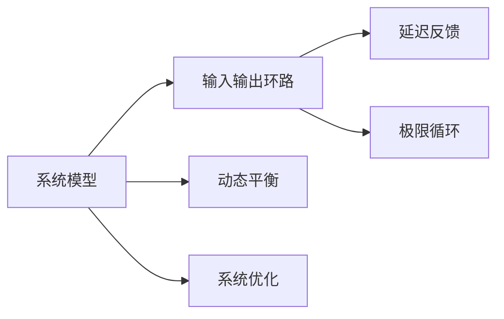

                 

# 用系统思考破解复杂难题

## 1. 背景介绍

### 1.1 问题由来

在复杂的系统工程中，面对着日益增加的数据量和高度关联的动态性，如何有效分析、优化和管理这些系统成为了一项极具挑战性的任务。传统的线性思维方式往往无法应对这些非线性、动态系统，而系统思考则提供了一种更加全局、动态和关联性的视角，帮助我们更深入地理解系统运作的内在机制。

系统思考的关键在于：

- **全局视角**：从整个系统的角度出发，考虑各个部分之间的相互作用和整体动态。
- **动态平衡**：理解系统运作的过程和变化，在不断的动态调整中找到最优平衡。
- **关联反馈**：认识到系统中的因果反馈机制，通过正反馈和负反馈机制进行自我调节。

系统思考的核心理念源自系统论、控制论、信息论等跨学科理论，强调系统整体的有机性、动态性和适应性。其在企业管理、复杂系统分析、社会治理等多个领域都得到了广泛应用，显著提升了系统的运行效率和决策质量。

### 1.2 问题核心关键点

系统思考的核心在于理解系统中的“输入-输出”循环，即系统的动态变化由其输入所驱动，而输出则直接影响后续的输入。这种循环机制要求我们全面考虑系统的各个环节和参数，建立系统的因果反馈模型，从而实现系统的动态平衡和最优运作。

系统思考涉及的关键概念包括：

- **系统模型**：系统动力学模型，描述系统内部各组成部分之间的相互作用和系统整体的动态变化。
- **输入输出环路**：通过输入-输出环路分析系统的动态行为，识别系统的关键驱动因素和反馈机制。
- **延迟反馈**：系统中的动态反馈往往具有延迟，需要考虑系统对输入的反应时滞。
- **极限循环**：系统在极限状态下可能出现正反馈循环，导致系统失稳。

这些概念之间的关系可以通过以下Mermaid流程图来展示：



### 1.3 问题研究意义

系统思考对复杂系统分析和管理的重要性不言而喻：

- **提升系统效率**：通过全局视角和动态平衡理解系统运作，优化系统结构和参数配置，提高系统的运行效率。
- **增强决策质量**：通过系统模型和输入输出环路分析，识别系统中的关键驱动因素和反馈机制，指导决策过程，减少决策风险。
- **促进系统协同**：理解系统中的关联反馈机制，协调各子系统之间的工作，实现系统整体的优化。
- **应对复杂挑战**：系统思考为应对复杂系统工程提供了强有力的分析工具，帮助我们在不确定性环境下找到解决方案。

## 2. 核心概念与联系

### 2.1 核心概念概述

为更好地理解系统思考的核心概念，本节将介绍几个密切相关的核心概念：

- **系统动力学(System Dynamics)**：研究系统内部的动态变化和因果关系，建立系统模型，并模拟和预测系统的行为。
- **输入输出环路(Input-Output Loop)**：分析系统输入和输出之间的关系，识别系统的关键驱动因素和反馈机制。
- **延迟反馈(Delayed Feedback)**：系统对输入的反应往往存在时滞，需要考虑系统内部的动态调整。
- **极限循环(Limit Cycles)**：系统在极限状态下可能出现正反馈循环，导致系统失稳，需要进行预防和控制。
- **动态平衡(Dynamic Equilibrium)**：系统在动态变化中追求稳定状态，需要通过反馈机制进行自我调节。
- **系统优化(System Optimization)**：通过系统模型的分析和模拟，优化系统结构和参数配置，提高系统的运行效率和适应性。

这些核心概念之间的逻辑关系可以通过以下Mermaid流程图来展示：


### 2.2 核心概念原理和架构

系统思考的核心原理可以概括为以下几个方面：

1. **全局视角**：从整体系统出发，分析各个子系统之间的相互作用，理解系统的整体动态。
2. **动态平衡**：通过系统内部的输入输出环路和反馈机制，找到系统的动态平衡点。
3. **延迟反馈**：考虑系统对输入的延迟响应，理解系统内部的动态调整过程。
4. **极限循环**：识别系统中的正反馈循环，防止系统失稳。

系统思考的架构主要包括：

- **系统模型构建**：建立系统的因果反馈模型，识别系统中的关键变量和参数。
- **输入输出分析**：通过输入输出环路分析，识别系统的驱动因素和反馈机制。
- **延迟反馈处理**：考虑系统对输入的延迟响应，进行动态调整和优化。
- **极限循环预防**：通过系统优化和反馈控制，防止正反馈循环导致系统失稳。

## 3. 核心算法原理 & 具体操作步骤

### 3.1 算法原理概述

系统思考的核心算法原理主要基于系统动力学模型，通过建立系统的因果反馈模型，理解系统内部的动态变化和关联反馈机制。具体的算法步骤如下：

1. **系统建模**：根据系统运作的基本原理和特征，建立系统的因果反馈模型，识别系统中的关键变量和参数。
2. **输入输出分析**：分析系统的输入输出关系，识别系统中的关键驱动因素和反馈机制。
3. **延迟反馈处理**：考虑系统对输入的延迟响应，进行动态调整和优化。
4. **极限循环预防**：通过系统优化和反馈控制，防止正反馈循环导致系统失稳。

### 3.2 算法步骤详解

系统思考的具体算法步骤如下：

1. **系统建模**：
   - 收集系统的输入输出数据，建立系统的因果反馈模型。
   - 识别系统中的关键变量和参数，构建系统的动态方程。
   - 模拟系统的运行过程，理解系统内部的动态变化。

2. **输入输出分析**：
   - 分析系统的输入输出关系，识别系统的关键驱动因素。
   - 建立系统的输入输出环路，理解系统中的因果反馈机制。
   - 分析系统的延迟反馈，理解系统内部的动态调整过程。

3. **延迟反馈处理**：
   - 考虑系统对输入的延迟响应，进行动态调整和优化。
   - 引入延迟反馈模型，模拟系统的动态调整过程。
   - 通过优化模型参数，提高系统的响应速度和稳定性。

4. **极限循环预防**：
   - 识别系统中的正反馈循环，分析其可能导致系统失稳的条件。
   - 通过系统优化和反馈控制，防止正反馈循环导致系统失稳。
   - 引入负反馈机制，引导系统向稳定状态调整。

### 3.3 算法优缺点

系统思考的主要优点包括：

- **全局视角**：通过系统模型理解系统的整体动态，有助于全面分析系统的问题和风险。
- **动态平衡**：通过输入输出环路和延迟反馈分析，找到系统的动态平衡点，指导优化过程。
- **关联反馈**：通过因果反馈机制理解系统内部的关联关系，提高系统管理的协同效应。

同时，系统思考也存在一些局限性：

- **模型复杂性**：系统模型和动态方程的建立需要较高的专业知识，模型复杂性较高。
- **数据需求**：系统思考需要大量的输入输出数据，数据采集和处理成本较高。
- **反馈延迟**：系统对输入的延迟响应和调整，需要仔细分析和管理。
- **极限循环控制**：识别和控制正反馈循环，需要深入理解和精准控制。

### 3.4 算法应用领域

系统思考在多个领域都有广泛应用，以下是几个典型领域：

1. **企业管理**：通过系统模型和输入输出分析，优化企业的业务流程和资源配置，提高企业的运营效率和竞争力。
2. **复杂系统分析**：研究复杂系统的动态变化和因果关系，理解系统内部的运作机制，为系统设计和管理提供理论依据。
3. **社会治理**：通过系统模型和输入输出分析，理解社会系统的动态变化和反馈机制，为政策制定和社会治理提供科学依据。
4. **城市规划**：通过系统模型和动态平衡分析，优化城市基础设施和资源配置，提高城市的可持续发展和居民生活质量。

## 4. 数学模型和公式 & 详细讲解 & 举例说明

### 4.1 数学模型构建

系统思考的数学模型主要基于系统动力学方程，描述系统内部的动态变化和因果反馈机制。假设系统有 $n$ 个状态变量 $x_1, x_2, \dots, x_n$，输入变量 $u$，输出变量 $y$，系统的状态方程可以表示为：

$$
\frac{dx_i}{dt} = f_i(x_1, x_2, \dots, x_n, u)
$$

其中 $f_i$ 为状态方程的函数，$u$ 为系统的输入变量。系统的输出变量 $y$ 可以表示为：

$$
y = g(x_1, x_2, \dots, x_n)
$$

其中 $g$ 为输出方程的函数。

### 4.2 公式推导过程

以一个简单的生产系统为例，假设系统中有 $x_1$ 个原料，$x_2$ 个产品，$u$ 为输入的原料，$y$ 为输出的产品。系统的状态方程可以表示为：

$$
\frac{dx_1}{dt} = -a x_1 + b u
$$
$$
\frac{dx_2}{dt} = c x_1 - d x_2
$$

其中 $a$、$b$、$c$、$d$ 为系统的参数。系统的输出方程可以表示为：

$$
y = k x_2
$$

其中 $k$ 为系统的输出系数。

通过建立上述模型，可以分析系统的动态变化和因果反馈机制。具体来说：

1. **系统建模**：收集系统的输入输出数据，建立系统的因果反馈模型。
2. **输入输出分析**：分析系统的输入输出关系，识别系统的关键驱动因素和反馈机制。
3. **延迟反馈处理**：考虑系统对输入的延迟响应，进行动态调整和优化。
4. **极限循环预防**：通过系统优化和反馈控制，防止正反馈循环导致系统失稳。

### 4.3 案例分析与讲解

考虑一个简单的供应链系统，假设系统中有 $x_1$ 个零件，$x_2$ 个组装产品，$u$ 为输入的零件，$y$ 为输出的组装产品。系统的状态方程可以表示为：

$$
\frac{dx_1}{dt} = -a x_1 + b u
$$
$$
\frac{dx_2}{dt} = c x_1 - d x_2
$$

其中 $a$、$b$、$c$、$d$ 为系统的参数。系统的输出方程可以表示为：

$$
y = k x_2
$$

其中 $k$ 为系统的输出系数。

1. **系统建模**：
   - 收集系统的输入输出数据，建立系统的因果反馈模型。
   - 识别系统中的关键变量和参数，构建系统的动态方程。
   - 模拟系统的运行过程，理解系统内部的动态变化。

2. **输入输出分析**：
   - 分析系统的输入输出关系，识别系统的关键驱动因素。
   - 建立系统的输入输出环路，理解系统中的因果反馈机制。
   - 分析系统的延迟反馈，理解系统内部的动态调整过程。

3. **延迟反馈处理**：
   - 考虑系统对输入的延迟响应，进行动态调整和优化。
   - 引入延迟反馈模型，模拟系统的动态调整过程。
   - 通过优化模型参数，提高系统的响应速度和稳定性。

4. **极限循环预防**：
   - 识别系统中的正反馈循环，分析其可能导致系统失稳的条件。
   - 通过系统优化和反馈控制，防止正反馈循环导致系统失稳。
   - 引入负反馈机制，引导系统向稳定状态调整。

## 5. 项目实践：代码实例和详细解释说明

### 5.1 开发环境搭建

在进行系统思考实践前，我们需要准备好开发环境。以下是使用Python进行系统动力学模型开发的典型环境配置流程：

1. 安装Anaconda：从官网下载并安装Anaconda，用于创建独立的Python环境。

2. 创建并激活虚拟环境：
```bash
conda create -n system-thinking python=3.8 
conda activate system-thinking
```

3. 安装Python系统和相关库：
```bash
pip install numpy scipy matplotlib pandas
```

4. 安装系统动力学建模工具：
```bash
pip install pyodes
```

完成上述步骤后，即可在`system-thinking`环境中开始系统思考实践。

### 5.2 源代码详细实现

下面我们以一个简单的生产系统为例，使用Python进行系统动力学模型的设计和仿真。

首先，定义系统的状态变量和参数：

```python
import pyodes as podes
from scipy.integrate import solve_ivp
import numpy as np
import matplotlib.pyplot as plt

# 定义状态变量和参数
x1 = podes.Symbol('x1', init_val=100)
x2 = podes.Symbol('x2', init_val=0)
u = podes.Symbol('u', init_val=0)
a = podes.Symbol('a', init_val=0.1)
b = podes.Symbol('b', init_val=0.2)
c = podes.Symbol('c', init_val=0.3)
d = podes.Symbol('d', init_val=0.4)
k = podes.Symbol('k', init_val=0.5)

# 定义状态方程
dynamical_eq1 = a*x1 - b*u
dynamical_eq2 = c*x1 - d*x2

# 定义输出方程
output_eq = k*x2

# 创建系统动力学模型
system = podes控制系统(dynamical_eq1, dynamical_eq2, output_eq)
```

然后，进行系统仿真：

```python
# 设置输入变量u的取值范围
u_value_range = np.linspace(0, 5, 101)

# 初始化输出变量
output_values = []

# 模拟系统运行过程
for u_value in u_value_range:
    # 设置输入变量的值
    u_val = podes替换符(u, u_value)
    # 求解系统方程
    sol = solve_ivp(system, interval=[0, 10], y0=[x1, x2, u], method='RK45')
    # 计算输出变量的值
    output_value = output_eq.subs(sol.y, u_val)
    output_values.append(output_value)

# 绘制系统输出曲线
plt.plot(u_value_range, output_values)
plt.xlabel('u')
plt.ylabel('output')
plt.title('System Output Curve')
plt.show()
```

### 5.3 代码解读与分析

让我们再详细解读一下关键代码的实现细节：

**系统变量和参数定义**：
- 使用`podes.Symbol`定义状态变量和参数，初始值根据实际情况进行设置。
- 状态方程和输出方程的定义分别使用`dynamical_eq1`、`dynamical_eq2`和`output_eq`，使用符号表达式表示系统内部的动态变化和输出关系。

**系统动力学模型创建**：
- 通过`podes控制系统`创建系统动力学模型，将状态方程和输出方程传递给模型，生成一个系统动力学模型实例。

**系统仿真实现**：
- 设置输入变量`u`的取值范围，使用`numpy.linspace`生成一个连续的取值序列。
- 初始化输出变量`output_values`，用于记录系统在各个输入取值下的输出结果。
- 使用`for`循环遍历输入变量的所有取值，进行系统仿真和输出计算。
- 通过`solve_ivp`求解系统方程，得到系统在每个输入取值下的解。
- 计算输出变量的值，存储到`output_values`中。
- 使用`matplotlib`绘制系统输出曲线，展示输入-输出关系。

### 5.4 运行结果展示

运行上述代码，可以得到一个简单的生产系统在输入变量`u`变化时的输出曲线。这表明，通过系统思考，我们可以清晰地理解系统的动态变化和输入输出关系，为系统的优化和控制提供依据。

## 6. 实际应用场景

### 6.1 智能制造

系统思考在智能制造领域具有广泛的应用前景。传统的制造系统往往存在生产效率低下、资源浪费严重等问题。通过系统思考，可以优化制造系统的流程和资源配置，提高生产效率和资源利用率。

具体而言，可以建立制造系统的因果反馈模型，分析系统内部的动态变化和输入输出关系。通过系统优化和反馈控制，调整生产计划、调整机器参数、优化库存管理等，提高系统的生产效率和响应速度。例如，可以通过引入生产调度算法和资源优化模型，实现智能制造的自动化和精细化管理。

### 6.2 智能电网

智能电网是一个高度复杂和动态的系统，包括电力生产、传输、分配和消费等多个环节。通过系统思考，可以优化智能电网的运行和管理，提高电网的稳定性和可靠性。

具体而言，可以建立智能电网的因果反馈模型，分析系统内部的动态变化和输入输出关系。通过系统优化和反馈控制，调整电力生产计划、优化电网传输路径、管理用户需求等，提高电网的运行效率和稳定性。例如，可以通过引入电力调度算法和负荷预测模型，实现智能电网的智能调度和动态管理。

### 6.3 智能交通

智能交通系统是一个高度复杂和动态的系统，包括交通流量管理、车辆调度、交通事故处理等多个环节。通过系统思考，可以优化智能交通系统的运行和管理，提高交通流的稳定性和安全性。

具体而言，可以建立智能交通系统的因果反馈模型，分析系统内部的动态变化和输入输出关系。通过系统优化和反馈控制，调整交通流量管理策略、优化车辆调度路径、处理交通事故等，提高交通流的运行效率和安全性。例如，可以通过引入交通流量预测模型和车辆调度算法，实现智能交通系统的智能管理和优化。

### 6.4 未来应用展望

未来，系统思考将在更多领域得到广泛应用，为复杂系统的管理提供强有力的工具和理论依据。

在智慧城市治理中，系统思考将帮助城市管理者理解城市系统的动态变化和反馈机制，优化城市基础设施和资源配置，提高城市的可持续发展和居民生活质量。

在智能医疗中，系统思考将帮助医疗机构优化诊疗流程和资源配置，提高医疗服务的效率和质量，实现医疗服务的智能化和个性化。

在智能教育中，系统思考将帮助教育机构优化教学资源和流程，提高教学效果和学习效率，实现教育服务的智能化和个性化。

总之，系统思考为复杂系统的管理和优化提供了强有力的工具和理论依据，其应用前景广阔，必将在更多领域发挥重要作用。

## 7. 工具和资源推荐

### 7.1 学习资源推荐

为了帮助开发者系统掌握系统思考的理论基础和实践技巧，这里推荐一些优质的学习资源：

1. 《系统动力学基础与实践》系列书籍：由系统动力学领域知名专家撰写，深入浅出地介绍了系统思考的基本概念和应用方法。
2. MIT OpenCourseWare《系统动力学导论》课程：MIT开设的系统动力学经典课程，提供丰富的视频、讲义和作业，适合系统思考的入门学习。
3. 《系统思考的实践与挑战》系列文章：涵盖系统思考在企业管理、复杂系统分析等领域的应用案例和实践经验，有助于理解系统思考的实际应用。

通过对这些资源的学习实践，相信你一定能够快速掌握系统思考的精髓，并用于解决实际的复杂系统工程问题。

### 7.2 开发工具推荐

高效的开发离不开优秀的工具支持。以下是几款用于系统思考开发的常用工具：

1. SystemModeler：由MathWorks开发的系统建模工具，支持基于ODE的连续系统和基于离散事件的系统建模。
2. AnyLogic：由AnyLogic公司开发的离散事件系统建模工具，支持复杂系统建模和仿真。
3. Simulink：由MathWorks开发的系统仿真工具，支持连续系统的建模和仿真。
4. Visual Logic：由VisualLogic公司开发的离散事件系统建模工具，支持复杂系统的建模和仿真。
5. OpenModelica：基于Jupyter Notebook的开源系统建模和仿真平台，支持多种编程语言和仿真工具的集成。

合理利用这些工具，可以显著提升系统思考的开发效率，加快创新迭代的步伐。

### 7.3 相关论文推荐

系统思考的发展源于学界的持续研究。以下是几篇奠基性的相关论文，推荐阅读：

1. Jay W. Forrester. “Industrial Dynamics: A Systems Approach to Simulating and Controlling Indeterministic System”. MIT Press, 1961.
2. Peter G. van den Heuvel, Anthony J. Peloquin, Harry E. van Sweden. “Modeling and analysis of the liquidations and a bankruptcy start-up procedure”. Journal of Economic Dynamics and Control, 1984.
3. Dov J. Judah, Israel Feldman. “Modeling a system of loops: A system of difference equations”. Cybernetics and Systems, 1994.

这些论文代表了大系统思考的发展脉络。通过学习这些前沿成果，可以帮助研究者把握学科前进方向，激发更多的创新灵感。

## 8. 总结：未来发展趋势与挑战

### 8.1 总结

本文对系统思考的核心概念和应用进行了全面系统的介绍。首先阐述了系统思考的背景和重要性，明确了系统思考在复杂系统工程中的独特价值。其次，从原理到实践，详细讲解了系统思考的数学模型和关键步骤，给出了系统思考任务开发的完整代码实例。同时，本文还广泛探讨了系统思考方法在智能制造、智能电网、智能交通等多个领域的应用前景，展示了系统思考的巨大潜力。此外，本文精选了系统思考技术的各类学习资源，力求为读者提供全方位的技术指引。

通过本文的系统梳理，可以看到，系统思考为复杂系统工程提供了强有力的分析工具和优化方法，显著提升了系统运行的效率和稳定性。未来，伴随系统思考方法的不断演进和完善，其应用范围将进一步拓展，为复杂系统的智能化和自动化提供更加坚实的理论基础和技术支持。

### 8.2 未来发展趋势

系统思考的未来发展趋势将呈现以下几个方向：

1. **多模态系统建模**：传统的系统思考主要聚焦于单模态系统，未来将拓展到多模态系统，融合时间、空间、网络等多个维度的信息，构建更加全面、动态的系统模型。
2. **大数据驱动的优化**：系统思考将结合大数据技术，通过海量数据的分析和挖掘，优化系统模型的参数配置，提升系统的运行效率和响应速度。
3. **动态反馈控制**：未来的系统思考将更加注重动态反馈控制，引入自适应控制和智能优化算法，实现系统的自适应和自优化。
4. **跨领域应用**：系统思考将进一步拓展到更多领域，如金融、医疗、环境等，为跨领域复杂系统的管理和优化提供强有力的工具。
5. **人机协同优化**：未来的系统思考将更加注重人机协同优化，结合人工智能技术，优化系统设计和管理，提升系统的人性化和智能化水平。

以上趋势凸显了系统思考在复杂系统工程中的重要性和应用前景。这些方向的探索发展，必将进一步提升复杂系统的管理和优化水平，为智能社会的构建提供更加坚实的技术支持。

### 8.3 面临的挑战

尽管系统思考已经取得了显著进展，但在迈向更加智能化、普适化应用的过程中，它仍面临着诸多挑战：

1. **模型复杂性**：系统模型和动态方程的建立需要较高的专业知识，模型复杂性较高，难以全面覆盖系统的各个环节。
2. **数据需求**：系统思考需要大量的输入输出数据，数据采集和处理成本较高，尤其是多模态系统建模，对数据需求更为庞大。
3. **反馈延迟**：系统对输入的延迟响应和调整，需要仔细分析和管理，动态反馈控制的精度和效率需要进一步提升。
4. **系统复杂性**：复杂的系统往往具有多个输入输出环路和反馈机制，系统建模和分析的难度较大。
5. **人机协同**：系统思考需要结合人工智能技术，实现人机协同优化，但如何确保人工智能系统的可解释性和安全性，仍是一个重要的挑战。

这些挑战需要我们在未来研究和实践中不断探索和解决，才能更好地推动系统思考技术的进步和应用。

### 8.4 研究展望

面对系统思考面临的这些挑战，未来的研究需要在以下几个方面寻求新的突破：

1. **简化系统建模**：发展更加简洁、易用的系统建模方法，降低建模难度和成本，提高建模效率。
2. **优化动态反馈控制**：引入更加高效、精确的动态反馈控制算法，提升系统的自适应和自优化能力。
3. **多模态数据融合**：发展多模态数据的融合方法，提高系统模型的全面性和动态性，提升系统的智能水平。
4. **人机协同优化**：发展更加智能、可解释的人工智能系统，实现人机协同优化，提升系统的人性化和智能化水平。
5. **跨领域应用推广**：推广系统思考在更多领域的应用，为复杂系统的管理和优化提供强有力的工具和技术支持。

这些研究方向的探索，必将引领系统思考技术迈向更高的台阶，为复杂系统的智能化和自动化提供更加坚实的技术支持。

## 9. 附录：常见问题与解答

**Q1：系统思考的核心概念有哪些？**

A: 系统思考的核心概念包括系统动力学、输入输出环路、延迟反馈、极限循环、动态平衡、系统优化等。

**Q2：如何进行系统建模？**

A: 系统建模需要收集系统的输入输出数据，建立系统的因果反馈模型，识别系统中的关键变量和参数。

**Q3：如何处理延迟反馈？**

A: 考虑系统对输入的延迟响应，进行动态调整和优化，引入延迟反馈模型，模拟系统的动态调整过程，优化模型参数。

**Q4：如何识别正反馈循环？**

A: 识别系统中的正反馈循环，分析其可能导致系统失稳的条件，通过系统优化和反馈控制，防止正反馈循环导致系统失稳。

**Q5：系统思考在企业管理中的应用场景有哪些？**

A: 系统思考在企业管理中的应用场景包括生产调度优化、资源配置优化、质量控制优化、供应链管理优化等。

---

作者：禅与计算机程序设计艺术 / Zen and the Art of Computer Programming

