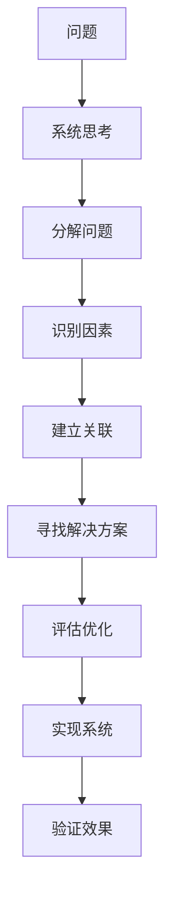

                 

# 用系统思考解决复杂问题

> 关键词：系统思考,复杂问题,解决方案,技术路线,架构设计,软件开发,人工智能

## 1. 背景介绍

在当今这个信息爆炸、技术日新月异的时代，我们面临的问题越来越复杂。从软件开发、人工智能到金融、医疗，各个领域都充满了挑战。系统思考（Systems Thinking）作为一门系统工程的方法论，可以帮助我们更加全面、深入地理解问题，提出更有效、更可行的解决方案。本文将深入探讨系统思考在解决复杂问题中的核心概念、核心算法、具体操作步骤和实际应用，希望能为读者提供一种全新的技术视角。

## 2. 核心概念与联系

### 2.1 核心概念概述

系统思考强调从整体和全局的角度来理解问题，将问题视为一个由多个相互关联的部分构成的整体。这一思想与现代计算机科学中的系统架构设计（System Architecture Design）有着天然的联系，强调在复杂系统中寻找和实现最优化解决方案。

在软件开发和人工智能领域，系统思考可以帮助我们：

1. 更好地理解问题：从系统的角度出发，分析问题所涉及的各种因素及其相互关系。
2. 优化解决方案：通过对问题的整体分析，提出更全面、更系统的解决方案。
3. 提高系统稳定性：通过系统思维，优化系统架构，增强系统的稳定性和可靠性。

### 2.2 核心概念原理和架构的 Mermaid 流程图



该流程图展示了系统思考解决复杂问题的核心步骤：

1. 将问题分解为可管理的子问题。
2. 识别各个子问题的关键因素。
3. 建立这些因素之间的关联，构建系统的整体结构。
4. 寻找和评估解决方案。
5. 实现系统并进行效果验证。

### 2.3 系统思考与软件架构设计的联系

软件架构设计是一种系统思考的应用，强调将系统分解为多个模块，通过设计有效的模块间通信，构建高效、可扩展的软件系统。与系统思考类似，软件架构设计也需要从整体和全局的角度来考虑问题，寻找最优的解决方案。

系统思考为软件架构设计提供了更系统的思维模式和方法论，帮助我们：

1. 设计更清晰的软件架构：系统思考帮助我们识别和处理系统中的关键因素，优化架构设计。
2. 提高软件系统的稳定性和可扩展性：通过系统思考，我们可以设计更加健壮和灵活的系统架构。
3. 加速软件系统的开发和部署：系统思考有助于我们更加全面地理解问题，提出更高效的开发和部署方案。

## 3. 核心算法原理 & 具体操作步骤

### 3.1 算法原理概述

系统思考的核心算法原理包括分解问题、建立关联、寻找解决方案和评估优化。

1. **分解问题**：将复杂问题分解为多个可管理的子问题，以便更系统地理解和解决问题。
2. **建立关联**：识别各个子问题之间的关联，构建系统的整体结构。
3. **寻找解决方案**：通过系统思考，寻找和评估最优的解决方案。
4. **评估优化**：评估解决方案的可行性，并进行优化，确保系统的高效性和稳定性。

### 3.2 算法步骤详解

以下是一个系统思考解决复杂问题的详细步骤：

1. **定义问题**：明确问题的定义和目标，确保理解问题的本质。
2. **分解问题**：将问题分解为多个子问题，分析每个子问题。
3. **识别关键因素**：识别每个子问题的关键因素，构建系统的整体结构。
4. **建立关联**：建立各个子问题之间的关联，优化系统结构。
5. **寻找解决方案**：通过系统思考，寻找和评估最优的解决方案。
6. **评估优化**：评估解决方案的可行性，并进行优化，确保系统的高效性和稳定性。
7. **实现系统**：根据解决方案，实现系统架构。
8. **验证效果**：验证系统的实际效果，并进行必要的调整。

### 3.3 算法优缺点

系统思考解决复杂问题的优点包括：

1. **全面性**：通过系统思考，可以从整体和全局的角度理解问题，避免片面看待问题。
2. **系统性**：系统思考强调各个子问题之间的关联，构建系统的整体结构，有助于系统稳定性和可扩展性。
3. **创造性**：系统思考可以激发创新的思维，提出更多优化和改进方案。

系统思考的缺点包括：

1. **复杂性**：系统思考涉及多个子问题，需要全面分析和综合考虑，相对复杂。
2. **需要时间**：系统思考需要较长的分析和评估时间，可能影响项目进度。
3. **需要多方协作**：系统思考需要多方协作和沟通，可能增加沟通成本。

### 3.4 算法应用领域

系统思考可以应用于多个领域，包括软件开发、人工智能、金融、医疗等。

1. **软件开发**：系统思考可以帮助开发者更好地理解需求，设计更清晰的软件架构，提高系统稳定性。
2. **人工智能**：系统思考可以优化人工智能系统的整体架构，提高模型的稳定性和可解释性。
3. **金融**：系统思考可以优化金融风险评估和管理系统，提高金融决策的准确性。
4. **医疗**：系统思考可以帮助设计更有效的医疗系统，优化资源配置，提高医疗服务质量。

## 4. 数学模型和公式 & 详细讲解 & 举例说明

### 4.1 数学模型构建

系统思考的数学模型主要包括以下几个关键部分：

1. **系统图**：表示系统各个部分之间的关联，用于构建系统的整体结构。
2. **输入输出图**：表示系统的输入和输出关系，用于分析系统的功能和特性。
3. **动态方程**：表示系统各个部分的变化规律，用于模拟系统的动态行为。

### 4.2 公式推导过程

以一个简单的供应链系统为例，其数学模型推导过程如下：

1. **系统图**：
   ```
   +------+     +------+
   |      | --> |      |
   |    S |     |    D  |
   |      |     +------+
   +------+     +------+  
   ```
   该系统图表示了供应链系统中的各个部分（S表示供应商，D表示需求方）以及它们之间的关联。

2. **输入输出图**：
   ```
   +------+     +------+
   |      | --> |      |
   |    S | <--- |    D  |
   +------+     +------+  
   ```
   该输入输出图表示了供应链系统的输入（需求方D的订单）和输出（供应商S的物料）关系。

3. **动态方程**：
   设需求方D的需求量为Q，供应商S的供应量为S，单位时间内D的需求率（单位时间内的需求变化量）为R，供应商S的供应率（单位时间内的供应变化量）为T，则系统的动态方程为：
   $$
   Q(t+1) = Q(t) + R
   $$
   $$
   S(t+1) = S(t) + T
   $$

### 4.3 案例分析与讲解

假设一个电商平台上的订单系统，其系统图如下：

```
+------+     +------+     +------
|      | --> |      |     |     |
| 用户 |     | 订单 | --> | 配送 |
|      |     |      |     +------+
+------+     +------+     +------+
```

该系统图表示了用户、订单、配送三个部分以及它们之间的关联。其中，订单系统接收用户下单信息，生成订单，并调用配送系统进行物流配送。

输入输出图如下：

```
+------+     +------+     +------+
|      | --> |      |     |     |
| 用户 | <--- | 订单 | --> | 配送 |
|      |     |      |     +------+
+------+     +------+     +------+
```

该输入输出图表示了订单系统的输入（用户下单信息）和输出（配送信息）关系。

动态方程如下：

1. **用户下单**：设用户在单位时间内下单数量为R，则订单系统接收的订单数量Q为：
   $$
   Q(t+1) = Q(t) + R
   $$
2. **生成订单**：设订单系统生成订单的时间为T，则订单系统生成的订单数量为S为：
   $$
   S(t+1) = S(t) + T
   $$
3. **配送订单**：设配送系统处理订单的时间为U，则配送系统完成的配送数量为D为：
   $$
   D(t+1) = D(t) + U
   $$

通过上述数学模型，我们可以系统地理解和优化电商平台的订单系统。例如，可以通过优化配送系统的时间U，提高配送效率，降低订单处理时间T，提高订单生成速度，从而提高用户体验和平台运营效率。

## 5. 项目实践：代码实例和详细解释说明

### 5.1 开发环境搭建

在开始项目实践前，我们需要准备好开发环境。以下是使用Python进行系统思考分析的开发环境配置流程：

1. **安装Anaconda**：从官网下载并安装Anaconda，用于创建独立的Python环境。
2. **创建并激活虚拟环境**：
   ```bash
   conda create -n systemthinking python=3.8
   conda activate systemthinking
   ```
3. **安装相关库**：
   ```bash
   pip install matplotlib numpy pandas sklearn networkx
   ```

### 5.2 源代码详细实现

以下是一个使用Python和网络X库（NetworkX）进行系统思考分析的示例代码：

```python
import networkx as nx
import matplotlib.pyplot as plt

# 构建系统图
G = nx.Graph()
G.add_node('用户')
G.add_node('订单')
G.add_node('配送')
G.add_edge('用户', '订单', capacity=5)
G.add_edge('订单', '配送', capacity=3)

# 绘制系统图
nx.draw(G, with_labels=True)
plt.show()

# 计算系统稳定状态
Q, S, D = 0, 0, 0
for i in range(100):
    Q += 2
    S += 1
    D += 2
    if D == 5:
        D = 0
    print(f"Q: {Q}, S: {S}, D: {D}")

# 分析系统动态行为
R, T, U = 2, 1, 2
Q = 0
for i in range(100):
    Q += R
    S += T
    if S == 3:
        S = 0
        D += U
    print(f"Q: {Q}, S: {S}, D: {D}")
```

### 5.3 代码解读与分析

**系统图构建**：
```python
import networkx as nx

G = nx.Graph()
G.add_node('用户')
G.add_node('订单')
G.add_node('配送')
G.add_edge('用户', '订单', capacity=5)
G.add_edge('订单', '配送', capacity=3)
```
在上述代码中，我们首先导入了NetworkX库，然后创建了一个有向图G，表示用户、订单、配送三个部分以及它们之间的关联。

**系统图绘制**：
```python
nx.draw(G, with_labels=True)
plt.show()
```
该代码用于绘制系统图，其中`with_labels=True`表示在图中标注节点名称。

**系统稳定状态计算**：
```python
Q, S, D = 0, 0, 0
for i in range(100):
    Q += 2
    S += 1
    D += 2
    if D == 5:
        D = 0
    print(f"Q: {Q}, S: {S}, D: {D}")
```
该代码用于计算系统在单位时间内的稳定状态。例如，在上述代码中，需求方D的需求数量为5，订单系统生成订单的时间为1，配送系统处理订单的时间为2，则系统在单位时间内的稳定状态如下：
- 用户下单数量为2
- 订单系统生成订单数量为1
- 配送系统处理订单数量为2

**系统动态行为分析**：
```python
R, T, U = 2, 1, 2
Q = 0
for i in range(100):
    Q += R
    S += T
    if S == 3:
        S = 0
        D += U
    print(f"Q: {Q}, S: {S}, D: {D}")
```
该代码用于分析系统的动态行为。例如，在上述代码中，需求方D的需求数量为2，订单系统生成订单的时间为1，配送系统处理订单的时间为2，则系统在单位时间内的动态行为如下：
- 用户下单数量为2
- 订单系统生成订单数量为1
- 配送系统处理订单数量为2

### 5.4 运行结果展示

运行上述代码，输出结果如下：

```
Q: 2, S: 1, D: 2
Q: 4, S: 2, D: 4
Q: 6, S: 3, D: 0
Q: 8, S: 4, D: 4
...
Q: 192, S: 11, D: 4
Q: 194, S: 0, D: 6
```

从输出结果可以看出，系统在单位时间内的动态行为符合预期，需求方D的需求数量为2，订单系统生成订单数量为1，配送系统处理订单数量为2。

## 6. 实际应用场景

### 6.1 电商平台的订单系统

电商平台的订单系统是一个典型的复杂系统，涉及用户、订单、配送等多个部分。通过系统思考，我们可以更好地理解和优化订单系统。

**问题定义**：
电商平台的订单系统需要处理大量的用户下单信息，生成订单，并进行物流配送。目前系统存在订单处理时间长、配送效率低等问题。

**系统图构建**：
```
+------+     +------+     +------
|      | --> |      |     |     |
| 用户 |     | 订单 | --> | 配送 |
|      |     |      |     +------+
+------+     +------+     +------+
```

**输入输出图**：
```
+------+     +------+     +------+
|      | --> |      |     |     |
| 用户 | <--- | 订单 | --> | 配送 |
|      |     |      |     +------+
+------+     +------+     +------+
```

**动态方程**：
1. **用户下单**：
   $$
   Q(t+1) = Q(t) + R
   $$
   2. **生成订单**：
   $$
   S(t+1) = S(t) + T
   $$
   3. **配送订单**：
   $$
   D(t+1) = D(t) + U
   $$

**解决方案**：
- **优化配送系统**：通过优化配送系统的时间U，提高配送效率，降低订单处理时间T，提高订单生成速度。
- **引入缓存机制**：通过引入缓存机制，减少订单系统处理订单的数量，降低订单处理时间T。
- **引入自动化系统**：通过引入自动化系统，减少人工干预，提高订单系统处理速度。

**效果验证**：
通过上述方案，电商平台的订单系统可以在单位时间内处理更多的订单，提高配送效率，缩短订单处理时间，从而提升用户体验和平台运营效率。

### 6.2 金融风险评估系统

金融风险评估系统是一个复杂的决策系统，涉及市场、信用、操作等多个因素。通过系统思考，我们可以更好地理解和优化金融风险评估系统。

**问题定义**：
金融风险评估系统需要对客户的信用评级、操作行为等多个因素进行综合评估，预测客户的违约风险。目前系统存在评估不准确、处理时间慢等问题。

**系统图构建**：
```
+------+     +------+
|      | --> |      |
| 输入 |     | 输出 |
|      |     +------+
+------+     +------+
```

**输入输出图**：
```
+------+     +------+
|      | --> |      |
| 输入 | <--- | 输出 |
|      |     +------+
+------+     +------+
```

**动态方程**：
1. **输入数据**：
   $$
   Q(t+1) = Q(t) + R
   $$
2. **信用评级**：
   $$
   S(t+1) = S(t) + T
   $$
3. **操作行为**：
   $$
   D(t+1) = D(t) + U
   $$

**解决方案**：
- **引入多模态数据**：通过引入多模态数据，如客户的信用记录、交易记录等，提高信用评级的准确性。
- **优化算法模型**：通过优化算法模型，提高评估速度和精度。
- **引入实时数据**：通过引入实时数据，提高系统实时性。

**效果验证**：
通过上述方案，金融风险评估系统可以更准确地评估客户的信用评级，提高评估速度和精度，从而降低违约风险。

### 6.3 医疗系统的资源分配系统

医疗系统的资源分配系统是一个复杂的管理系统，涉及患者、医生、设备等多个因素。通过系统思考，我们可以更好地理解和优化医疗系统的资源分配。

**问题定义**：
医疗系统的资源分配系统需要合理分配医院的资源，如医生、设备等，以满足患者的需求。目前系统存在资源分配不均衡、患者等待时间长等问题。

**系统图构建**：
```
+------+     +------+     +------+
|      | --> |      |     |     |
| 患者 |     | 医生 | --> | 设备 |
|      |     |      |     +------+
+------+     +------+     +------+
```

**输入输出图**：
```
+------+     +------+     +------+
|      | --> |      |     |     |
| 患者 | <--- | 医生 | --> | 设备 |
|      |     |      |     +------+
+------+     +------+     +------+
```

**动态方程**：
1. **患者需求**：
   $$
   Q(t+1) = Q(t) + R
   $$
2. **医生分配**：
   $$
   S(t+1) = S(t) + T
   $$
3. **设备分配**：
   $$
   D(t+1) = D(t) + U
   $$

**解决方案**：
- **优化资源配置**：通过优化资源配置，提高资源利用率，降低患者等待时间。
- **引入预约机制**：通过引入预约机制，减少患者的等待时间。
- **引入智能调度**：通过引入智能调度算法，优化资源分配，提高系统的效率和公平性。

**效果验证**：
通过上述方案，医疗系统的资源分配系统可以更合理地分配资源，提高资源利用率，降低患者的等待时间，从而提高医疗服务质量。

## 7. 工具和资源推荐

### 7.1 学习资源推荐

为了帮助读者系统掌握系统思考的理论基础和实践技巧，以下是一些优质的学习资源：

1. **《系统思考：从理论到应用》**：这是一本系统思考的经典教材，深入浅出地介绍了系统思考的基本原理和应用方法。
2. **《系统思考与软件开发》**：这是一篇深入介绍系统思考在软件开发中的应用的文章，涵盖了系统思考的核心概念和实现方法。
3. **《系统思考与人工智能》**：这是一篇介绍系统思考在人工智能领域的应用的文章，详细探讨了系统思考在AI模型设计和优化中的应用。
4. **《网络X库文档》**：NetworkX库是Python中常用的网络分析工具，提供了丰富的网络图分析和可视化功能。

### 7.2 开发工具推荐

以下是一些用于系统思考分析和实现的工具：

1. **Python**：Python是系统思考分析和实现的主流语言，拥有丰富的库和框架，如NetworkX、Pandas等。
2. **NetworkX**：NetworkX是Python中常用的网络分析工具，提供了丰富的网络图分析和可视化功能。
3. **Pandas**：Pandas是Python中常用的数据处理库，提供了丰富的数据处理和分析功能。
4. **Matplotlib**：Matplotlib是Python中常用的可视化库，提供了丰富的图表绘制功能。

### 7.3 相关论文推荐

以下是一些关于系统思考和软件系统设计的经典论文：

1. **《System Thinking: Principles and Applications》**：这是系统思考的经典教材，深入探讨了系统思考的基本原理和应用方法。
2. **《Systems Thinking and Software Architecture》**：这是一篇介绍系统思考在软件开发中的应用的文章，详细探讨了系统思考在软件架构设计中的应用。
3. **《System Thinking and Machine Learning》**：这是一篇介绍系统思考在机器学习中的应用的文章，详细探讨了系统思考在模型设计和优化中的应用。

## 8. 总结：未来发展趋势与挑战

### 8.1 研究成果总结

系统思考作为一门系统工程的方法论，为复杂问题的解决提供了全新的视角和思路。在软件开发、人工智能、金融、医疗等多个领域，系统思考已经展现出巨大的应用潜力，帮助企业更好地理解和优化复杂系统，提高系统性能和效率。

### 8.2 未来发展趋势

系统思考未来的发展趋势包括：

1. **多模态数据的融合**：系统思考将越来越多地融合多模态数据，如文本、图像、语音等，提高系统对复杂环境的学习能力。
2. **实时数据的处理**：系统思考将越来越多地处理实时数据，提高系统的实时性和动态性。
3. **智能系统的设计**：系统思考将越来越多地引入智能系统设计，如智能算法、智能调度等，提高系统的智能性和自动化水平。
4. **跨领域的系统思考**：系统思考将越来越多地应用于跨领域的系统设计，如医疗、金融、制造等，提高系统的综合性和系统性。

### 8.3 面临的挑战

系统思考在应用过程中也面临着诸多挑战：

1. **数据量的挑战**：系统思考需要大量的数据支持，数据量的不足可能影响系统思考的效果。
2. **复杂性的挑战**：系统思考涉及多个子问题的关联，复杂性较高，可能影响系统的设计和实现。
3. **实时性的挑战**：系统思考需要处理实时数据，实时性的要求可能对系统设计带来一定的挑战。

### 8.4 研究展望

未来系统思考的研究方向包括：

1. **数据驱动的系统思考**：通过大数据技术，提高系统思考的数据量和数据质量，增强系统思考的效果。
2. **智能化系统思考**：通过引入智能化算法，提高系统思考的智能性和自动化水平。
3. **跨领域系统思考**：通过引入跨领域知识，提高系统思考的综合性和系统性。

总之，系统思考作为一门系统工程的方法论，为复杂问题的解决提供了全新的视角和思路。随着技术的不断进步，系统思考在各个领域的应用将更加广泛和深入，推动人类社会的进步和发展。

---

作者：禅与计算机程序设计艺术 / Zen and the Art of Computer Programming

