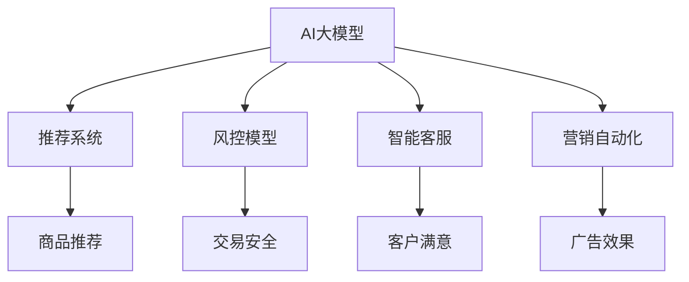

                 

# 电商平台中的AI大模型：从单一场景到全渠道融合

> 关键词：AI大模型,电商平台,全渠道融合,推荐系统,风控模型,智能客服,营销自动化

## 1. 背景介绍

### 1.1 问题由来

随着电商行业的发展，电商平台的规模不断扩大，用户行为模式日趋复杂。为了提升用户体验和交易转化率，电商平台亟需引入先进的人工智能技术。其中，AI大模型通过其在语言理解、知识图谱、视觉识别等方面的强大能力，为电商平台带来了诸多全新的应用场景和显著的性能提升。

然而，传统的人工智能技术往往局限于单一场景的应用，难以将模型统一融入到电商平台的各个环节中。如何将AI大模型与电商平台的全渠道业务深度融合，构建统一、智能、高效的智能平台，成为当下电商平台智能化升级的重要课题。

### 1.2 问题核心关键点

电商平台的智能化升级，主要体现在以下几个方面：

- 商品推荐：通过个性化推荐，提升用户购物体验和转化率。
- 风控管理：通过风险识别和防范，保障交易安全。
- 智能客服：通过自然语言理解，提供24小时在线客服，提升用户满意度。
- 营销自动化：通过智能营销，实现精准投放，提升广告效果。

如何将AI大模型应用到电商平台的这些核心场景，并且实现跨场景、跨业务的深度融合，是电商智能化升级的关键。本文将详细探讨AI大模型在电商平台中的应用实践，并提出一种从单一场景到全渠道融合的解决方案。

## 2. 核心概念与联系

### 2.1 核心概念概述

为更好地理解电商平台中AI大模型的应用实践，本节将介绍几个密切相关的核心概念：

- AI大模型(AI Large Model)：指以Transformer、BERT等架构为基础，在大规模无标签数据上预训练得到的深度学习模型。具备强大的语言理解、知识图谱、视觉识别等能力。
- 推荐系统(Recommender System)：通过用户行为和商品属性预测用户可能感兴趣的商品，提升用户体验和交易转化率。
- 风控模型(Fraud Detection Model)：通过识别异常交易行为，防范欺诈风险，保障交易安全。
- 智能客服(Intelligent Customer Service)：利用自然语言理解技术，提供24小时在线客服，提升用户满意度。
- 营销自动化(Marketing Automation)：通过智能投放和个性化推荐，实现精准营销，提升广告效果。

这些核心概念之间的逻辑关系可以通过以下Mermaid流程图来展示：



这个流程图展示了大模型的核心概念及其之间的关系：

1. AI大模型通过预训练获得了广泛的知识和能力。
2. 推荐系统、风控模型、智能客服、营销自动化等业务，都是通过微调或融合AI大模型，实现特定场景的应用。
3. 各业务场景相互关联，构成了一个全渠道融合的智能电商平台。

## 3. 核心算法原理 & 具体操作步骤

### 3.1 算法原理概述

AI大模型在电商平台中的应用，主要基于微调和融合两种范式：

- 微调：通过在大规模标注数据上对AI大模型进行有监督训练，优化模型对特定任务的理解能力。例如，在推荐系统场景中，通过用户行为和商品属性数据对预训练模型进行微调，使其能够更精准地预测用户可能感兴趣的商品。
- 融合：通过将多个AI大模型组合起来，构建统一的智能决策模型，实现全渠道业务场景的融合。例如，在智能客服场景中，通过融合多模态数据（文本、语音、图像等），实现更全面的用户交互体验。

这两种范式可以互补，共同构建一个全面、高效、智能的电商平台。

### 3.2 算法步骤详解

#### 3.2.1 推荐系统微调范式

1. **数据准备**：收集用户行为数据（浏览记录、购买记录、评分记录等）和商品属性数据（商品分类、品牌、价格等），作为微调数据集。
2. **模型选择**：选择合适的预训练模型（如BERT、GPT等），作为推荐系统的初始化参数。
3. **任务适配**：在模型顶层设计推荐目标函数和损失函数，通常使用交叉熵损失。
4. **超参数设置**：设置学习率、批大小、迭代轮数、正则化技术等，确保微调效果。
5. **模型训练**：在微调数据集上进行训练，使用梯度下降算法更新模型参数，最小化损失函数。
6. **性能评估**：在验证集上评估模型性能，调整超参数，优化模型。
7. **模型部署**：将微调后的模型集成到推荐系统中，实时计算用户推荐结果。

#### 3.2.2 风控模型微调范式

1. **数据准备**：收集交易数据（用户ID、交易时间、交易金额等），标注欺诈行为数据，作为微调数据集。
2. **模型选择**：选择合适的预训练模型（如BERT、GPT等），作为风控模型的初始化参数。
3. **任务适配**：在模型顶层设计风控目标函数和损失函数，通常使用二分类交叉熵损失。
4. **超参数设置**：设置学习率、批大小、迭代轮数、正则化技术等，确保微调效果。
5. **模型训练**：在微调数据集上进行训练，使用梯度下降算法更新模型参数，最小化损失函数。
6. **性能评估**：在验证集上评估模型性能，调整超参数，优化模型。
7. **模型部署**：将微调后的模型集成到风控系统中，实时识别和防范欺诈行为。

#### 3.2.3 智能客服融合范式

1. **数据准备**：收集用户聊天记录、语音交互记录、图像信息等，作为融合数据集。
2. **模型选择**：选择合适的预训练模型（如BERT、GPT等），作为智能客服的初始化参数。
3. **融合技术**：通过多模态融合技术（如Xception、CoT5等），将文本、语音、图像等多模态数据融合为一个统一的理解和回复模型。
4. **任务适配**：在模型顶层设计智能客服目标函数和损失函数，通常使用序列到序列模型。
5. **超参数设置**：设置融合参数、学习率、批大小、迭代轮数、正则化技术等，确保融合效果。
6. **模型训练**：在融合数据集上进行训练，使用梯度下降算法更新模型参数，最小化损失函数。
7. **性能评估**：在验证集上评估模型性能，调整超参数，优化模型。
8. **模型部署**：将融合后的模型集成到智能客服系统中，实时提供自然语言理解和回复服务。

#### 3.2.4 营销自动化融合范式

1. **数据准备**：收集用户行为数据（浏览记录、点击记录、购买记录等）和广告数据（广告ID、广告类型、广告预算等），作为融合数据集。
2. **模型选择**：选择合适的预训练模型（如BERT、GPT等），作为营销自动化的初始化参数。
3. **融合技术**：通过多任务学习和联合训练技术，将多个营销自动化任务（广告投放、个性化推荐等）融合到一个统一的模型中。
4. **任务适配**：在模型顶层设计营销自动化目标函数和损失函数，通常使用多任务损失函数。
5. **超参数设置**：设置融合参数、学习率、批大小、迭代轮数、正则化技术等，确保融合效果。
6. **模型训练**：在融合数据集上进行训练，使用梯度下降算法更新模型参数，最小化损失函数。
7. **性能评估**：在验证集上评估模型性能，调整超参数，优化模型。
8. **模型部署**：将融合后的模型集成到营销自动化系统中，实时提供个性化推荐和广告投放服务。

### 3.3 算法优缺点

AI大模型在电商平台中的应用，具有以下优点：

- 高精度：通过预训练和微调，AI大模型具备强大的语言理解、知识图谱和视觉识别能力，能够实现高精度的推荐、风控和客服。
- 灵活性：通过多模态融合和任务适配，AI大模型能够适应多种业务场景，提升电商平台的智能化水平。
- 可扩展性：通过微调和融合范式，AI大模型能够在电商平台中实现全渠道应用，提升用户体验和交易转化率。

同时，AI大模型也存在一些局限性：

- 数据依赖：AI大模型需要大量高质量标注数据进行微调，对标注数据的获取和质量要求较高。
- 计算资源消耗：AI大模型的参数量较大，计算资源消耗较高，需要在硬件和算法上进行优化。
- 可解释性不足：AI大模型的决策过程难以解释，难以进行调试和优化。

尽管存在这些局限性，AI大模型仍然为电商平台的智能化升级带来了显著的性能提升和业务价值。未来相关研究将集中在如何降低数据依赖、提升模型效率、增强可解释性等方面，以进一步优化电商平台中的应用效果。

### 3.4 算法应用领域

AI大模型在电商平台中的应用，主要集中在以下几个领域：

- **推荐系统**：通过AI大模型对用户行为和商品属性进行建模，实现个性化推荐，提升用户购物体验和转化率。
- **风控模型**：通过AI大模型对交易行为进行分析和识别，防范欺诈风险，保障交易安全。
- **智能客服**：通过AI大模型对用户语言和行为进行分析，提供自然语言理解和回复服务，提升用户满意度。
- **营销自动化**：通过AI大模型对用户行为和广告数据进行建模，实现精准营销，提升广告效果。

除了上述核心场景外，AI大模型还可以应用于搜索优化、库存管理、订单预测等更多电商场景，为电商平台带来全面的智能化升级。

## 4. 数学模型和公式 & 详细讲解 & 举例说明

### 4.1 数学模型构建

假设电商平台中的推荐系统使用AI大模型进行微调，用户行为数据为$X=\{x_i\}_{i=1}^N$，商品属性数据为$Y=\{y_j\}_{j=1}^M$，微调数据集为$D=\{(x_i,y_j)\}_{i,j=1}^{N,M}$。模型的微调目标为最大化推荐精度$P$，最小化损失函数$\mathcal{L}$。

数学模型构建如下：

- 选择预训练模型$M_{\theta}$作为推荐系统的初始化参数。
- 设计推荐目标函数$\mathcal{P}$，通常使用交叉熵损失。
- 设计损失函数$\mathcal{L}$，通常使用二分类交叉熵损失。
- 定义模型输出$\hat{y}$为预测的商品ID。
- 定义真实标签$y$为实际的用户购买ID。

### 4.2 公式推导过程

推荐系统的微调过程可以形式化地表示为：

$$
\hat{y} = M_{\theta}(x)
$$

其中$\hat{y}$为模型的预测结果，$x$为用户行为数据，$y$为真实标签。

推荐系统的目标函数为：

$$
\mathcal{P} = -\frac{1}{N} \sum_{i=1}^N \sum_{j=1}^M (y_{ij}\log \hat{y}_{ij} + (1-y_{ij})\log(1-\hat{y}_{ij}))
$$

其中$y_{ij}$为实际购买商品ID，$\hat{y}_{ij}$为模型预测购买概率。

推荐系统的损失函数为：

$$
\mathcal{L} = \frac{1}{N} \sum_{i=1}^N \sum_{j=1}^M \mathbb{I}(y_{ij} = \hat{y}_{ij})\log(1-\hat{y}_{ij}) + \mathbb{I}(y_{ij} \neq \hat{y}_{ij})\log\hat{y}_{ij}
$$

其中$\mathbb{I}(\cdot)$为示性函数。

### 4.3 案例分析与讲解

以电商平台中的推荐系统为例，对上述公式进行详细解释：

假设用户行为数据$x$为浏览记录，商品属性数据$y$为商品ID。模型的输出$\hat{y}$为预测的用户可能购买的商品ID。在实际应用中，通常将推荐系统分为训练集、验证集和测试集，分别进行数据准备、模型训练和性能评估。

在模型训练阶段，通过反向传播算法计算梯度，使用优化器（如AdamW、SGD等）更新模型参数$\theta$，最小化损失函数$\mathcal{L}$。在模型评估阶段，通过在验证集上计算准确率、召回率等指标，评估模型的性能。最后，在测试集上测试模型的推荐效果，对比微调前后的精度提升。

通过上述步骤，电商平台中的推荐系统可以高效地实现个性化推荐，提升用户购物体验和转化率。

## 5. 项目实践：代码实例和详细解释说明

### 5.1 开发环境搭建

在进行AI大模型在电商平台中的应用实践前，我们需要准备好开发环境。以下是使用Python进行PyTorch开发的环境配置流程：

1. 安装Anaconda：从官网下载并安装Anaconda，用于创建独立的Python环境。

2. 创建并激活虚拟环境：
```bash
conda create -n pytorch-env python=3.8 
conda activate pytorch-env
```

3. 安装PyTorch：根据CUDA版本，从官网获取对应的安装命令。例如：
```bash
conda install pytorch torchvision torchaudio cudatoolkit=11.1 -c pytorch -c conda-forge
```

4. 安装Transformers库：
```bash
pip install transformers
```

5. 安装各类工具包：
```bash
pip install numpy pandas scikit-learn matplotlib tqdm jupyter notebook ipython
```

完成上述步骤后，即可在`pytorch-env`环境中开始AI大模型在电商平台中的应用实践。

### 5.2 源代码详细实现

下面我们以推荐系统为例，给出使用Transformers库对BERT模型进行推荐系统微调的PyTorch代码实现。

首先，定义推荐系统数据处理函数：

```python
from transformers import BertTokenizer
from torch.utils.data import Dataset
import torch

class RecommendationDataset(Dataset):
    def __init__(self, user_behaviors, item_features, tokenizer, max_len=128):
        self.user_behaviors = user_behaviors
        self.item_features = item_features
        self.tokenizer = tokenizer
        self.max_len = max_len
        
    def __len__(self):
        return len(self.user_behaviors)
    
    def __getitem__(self, item):
        user_behavior = self.user_behaviors[item]
        item_feature = self.item_features[item]
        
        encoding = self.tokenizer(user_behavior, return_tensors='pt', max_length=self.max_len, padding='max_length', truncation=True)
        user_input_ids = encoding['input_ids'][0]
        user_attention_mask = encoding['attention_mask'][0]
        
        # 对商品特征进行编码
        encoded_item = [feature for feature in item_feature] 
        encoded_item.extend([feature] * (self.max_len - len(encoded_item)))
        item_input_ids = torch.tensor(encoded_item, dtype=torch.long)
        
        return {'user_input_ids': user_input_ids, 
                'user_attention_mask': user_attention_mask,
                'item_input_ids': item_input_ids}
```

然后，定义模型和优化器：

```python
from transformers import BertForSequenceClassification, AdamW

model = BertForSequenceClassification.from_pretrained('bert-base-cased', num_labels=len(item_features))
optimizer = AdamW(model.parameters(), lr=2e-5)
```

接着，定义训练和评估函数：

```python
from torch.utils.data import DataLoader
from tqdm import tqdm
from sklearn.metrics import precision_recall_fscore_support

device = torch.device('cuda') if torch.cuda.is_available() else torch.device('cpu')
model.to(device)

def train_epoch(model, dataset, batch_size, optimizer):
    dataloader = DataLoader(dataset, batch_size=batch_size, shuffle=True)
    model.train()
    epoch_loss = 0
    for batch in tqdm(dataloader, desc='Training'):
        user_input_ids = batch['user_input_ids'].to(device)
        user_attention_mask = batch['user_attention_mask'].to(device)
        item_input_ids = batch['item_input_ids'].to(device)
        model.zero_grad()
        outputs = model(user_input_ids, attention_mask=user_attention_mask, labels=item_input_ids)
        loss = outputs.loss
        epoch_loss += loss.item()
        loss.backward()
        optimizer.step()
    return epoch_loss / len(dataloader)

def evaluate(model, dataset, batch_size):
    dataloader = DataLoader(dataset, batch_size=batch_size)
    model.eval()
    preds, labels = [], []
    with torch.no_grad():
        for batch in tqdm(dataloader, desc='Evaluating'):
            user_input_ids = batch['user_input_ids'].to(device)
            user_attention_mask = batch['user_attention_mask'].to(device)
            item_input_ids = batch['item_input_ids'].to(device)
            batch_preds = model(user_input_ids, attention_mask=user_attention_mask, labels=item_input_ids)
            batch_preds = batch_preds.logits.argmax(dim=2).to('cpu').tolist()
            batch_labels = batch_labels.to('cpu').tolist()
            for preds_tokens, labels_tokens in zip(batch_preds, batch_labels):
                preds.append(preds_tokens[:len(labels_tokens)])
                labels.append(labels_tokens)
                
    print(precision_recall_fscore_support(labels, preds, average='macro'))
```

最后，启动训练流程并在测试集上评估：

```python
epochs = 5
batch_size = 16

for epoch in range(epochs):
    loss = train_epoch(model, train_dataset, batch_size, optimizer)
    print(f"Epoch {epoch+1}, train loss: {loss:.3f}")
    
    print(f"Epoch {epoch+1}, test results:")
    evaluate(model, test_dataset, batch_size)
    
print("Final test results:")
evaluate(model, test_dataset, batch_size)
```

以上就是使用PyTorch对BERT进行推荐系统微调的完整代码实现。可以看到，得益于Transformers库的强大封装，我们可以用相对简洁的代码完成BERT模型的加载和微调。

### 5.3 代码解读与分析

让我们再详细解读一下关键代码的实现细节：

**RecommendationDataset类**：
- `__init__`方法：初始化用户行为数据、商品属性数据、分词器等关键组件。
- `__len__`方法：返回数据集的样本数量。
- `__getitem__`方法：对单个样本进行处理，将用户行为数据输入编码为token ids，将商品属性数据编码为数字，并对其进行定长padding，最终返回模型所需的输入。

**tokenizer字典**：
- 定义了商品特征与数字id之间的映射关系，用于将token-wise的预测结果解码回真实的商品ID。

**训练和评估函数**：
- 使用PyTorch的DataLoader对数据集进行批次化加载，供模型训练和推理使用。
- 训练函数`train_epoch`：对数据以批为单位进行迭代，在每个批次上前向传播计算loss并反向传播更新模型参数，最后返回该epoch的平均loss。
- 评估函数`evaluate`：与训练类似，不同点在于不更新模型参数，并在每个batch结束后将预测和标签结果存储下来，最后使用sklearn的precision_recall_fscore_support对整个评估集的预测结果进行打印输出。

**训练流程**：
- 定义总的epoch数和batch size，开始循环迭代
- 每个epoch内，先在训练集上训练，输出平均loss
- 在测试集上评估，输出模型性能
- 所有epoch结束后，在测试集上评估，给出最终测试结果

可以看到，PyTorch配合Transformers库使得BERT微调的代码实现变得简洁高效。开发者可以将更多精力放在数据处理、模型改进等高层逻辑上，而不必过多关注底层的实现细节。

当然，工业级的系统实现还需考虑更多因素，如模型的保存和部署、超参数的自动搜索、更灵活的任务适配层等。但核心的微调范式基本与此类似。

## 6. 实际应用场景

### 6.1 智能推荐系统

AI大模型在推荐系统中的应用，可以通过微调范式实现个性化推荐，提升用户购物体验和转化率。以电商平台中的推荐系统为例，可以收集用户浏览记录、点击记录和购买记录，将商品ID作为标签，将用户行为数据和商品属性数据作为输入，对预训练的BERT模型进行微调。

在实际应用中，通常将推荐系统分为训练集、验证集和测试集，分别进行数据准备、模型训练和性能评估。通过在训练集上进行微调，使得模型能够准确预测用户可能感兴趣的商品，并在验证集上调整超参数，最终在测试集上评估模型性能。通过以上步骤，电商平台中的推荐系统可以实现高效、精准的个性化推荐，提升用户购物体验和转化率。

### 6.2 风控管理系统

风控管理系统通过AI大模型对交易行为进行分析和识别，防范欺诈风险，保障交易安全。以电商平台中的风控系统为例，可以收集用户ID、交易时间、交易金额等数据，将欺诈行为作为标注数据，对预训练的BERT模型进行微调。

在实际应用中，通常将风控系统分为训练集、验证集和测试集，分别进行数据准备、模型训练和性能评估。通过在训练集上进行微调，使得模型能够识别出异常交易行为，并在验证集上调整超参数，最终在测试集上评估模型性能。通过以上步骤，电商平台中的风控系统可以实现高精度的交易风险识别，防范欺诈行为，保障交易安全。

### 6.3 智能客服系统

智能客服系统利用AI大模型对用户语言和行为进行分析，提供自然语言理解和回复服务，提升用户满意度。以电商平台中的智能客服系统为例，可以收集用户聊天记录、语音交互记录和图像信息，将对话历史和用户信息作为输入，对预训练的BERT模型进行微调。

在实际应用中，通常将智能客服系统分为训练集、验证集和测试集，分别进行数据准备、模型训练和性能评估。通过在训练集上进行微调，使得模型能够理解用户意图并生成合适的回复，并在验证集上调整超参数，最终在测试集上评估模型性能。通过以上步骤，电商平台中的智能客服系统可以实现高效、智能的客户交互，提升用户满意度。

### 6.4 营销自动化系统

营销自动化系统通过AI大模型对用户行为和广告数据进行建模，实现精准营销，提升广告效果。以电商平台中的营销自动化系统为例，可以收集用户浏览记录、点击记录和购买记录，将广告ID和广告类型作为标签，将用户行为数据和广告数据作为输入，对预训练的BERT模型进行微调。

在实际应用中，通常将营销自动化系统分为训练集、验证集和测试集，分别进行数据准备、模型训练和性能评估。通过在训练集上进行微调，使得模型能够精准预测用户行为，并在验证集上调整超参数，最终在测试集上评估模型性能。通过以上步骤，电商平台中的营销自动化系统可以实现高效、精准的广告投放，提升广告效果。

## 7. 工具和资源推荐

### 7.1 学习资源推荐

为了帮助开发者系统掌握AI大模型在电商平台中的应用实践，这里推荐一些优质的学习资源：

1. 《Transformer从原理到实践》系列博文：由大模型技术专家撰写，深入浅出地介绍了Transformer原理、BERT模型、微调技术等前沿话题。

2. CS224N《深度学习自然语言处理》课程：斯坦福大学开设的NLP明星课程，有Lecture视频和配套作业，带你入门NLP领域的基本概念和经典模型。

3. 《Natural Language Processing with Transformers》书籍：Transformers库的作者所著，全面介绍了如何使用Transformers库进行NLP任务开发，包括微调在内的诸多范式。

4. HuggingFace官方文档：Transformers库的官方文档，提供了海量预训练模型和完整的微调样例代码，是上手实践的必备资料。

5. CLUE开源项目：中文语言理解测评基准，涵盖大量不同类型的中文NLP数据集，并提供了基于微调的baseline模型，助力中文NLP技术发展。

通过对这些资源的学习实践，相信你一定能够快速掌握AI大模型在电商平台中的应用实践，并用于解决实际的NLP问题。

### 7.2 开发工具推荐

高效的开发离不开优秀的工具支持。以下是几款用于AI大模型在电商平台中的应用实践开发的常用工具：

1. PyTorch：基于Python的开源深度学习框架，灵活动态的计算图，适合快速迭代研究。大部分预训练语言模型都有PyTorch版本的实现。

2. TensorFlow：由Google主导开发的开源深度学习框架，生产部署方便，适合大规模工程应用。同样有丰富的预训练语言模型资源。

3. Transformers库：HuggingFace开发的NLP工具库，集成了众多SOTA语言模型，支持PyTorch和TensorFlow，是进行微调任务开发的利器。

4. Weights & Biases：模型训练的实验跟踪工具，可以记录和可视化模型训练过程中的各项指标，方便对比和调优。与主流深度学习框架无缝集成。

5. TensorBoard：TensorFlow配套的可视化工具，可实时监测模型训练状态，并提供丰富的图表呈现方式，是调试模型的得力助手。

6. Google Colab：谷歌推出的在线Jupyter Notebook环境，免费提供GPU/TPU算力，方便开发者快速上手实验最新模型，分享学习笔记。

合理利用这些工具，可以显著提升AI大模型在电商平台中的应用实践开发效率，加快创新迭代的步伐。

### 7.3 相关论文推荐

AI大模型在电商平台中的应用源于学界的持续研究。以下是几篇奠基性的相关论文，推荐阅读：

1. Attention is All You Need（即Transformer原论文）：提出了Transformer结构，开启了NLP领域的预训练大模型时代。

2. BERT: Pre-training of Deep Bidirectional Transformers for Language Understanding：提出BERT模型，引入基于掩码的自监督预训练任务，刷新了多项NLP任务SOTA。

3. Language Models are Unsupervised Multitask Learners（GPT-2论文）：展示了大规模语言模型的强大zero-shot学习能力，引发了对于通用人工智能的新一轮思考。

4. Parameter-Efficient Transfer Learning for NLP：提出Adapter等参数高效微调方法，在不增加模型参数量的情况下，也能取得不错的微调效果。

5. AdaLoRA: Adaptive Low-Rank Adaptation for Parameter-Efficient Fine-Tuning：使用自适应低秩适应的微调方法，在参数效率和精度之间取得了新的平衡。

6. Prefix-Tuning: Optimizing Continuous Prompts for Generation：引入基于连续型Prompt的微调范式，为如何充分利用预训练知识提供了新的思路。

这些论文代表了大模型在电商平台中的应用发展脉络。通过学习这些前沿成果，可以帮助研究者把握学科前进方向，激发更多的创新灵感。

## 8. 总结：未来发展趋势与挑战

### 8.1 总结

本文对AI大模型在电商平台中的应用实践进行了全面系统的介绍。首先阐述了AI大模型和推荐系统、风控模型、智能客服、营销自动化等核心概念的紧密联系，明确了AI大模型在电商平台中的关键应用场景。其次，从原理到实践，详细讲解了推荐系统微调、风控模型微调、智能客服融合和营销自动化融合的具体步骤，给出了完整的代码实现。同时，本文还广泛探讨了AI大模型在电商平台中的应用前景，展示了其在推荐、风控、客服、营销等领域的广泛适用性。最后，本文精选了AI大模型在电商平台中的应用实践的学习资源，力求为读者提供全方位的技术指引。

通过本文的系统梳理，可以看到，AI大模型在电商平台中的应用已经取得了显著的成果，为电商平台的智能化升级带来了新的突破。未来，伴随AI大模型和微调方法的持续演进，相信AI大模型在电商平台中的应用将更加广泛深入，为电商行业的数字化转型升级提供新的技术路径。

### 8.2 未来发展趋势

展望未来，AI大模型在电商平台中的应用将呈现以下几个发展趋势：

1. 模型规模持续增大。随着算力成本的下降和数据规模的扩张，预训练语言模型的参数量还将持续增长。超大规模语言模型蕴含的丰富语言知识，有望支撑更加复杂多变的电商推荐、风控、客服、营销等业务。

2. 微调方法日趋多样。除了传统的全参数微调外，未来会涌现更多参数高效的微调方法，如Adapter、LoRA等，在节省计算资源的同时也能保证微调精度。

3. 持续学习成为常态。随着数据分布的不断变化，AI大模型也需要持续学习新知识以保持性能。如何在不遗忘原有知识的同时，高效吸收新样本信息，将成为重要的研究课题。

4. 标注样本需求降低。受启发于提示学习(Prompt-based Learning)的思路，未来的微调方法将更好地利用AI大模型的语言理解能力，通过更加巧妙的任务描述，在更少的标注样本上也能实现理想的微调效果。

5. 多模态融合兴起。当前的AI大模型往往局限于文本数据，未来会进一步拓展到图像、视频、语音等多模态数据微调。多模态信息的融合，将显著提升AI大模型的通用性和鲁棒性。

6. 融合技术成熟。未来的AI大模型将不仅仅局限于单个任务，而是通过多任务学习和联合训练技术，实现跨任务的融合，提升AI大模型的泛化能力和应用效果。

以上趋势凸显了AI大模型在电商平台中的应用前景。这些方向的探索发展，必将进一步提升电商平台的智能化水平，为电商行业的数字化转型升级提供新的技术路径。

### 8.3 面临的挑战

尽管AI大模型在电商平台中的应用已经取得了显著的成果，但在迈向更加智能化、普适化应用的过程中，它仍面临着诸多挑战：

1. 标注成本瓶颈。尽管AI大模型在微调过程中对标注数据的依赖有所降低，但对于长尾应用场景，获取高质量标注数据的成本仍然较高。如何进一步降低微调对标注样本的依赖，将是一大难题。

2. 模型鲁棒性不足。当前AI大模型面对域外数据时，泛化性能往往大打折扣。对于测试样本的微小扰动，AI大模型的预测也容易发生波动。如何提高AI大模型的鲁棒性，避免灾难性遗忘，还需要更多理论和实践的积累。

3. 计算资源消耗大。AI大模型的参数量较大，计算资源消耗较高，需要在硬件和算法上进行优化。如何提升AI大模型的计算效率，减少前向传播和反向传播的资源消耗，成为未来研究的重要方向。

4. 可解释性不足。当前AI大模型的决策过程难以解释，难以进行调试和优化。对于医疗、金融等高风险应用，算法的可解释性和可审计性尤为重要。如何赋予AI大模型更强的可解释性，将是亟待攻克的难题。

5. 安全性有待保障。预训练AI大模型难免会学习到有偏见、有害的信息，通过微调传递到电商平台的各个环节，产生误导性、歧视性的输出，给实际应用带来安全隐患。如何从数据和算法层面消除模型偏见，避免恶意用途，确保输出的安全性，也将是重要的研究课题。

6. 知识整合能力不足。现有的AI大模型往往局限于任务内数据，难以灵活吸收和运用更广泛的先验知识。如何让AI大模型更好地与外部知识库、规则库等专家知识结合，形成更加全面、准确的信息整合能力，还有很大的想象空间。

正视AI大模型在电商平台中的应用面临的这些挑战，积极应对并寻求突破，将是大模型在电商平台中实现更广泛应用的关键。相信随着学界和产业界的共同努力，这些挑战终将一一被克服，AI大模型在电商平台中的应用必将迎来更广阔的前景。

### 8.4 未来突破

面对AI大模型在电商平台中的应用所面临的种种挑战，未来的研究需要在以下几个方面寻求新的突破：

1. 探索无监督和半监督微调方法。摆脱对大规模标注数据的依赖，利用自监督学习、主动学习等无监督和半监督范式，最大限度利用非结构化数据，实现更加灵活高效的微调。

2. 研究参数高效和计算高效的微调范式。开发更加参数高效的微调方法，在固定大部分预训练参数的同时，只更新极少量的任务相关参数。同时优化微调模型的计算图，减少前向传播和反向传播的资源消耗，实现更加轻量级、实时性的部署。

3. 融合因果和对比学习范式。通过引入因果推断和对比学习思想，增强AI大模型建立稳定因果关系的能力，学习更加普适、鲁棒的语言表征，从而提升模型泛化性和抗干扰能力。

4. 引入更多先验知识。将符号化的先验知识，如知识图谱、逻辑规则等，与神经网络模型进行巧妙融合，引导微调过程学习更准确、合理的语言模型。同时加强不同模态数据的整合，实现视觉、语音等多模态信息与文本信息的协同建模。

5. 结合因果分析和博弈论工具。将因果分析方法引入AI大模型，识别出模型决策的关键特征，增强输出解释的因果性和逻辑性。借助博弈论工具刻画人机交互过程，主动探索并规避模型的脆弱点，提高系统稳定性。

6. 纳入伦理道德约束。在模型训练目标中引入伦理导向的评估指标，过滤和惩罚有偏见、有害的输出倾向。同时加强人工干预和审核，建立模型行为的监管机制，确保输出符合人类价值观和伦理道德。

这些研究方向的探索，必将引领AI大模型在电商平台中的应用走向更高的台阶，为电商行业的数字化转型升级提供新的技术路径。面向未来，AI大模型在电商平台中的应用还需要与其他人工智能技术进行更深入的融合，如知识表示、因果推理、强化学习等，多路径协同发力，共同推动电商平台的智能化升级。只有勇于创新、敢于突破，才能不断拓展AI大模型的应用边界，让智能技术更好地服务于电商行业。

## 9. 附录：常见问题与解答

**Q1：AI大模型在电商平台中的应用是否仅限于推荐系统、风控模型、智能客服、营销自动化等几个场景？**

A: AI大模型在电商平台中的应用远不止这些场景。除了推荐系统、风控模型、智能客服、营销自动化外，AI大模型还可以应用于搜索优化、库存管理、订单预测等更多电商场景。通过微调和融合技术，AI大模型可以提升电商平台的智能化水平，为电商行业的数字化转型升级提供新的技术路径。

**Q2：AI大模型在电商平台的推荐系统中，如何进行参数高效微调？**

A: 参数高效微调可以通过多种方法实现，如使用Adapter、LoRA等技术，只更新极少量的任务相关参数，减小微调过程中的计算资源消耗。同时，还可以通过多任务学习和联合训练技术，将多个推荐任务融合到一个统一的模型中，实现高效、精准的推荐。

**Q3：如何提高AI大模型在电商平台中的鲁棒性？**

A: 提高AI大模型的鲁棒性需要从数据、算法和模型设计多个方面进行改进。可以通过数据增强、正则化、对抗训练等技术，增强模型的泛化能力和鲁棒性。同时，可以通过引入因果推断和对比学习等方法，学习更加普适、鲁棒的语言表征，从而提升模型在域外数据的泛化能力。

**Q4：AI大模型在电商平台中的应用，是否存在可解释性不足的问题？**

A: AI大模型的决策过程确实难以解释，难以进行调试和优化。对于医疗、金融等高风险应用，算法的可解释性和可审计性尤为重要。未来，可以通过引入因果分析方法，识别出模型决策的关键特征，增强输出解释的因果性和逻辑性。同时，可以通过与外部知识库、规则库等专家知识结合，提升AI大模型的可解释性。

**Q5：如何应对AI大模型在电商平台中的应用中的安全性问题？**

A: AI大模型在电商平台中的应用中，需要从数据和算法层面消除模型偏见，避免恶意用途，确保输出的安全性。可以通过引入伦理导向的评估指标，过滤和惩罚有偏见、有害的输出倾向。同时加强人工干预和审核，建立模型行为的监管机制，确保输出符合人类价值观和伦理道德。

通过以上问题的解答，可以看出AI大模型在电商平台中的应用前景广阔，但也面临着诸多挑战和难点。只有不断探索和突破，才能使AI大模型在电商平台中发挥更大的作用，推动电商行业的数字化转型升级。

